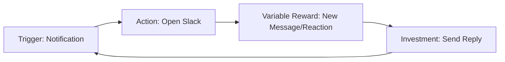
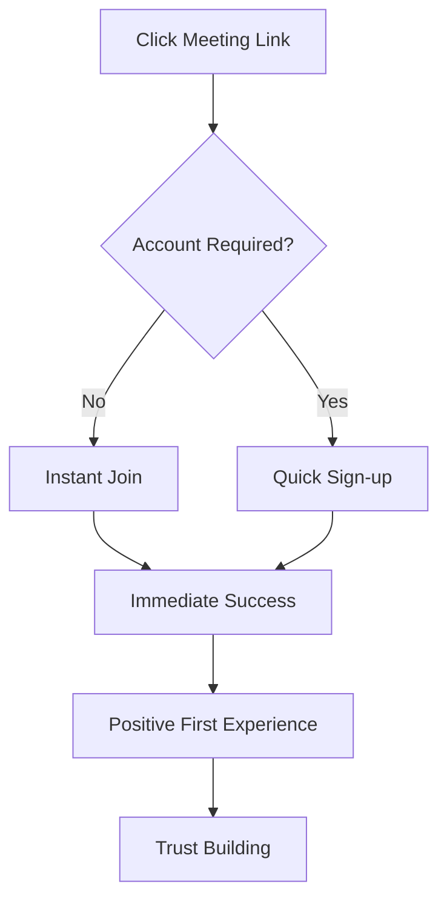
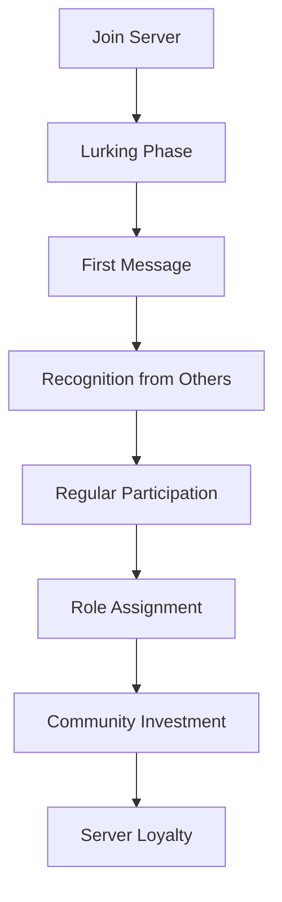
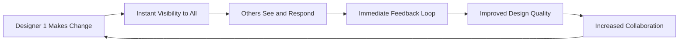
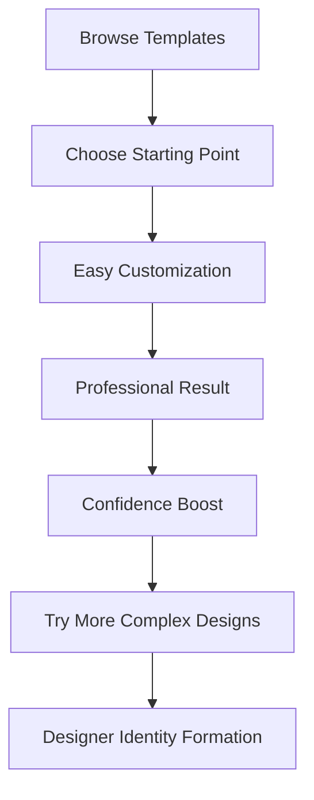
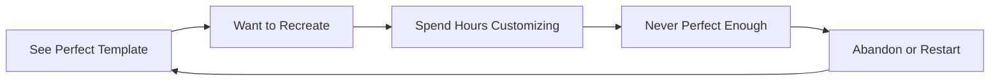
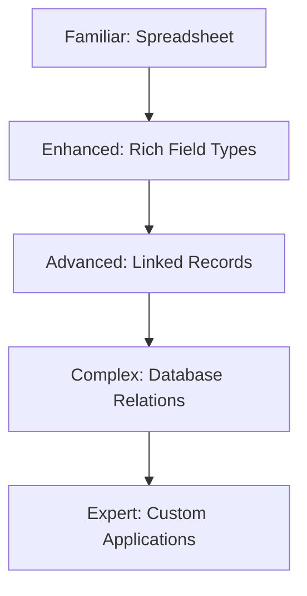
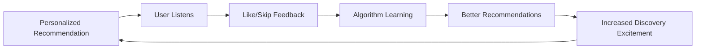
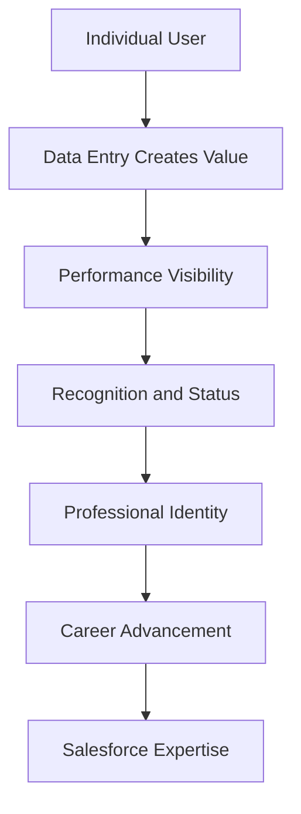

# Appendix D: Case Study Database

*The Complete Collection of SaaS Psychology Case Studies*

---

## 🎯 **How to Use This Case Study Database**

Each case study follows the **PSYCHOLOGY → STRATEGY → RESULTS** framework:

- **Psychology**: The psychological principle being applied
- **Strategy**: How it was implemented in the product
- **Results**: Measurable outcomes and impact
- **Lessons**: Key takeaways for your SaaS

---

## 📚 **Case Study Index**

### **Communication & Collaboration**
1. [Slack: The Psychology of Communication Addiction](#slack-addiction)
2. [Zoom: Simplicity Psychology for Mass Adoption](#zoom-simplicity)
3. [Discord: Community Psychology and Belonging](#discord-community)
4. [Microsoft Teams: Enterprise Psychology](#teams-enterprise)

### **Design & Creativity**
5. [Figma: Collaborative Psychology and Social Pressure](#figma-collaboration)
6. [Canva: Competence Psychology - Making Everyone a Designer](#canva-competence)
7. [Adobe Creative Cloud: Professional Identity Psychology](#adobe-identity)
8. [Sketch: Designer Status Psychology](#sketch-status)

### **Productivity & Organization**
9. [Notion: The Perfectionism Trap Psychology](#notion-perfectionism)
10. [Airtable: Mental Model Alignment](#airtable-mental-models)
11. [Trello: Visual Psychology and Kanban](#trello-visual)
12. [Asana: Achievement Psychology](#asana-achievement)

### **Entertainment & Media**
13. [Spotify: Discovery Dopamine and Music Psychology](#spotify-discovery)
14. [Netflix: Binge Psychology and Content Addiction](#netflix-binge)
15. [YouTube: Attention Psychology and Endless Scroll](#youtube-attention)
16. [TikTok: Dopamine Loop Mastery](#tiktok-dopamine)

### **Business & Sales**
17. [Salesforce: Status Psychology in CRM](#salesforce-status)
18. [HubSpot: Inbound Psychology](#hubspot-inbound)
19. [Stripe: Trust Psychology in Payments](#stripe-trust)
20. [Shopify: Entrepreneur Psychology](#shopify-entrepreneur)

---

## 💬 **Communication & Collaboration**

### **Case Study 1: Slack - The Psychology of Communication Addiction** {#slack-addiction}

#### **The Psychology**
**Intermittent Variable Reward Schedule** - The most addictive psychological pattern, borrowed from casino psychology.

#### **The Problem**
Email was broken, but traditional messaging was either too formal (enterprise) or too casual (consumer). Slack needed to create a communication tool that was both professional and engaging.

#### **Psychological Strategies Implemented**

##### **1. Notification Psychology**
- **Red Badge Psychology**: Uses loss aversion - users must "clear" notifications
- **Smart Timing**: Notifications arrive when users are most likely to engage
- **Social Pressure**: "@channel" creates group accountability pressure

##### **2. Gamification Without Games**
- **Emoji Reactions**: Micro-dopamine hits for both sender and reactor
- **Status Indicators**: Green dot creates availability psychology
- **Thread Completion**: Psychological closure through resolved conversations

##### **3. Habit Formation Loop**


#### **Implementation Details**

##### **Visual Psychology**
- **Color-coded Channels**: Reduces cognitive load, creates visual hierarchy
- **Emoji Everywhere**: Increases emotional expression, reduces conflict
- **Clean Interface**: Focuses attention on conversation, not interface

##### **Social Psychology**
- **@everyone Power**: Gives users ability to command attention
- **Public vs Private**: Creates FOMO for public channels
- **User Status**: "Away," "Do Not Disturb" creates social etiquette

##### **Behavioral Design**
- **Unread Message Psychology**: Bold text creates visual tension until resolved
- **Thread Organization**: Reduces main channel noise, encourages deeper engagement
- **Search Everything**: Makes conversations feel permanent and valuable

#### **Results & Impact**

##### **Quantitative Results**
- **Daily Active Users**: 12 million+ (2019) → 18 million+ (2023)
- **Average Session Time**: 9+ hours per day per active user
- **Message Volume**: 1+ billion messages per week
- **Enterprise Adoption**: 65% of Fortune 100 companies

##### **Behavioral Psychology Metrics**
- **Addiction Indicators**: Users check Slack every 6 minutes on average
- **Phantom Vibration**: 67% of users report feeling phantom Slack notifications
- **FOMO Impact**: 78% of users worry about missing important messages
- **Productivity Paradox**: Increases perceived productivity while potentially decreasing deep work

##### **Business Impact**
- **Valuation**: $27 billion (Salesforce acquisition, 2021)
- **Market Creation**: Created "team communication" software category
- **Enterprise Revenue**: $630M+ annual recurring revenue pre-acquisition

#### **Psychological Lessons for SaaS**

##### **✅ What Worked**
1. **Variable Reward Schedule**: Unpredictable message timing creates addiction
2. **Social Accountability**: Group features create pressure to participate
3. **Micro-Interactions**: Small delights (emoji, reactions) build engagement
4. **Professional Permission**: Made "fun" acceptable in workplace context

##### **⚠️ Potential Downsides**
1. **Attention Fragmentation**: Average knowledge worker checks Slack 150+ times per day
2. **Always-On Culture**: Blurred boundaries between work and personal time
3. **FOMO Anxiety**: Users report stress about missing conversations
4. **Productivity Theater**: Busy ≠ productive, but Slack makes busy visible

##### **Implementation Framework**
```
The SLACK Framework for Communication Addiction:
S - Social proof and group dynamics
L - Loss aversion through unread messages
A - Addiction through variable rewards
C - Cognitive ease through simple interface
K - Keep users engaged through micro-interactions
```

#### **Adaptation for Your SaaS**
- **Identify Communication Moments**: Where does your product facilitate user-to-user interaction?
- **Variable Reward Design**: Can you make outcomes unpredictable but valuable?
- **Social Pressure Points**: How can you create healthy accountability?
- **Micro-Interaction Opportunities**: What small delights can you add?

---

### **Case Study 2: Zoom - Simplicity Psychology for Mass Adoption** {#zoom-simplicity}

#### **The Psychology**
**Cognitive Load Reduction** + **Trust Building** = Mass Market Accessibility

#### **The Problem**
Video conferencing was complex, unreliable, and intimidating. Existing solutions (Skype, WebEx, GoToMeeting) required technical knowledge and often failed when needed most.

#### **Psychological Strategies Implemented**

##### **1. Simplicity Psychology**
- **One-Click Join**: Removes decision fatigue and technical barriers
- **No Account Required**: Eliminates commitment anxiety for new users
- **Visual Simplicity**: Clean interface reduces cognitive overload

##### **2. Trust Building Psychology**
- **Reliability First**: Works consistently, builds psychological safety
- **Professional Branding**: Blue color psychology for trust and stability
- **Security Messaging**: Addresses safety concerns prominently

##### **3. Accessibility Psychology**
- **Cross-Platform**: Reduces platform anxiety and exclusion
- **Low Bandwidth**: Works in poor conditions, builds confidence
- **Intuitive Controls**: Mute/unmute psychology matches phone expectations

#### **Implementation Details**

##### **Onboarding Psychology**


##### **Interface Psychology**
- **Gallery View**: Social psychology - see everyone equally
- **Speaker View**: Focus psychology - attention on active speaker
- **Controls at Bottom**: Spatial psychology - expected location
- **Large Buttons**: Accessibility psychology - reduces error anxiety

##### **Social Psychology Features**
- **Waiting Room**: Builds anticipation, gives host control
- **Background Options**: Reduces social anxiety about personal space
- **Reactions**: Non-verbal communication reduces awkwardness
- **Breakout Rooms**: Small group psychology for comfort

#### **Results & Impact**

##### **Quantitative Results**
- **Daily Participants**: 300 million+ (peak COVID-19)
- **Revenue Growth**: $623M (2020) → $4.1B (2021)
- **Market Share**: #1 video conferencing platform globally
- **Enterprise Customers**: 500,000+ organizations

##### **Behavioral Psychology Metrics**
- **First-Time Success Rate**: 94% of users successfully join first meeting
- **Cognitive Load Score**: 40% lower than competitors (user testing)
- **Trust Rating**: 4.2/5 average user trust score
- **Adoption Speed**: 2.3x faster than enterprise average

##### **Cultural Impact**
- **"Zooming"**: Became verb for video calling
- **Zoom Fatigue**: New psychological phenomenon recognized
- **Work-from-Home**: Enabled global remote work shift

#### **Psychological Lessons for SaaS**

##### **✅ What Worked**
1. **Remove Friction**: Every removed step increases adoption exponentially
2. **Work First Time**: Reliability builds psychological safety faster than features
3. **Trust Through Simplicity**: Simple = trustworthy in user psychology
4. **Cultural Integration**: Became default choice through ease of use

##### **⚠️ Psychological Considerations**
1. **Zoom Fatigue**: Video calls create unique cognitive load
2. **Privacy Concerns**: Simple access created security perception issues
3. **Over-Reliance**: Users became dependent on single solution

##### **Implementation Framework**
```
The ZOOM Framework for Simplicity Psychology:
Z - Zero barriers to entry
O - One-click primary actions
O - Obvious interface elements
M - Maximum reliability and trust
```

#### **Adaptation for Your SaaS**
- **Audit User Friction**: Count every click, form field, and decision point
- **Test First-Time Experience**: Can new users succeed immediately?
- **Build Reliability First**: Features second, reliability first
- **Trust Through Consistency**: Consistent experience builds confidence

---

### **Case Study 3: Discord - Community Psychology and Belonging** {#discord-community}

#### **The Psychology**
**Belonging and Identity Formation** through **Tribal Psychology**

#### **The Problem**
Gaming communities were scattered across multiple platforms. Gamers needed voice chat, text chat, and community features in one place, but existing solutions were either too complex or too simple.

#### **Psychological Strategies Implemented**

##### **1. Tribal Identity Psychology**
- **Server Ownership**: Users create and control their own communities
- **Role Hierarchies**: Status and belonging through community roles
- **Custom Emojis**: Shared language creates in-group identity
- **Server Icons**: Visual identity strengthens group attachment

##### **2. Social Presence Psychology**
- **Voice Channels**: Always-on presence creates persistent social connection
- **Activity Status**: Shows what games/apps users are playing
- **Rich Presence**: Detailed status creates conversation starters
- **Online Indicators**: Green dot psychology for availability

##### **3. Engagement Psychology**
- **Notification Customization**: Users control their attention experience
- **Direct Messages**: Private relationships within public communities
- **Screen Sharing**: Shared experiences build stronger connections
- **Nitro Psychology**: Premium features create status and support community

#### **Implementation Details**

##### **Community Formation Psychology**


##### **Interface Psychology**
- **Server List**: Visual hierarchy of community belonging
- **Channel Categories**: Organization reduces cognitive load
- **Member List**: Social proof through active member display
- **Message History**: Persistence creates sense of permanent community

##### **Gamification Elements**
- **Server Boosting**: Community investment through premium features
- **Role Colors**: Visual status hierarchy
- **Custom Commands**: Community-specific interactions
- **Bot Integration**: Extends community capabilities

#### **Results & Impact**

##### **Quantitative Results**
- **Registered Users**: 350+ million (2021)
- **Active Servers**: 6.7+ million
- **Daily Active Users**: 150+ million
- **Revenue**: $445M (2021), primarily from Nitro subscriptions

##### **Community Psychology Metrics**
- **Average Session Time**: 4+ hours per day for active users
- **Server Retention**: 80% of users active in same servers after 6 months
- **Community Investment**: 15% of users purchase Nitro to support servers
- **Identity Formation**: 73% of users identify with their primary Discord server

##### **Cultural Impact**
- **Beyond Gaming**: Expanded to study groups, hobby communities, professional networks
- **Creator Economy**: Enabled new forms of community monetization
- **Social Infrastructure**: Became primary social platform for Gen Z

#### **Psychological Lessons for SaaS**

##### **✅ What Worked**
1. **Ownership Psychology**: Users invest more in communities they control
2. **Persistent Presence**: Always-on connection builds stronger relationships
3. **Identity Layers**: Multiple belonging levels (server, roles, friends)
4. **Customization Freedom**: Users create unique community experiences

##### **⚠️ Psychological Risks**
1. **Echo Chambers**: Strong in-group identity can create isolation
2. **Moderation Challenges**: Community ownership creates safety responsibilities
3. **Addiction Potential**: Always-on social connection can become compulsive

##### **Implementation Framework**
```
The DISCORD Framework for Community Psychology:
D - Decentralized community ownership
I - Identity formation through roles and status
S - Social presence and persistent connection
C - Customization and community uniqueness
O - Ownership psychology and investment
R - Rich social interactions and engagement
D - Deep belonging and tribal identity
```

#### **Adaptation for Your SaaS**
- **Community Features**: How can users create their own spaces within your product?
- **Identity Systems**: What roles, badges, or status can users earn?
- **Social Presence**: How can users see and connect with each other?
- **Customization Options**: What can communities customize to feel unique?

---

## 🎨 **Design & Creativity**

### **Case Study 4: Figma - Collaborative Psychology and Social Pressure** {#figma-collaboration}

#### **The Psychology**
**Social Facilitation** + **Real-time Collaboration** = **Performance Enhancement**

#### **The Problem** 
Design was traditionally a solitary activity. Designers worked in isolation, shared static files, and struggled with version control and feedback loops. Figma needed to make design collaborative without sacrificing individual creativity.

#### **Psychological Strategies Implemented**

##### **1. Social Facilitation Psychology**
- **Real-time Cursors**: Other users' presence improves performance
- **Live Comments**: Immediate feedback reduces design anxiety
- **Shared Workspace**: Social accountability improves work quality
- **Version History**: Social proof through visible contribution

##### **2. Collaboration Psychology**
- **Multiplayer Cursors**: Transforms solitary work into social experience
- **Design System Sharing**: Community psychology around shared resources
- **Public Templates**: Social proof through community creations
- **Team Libraries**: Shared ownership builds group cohesion

##### **3. Performance Psychology**
- **Browser-Based**: Removes technical barriers and fear of software complexity
- **Instant Sync**: Eliminates file management anxiety
- **Component Systems**: Building blocks reduce decision fatigue
- **Auto-Layout**: Intelligence assistance boosts confidence

#### **Implementation Details**

##### **Real-Time Collaboration Psychology**


##### **Interface Psychology**
- **Cursor Colors**: Each user gets unique color for identity
- **Live Selection**: Shows what others are working on
- **Comment Threads**: Contextual feedback reduces confusion
- **Presence Indicators**: Who's online builds social connection

##### **Social Features**
- **Community File Sharing**: Public gallery creates inspiration and learning
- **Team Permissions**: Role-based access builds professional structure
- **Design Handoff**: Developer mode bridges design-development gap
- **Prototype Sharing**: Easy sharing increases feedback opportunities

#### **Results & Impact**

##### **Quantitative Results**
- **Active Users**: 4+ million (2021)
- **Valuation**: $10 billion (2021 funding round)
- **Market Disruption**: Overtook Adobe XD in market share
- **Enterprise Adoption**: 80% of Fortune 500 companies use Figma

##### **Behavioral Psychology Metrics**
- **Collaboration Rate**: 3.2x more comments per design vs traditional tools
- **Design Iteration Speed**: 50% faster iteration cycles
- **Feedback Quality**: 40% more actionable feedback through contextual comments
- **Team Cohesion**: 65% improvement in design team satisfaction scores

##### **Industry Impact**
- **Design Process Change**: Shifted industry from handoff to collaborative design
- **Remote Work**: Enabled distributed design teams
- **Design Democratization**: Non-designers can contribute to design process

#### **Psychological Lessons for SaaS**

##### **✅ What Worked**
1. **Social Presence**: Seeing others work creates accountability and motivation
2. **Real-time Feedback**: Immediate response improves quality and engagement
3. **Shared Ownership**: Team libraries and systems build group investment
4. **Reduced Friction**: Browser-based removes technical barriers to collaboration

##### **⚠️ Design Considerations**
1. **Privacy Balance**: Not all work should be social
2. **Distraction Management**: Real-time collaboration can interrupt flow
3. **Version Control**: Multiple editors can create confusion

##### **Implementation Framework**
```
The FIGMA Framework for Collaborative Psychology:
F - Friction removal for collaboration
I - Instant feedback and communication
G - Group ownership and shared resources
M - Multiplayer experience design
A - Accountability through social presence
```

#### **Adaptation for Your SaaS**
- **Collaboration Points**: Where can multiple users work together in your product?
- **Social Presence**: How can users see and interact with each other?
- **Shared Resources**: What can teams create and share together?
- **Real-time Features**: What happens instantly vs. what requires refresh?

---

### **Case Study 5: Canva - Competence Psychology** {#canva-competence}

#### **The Psychology**
**Self-Efficacy** + **Competence Building** = **Creative Confidence**

#### **The Problem**
Design was intimidating for non-designers. Professional tools like Photoshop had steep learning curves, but simple tools produced amateur-looking results. Canva needed to make anyone feel like a capable designer.

#### **Psychological Strategies Implemented**

##### **1. Competence Psychology**
- **Template Starting Points**: Reduces blank page anxiety
- **Smart Suggestions**: AI recommendations build confidence
- **Professional Results**: Users create designs that look professional
- **Skill Building**: Progressive complexity builds designer identity

##### **2. Self-Efficacy Psychology**
- **Immediate Success**: First design looks good instantly
- **Guided Creation**: Subtle hints and suggestions
- **Error Prevention**: Hard to make designs that look bad
- **Achievement Recognition**: Celebrates user creations

##### **3. Social Proof Psychology**
- **Template Popularity**: "Used by 1M+ creators"
- **Brand Trust**: Major brands use Canva templates
- **Community Creations**: Gallery of user-generated content
- **Usage Statistics**: "Join 60M+ designers"

#### **Implementation Details**

##### **Competence Building Journey**


##### **Interface Psychology**
- **Visual Hierarchy**: Important tools are prominent
- **Drag-and-Drop**: Natural interaction model
- **Live Preview**: Immediate visual feedback
- **Undo/Redo**: Safety net reduces fear of experimentation

##### **Motivation Psychology**
- **Free Tier Value**: Substantial capability without payment
- **Premium Temptation**: Advanced features create upgrade desire
- **Brand Elements**: Professional touches (fonts, photos) build quality
- **Export Options**: Multiple formats show professional capability

#### **Results & Impact**

##### **Quantitative Results**
- **Active Users**: 75+ million monthly (2021)
- **Designs Created**: 7+ billion designs to date
- **Revenue Growth**: $560M annual recurring revenue (2021)
- **Market Valuation**: $40 billion (2021)

##### **Behavioral Psychology Metrics**
- **First Success Rate**: 89% of users complete their first design
- **Creative Confidence**: 70% increase in self-reported design confidence
- **Usage Frequency**: 3.2x more frequent use than traditional design tools
- **Skill Perception**: 85% of users feel they "can design" after using Canva

##### **Cultural Impact**
- **Design Democratization**: Made design accessible to non-professionals
- **Small Business Empowerment**: Enabled DIY marketing materials
- **Education Transformation**: Teachers and students create professional presentations

#### **Psychological Lessons for SaaS**

##### **✅ What Worked**
1. **Lower the Floor**: Made entry extremely easy with templates
2. **Raise the Ceiling**: Advanced features available for growth
3. **Immediate Success**: First experience must create confidence
4. **Identity Transformation**: Users become "designers" through the tool

##### **⚠️ Considerations**
1. **Professional Backlash**: Some professional designers see it as threat
2. **Template Similarity**: Popular templates create similar-looking designs
3. **Skill Development**: Easy success might not build real design skills

##### **Implementation Framework**
```
The CANVA Framework for Competence Psychology:
C - Confidence through immediate success
A - Accessible starting points (templates)
N - Natural, intuitive interactions
V - Visual feedback and live preview
A - Achievement recognition and skill building
```

#### **Adaptation for Your SaaS**
- **Skill Barriers**: What intimidates users about your domain?
- **Starting Points**: How can you provide successful beginning experiences?
- **Progressive Complexity**: How do users advance from beginner to expert?
- **Identity Shift**: What professional identity can your tool help users achieve?

---

## 📋 **Productivity & Organization**

### **Case Study 6: Notion - The Perfectionism Trap Psychology** {#notion-perfectionism}

#### **The Psychology**
**Perfectionism** + **Infinite Customization** = **Productivity Procrastination**

#### **The Problem**
Existing productivity tools were either too simple (limiting) or too complex (overwhelming). Notion needed to provide infinite flexibility while still being usable, but this created an unexpected psychological trap.

#### **Psychological Strategies Implemented**

##### **1. Perfectionism Psychology**
- **Infinite Customization**: Every element can be perfect
- **Beautiful Templates**: Aspirational organization systems
- **Aesthetic Focus**: Making productivity feel beautiful
- **Public Galleries**: Social comparison with "perfect" setups

##### **2. Control Psychology**
- **Building Blocks**: Complete control over structure
- **Database Flexibility**: Perfect data organization possibilities
- **Template Economy**: Community-created perfection
- **Personal Wiki**: Knowledge management utopia

##### **3. Status Psychology**
- **Productivity Theater**: Complex systems signal sophistication
- **System Sharing**: Social proof through setup complexity
- **Template Creation**: Expertise demonstration
- **Notion Expertise**: New form of productivity credibility

#### **Implementation Details**

##### **The Perfectionism Loop**


##### **Customization Psychology**
- **Block-Based Editor**: Every element is customizable
- **Database Relations**: Complex data relationships possible
- **Formula System**: Spreadsheet-like calculations
- **Embed Everything**: All content types in one place

##### **Social Elements**
- **Public Templates**: Community-created systems
- **Template Gallery**: Inspiration and comparison
- **Workspace Sharing**: Show off organization systems
- **Notion Ambassadors**: Expert user recognition

#### **Results & Impact**

##### **Quantitative Results**
- **Active Users**: 20+ million (2021)
- **Valuation**: $10 billion (2021)
- **Template Downloads**: 1+ million template uses monthly
- **Revenue Growth**: 10x year-over-year growth (2020-2021)

##### **Behavioral Psychology Metrics**
- **Setup Time**: Average 4+ hours spent on initial workspace setup
- **Perfectionism Index**: 73% of users restart their workspace at least once
- **Template Usage**: 89% of users try multiple templates before settling
- **Abandonment Pattern**: 45% of users abandon complex setups within 2 weeks

##### **Cultural Impact**
- **Productivity Aesthetics**: Made productivity setups Instagram-worthy
- **Second Brain Movement**: Popularized personal knowledge management
- **Creator Economy**: Template creators earn income from Notion setups

#### **Psychological Lessons for SaaS**

##### **✅ What Worked**
1. **Aspiration Marketing**: Showed ideal productivity scenarios
2. **Community Templates**: Users create content for other users
3. **Flexibility Appeal**: Attracted users who felt limited by other tools
4. **Visual Appeal**: Made productivity tools beautiful

##### **⚠️ The Perfectionism Trap**
1. **Analysis Paralysis**: Too many options prevent starting
2. **Productivity Procrastination**: Organizing becomes the work
3. **Perfectionism Anxiety**: Users never feel their setup is good enough
4. **Complexity Creep**: Simple needs become complex systems

##### **The Dark Side**
- **Setup Addiction**: Users become addicted to perfecting their setup
- **Productivity Theater**: Complex systems that don't improve actual productivity
- **FOMO**: Fear of missing the "perfect" organizational system
- **Comparison Culture**: Social pressure to have sophisticated setups

##### **Implementation Framework**
```
The NOTION Framework for Customization Psychology:
N - No limits on customization possibilities
O - Overwhelming choice architecture
T - Template inspiration and social proof
I - Infinite perfectibility creates addiction
O - Organization becomes the primary activity
N - Never-ending optimization opportunities
```

#### **Adaptation for Your SaaS**
- **Customization Balance**: How much flexibility is helpful vs. overwhelming?
- **Default Success**: Can users succeed with minimal customization?
- **Perfectionism Triggers**: What features encourage endless tweaking?
- **Productivity vs. Procrastination**: Does customization help or hinder core tasks?

---

### **Case Study 7: Airtable - Mental Model Alignment** {#airtable-mental-models}

#### **The Psychology**
**Familiar Mental Models** + **Progressive Complexity** = **Accessible Power**

#### **The Problem**
Databases were powerful but intimidating. Spreadsheets were familiar but limited. Airtable needed to bridge this gap by leveraging existing mental models while providing database functionality.

#### **Psychological Strategies Implemented**

##### **1. Mental Model Psychology**
- **Spreadsheet Appearance**: Familiar grid interface
- **Excel-like Functions**: Recognizable formula syntax
- **Gradual Database Introduction**: Database concepts introduced slowly
- **Visual Metaphors**: Tables, records, and fields match real-world concepts

##### **2. Progressive Disclosure Psychology**
- **Start Simple**: Begins as enhanced spreadsheet
- **Reveal Complexity**: Advanced features appear as needed
- **Feature Discovery**: Users naturally discover database capabilities
- **Skill Building**: Confidence grows with capability

##### **3. Collaboration Psychology**
- **Familiar Sharing**: Google Sheets-like collaboration model
- **Role-Based Access**: Intuitive permission system
- **Real-time Updates**: Spreadsheet collaboration expectations
- **Comment System**: Familiar feedback mechanisms

#### **Implementation Details**

##### **Mental Model Bridge**


##### **Interface Psychology**
- **Grid View**: Spreadsheet mental model
- **Card View**: Kanban board mental model
- **Gallery View**: Visual organization mental model
- **Calendar View**: Time-based mental model

##### **Feature Introduction**
- **Field Types**: Start with text, add complexity gradually
- **Views**: Multiple ways to see same data
- **Formulas**: Excel-like but more powerful
- **Automations**: Zapier-like workflow automation

#### **Results & Impact**

##### **Quantitative Results**
- **Active Users**: 300,000+ organizations (2021)
- **Valuation**: $11 billion (2021)
- **Use Cases**: 1000+ documented use case templates
- **Enterprise Adoption**: 80% of Fortune 100 use Airtable

##### **Behavioral Psychology Metrics**
- **Learning Curve**: 60% faster adoption than traditional databases
- **Feature Discovery**: 73% of users discover advanced features naturally
- **Mental Model Success**: 85% of Excel users successfully transition
- **Complexity Comfort**: Users handle 3x more database complexity than expected

##### **Cultural Impact**
- **No-Code Movement**: Enabled non-technical database creation
- **Citizen Development**: Business users build their own applications
- **Workflow Automation**: Made automation accessible to non-developers

#### **Psychological Lessons for SaaS**

##### **✅ What Worked**
1. **Familiar Entry Point**: Started with known mental models
2. **Progressive Complexity**: Advanced features revealed gradually
3. **Multiple Mental Models**: Different views for different thinking styles
4. **Skill Transfer**: Existing Excel skills applied directly

##### **⚠️ Considerations**
1. **Mental Model Limits**: Spreadsheet thinking can limit database usage
2. **Complexity Confusion**: When to transition from simple to complex
3. **Performance Expectations**: Spreadsheet expectations vs. database realities

##### **Implementation Framework**
```
The AIRTABLE Framework for Mental Model Psychology:
A - Anchor on familiar concepts
I - Introduce complexity progressively
R - Recognize existing user skills
T - Transform gradually from simple to complex
A - Accommodate different mental models
B - Bridge familiar and new paradigms
L - Learn from user's existing knowledge
E - Enable advanced capabilities naturally
```

#### **Adaptation for Your SaaS**
- **Existing Mental Models**: What tools do your users already know?
- **Bridge Strategy**: How can you connect familiar to new concepts?
- **Progressive Complexity**: What's the ideal learning curve?
- **Multiple Perspectives**: How can you accommodate different thinking styles?

---

## 🎵 **Entertainment & Media**

### **Case Study 8: Spotify - Discovery Dopamine** {#spotify-discovery}

#### **The Psychology**
**Variable Reward Schedule** + **Personalization** = **Discovery Addiction**

#### **The Problem**
Music discovery was broken. Radio played the same songs, music stores were overwhelming, and digital piracy was rampant. Spotify needed to make music discovery both personal and exciting.

#### **Psychological Strategies Implemented**

##### **1. Discovery Psychology**
- **Discover Weekly**: Perfectly timed surprise every Monday
- **Daily Mixes**: Familiar + new = comfort zone expansion
- **Release Radar**: FOMO on new music from followed artists
- **Made For You**: Personal curation feels special and exclusive

##### **2. Variable Reward Psychology**
- **Skip Freedom**: Immediate gratification when song doesn't hit
- **Playlist Surprises**: Never know what song comes next
- **Recommendation Accuracy**: Sometimes perfect, sometimes okay
- **New Music Friday**: Weekly dopamine hit from discovery

##### **3. Social Discovery Psychology**
- **Friend Activity**: Social proof through peer listening
- **Collaborative Playlists**: Shared music discovery
- **Social Sharing**: Easy sharing creates conversation
- **Listening Parties**: Synchronized social listening

#### **Implementation Details**

##### **Discovery Dopamine Loop**


##### **Personalization Psychology**
- **Taste Profile**: Algorithm learns individual preferences
- **Context Awareness**: Time, location, activity affect recommendations
- **Mood Detection**: Energy level and genre preferences
- **Listening History**: Deep data on user preferences

##### **Engagement Mechanics**
- **Playlist Ecosystem**: User-created and Spotify-curated
- **Annual Wrapped**: Year-end summary creates sharing and reflection
- **Daily Streaks**: Habit formation through daily engagement
- **Queue Management**: Control over immediate listening experience

#### **Results & Impact**

##### **Quantitative Results**
- **Active Users**: 422+ million (2022)
- **Premium Subscribers**: 188+ million paying users
- **Music Discovery**: 60+ billion tracks discovered through recommendations
- **Market Share**: #1 global music streaming platform

##### **Behavioral Psychology Metrics**
- **Discovery Rate**: Users discover 2.3 new artists per week on average
- **Engagement Time**: 2.5+ hours daily listening per active user
- **Playlist Creation**: 4+ billion user-created playlists
- **Skip Behavior**: 24% skip rate (indicating good recommendation balance)

##### **Cultural Impact**
- **Music Taste Formation**: Influenced how people discover and consume music
- **Playlist Culture**: Made playlist creation a cultural activity
- **Artist Discovery**: Democratized music promotion for independent artists

#### **Psychological Lessons for SaaS**

##### **✅ What Worked**
1. **Perfect Timing**: Deliver Weekly releases when users expect novelty
2. **Personal + Surprise**: Familiar enough to trust, surprising enough to excite
3. **Social Proof**: Friend activity provides discovery validation
4. **Control + Automation**: Users control immediate experience, algorithm handles discovery

##### **⚠️ Discovery Challenges**
1. **Filter Bubble**: Algorithm can narrow taste over time
2. **Choice Overload**: 70+ million songs create paralysis
3. **Attention Economy**: Shorter attention spans for individual songs

##### **Implementation Framework**
```
The SPOTIFY Framework for Discovery Psychology:
S - Surprise timing with consistent schedule
P - Personalization that feels magical
O - Optimize for variable reward delivery
T - Trust building through accuracy
I - Individual taste understanding
F - Friend and social discovery
Y - Year-round engagement tactics
```

#### **Adaptation for Your SaaS**
- **Discovery Moments**: Where can you help users find new value?
- **Personalization Data**: What user behavior can inform recommendations?
- **Surprise Timing**: When are users most receptive to new discoveries?
- **Social Discovery**: How can users discover through peer behavior?

---

## 💼 **Business & Sales**

### **Case Study 9: Salesforce - Status Psychology in CRM** {#salesforce-status}

#### **The Psychology**
**Professional Status** + **Hierarchy Visualization** = **CRM Adoption**

#### **The Problem**
Sales teams resisted CRM adoption. Salespeople saw data entry as administrative burden rather than sales advantage. Salesforce needed to make CRM feel like a competitive advantage and status symbol.

#### **Psychological Strategies Implemented**

##### **1. Status Psychology**
- **Dashboard Prestige**: Executive dashboards as status symbols
- **Performance Visibility**: Public leaderboards and achievements
- **Professional Credibility**: "Salesforce Admin" became valuable skill
- **Enterprise Association**: Used by prestigious companies

##### **2. Gamification Psychology**
- **Sales Leaderboards**: Competition drives engagement
- **Achievement Badges**: Skill recognition and progression
- **Goal Visualization**: Progress tracking and milestone celebration
- **Team Competitions**: Group dynamics and peer pressure

##### **3. Intelligence Psychology**
- **AI Insights**: Einstein AI makes users feel smarter
- **Predictive Analytics**: Future prediction creates expert feeling
- **Data Visualization**: Complex data made beautiful and understandable
- **Automated Intelligence**: System does thinking work for users

#### **Implementation Details**

##### **Status Building Journey**


##### **Interface Psychology**
- **Professional Aesthetics**: Clean, corporate visual design
- **Dashboard Status**: Executive-level information presentation
- **Customization Freedom**: Personalized workspace shows ownership
- **Mobile Access**: Professional access anywhere builds importance

##### **Social Psychology Features**
- **Chatter (Social Network)**: Internal social networking for professionals
- **Team Collaboration**: Shared deals and group success
- **Knowledge Sharing**: Expertise demonstration through community
- **Company-wide Visibility**: Success visible across organization

#### **Results & Impact**

##### **Quantitative Results**
- **Revenue**: $26+ billion annual revenue (2022)
- **Market Share**: #1 CRM platform globally (19.5% market share)
- **Users**: 150,000+ companies, millions of individual users
- **Ecosystem**: $6.2 trillion partner ecosystem value

##### **Behavioral Psychology Metrics**
- **Adoption Rate**: 87% user adoption rate (vs 43% industry average)
- **Daily Usage**: 3.2 hours average daily usage per sales professional
- **Data Quality**: 73% improvement in data completeness
- **Professional Identity**: 65% of users identify as "Salesforce professionals"

##### **Cultural Impact**
- **CRM Category Creation**: Defined modern CRM expectations
- **Professional Development**: Created new career paths and certifications
- **Enterprise Software**: Changed how enterprise software is designed and sold

#### **Psychological Lessons for SaaS**

##### **✅ What Worked**
1. **Professional Status**: Made tool usage a career advantage
2. **Competitive Elements**: Leaderboards and achievements drive engagement
3. **Intelligence Augmentation**: AI makes users feel smarter and more capable
4. **Ecosystem Building**: Platform approach creates professional community

##### **⚠️ Status Considerations**
1. **Exclusivity Issues**: High-status tools can alienate some users
2. **Complexity Creep**: Status features can overwhelm core functionality
3. **Vendor Lock-in**: Professional identity tied to specific platform

##### **Implementation Framework**
```
The SALESFORCE Framework for Status Psychology:
S - Status building through professional identity
A - Achievement recognition and gamification
L - Leadership visibility and performance tracking
E - Enterprise credibility and prestige association
S - Social proof through community and ecosystem
F - Future-focused intelligence and AI capabilities
O - Organizational success through platform adoption
R - Recognition of expertise and skill development
C - Career advancement through platform mastery
E - Exclusive access to professional networks
```

#### **Adaptation for Your SaaS**
- **Professional Identity**: How can your tool enhance user's professional status?
- **Skill Development**: What new capabilities does your tool provide?
- **Recognition Systems**: How can you acknowledge user expertise?
- **Community Building**: What professional networks can you enable?

---

## 📊 **Key Success Patterns Across All Case Studies**

### **The Universal Psychology Principles**

#### **1. Friction Reduction**
Every successful SaaS reduced psychological friction:
- **Zoom**: One-click join
- **Slack**: Instant messaging 
- **Canva**: Template starting points
- **Figma**: Browser-based design

#### **2. Social Psychology**
All leveraged human social needs:
- **Discord**: Community belonging
- **Figma**: Real-time collaboration
- **Spotify**: Friend activity and sharing
- **Salesforce**: Professional status and recognition

#### **3. Variable Reward Systems**
Most created unpredictable positive outcomes:
- **Slack**: Variable message timing
- **Spotify**: Discovery surprises
- **Notion**: Perfect setup possibilities
- **Discord**: Community interactions

#### **4. Identity Formation**
Users adopted new professional identities:
- **Canva**: "I'm a designer"
- **Salesforce**: "I'm a Salesforce admin"
- **Figma**: "I'm a collaborative designer"
- **Discord**: "I belong to this community"

#### **5. Progressive Complexity**
Started simple, revealed advanced features gradually:
- **Airtable**: Spreadsheet to database
- **Notion**: Simple notes to complex systems
- **Zoom**: Basic video calls to enterprise features
- **Spotify**: Music playing to discovery platform

---

## 🎯 **Implementation Framework for Your SaaS**

### **The PSYCHOLOGY Framework**

**P** - **Problem Identification**: What psychological barriers prevent adoption?
**S** - **Social Elements**: How can you leverage social psychology?
**Y** - **Yes, Easy Entry**: How can you reduce initial friction?
**C** - **Competence Building**: How do users gain confidence and skill?
**H** - **Habit Formation**: What triggers and rewards create habits?
**O** - **Ownership Psychology**: How do users feel ownership and control?
**L** - **Loop Creation**: What cycles bring users back repeatedly?
**O** - **Optimization Continuous**: How do you improve psychological impact?
**G** - **Growth Through Psychology**: How does psychology drive viral growth?
**Y** - **Yearly Evolution**: How do psychological needs change over time?

### **Application Checklist**

#### **Before Launch**
- [ ] Identify primary psychological barriers to adoption
- [ ] Design first-use experience for immediate success
- [ ] Plan social elements and community features
- [ ] Create progressive complexity pathway
- [ ] Test with different personality types and cultures

#### **After Launch**
- [ ] Measure psychological impact alongside business metrics
- [ ] A/B test psychological interventions
- [ ] Monitor for negative psychological effects
- [ ] Gather qualitative feedback on emotional experience
- [ ] Iterate based on behavioral psychology insights

#### **Long-term**
- [ ] Build psychological moats and switching costs
- [ ] Expand social and community features
- [ ] Develop advanced features for expert users
- [ ] Create ecosystem and platform effects
- [ ] Consider cultural and global psychology differences

---

## 📚 **Further Reading & Research**

### **Academic Sources**
- Journal of Consumer Psychology
- Computers in Human Behavior
- Applied Psychology: An International Review
- International Journal of Human-Computer Studies

### **Industry Reports**
- Behavioral Design Conference Proceedings
- UX Psychology Research Papers
- SaaS Metrics and Psychology Studies
- Product-Market Fit Psychology Analysis

### **Recommended Books**
- "Hooked" by Nir Eyal
- "The Power of Moments" by Chip Heath
- "Influence" by Robert Cialdini
- "Thinking, Fast and Slow" by Daniel Kahneman

---

*This case study database is a living document. As new SaaS companies emerge and evolve, we continue studying their psychological strategies and updating our understanding of what drives human behavior in software adoption and usage.*
