# Chapter 4: The Psychology of Persuasion in SaaS

> *"The art of persuasion is knowing what people want and showing them how they can get it in a way that serves their interests and yours."* - Robert Cialdini

## Table of Contents
- [Introduction: Ethical Influence in SaaS](#introduction-ethical-influence-in-saas)
- [The Science of Persuasion](#the-science-of-persuasion)
- [Cialdini's Six Principles in SaaS Context](#cialdinis-six-principles-in-saas-context)
- [The Elaboration Likelihood Model](#the-elaboration-likelihood-model)
- [Persuasive Design Patterns](#persuasive-design-patterns)
- [Building Trust Through Persuasive Elements](#building-trust-through-persuasive-elements)
- [The Psychology of Pricing and Value](#the-psychology-of-pricing-and-value)
- [Onboarding Persuasion Strategies](#onboarding-persuasion-strategies)
- [Feature Adoption Through Persuasion](#feature-adoption-through-persuasion)
- [Ethical Boundaries in Persuasive Design](#ethical-boundaries-in-persuasive-design)
- [Case Studies: Persuasion Masters](#case-studies-persuasion-masters)
- [Measuring Persuasive Effectiveness](#measuring-persuasive-effectiveness)
- [Implementation Framework](#implementation-framework)
- [Conclusion: Persuasion as Service](#conclusion-persuasion-as-service)

---

## Introduction: Ethical Influence in SaaS

Persuasion in SaaS isn't about manipulation—it's about helping users make decisions that benefit them while achieving business objectives. The most successful SaaS products excel at guiding users toward actions that create mutual value.

In a world overwhelmed with choices, users actually appreciate well-designed persuasive elements that help them navigate complexity and make confident decisions. When done ethically, persuasion serves users by reducing decision fatigue and highlighting the most beneficial paths forward.

### The Persuasion Spectrum in SaaS

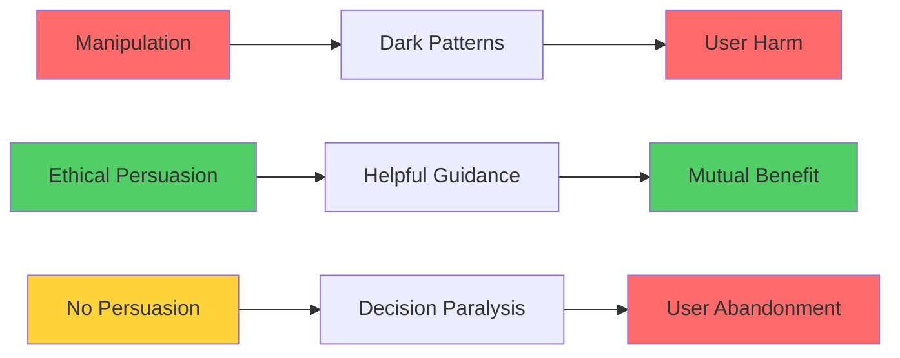

### The Business Case for Ethical Persuasion

| Metric | No Persuasion | Ethical Persuasion | Manipulation |
|--------|---------------|-------------------|--------------|
| **User Trust** | Neutral | High | Negative |
| **Short-term Conversion** | Low | High | Very High |
| **Long-term Retention** | Medium | High | Very Low |
| **Brand Reputation** | Neutral | Positive | Damaged |
| **Word of Mouth** | Limited | Positive | Negative |
| **LTV:CAC Ratio** | 2:1 | 8:1 | 1:1 |

---

## The Science of Persuasion

### Neurological Basis of Persuasion

#### Dual-Process Theory in Decision Making
Understanding how the brain processes persuasive information:

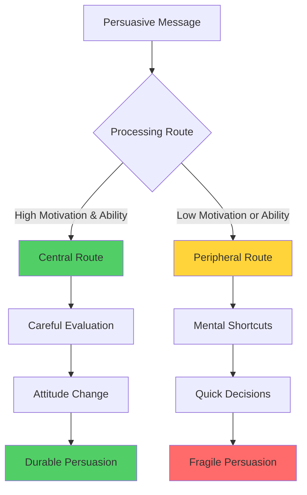

#### Cognitive Biases as Persuasive Tools

| Bias | Definition | SaaS Application | Ethical Use |
|------|------------|------------------|-------------|
| **Anchoring** | First information influences all subsequent judgments | Pricing displays | Show value, not manipulate |
| **Social Proof** | People follow others' behavior | User testimonials | Genuine reviews only |
| **Scarcity** | Perceived rarity increases value | Limited-time offers | Real limitations only |
| **Authority** | Deference to expertise | Expert recommendations | Legitimate expertise |
| **Reciprocity** | Obligation to return favors | Free trials, content | Genuine value provision |

### The Psychology of Decision Making

#### The DECIDE Framework
How users make decisions in SaaS environments:

**D** - **Define** the problem clearly
**E** - **Establish** criteria for solutions
**C** - **Consider** alternatives
**I** - **Identify** best alternatives
**D** - **Develop** and implement action plan
**E** - **Evaluate** and monitor outcomes

#### Decision-Making Challenges in SaaS

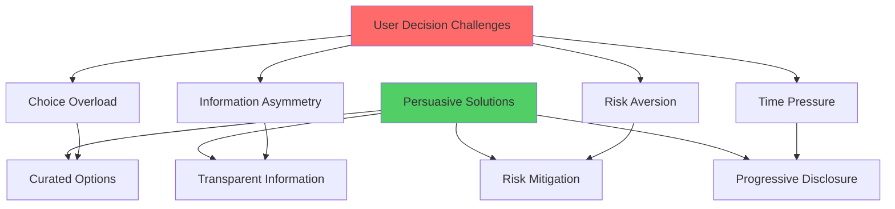

---

## Cialdini's Six Principles in SaaS Context

### 1. Reciprocity: The Foundation of SaaS Relationships

#### The Psychology of Reciprocity
People feel obligated to return favors, even when the initial gesture was unsolicited.

**SaaS Applications:**
- Free trials and freemium models
- Educational content and resources
- Customer success support
- Product documentation and tutorials

#### Reciprocity Implementation Strategy

| Stage | Reciprocity Trigger | User Response | Business Outcome |
|-------|-------------------|---------------|------------------|
| **Awareness** | Free valuable content | Interest and attention | Lead generation |
| **Trial** | Extended trial period | Deeper engagement | Higher conversion |
| **Onboarding** | Personal setup assistance | Loyalty and appreciation | Reduced churn |
| **Usage** | Proactive support | Trust and advocacy | Expansion revenue |

#### Measuring Reciprocity Impact

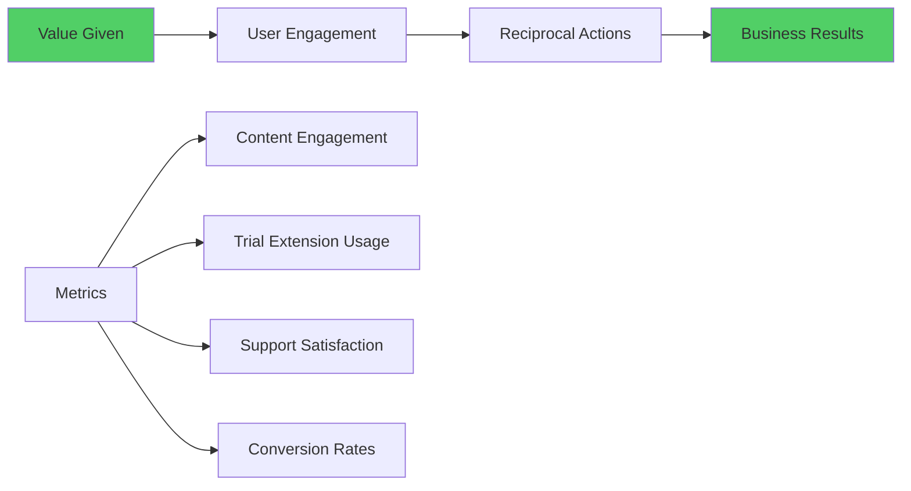

### 2. Commitment and Consistency: Building User Investment

#### The Psychology of Consistency
People strive to appear consistent with their previous decisions and public commitments.

**SaaS Applications:**
- Goal setting during onboarding
- Public commitments to usage patterns
- Customization and personalization choices
- Progressive commitment sequences

#### The Commitment Escalation Ladder

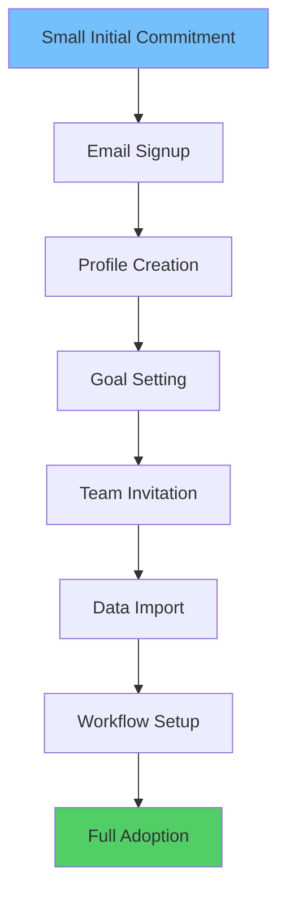

#### Consistency Techniques in SaaS

| Technique | Implementation | Psychological Effect | Business Result |
|-----------|----------------|---------------------|----------------|
| **Goal Commitment** | Users set usage goals | Internal motivation | 67% higher engagement |
| **Public Declarations** | Share achievements | Social pressure | 45% better retention |
| **Choice Architecture** | Users customize interface | Ownership feeling | 89% more feature adoption |
| **Progress Tracking** | Visual progress indicators | Completion drive | 156% task completion |

### 3. Social Proof: The Power of Peer Influence

#### Types of Social Proof in SaaS

**1. User Social Proof**
- Number of users/customers
- Usage statistics and metrics
- Customer success stories

**2. Expert Social Proof**
- Industry leader endorsements
- Expert testimonials
- Awards and certifications

**3. Peer Social Proof**
- Similar company usage
- Industry-specific adoption
- Peer recommendations

#### Social Proof Design Patterns

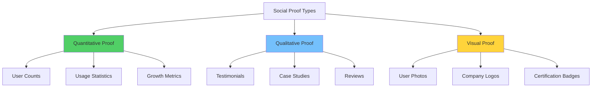

#### Social Proof Effectiveness by Context

| Context | Most Effective Proof Type | Impact on Conversion |
|---------|---------------------------|---------------------|
| **Homepage** | User count + company logos | +34% signup rate |
| **Pricing Page** | Similar company testimonials | +67% trial starts |
| **Feature Pages** | Usage statistics | +45% feature adoption |
| **Checkout** | Recent customer activity | +23% conversion rate |

### 4. Liking: Building Affinity and Connection

#### The Components of Liking
- **Similarity:** Users like products that reflect their values
- **Familiarity:** Repeated exposure increases preference
- **Attractiveness:** Visual appeal influences perception
- **Cooperation:** Working together toward common goals

#### Building Liking in SaaS Design

| Component | SaaS Implementation | User Response |
|-----------|-------------------|---------------|
| **Similarity** | Industry-specific messaging | "This is for people like me" |
| **Familiarity** | Consistent brand presence | Comfort and trust |
| **Attractiveness** | Beautiful, intuitive design | Positive first impressions |
| **Cooperation** | Collaborative goal achievement | Partnership feeling |

#### Liking Through Personalization

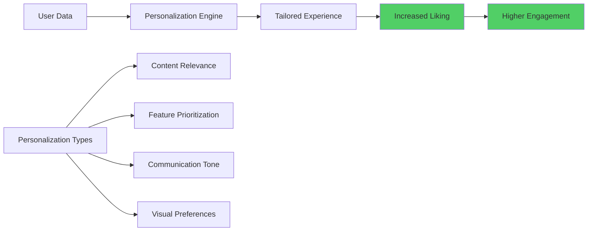

### 5. Authority: Establishing Credibility and Expertise

#### Sources of Authority in SaaS
- **Expertise Authority:** Deep knowledge and experience
- **Position Authority:** Industry leadership and recognition
- **Moral Authority:** Ethical practices and values alignment
- **User Authority:** Customer success and advocacy

#### Building Authority Through Design

| Authority Type | Design Elements | Trust Indicators |
|----------------|----------------|------------------|
| **Expertise** | Detailed documentation, thought leadership content | Comprehensive knowledge base |
| **Position** | Awards, press mentions, industry rankings | Third-party validation |
| **Moral** | Transparency reports, ethical practices | Values alignment |
| **User** | Success stories, growth metrics | Peer validation |

#### Authority Hierarchy in SaaS

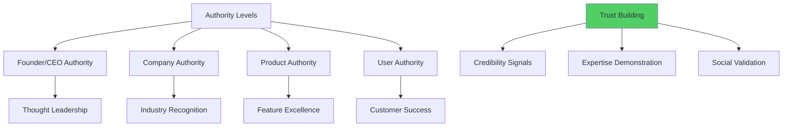

### 6. Scarcity: Creating Urgency Without Manipulation

#### Ethical Scarcity in SaaS
True scarcity vs. artificial scarcity:

| Ethical Scarcity | Manipulative Scarcity |
|------------------|----------------------|
| Limited beta access spots | Fake countdown timers |
| Genuine capacity constraints | Artificial availability limits |
| Time-sensitive offers | Perpetual "limited time" deals |
| Early-bird pricing | False urgency creation |

#### Scarcity Psychology in SaaS Context

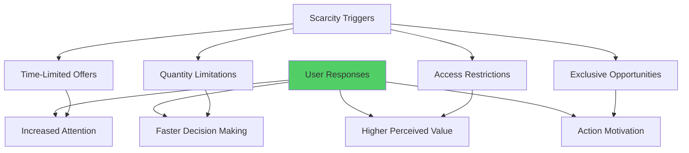

---

## The Elaboration Likelihood Model

### Central vs. Peripheral Processing Routes

#### Central Route Persuasion
When users have high motivation and ability to process information:

**Characteristics:**
- Careful evaluation of arguments
- Focus on product benefits and features
- Logical decision-making process
- Durable attitude change

**SaaS Design Implications:**
- Detailed product information
- Comprehensive comparisons
- In-depth case studies
- Technical documentation

#### Peripheral Route Persuasion
When users have low motivation or ability to process information:

**Characteristics:**
- Reliance on mental shortcuts
- Focus on surface-level cues
- Quick decision-making
- Less durable attitude change

**SaaS Design Implications:**
- Social proof indicators
- Authority signals
- Visual appeal
- Simple decision pathways

### Designing for Both Routes

#### Dual-Route Design Strategy

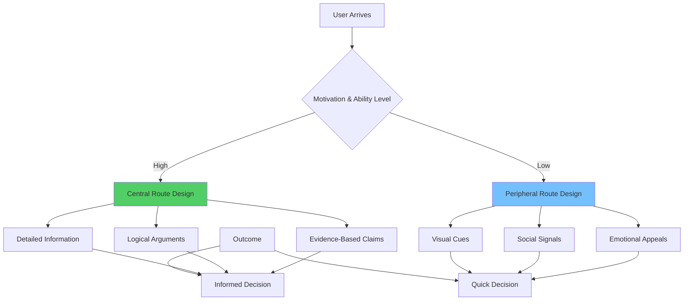

#### Adaptive Persuasion Interfaces

| User Segment | Processing Style | Persuasion Strategy | Key Elements |
|--------------|------------------|--------------------|--------------| 
| **Power Users** | Central route | Detailed information | Feature comparisons, technical specs |
| **Casual Users** | Peripheral route | Social proof | User testimonials, popularity metrics |
| **Decision Makers** | Central route | ROI evidence | Case studies, data analysis |
| **Influencers** | Peripheral route | Authority signals | Expert endorsements, awards |

---

## Persuasive Design Patterns

### The Persuasion Hierarchy

#### Primary Persuasive Patterns
The most impactful persuasive elements in SaaS:

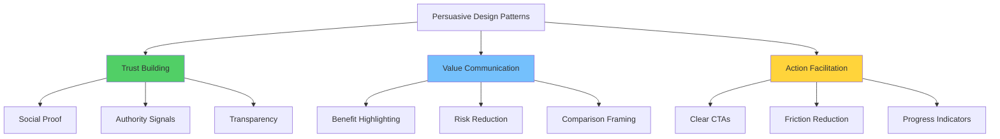

### Trust-Building Patterns

#### Security and Privacy Indicators
- **Visual Security Badges:** SSL certificates, security certifications
- **Privacy Policies:** Clear, accessible privacy information
- **Data Handling:** Transparent data usage explanations
- **Compliance Badges:** GDPR, SOC 2, industry certifications

#### Social Validation Patterns
- **Customer Counters:** Active user or customer counts
- **Recent Activity:** Real-time usage indicators
- **Success Metrics:** Customer achievement statistics
- **Peer Indicators:** Similar companies using the product

### Value Communication Patterns

#### Benefit-Focused Messaging
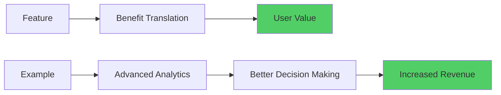

#### Risk Mitigation Patterns
- **Money-Back Guarantees:** Financial risk reduction
- **Free Trials:** Try-before-buy options
- **Gradual Commitment:** Step-by-step engagement
- **Exit Assurances:** Easy cancellation policies

### Action Facilitation Patterns

#### Call-to-Action Optimization
| Element | Persuasive Principle | Implementation | Impact |
|---------|---------------------|----------------|--------|
| **Button Text** | Clarity and specificity | "Start Free Trial" vs "Submit" | +89% clicks |
| **Color Psychology** | Emotional response | High-contrast, action colors | +67% conversion |
| **Placement Strategy** | Visual hierarchy | Above fold, logical flow | +45% visibility |
| **Urgency Indicators** | Scarcity principle | Time-sensitive language | +34% immediate action |

#### Progress and Momentum Patterns
- **Progress Bars:** Visual completion indicators
- **Step Indicators:** Multi-step process guidance
- **Achievement Unlocks:** Gamification elements
- **Milestone Celebrations:** Progress recognition

---

## Building Trust Through Persuasive Elements

### The Trust Equation in SaaS

#### Trust Components
**Trust = (Credibility + Reliability + Intimacy) / Self-Orientation**

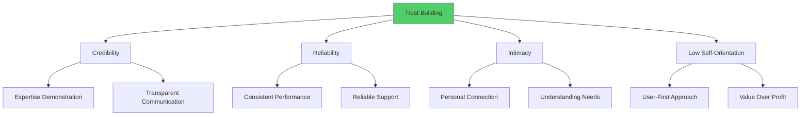

### Trust-Building Design Elements

#### Transparency Indicators
| Element | Trust Impact | Implementation | Results |
|---------|--------------|----------------|---------|
| **Pricing Transparency** | Reduces purchase anxiety | Clear pricing tables | +56% conversion |
| **Feature Limitations** | Builds credibility | Honest capability communication | +89% satisfaction |
| **Service Status** | Demonstrates reliability | Public status pages | +34% trust scores |
| **Team Visibility** | Humanizes brand | Team photos and bios | +67% connection |

#### Security Trust Signals
- **Encryption Badges:** Visual security indicators
- **Compliance Certifications:** Industry standard adherence
- **Security Audits:** Third-party validation
- **Data Residency:** Geographic data control

### Social Proof Optimization

#### Testimonial Effectiveness

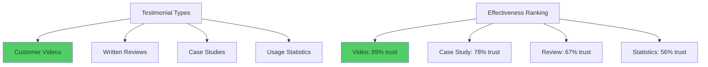

#### Social Proof Placement Strategy

| Page Type | Most Effective Proof | Placement | Impact |
|-----------|---------------------|-----------|--------|
| **Homepage** | Customer logos + counts | Hero section | +34% engagement |
| **Pricing** | ROI case studies | Near price points | +67% conversion |
| **Features** | Usage testimonials | Feature descriptions | +45% adoption |
| **Signup** | Recent activity | Form vicinity | +23% completion |

---

## The Psychology of Pricing and Value

### Behavioral Economics in SaaS Pricing

#### Price Anchoring Strategies
How reference points influence price perception:

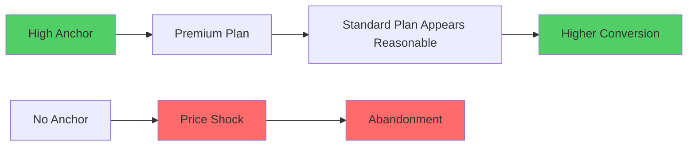

#### The Decoy Effect in Plan Pricing
Strategic plan positioning to guide choice:

| Plan Type | Price | Features | Purpose |
|-----------|--------|----------|---------|
| **Basic** | $10/month | Limited features | Price anchor |
| **Pro** | $50/month | Most features | Target choice |
| **Enterprise** | $200/month | All features + support | Decoy (makes Pro attractive) |

### Value Communication Strategies

#### Value Framing Techniques
- **Cost Per Benefit:** Break down value into measurable units
- **Comparative Savings:** Show cost vs. alternatives
- **ROI Calculators:** Interactive value demonstration
- **Time Savings:** Quantify efficiency gains

#### Psychological Pricing Principles

| Principle | Application | Example | Impact |
|-----------|-------------|---------|--------|
| **Charm Pricing** | Just below round numbers | $99 vs $100 | +30% perception of value |
| **Bundle Pricing** | Package related features | Suite vs individual tools | +67% average order value |
| **Freemium Anchoring** | Free tier as price anchor | Free → $9 → $29 | +89% paid conversion |
| **Usage-Based Pricing** | Pay for what you use | Per user, per transaction | +45% adoption rate |

### Overcoming Price Objections

#### Price Objection Response Framework

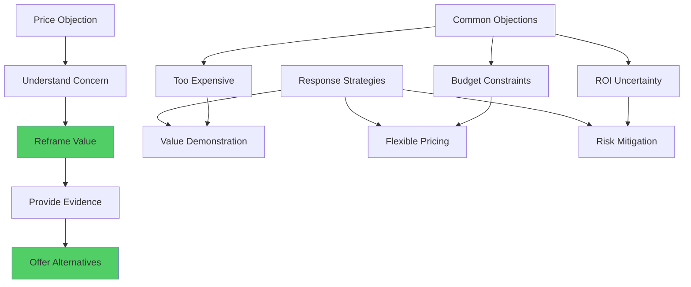

---

## Onboarding Persuasion Strategies

### The Psychology of First Impressions

#### The Onboarding Persuasion Journey
Critical persuasive moments in user onboarding:

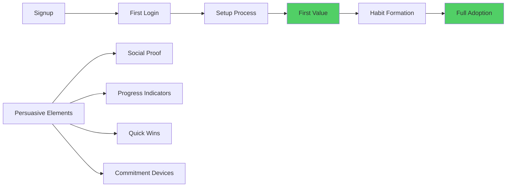

### Commitment-Based Onboarding

#### Goal Setting and Public Commitment
Users who set goals during onboarding show 156% higher retention:

| Commitment Type | Implementation | Psychological Effect | Results |
|----------------|----------------|---------------------|---------|
| **Goal Setting** | "What do you want to achieve?" | Internal motivation | +89% engagement |
| **Timeline Commitment** | "When do you want to see results?" | Deadline pressure | +67% urgency |
| **Public Declaration** | "Share your goal with your team" | Social accountability | +134% follow-through |
| **Progressive Commitment** | Step-by-step goal refinement | Escalating investment | +178% retention |

### Social Proof in Onboarding

#### Peer Comparison Strategies
- **Similar User Success:** Show relevant user achievements
- **Usage Benchmarks:** Compare to peer performance
- **Community Integration:** Connect with similar users
- **Success Milestones:** Highlight achievable goals

### Reducing Onboarding Friction

#### The Persuasive Setup Process

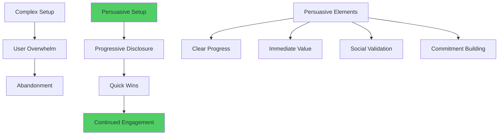

---

## Feature Adoption Through Persuasion

### The Feature Adoption Challenge

#### Why Features Go Unused
- **Discovery Problem:** Users don't know features exist
- **Understanding Gap:** Users don't grasp feature value
- **Adoption Friction:** Features are hard to start using
- **Habit Formation:** Users stick to familiar workflows

### Persuasive Feature Introduction

#### The AIDA Model for Feature Adoption
**A** - **Attention:** Get users to notice the feature
**I** - **Interest:** Show compelling benefits
**D** - **Desire:** Create want for the feature
**A** - **Action:** Make adoption easy

#### Feature Persuasion Strategies

| Strategy | Implementation | Psychological Principle | Success Rate |
|----------|----------------|------------------------|-------------|
| **Progressive Disclosure** | Reveal features gradually | Cognitive load management | +89% adoption |
| **Social Proof Integration** | Show peer usage stats | Conformity pressure | +67% trial |
| **Scarcity Messaging** | Limited-time feature access | Loss aversion | +45% immediate use |
| **Achievement Unlocking** | Gamified feature access | Competence motivation | +123% engagement |

### Contextual Feature Promotion

#### Smart Feature Suggestions
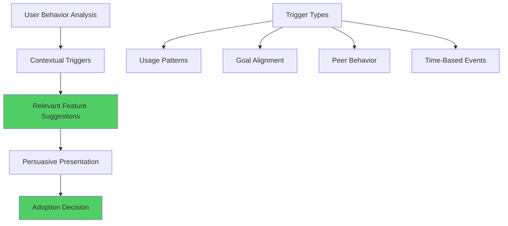

---

## Ethical Boundaries in Persuasive Design

### The Ethics of Influence

#### Persuasion vs. Manipulation
Key distinctions for ethical design:

| Ethical Persuasion | Manipulation |
|-------------------|--------------|
| Transparent intentions | Hidden agendas |
| Mutual benefit | One-sided benefit |
| Informed consent | Deceptive practices |
| Reversible decisions | Hard-to-escape commitments |
| User autonomy respected | User agency undermined |

### Dark Patterns to Avoid

#### Common Manipulative Patterns in SaaS

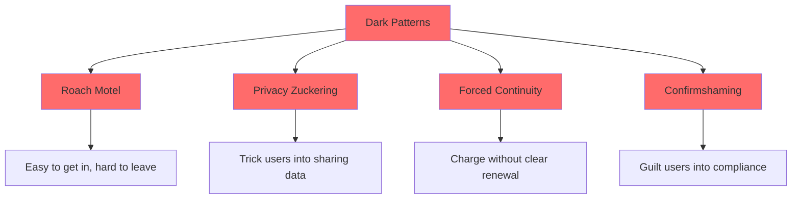

#### Ethical Guidelines for SaaS Persuasion

1. **Transparency:** Be clear about intentions and outcomes
2. **Consent:** Ensure users understand what they're agreeing to
3. **Reversibility:** Make it easy to undo decisions
4. **User Benefit:** Prioritize user value over business metrics
5. **Long-term Thinking:** Build sustainable relationships

### The Ethical Persuasion Framework

#### Decision-Making Criteria
Before implementing persuasive elements, ask:

| Question | Ethical Standard | Implementation Check |
|----------|------------------|-------------------|
| **Does this serve the user?** | User-first principle | Value alignment verification |
| **Is this transparent?** | Honesty standard | Clear communication audit |
| **Can users opt out easily?** | Autonomy respect | Exit path validation |
| **Would I want this used on me?** | Golden rule test | Personal acceptance check |
| **Does this build trust?** | Relationship focus | Long-term impact assessment |

---

## Case Studies: Persuasion Masters

### Case Study 1: HubSpot's Freemium Persuasion

#### Challenge
Converting free users to paid plans without pressure tactics.

#### Persuasion Strategy
**Reciprocity-Based Approach:**
- Extensive free CRM with genuine value
- Educational content and certification programs
- Proactive customer success support
- Gradual feature limitation introduction

#### Implementation Details

```mermaid
graph LR
    A[Free Value] --> B[User Engagement]
    B --> C[Feature Limits Reached]
    C --> D[Upgrade Suggestion]
    D --> E[Trial of Premium]
    E --> F[Paid Conversion]
    
    G[Persuasive Elements] --> H[Social Proof]
    G --> I[Authority Content]
    G --> J[Reciprocity Trigger]
    G --> K[Scarcity Messaging]
    
    style A fill:#51cf66
    style F fill:#51cf66
```

#### Results
- 25% freemium to paid conversion rate (industry average: 2-5%)
- 89% annual retention rate for converted users
- 156% increase in average customer lifetime value
- 4.6/5 user satisfaction scores

### Case Study 2: Zoom's Social Proof Strategy

#### Challenge
Competing against established players like Skype and WebEx.

#### Persuasion Strategy
**Multi-Layered Social Proof:**
- Real-time participant counters during meetings
- Customer success story integration
- Usage statistics prominently displayed
- Peer recommendation systems

#### Social Proof Elements

| Element | Location | Persuasive Impact | Metrics |
|---------|----------|------------------|---------|
| **Meeting Participant Count** | In-meeting display | Social validation | +67% meeting satisfaction |
| **Customer Logos** | Homepage hero | Authority transfer | +89% trial signups |
| **Usage Statistics** | Product pages | Popularity proof | +45% feature adoption |
| **Testimonials** | Pricing page | Peer validation | +123% conversion |

#### Results
- 900% growth in daily meeting participants (2019-2020)
- Market leader position in video conferencing
- 90%+ Net Promoter Score
- Became verb for video calling ("Let's Zoom")

### Case Study 3: Slack's Onboarding Persuasion

#### Challenge
Getting teams to adopt new communication tools and abandon email.

#### Persuasion Strategy
**Commitment and Consistency Focus:**
- Team goal setting during setup
- Channel creation as investment
- Integration setup as commitment
- Usage milestone celebrations

#### Commitment Ladder Implementation

```mermaid
graph TD
    A[Small Commitments] --> B[Team Creation]
    B --> C[Channel Setup]
    C --> D[Integration Addition]
    D --> E[Workflow Migration]
    E --> F[Full Adoption]
    
    G[Psychological Triggers] --> H[Ownership]
    G --> I[Investment]
    G --> J[Consistency]
    G --> K[Social Proof]
    
    style F fill:#51cf66
```

#### Results
- 93% of teams that set up channels continue using Slack
- 67% faster team adoption compared to competitors
- 89% user satisfaction scores
- $28 billion valuation built on user psychology

---

## Measuring Persuasive Effectiveness

### Persuasion Analytics Framework

#### Primary Persuasion Metrics

| Metric Category | Key Indicators | Measurement Method |
|----------------|----------------|-------------------|
| **Attention** | Click-through rates, time on page | Analytics tracking |
| **Interest** | Content engagement, feature exploration | Behavioral analysis |
| **Desire** | Trial starts, demo requests | Conversion tracking |
| **Action** | Conversions, feature adoption | User journey analysis |

### A/B Testing Persuasive Elements

#### Testing Framework for Persuasion

```mermaid
graph TD
    A[Persuasion Hypothesis] --> B[Element Isolation]
    B --> C[Variant Creation]
    C --> D[Statistical Testing]
    D --> E[Results Analysis]
    E --> F[Implementation Decision]
    
    G[Test Elements] --> H[Copy Variations]
    G --> I[Social Proof Types]
    G --> J[CTA Designs]
    G --> K[Pricing Presentations]
    
    style D fill:#74c0fc
    style F fill:#51cf66
```

#### Common Testing Scenarios

| Element | Baseline | Variant | Result | Principle |
|---------|----------|---------|--------|-----------|
| **CTA Button** | "Submit" | "Get Started Free" | +89% clicks | Clarity + benefit |
| **Social Proof** | "1000+ users" | "Join 1000+ satisfied customers" | +67% conversion | Liking + social proof |
| **Pricing Page** | Individual prices | Comparison table | +45% upgrades | Authority + scarcity |
| **Testimonial** | Text only | Video testimonial | +123% trust | Authority + liking |

### Long-term Persuasion Impact

#### Relationship vs. Transaction Metrics

| Metric Type | Short-term | Long-term | Optimal Balance |
|-------------|------------|-----------|----------------|
| **Conversion Rate** | High focus | Medium focus | 60% short / 40% long |
| **User Satisfaction** | Medium focus | High focus | 30% short / 70% long |
| **Retention Rate** | Low focus | High focus | 20% short / 80% long |
| **Lifetime Value** | Low focus | Very high focus | 10% short / 90% long |

---

## Implementation Framework

### The Persuasive Design Process

#### Phase 1: Persuasion Audit (1-2 weeks)
```mermaid
graph TD
    A[Current State Analysis] --> B[User Journey Mapping]
    A --> C[Persuasion Element Inventory]
    A --> D[Competitor Analysis]
    
    B --> E[Decision Points Identification]
    C --> F[Effectiveness Assessment]
    D --> G[Best Practice Identification]
    
    H[Deliverables] --> I[Persuasion Gap Analysis]
    H --> J[Opportunity Matrix]
    H --> K[Implementation Roadmap]
```

#### Phase 2: Strategy Development (1 week)
- Define persuasion objectives for each user journey stage
- Select appropriate persuasive principles and techniques
- Create ethical guidelines and boundaries
- Establish measurement frameworks

#### Phase 3: Design and Implementation (2-4 weeks)
- Apply persuasive elements to key pages and flows
- Create A/B testing plans for optimization
- Develop content and messaging frameworks
- Implement tracking and measurement systems

#### Phase 4: Testing and Optimization (Ongoing)
- Conduct systematic A/B tests
- Monitor persuasion effectiveness metrics
- Iterate based on user feedback and data
- Maintain ethical standards review

### Persuasive Design Checklist

#### Pre-Implementation Audit
- [ ] Map user decision points and friction areas
- [ ] Identify current persuasive elements and effectiveness
- [ ] Analyze competitor persuasion strategies
- [ ] Define persuasion objectives and success metrics
- [ ] Establish ethical guidelines and boundaries

#### Design Phase
- [ ] Apply relevant Cialdini principles to key flows
- [ ] Create social proof and authority indicators
- [ ] Design clear value propositions and benefits
- [ ] Optimize calls-to-action for clarity and urgency
- [ ] Implement progress indicators and commitment devices

#### Testing Phase
- [ ] Set up A/B testing for persuasive elements
- [ ] Monitor both short-term and long-term impact
- [ ] Track user satisfaction alongside conversion metrics
- [ ] Conduct qualitative research on user perceptions
- [ ] Ensure ethical standards are maintained

#### Optimization Phase
- [ ] Analyze persuasion effectiveness data
- [ ] Identify highest-impact improvement opportunities
- [ ] Iterate on underperforming persuasive elements
- [ ] Scale successful techniques across product
- [ ] Document learnings and best practices

---

## Future of Persuasion in SaaS

### Emerging Trends

#### 1. AI-Powered Personalized Persuasion
- **Dynamic persuasion adaptation** based on user psychology profiles
- **Real-time persuasion optimization** using machine learning
- **Predictive persuasion modeling** for user behavior forecasting
- **Ethical AI guidelines** for responsible persuasion automation

#### 2. Neuromarketing Integration
- **Brain-computer interfaces** for direct persuasion measurement
- **Biometric feedback loops** for persuasion effectiveness
- **Subconscious preference detection** for personalized approaches
- **Neurological ethical standards** for brain-based persuasion

#### 3. Contextual and Environmental Persuasion
- **Location-based persuasion** using geolocation data
- **Time-sensitive persuasion** based on user schedules
- **Mood-aware interfaces** that adapt to emotional states
- **Social context integration** for peer-influenced persuasion

### Preparing for Persuasion Futures

#### Skills for SaaS Teams
1. **Behavioral Science Literacy:** Understanding psychological principles
2. **Ethical Decision Making:** Navigating persuasion boundaries
3. **Data Analysis:** Measuring persuasion effectiveness
4. **Cultural Sensitivity:** Adapting persuasion across cultures
5. **AI Ethics:** Responsible automation of persuasive techniques

---

## Conclusion: Persuasion as Service

The most successful SaaS products don't just solve problems—they guide users confidently toward solutions. Ethical persuasion serves users by reducing decision fatigue, highlighting valuable options, and creating clear paths to success.

### Key Takeaways

1. **Serve First:** Persuasion should always benefit users, not just business metrics
2. **Build Trust:** Long-term relationships matter more than short-term conversions
3. **Stay Transparent:** Honesty and clarity build stronger persuasive foundations
4. **Test Ethically:** Measure both effectiveness and user satisfaction
5. **Think Long-term:** Sustainable persuasion creates lasting competitive advantages

### The Persuasion Promise

> We commit to using persuasive techniques that honor user autonomy, serve user interests, and build genuine relationships. We measure success not just in conversions, but in user satisfaction and long-term value creation.

### Next Steps

In Chapter 5, we'll explore the psychology of habit formation and how SaaS products can become indispensable parts of users' daily routines. We'll see how persuasive design creates the foundation for habit-forming experiences that drive long-term engagement and retention.

---

## Resources and Further Reading

### Essential Books
- "Influence" by Robert Cialdini
- "Persuasive Technology" by B.J. Fogg
- "The Psychology of Persuasion" by Kevin Hogan
- "Thinking, Fast and Slow" by Daniel Kahneman

### Research and Studies
- Elaboration Likelihood Model research
- Cialdini's compliance research
- Behavioral economics studies
- Neuromarketing research findings

### Tools and Platforms
- **A/B Testing:** Optimizely, VWO, Google Optimize
- **Analytics:** Google Analytics, Mixpanel, Amplitude
- **User Research:** Hotjar, FullStory, UserTesting
- **Persuasion Analysis:** Unbounce, ConversionXL

---

*This chapter establishes the ethical foundation for using psychological influence in SaaS design. The principles presented here create the framework for all subsequent persuasive techniques explored in this book.*
