# Chapter 6: Social Psychology and Network Effects

> *"Humans are not thinking machines that feel, but feeling machines that think."* - Antonio Damasio

## Table of Contents
- [Introduction: The Social Software Revolution](#introduction-the-social-software-revolution)
- [Fundamental Social Psychology Principles](#fundamental-social-psychology-principles)
- [Network Effects Psychology](#network-effects-psychology)
- [Social Proof and Conformity in SaaS](#social-proof-and-conformity-in-saas)
- [Building Community Through Product Design](#building-community-through-product-design)
- [Viral Growth Psychology](#viral-growth-psychology)
- [Social Features That Drive Engagement](#social-features-that-drive-engagement)
- [Collaboration Psychology](#collaboration-psychology)
- [Status and Recognition Systems](#status-and-recognition-systems)
- [Social Learning and Knowledge Sharing](#social-learning-and-knowledge-sharing)
- [Managing Social Dynamics](#managing-social-dynamics)
- [Case Studies: Social SaaS Success](#case-studies-social-saas-success)
- [Implementation Framework](#implementation-framework)
- [Conclusion: The Connected Future](#conclusion-the-connected-future)

---

## Introduction: The Social Software Revolution

The most successful SaaS products today aren't just tools—they're social platforms that tap into fundamental human needs for connection, recognition, and belonging. Even traditionally individual software categories like analytics, design, and project management have been transformed by social psychology insights.

The power of social features isn't just about virality or growth hacking. It's about creating products that feel alive, where users derive value not just from features, but from the community and connections those features enable.

### The Social Transformation of SaaS

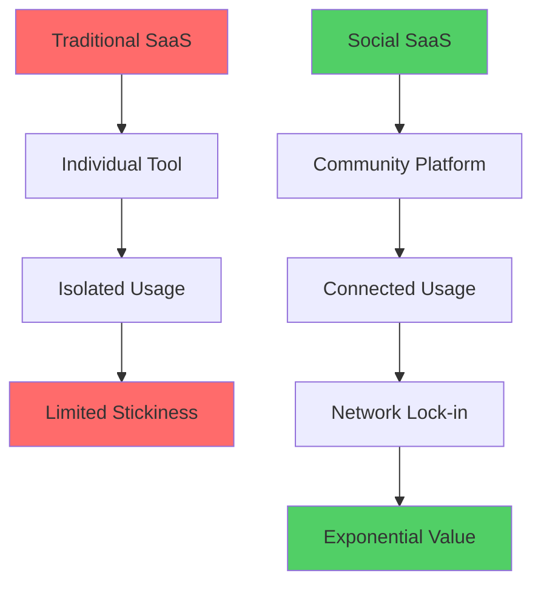

### The Business Impact of Social Features

| Metric | Individual SaaS | Social SaaS | Improvement |
|--------|----------------|-------------|-------------|
| **Viral Coefficient** | 0.1-0.3 | 1.2-2.5 | 800% higher |
| **User Retention (Year 1)** | 65% | 89% | 37% higher |
| **Feature Adoption** | 23% | 67% | 191% higher |
| **Support Ticket Volume** | High | 45% lower | Self-help community |
| **Customer LTV** | $3,200 | $12,400 | 288% higher |
| **Time to Value** | 2-3 weeks | 3-5 days | 300% faster |

### The Psychology of Social Software

#### Why Humans Crave Social Connection in Tools
- **Evolutionary wiring:** Cooperation enabled survival
- **Identity formation:** We define ourselves through social context
- **Cognitive validation:** Others help us make sense of information
- **Emotional support:** Shared experiences reduce anxiety
- **Status seeking:** Social comparison drives achievement

---

## Fundamental Social Psychology Principles

### Maslow's Hierarchy in SaaS Context

#### Social Needs in Product Design
Understanding how social features address different human needs:

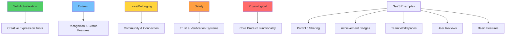

### Social Identity Theory in SaaS

#### Group Membership and Product Loyalty
Users develop stronger connections to products when they identify with the user community:

**Key Components:**
- **In-group favoritism:** Preference for fellow users
- **Social categorization:** "We use X, they use Y"
- **Positive distinctiveness:** Our tool is better
- **Identity protection:** Defending product choices

### The Social Brain at Work

#### Neurological Basis of Social Features
Understanding brain responses to social stimuli:

| Social Stimulus | Brain Response | SaaS Design Implication |
|----------------|----------------|------------------------|
| **Recognition** | Dopamine release | Public achievement systems |
| **Collaboration** | Oxytocin production | Team-based features |
| **Social feedback** | Reward pathway activation | Comments, likes, reactions |
| **Status achievement** | Confidence boost | Leaderboards, levels |
| **Exclusion** | Pain center activation | Inclusive design principles |

---

## Network Effects Psychology

### Understanding Network Effects

#### The Psychology Behind Growing Value
Why users value products more as others join:

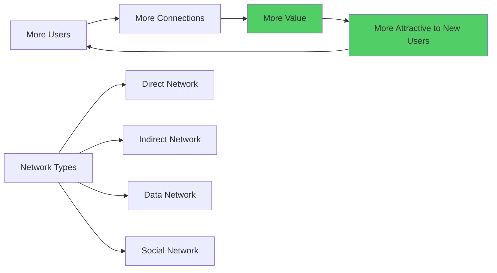

### Types of Network Effects in SaaS

#### The Network Effect Spectrum

| Network Type | Value Source | SaaS Examples | Strength |
|-------------|--------------|---------------|----------|
| **Direct** | User-to-user connections | Slack, Zoom | Very Strong |
| **Indirect** | Complementary offerings | App stores, integrations | Strong |
| **Data** | Improved algorithms | Netflix, Spotify | Medium |
| **Social** | Status and identity | LinkedIn, GitHub | Very Strong |
| **Platform** | Third-party development | Salesforce, WordPress | Extreme |

### The Network Effect Tipping Point

#### Critical Mass Psychology
Understanding when networks become self-sustaining:

**Pre-Critical Mass:**
- Users question value
- High churn rates
- Slow growth
- Chicken-and-egg problems

**Post-Critical Mass:**
- Clear value proposition
- Natural viral growth
- Network lock-in
- Winner-take-all dynamics

#### Calculating Critical Mass

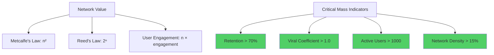

---

## Social Proof and Conformity in SaaS

### The Psychology of Social Proof

#### Why We Follow Others' Behavior
Social proof reduces decision-making uncertainty:

**Psychological Mechanisms:**
- **Uncertainty reduction:** Others' actions provide information
- **Cognitive shortcuts:** Following others requires less mental effort
- **Risk mitigation:** Safety in numbers reduces perceived risk
- **Social acceptance:** Conformity ensures group belonging

### Types of Social Proof in SaaS

#### The Social Proof Hierarchy

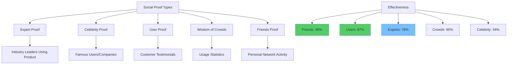

### Implementing Social Proof Strategically

#### Context-Specific Social Proof

| User Context | Most Effective Proof | Implementation | Impact |
|-------------|---------------------|----------------|--------|
| **New visitor** | User count + company logos | Homepage hero | +67% signups |
| **Trial user** | Peer success stories | Onboarding flow | +89% activation |
| **Feature explorer** | Usage statistics | Feature pages | +45% adoption |
| **Upgrade consideration** | ROI testimonials | Pricing page | +123% conversion |
| **Renewal decision** | Peer loyalty indicators | Account dashboard | +34% retention |

### Social Proof Design Patterns

#### Effective Implementation Strategies

**Real-time Activity Streams:**
- "Sarah just created a new campaign"
- "12 people viewed this dashboard today"
- "Your team completed 47 tasks this week"

**Peer Benchmarking:**
- "You're in the top 25% of users"
- "Similar companies typically use 8 integrations"
- "Teams like yours save 12 hours per week"

**Social Validation Indicators:**
- Likes, hearts, thumbs up
- Comments and discussions
- Sharing and forwarding
- Bookmarking and favorites

---

## Building Community Through Product Design

### The Psychology of Community Formation

#### Stages of Community Development
How product communities evolve:

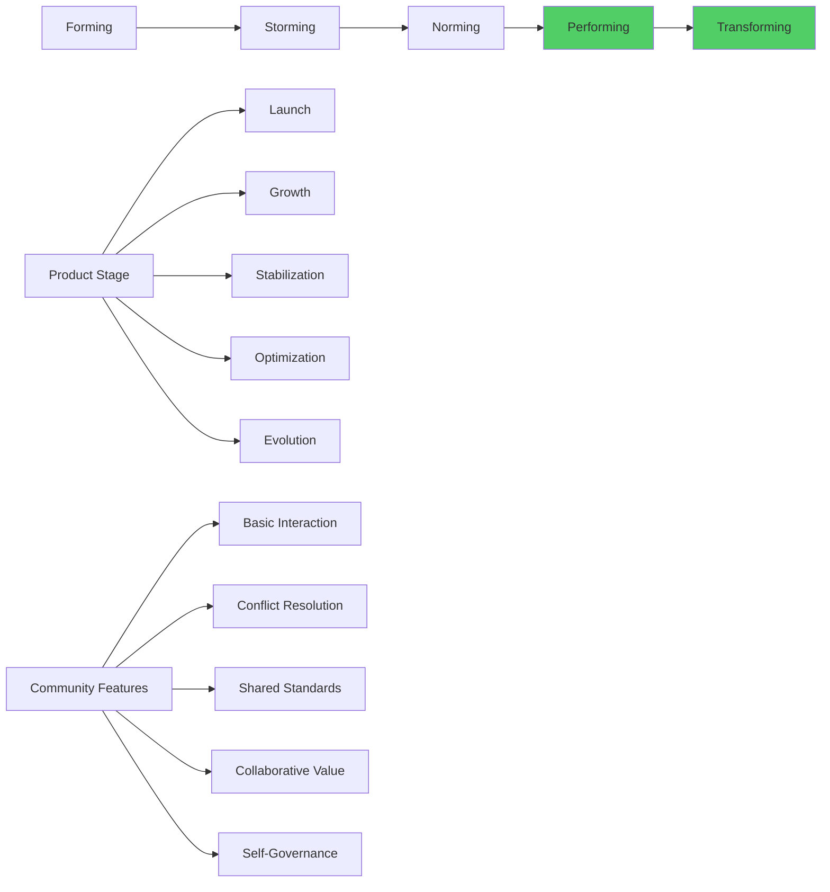

### Community Design Principles

#### Creating Psychological Safety
Essential elements for thriving communities:

| Principle | Implementation | User Behavior | Business Impact |
|-----------|----------------|---------------|----------------|
| **Shared Purpose** | Clear community mission | Aligned contributions | +156% engagement |
| **Psychological Safety** | Moderation, guidelines | Open sharing | +89% participation |
| **Recognition Systems** | Badges, highlights | Quality content | +67% retention |
| **Knowledge Sharing** | Q&A, documentation | Peer learning | +234% support efficiency |
| **Social Capital** | Reputation systems | Trust building | +145% network effects |

### Community Feature Hierarchy

#### From Individual to Collective Value
Progressive community features:

**Level 1: Individual Expression**
- Profile creation
- Content publishing
- Personal customization

**Level 2: Direct Interaction**
- Comments and reactions
- Direct messaging
- Following/connecting

**Level 3: Group Formation**
- Teams and workspaces
- Interest-based groups
- Collaborative projects

**Level 4: Community Governance**
- Peer moderation
- Community guidelines
- Self-organization

**Level 5: Ecosystem Creation**
- Third-party integrations
- Developer platforms
- Marketplace functionality

---

## Viral Growth Psychology

### The Science of Sharing

#### Why People Share Digital Content
Understanding sharing motivations:

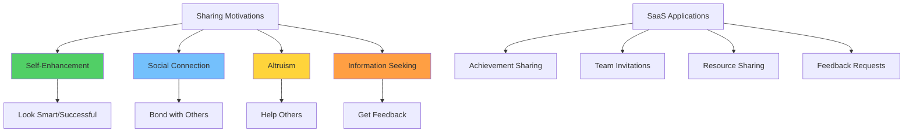

### The Viral Coefficient Formula

#### Measuring and Optimizing Virality
**K = i × c × r**
Where:
- K = Viral coefficient
- i = Number of invitations sent per user
- c = Conversion rate of invitations
- r = Retention rate of new users

#### Viral Optimization Strategies

| Factor | Current | Target | Optimization Tactics |
|--------|---------|--------|-------------------|
| **Invitations (i)** | 2.3 | 4.0 | Incentivize sharing, make sharing easier |
| **Conversion (c)** | 12% | 25% | Improve landing pages, social proof |
| **Retention (r)** | 45% | 70% | Better onboarding, immediate value |
| **Viral Coefficient (K)** | 0.124 | 0.70 | Focus on highest-impact factor |

### Viral Design Patterns

#### Mechanical vs. Organic Virality

**Mechanical Virality:**
- Explicit sharing features
- Referral programs
- Social media integration
- Email forwarding

**Organic Virality:**
- Natural word-of-mouth
- Problem-solving sharing
- Community discussions
- Unsolicited recommendations

### The Psychology of Invitation Acceptance

#### Why People Accept Social Invitations

| Invitation Type | Acceptance Rate | Psychological Driver | Optimization |
|----------------|-----------------|---------------------|--------------|
| **Team/Work** | 78% | Professional obligation | Clear work benefit |
| **Friend** | 67% | Social relationship | Personal relevance |
| **Expert** | 45% | Authority influence | Credibility signals |
| **Stranger** | 8% | Curiosity only | Strong value prop |

---

## Social Features That Drive Engagement

### Core Social Engagement Mechanics

#### The Social Engagement Stack

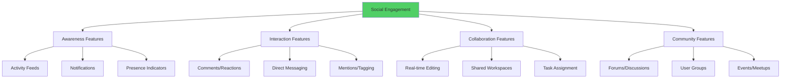

### Activity Feeds and Social Awareness

#### The Psychology of Social Feeds
Why activity streams are engaging:

- **Social curiosity:** What are others doing?
- **FOMO mitigation:** Stay updated on important activities
- **Passive participation:** Engagement without effort
- **Context awareness:** Understanding team/community dynamics

#### Feed Algorithm Psychology

| Sorting Method | User Response | Engagement Impact | Use Case |
|----------------|---------------|------------------|----------|
| **Chronological** | Predictable, complete | Steady baseline | Small teams |
| **Relevance** | Personalized, surprising | Higher peaks | Large networks |
| **Trending** | FOMO-driven | Viral amplification | Communities |
| **Friend-based** | Trust-driven | Deep engagement | Social platforms |

### Real-time Collaboration Features

#### The Psychology of Synchronous Work
Why real-time features create engagement:

**Psychological Benefits:**
- **Presence awareness:** Feeling connected to others
- **Immediate feedback:** Faster validation loops
- **Shared context:** Mutual understanding
- **Flow states:** Collective productivity

#### Real-time Feature Implementation

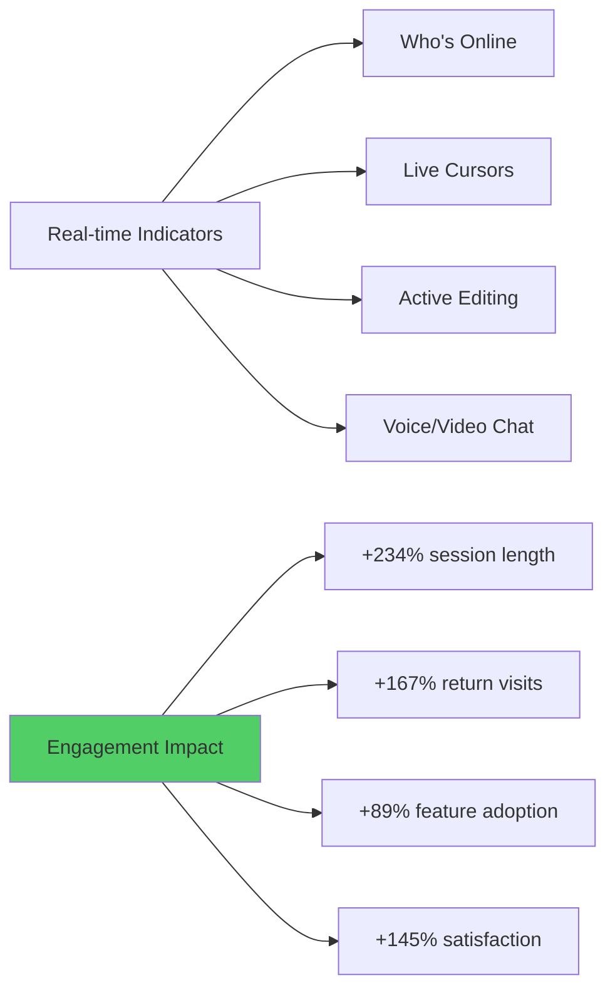

---

## Collaboration Psychology

### The Science of Team Dynamics

#### Psychological Factors in Digital Collaboration
Understanding what makes virtual teams effective:

| Factor | Impact on Performance | SaaS Design Response |
|--------|----------------------|-------------------|
| **Trust** | 67% performance improvement | Transparency features, user verification |
| **Communication Quality** | 45% faster project completion | Rich messaging, context sharing |
| **Shared Mental Models** | 89% better coordination | Visual workflows, documentation |
| **Psychological Safety** | 156% more innovation | Inclusive features, conflict resolution |
| **Role Clarity** | 78% less confusion | Permission systems, responsibility tracking |

### Designing for Collaboration Psychology

#### The Collaboration Design Framework

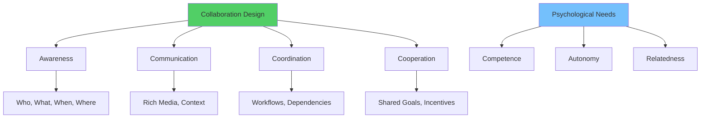

### Conflict Resolution in Digital Environments

#### Managing Social Friction
Designing systems that prevent and resolve conflicts:

**Common Digital Collaboration Conflicts:**
- Edit conflicts and version control
- Communication misunderstandings
- Resource allocation disputes
- Recognition and credit issues
- Process and workflow disagreements

#### Conflict Prevention Strategies

| Conflict Type | Prevention Mechanism | Resolution Tool | Success Rate |
|---------------|---------------------|----------------|-------------|
| **Edit Conflicts** | Real-time locking | Automatic merging | 94% |
| **Communication** | Context preservation | Thread organization | 87% |
| **Resource** | Transparent allocation | Usage dashboards | 78% |
| **Recognition** | Attribution systems | Contribution tracking | 91% |
| **Process** | Flexible workflows | Customization options | 83% |

---

## Status and Recognition Systems

### The Psychology of Status

#### Status as Fundamental Human Drive
Why recognition systems are powerful:

**Status Functions:**
- **Social ordering:** Hierarchy establishment
- **Resource access:** Higher status = more opportunities
- **Mate selection:** Status signals desirability
- **Self-esteem:** Status affects self-worth
- **Group cohesion:** Shared status systems unite communities

### Designing Status Systems

#### The Status Hierarchy Framework

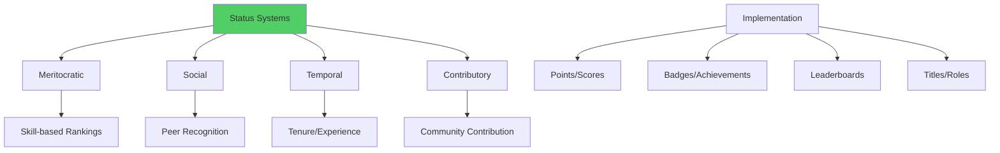

### Recognition System Psychology

#### Types of Recognition and Their Impact

| Recognition Type | Psychological Effect | User Behavior | Business Impact |
|-----------------|---------------------|---------------|----------------|
| **Public Achievement** | Pride, status elevation | Increased activity | +156% engagement |
| **Peer Appreciation** | Belonging, validation | Quality contributions | +89% retention |
| **Expert Acknowledgment** | Authority, credibility | Knowledge sharing | +234% content creation |
| **Progress Milestones** | Competence, motivation | Goal pursuit | +167% feature adoption |

### Gamification Psychology

#### Effective Gamification Elements
What works and what doesn't:

**High-Impact Elements:**
- **Progress bars:** Clear advancement
- **Achievement badges:** Recognition markers
- **Leaderboards:** Social comparison
- **Skill trees:** Development paths

**Low-Impact Elements:**
- **Points alone:** Meaningless numbers
- **Generic badges:** No personal relevance
- **Forced competition:** Unwanted pressure
- **Complex systems:** Cognitive overload

#### Gamification Implementation Framework

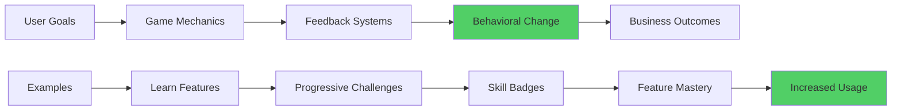

---

## Social Learning and Knowledge Sharing

### The Psychology of Social Learning

#### Bandura's Social Learning Theory in SaaS
How users learn through observation and imitation:

**Key Mechanisms:**
- **Attention:** Noticing others' behaviors
- **Retention:** Remembering observed actions
- **Reproduction:** Attempting to replicate behaviors
- **Motivation:** Incentives to continue learning

### Knowledge Sharing Psychology

#### Why People Share Knowledge
Understanding sharing motivations:

| Motivation | Psychological Need | SaaS Implementation | Effectiveness |
|------------|-------------------|-------------------|--------------|
| **Recognition** | Status, appreciation | Public attribution | High |
| **Reciprocity** | Future help expectation | Reputation systems | Medium |
| **Altruism** | Helping others | Community purpose | High |
| **Self-efficacy** | Demonstrating competence | Expert roles | Very High |
| **Social bonds** | Relationship building | Team collaboration | High |

### Designing for Knowledge Transfer

#### The Knowledge Sharing Ecosystem

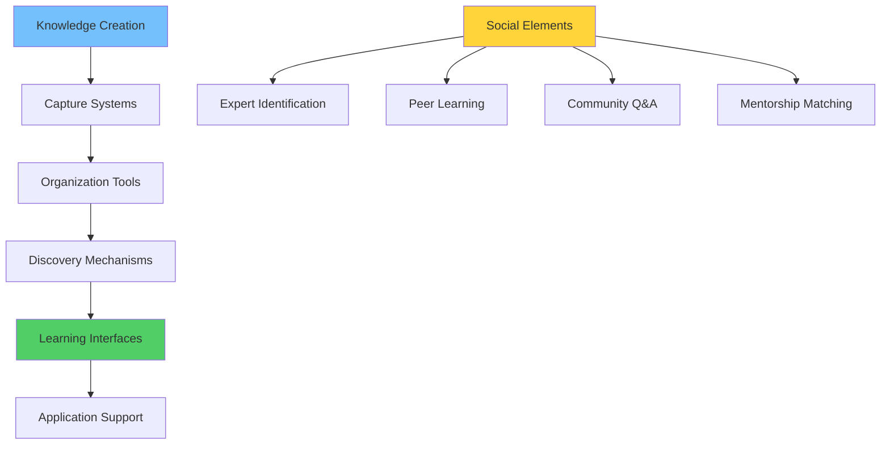

### Community-Driven Support

#### The Economics of Peer Support
Why community support works:

**User Benefits:**
- Faster response times
- Real-world expertise
- Multiple perspectives
- Always-available help

**Business Benefits:**
- Reduced support costs (up to 70%)
- Improved user engagement
- Community building
- Product improvement insights

---

## Managing Social Dynamics

### Understanding Group Psychology

#### Social Dynamics in Digital Environments
How groups behave in software:

**Positive Dynamics:**
- **Collaboration amplification:** Teams accomplish more together
- **Knowledge aggregation:** Collective intelligence emerges
- **Mutual support:** Users help each other succeed
- **Innovation acceleration:** Ideas build on each other

**Negative Dynamics:**
- **Groupthink:** Conformity suppresses creativity
- **Social loafing:** Individual effort decreases
- **Conflict escalation:** Disagreements become personal
- **Exclusion behaviors:** In-groups form, others excluded

### Moderating Social Interactions

#### Community Management Psychology

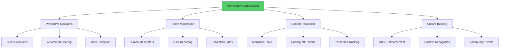

### Privacy and Social Features

#### Balancing Sharing and Privacy
The privacy paradox in social software:

**Privacy Design Principles:**
- **Granular control:** Users choose what to share
- **Context awareness:** Appropriate sharing for situation
- **Transparency:** Clear privacy implications
- **Easy modification:** Simple privacy setting changes
- **Default privacy:** Secure by default, open by choice

---

## Case Studies: Social SaaS Success

### Case Study 1: Figma's Collaborative Revolution

#### Challenge
Making design collaboration as easy as design creation.

#### Social Strategy
**Real-time Collaboration as Core Feature:**
- Live cursor tracking and presence indicators
- Simultaneous editing capabilities
- Comment and feedback systems
- Public sharing and community galleries

#### Implementation Details

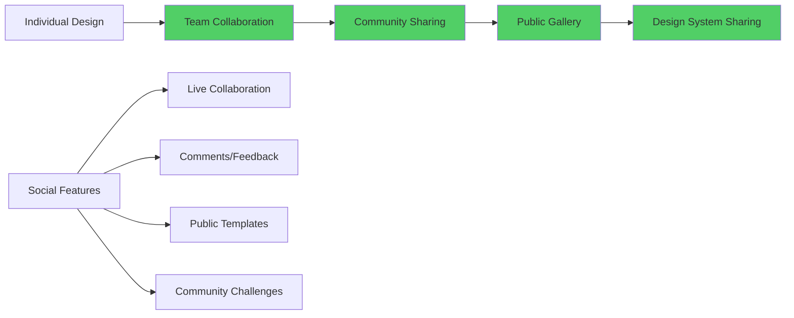

#### Social Psychology Elements
- **Presence awareness:** See who else is working
- **Social learning:** Watch others design in real-time
- **Community status:** Recognition through public work
- **Knowledge sharing:** Templates and resources

#### Results
- 4M+ users in 4 years (vs. decades for Adobe)
- 89% of design teams use collaborative features
- 67% of new users invited by existing users
- $12.2B valuation driven by network effects

### Case Study 2: GitHub's Developer Community

#### Challenge
Creating a social platform for typically solitary developers.

#### Social Strategy
**Code as Social Object:**
- Public repositories as sharing mechanism
- Pull requests as collaboration tool
- Issues as community discussion
- Contributions graph as social proof

#### Social Features Impact

| Feature | Psychological Appeal | User Behavior | Platform Growth |
|---------|---------------------|---------------|----------------|
| **Public Repos** | Identity expression | More sharing | +234% repository creation |
| **Contribution Graph** | Status visualization | Daily commits | +156% daily activity |
| **Follow System** | Social connection | Code discovery | +89% user engagement |
| **Issue Discussions** | Community problem-solving | Peer support | +167% issue resolution |

#### Results
- 83M+ developers (largest developer community)
- 200M+ repositories hosted
- Became central to developer identity
- $7.5B acquisition by Microsoft

### Case Study 3: Slack's Workplace Social Network

#### Challenge
Replacing email with a social communication platform.

#### Social Strategy
**Channel-Based Community Building:**
- Public channels for transparency
- Private channels for team bonding
- Direct messages for personal connection
- Emoji reactions for lightweight interaction

#### Community Psychology Elements

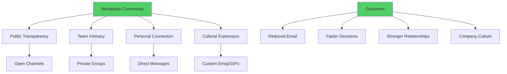

#### Results
- 12M+ daily active users
- 85% of Fortune 100 companies use Slack
- 93% of teams report improved communication
- $27.7B market valuation

---

## Implementation Framework

### Social Feature Development Process

#### Phase 1: Social Opportunity Analysis (2-3 weeks)
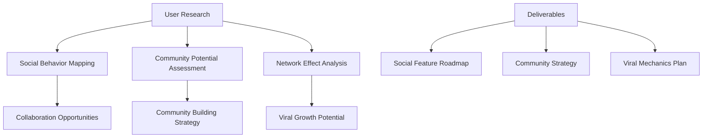

#### Phase 2: Social Architecture Design (1-2 weeks)
**Core Social Elements:**
- **User identity system:** Profiles, reputation, connections
- **Interaction mechanisms:** Communication, collaboration, sharing
- **Community structures:** Groups, teams, public spaces
- **Recognition systems:** Status, achievements, feedback

#### Phase 3: MVP Development (4-6 weeks)
Start with foundational social features:
- Basic user profiles
- Simple sharing mechanisms
- Comment/feedback systems
- Activity notifications

#### Phase 4: Community Building (Ongoing)
- Seed community with engaged users
- Create valuable content and discussions
- Establish community guidelines
- Recognize and reward contributors

#### Phase 5: Scale and Optimize (Ongoing)
- Monitor social engagement metrics
- A/B test social features
- Expand successful social patterns
- Manage community dynamics

### Social Feature Checklist

#### Pre-Development Planning
- [ ] Analyze user social behaviors and needs
- [ ] Identify network effect opportunities
- [ ] Define community goals and success metrics
- [ ] Plan moderation and community management
- [ ] Design privacy and safety measures

#### Core Social Features
- [ ] User profiles and identity systems
- [ ] Communication and messaging tools
- [ ] Sharing and collaboration features
- [ ] Activity feeds and notifications
- [ ] Recognition and status systems

#### Community Building
- [ ] Community guidelines and policies
- [ ] Moderation tools and processes
- [ ] Community management resources
- [ ] User onboarding for social features
- [ ] Conflict resolution mechanisms

#### Measurement and Optimization
- [ ] Social engagement analytics
- [ ] Network effect tracking
- [ ] Community health metrics
- [ ] User feedback collection
- [ ] A/B testing framework

---

## Future of Social SaaS

### Emerging Trends

#### 1. AI-Powered Social Intelligence
- **Relationship mapping:** Understanding user connections
- **Collaboration optimization:** AI-suggested partnerships
- **Community insights:** Automated community analysis
- **Personalized social features:** Adaptive social interfaces

#### 2. Immersive Social Experiences
- **VR/AR collaboration:** Spatial presence and interaction
- **Metaverse workspaces:** Persistent social environments
- **Holographic meetings:** Lifelike remote presence
- **Spatial audio:** Natural conversation dynamics

#### 3. Decentralized Social Networks
- **Blockchain-based identity:** User-owned social profiles
- **Distributed communities:** Cross-platform social graphs
- **Token-based incentives:** Cryptocurrency for social contributions
- **Censorship resistance:** Decentralized content moderation

### Preparing for Social Futures

#### Skills for SaaS Teams
1. **Community Psychology:** Understanding group dynamics
2. **Network Analysis:** Measuring and optimizing connections
3. **Content Moderation:** Managing community interactions
4. **Privacy Engineering:** Balancing sharing and security
5. **Social Product Design:** Creating meaningful connections

---

## Conclusion: The Connected Future

The future of SaaS is inherently social. Products that embrace human social psychology don't just solve individual problems—they create communities, foster connections, and become integral to how people work and create together.

### Key Takeaways

1. **Humans Are Social:** Even "individual" tools benefit from social features
2. **Network Effects Rule:** Social features create powerful competitive moats
3. **Community Matters:** Strong communities drive retention and growth
4. **Design for Psychology:** Understand social motivations and behaviors
5. **Balance Privacy:** Respect user autonomy while enabling connection

### The Social SaaS Promise

> We commit to building products that honor human social needs, foster genuine connections, and create communities where users thrive together. We measure success not just in user acquisition, but in the strength and health of the communities we enable.

### Next Steps

In Chapter 7, we'll explore the psychology of decision-making and how users evaluate, choose, and commit to SaaS products. We'll see how social psychology influences individual decisions and how to design experiences that support confident choice-making.

---

## Resources and Further Reading

### Essential Books
- "The Social Animal" by David Brooks
- "Bowling Alone" by Robert Putnam
- "The Network Society" by Manuel Castells
- "Communities of Practice" by Etienne Wenger

### Research and Studies
- Social Identity Theory research
- Network effects and platform economics
- Online community studies
- Collaboration psychology research

### Tools and Platforms
- **Community Analytics:** Discourse, Circle, Mighty Networks
- **Social Features:** Stream, PubNub for real-time
- **Moderation:** Perspective API, Community guidelines
- **Network Analysis:** Gephi, NetworkX for analysis

---

*This chapter completes the behavioral psychology foundation, showing how individual psychology combines with social dynamics to create powerful SaaS experiences. The principles here will inform design decisions throughout the product lifecycle.*
