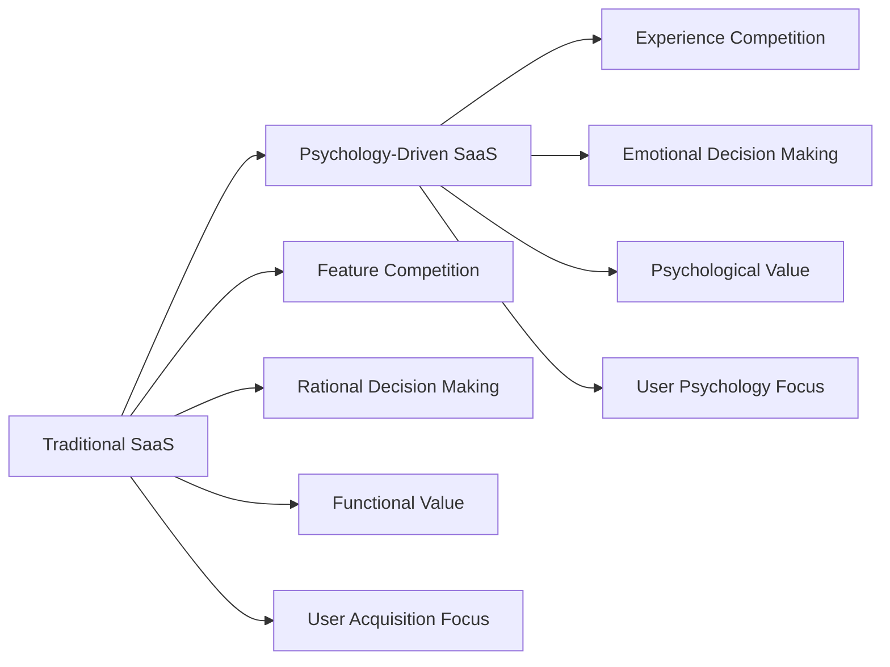

# Conclusion: The Future of SaaS Psychology

> *"The future belongs to companies that understand not just what their users do, but why they do it. Psychology is the ultimate competitive advantage in the age of infinite software choices."* - The Psychology of SaaS Institute

## The Psychology Revolution in SaaS

As we conclude this comprehensive exploration of SaaS psychology, it's clear that we're witnessing a fundamental shift in how successful software companies operate. The era of feature-driven competition is giving way to psychology-driven differentiation, where understanding human behavior becomes the key to building billion-dollar businesses.

The companies profiled throughout this book—from Slack's social psychology mastery to Notion's cognitive architecture excellence—represent the vanguard of this transformation. They've proven that psychological insights aren't just nice-to-have additions to product development; they're the foundation upon which sustainable competitive advantages are built.

## Key Transformations Shaping the Future

### 1. From Features to Feelings

The future of SaaS lies not in building more features, but in creating better experiences that align with human psychology:

**The Emotional Economy:**
- Users make decisions based on how software makes them feel
- Emotional attachment drives switching costs more than functionality
- Brand psychology becomes more important than product features
- User experience psychology determines long-term success

### 2. From Engagement to Empowerment

The next generation of SaaS products will focus on user empowerment rather than just engagement:

**From Addictive Design to Empowering Design:**
- **Old Model:** Maximize time spent in product
- **New Model:** Maximize value created for users
- **Old Metric:** Daily active users
- **New Metric:** User goal achievement rates
- **Old Approach:** Infinite engagement
- **New Approach:** Efficient accomplishment

**The Empowerment Framework:**
- **Agency:** Users feel in control of their experience
- **Growth:** Users develop new capabilities and skills
- **Purpose:** Users achieve meaningful goals
- **Connection:** Users build valuable relationships
- **Wellbeing:** Users maintain healthy technology relationships

### 3. From Individual Psychology to Collective Intelligence

Future SaaS success will come from understanding and leveraging group psychology:

**Collective Psychology Elements:**
- **Team Dynamics:** How groups make decisions and collaborate
- **Organizational Psychology:** How companies adopt and use technology
- **Network Effects:** How individual psychology scales across networks
- **Cultural Psychology:** How global markets require different approaches
- **Ecosystem Psychology:** How multiple stakeholders interact

## Emerging Psychological Trends

### AI-Human Psychology Integration

The future of SaaS psychology involves sophisticated AI that understands and adapts to human psychology:

**Personalized Psychology:**
- AI systems that understand individual psychological profiles
- Dynamic interfaces that adapt to cognitive and emotional states
- Predictive psychology that anticipates user needs and challenges
- Emotional intelligence in AI interactions

**Augmented Decision Making:**
- AI that enhances rather than replaces human judgment
- Psychological support for complex decisions
- Bias awareness and mitigation systems
- Confidence and uncertainty communication

### Wellbeing-First Design

The next generation of SaaS products will be designed primarily for user wellbeing:

**Digital Wellness Integration:**
- Mental health awareness built into all features
- Sustainable usage patterns encouraged by design
- Work-life balance support integrated throughout
- Stress reduction and mindfulness features

**Psychological Safety:**
- Anxiety-reducing interface design
- Confidence-building feature progression
- Error handling that preserves self-esteem
- Achievement systems that build intrinsic motivation

### Global Psychology Adaptation

Future SaaS products will seamlessly adapt to diverse cultural psychologies:

**Culturally Adaptive Interfaces:**
- Real-time cultural context awareness
- Dynamic UI adaptation based on cultural psychology
- Communication style adjustment for cultural norms
- Decision-making process accommodation

**Universal Psychology Principles:**
- Core human psychological needs remain constant
- Cultural expression of these needs varies
- Successful products balance universal and local psychology
- AI-powered cultural intelligence becomes competitive advantage

## The Next Generation of Psychological Design

### Anticipatory Psychology

Future SaaS products will anticipate psychological needs before users are consciously aware of them:

**Predictive Psychology Features:**
- Mood-aware interface adaptation
- Stress-prevention interventions
- Cognitive load management
- Motivation support systems

**Behavioral Prediction:**
- Understanding user psychology patterns
- Predicting when users need support
- Anticipating feature needs based on psychological state
- Proactive problem prevention

### Collaborative Human-AI Psychology

The future involves AI systems that truly understand and collaborate with human psychology:

**Psychology-Aware AI:**
- Emotional intelligence in AI interactions
- Understanding of cognitive biases and limitations
- Adaptive communication based on psychological state
- Supportive rather than manipulative AI behavior

**Human-AI Psychological Teams:**
- AI that enhances human psychological strengths
- Compensation for human psychological limitations
- Collaborative decision-making that leverages both
- Trust-building between humans and AI systems

### Ecosystem Psychology

Future SaaS success will require understanding psychology across entire business ecosystems:

**Multi-Stakeholder Psychology:**
- End-user psychology
- Decision-maker psychology
- Administrator psychology
- Champion psychology
- Influencer psychology

**Network Psychology Effects:**
- How individual psychology affects group behavior
- How group psychology influences individual decisions
- Cross-organization psychological dynamics
- Industry-wide psychological trends

## Building Sustainable Psychological Value

### The Psychology-First Organization

Companies that will dominate the future are those that put psychology at the center of their organization:

**Organizational Structure:**
- Chief Psychology Officer roles
- Psychology expertise in every team
- User psychology research as core competency
- Psychological ethics as fundamental value

**Decision-Making Framework:**
- All major decisions consider psychological impact
- User psychology data influences strategy
- Long-term psychological health prioritized
- Psychological competitive advantages actively built

**Culture and Values:**
- Empathy and user understanding central to culture
- Continuous learning about human psychology
- Ethical psychology practices as core values
- User wellbeing as success metric

### Long-Term Psychological Thinking

The most successful SaaS companies will think in terms of decades, not quarters, when it comes to psychology:

**Generational Psychology:**
- Understanding how psychological needs evolve
- Building products that grow with users
- Adapting to changing cultural psychology
- Creating lasting psychological value

**Sustainable Competitive Advantages:**
- Psychological moats that strengthen over time
- Network effects that compound psychological value
- Brand psychology that transcends features
- Community psychology that creates loyalty

## Your Psychology-Driven SaaS Action Plan

### Phase 1: Foundation Building (Months 1-6)

**Psychological Understanding:**
- [ ] Conduct comprehensive user psychology research
- [ ] Map current user psychological journey
- [ ] Identify key psychological pain points and opportunities
- [ ] Establish baseline psychological measurements

**Team Capability:**
- [ ] Train team in psychology principles and applications
- [ ] Hire psychology expertise (research, design, product)
- [ ] Establish psychology research processes
- [ ] Create psychological design frameworks

**Quick Wins:**
- [ ] Implement basic psychological improvements (cognitive load, trust signals)
- [ ] Launch psychological A/B tests
- [ ] Add user psychology feedback collection
- [ ] Begin measuring psychological KPIs

### Phase 2: Systematic Implementation (Months 7-18)

**Product Transformation:**
- [ ] Redesign key features using psychological principles
- [ ] Implement habit formation and engagement psychology
- [ ] Launch personalization based on psychological profiles
- [ ] Create psychology-driven onboarding experience

**Competitive Differentiation:**
- [ ] Build psychological switching costs
- [ ] Create network effects based on social psychology
- [ ] Develop unique psychological value propositions
- [ ] Establish thought leadership in psychology application

**Measurement and Optimization:**
- [ ] Implement comprehensive psychological measurement systems
- [ ] Calculate ROI of psychological design investments
- [ ] Create predictive psychology models
- [ ] Build psychological health monitoring

### Phase 3: Market Leadership (Months 19-36)

**Industry Leadership:**
- [ ] Achieve industry-leading psychological design
- [ ] Share innovations and thought leadership
- [ ] Influence industry standards and practices
- [ ] Build ecosystem of psychology-aware partners

**Scaling and Evolution:**
- [ ] Scale psychological principles across all products
- [ ] Develop AI-powered psychological adaptation
- [ ] Expand into adjacent markets using psychology
- [ ] Build sustainable psychological competitive advantages

**Global and Future Preparation:**
- [ ] Adapt psychology for global markets
- [ ] Prepare for emerging psychological trends
- [ ] Invest in next-generation psychology research
- [ ] Build organizational capability for continuous psychology innovation

## The Ethical Imperative

As psychological understanding and capabilities advance, the ethical responsibility of SaaS companies increases exponentially. The future of the industry depends on companies that use psychological insights to create genuine value rather than exploit human vulnerabilities.

**Ethical Psychology Principles:**
- **User Empowerment:** Psychology should enhance user capabilities
- **Transparent Intent:** Users should understand how psychology is applied
- **Long-term Wellbeing:** Short-term engagement should not compromise long-term health
- **Cultural Respect:** Psychological applications should respect cultural differences
- **Continuous Learning:** Understanding of psychology and ethics should continuously evolve

## The Promise of Psychology-Driven SaaS

When done right, psychology-driven SaaS has the potential to create unprecedented value:

**For Users:**
- Software that truly understands and supports human needs
- Technology that enhances rather than exploits psychology
- Digital experiences that promote wellbeing and growth
- Tools that help people achieve their most important goals

**For Businesses:**
- Sustainable competitive advantages that compound over time
- Deeper customer relationships and loyalty
- Higher conversion rates and lifetime value
- Brand differentiation that transcends features

**For Society:**
- Technology that supports human flourishing
- Digital experiences that promote psychological health
- Global products that respect cultural psychology
- Innovation that serves humanity's deepest needs

## Final Thoughts: The Psychology Advantage

The companies that master the psychology of SaaS will not just build billion-dollar businesses—they will reshape how humans interact with technology. They will create products that feel less like software and more like partners in achieving human potential.

The frameworks, principles, and strategies outlined in this book provide a roadmap for this transformation. But remember: psychology is not a destination but a journey. As our understanding of human behavior deepens and evolves, so too must our application of psychological principles to software design.

The future belongs to those who understand that behind every click, scroll, and conversion is a human being with hopes, fears, dreams, and psychological needs. The companies that serve these deeper human needs while creating exceptional business value will define the next era of SaaS success.

**The psychology revolution in SaaS has begun. The question is not whether it will happen, but whether you will lead it or follow it.**

---

*Your journey in psychology-driven SaaS development starts now. Use the frameworks, implement the strategies, measure the results, and most importantly, never stop learning about the fascinating complexity of human psychology. The future of your SaaS business—and your users' wellbeing—depends on it.*

---

*Next: Appendices - Practical Tools and Templates*

*Previous: Chapter 28 - Measuring Psychological Impact*
