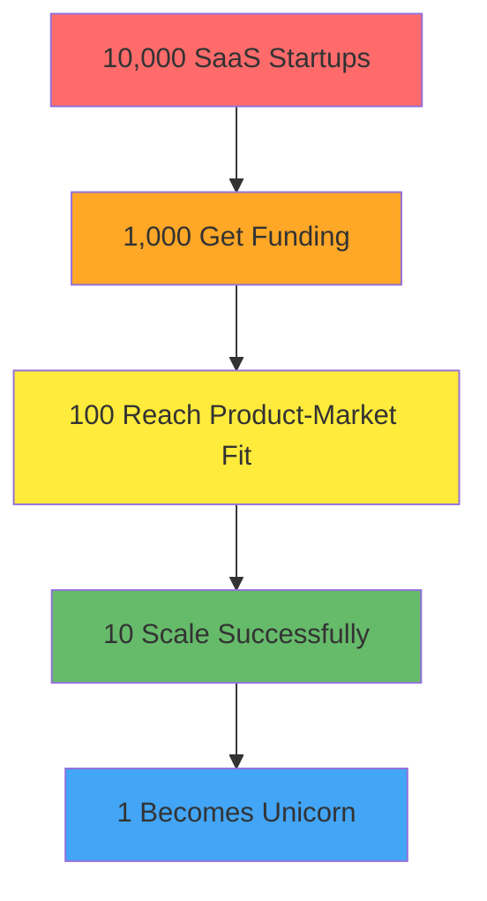
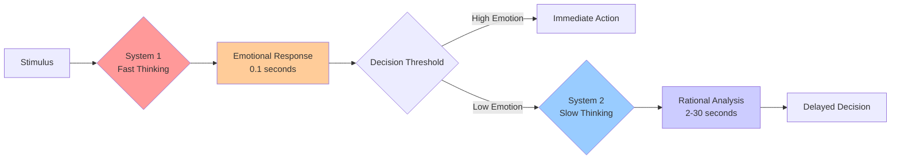
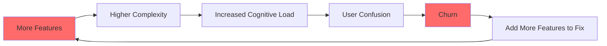
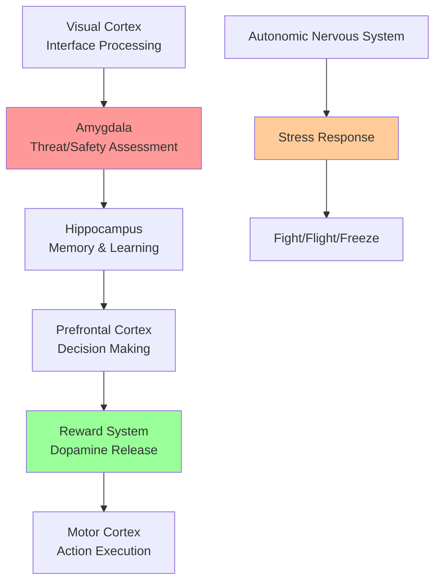
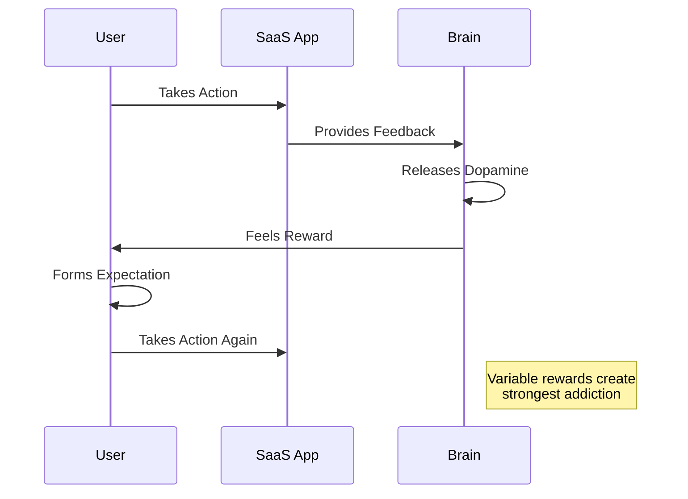
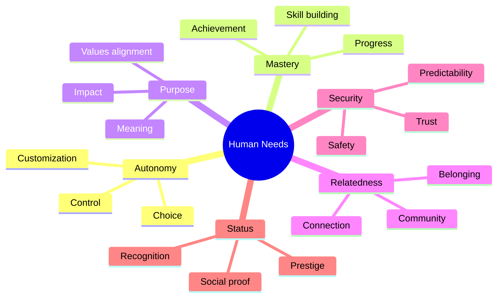
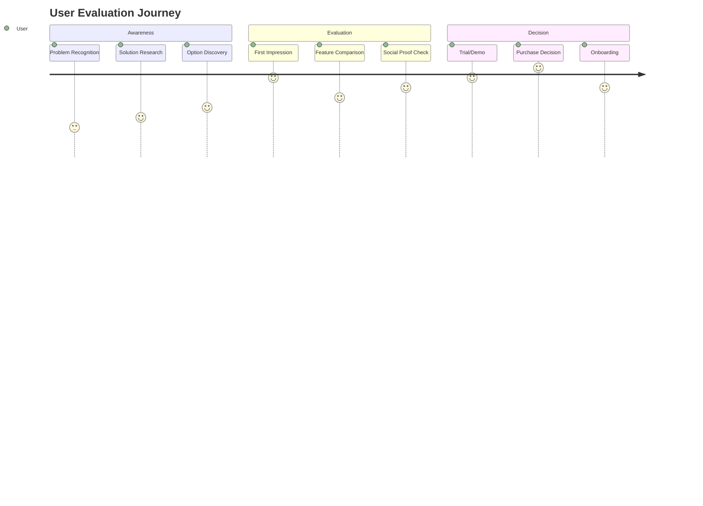
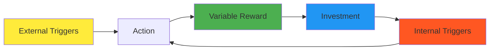
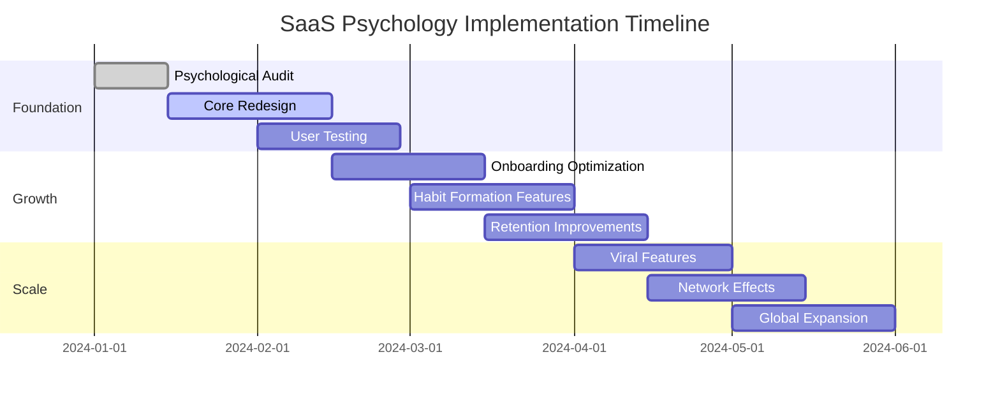

# INTRODUCTION: The Invisible Force

*How Psychology Became the $100 Billion Secret Behind Every Successful SaaS Company*

---

## 🧠 **The Hidden Operating System of Software**

Every time you open Slack and feel compelled to check that red notification badge. Every time you customize your Notion workspace for hours instead of working. Every time you share a Figma design and feel a small rush of social validation. Every time you upgrade your Canva subscription just to unlock that one perfect template.

These aren't accidents. They're the result of carefully crafted psychological design.

Welcome to the invisible force that determines whether your SaaS company joins the 90% that fail within the first year, or the 1% that achieve billion-dollar valuations.

---

## 📊 **The $100 Billion Psychology Advantage**

### The Stark Reality



**What separates the winners from the losers?**

It's not better technology. Zoom wasn't technically superior to Skype. Slack wasn't the first team communication tool. Notion wasn't the first note-taking app.

The difference is psychology.

### The Psychology Premium

| Company | Valuation | Key Psychological Hook | Annual Revenue |
|---------|-----------|------------------------|----------------|
| **Slack** | $27.7B | Communication Addiction | $1.54B |
| **Zoom** | $25.4B | Simplicity Psychology | $4.1B |
| **Notion** | $10B | Perfectionism & Customization | $100M+ |
| **Figma** | $20B | Collaborative Social Pressure | $400M+ |
| **Canva** | $40B | Competence & Achievement | $1.7B |
| **Salesforce** | $248B | Status & Hierarchy | $31.4B |

**Combined Psychology Premium: Over $370 Billion**

---

## 🔬 **The Science Behind SaaS Success**

### The Human Decision-Making Process



**The Critical Insight:** 95% of software decisions happen in System 1 (emotional, fast) thinking. Most SaaS companies design for System 2 (rational, slow) thinking.

### The Psychology Stack

```mermaid
pyramid
    title SaaS Psychology Hierarchy
    "Viral Growth & Network Effects" : 5
    "Retention & Habit Formation" : 15
    "Feature Adoption & Engagement" : 25
    "Onboarding & First Impressions" : 30
    "Core Human Needs & Motivations" : 25
```

**Layer 1: Core Human Needs (Foundation)**
- Autonomy, Mastery, Purpose, Relatedness, Security, Status

**Layer 2: First Impressions & Onboarding**
- Trust signals, cognitive load management, aha moments

**Layer 3: Feature Adoption & Engagement**
- Progressive disclosure, gamification, personalization

**Layer 4: Retention & Habit Formation**
- Hook model, triggers, rewards, investment

**Layer 5: Viral Growth & Network Effects**
- Social psychology, sharing motivations, community building

---

## 🎯 **Why 90% of SaaS Companies Fail to Understand Psychology**

### The Five Fatal Mistakes

#### 1. **Feature-First Thinking**
```
❌ Traditional Approach:
"Let's build the best features" → "Users will love our product"

✅ Psychology-First Approach:
"What do users really need psychologically?" → "How can features fulfill those needs?"
```

#### 2. **Rational Bias**
Most founders are engineers who think rationally. But users decide emotionally.

| Founder Thinking | User Reality |
|------------------|--------------|
| "This saves 30% time" | "Does this make me look smart?" |
| "Advanced analytics dashboard" | "Can I understand this in 5 seconds?" |
| "Enterprise-grade security" | "Do I trust this company?" |
| "99.9% uptime guarantee" | "Will this work when I need it?" |

#### 3. **The Complexity Trap**


#### 4. **Ignoring the Emotional Journey**

**Traditional SaaS Journey:**
```
Sign Up → Setup → Use Features → Pay → Churn
```

**Psychology-Driven Journey:**
```
Emotional Hook → Trust Building → Quick Win → Habit Formation → 
Identity Alignment → Social Validation → Loyalty → Advocacy
```

#### 5. **Metrics Myopia**
Focus on vanity metrics instead of psychological indicators.

| Traditional Metrics | Psychological Metrics |
|-------------------|----------------------|
| Monthly Active Users | Habit Strength Score |
| Feature Usage | Emotional Engagement Level |
| Conversion Rate | Trust & Credibility Index |
| Churn Rate | Psychological Switching Costs |
| Revenue | Identity Investment Score |

---

## 🧬 **The Neuroscience of Software Adoption**

### The Brain on SaaS



### The 7-Second Rule

Research shows users form lasting impressions of software in just 7 seconds:

| Time | Brain Activity | SaaS Implication |
|------|----------------|------------------|
| **0.05s** | Visual pattern recognition | Logo, colors, layout matter instantly |
| **0.5s** | Emotional reaction | Trust/distrust already forming |
| **2s** | Cognitive assessment | "Can I figure this out?" |
| **7s** | Memory consolidation | First impression locked in |
| **30s** | Attention threshold | User decides to stay or leave |

### The Dopamine Loop in Software



---

## 🎭 **The Psychology of Different User Types**

### The Five SaaS Personality Archetypes

#### 1. **The Optimizer** (25% of users)
- **Core Drive:** Efficiency and control
- **Trigger Words:** "Save time," "Optimize," "Control"
- **Design Preferences:** Clean, functional, data-rich
- **Example Products:** Salesforce, HubSpot, Monday.com

#### 2. **The Creator** (20% of users)
- **Core Drive:** Self-expression and achievement
- **Trigger Words:** "Create," "Design," "Build"
- **Design Preferences:** Visual, customizable, inspiring
- **Example Products:** Canva, Figma, Notion

#### 3. **The Connector** (20% of users)
- **Core Drive:** Social belonging and communication
- **Trigger Words:** "Collaborate," "Share," "Together"
- **Design Preferences:** Social features, sharing, community
- **Example Products:** Slack, Discord, Loom

#### 4. **The Explorer** (20% of users)
- **Core Drive:** Discovery and learning
- **Trigger Words:** "Discover," "Learn," "Explore"
- **Design Preferences:** Guided experiences, tutorials, gamification
- **Example Products:** Duolingo, Coursera, Spotify

#### 5. **The Achiever** (15% of users)
- **Core Drive:** Status and recognition
- **Trigger Words:** "Achieve," "Advanced," "Professional"
- **Design Preferences:** Progress indicators, badges, leaderboards
- **Example Products:** LinkedIn Learning, Strava, GitHub

### Psychological Profiling Matrix

| Archetype | Primary Motivation | Fear | Reward System | Retention Strategy |
|-----------|-------------------|------|---------------|-------------------|
| **Optimizer** | Control & Efficiency | Wasted time/resources | Time savings metrics | Workflow automation |
| **Creator** | Self-expression | Creative blocks | Creation milestones | Template libraries |
| **Connector** | Social belonging | Social isolation | Social validation | Community features |
| **Explorer** | Discovery | Missing out | Knowledge badges | Progressive content |
| **Achiever** | Status & Recognition | Falling behind | Public achievements | Competitive elements |

---

## 🔄 **The HOOKS Framework Explained**

This book is organized around the HOOKS framework - five interconnected psychological layers that determine SaaS success:

### **H - Human Needs**


### **O - Opportunity Psychology**
How users evaluate and choose your SaaS:



### **O - Onboarding Psychology**
First impressions and habit formation:

| Stage | Duration | Key Psychology | Success Metric |
|-------|----------|----------------|----------------|
| **First 10 seconds** | 0-10s | Visual appeal, trust | Stay rate |
| **First impression** | 10s-2min | Cognitive load, clarity | Setup completion |
| **First value** | 2-15min | Achievement, progress | First success |
| **First habit** | 1-7 days | Routine formation | Daily return rate |
| **First identity** | 1-4 weeks | Self-concept alignment | Feature adoption |

### **K - Keep Psychology**
Retention, engagement, and loyalty drivers:



### **S - Scale Psychology**
Viral growth and network effects:

| Network Effect Type | Psychology Driver | Example | Viral Coefficient |
|-------------------|------------------|---------|------------------|
| **Direct** | More users = more value | Slack, WhatsApp | 1.2-1.5 |
| **Indirect** | Platform ecosystem | App stores | 0.8-1.2 |
| **Data** | More usage = smarter product | Spotify, Netflix | 0.6-0.9 |
| **Social** | Status and belonging | LinkedIn, Instagram | 1.0-2.0 |

---

## 📚 **How This Book Will Transform Your SaaS**

### The Three Transformation Levels

#### **Level 1: Foundation (Chapters 1-7)**
- Understanding human psychology and cognitive biases
- Applying psychology to design and user experience
- Building trust and managing cognitive load

**Expected Outcomes:**
- 15-30% improvement in conversion rates
- 20-40% reduction in user confusion and support tickets
- Better product-market fit through psychological alignment

#### **Level 2: Growth (Chapters 8-19)**
- Psychology of acquisition, onboarding, and retention
- Monetization and pricing psychology
- Building habit-forming products

**Expected Outcomes:**
- 25-50% improvement in user activation rates
- 30-60% increase in user retention
- 20-40% increase in customer lifetime value

#### **Level 3: Scale (Chapters 20-28)**
- Advanced psychological strategies
- Network effects and viral growth
- Global psychology and cultural considerations

**Expected Outcomes:**
- Viral coefficient improvements of 0.1-0.3
- Sustainable competitive advantages
- Global market expansion capabilities

### The Psychology Implementation Roadmap



---

## ⚖️ **The Ethics of Psychological Design**

### The Responsibility Framework

Using psychology in SaaS comes with great responsibility. This book emphasizes ethical application:

#### **The Four Pillars of Ethical Psychology**

1. **Value Creation**: Psychology should create genuine value for users
2. **Transparency**: Users should understand what's happening
3. **User Agency**: Users should maintain control and choice
4. **Long-term Wellbeing**: Design for sustainable, healthy usage

#### **Ethical vs. Manipulative Psychology**

| Ethical Application | Manipulative Application |
|--------------------|-------------------------|
| Reduces cognitive load | Exploits cognitive biases |
| Creates genuine value | Creates artificial addiction |
| Empowers user choice | Limits user agency |
| Transparent about benefits | Hides true costs |
| Builds long-term trust | Optimizes for short-term gain |

### The Psychological Impact Assessment

Before implementing any psychological principle, ask:

1. **Does this create genuine value for the user?**
2. **Would I want this used on someone I care about?**
3. **Does this respect user autonomy and choice?**
4. **Is this transparent and honest?**
5. **Does this contribute to healthy, sustainable usage?**

---

## 🎯 **What You'll Learn in Each Part**

### **Part I: The Human Foundation (Chapters 1-3)**
- How the brain processes software interfaces
- The 47 cognitive biases that affect SaaS adoption
- Core human drives that motivate software usage

### **Part II: Psychology-Driven Design (Chapters 4-7)**
- Visual psychology and interface design
- Interaction psychology and feedback loops
- Information architecture and mental models
- Cognitive load management

### **Part III: Acquisition Psychology (Chapters 8-10)**
- First impressions and trust building
- Conversion optimization through psychology
- Viral growth and social psychology

### **Part IV: Activation & Onboarding (Chapters 11-13)**
- Critical first-use psychology
- Habit formation in software
- Feature discovery and adoption

### **Part V: Engagement & Retention (Chapters 14-16)**
- Daily usage psychology
- Gamification and motivation
- Personalization and identity

### **Part VI: Monetization Psychology (Chapters 17-19)**
- Pricing psychology and value perception
- Upselling and expansion psychology
- Churn prevention and win-back

### **Part VII: Advanced Strategies (Chapters 20-22)**
- Network effects psychology
- AI and automation psychology
- Global and cultural psychology

### **Part VIII: Ethics & Responsibility (Chapters 23-24)**
- Ethical psychological design
- Preventing psychological harm

### **Part IX: Competitive Psychology (Chapters 25-26)**
- Building psychological moats
- Market category creation

### **Part X: Implementation (Chapters 27-28)**
- Research methods and testing
- Measuring psychological impact

---

## 🚀 **Your Psychology-Driven SaaS Journey Starts Now**

By the end of this book, you'll have:

- **A complete psychological framework** for building addictive SaaS products
- **47 cognitive biases** with specific SaaS applications
- **50+ behavioral design patterns** ready to implement
- **Real case studies** from billion-dollar companies
- **Ethical guidelines** for responsible psychology use
- **Measurement frameworks** to track psychological impact
- **A community** of psychology-driven SaaS builders

### The Billion-Dollar Question

*Will you be in the 90% that ignore psychology and struggle, or the 1% that master it and thrive?*

The invisible force of psychology is waiting to be harnessed. Let's begin.

---

## 📖 **Chapter Navigation**

**Next:** [Chapter 1: The SaaS User's Brain](./part-1-human-foundation/chapter-01-saas-users-brain.md)

**Full Contents:** [Complete Table of Contents](../index.md)

---

*"Every interaction in your SaaS is a psychological moment. Master these moments, and you master your market."*
