# Chapter 1: The SaaS User's Brain

*Understanding the Neuroscience Behind Software Adoption and Digital Decision-Making*

---

## 🧠 **Learning Objectives**

By the end of this chapter, you'll understand:
- How the human brain processes software interfaces
- The neuroscience behind software adoption decisions
- The dual-system thinking model and its impact on SaaS design
- Memory, attention, and habit formation in digital environments
- How to design interfaces that work with, not against, the brain

---

## 🔬 **The Neuroscience of Software Adoption**

### The Brain's First Encounter with Software

When a user opens your SaaS application for the first time, their brain goes through a complex, multi-stage processing sequence that happens largely below conscious awareness:

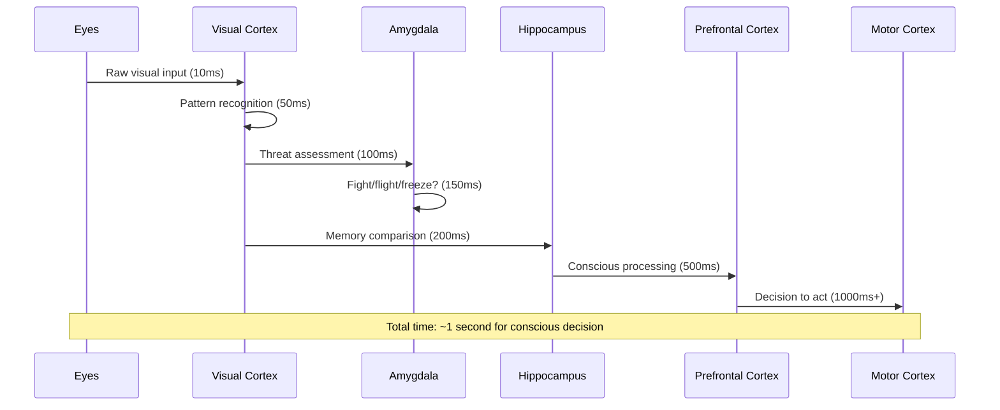

### The Three-Layer Brain Model for SaaS

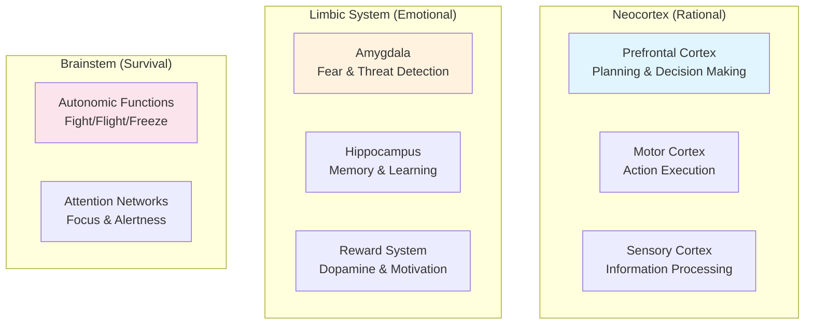

#### **Layer 1: Brainstem (Survival Brain)**
- **Function**: Automatic survival responses
- **Speed**: Instantaneous (0-50ms)
- **SaaS Impact**: First impression safety assessment
- **Design Implication**: Visual familiarity and trust signals are crucial

#### **Layer 2: Limbic System (Emotional Brain)**
- **Function**: Emotions, memory, motivation
- **Speed**: Very fast (50-500ms)
- **SaaS Impact**: Emotional reaction to interface
- **Design Implication**: Color, imagery, and emotional tone matter immensely

#### **Layer 3: Neocortex (Rational Brain)**
- **Function**: Logic, planning, language
- **Speed**: Slow (500ms+)
- **SaaS Impact**: Feature evaluation and decision-making
- **Design Implication**: Clear information hierarchy and logical flow

---

## ⚡ **Dual-System Thinking in SaaS**

### System 1 vs System 2 Thinking

Daniel Kahneman's groundbreaking research reveals two distinct modes of thinking that profoundly impact how users interact with software:

| Aspect | System 1 (Fast) | System 2 (Slow) |
|--------|-----------------|-----------------|
| **Speed** | Milliseconds | Seconds to minutes |
| **Effort** | Effortless | Requires mental energy |
| **Accuracy** | Often biased | More accurate |
| **Capacity** | Unlimited | Very limited |
| **Control** | Automatic | Controlled |
| **Examples** | Visual recognition, emotions | Math problems, planning |

### The 95/5 Rule in SaaS

**Critical Insight**: 95% of user interactions with software happen in System 1 thinking, but most SaaS companies design for System 2.

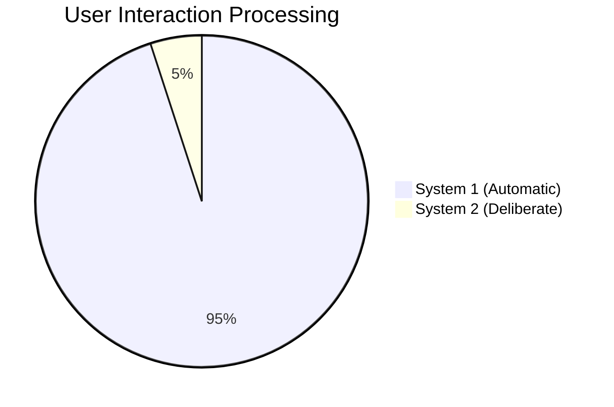

### System 1 Triggers in SaaS Interfaces

#### **Visual Processing (0-100ms)**
```markdown
System 1 Reactions:
✅ "This looks familiar" (uses established patterns)
✅ "This looks professional" (clean, consistent design)
✅ "This looks safe" (trust signals, security badges)
❌ "This looks confusing" (cluttered, inconsistent)
❌ "This looks sketchy" (poor design, no trust signals)
```

#### **Emotional Processing (100-300ms)**
```markdown
System 1 Emotions:
😊 Delight: Smooth animations, pleasant colors
😌 Comfort: Familiar icons, expected behaviors
😰 Anxiety: Too many choices, unclear navigation
😤 Frustration: Slow loading, broken features
```

#### **Pattern Recognition (50-200ms)**
```markdown
System 1 Patterns:
🔍 "Search box" → expects autocomplete
🛒 "Shopping cart" → expects items to accumulate
📧 "Envelope icon" → expects messages
❌ "X button" → expects to close
```

### Designing for System 1 Thinking

#### **1. Visual Familiarity**
Use established interface patterns that users recognize instantly:

| Pattern | User Expectation | System 1 Benefit |
|---------|-----------------|-------------------|
| Logo top-left | Clicks go to homepage | No thinking required |
| Search icon (🔍) | Opens search function | Instant recognition |
| Three lines (☰) | Opens menu | Universal symbol |
| Shopping cart | Shows items to buy | E-commerce familiarity |

#### **2. Emotional Priming**
Set the right emotional tone through design elements:

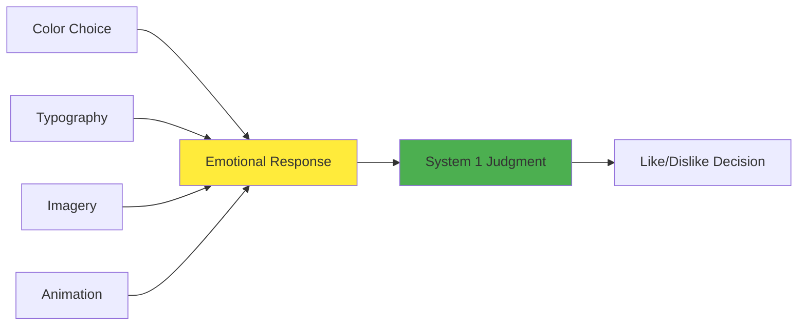

#### **3. Cognitive Ease**
Reduce mental effort through clear visual hierarchy:

```markdown
High Cognitive Ease:
✅ Clear visual hierarchy
✅ Consistent spacing
✅ Obvious interactive elements
✅ Predictable navigation

Low Cognitive Ease:
❌ Wall of text
❌ Inconsistent styling
❌ Unclear clickable areas
❌ Complex navigation
```

---

## 🧠 **Memory Systems and SaaS Usage**

### The Three Memory Systems

#### **1. Sensory Memory (0.5-3 seconds)**
- **Function**: Brief retention of sensory information
- **Capacity**: Large but very brief
- **SaaS Application**: Visual continuity during transitions
- **Design Principle**: Smooth animations prevent memory loss

#### **2. Working Memory (15-30 seconds)**
- **Function**: Conscious processing and manipulation
- **Capacity**: 7±2 items (Miller's Rule)
- **SaaS Application**: Information displayed simultaneously
- **Design Principle**: Chunk information into digestible pieces

#### **3. Long-term Memory (Permanent storage)**
- **Function**: Knowledge, skills, experiences
- **Capacity**: Virtually unlimited
- **SaaS Application**: User mental models and expertise
- **Design Principle**: Build on existing knowledge structures

### Working Memory and Interface Design

#### **The 7±2 Rule in Practice**

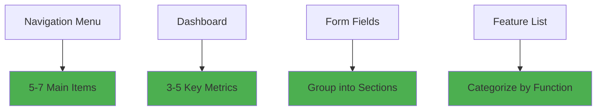

**Examples of Effective Chunking:**

| Interface Element | Poor Design | Good Design |
|-------------------|-------------|-------------|
| **Navigation** | 15 menu items | 6 categories with sub-items |
| **Dashboard** | 20 widgets at once | 4 key metrics prominently displayed |
| **Settings** | 50 options on one page | 6 sections with 5-8 options each |
| **Onboarding** | 15-step setup | 3 phases with 3-5 steps each |

### Memory Formation in SaaS Learning

#### **The Learning Progression**

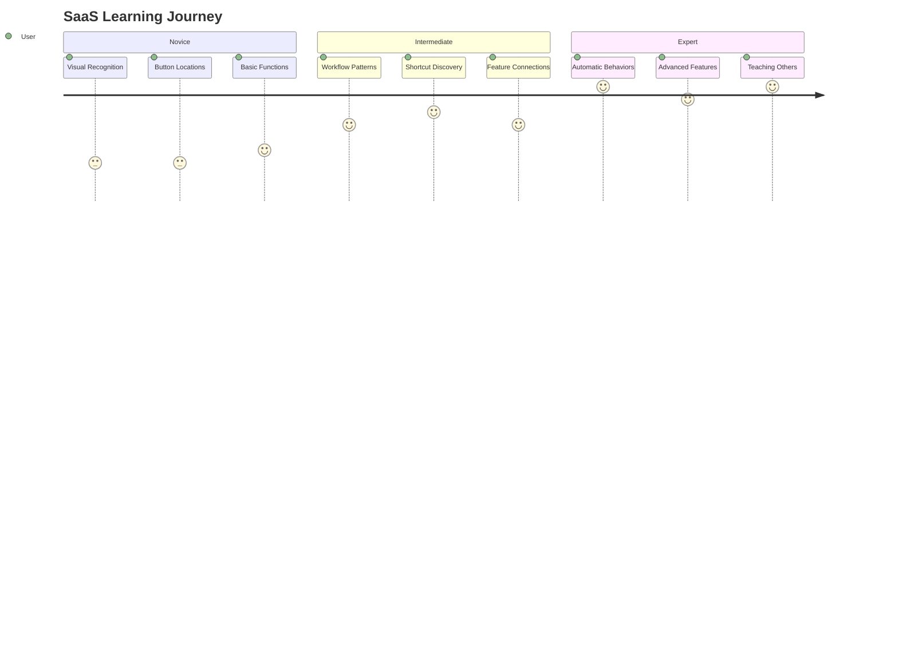

#### **Memory Consolidation Factors**

| Factor | Impact | SaaS Application |
|--------|--------|------------------|
| **Repetition** | High | Consistent interface patterns |
| **Emotion** | Very High | Delightful interactions |
| **Context** | Medium | Situational feature placement |
| **Sleep** | High | Spaced learning in onboarding |
| **Association** | High | Connect to existing knowledge |

---

## 👁️ **Attention Networks and Focus**

### The Three Attention Networks

#### **1. Alerting Network**
- **Function**: Maintaining vigilant state
- **Duration**: Minutes to hours
- **SaaS Impact**: Sustained engagement with application
- **Design Strategy**: Reduce cognitive fatigue through clear structure

#### **2. Orienting Network**
- **Function**: Directing attention to specific locations
- **Duration**: Seconds
- **SaaS Impact**: Guiding users to important elements
- **Design Strategy**: Visual hierarchy and contrast

#### **3. Executive Attention Network**
- **Function**: Resolving conflicting information
- **Duration**: Milliseconds to seconds
- **SaaS Impact**: Decision-making in complex interfaces
- **Design Strategy**: Minimize conflicting visual cues

### Attention Capture Mechanisms

#### **Bottom-Up Attention (Automatic)**

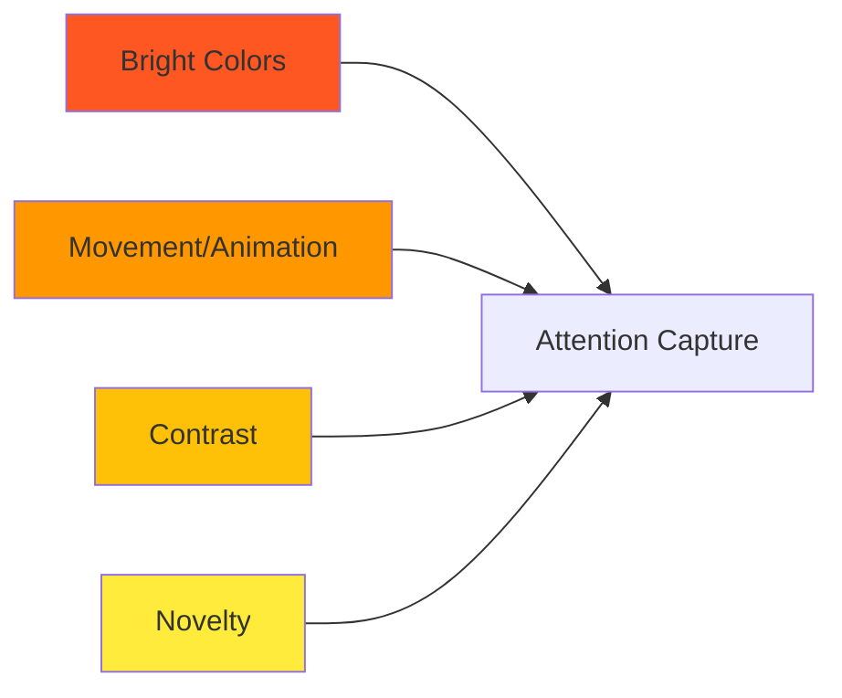

#### **Top-Down Attention (Goal-Directed)**

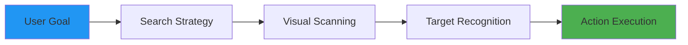

### Designing for Sustained Attention

#### **The Attention Budget Model**

Every user has a limited attention budget for your application:

| Attention Cost | Interface Element | Example |
|----------------|-------------------|---------|
| **High Cost** | Complex forms, dense information | Settings pages, analytics dashboards |
| **Medium Cost** | Navigation decisions, feature discovery | Main navigation, feature menus |
| **Low Cost** | Familiar patterns, automated actions | Standard buttons, known workflows |

#### **Attention Conservation Strategies**

1. **Reduce Visual Noise**
   ```markdown
   ❌ Multiple competing elements
   ✅ Clear focal points with supporting elements
   ```

2. **Use Progressive Disclosure**
   ```markdown
   ❌ Show all options at once
   ✅ Reveal complexity gradually
   ```

3. **Create Visual Rest Areas**
   ```markdown
   ❌ Dense, wall-to-wall content
   ✅ White space for cognitive breathing room
   ```

---

## 🔄 **Habit Formation in Digital Environments**

### The Neuroscience of Digital Habits

#### **The Habit Loop in Software**

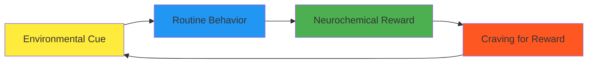

#### **Brain Changes During Habit Formation**

| Stage | Duration | Brain Activity | SaaS Behavior |
|-------|----------|----------------|---------------|
| **Conscious Learning** | Days 1-7 | High prefrontal cortex activity | User thinks about each action |
| **Transition** | Days 7-21 | Activity shifts to basal ganglia | Some actions become automatic |
| **Automatic Habit** | Day 21+ | Minimal conscious involvement | Reflexive app usage |

### The Five Stages of SaaS Habit Formation

#### **Stage 1: Trigger Recognition (Day 1-3)**
```markdown
Brain Process: Associating environmental cues with app usage
User Behavior: Learning when and why to use the app
Design Focus: Clear, consistent triggers and use cases
```

#### **Stage 2: Action Learning (Day 3-10)**
```markdown
Brain Process: Motor memory formation for interface actions
User Behavior: Learning how to navigate and use features
Design Focus: Intuitive interface patterns and shortcuts
```

#### **Stage 3: Reward Discovery (Day 5-15)**
```markdown
Brain Process: Dopamine pathway strengthening
User Behavior: Finding value and satisfaction in usage
Design Focus: Variable rewards and progress indicators
```

#### **Stage 4: Craving Development (Day 10-30)**
```markdown
Brain Process: Anticipatory dopamine release
User Behavior: Feeling urge to check or use the app
Design Focus: Notification strategy and engagement loops
```

#### **Stage 5: Automatic Behavior (Day 21+)**
```markdown
Brain Process: Basal ganglia takes over from prefrontal cortex
User Behavior: Using app without conscious decision
Design Focus: Maintaining habit strength and preventing decay
```

### Habit Strength Measurement

#### **The SaaS Habit Score**

Calculate your product's habit strength:

```
Habit Score = (Daily Active Users / Weekly Active Users) × 
              (Sessions per Day) × 
              (Average Session Length in minutes) × 
              (Days since last use)^-1
```

| Score Range | Habit Strength | User Behavior |
|-------------|----------------|---------------|
| **80-100** | Very Strong | Daily automatic usage |
| **60-79** | Strong | Regular intentional usage |
| **40-59** | Moderate | Occasional purposeful usage |
| **20-39** | Weak | Infrequent usage |
| **0-19** | Very Weak | Rare or one-time usage |

---

## 🎯 **The Psychology of Digital Decision-Making**

### Decision-Making Under Cognitive Load

#### **The Paradox of Choice in SaaS**

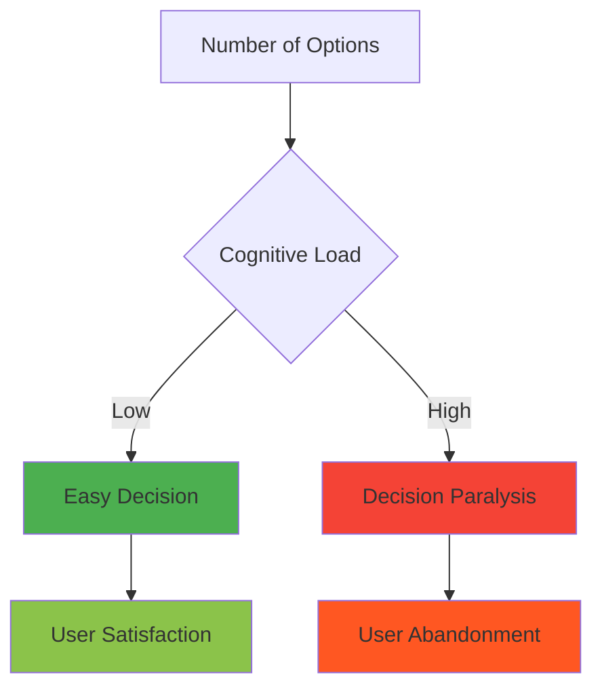

**The Sweet Spot**: 3-7 meaningful choices at any decision point.

#### **Decision Fatigue in Software**

| Time in Session | Decision Quality | User Behavior | Design Strategy |
|----------------|------------------|---------------|----------------|
| **0-5 minutes** | High | Careful evaluation | Present key decisions |
| **5-15 minutes** | Medium | Faster decisions | Provide smart defaults |
| **15+ minutes** | Low | Default acceptance | Minimize choices |

### Heuristics and Mental Shortcuts

#### **The Top 10 Decision Heuristics in SaaS**

1. **Availability Heuristic**
   - *Definition*: Judge probability by ease of recall
   - *SaaS Example*: Recent features seem more important
   - *Design Application*: Highlight key features prominently

2. **Anchoring Bias**
   - *Definition*: Over-rely on first information encountered
   - *SaaS Example*: First price seen influences value perception
   - *Design Application*: Strategic placement of pricing tiers

3. **Social Proof**
   - *Definition*: Look to others' behavior for guidance
   - *SaaS Example*: "Join 50,000+ users" increases sign-ups
   - *Design Application*: Display user counts and testimonials

4. **Authority Bias**
   - *Definition*: Defer to perceived experts
   - *SaaS Example*: "Recommended by experts" increases trust
   - *Design Application*: Expert endorsements and certifications

5. **Scarcity Effect**
   - *Definition*: Value things more when they seem rare
   - *SaaS Example*: "Limited time offer" creates urgency
   - *Design Application*: Time-limited trials or features

6. **Loss Aversion**
   - *Definition*: Prefer avoiding losses over acquiring gains
   - *SaaS Example*: "Don't lose your data" motivates upgrades
   - *Design Application*: Emphasize what users lose by not acting

7. **Confirmation Bias**
   - *Definition*: Seek information confirming existing beliefs
   - *SaaS Example*: Show features that match user's stated needs
   - *Design Application*: Personalized feature recommendations

8. **Default Effect**
   - *Definition*: Stick with pre-selected options
   - *SaaS Example*: Default settings are rarely changed
   - *Design Application*: Set optimal defaults for user success

9. **Endowment Effect**
   - *Definition*: Value things more once you own them
   - *SaaS Example*: Free trial users reluctant to lose access
   - *Design Application*: Let users invest time in setup

10. **Recency Effect**
    - *Definition*: Remember recent information better
    - *SaaS Example*: Last feature used seems most important
    - *Design Application*: Recent activity prominently displayed

---

## 🧪 **Measuring Brain Response to SaaS Interfaces**

### Neurological Measurement Techniques

#### **1. Eye Tracking**
```markdown
Measures:
- Fixation duration (attention intensity)
- Saccade patterns (visual scanning)
- Pupil dilation (cognitive load)

SaaS Applications:
- Heat maps of interface attention
- Reading patterns for content
- Cognitive effort indicators
```

#### **2. EEG (Electroencephalography)**
```markdown
Measures:
- Alpha waves (relaxation/focus)
- Beta waves (active thinking)
- Gamma waves (high-level cognitive processing)

SaaS Applications:
- Cognitive load during tasks
- Emotional responses to features
- Learning and memory formation
```

#### **3. fMRI (Functional Magnetic Resonance Imaging)**
```markdown
Measures:
- Blood flow to brain regions
- Neural network activation
- Real-time brain activity

SaaS Applications:
- Decision-making processes
- Reward system activation
- Memory formation patterns
```

### Behavioral Proxy Measures

#### **Micro-behavioral Indicators**

| Behavior | What It Indicates | Measurement Method |
|----------|-------------------|-------------------|
| **Mouse hesitation** | Uncertainty or confusion | Cursor tracking |
| **Scroll patterns** | Content engagement level | Scroll analytics |
| **Click accuracy** | Interface clarity | Heat mapping |
| **Time between actions** | Cognitive processing time | User session analysis |
| **Error recovery** | Mental model accuracy | Error tracking |

#### **The Cognitive Load Index**

Calculate interface cognitive load:

```
Cognitive Load Index = 
  (Time to First Action) × 0.3 +
  (Number of Hesitations) × 0.2 +
  (Error Rate) × 0.3 +
  (Task Completion Time) × 0.2
```

| CLI Score | Cognitive Load | User Experience |
|-----------|----------------|----------------|
| **0-2** | Very Low | Effortless |
| **2-4** | Low | Easy |
| **4-6** | Moderate | Manageable |
| **6-8** | High | Challenging |
| **8-10** | Very High | Overwhelming |

---

## 🎨 **Practical Applications for SaaS Design**

### The Brain-Based Design Checklist

#### **System 1 Optimization**
```markdown
✅ Visual Familiarity
- Use established interface patterns
- Maintain visual consistency
- Apply familiar metaphors

✅ Emotional Priming
- Choose colors that match intended emotion
- Use imagery that creates desired feeling
- Apply micro-animations for delight

✅ Cognitive Ease
- Clear visual hierarchy
- Obvious interactive elements
- Predictable navigation patterns
```

#### **Memory System Support**
```markdown
✅ Working Memory Management
- Limit simultaneous information to 7±2 items
- Group related elements together
- Use progressive disclosure for complexity

✅ Long-term Memory Building
- Create consistent mental models
- Build on existing user knowledge
- Provide clear conceptual frameworks
```

#### **Attention Optimization**
```markdown
✅ Attention Guidance
- Use contrast to direct focus
- Apply motion sparingly for important elements
- Create clear visual hierarchy

✅ Attention Conservation
- Minimize visual noise
- Provide white space for rest
- Reduce unnecessary decisions
```

### Case Study: Slack's Brain-Based Design

#### **System 1 Optimizations**
```markdown
Visual Familiarity:
- Chat interface mirrors SMS/messaging apps
- Channel structure similar to IRC/forums
- Emoji reactions match social media patterns

Emotional Priming:
- Friendly, colorful interface
- Playful loading messages
- Celebratory success animations
```

#### **Memory System Support**
```markdown
Working Memory:
- Left sidebar limits channels to visible space
- Message threading reduces conversation complexity
- Search functionality offloads memory burden

Long-term Memory:
- Consistent keyboard shortcuts
- Predictable notification patterns
- Stable interface layout over time
```

#### **Attention Design**
```markdown
Attention Guidance:
- Red badges for unread messages
- @ mentions highlighted in yellow
- Active channel clearly indicated

Attention Conservation:
- Clean, minimal interface
- Sidebar can be collapsed
- Focus mode reduces distractions
```

### Implementation Framework

#### **The 5-Step Brain-Based Design Process**

1. **Cognitive Audit**
   - Measure current cognitive load
   - Identify decision points
   - Map attention patterns

2. **System 1 Optimization**
   - Improve visual familiarity
   - Enhance emotional appeal
   - Increase cognitive ease

3. **Memory Enhancement**
   - Support working memory limits
   - Build consistent mental models
   - Create memorable experiences

4. **Attention Architecture**
   - Guide attention strategically
   - Conserve cognitive resources
   - Minimize visual noise

5. **Neurological Testing**
   - Measure brain response
   - Validate design decisions
   - Iterate based on evidence

---

## 📊 **Measuring Success: Brain-Based Metrics**

### Cognitive Performance Indicators

| Metric | What It Measures | Target Range | Collection Method |
|--------|------------------|--------------|-------------------|
| **Time to First Click** | System 1 processing speed | < 3 seconds | Analytics |
| **Task Completion Rate** | Interface clarity | > 90% | User testing |
| **Error Recovery Time** | Mental model accuracy | < 30 seconds | Session recording |
| **Cognitive Load Score** | Mental effort required | < 4/10 | Mixed methods |
| **Habit Formation Rate** | Automatic behavior development | > 60% daily return | Cohort analysis |

### A/B Testing for Brain Response

#### **Neurological A/B Test Framework**

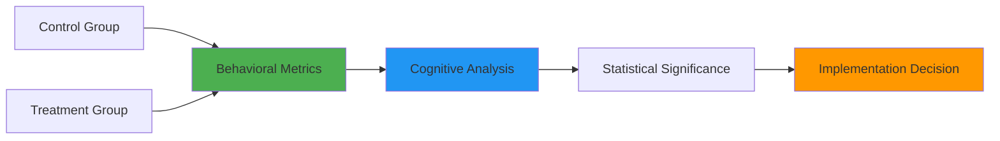

#### **Test Variables for Brain Response**

| Variable Category | Examples | Expected Brain Impact |
|------------------|----------|----------------------|
| **Visual Design** | Color schemes, typography, layout | System 1 processing speed |
| **Information Architecture** | Navigation structure, categorization | Working memory load |
| **Interaction Patterns** | Button placement, workflow steps | Motor memory formation |
| **Feedback Systems** | Notifications, progress indicators | Reward system activation |

---

## 🔑 **Key Takeaways**

### The Fundamental Principles

1. **The Brain Processes Software in Layers**
   - Survival first (safety assessment)
   - Emotion second (like/dislike)
   - Logic last (feature evaluation)

2. **95% of Interactions Are System 1**
   - Design for automatic, emotional processing
   - Use familiar patterns and clear visual hierarchy
   - Minimize cognitive effort for common tasks

3. **Memory Has Three Systems**
   - Sensory: Maintain visual continuity
   - Working: Limit to 7±2 simultaneous elements
   - Long-term: Build consistent mental models

4. **Attention Is Limited and Precious**
   - Guide attention with contrast and hierarchy
   - Conserve cognitive resources
   - Create visual rest areas

5. **Habits Form Through Repetition and Reward**
   - Consistent triggers and actions
   - Variable reward schedules
   - Progressive automation over 21+ days

### The Implementation Priority

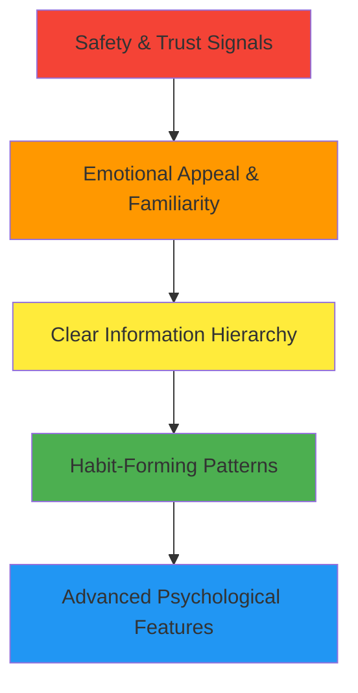

---

## 📚 **Next Steps**

Now that you understand how the brain processes software, you're ready to dive deeper into the specific cognitive biases that influence every SaaS decision.

**Next Chapter:** [Chapter 2: The 47 Cognitive Biases of SaaS](./chapter-02-cognitive-biases.md)

**Previous:** [Introduction: The Invisible Force](../introduction.md)

---

*"Understanding the brain is the first step to designing software that feels inevitable rather than complicated."*
