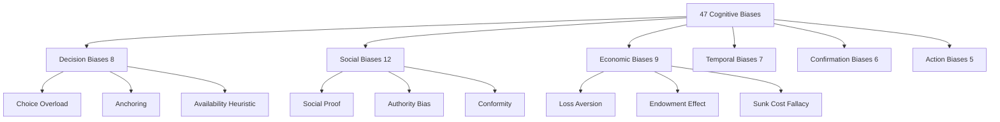
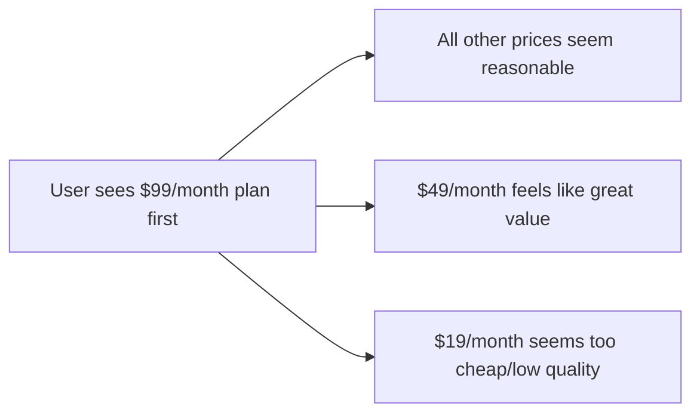
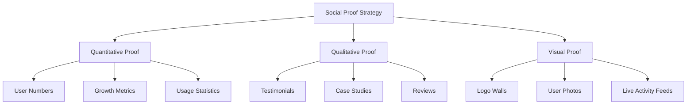
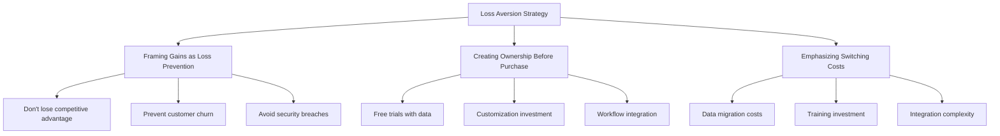
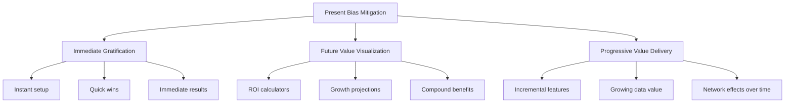
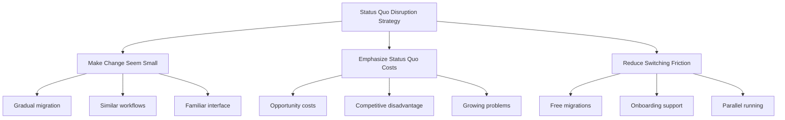
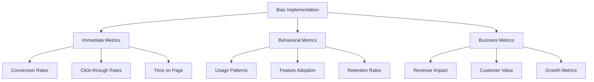

# Chapter 2: The 47 Cognitive Biases of SaaS

*The Complete Guide to Understanding and Leveraging Human Decision-Making Flaws in Software*

---

## Table of Contents

1. [Introduction: The Billion-Dollar Bias Opportunity](#introduction)
2. [Decision Biases: How Users Choose Software](#decision-biases)
3. [Social Biases: The Power of Others' Influence](#social-biases)
4. [Economic Biases: Money, Value, and Perception](#economic-biases)
5. [Temporal Biases: Time, Patience, and Urgency](#temporal-biases)
6. [Confirmation Biases: Seeking Supporting Evidence](#confirmation-biases)
7. [Action Biases: The Psychology of Taking Action](#action-biases)
8. [Implementation Framework: The Bias Audit System](#implementation)
9. [Real-World Applications](#real-world)
10. [Ethical Considerations](#ethics)

---

## Introduction: The Billion-Dollar Bias Opportunity {#introduction}

> *"The human brain is a wonderful organ; it starts working the moment you get up in the morning and does not stop until you get into the office."* - Robert Frost (modified for SaaS)

Cognitive biases aren't bugs in human thinking—they're features. They're mental shortcuts that help us navigate complex decisions quickly, but they also create predictable patterns that billion-dollar SaaS companies exploit every day.

### Why This Matters for SaaS

Every user interaction in your SaaS product is a decision moment influenced by cognitive biases:
- **Choosing your product** over competitors (Choice-supportive bias)
- **Upgrading** to paid plans (Loss aversion + Social proof)
- **Staying subscribed** vs churning (Sunk cost fallacy + Status quo bias)
- **Recommending** to others (Halo effect + Confirmation bias)

### The Complete 47 Bias Framework

This chapter covers all 47 cognitive biases that directly impact SaaS adoption, usage, and retention, organized into 6 strategic categories:



---

## Decision Biases: How Users Choose Software {#decision-biases}

### 1. Anchoring Bias
**Definition:** Over-relying on the first piece of information encountered.

**SaaS Application:**


**Implementation:**
- **Pricing Pages**: Show highest tier first
- **Feature Comparisons**: Lead with premium features
- **Onboarding**: Set high expectations early

**Case Study: Slack's Pricing Anchoring**
Slack shows their Enterprise Grid pricing ($12-15/user/month) prominently, making their Plus plan ($7.25/user/month) feel like a mid-market solution rather than expensive.

**A/B Testing Framework:**
```
Hypothesis: Moving highest-priced plan to the left will increase mid-tier conversions by 15-25%
Test: Price table order (High-Mid-Low vs Low-Mid-High)
Metrics: Conversion rate by plan, average revenue per user
Expected Lift: 15-25% increase in mid-tier selections
```

### 2. Choice Overload (Paradox of Choice)
**Definition:** Too many options lead to decision paralysis and decreased satisfaction.

**SaaS Sweet Spot:** 3-4 options maximum

**Implementation:**
- **Pricing Tiers**: Limit to 3-4 plans
- **Feature Sets**: Progressive disclosure
- **Onboarding Paths**: Guided vs. self-service options

**Case Study: Zoom's Simplicity**
Zoom deliberately keeps their pricing simple (Basic, Pro, Business, Enterprise) while competitors offer 6+ tiers. Result: Higher conversion rates and lower support burden.

**The Choice Architecture Framework:**
```
Too Few (1-2)     →  Optimal (3-4)     →  Too Many (5+)
No comparison     →  Clear comparison  →  Analysis paralysis
Higher bounce     →  Peak conversion   →  Decreased satisfaction
```

### 3. Availability Heuristic
**Definition:** Judging probability by how easily examples come to mind.

**SaaS Applications:**
- **Case Studies**: Feature recent, memorable success stories
- **Security Messaging**: Highlight recent breaches in competitor context
- **Feature Benefits**: Use vivid, specific examples

**Implementation Example:**
Instead of: "Improves team productivity"
Use: "Sarah's team shipped 3 features faster last sprint using our collaboration tools"

### 4. Representativeness Heuristic
**Definition:** Judging similarity to mental prototypes.

**SaaS Application:**
- **Design**: Match category expectations (CRM should look professional, creative tools colorful)
- **Positioning**: Align with category leaders' patterns
- **Feature Naming**: Use familiar terminology

### 5. Confirmation Bias
**Definition:** Seeking information that confirms existing beliefs.

**SaaS Strategy:**
- **Onboarding**: Confirm users made the right choice
- **Feature Discovery**: Highlight features that match user's workflow
- **Content Marketing**: Address their existing pain points

### 6. Framing Effect
**Definition:** Decisions influenced by how information is presented.

**SaaS Framing Examples:**
- **"90% uptime"** vs **"Only 36 hours downtime per year"**
- **"Save 40 hours per month"** vs **"Increase productivity by 25%"**
- **"Used by 50,000+ teams"** vs **"Trusted by teams worldwide"**

### 7. Decoy Effect
**Definition:** Preferences change when a third, inferior option is introduced.

**Pricing Table Psychology:**
```
Plan A: $19/month (Basic)
Plan B: $79/month (Professional) ← Target
Plan C: $75/month (Professional - Lite) ← Decoy
```

The slightly inferior Plan C makes Plan B look like exceptional value.

### 8. Default Bias
**Definition:** Tendency to stick with pre-set options.

**SaaS Implementation:**
- **Settings**: Choose optimal defaults for user success
- **Notifications**: Default to helpful, not spammy
- **Features**: Progressive opt-in vs. opt-out strategy

---

## Social Biases: The Power of Others' Influence {#social-biases}

### 9. Social Proof
**Definition:** Following others' behavior in uncertain situations.

**SaaS Social Proof Hierarchy:**
1. **Expert Social Proof**: "Recommended by industry leaders"
2. **Celebrity Social Proof**: "Used by Elon Musk's companies"
3. **User Social Proof**: "Join 100,000+ teams"
4. **Wisdom of Crowds**: "Most popular plan"
5. **Wisdom of Friends**: "3 of your connections use this"

**Implementation Framework:**


**Case Study: Figma's Social Proof Evolution**
- **2016**: "Design tool for teams"
- **2018**: "Used by teams at Microsoft, Airbnb, GitHub"
- **2020**: "Design tool used by 1M+ designers"
- **2022**: "Where design teams build the world's best products"

### 10. Authority Bias
**Definition:** Attributing greater accuracy to the opinion of an authority figure.

**SaaS Authority Building:**
- **Founder Credibility**: Previous successful exits, recognizable backgrounds
- **Industry Recognition**: Awards, certifications, partnerships
- **Expert Endorsements**: Analyst reports, thought leader quotes
- **Media Coverage**: Press mentions, podcast appearances

### 11. Bandwagon Effect
**Definition:** Adopting beliefs/behaviors because many others have done so.

**SaaS Implementation:**
- **Growth Messaging**: "Fastest-growing CRM" / "Trending on Product Hunt"
- **Usage Stats**: "Teams switching from [competitor] every day"
- **Community Size**: Active user counts, community metrics

### 12. In-group Bias
**Definition:** Favoring group members over outsiders.

**SaaS Community Strategy:**
- **User Communities**: Slack channels, Discord servers
- **Exclusive Access**: Beta programs, insider features
- **Identity Marketing**: "For developers, by developers"

### 13. Halo Effect
**Definition:** Overall impression influences specific trait judgments.

**SaaS Brand Halo:**
- **Design Quality** → Perceived product quality
- **Customer Support** → Overall product trust
- **Security Posture** → Professional credibility

### 14. Mere Exposure Effect
**Definition:** Developing preference through repeated exposure.

**SaaS Touchpoint Strategy:**
- **Content Marketing**: Regular valuable content
- **Product Trials**: Extended exposure periods
- **Retargeting**: Consistent brand presence

### 15. Reciprocity Bias
**Definition:** Feeling obligated to return favors.

**SaaS Reciprocity Framework:**
- **Free Value First**: Tools, templates, resources
- **Personal Attention**: Custom onboarding, dedicated support
- **Unexpected Delights**: Surprise features, early access

### 16. Liking Bias
**Definition:** Being influenced by people we like.

**SaaS Likability Factors:**
- **Similarity**: Shared backgrounds, experiences
- **Compliments**: Recognizing user achievements
- **Cooperation**: Working toward shared goals
- **Physical Attractiveness**: Beautiful design, smooth interactions

### 17. Conformity Bias
**Definition:** Changing behavior to match group norms.

**SaaS Conformity Triggers:**
- **Usage Patterns**: "Most teams use this feature weekly"
- **Setup Guidance**: "Best practice setup used by successful teams"
- **Feature Adoption**: "Teams like yours typically enable these integrations"

### 18. False Consensus Effect
**Definition:** Overestimating how much others share our beliefs.

**SaaS Strategy:**
- **Assumption Validation**: Challenge user assumptions through data
- **Perspective Broadening**: Show diverse use cases
- **Reality Anchoring**: Benchmark against peer performance

### 19. Fundamental Attribution Error
**Definition:** Attributing others' actions to character vs. circumstances.

**SaaS Application:**
- **User Success**: Attribute to their smart choice, not luck
- **Competitor Comparison**: Focus on feature gaps, not context
- **Churn Analysis**: Consider situational factors, not just product fit

### 20. Stereotyping
**Definition:** Applying generalized beliefs about groups to individuals.

**SaaS Considerations:**
- **Avoid Negative Stereotypes**: Don't assume user capabilities
- **Leverage Positive Stereotypes**: Professional tools for professionals
- **Break Stereotype Barriers**: Accessible design for all users

---

## Economic Biases: Money, Value, and Perception {#economic-biases}

### 21. Loss Aversion
**Definition:** Losses feel twice as powerful as equivalent gains.

**SaaS Loss Aversion Framework:**


**Case Study: Salesforce's Loss Aversion Mastery**
- **Onboarding**: Heavy customization investment creates switching costs
- **Messaging**: "Don't lose deals in spreadsheets"
- **Retention**: "Your custom workflows are irreplaceable"

### 22. Endowment Effect
**Definition:** Valuing things more highly just because we own them.

**SaaS Implementation:**
- **Free Trials**: Let users build workflows, import data
- **Customization**: Encourage personal investment
- **Progress Tracking**: Show accumulated value over time

**The Endowment Escalation:**
```
Week 1: Basic usage (low endowment)
Week 2: Data import (medium endowment)
Week 3: Customization (high endowment)
Week 4: Team collaboration (very high endowment)
```

### 23. Sunk Cost Fallacy
**Definition:** Continuing investment based on previously invested resources.

**SaaS Sunk Cost Strategy:**
- **Onboarding Investment**: Time spent learning the system
- **Data Investment**: Historical data accumulation
- **Integration Investment**: Connected tools and workflows
- **Team Investment**: Multiple users trained and active

### 24. Mental Accounting
**Definition:** Treating money differently based on arbitrary categories.

**SaaS Mental Accounting:**
- **Budget Categories**: "Marketing tools" vs. "Productivity tools"
- **Cost Framing**: "Cost per employee" vs. "Total monthly cost"
- **Value Attribution**: ROI calculations by department

### 25. Price Anchoring
**Definition:** Heavy reliance on first price information.

**Advanced Anchoring Techniques:**
- **Competitor Comparison**: "Others charge $200/month, we're $99"
- **Value Anchoring**: "Save $50,000/year on hiring"
- **Historical Anchoring**: "Used to be $199, now $99"

### 26. Hyperbolic Discounting
**Definition:** Preferring smaller, immediate rewards over larger, delayed ones.

**SaaS Time Preference Strategy:**
- **Immediate Value**: Instant setup, immediate results
- **Quick Wins**: Early achievements and progress
- **Delayed Benefits**: Long-term ROI messaging for later

### 27. Prospect Theory
**Definition:** Decisions based on potential value of losses/gains rather than final outcome.

**SaaS Prospect Theory Application:**
- **Reference Point Setting**: Establish current state baseline
- **Gain Framing**: Focus on improvements from baseline
- **Loss Framing**: What they'll miss without the tool

### 28. Zero-Risk Bias
**Definition:** Preference for reducing small risks to zero over reducing larger risks significantly.

**SaaS Risk Mitigation:**
- **Free Trials**: Zero-risk evaluation
- **Money-Back Guarantees**: Zero financial risk
- **Security Certifications**: Zero compliance risk

### 29. Certainty Effect
**Definition:** Overweighting outcomes that are certain vs. probable.

**SaaS Certainty Messaging:**
- **Guaranteed Results**: "100% uptime SLA"
- **Certain Outcomes**: "Definitely save 10 hours/week"
- **Risk-Free Trials**: "No commitment required"

---

## Temporal Biases: Time, Patience, and Urgency {#temporal-biases}

### 30. Present Bias
**Definition:** Overvaluing immediate rewards relative to future rewards.

**SaaS Present Bias Strategy:**


### 31. Planning Fallacy
**Definition:** Underestimating time, costs, and risks of future actions.

**SaaS Planning Fallacy Applications:**
- **Implementation Timelines**: Realistic onboarding expectations
- **Feature Development**: Conservative delivery promises
- **ROI Projections**: Conservative benefit estimates

### 32. Time Discounting
**Definition:** Valuing immediate rewards more than future rewards.

**SaaS Time Discounting Strategy:**
- **Immediate Benefits**: Quick setup, instant insights
- **Compound Value**: Show growing benefits over time
- **Usage Momentum**: Build habits that create future value

### 33. Urgency Effect
**Definition:** Prioritizing tasks with shorter deadlines over more important tasks.

**SaaS Urgency Creation:**
- **Limited Time Offers**: Annual plan discounts
- **Scarcity Messaging**: "Only 50 spots left in beta"
- **Deadline Pressure**: "Ends this Friday"

### 34. Procrastination
**Definition:** Delaying tasks despite knowing negative consequences.

**SaaS Anti-Procrastination Design:**
- **Friction Reduction**: One-click setup
- **Progress Saving**: Partial completion saves
- **Gentle Reminders**: Non-pushy follow-ups

### 35. Temporal Reframing
**Definition:** Changing time perspective to influence decisions.

**SaaS Temporal Reframing:**
- **Daily Cost**: "$99/month = $3.30/day"
- **Hourly Value**: "Save 10 hours/week = $500 value"
- **Annual Benefits**: "12 months of growth"

### 36. Peak-End Rule
**Definition:** Judging experiences by peak moment and how they ended.

**SaaS Peak-End Strategy:**
- **Onboarding Peak**: Amazing aha moment
- **Usage Peaks**: Delightful features and interactions
- **Support Peaks**: Exceptional problem resolution
- **Ending Well**: Smooth offboarding if needed

---

## Confirmation Biases: Seeking Supporting Evidence {#confirmation-biases}

### 37. Confirmation Bias
**Definition:** Searching for information that confirms existing beliefs.

**SaaS Confirmation Strategy:**
- **User Research**: Ask leading questions that confirm value
- **Feature Discovery**: Highlight features that match their workflow
- **Success Stories**: Case studies from similar companies

### 38. Cherry Picking
**Definition:** Selecting data that supports desired conclusion.

**SaaS Cherry Picking (Ethical):**
- **Metric Selection**: Focus on metrics where you excel
- **Testimonial Curation**: Feature most relevant success stories
- **Case Study Focus**: Highlight your strongest value propositions

### 39. Survivorship Bias
**Definition:** Focusing on successful examples while overlooking failures.

**SaaS Survivorship Awareness:**
- **Honest Case Studies**: Include challenges overcome
- **Realistic Expectations**: Not all users will see same results
- **Diverse Examples**: Show various success patterns

### 40. Selection Bias
**Definition:** Non-random sample leading to incorrect conclusions.

**SaaS Selection Bias Mitigation:**
- **User Research**: Representative sample selection
- **Feedback Collection**: Multiple channels and user types
- **Success Measurement**: Account for different user segments

### 41. Availability Cascade
**Definition:** Collective belief strengthened by repetition in public discourse.

**SaaS Availability Cascade:**
- **Thought Leadership**: Repeated valuable insights
- **Category Creation**: Consistent messaging around new categories
- **Best Practices**: Reinforcing successful approaches

### 42. Belief Bias
**Definition:** Accepting conclusions that align with existing beliefs.

**SaaS Belief Alignment:**
- **Value Proposition**: Match user's existing beliefs about solutions
- **Positioning**: Align with their mental model of the problem
- **Messaging**: Confirm their intuitions about what should work

---

## Action Biases: The Psychology of Taking Action {#action-biases}

### 43. Status Quo Bias
**Definition:** Preferring things to stay the same.

**SaaS Status Quo Disruption:**


### 44. Action Bias
**Definition:** Tendency to favor action over inaction.

**SaaS Action Bias Utilization:**
- **Interactive Demos**: Let users take action immediately
- **Quick Start Guides**: Actionable first steps
- **Progressive Tasks**: Building momentum through action

### 45. Analysis Paralysis
**Definition:** Over-analyzing situations to the point of never taking action.

**SaaS Analysis Paralysis Prevention:**
- **Limited Options**: Reduce decision complexity
- **Guided Paths**: Recommended next steps
- **Risk Reduction**: Free trials, guarantees

### 46. Optimism Bias
**Definition:** Overestimating positive outcomes and underestimating negative ones.

**SaaS Optimism Utilization:**
- **Positive Framing**: Focus on successful outcomes
- **Growth Messaging**: Emphasize upside potential
- **Success Visualization**: Help users imagine success

### 47. Planning Fallacy
**Definition:** Underestimating time and costs while overestimating benefits.

**SaaS Planning Fallacy Management:**
- **Realistic Timelines**: Conservative implementation estimates
- **Incremental Value**: Show benefits at each stage
- **Success Metrics**: Track actual vs. expected outcomes

---

## Implementation Framework: The Bias Audit System {#implementation}

### The 4-Stage Bias Implementation Process

#### Stage 1: Audit Current State
**User Journey Bias Mapping:**
```
Discovery → Consideration → Trial → Purchase → Onboarding → Usage → Renewal
    ↓           ↓           ↓        ↓          ↓         ↓       ↓
Availability  Anchoring   Loss    Social     Endowment  Habit   Sunk Cost
Heuristic     Bias        Aversion Proof     Effect     Form.   Fallacy
```

**Bias Audit Checklist:**
- [ ] **Homepage**: What biases are we leveraging or fighting?
- [ ] **Pricing Page**: How are we using anchoring, social proof, loss aversion?
- [ ] **Trial Experience**: Which biases encourage continued usage?
- [ ] **Onboarding**: How do we create endowment and reduce status quo bias?
- [ ] **Feature Discovery**: What biases drive feature adoption?
- [ ] **Renewal Process**: Which biases encourage subscription renewal?

#### Stage 2: Prioritize Bias Opportunities
**The ROI-Effort Matrix:**
```
High ROI, Low Effort (Quick Wins):
- Social proof implementation
- Anchoring in pricing
- Default option optimization

High ROI, High Effort (Strategic Projects):
- Personalization engines
- Behavioral email sequences
- Advanced choice architecture

Low ROI, Low Effort (Nice to Have):
- Aesthetic improvements
- Copy refinements
- Minor UX tweaks

Low ROI, High Effort (Avoid):
- Complex gamification
- Advanced AI without clear value
- Over-engineered solutions
```

#### Stage 3: A/B Testing Framework
**Bias-Based Hypothesis Formation:**
```
Bias: [Name of cognitive bias]
Current State: [How users currently behave]
Hypothesis: If we leverage [specific bias], then [expected behavior change]
Test Design: [Control vs. treatment description]
Success Metrics: [How we'll measure impact]
Expected Lift: [Predicted improvement]
```

**Example A/B Test:**
```
Bias: Social Proof + Authority
Current State: Generic testimonials on pricing page
Hypothesis: If we show testimonials from recognizable company logos, then conversion rates will increase by 15-25%
Test Design: 
- Control: Current testimonials
- Treatment: Logo testimonials from Fortune 500 companies
Success Metrics: Conversion rate, time on page, scroll depth
Expected Lift: 20% increase in conversions
```

#### Stage 4: Measure and Iterate
**Bias Performance Metrics:**
- **Immediate Impact**: Conversion rates, click-through rates
- **Behavioral Changes**: Usage patterns, feature adoption
- **Long-term Effects**: Retention, lifetime value, referrals

---

## Real-World Applications {#real-world}

### Case Study 1: Slack's Bias Mastery

**Biases Leveraged:**
1. **Social Proof**: "500,000+ teams use Slack daily"
2. **Network Effects**: Value increases with team adoption
3. **Endowment Effect**: Heavy customization investment
4. **Sunk Cost Fallacy**: Historical message archives
5. **Habit Formation**: Daily usage triggers

**Results:**
- 93% customer retention rate
- $23 billion valuation
- Category-defining market position

### Case Study 2: Zoom's Simplicity Psychology

**Biases Leveraged:**
1. **Choice Overload Reduction**: Simple pricing (4 tiers max)
2. **Default Bias**: Optimal default settings
3. **Mere Exposure**: Free tier creates familiarity
4. **Social Proof**: Usage growth during COVID-19
5. **Loss Aversion**: "Don't lose important meetings"

**Results:**
- 300% growth during pandemic
- 90%+ customer satisfaction
- Market leadership in video conferencing

### Case Study 3: Notion's Complexity Paradox

**Biases Leveraged:**
1. **Endowment Effect**: Heavy customization investment
2. **Sunk Cost Fallacy**: Time invested in setup
3. **In-group Bias**: Strong community identity
4. **Status Signaling**: Sophisticated workspace = professional
5. **Mastery Motivation**: Learning curve creates expertise pride

**Challenges:**
- Onboarding complexity
- Analysis paralysis from too many options
- High initial cognitive load

**Results:**
- $10 billion valuation despite complexity
- Cult-like user loyalty
- Strong word-of-mouth growth

---

## Ethical Considerations {#ethics}

### The Fine Line: Persuasion vs. Manipulation

**Ethical Guidelines for Bias Usage:**

#### ✅ Ethical Applications
- **Helping Users Make Better Decisions**: Using biases to guide toward beneficial choices
- **Reducing Cognitive Load**: Simplifying complex decisions
- **Creating Positive Habits**: Encouraging beneficial behaviors
- **Building Trust**: Using social proof to demonstrate reliability

#### ❌ Unethical Applications
- **Dark Patterns**: Deceiving users into unintended actions
- **Addiction Creation**: Exploiting biases to create harmful dependencies
- **Misleading Social Proof**: Fake testimonials or inflated numbers
- **Predatory Pricing**: Using biases to extract excessive value

### The Bias Ethics Framework

**Question 1**: Does this bias usage genuinely benefit the user?
**Question 2**: Would we be comfortable if users knew about this bias usage?
**Question 3**: Does this create long-term value or just short-term conversion?
**Question 4**: Are we transparent about our product's limitations?

### Building Ethical Bias Practices

1. **Transparency**: Be open about how your product works
2. **User Empowerment**: Give users control over their experience
3. **Long-term Value**: Focus on sustainable user success
4. **Regular Audits**: Review bias implementations for ethical concerns

---

## Measuring Bias Impact

### Key Performance Indicators (KPIs)

**Conversion Metrics:**
- Sign-up conversion rate by bias implementation
- Free-to-paid conversion improvements
- Feature adoption rates

**Engagement Metrics:**
- Time to first value (TTFV) improvements
- Daily/monthly active user changes
- Feature usage depth

**Retention Metrics:**
- Churn reduction by user segment
- Long-term retention improvements
- Reactivation success rates

**Business Metrics:**
- Customer lifetime value (CLV) improvements
- Average revenue per user (ARPU) increases
- Net promoter score (NPS) changes

### Measurement Framework



---

## Action Plan: Implementing Your Bias Strategy

### Week 1-2: Foundation
- [ ] Complete bias audit of current product
- [ ] Identify top 5 bias opportunities
- [ ] Map biases to user journey stages
- [ ] Set up measurement frameworks

### Week 3-4: Quick Wins
- [ ] Implement social proof elements
- [ ] Optimize pricing page anchoring
- [ ] Add scarcity/urgency where appropriate
- [ ] Test default option improvements

### Month 2: Strategic Implementation
- [ ] Design and launch major A/B tests
- [ ] Implement personalization based on biases
- [ ] Create bias-driven email sequences
- [ ] Develop advanced choice architecture

### Month 3: Optimization
- [ ] Analyze A/B test results
- [ ] Iterate on successful implementations
- [ ] Scale winning bias applications
- [ ] Plan next phase of bias optimization

### Ongoing: Ethics and Refinement
- [ ] Regular ethical audits
- [ ] User feedback collection
- [ ] Long-term impact measurement
- [ ] Continuous learning and adaptation

---

## Conclusion: Your Billion-Dollar Bias Advantage

Understanding and ethically leveraging cognitive biases isn't just about increasing conversion rates—it's about creating products that align with how humans naturally think and make decisions. Every billion-dollar SaaS company has mastered multiple cognitive biases, often without explicitly knowing it.

The companies that will dominate the next decade of SaaS won't just build better features—they'll build better psychological experiences. They'll understand that every user interaction is a bias moment, and they'll design those moments to create genuine value for users while driving sustainable business growth.

**Your Next Steps:**
1. **Start with the audit**: Which biases are you already using?
2. **Identify your biggest opportunities**: Where can biases drive meaningful improvement?
3. **Test systematically**: Use the A/B testing frameworks provided
4. **Measure thoughtfully**: Track both immediate and long-term impacts
5. **Iterate ethically**: Always prioritize user value over short-term gains

**Remember**: The goal isn't to manipulate users—it's to understand how they naturally make decisions and design experiences that work with their psychology, not against it.

In the next chapter, we'll explore how to tap into the core human drives that motivate all software adoption and usage...

---

## Tools & Resources

### Bias Testing Tools
- **Hotjar**: Heatmaps and user recordings to see bias effects
- **Optimizely**: A/B testing platform for bias experiments
- **Google Analytics**: Behavior flow analysis
- **Mixpanel**: Event tracking for bias-driven actions

### Further Reading
- "Thinking, Fast and Slow" by Daniel Kahneman
- "Predictably Irrational" by Dan Ariely
- "Influence: The Psychology of Persuasion" by Robert Cialdini
- "The Art of Choosing" by Sheena Iyengar

### Bias Research Resources
- Center for Advanced Hindsight (Duke University)
- Behavioral Economics Group
- Cognitive Bias Codex
- Psychology Today's Bias Library

---

*Next: Chapter 3 - Core Human Drives in Software*
