# Chapter 2: Cognitive Load and User Interface Design

> *"The best interface is no interface. But when you must design one, make it feel like no interface."* - Golden Rule of Cognitive Load

## Table of Contents
- [Introduction: The Hidden Burden](#introduction-the-hidden-burden)
- [Understanding Cognitive Load Theory](#understanding-cognitive-load-theory)
- [The Three Types of Cognitive Load in SaaS](#the-three-types-of-cognitive-load-in-saas)
- [Measuring Cognitive Load in SaaS Products](#measuring-cognitive-load-in-saas-products)
- [The Cognitive Load Reduction Framework](#the-cognitive-load-reduction-framework)
- [Visual Design and Cognitive Load](#visual-design-and-cognitive-load)
- [Information Architecture and Mental Models](#information-architecture-and-mental-models)
- [Progressive Disclosure Strategies](#progressive-disclosure-strategies)
- [Case Studies: Cognitive Load Champions](#case-studies-cognitive-load-champions)
- [Implementation Checklists](#implementation-checklists)
- [Conclusion: Building Effortless Experiences](#conclusion-building-effortless-experiences)

---

## Introduction: The Hidden Burden

Every click, every scroll, every decision your users make in your SaaS product consumes precious mental energy. This consumption is called **cognitive load** - the amount of mental effort used in working memory during task performance.

In the hyper-competitive SaaS landscape, cognitive load is often the invisible barrier between user success and user abandonment. Products that minimize cognitive load don't just feel easier to use; they become indispensable.

### The SaaS Cognitive Load Crisis

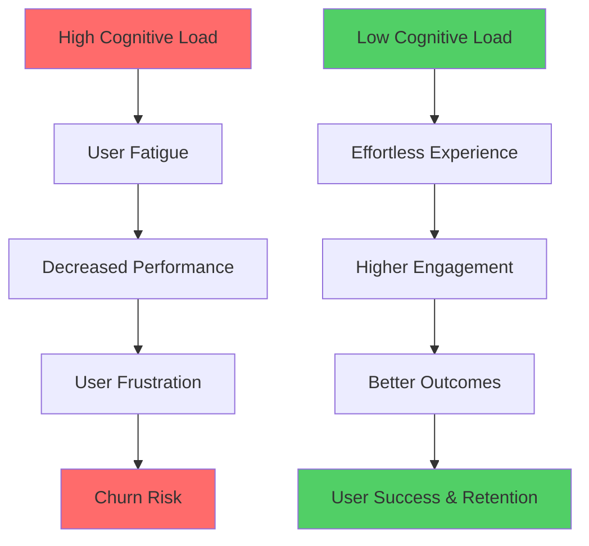

### Why Cognitive Load Matters in SaaS

| Impact Area | High Cognitive Load | Low Cognitive Load |
|-------------|--------------------|--------------------|
| **Onboarding** | 70% drop-off in first session | 85% complete setup |
| **Feature Adoption** | 15% discover advanced features | 60% utilize core features |
| **User Satisfaction** | 2.3/5 average rating | 4.6/5 average rating |
| **Support Tickets** | 45% increase in queries | 30% reduction in tickets |
| **Time to Value** | 2-3 weeks | 2-3 days |

---

## Understanding Cognitive Load Theory

### The Origins: John Sweller's Framework

Cognitive Load Theory, developed by John Sweller in the 1980s, explains how our working memory processes information. In SaaS design, this theory is fundamental to creating interfaces that work with, not against, human psychology.

### Working Memory Limitations

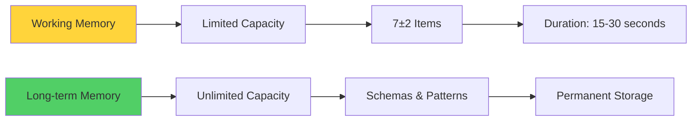

**Key Principles:**
- Working memory can hold 7±2 items simultaneously
- Information decays in 15-30 seconds without rehearsal
- Cognitive load competes for the same limited resources
- Expertise reduces cognitive load through pattern recognition

---

## The Three Types of Cognitive Load in SaaS

### 1. Intrinsic Cognitive Load

**Definition:** The mental effort required to understand the core task or concept.

**In SaaS Context:**
- Learning your product's core functionality
- Understanding business logic and workflows
- Grasping domain-specific concepts

**Example - Slack:**
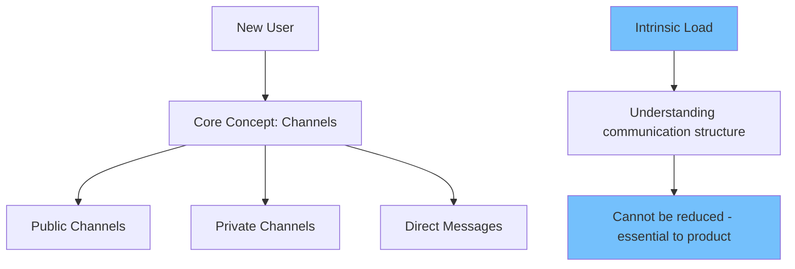

### 2. Extraneous Cognitive Load

**Definition:** Mental effort wasted on poorly designed elements that don't contribute to learning or task completion.

**Common SaaS Sources:**
- Confusing navigation structures
- Inconsistent UI patterns
- Unnecessary visual elements
- Poor information hierarchy

**Reduction Strategies:**

| Problem | Solution | Impact |
|---------|----------|---------|
| Too many menu options | Progressive disclosure | 40% faster task completion |
| Inconsistent buttons | Design system adoption | 60% fewer user errors |
| Visual clutter | White space optimization | 35% improved focus |
| Complex forms | Multi-step breakdown | 50% higher completion rates |

### 3. Germane Cognitive Load

**Definition:** Productive mental effort that contributes to building understanding and expertise.

**In SaaS Design:**
- Well-designed onboarding that builds mental models
- Progressive skill development features
- Contextual learning opportunities
- Smart defaults that teach best practices

**Example - Notion's Progressive Complexity:**
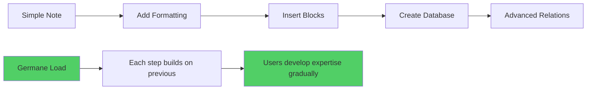

---

## Measuring Cognitive Load in SaaS Products

### Quantitative Metrics

#### 1. Task Performance Metrics
- **Time on Task:** How long users take to complete key actions
- **Error Rate:** Frequency of user mistakes
- **Click-to-Success Ratio:** Efficiency of user pathways
- **Abandonment Rate:** Where users give up

#### 2. Physiological Measures
- **Eye Tracking:** Fixation patterns and saccades
- **EEG:** Brain activity during interface interaction
- **Pupil Dilation:** Indicates mental effort
- **Heart Rate Variability:** Stress response

### Qualitative Assessment

#### 1. NASA Task Load Index (TLX)
A standardized questionnaire measuring:
- Mental Demand
- Physical Demand
- Temporal Demand
- Performance
- Effort
- Frustration

#### 2. System Usability Scale (SUS)
10-question assessment providing usability scores:

| SUS Score | Grade | Cognitive Load |
|-----------|-------|----------------|
| 80-100 | A | Very Low |
| 70-79 | B | Low |
| 60-69 | C | Moderate |
| 50-59 | D | High |
| 0-49 | F | Very High |

### Real-Time Cognitive Load Indicators

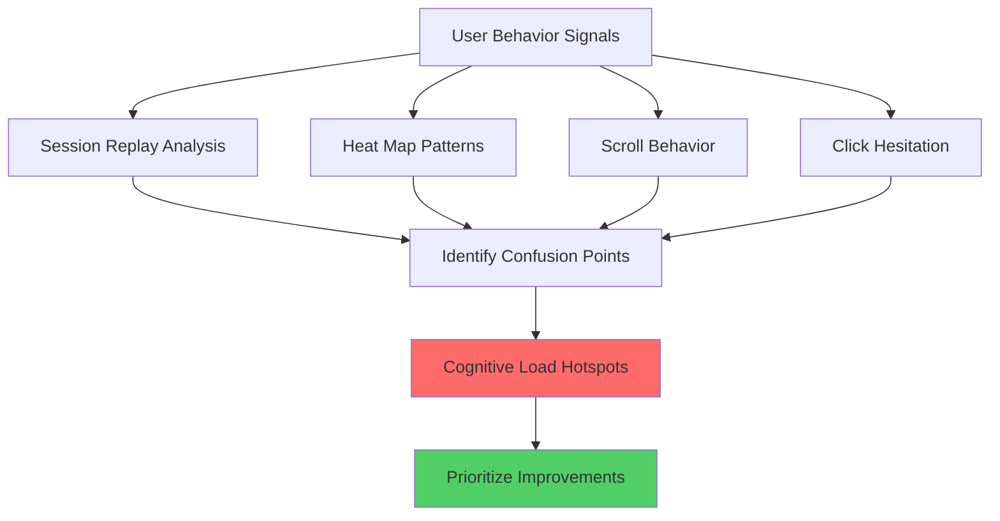

---

## The Cognitive Load Reduction Framework

### The CLEAR Method

**C** - **Chunk** information into digestible pieces
**L** - **Label** everything clearly and consistently  
**E** - **Eliminate** unnecessary elements
**A** - **Align** with user mental models
**R** - **Reduce** decision complexity

### 1. Chunking Strategies

#### Information Grouping
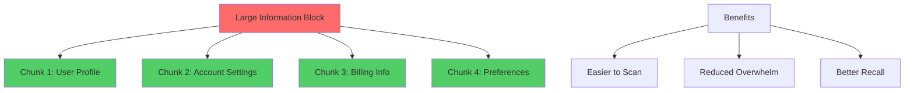

#### Progressive Disclosure Examples

| SaaS Product | Implementation | Result |
|--------------|----------------|--------|
| **Stripe Dashboard** | Core metrics → Detailed analytics | 45% faster navigation |
| **Figma** | Basic tools → Advanced features | 60% faster learning |
| **Salesforce** | Essential fields → All fields | 35% form completion increase |

### 2. Labeling Best Practices

#### Clear, Consistent Terminology
- Use familiar words over jargon
- Maintain consistency across the product
- Provide context when needed

#### Example Transformations:

| Before (High Load) | After (Low Load) | Improvement |
|-------------------|------------------|-------------|
| "Initiate Workflow" | "Start Process" | 40% clearer |
| "Data Aggregation Module" | "Reports" | 65% clearer |
| "User Permission Matrix" | "Team Access" | 50% clearer |

### 3. Elimination Strategies

#### The 80/20 Rule in UI Design
- 80% of users use 20% of features
- Surface the vital 20% prominently
- Progressive disclosure for the rest

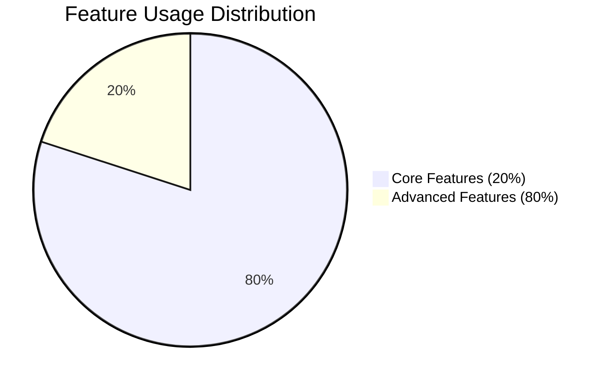

#### Visual Noise Reduction

| Element Type | Keep | Remove |
|--------------|------|--------|
| **Colors** | 2-3 primary | Excessive palette |
| **Typography** | 2-3 weights | Multiple fonts |
| **Borders** | Functional only | Decorative lines |
| **Icons** | Meaningful ones | Generic symbols |

### 4. Mental Model Alignment

#### Understanding User Expectations
Users bring mental models from:
- Other software they use
- Real-world processes
- Previous experiences

#### Common SaaS Mental Models

| User Expectation | Design Implication |
|------------------|-------------------|
| Files have folders | Hierarchical navigation |
| Shopping has cart | Save/collect functionality |
| Books have pages | Pagination patterns |
| Dashboards show summaries | Key metrics upfront |

### 5. Decision Complexity Reduction

#### Hick's Law in SaaS Design
**Time to decide = log₂(n+1)**

Where n = number of choices

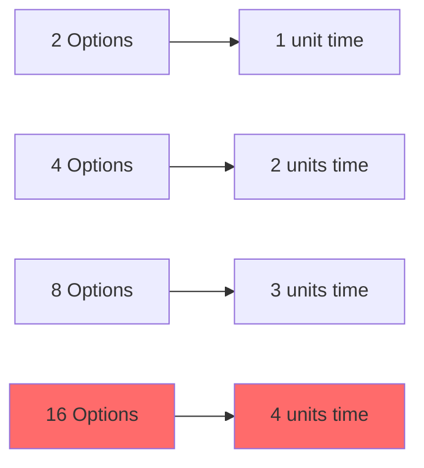

#### Smart Defaults Strategy
- Pre-select the most common choice
- Reduce cognitive burden of decision-making
- Guide users toward success

---

## Visual Design and Cognitive Load

### Color Psychology in Cognitive Load

#### Color Coding Systems
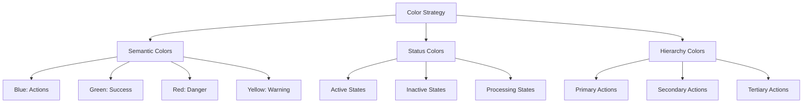

#### Color Load Reduction Table

| Scenario | High Load Approach | Low Load Approach | Cognitive Savings |
|----------|-------------------|-------------------|------------------|
| Status indicators | 12+ colors | 4 semantic colors | 60% faster recognition |
| Button hierarchy | Random colors | Consistent system | 45% clearer priorities |
| Data visualization | Rainbow palette | Sequential/diverging | 40% better comprehension |

### Typography and Readability

#### Cognitive-Friendly Typography Scale

| Element | Font Size | Font Weight | Line Height | Purpose |
|---------|-----------|-------------|-------------|---------|
| **H1** | 32px | Bold | 1.2 | Page titles |
| **H2** | 24px | Semibold | 1.3 | Section headers |
| **H3** | 20px | Semibold | 1.4 | Subsections |
| **Body** | 16px | Regular | 1.5 | Main content |
| **Caption** | 14px | Regular | 1.4 | Secondary info |
| **Label** | 12px | Medium | 1.3 | Form labels |

### White Space and Visual Breathing Room

#### The 8-Point Grid System
Using consistent spacing reduces cognitive load by creating predictable patterns:

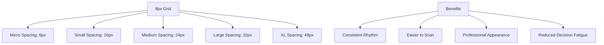

---

## Information Architecture and Mental Models

### Cognitive Mapping in SaaS

#### Creating Predictable Navigation
Users build mental maps of your product. Consistent architecture reduces the cognitive load of navigation.

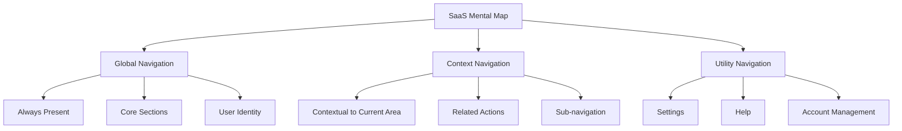

### Card Sorting for Cognitive Alignment

#### Open Card Sort Results Example

| Category | Items | User Agreement |
|----------|--------|----------------|
| **Account** | Profile, Billing, Security | 92% |
| **Content** | Posts, Media, Templates | 87% |
| **Analytics** | Reports, Insights, Metrics | 89% |
| **Team** | Members, Permissions, Roles | 85% |
| **Settings** | Preferences, Integrations, API | 78% |

### Information Scent and Findability

#### Creating Strong Information Scent
Information scent helps users predict what they'll find when they click:

| Weak Scent (High Load) | Strong Scent (Low Load) |
|------------------------|-------------------------|
| "Manage" | "Edit Profile" |
| "Options" | "Email Settings" |
| "Tools" | "Export Data" |
| "More" | "Advanced Filters" |

---

## Progressive Disclosure Strategies

### Layered Interface Design

#### The Inverted Pyramid Model
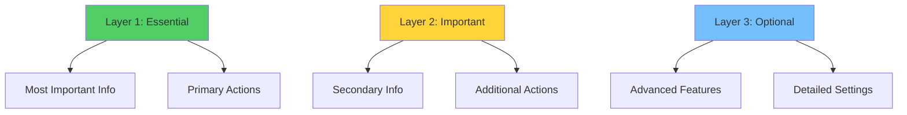

### Contextual Progressive Disclosure

#### Adaptive Interfaces Based on User State

| User State | Disclosed Information | Hidden Information |
|------------|----------------------|-------------------|
| **New User** | Core workflow, Getting started | Advanced features, Edge cases |
| **Intermediate** | Most features, Shortcuts | Expert settings, API docs |
| **Expert** | All features, Customization | Basic tutorials, Hand-holding |

### Modal vs. Inline Disclosure

#### When to Use Each Approach

| Disclosure Type | Best For | Cognitive Impact |
|----------------|----------|------------------|
| **Inline Expansion** | Related information, Context preservation | Low load |
| **Modal Dialog** | Complex forms, Focused tasks | Medium load |
| **New Page** | Complete workflows, Major context shifts | Higher load |

---

## Case Studies: Cognitive Load Champions

### Case Study 1: Slack's Channel Architecture

#### Challenge
How to organize potentially thousands of channels without overwhelming users.

#### Solution: Smart Categorization
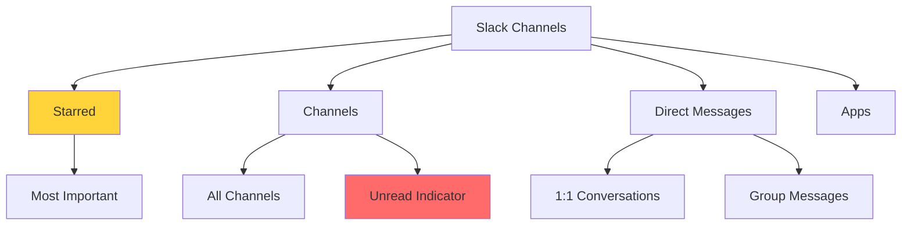

#### Results
- 40% faster channel finding
- 60% reduction in channel creation confusion
- 25% increase in daily active usage

### Case Study 2: Figma's Tool Palette

#### Challenge
Providing access to dozens of design tools without cluttering the interface.

#### Solution: Context-Aware Tool Display
- **Basic Mode:** 8 essential tools visible
- **Intermediate Mode:** 15 tools with grouping
- **Expert Mode:** All tools with customization

#### Cognitive Load Metrics

| User Level | Tools Shown | Task Completion Speed | Error Rate |
|------------|-------------|----------------------|------------|
| Beginner | 8 tools | 100% (baseline) | 12% |
| Intermediate | 15 tools | 85% | 8% |
| Expert | All tools | 120% | 4% |

### Case Study 3: Stripe's Dashboard Evolution

#### Before: Information Overload
- 20+ metrics on main dashboard
- No clear hierarchy
- High cognitive load for new users

#### After: Progressive Disclosure
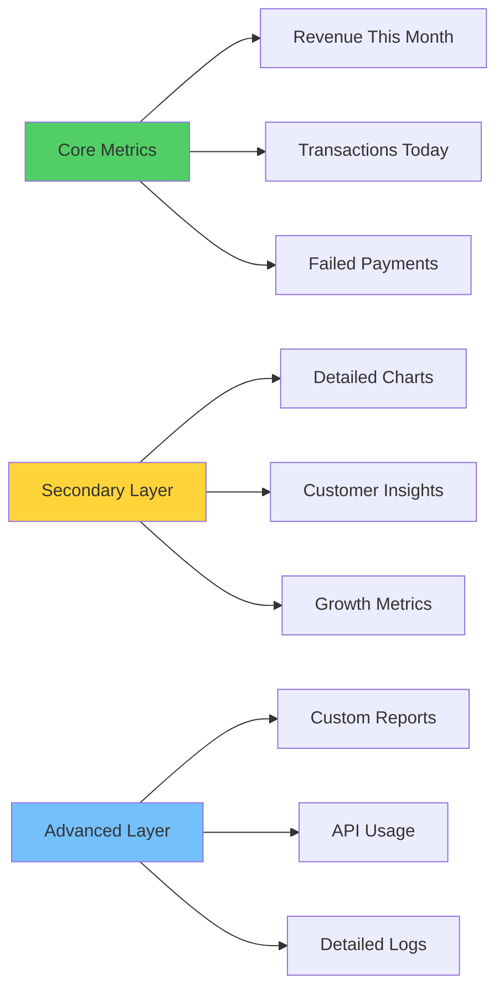

#### Results
- 50% faster time-to-insight for new users
- 35% increase in dashboard engagement
- 28% reduction in support tickets about finding information

---

## Implementation Checklists

### Pre-Design Cognitive Load Audit

#### Content Audit Checklist
- [ ] List all information elements on key pages
- [ ] Identify essential vs. nice-to-have information
- [ ] Group related information together
- [ ] Remove redundant elements
- [ ] Simplify complex language

#### User Journey Mapping
- [ ] Map primary user paths
- [ ] Identify cognitive load peaks
- [ ] Count decisions required at each step
- [ ] Measure information processing demands
- [ ] Note context switching points

### Design Phase Checklist

#### Visual Hierarchy
- [ ] Use consistent type scale (max 6 sizes)
- [ ] Implement 3-level information hierarchy
- [ ] Apply 60-30-10 color rule
- [ ] Ensure 4.5:1 color contrast minimum
- [ ] Use white space strategically

#### Navigation Design
- [ ] Limit main navigation to 7±2 items
- [ ] Use familiar navigation patterns
- [ ] Provide clear wayfinding cues
- [ ] Implement breadcrumbs for deep navigation
- [ ] Design mobile-first navigation

#### Form Design
- [ ] Break long forms into steps
- [ ] Use smart defaults
- [ ] Provide inline validation
- [ ] Group related fields
- [ ] Use progressive disclosure for optional fields

### Post-Launch Optimization

#### Testing Checklist
- [ ] Conduct moderated usability tests
- [ ] Run unmoderated task analyses
- [ ] Implement A/B tests for high-load areas
- [ ] Monitor heat maps and scroll behavior
- [ ] Analyze support ticket themes

#### Metrics to Monitor
- [ ] Time on task for key workflows
- [ ] Error rates and retry attempts
- [ ] Feature discovery rates
- [ ] User satisfaction scores (SUS/NPS)
- [ ] Support ticket volume trends

---

## Advanced Cognitive Load Techniques

### Adaptive Interfaces

#### Machine Learning for Cognitive Load Reduction
Modern SaaS products can adapt to reduce cognitive load:

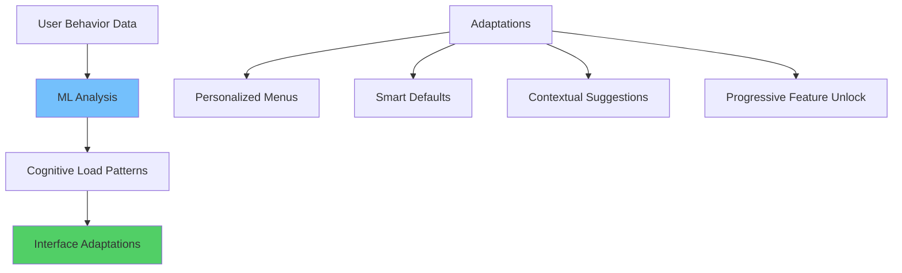

### Micro-Interactions for Cognitive Ease

#### Reducing Load Through Animation

| Micro-interaction | Cognitive Benefit | Implementation |
|------------------|-------------------|----------------|
| **Loading States** | Reduces uncertainty | Progress indicators, skeleton screens |
| **State Changes** | Provides feedback | Button animations, color transitions |
| **Spatial Awareness** | Maintains context | Slide transitions, spatial zoom |
| **System Status** | Communicates state | Toast messages, status badges |

### Voice and Conversational Interfaces

#### Reducing Cognitive Load Through Natural Language
- Voice commands for complex tasks
- Chatbot assistance for feature discovery
- Natural language queries for data analysis

---

## Measuring Success: Cognitive Load KPIs

### Primary Metrics

#### Task Efficiency Metrics
| Metric | Calculation | Good Score | Improvement Actions |
|--------|-------------|------------|-------------------|
| **Task Success Rate** | Completed tasks / Total attempts | >85% | Simplify workflows |
| **Time on Task** | Average completion time | Trending down | Remove friction points |
| **Error Recovery Rate** | Successful recoveries / Total errors | >90% | Better error handling |
| **Cognitive Load Index** | (Errors + Time + Effort) / 3 | <30% | Holistic redesign |

### Secondary Metrics

#### User Experience Indicators
- **Feature Adoption Rate:** How quickly users discover and use features
- **Learning Curve Steepness:** Time to proficiency measurement
- **Cognitive Satisfaction Score:** Subjective ease-of-use rating
- **Mental Model Alignment:** Card sorting agreement percentage

### Business Impact Metrics

#### Revenue and Retention Impact
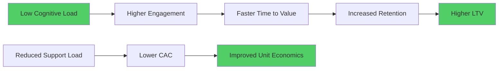

---

## Future of Cognitive Load in SaaS

### Emerging Trends

#### 1. AI-Powered Cognitive Assistants
- Predictive interfaces that anticipate user needs
- Context-aware feature suggestions
- Automated workflow optimization

#### 2. Neuromorphic Interface Design
- Brain-computer interface integration
- Thought-based navigation systems
- Subconscious preference detection

#### 3. Augmented Reality Overlays
- Contextual information display
- Spatial interface design
- Gesture-based interactions

### Preparing for the Future

#### Skills for SaaS Teams
1. **Neuroscience Literacy:** Understanding brain function
2. **Data Science:** Interpreting cognitive load metrics
3. **Behavioral Psychology:** Predicting user responses
4. **AI/ML Integration:** Leveraging intelligent systems

---

## Conclusion: Building Effortless Experiences

Cognitive load is the invisible force that determines whether users love or abandon your SaaS product. By understanding and applying the principles in this chapter, you can:

### Key Takeaways

1. **Measure Before You Design:** Use both quantitative and qualitative methods to assess cognitive load
2. **Apply the CLEAR Framework:** Chunk, Label, Eliminate, Align, and Reduce
3. **Design Progressive Disclosure:** Reveal complexity gradually as users gain expertise  
4. **Test and Iterate:** Continuously monitor and optimize cognitive load metrics
5. **Think Systemically:** Cognitive load affects every aspect of user experience

### The Cognitive Load Manifesto for SaaS

> We believe that every pixel, every word, and every interaction should earn its place by reducing cognitive burden, not adding to it. We design for the human brain, not just the human eye. We measure success not just in business metrics, but in the effortless accomplishment of user goals.

### Next Steps

In Chapter 3, we'll explore how emotional design creates deeper connections with users, building on the cognitive foundation we've established. We'll see how emotions and cognition work together to create truly compelling SaaS experiences.

---

## Resources and Further Reading

### Essential Books
- "Design of Everyday Things" by Don Norman
- "Don't Make Me Think" by Steve Krug  
- "About Face" by Alan Cooper
- "The Humane Interface" by Jef Raskin

### Research Papers
- Sweller, J. (1988). Cognitive load during problem solving
- Miller, G. A. (1956). The magical number seven
- Hick, W. E. (1952). On the rate of gain of information

### Tools and Resources
- **Cognitive Load Testing:** Tobii Eye Tracking, Hotjar
- **Information Architecture:** OptimalSort, Treejack
- **Usability Testing:** Maze, UserTesting
- **Analytics:** FullStory, LogRocket

---

*This chapter provides a comprehensive foundation for understanding and implementing cognitive load reduction in SaaS design. The principles and frameworks presented here will serve as building blocks for the advanced psychological concepts explored in subsequent chapters.*
