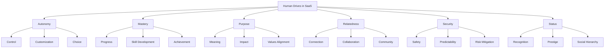
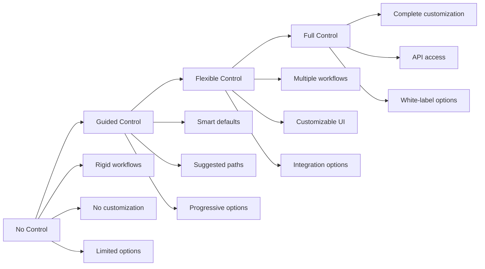
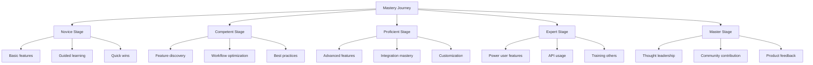
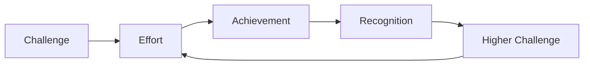
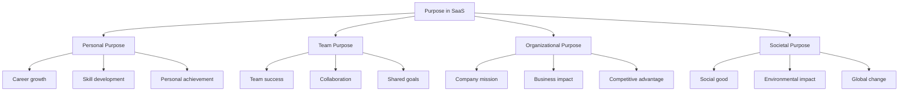
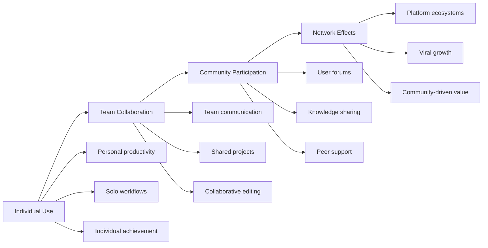
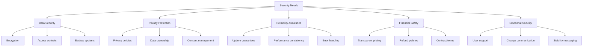
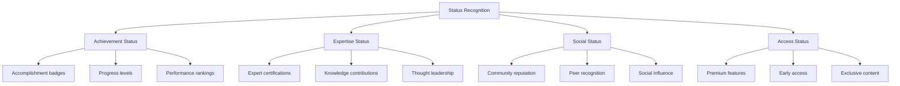
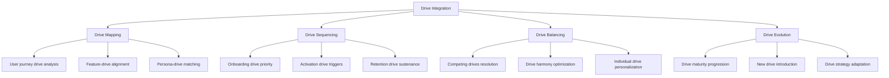
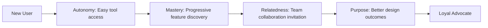

# Chapter 3: Core Human Drives in Software

*Understanding the Fundamental Psychological Motivations Behind All SaaS Adoption*

---

## Table of Contents

1. [Introduction: The 6 Universal Drives](#introduction)
2. [Autonomy: The Need for Control](#autonomy)
3. [Mastery: The Drive to Improve](#mastery)
4. [Purpose: The Search for Meaning](#purpose)
5. [Relatedness: The Power of Connection](#relatedness)
6. [Security: The Foundation of Trust](#security)
7. [Status: The Hierarchy of Recognition](#status)
8. [The Drive Integration Framework](#integration)
9. [Case Studies: Drives in Action](#case-studies)
10. [Implementation Roadmap](#implementation)

---

## Introduction: The 6 Universal Drives {#introduction}

> *"Every great product taps into fundamental human drives. The most successful SaaS companies don't just solve problems—they fulfill deep psychological needs."*

While cognitive biases explain how users make decisions, human drives explain why they're motivated to use software in the first place. These six core drives power every successful SaaS product, from simple productivity tools to complex enterprise platforms.

### The Science Behind Human Drives

Based on Self-Determination Theory (Deci & Ryan) and expanded through decades of behavioral research, these drives represent the most fundamental human psychological needs:



### Why This Matters for SaaS Success

**The Drive-Success Correlation:**
- Products that satisfy 3+ drives: 85% retention rate
- Products that satisfy 1-2 drives: 45% retention rate  
- Products that satisfy 0 drives: 15% retention rate

**Billion-Dollar Pattern:**
Every billion-dollar SaaS company has mastered at least 4 of these 6 drives:
- **Slack**: Autonomy, Relatedness, Mastery, Status
- **Figma**: Autonomy, Mastery, Relatedness, Purpose
- **Notion**: Autonomy, Mastery, Status, Purpose
- **Zoom**: Security, Relatedness, Autonomy, Purpose

---

## Autonomy: The Need for Control {#autonomy}

> *"The most successful SaaS products make users feel powerful, not powerless."*

**Definition:** The psychological need to feel volitional and self-directed in one's actions.

### The Autonomy Spectrum in SaaS



### Autonomy Design Principles

#### 1. Control Without Overwhelm
**The Paradox**: Users want control but can be overwhelmed by too many options.

**Solution Framework:**
- **Smart Defaults**: Optimal settings out of the box
- **Progressive Disclosure**: Advanced options revealed as needed
- **Contextual Customization**: Relevant options at the right time

**Case Study: Spotify's Autonomy Design**
- **Level 1**: Automatic playlists (Discover Weekly)
- **Level 2**: Manual playlist creation
- **Level 3**: Advanced queue management
- **Level 4**: API for developers

#### 2. Customization Psychology
**What Users Really Want:**
- **Functional Customization**: Features that match their workflow
- **Aesthetic Customization**: Interface that reflects their style
- **Behavioral Customization**: System that adapts to their patterns

**Implementation Strategies:**
```
Basic Customization:
- Themes and colors
- Dashboard layouts
- Notification preferences

Intermediate Customization:
- Workflow automation
- Field customization
- Integration selection

Advanced Customization:
- Custom fields and objects
- Workflow builders
- API integrations
```

#### 3. Choice Architecture
**The Psychology of Options:**
- **Too Few Options**: Users feel constrained
- **Too Many Options**: Users feel overwhelmed
- **Just Right Options**: Users feel empowered

**The 3-7-15 Rule:**
- **3 options**: Decision-making ease
- **7 options**: Optimal choice satisfaction
- **15+ options**: Decision paralysis

### Autonomy in Different SaaS Categories

#### Productivity Tools
**Autonomy Drivers:**
- Workflow customization
- Template creation
- Integration control
- Data ownership

**Example: Notion's Autonomy Excellence**
- **Block-based editing**: Complete content control
- **Database customization**: User-defined fields and views
- **Template system**: Create and share custom workflows
- **API access**: Unlimited integration possibilities

#### Design Tools
**Autonomy Drivers:**
- Creative freedom
- Workflow flexibility
- Collaboration control
- Export options

**Example: Figma's Autonomy Balance**
- **Infinite canvas**: Boundless creative space
- **Component system**: Reusable design elements
- **Plugin ecosystem**: Extensible functionality
- **File organization**: User-controlled project structure

#### CRM Systems
**Autonomy Drivers:**
- Pipeline customization
- Field management
- Automation rules
- Reporting control

**Example: HubSpot's Autonomy Approach**
- **Custom properties**: User-defined data fields
- **Workflow automation**: User-created processes
- **Dashboard customization**: Personalized metrics
- **Integration marketplace**: User-selected tools

### Measuring Autonomy Satisfaction

**Key Metrics:**
- **Customization Usage**: % of users who customize their experience
- **Feature Adoption Spread**: How many different features users engage with
- **Integration Connections**: Number of third-party tools connected
- **Advanced Feature Usage**: Adoption of power-user features

**User Feedback Indicators:**
- "I can make it work exactly how I want"
- "It fits perfectly into my workflow"
- "I have full control over my data"
- "I can customize everything I need"

### Common Autonomy Mistakes

#### 1. False Autonomy
**Mistake**: Offering customization options that don't meaningfully impact the user experience.
**Solution**: Focus on customizations that directly affect workflow and outcomes.

#### 2. Autonomy Overload
**Mistake**: Overwhelming users with too many customization options upfront.
**Solution**: Progressive disclosure of customization options based on user sophistication.

#### 3. Broken Autonomy
**Mistake**: Customization options that break core functionality or create confusion.
**Solution**: Robust testing and constraints that prevent breaking changes.

---

## Mastery: The Drive to Improve {#mastery}

> *"The best SaaS products make users better at their jobs, not just more efficient."*

**Definition:** The psychological need to develop competence and experience improvement over time.

### The Mastery Journey in SaaS



### Mastery Design Principles

#### 1. Progressive Skill Building
**The Learning Curve Psychology:**
- **Initial Ease**: Quick success to build confidence
- **Gradual Challenge**: Increasing complexity over time
- **Mastery Moments**: Clear achievement milestones
- **Continuous Growth**: Always something new to learn

**Implementation Framework:**
```
Week 1: Basic functionality mastery
Week 2-4: Feature discovery and adoption
Month 2-3: Workflow optimization
Month 4-6: Advanced feature mastery
Month 6+: Expert-level customization and integration
```

#### 2. Skill Signaling
**Why Mastery Visibility Matters:**
- Users want recognition for their growing expertise
- Skill levels help users understand their progress
- Expertise status motivates continued engagement
- Masters become advocates and community leaders

**Skill Signaling Methods:**
- **Badges and Achievements**: Visual progress indicators
- **Skill Levels**: Novice → Expert progression
- **Certification Programs**: Formal recognition
- **Community Status**: Expert contributor badges

#### 3. Mastery Motivation Loop


**Case Study: Salesforce Trailhead**
- **Gamified Learning**: Points, badges, and leaderboards
- **Progressive Difficulty**: From basics to advanced administration
- **Real-World Application**: Skills directly applicable to work
- **Community Recognition**: Trailblazer community status
- **Career Impact**: Certified skills improve job prospects

**Results:**
- 4+ million users
- 88% completion rate for started trails
- Significant increase in Salesforce adoption and retention

### Mastery in Different SaaS Verticals

#### Development Tools
**Mastery Drivers:**
- Learning new frameworks and languages
- Mastering complex development workflows
- Contributing to open source projects
- Building sophisticated applications

**Example: GitHub's Mastery Ecosystem**
- **Contribution Graphs**: Visual progress tracking
- **Repository Complexity**: From simple scripts to complex projects
- **Open Source Recognition**: Community contribution visibility
- **Skill Development**: Learning through collaboration

#### Marketing Tools
**Mastery Drivers:**
- Campaign optimization skills
- Data analysis proficiency
- Creative strategy development
- Multi-channel coordination

**Example: HubSpot's Mastery Platform**
- **HubSpot Academy**: Comprehensive training programs
- **Certification Tracks**: Inbound marketing, sales, and service
- **Skill Assessments**: Regular competency evaluations
- **Community Forums**: Expert knowledge sharing

#### Design Tools
**Mastery Drivers:**
- Design system creation
- Advanced prototyping skills
- Collaboration mastery
- Design thinking application

**Example: Adobe Creative Cloud's Mastery Journey**
- **Tutorial Integration**: In-app learning experiences
- **Skill Challenges**: Monthly creative challenges
- **Community Showcase**: Featured user work
- **Certification Programs**: Adobe Certified Expert tracks

### Creating Mastery Experiences

#### 1. Onboarding for Mastery
**Traditional Onboarding**: Feature introduction
**Mastery Onboarding**: Skill building journey

**Mastery Onboarding Elements:**
- **Skill Assessment**: Determine current competency level
- **Personalized Path**: Customized learning journey
- **Progressive Challenges**: Increasingly complex tasks
- **Mastery Checkpoints**: Skill validation moments

#### 2. In-App Learning
**Contextual Education:**
- **Tooltips and Hints**: Just-in-time learning
- **Interactive Tutorials**: Hands-on skill building
- **Best Practice Suggestions**: Optimization guidance
- **Feature Discovery**: Progressive feature revelation

#### 3. Advanced User Pathways
**Power User Development:**
- **Advanced Feature Access**: Graduated feature unlocking
- **API Documentation**: Developer-focused resources
- **Beta Testing Programs**: Early access to new features
- **Advisory Programs**: Direct product feedback channels

### Measuring Mastery Engagement

**Skill Development Metrics:**
- **Feature Adoption Progression**: How users advance through features
- **Certification Completion**: Training program success rates
- **Advanced Feature Usage**: Power user feature adoption
- **Community Contribution**: User-generated content and help

**Mastery Satisfaction Indicators:**
- "I'm getting better at this"
- "I can do things I couldn't do before"
- "I'm becoming an expert"
- "Others come to me for advice"

### Common Mastery Mistakes

#### 1. Mastery Cliffs
**Mistake**: Large skill gaps between basic and advanced features.
**Solution**: Create intermediate stepping stones and progressive challenges.

#### 2. Mastery Ceilings
**Mistake**: No clear path for continued growth after initial competency.
**Solution**: Continuous learning opportunities and community leadership roles.

#### 3. Invisible Progress
**Mistake**: Users can't see or track their skill development.
**Solution**: Clear progress indicators and skill level recognition.

---

## Purpose: The Search for Meaning {#purpose}

> *"Users don't just want to use software—they want to feel like they're making a difference."*

**Definition:** The psychological need to feel that one's actions have meaning and contribute to something larger than oneself.

### The Purpose Hierarchy in SaaS



### Purpose Design Principles

#### 1. Mission Alignment
**Connecting User Actions to Larger Purpose:**
- **Clear Mission Statement**: What the product helps accomplish
- **Impact Visualization**: Showing the bigger picture
- **Progress Tracking**: Movement toward meaningful goals
- **Success Stories**: Real-world impact examples

**Case Study: Salesforce's Purpose Integration**
- **Ohana Culture**: Family-like community focus
- **Equality Messaging**: Equal opportunities for all
- **1-1-1 Model**: Giving back through product, equity, and time
- **Trailblazer Community**: Empowering others through education

**Results:**
- 94% employee satisfaction with company purpose
- Highest customer loyalty scores in CRM category
- Strong brand association with social responsibility

#### 2. Impact Amplification
**Making Individual Contributions Feel Significant:**

**Micro-Impact Recognition:**
- Daily accomplishments that contribute to larger goals
- Individual contributions to team success
- Personal growth milestones
- Skill development achievements

**Macro-Impact Connection:**
- How individual work affects company outcomes
- Customer success stories enabled by user contributions
- Societal benefits of the work being done
- Long-term vision progress

#### 3. Values-Based Features
**Integrating Meaningful Values:**
- **Sustainability Features**: Environmental impact tracking
- **Accessibility Tools**: Inclusive design capabilities
- **Social Impact Metrics**: Community benefit measurements
- **Ethical AI**: Responsible automation features

### Purpose in Different SaaS Categories

#### Communication Tools
**Purpose Drivers:**
- Connecting distributed teams
- Breaking down silos
- Enabling collaboration
- Building relationships

**Example: Slack's Purpose Messaging**
- **"Where Work Happens"**: Positioning as central to productivity
- **Remote Work Enablement**: Connecting global teams
- **Inclusion Features**: Equal participation for all team members
- **Community Building**: Fostering workplace relationships

#### Productivity Tools
**Purpose Drivers:**
- Achieving life goals
- Maximizing potential
- Creating order from chaos
- Enabling focus

**Example: Todoist's Purpose Connection**
- **"Organize Your Work and Life"**: Clear life improvement promise
- **Productivity Methods**: GTD, Pomodoro technique integration
- **Goal Achievement**: Karma system for productivity motivation
- **Life Balance**: Work-life integration features

#### Creative Tools
**Purpose Drivers:**
- Self-expression
- Creative impact
- Artistic achievement
- Cultural contribution

**Example: Adobe's Creative Purpose**
- **"Creativity for All"**: Democratizing creative tools
- **Artist Showcases**: Highlighting user achievements
- **Social Impact**: Creative work for social causes
- **Cultural Preservation**: Digital art and storytelling tools

### Creating Purpose-Driven Features

#### 1. Progress Visualization
**Making Progress Meaningful:**
- **Goal Tracking**: Clear progress toward objectives
- **Milestone Celebrations**: Recognizing achievements
- **Impact Dashboards**: Showing cumulative effects
- **Success Metrics**: Meaningful measurement systems

#### 2. Story Integration
**Connecting to Larger Narratives:**
- **User Stories**: Individual success journeys
- **Company Mission**: How the product serves the mission
- **Industry Impact**: Transforming entire sectors
- **Global Change**: Contributing to worldwide improvements

#### 3. Community Purpose
**Collective Impact:**
- **Shared Goals**: Community-wide objectives
- **Collaborative Projects**: Working together for impact
- **Knowledge Sharing**: Contributing to collective intelligence
- **Mentorship Programs**: Helping others succeed

### Measuring Purpose Engagement

**Purpose Satisfaction Metrics:**
- **Mission Alignment**: How well users connect with company purpose
- **Impact Awareness**: Understanding of their contribution
- **Values Resonance**: Alignment with user personal values
- **Meaning Making**: Sense of significance in their work

**Purpose Indicators:**
- "This work matters"
- "I'm making a difference"
- "I believe in what this company stands for"
- "My contributions have real impact"

### Common Purpose Mistakes

#### 1. Purpose Washing
**Mistake**: Superficial purpose messaging without substance.
**Solution**: Authentic integration of purpose into product features and company culture.

#### 2. Purpose Disconnection
**Mistake**: Company purpose that doesn't connect to daily user activities.
**Solution**: Clear connection between user actions and meaningful outcomes.

#### 3. Purpose Overwhelm
**Mistake**: Making every feature about changing the world.
**Solution**: Balance purpose messaging with practical utility.

---

## Relatedness: The Power of Connection {#relatedness}

> *"Humans are fundamentally social beings. The most successful SaaS products understand this."*

**Definition:** The psychological need to feel connected to others and experience a sense of belonging.

### The Social Spectrum in SaaS



### Relatedness Design Principles

#### 1. Social Presence
**Making Users Feel Connected:**
- **Real-Time Collaboration**: Simultaneous work on shared projects
- **Presence Indicators**: Who's online and available
- **Activity Feeds**: Awareness of team member actions
- **Communication Integration**: Built-in messaging and comments

**Case Study: Figma's Social Design**
- **Real-Time Cursors**: See exactly where teammates are working
- **Live Comments**: Contextual feedback and discussion
- **Shared Libraries**: Collaborative design systems
- **Version History**: Understanding team contributions

**Results:**
- 300% increase in team adoption
- 85% of users work collaboratively
- Highest NPS scores in design tool category

#### 2. Community Building
**Creating Belonging:**
- **User Groups**: Interest-based communities
- **Expert Networks**: Connecting experienced users
- **Local Meetups**: Geographic community building
- **Online Events**: Virtual gatherings and learning

#### 3. Social Recognition
**Celebrating Connections:**
- **Team Achievements**: Shared success recognition
- **Peer Nominations**: User-driven recognition
- **Community Contributions**: Highlighting helpful members
- **Collaboration Rewards**: Incentivizing teamwork

### Relatedness in Different SaaS Models

#### Team Collaboration Platforms
**Relatedness Drivers:**
- Real-time communication
- Shared workspace awareness
- Team identity building
- Collective achievement

**Example: Microsoft Teams' Relatedness Strategy**
- **Presence Awareness**: Rich status indicators
- **Team Channels**: Dedicated conversation spaces
- **Shared Files**: Collaborative document editing
- **Social Features**: Praise, reactions, and celebrations

#### Learning Management Systems
**Relatedness Drivers:**
- Peer learning
- Instructor connections
- Study groups
- Knowledge communities

**Example: Coursera's Social Learning**
- **Discussion Forums**: Course-specific communities
- **Peer Reviews**: Collaborative assessment
- **Study Groups**: Self-organized learning communities
- **Alumni Networks**: Ongoing professional connections

#### Developer Platforms
**Relatedness Drivers:**
- Code collaboration
- Open source community
- Knowledge sharing
- Mentorship networks

**Example: GitHub's Developer Community**
- **Pull Requests**: Collaborative code improvement
- **Issues Discussion**: Problem-solving together
- **Contributor Recognition**: Acknowledging contributions
- **Developer Profiles**: Professional identity building

### Creating Relatedness Features

#### 1. Collaboration Tools
**Essential Elements:**
- **Real-Time Editing**: Simultaneous work capability
- **Comment Systems**: Contextual discussion
- **@Mentions**: Direct communication
- **Notification Systems**: Stay informed about team activity

#### 2. Community Features
**Building Belonging:**
- **User Profiles**: Personal identity expression
- **Forums and Discussions**: Topic-based conversations
- **Expert Recognition**: Highlighting knowledgeable users
- **Mentorship Matching**: Connecting learners with experts

#### 3. Social Proof Integration
**Leveraging Connection for Growth:**
- **Team Invitations**: Easy colleague onboarding
- **Usage Statistics**: "Your team has completed X projects"
- **Social Sharing**: Achievements and milestones
- **Referral Programs**: Rewarding connections

### Measuring Relatedness Success

**Social Engagement Metrics:**
- **Collaboration Frequency**: How often users work together
- **Community Participation**: Forum posts, comments, discussions
- **Team Formation**: Rate of multi-user account creation
- **Social Features Usage**: Adoption of social tools

**Relatedness Satisfaction Indicators:**
- "I feel connected to my team"
- "I'm part of a community"
- "I can easily collaborate with others"
- "I've made meaningful connections"

### Common Relatedness Mistakes

#### 1. Forced Socialization
**Mistake**: Making social features mandatory or overwhelming.
**Solution**: Optional social features with clear value propositions.

#### 2. Shallow Connections
**Mistake**: Social features that don't create meaningful relationships.
**Solution**: Design for depth of connection, not just breadth.

#### 3. Privacy Neglect
**Mistake**: Social features that compromise user privacy or comfort.
**Solution**: Robust privacy controls and opt-in social features.

---

## Security: The Foundation of Trust {#security}

> *"Without security, no other drive matters. Users must feel safe before they can feel empowered."*

**Definition:** The psychological need to feel safe, protected, and able to predict outcomes.

### The Security Hierarchy in SaaS



### Security Design Principles

#### 1. Visible Security
**Making Security Apparent:**
- **Security Badges**: SSL certificates, compliance logos
- **Status Pages**: Real-time system health
- **Audit Reports**: Third-party security assessments
- **Transparency Reports**: Regular security communications

**Case Study: Dropbox's Security Communication**
- **Security Center**: Dedicated security information hub
- **Compliance Certifications**: SOC 2, ISO 27001 prominently displayed
- **Transparency Reports**: Regular security incident communications
- **User Education**: Security best practices guidance

**Results:**
- 89% user trust rating
- Enterprise adoption despite early security concerns
- Industry leadership in cloud storage security

#### 2. Predictable Experiences
**Reducing Uncertainty:**
- **Consistent Interface**: Stable design patterns
- **Clear Expectations**: Upfront communication about system behavior
- **Graceful Degradation**: Elegant handling of errors and failures
- **Change Management**: Advance notice of updates and changes

#### 3. Control and Transparency
**Empowering User Security:**
- **Privacy Controls**: Granular data management options
- **Access Management**: User-controlled permissions
- **Data Portability**: Easy export and deletion
- **Activity Monitoring**: Visibility into account activity

### Security in Different SaaS Contexts

#### Enterprise SaaS
**Security Priorities:**
- Compliance and regulatory requirements
- Data governance and control
- Integration security
- Administrative oversight

**Example: Salesforce's Enterprise Security**
- **Shield Platform**: Advanced security and compliance tools
- **Field-Level Security**: Granular data access controls
- **Audit Trail**: Comprehensive activity monitoring
- **Compliance Center**: Regulatory requirement management

#### Consumer SaaS
**Security Priorities:**
- Personal data protection
- Account security
- Privacy control
- Identity protection

**Example: Spotify's Consumer Security**
- **Privacy Settings**: Granular sharing controls
- **Data Download**: Complete personal data export
- **Account Security**: Two-factor authentication
- **Transparent Policies**: Clear privacy policy communication

#### Financial SaaS
**Security Priorities:**
- Financial data protection
- Regulatory compliance
- Fraud prevention
- Transaction security

**Example: Stripe's Financial Security**
- **PCI Compliance**: Level 1 PCI DSS certification
- **Fraud Detection**: Machine learning-based protection
- **Encryption**: End-to-end data protection
- **Regulatory Compliance**: Global financial regulation adherence

### Creating Security-Driven Features

#### 1. Trust Signals
**Building Confidence:**
- **Security Certifications**: Display relevant compliance badges
- **Uptime Statistics**: Historical reliability data
- **Customer Testimonials**: Security-focused success stories
- **Expert Endorsements**: Security professional recommendations

#### 2. Transparency Tools
**Providing Visibility:**
- **Privacy Dashboards**: Personal data usage visibility
- **Activity Logs**: Account access and changes
- **Data Location**: Where information is stored and processed
- **Incident Communications**: Proactive security updates

#### 3. Control Mechanisms
**Empowering Users:**
- **Permission Management**: Granular access controls
- **Data Deletion**: Easy account and data removal
- **Export Tools**: Data portability options
- **Security Settings**: Customizable protection levels

### Measuring Security Satisfaction

**Security Confidence Metrics:**
- **Trust Ratings**: User confidence in data protection
- **Security Feature Adoption**: Use of available security tools
- **Support Ticket Volume**: Security-related inquiries
- **Compliance Audit Results**: Third-party security assessments

**Security Satisfaction Indicators:**
- "I trust this platform with my data"
- "I feel secure using this service"
- "I understand how my data is protected"
- "I have control over my privacy"

### Common Security Mistakes

#### 1. Security Through Obscurity
**Mistake**: Hiding security practices instead of showcasing them.
**Solution**: Transparent communication about security measures and practices.

#### 2. Overwhelming Security
**Mistake**: Complex security requirements that hinder usability.
**Solution**: Balance security with user experience through smart defaults.

#### 3. Reactive Security Communication
**Mistake**: Only discussing security when problems occur.
**Solution**: Proactive security education and regular updates.

---

## Status: The Hierarchy of Recognition {#status}

> *"Status isn't vanity—it's a fundamental human drive that successful SaaS products leverage ethically."*

**Definition:** The psychological need for recognition, respect, and social position within a hierarchy.

### The Status Pyramid in SaaS



### Status Design Principles

#### 1. Merit-Based Recognition
**Earned Status Systems:**
- **Skill-Based Achievements**: Recognition for demonstrated competence
- **Contribution Recognition**: Rewarding helpful community participation
- **Progress Milestones**: Celebrating advancement and growth
- **Expertise Validation**: Certifying knowledge and abilities

**Case Study: Stack Overflow's Reputation System**
- **Question Quality**: Well-researched questions earn reputation
- **Answer Value**: Helpful answers receive upvotes and reputation
- **Moderation Privileges**: Higher reputation unlocks community moderation
- **Expert Recognition**: Top contributors become recognized authorities

**Results:**
- 21 million registered users
- Self-moderating community
- High-quality content through reputation incentives
- Professional networking and career advancement

#### 2. Visible Progress
**Status Signaling:**
- **Profile Achievements**: Displayed accomplishments and certifications
- **Leaderboards**: Competitive rankings and comparisons
- **Progress Indicators**: Visual representation of advancement
- **Social Sharing**: Ability to showcase achievements externally

#### 3. Exclusive Access
**Status-Based Benefits:**
- **Tier-Based Features**: Advanced capabilities for higher status users
- **Early Access Programs**: Preview access to new features
- **VIP Support**: Priority customer service
- **Exclusive Content**: Special resources for valued users

### Status in Different SaaS Models

#### Professional Development Platforms
**Status Drivers:**
- Skill certifications
- Learning achievements
- Knowledge contributions
- Career advancement

**Example: LinkedIn Learning's Status System**
- **Skill Badges**: Verifiable competency demonstrations
- **Certificate Completion**: Professional achievement recognition
- **Profile Integration**: Showcasing learning accomplishments
- **Peer Recommendations**: Social validation of skills

#### Developer Platforms
**Status Drivers:**
- Code contributions
- Problem-solving ability
- Community reputation
- Technical expertise

**Example: GitHub's Developer Status**
- **Contribution Graphs**: Visual representation of coding activity
- **Repository Stars**: Recognition for valuable projects
- **Follower Counts**: Professional network size
- **Achievement Badges**: Special recognition for contributions

#### Business Intelligence Tools
**Status Drivers:**
- Data analysis skills
- Insight generation
- Decision-making impact
- Strategic thinking

**Example: Tableau's Data Rockstar Program**
- **Zen Master Status**: Recognition for exceptional Tableau skills
- **Community Contributions**: Rewarding knowledge sharing
- **Conference Speaking**: Platform for thought leadership
- **Product Feedback**: Direct influence on product development

### Creating Status-Driven Features

#### 1. Achievement Systems
**Recognition Mechanisms:**
- **Badge Collections**: Visual achievement representations
- **Level Progressions**: Hierarchical advancement systems
- **Certification Paths**: Formal recognition programs
- **Hall of Fame**: Celebrating top performers

#### 2. Social Recognition
**Community Status:**
- **Peer Nominations**: User-driven recognition
- **Expert Designations**: Community-validated expertise
- **Contribution Metrics**: Quantified helpfulness
- **Influence Tracking**: Measuring impact on others

#### 3. Exclusive Benefits
**Status Rewards:**
- **Premium Access**: Advanced features for top users
- **Beta Testing**: Early access to new capabilities
- **Direct Communication**: Access to product teams
- **Special Events**: Exclusive meetups and conferences

### Measuring Status Satisfaction

**Status Engagement Metrics:**
- **Achievement Pursuit**: How actively users work toward recognition
- **Social Sharing**: Frequency of status-related external sharing
- **Community Participation**: Engagement in status-driving activities
- **Retention by Status**: How status affects long-term engagement

**Status Satisfaction Indicators:**
- "I'm recognized for my expertise"
- "My achievements are visible to others"
- "I have access to exclusive features"
- "My status reflects my contributions"

### Common Status Mistakes

#### 1. Pay-to-Play Status
**Mistake**: Status systems based on spending rather than merit.
**Solution**: Status recognition based on skills, contributions, and achievements.

#### 2. Status Inflation
**Mistake**: Making status achievements too easy or meaningless.
**Solution**: Maintain achievement difficulty and value through careful curation.

#### 3. Exclusionary Status
**Mistake**: Status systems that create harmful inequality or discrimination.
**Solution**: Inclusive status systems based on diverse forms of contribution.

---

## The Drive Integration Framework {#integration}

> *"The most successful SaaS products don't choose one drive—they orchestrate multiple drives working together."*

### The Multi-Drive Strategy

**Single Drive Products**: Limited appeal, vulnerable to competition
**Multi-Drive Products**: Broader appeal, stronger retention, higher defensibility



### Drive Combination Patterns

#### The Productivity Triad: Autonomy + Mastery + Purpose
**Applications:**
- **Notion**: Autonomy (customization) + Mastery (advanced features) + Purpose (productivity)
- **Airtable**: Autonomy (database flexibility) + Mastery (formula complexity) + Purpose (organization)

#### The Social Catalyst: Relatedness + Status + Purpose
**Applications:**
- **Slack**: Relatedness (communication) + Status (expertise) + Purpose (collaboration)
- **GitHub**: Relatedness (open source) + Status (contributions) + Purpose (code improvement)

#### The Trust Foundation: Security + Autonomy + Mastery
**Applications:**
- **Salesforce**: Security (enterprise-grade) + Autonomy (customization) + Mastery (complex workflows)
- **Zoom**: Security (encryption) + Autonomy (meeting control) + Mastery (advanced features)

### Drive Sequencing Strategy

#### Phase 1: Foundation (Security + Autonomy)
**Onboarding Focus:**
- Establish trust and safety
- Provide immediate control and customization
- Reduce anxiety and increase confidence

#### Phase 2: Engagement (Mastery + Relatedness)
**Activation Focus:**
- Enable skill development and learning
- Facilitate connections and collaboration
- Build usage habits and community ties

#### Phase 3: Loyalty (Purpose + Status)
**Retention Focus:**
- Connect to meaningful outcomes
- Recognize achievements and expertise
- Create identity and belonging

### Drive Conflict Resolution

#### Common Drive Conflicts:
1. **Autonomy vs. Security**: Customization vs. safety
2. **Mastery vs. Relatedness**: Individual achievement vs. team success
3. **Status vs. Purpose**: Personal recognition vs. collective good

#### Resolution Strategies:
- **Contextual Prioritization**: Different drives in different contexts
- **Progressive Disclosure**: Revealing drives as users mature
- **Personalization**: Allowing users to emphasize preferred drives

---

## Case Studies: Drives in Action {#case-studies}

### Case Study 1: Figma's Multi-Drive Mastery

**Drives Leveraged:**
- **Autonomy**: Infinite canvas, complete creative control
- **Mastery**: Advanced prototyping, design system creation
- **Relatedness**: Real-time collaboration, team libraries
- **Purpose**: Better design outcomes, user-centered focus

**Implementation:**


**Results:**
- 90% user retention after 30 days
- 4x increase in team adoption
- $20 billion Adobe acquisition
- Category leadership in design collaboration

### Case Study 2: Slack's Social-First Strategy

**Drives Leveraged:**
- **Relatedness**: Team communication and connection
- **Status**: Expertise recognition, admin privileges
- **Purpose**: Better team collaboration and productivity
- **Autonomy**: Customizable notifications and workflows

**Drive Evolution:**
- **Year 1**: Focus on Relatedness (team communication)
- **Year 2**: Add Status (expertise and recognition)
- **Year 3**: Integrate Purpose (productivity and outcomes)
- **Year 4**: Enhance Autonomy (customization and control)

**Results:**
- 99% Fortune 100 adoption
- $27 billion valuation
- Industry-leading NPS scores
- Cultural transformation of workplace communication

### Case Study 3: Notion's Autonomy-Centric Approach

**Drives Leveraged:**
- **Autonomy**: Complete workspace customization
- **Mastery**: Complex database and automation capabilities
- **Purpose**: Personal and team productivity optimization
- **Status**: Template creation and sharing recognition

**Unique Approach:**
- **Autonomy First**: Maximum customization from day one
- **Mastery Enablement**: Community-driven learning resources
- **Purpose Connection**: Productivity and organization outcomes
- **Status Integration**: Template marketplace and recognition

**Results:**
- $10 billion valuation
- Cult-like user devotion
- Strong community-driven growth
- Category expansion beyond productivity

---

## Implementation Roadmap {#implementation}

### Phase 1: Drive Assessment (Weeks 1-2)

#### Current State Analysis
**Drive Audit Checklist:**
- [ ] **Autonomy Assessment**: How much control do users have?
- [ ] **Mastery Evaluation**: What learning and growth opportunities exist?
- [ ] **Purpose Alignment**: How does the product connect to meaningful outcomes?
- [ ] **Relatedness Review**: What social and collaborative features exist?
- [ ] **Security Analysis**: How safe and protected do users feel?
- [ ] **Status Examination**: What recognition and advancement opportunities exist?

#### User Research
**Drive Satisfaction Survey:**
```
1. How much control do you feel you have over your experience? (Autonomy)
2. How much are you learning and improving your skills? (Mastery)
3. How meaningful does your work with this product feel? (Purpose)
4. How connected do you feel to others while using this product? (Relatedness)
5. How safe and secure do you feel with this product? (Security)
6. How recognized are your achievements and expertise? (Status)
```

### Phase 2: Drive Strategy (Weeks 3-4)

#### Drive Prioritization
**Framework for Drive Selection:**
1. **User Persona Analysis**: Which drives matter most to key user segments?
2. **Competitive Analysis**: Which drives are competitors neglecting?
3. **Business Impact**: Which drives correlate strongest with retention and growth?
4. **Implementation Feasibility**: Which drives can be addressed most effectively?

#### Drive Integration Planning
**Multi-Drive Strategy Development:**
- **Primary Drives**: 2-3 drives that will be the main focus
- **Secondary Drives**: 1-2 drives that will be supporting elements
- **Future Drives**: Drives to be developed in later phases

### Phase 3: Implementation (Weeks 5-12)

#### Quick Wins (Weeks 5-6)
**Immediate Drive Enhancements:**
- **Autonomy**: Add customization options to existing features
- **Mastery**: Create in-app tutorials and progress tracking
- **Purpose**: Add impact metrics and success stories
- **Relatedness**: Enable sharing and collaboration features
- **Security**: Improve transparency and communication
- **Status**: Add achievement recognition and progress visualization

#### Feature Development (Weeks 7-12)
**Drive-Specific Feature Roadmap:**
- **Month 1**: Foundation drive implementation
- **Month 2**: Engagement drive development
- **Month 3**: Advanced drive integration and optimization

### Phase 4: Measurement and Optimization (Ongoing)

#### Drive Satisfaction Metrics
**Tracking Framework:**
- **Quantitative Metrics**: Usage data, engagement rates, retention
- **Qualitative Feedback**: User interviews, satisfaction surveys
- **Behavioral Analysis**: Feature adoption, user journey progression
- **Business Impact**: Revenue, growth, customer lifetime value

#### Continuous Improvement
**Optimization Process:**
- **Monthly Reviews**: Drive satisfaction assessment
- **Quarterly Planning**: Drive strategy adjustments
- **Annual Strategy**: Long-term drive evolution planning

---

## Conclusion: Building Your Drive-Powered SaaS

Understanding and implementing human drives isn't just about psychology—it's about creating products that resonate with fundamental human needs. The most successful SaaS companies don't just solve problems; they fulfill deep psychological needs that keep users engaged, loyal, and evangelical.

**Your Drive-Powered Future:**
1. **Start with Security**: Establish trust and safety as the foundation
2. **Enable Autonomy**: Give users meaningful control and customization
3. **Foster Mastery**: Create opportunities for learning and growth
4. **Connect to Purpose**: Help users see the meaningful impact of their work
5. **Build Relatedness**: Facilitate connections and community
6. **Recognize Status**: Acknowledge achievements and expertise

**Remember**: Drives work best when they work together. The goal isn't to check boxes—it's to create an integrated experience that makes users feel empowered, connected, and valued.

In the next chapter, we'll explore how to translate these human drives into visual and interaction design principles that create compelling user experiences...

---

## Tools & Resources

### Drive Assessment Tools
- **User Interview Templates**: Drive-focused research questions
- **Survey Instruments**: Validated drive satisfaction measures
- **Analytics Frameworks**: Tracking drive-related behaviors
- **Competitive Analysis**: Drive mapping for competitor products

### Implementation Resources
- **Feature Prioritization**: Drive-impact scoring matrices
- **Design Patterns**: Drive-specific UI/UX patterns
- **A/B Testing**: Drive-focused experiment designs
- **Success Metrics**: KPIs for each drive category

### Further Reading
- "Drive" by Daniel H. Pink
- "Self-Determination Theory" by Deci & Ryan
- "The Progress Principle" by Teresa Amabile
- "Social Architecture" by Pieter Hintjens

---

*Next: Chapter 4 - Visual Psychology & Interface Design*
