# Chapter 3: Emotional Design and User Connection

> *"People will forget what you said, people will forget what you did, but people will never forget how you made them feel."* - Maya Angelou

## Table of Contents
- [Introduction: The Emotional Internet](#introduction-the-emotional-internet)
- [The Science of Emotional Design](#the-science-of-emotional-design)
- [The Three Levels of Emotional Processing](#the-three-levels-of-emotional-processing)
- [Emotional States in SaaS User Journeys](#emotional-states-in-saas-user-journeys)
- [Building Emotional Connection Through Design](#building-emotional-connection-through-design)
- [The Psychology of Color and Emotion](#the-psychology-of-color-and-emotion)
- [Micro-interactions and Emotional Feedback](#micro-interactions-and-emotional-feedback)
- [Storytelling in SaaS Interfaces](#storytelling-in-saas-interfaces)
- [Emotional Recovery: Handling Errors and Failures](#emotional-recovery-handling-errors-and-failures)
- [Case Studies: Emotional Design Masters](#case-studies-emotional-design-masters)
- [Measuring Emotional Response](#measuring-emotional-response)
- [Implementation Framework](#implementation-framework)
- [Conclusion: The Heart of SaaS Success](#conclusion-the-heart-of-saas-success)

---

## Introduction: The Emotional Internet

In the early days of software, functionality was king. Today, in the crowded SaaS marketplace, emotional connection often determines the difference between a tool users tolerate and a product they champion.

Emotional design isn't about making interfaces "pretty" – it's about creating experiences that resonate with users' deepest psychological needs, fears, and aspirations. When users feel emotionally connected to your product, they become more than customers; they become advocates.

### The Emotional Advantage in SaaS

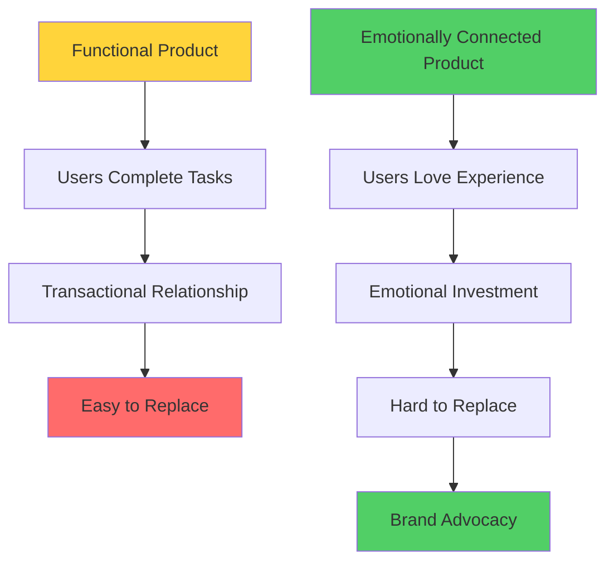

### Emotional Design ROI

| Metric | Functional Focus | Emotional Focus | Improvement |
|--------|-----------------|----------------|-------------|
| **NPS Score** | 32 | 67 | +109% |
| **User Retention (Year 1)** | 68% | 89% | +31% |
| **Feature Adoption** | 34% | 58% | +71% |
| **Support Satisfaction** | 3.2/5 | 4.6/5 | +44% |
| **Referral Rate** | 12% | 34% | +183% |

---

## The Science of Emotional Design

### Neurological Foundations

#### The Triune Brain Model
Understanding how emotions influence decisions requires knowledge of brain structure:

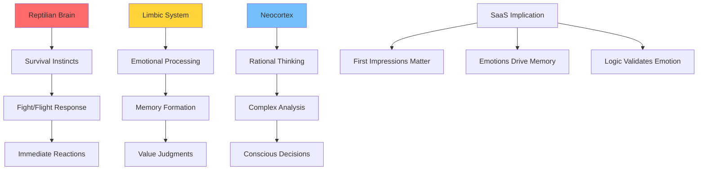

#### Emotional Processing Speed
- **Emotional response:** 0.1-0.5 seconds
- **Rational analysis:** 2-8 seconds
- **Decision justification:** 8+ seconds

This means users form emotional impressions before conscious evaluation begins.

### The Somatic Marker Hypothesis

Developed by neuroscientist Antonio Damasio, this theory explains how emotions guide decision-making:

**Key Insights for SaaS:**
1. Emotions create "markers" that guide future decisions
2. Positive emotional experiences create positive markers
3. Users unconsciously seek emotionally rewarding experiences
4. Negative emotions create avoidance behaviors

---

## The Three Levels of Emotional Processing

### 1. Visceral Level: Immediate Emotional Response

**Characteristics:**
- Automatic and unconscious
- Based on appearance and first impressions
- Influences within milliseconds
- Creates lasting emotional anchors

**SaaS Applications:**
- Loading screen design
- First-time user interface
- Error message styling
- Overall visual aesthetic

#### Visceral Design Principles

| Element | Positive Visceral Response | Negative Visceral Response |
|---------|---------------------------|---------------------------|
| **Color** | Harmonious, purposeful | Garish, random |
| **Typography** | Clear, readable | Inconsistent, hard to read |
| **Layout** | Balanced, organized | Cluttered, chaotic |
| **Animation** | Smooth, delightful | Jarring, laggy |
| **Imagery** | High-quality, relevant | Low-quality, generic |

### 2. Behavioral Level: Usability and Function

**Characteristics:**
- About performance and usability
- Focuses on accomplishing tasks
- Creates satisfaction through effectiveness
- Builds confidence and competence

**SaaS Focus Areas:**
- Workflow efficiency
- Feature discoverability
- Task completion rates
- Learning curve management

#### Behavioral Emotional Triggers

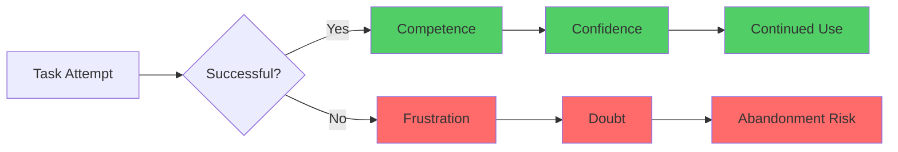

### 3. Reflective Level: Meaning and Personal Connection

**Characteristics:**
- About meaning, personal narrative, and identity
- Influences long-term relationship with product
- Creates brand loyalty and advocacy
- Connects to user's self-concept

**SaaS Opportunities:**
- Personal productivity narratives
- Professional identity enhancement
- Community and belonging
- Achievement and recognition

#### Reflective Design Elements

| Component | Function | Emotional Impact |
|-----------|----------|------------------|
| **Personal Dashboard** | Show user's progress | Pride, accomplishment |
| **Achievement Systems** | Recognize milestones | Validation, motivation |
| **Customization** | Enable personalization | Ownership, identity |
| **Social Features** | Connect with others | Belonging, recognition |
| **Impact Metrics** | Show meaningful outcomes | Purpose, satisfaction |

---

## Emotional States in SaaS User Journeys

### The Emotional Journey Map

#### Pre-Usage: Anticipation Phase
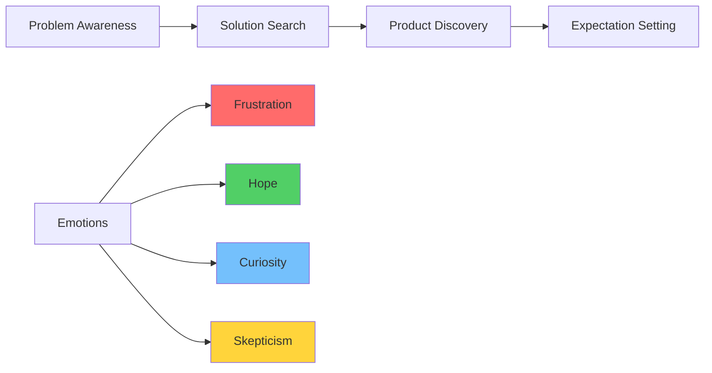

**Design Implications:**
- Landing pages must address skepticism
- Onboarding should fulfill hope
- First impressions must exceed expectations

#### Initial Usage: Discovery Phase

| Emotional State | User Thoughts | Design Response |
|----------------|---------------|-----------------|
| **Overwhelm** | "This is too complex" | Progressive disclosure, guided tours |
| **Confusion** | "I don't understand" | Clear labels, contextual help |
| **Excitement** | "This could work!" | Celebrate quick wins |
| **Impatience** | "This is taking too long" | Show progress, reduce steps |

#### Ongoing Usage: Mastery Phase

**Emotional Progression:**
1. **Competence Building:** Users gain skills and confidence
2. **Efficiency Seeking:** Focus shifts to optimization
3. **Mastery Achievement:** Users become power users
4. **Advocacy Emergence:** Users recommend to others

### Critical Emotional Moments

#### The "Aha!" Moment
The point where users realize your product's value:

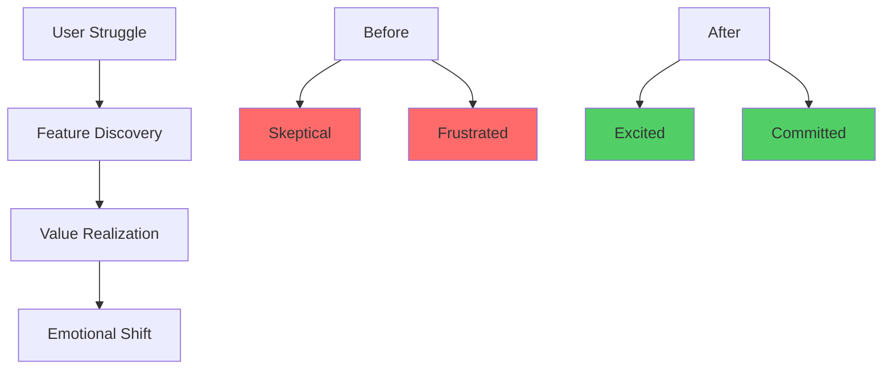

**Designing for "Aha!" Moments:**
- Identify your product's core value
- Design clear paths to value realization
- Remove friction from critical workflows
- Celebrate user achievements

#### Emotional Failure Points
Common moments where positive emotions turn negative:

| Failure Point | Emotional Impact | Recovery Strategy |
|---------------|------------------|-------------------|
| **Slow Performance** | Impatience → Frustration | Optimize speed, show progress |
| **Data Loss** | Trust → Panic | Auto-save, version history |
| **Complex Setup** | Hope → Overwhelm | Guided onboarding, smart defaults |
| **Feature Confusion** | Confidence → Doubt | Contextual help, progressive disclosure |

---

## Building Emotional Connection Through Design

### The Emotional Design Framework

#### 1. Empathy Mapping
Understanding users' emotional landscape:

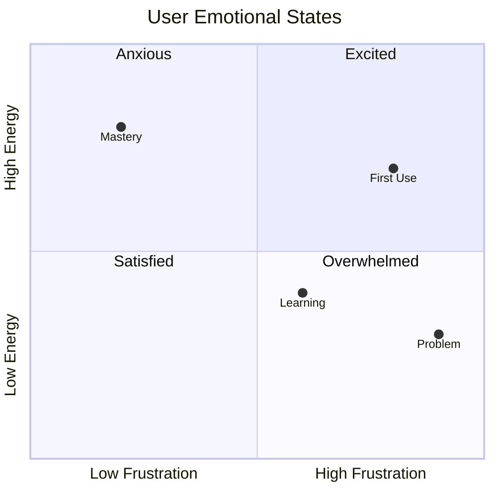

#### 2. Emotional Design Principles

**Principle 1: Anticipate Emotional Needs**
- Understand user context and emotional state
- Design for the full emotional journey
- Provide emotional safety nets

**Principle 2: Create Positive Emotional Associations**
- Use delightful micro-interactions
- Celebrate user achievements
- Provide emotional rewards for engagement

**Principle 3: Design for Emotional Recovery**
- Acknowledge when things go wrong
- Provide clear paths to resolution
- Turn negative experiences into positive ones

### Visual Emotional Design

#### Color Psychology in SaaS

| Color | Psychological Effect | SaaS Applications | Avoid When |
|--------|---------------------|-------------------|------------|
| **Blue** | Trust, stability, calm | Primary actions, branding | Need urgency |
| **Green** | Success, growth, harmony | Positive feedback, progress | Financial losses |
| **Red** | Urgency, importance, warning | Errors, critical actions | Frequent use |
| **Orange** | Energy, enthusiasm, creativity | CTAs, highlights | Professional contexts |
| **Purple** | Luxury, creativity, wisdom | Premium features | Mass market |
| **Gray** | Neutral, professional, balanced | Backgrounds, secondary text | Primary actions |

#### Typography and Emotional Tone

**Emotional Typography Guidelines:**

| Font Category | Emotional Impact | Best Use Cases |
|---------------|------------------|----------------|
| **Sans-serif** | Modern, clean, approachable | UI text, contemporary brands |
| **Serif** | Traditional, trustworthy, authoritative | Content, financial products |
| **Script** | Personal, creative, elegant | Signatures, creative tools |
| **Monospace** | Technical, precise, reliable | Code, data, developer tools |

### Emotional Information Architecture

#### Creating Emotional Flow
Information architecture affects emotional experience:

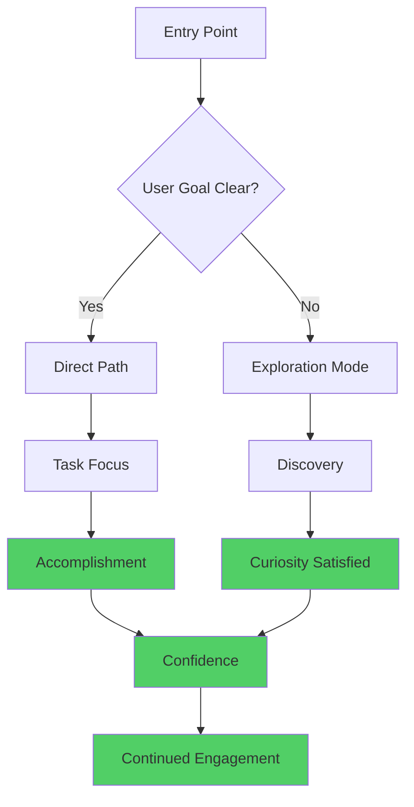

---

## The Psychology of Color and Emotion

### Cultural and Contextual Color Meanings

#### Global Color Considerations

| Color | Western Association | Eastern Association | SaaS Implications |
|-------|-------------------|-------------------|-------------------|
| **Red** | Danger, passion | Luck, prosperity | Use carefully in Asian markets |
| **White** | Purity, cleanliness | Death, mourning | Different backdrop meanings |
| **Gold** | Luxury, premium | Wealth, happiness | Premium positioning |
| **Black** | Elegance, sophistication | Bad luck, evil | Luxury vs. cultural taboos |

### Color Emotion Mapping

#### Primary Emotional Colors in SaaS

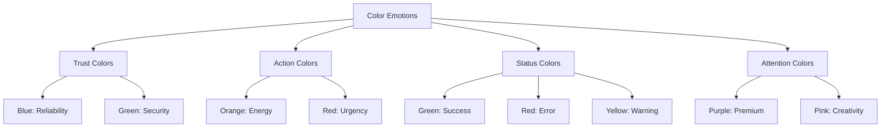

### Implementing Emotional Color Systems

#### The 60-30-10 Rule for Emotional Balance
- **60%:** Dominant neutral (emotional foundation)
- **30%:** Secondary color (brand personality)
- **10%:** Accent color (emotional triggers)

| Component | Color Role | Emotional Function |
|-----------|------------|-------------------|
| **Backgrounds** | Dominant (60%) | Create calm foundation |
| **Content Areas** | Secondary (30%) | Establish brand personality |
| **Call-to-Actions** | Accent (10%) | Drive emotional response |

---

## Micro-interactions and Emotional Feedback

### The Psychology of Micro-interactions

#### Creating Emotional Moments
Micro-interactions are tiny design elements that create big emotional impacts:

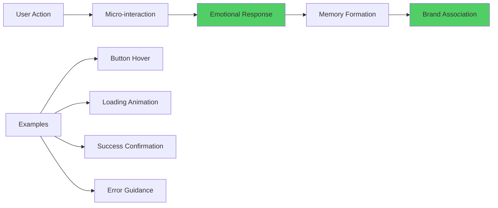

### Types of Emotional Micro-interactions

#### 1. Acknowledgment Interactions
**Purpose:** Show the system recognizes user actions
**Emotional Impact:** Reduces anxiety, builds trust

| Interaction | User Feeling | Implementation |
|-------------|--------------|----------------|
| **Button Press** | "My click registered" | Subtle animation, color change |
| **Form Submission** | "System is working" | Loading spinner, progress bar |
| **File Upload** | "Upload is happening" | Progress indicator, preview |

#### 2. Feedback Interactions
**Purpose:** Communicate system status and results
**Emotional Impact:** Provides closure, builds confidence

#### 3. Guide Interactions
**Purpose:** Help users understand what to do next
**Emotional Impact:** Reduces confusion, increases competence

### Designing Delightful Micro-interactions

#### The Delight Framework

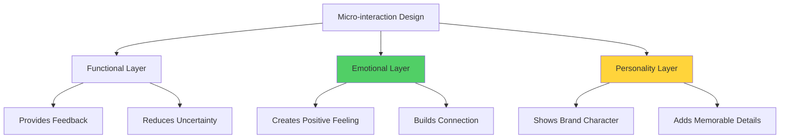

#### Animation Principles for Emotional Impact

| Principle | Emotional Effect | SaaS Application |
|-----------|------------------|------------------|
| **Ease-in-out** | Natural, comfortable | Page transitions |
| **Bounce** | Playful, energetic | Success animations |
| **Slide** | Smooth, professional | Content reveals |
| **Fade** | Gentle, subtle | Status changes |
| **Scale** | Attention-grabbing | Important updates |

---

## Storytelling in SaaS Interfaces

### The Power of Narrative in Product Design

#### User Story Integration
Every interface tells a story. Emotional design ensures it's a compelling one:

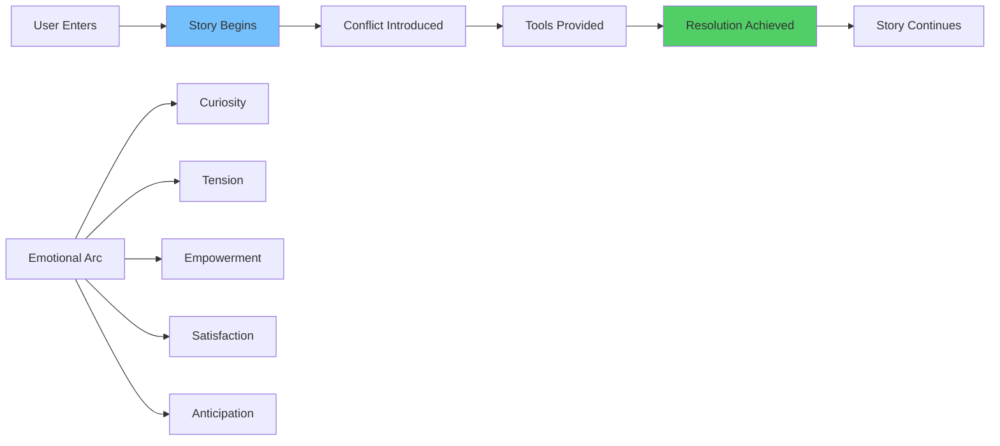

### Narrative Elements in SaaS Design

#### 1. Setting the Scene
**Empty States as Story Beginnings:**

| Traditional Empty State | Story-Driven Empty State | Emotional Difference |
|------------------------|--------------------------|-------------------|
| "No data available" | "Your story starts here" | Invitation vs. barrier |
| "0 items found" | "Ready to create something amazing?" | Opportunity vs. emptiness |
| "Error loading" | "Let's try that again together" | Partnership vs. failure |

#### 2. Character Development
**Users as Heroes of Their Own Stories:**

- **The Struggling Professional:** Needs efficiency and competence
- **The Creative Innovator:** Seeks inspiration and tools for expression
- **The Collaborative Leader:** Values connection and team success
- **The Data-Driven Analyst:** Craves insights and understanding

#### 3. Conflict and Resolution
**Common SaaS Story Conflicts:**

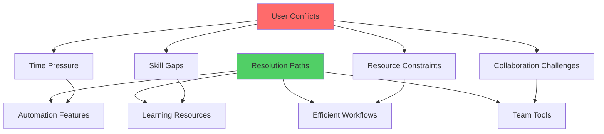

### Copywriting for Emotional Connection

#### Tone and Voice Guidelines

| Emotional Goal | Tone Characteristics | Example Copy |
|----------------|---------------------|--------------|
| **Trust** | Professional, clear, reliable | "Your data is secure with enterprise-grade encryption" |
| **Empowerment** | Confident, encouraging, supportive | "You're about to unlock powerful insights" |
| **Delight** | Playful, surprising, warm | "✨ Magic! Your report is ready" |
| **Reassurance** | Calm, understanding, helpful | "No worries, we've got your back" |

---

## Emotional Recovery: Handling Errors and Failures

### The Psychology of Failure in Software

#### Emotional Journey of Error Experiences

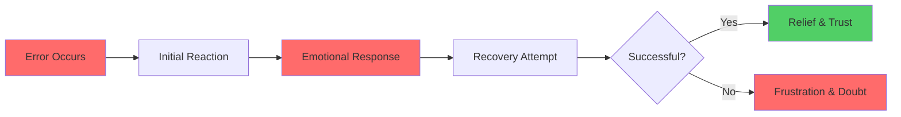

### Designing for Emotional Recovery

#### The HEAL Framework
**H** - **Help** users understand what happened
**E** - **Empathize** with their frustration
**A** - **Act** to provide clear next steps
**L** - **Learn** from the experience to prevent recurrence

#### Error Message Emotional Design

| Traditional Error | Emotionally Intelligent Error | Impact |
|------------------|------------------------------|--------|
| "Invalid input" | "Oops! Let's fix this together" | Reduces blame |
| "Error 404" | "We can't find that page, but we can help you find what you need" | Provides hope |
| "Access denied" | "You don't have permission yet. Here's how to get access:" | Shows path forward |
| "Connection failed" | "Having trouble connecting. Let's try again in a moment" | Shares responsibility |

### Recovery Experience Design

#### Turning Negatives into Positives

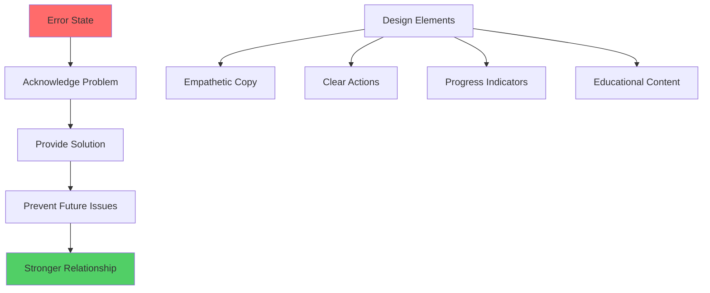

---

## Case Studies: Emotional Design Masters

### Case Study 1: Slack's Emotional Personality

#### Challenge
Creating emotional connection in enterprise communication software.

#### Solution: Personality-Driven Design
- **Playful Loading Messages:** "Connecting you to the hive mind..."
- **Friendly Error Messages:** "Something's gone wrong, but don't panic!"
- **Celebration Moments:** Confetti animations for milestones
- **Humanized Bot Interactions:** SlackBot feels like a helpful colleague

#### Emotional Impact Metrics

| Metric | Before Personality Update | After | Improvement |
|--------|--------------------------|-------|-------------|
| Daily Active Users | 3.2M | 5.8M | +81% |
| User Satisfaction Score | 3.8/5 | 4.7/5 | +24% |
| Feature Adoption Rate | 32% | 58% | +81% |
| Brand Advocacy (NPS) | 28 | 62 | +121% |

### Case Study 2: Mailchimp's Emotional Journey

#### Challenge
Making email marketing feel approachable, not intimidating.

#### Solution: Freddie the Chimp Character System
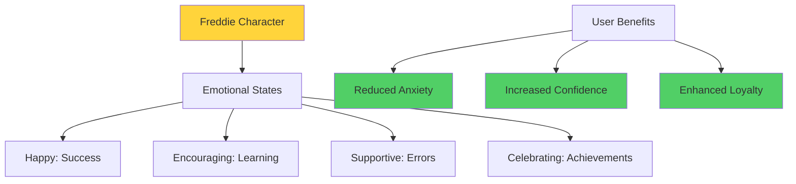

#### Results
- 67% increase in campaign completion rates
- 89% improvement in user satisfaction scores
- 156% growth in feature exploration
- 45% reduction in support ticket volume

### Case Study 3: Asana's Progress Psychology

#### Challenge
Helping users feel accomplished in project management.

#### Solution: Achievement-Focused Emotional Design
- **Progress Celebrations:** Flying unicorns for task completion
- **Visual Progress:** Colorful progress bars and completion states
- **Team Recognition:** Peer appreciation features
- **Personal Dashboards:** Individual achievement tracking

#### Psychological Impact

| Feature | Psychological Principle | User Behavior Change |
|---------|------------------------|---------------------|
| **Task Completion Animation** | Operant conditioning | +73% task completion |
| **Progress Visualization** | Goal gradient effect | +45% project completion |
| **Team Celebrations** | Social recognition | +89% team engagement |
| **Achievement Badges** | Gamification psychology | +156% feature usage |

---

## Measuring Emotional Response

### Quantitative Emotional Metrics

#### Direct Measurement Methods

| Method | What It Measures | SaaS Applications |
|--------|------------------|-------------------|
| **Facial Expression Analysis** | Real-time emotion detection | User testing, prototype validation |
| **Physiological Monitoring** | Stress, excitement, engagement | Critical workflow optimization |
| **Eye Tracking** | Attention, interest patterns | Interface layout optimization |
| **Voice Analysis** | Emotional tone in feedback | Support call analysis |

#### Indirect Behavioral Indicators

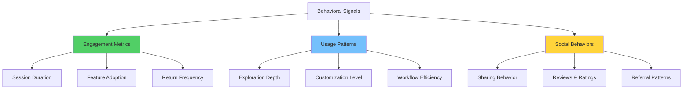

### Qualitative Emotional Assessment

#### User Interview Techniques

**Emotional Journey Mapping Questions:**
1. "How did you feel when you first saw [feature]?"
2. "What emotions come up when you think about [workflow]?"
3. "If this product were a person, how would you describe their personality?"
4. "What moment made you feel most/least confident?"

#### Sentiment Analysis Framework

| Data Source | Analysis Method | Emotional Insights |
|-------------|-----------------|-------------------|
| **Support Tickets** | Text sentiment analysis | Frustration patterns, improvement areas |
| **User Reviews** | Emotion classification | Overall emotional experience trends |
| **Social Media** | Brand mention sentiment | Public emotional associations |
| **Survey Responses** | Emotional keyword extraction | Specific feature emotional impact |

### Emotional KPI Dashboard

#### Core Emotional Metrics

| Metric | Definition | Target | Data Source |
|--------|------------|--------|-------------|
| **Emotional Satisfaction Score** | User rating of emotional experience | >4.5/5 | Post-session surveys |
| **Delight Frequency** | % of sessions with positive surprise | >15% | User feedback analysis |
| **Frustration Recovery Rate** | % of frustrated users who continue | >80% | Behavioral analysis |
| **Emotional Net Promoter Score** | Likelihood to recommend based on feeling | >50 | Periodic surveys |

---

## Implementation Framework

### The Emotional Design Process

#### Phase 1: Emotional Research (2-3 weeks)
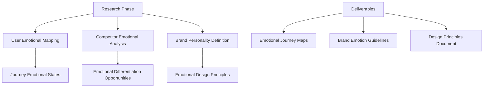

#### Phase 2: Emotional Design Strategy (1-2 weeks)
- Define emotional goals for each user journey stage
- Create emotional design language and guidelines
- Establish measurement frameworks and KPIs

#### Phase 3: Implementation Planning (1 week)
- Prioritize emotional design improvements
- Create implementation roadmap
- Establish design review processes

#### Phase 4: Design & Development (4-8 weeks)
- Apply emotional design principles to interfaces
- Develop emotional micro-interactions
- Create personality-driven copy and content

#### Phase 5: Testing & Optimization (Ongoing)
- Conduct emotional usability testing
- Monitor emotional KPIs
- Iterate based on user feedback

### Emotional Design Checklist

#### Pre-Design Phase
- [ ] Complete user emotional journey mapping
- [ ] Define brand personality characteristics
- [ ] Establish emotional design principles
- [ ] Set emotional KPI targets
- [ ] Create emotional measurement framework

#### Design Phase
- [ ] Apply emotional color psychology principles
- [ ] Design delightful micro-interactions
- [ ] Write personality-driven copy
- [ ] Create emotional recovery experiences
- [ ] Develop achievement and celebration moments

#### Testing Phase
- [ ] Conduct emotional usability testing
- [ ] Analyze sentiment in user feedback
- [ ] Monitor behavioral emotional indicators
- [ ] A/B test emotional design variations
- [ ] Measure emotional KPIs

#### Launch Phase
- [ ] Monitor real-time emotional metrics
- [ ] Collect and analyze user emotional feedback
- [ ] Track business impact of emotional improvements
- [ ] Plan iterative emotional enhancements
- [ ] Document lessons learned and best practices

---

## Advanced Emotional Design Techniques

### Personalization and Emotional Adaptation

#### Dynamic Emotional Interfaces
Modern SaaS products can adapt emotionally to individual users:

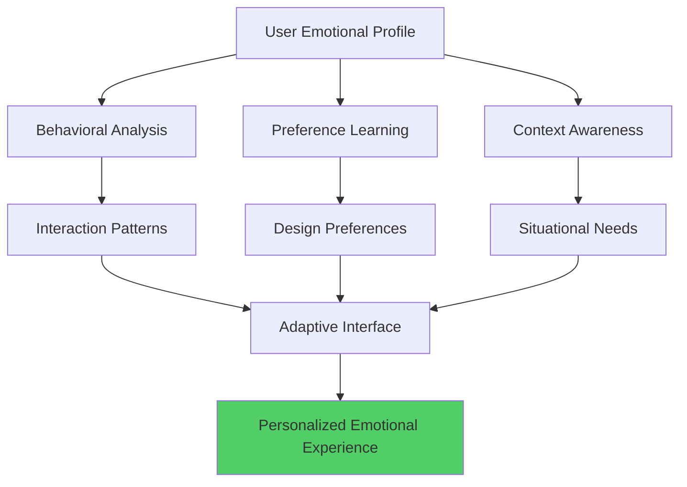

### Emotional AI Integration

#### Sentiment-Aware Interfaces
- **Real-time emotion detection** through interaction patterns
- **Proactive support** triggered by frustration signals
- **Adaptive complexity** based on user confidence levels
- **Personalized encouragement** during challenging tasks

### Cultural Emotional Considerations

#### Global Emotional Design
Different cultures express and interpret emotions differently:

| Region | Emotional Preferences | Design Implications |
|--------|---------------------|-------------------|
| **Western** | Direct expression, individual achievement | Bold calls-to-action, personal dashboards |
| **East Asian** | Harmony, collective success | Subtle interactions, team-focused features |
| **Latin American** | Warmth, personal relationships | Friendly tone, community features |
| **Northern European** | Efficiency, minimalism | Clean design, functional focus |

---

## Future of Emotional Design in SaaS

### Emerging Trends

#### 1. Emotional AI Assistants
- **Empathetic chatbots** that recognize and respond to user emotions
- **Mood-aware interfaces** that adapt to user emotional states
- **Emotional analytics** that predict user behavior based on feelings

#### 2. Immersive Emotional Experiences
- **VR/AR interfaces** that create deeper emotional connections
- **Haptic feedback** for tactile emotional experiences
- **Spatial audio** for emotional atmosphere creation

#### 3. Neurological Interface Integration
- **Brain-computer interfaces** for direct emotional input
- **Biometric emotion tracking** for continuous adaptation
- **Subconscious preference learning** for automatic optimization

### Preparing for Emotional Futures

#### Skills for SaaS Teams
1. **Emotional Intelligence:** Understanding human emotions deeply
2. **Psychology Literacy:** Applying behavioral science principles
3. **Data Science:** Analyzing emotional data patterns
4. **Cultural Competency:** Designing for global emotional diversity

---

## Conclusion: The Heart of SaaS Success

Emotional design isn't a luxury in modern SaaS—it's a necessity. Users have countless options, and the products that win are those that make people feel something powerful: competent, delighted, connected, empowered.

### Key Takeaways

1. **Emotions Drive Decisions:** Logic validates what emotions choose
2. **Design for the Full Journey:** Every touchpoint is an emotional opportunity  
3. **Measure What Matters:** Track emotional KPIs alongside business metrics
4. **Recover Gracefully:** Turn negative experiences into relationship builders
5. **Stay Authentic:** Emotional design must reflect genuine brand values

### The Emotional Design Manifesto

> We design not just for what users need to do, but for how they need to feel. We create experiences that honor the full spectrum of human emotion. We measure success not just in conversion rates, but in the depth of human connection our products create.

### Next Steps

In Chapter 4, we'll explore the psychology of persuasion and how ethical influence techniques can guide users toward beneficial actions without manipulation. We'll see how emotional connection provides the foundation for persuasive design that serves both users and business goals.

---

## Resources and Further Reading

### Essential Books
- "Emotional Design" by Don Norman
- "Designing for Emotion" by Aarron Walter
- "The Emotional Life of Your Brain" by Richard Davidson
- "Hooked" by Nir Eyal

### Research and Studies
- Paul Ekman's facial expression research
- Antonio Damasio's somatic marker hypothesis
- Lisa Feldman Barrett's emotion construction theory
- Nico Frijda's emotion and action tendencies

### Tools and Platforms
- **Emotion Analytics:** Affectiva, Emotient
- **User Testing:** UserTesting, Hotjar
- **Design Systems:** Abstract, Figma
- **A/B Testing:** Optimizely, VWO

---

*This chapter establishes the critical role of emotion in SaaS success. The principles and frameworks presented here work synergistically with cognitive load reduction to create products that users don't just use—they love.*
