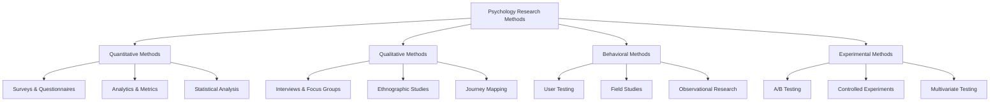
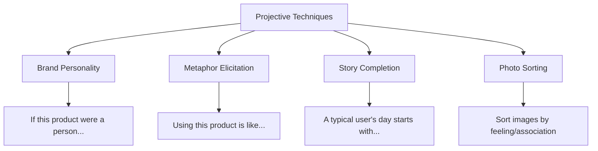
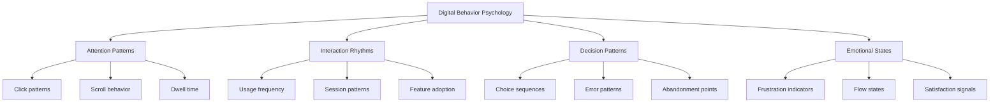
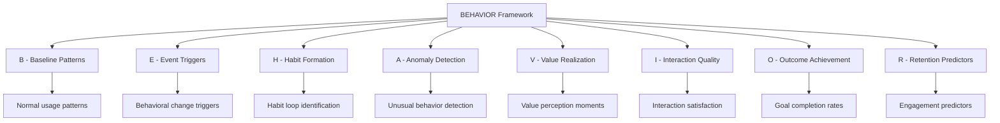
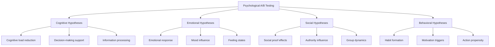
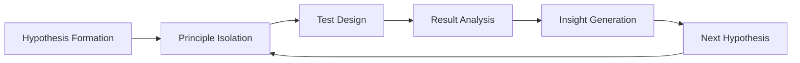
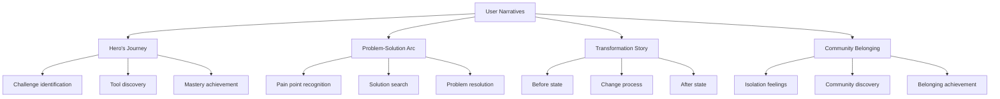
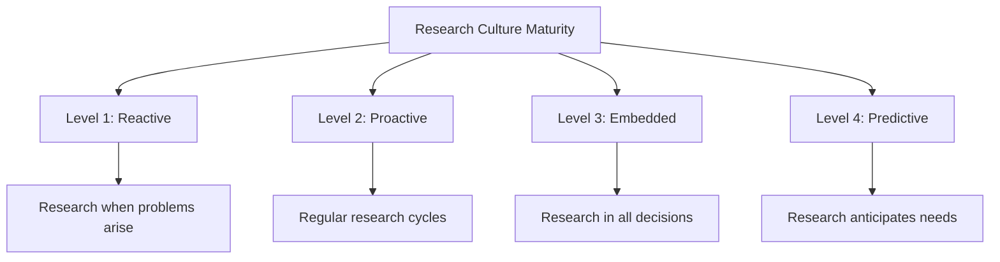
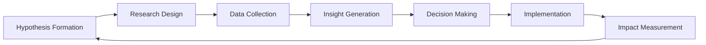

# Chapter 27: Psychological Research Methods

> *"The best insights come not from what users say, but from understanding why they do what they do. Psychology research reveals the hidden drivers of user behavior."* - Behavioral Research Institute

## Introduction

Understanding user psychology requires sophisticated research methods that go beyond traditional usability testing and surveys. This chapter provides comprehensive frameworks for conducting psychological research in SaaS environments, uncovering deep behavioral insights, and building a research culture that drives billion-dollar product decisions.

Psychological research in SaaS is fundamentally different from traditional market research. It seeks to understand the unconscious drivers of behavior, the emotional undercurrents of decision-making, and the cognitive patterns that determine long-term product success. The companies that master psychological research gain unprecedented insights into user motivation and behavior.

## Section 1: User Psychology Research Techniques

### The Psychology Research Ecosystem

Psychological research in SaaS requires multiple methodologies working together:

### Advanced Interview Techniques for Psychology Research

**The Laddering Technique:**
Uncover deep motivations by asking "why" repeatedly:

| Level | Question Type | Example | Psychological Insight |
|-------|---------------|---------|----------------------|
| **Attribute** | What do you use? | "I use the dashboard daily" | Behavioral pattern |
| **Consequence** | Why is that important? | "It helps me stay on top of metrics" | Functional benefit |
| **Value** | Why does that matter to you? | "I need to prove my team's impact" | Emotional driver |
| **Core Value** | What does that give you? | "Professional credibility and security" | Deep motivation |

**The Critical Incident Technique:**
Explore specific moments of high emotional impact:
- Identify critical success/failure moments
- Deep dive into emotional and cognitive states
- Understand decision-making processes
- Uncover hidden pain points and delights

**Projective Techniques:**
Access unconscious thoughts and feelings:

### Ethnographic Research for SaaS Psychology

**Digital Ethnography Framework:**
Understanding users in their natural environment:

**1. Environmental Observation:**
- Physical workspace setup
- Technology ecosystem usage
- Workflow and routine patterns
- Social and collaborative dynamics

**2. Contextual Inquiry:**
- Tasks as they naturally occur
- Interruptions and context switching
- Multi-tasking behaviors
- Stress and pressure points

**3. Cultural Analysis:**
- Team and organizational culture
- Communication patterns
- Decision-making hierarchies
- Value systems and priorities

### Case Study: Notion's Ethnographic Research

Notion conducted deep ethnographic research to understand knowledge work:

**Research Approach:**
- **Workplace Shadowing:** Observed knowledge workers for full days
- **Digital Archaeology:** Analyzed how people organize digital information
- **Workflow Mapping:** Documented complete task flows across tools
- **Cultural Immersion:** Embedded researchers in different team types

**Key Psychological Insights:**
- **Context Switching Anxiety:** Users felt stressed when information was scattered
- **Information Hoarding:** People saved information "just in case" 
- **Tool Fatigue:** Cognitive load from managing multiple specialized tools
- **Creativity Blocks:** Rigid tools constrained creative thinking

**Product Impact:**
- All-in-one workspace concept
- Flexible block-based architecture
- Powerful linking and organization features
- Customizable templates and structures

**Results:**
- $10 billion valuation
- 30+ million users
- 90% user satisfaction
- Industry-leading user engagement

## Section 2: Behavioral Analytics and Psychology

### The Psychology of Digital Behavior

Digital behavior patterns reveal unconscious user psychology:

**Behavioral Psychology Indicators:**

### Advanced Behavioral Analytics

**Micro-Behavior Analysis:**
Understanding small interactions that reveal big insights:

| Micro-Behavior | Psychological Meaning | Research Method | Insight Application |
|----------------|----------------------|-----------------|-------------------|
| **Hover Patterns** | Uncertainty or curiosity | Mouse tracking | UI clarity improvement |
| **Scroll Speed** | Engagement or scanning | Interaction analytics | Content optimization |
| **Click Hesitation** | Decision difficulty | Timing analysis | Decision support design |
| **Error Recovery** | Frustration or persistence | Error flow analysis | Help system design |
| **Feature Discovery** | Exploration behavior | Navigation analysis | Feature positioning |

**Cohort Psychology Analysis:**
Understanding how different user groups think and behave:

**Psychological Cohort Dimensions:**
- **Cognitive Style:** Analytical vs intuitive thinking
- **Risk Tolerance:** Early adopters vs cautious users  
- **Social Orientation:** Individual vs collaborative focus
- **Achievement Motivation:** Results-driven vs process-focused
- **Change Adaptation:** Innovation lovers vs stability seekers

### The Behavioral Data Psychology Framework

**The BEHAVIOR Framework:**

### Emotional Analytics

**Measuring Emotional States Through Behavior:**

**Frustration Indicators:**
- Rapid clicking or tapping
- Error repetition patterns
- Abandonment after errors
- Support ticket correlation
- Negative feedback timing

**Flow State Indicators:**
- Sustained engagement periods
- Smooth interaction patterns
- Feature depth exploration
- Time perception distortion
- High completion rates

**Satisfaction Indicators:**
- Feature adoption progression
- Positive interaction patterns
- Voluntary exploration behavior
- Sharing and collaboration
- Return visit enthusiasm

### Case Study: Spotify's Behavioral Psychology Analytics

Spotify uses behavioral analytics to understand music psychology:

**Listening Behavior Analysis:**
- **Skip Patterns:** Understanding musical preference formation
- **Playlist Behavior:** Social and personal identity expression
- **Discovery Patterns:** Openness to new experiences
- **Repeat Behavior:** Emotional regulation and comfort seeking

**Psychological Insights:**
- **Mood Regulation:** Music as emotional management tool
- **Identity Expression:** Playlists as personal branding
- **Social Connection:** Sharing as relationship building
- **Habit Formation:** Music as routine and ritual support

**Product Applications:**
- **Discover Weekly:** Leverages psychology of surprise and personalization
- **Daily Mix:** Combines familiarity with discovery
- **Mood Playlists:** Supports emotional regulation needs
- **Social Features:** Enables identity expression and connection

**Results:**
- 489 million monthly active users
- 60%+ conversion to premium
- 2.9 billion hours listened monthly
- Industry-leading user engagement

## Section 3: A/B Testing Psychological Hypotheses

### Psychology-Driven A/B Testing

Traditional A/B testing focuses on conversion; psychological A/B testing focuses on understanding why:

**Psychological Hypothesis Framework:**

### Advanced A/B Testing Methodologies

**Psychological A/B Test Types:**

| Test Type | Psychology Focus | Measurement | Example |
|-----------|-----------------|-------------|---------|
| **Cognitive Load** | Mental effort reduction | Task completion time, errors | Simplifying onboarding steps |
| **Loss Aversion** | Fear of losing benefits | Cancellation rates, upgrades | "Don't lose your work" vs "Save your work" |
| **Social Proof** | Peer influence | Conversion, engagement | "Join 1M users" vs generic CTA |
| **Authority** | Expert credibility | Trust, adoption | CEO quotes vs customer quotes |
| **Reciprocity** | Give-and-receive psychology | Conversion, loyalty | Free trial vs free forever |

**Multi-Layer Psychological Testing:**
Testing multiple psychological principles simultaneously:

**Example: Pricing Page Psychology Test**
- **Layer 1:** Cognitive (pricing complexity)
- **Layer 2:** Emotional (fear vs aspiration)
- **Layer 3:** Social (peer usage indicators)
- **Layer 4:** Behavioral (commitment mechanisms)

**Measurement Framework:**
- **Immediate:** Click-through rates, sign-ups
- **Short-term:** Trial-to-paid conversion, feature adoption
- **Long-term:** Retention, satisfaction, lifetime value
- **Psychological:** Survey responses, behavioral indicators

### Sequential Testing for Psychology

**The Psychology Testing Sequence:**

**1. Hypothesis Formation:**
- Based on psychological theory
- Grounded in user research
- Connected to business outcomes
- Testable and measurable

**2. Principle Isolation:**
- Test one psychological principle at a time
- Control for confounding variables
- Maintain statistical validity
- Ensure meaningful effect sizes

**3. Test Design:**
- Clear control and treatment groups
- Appropriate sample sizes
- Relevant metrics selection
- Proper randomization

**4. Result Analysis:**
- Statistical significance testing
- Effect size evaluation
- Segmentation analysis
- Psychological explanation validation

### Case Study: HubSpot's Psychology A/B Testing

HubSpot systematically tests psychological principles:

**Landing Page Psychology Tests:**

**Test 1: Social Proof Psychology**
- **Hypothesis:** Specific numbers create stronger social proof than generic terms
- **Variants:** "Join thousands" vs "Join 47,283 marketers"
- **Psychology:** Availability heuristic and specificity bias
- **Results:** 15% increase in conversion with specific numbers

**Test 2: Loss Aversion Psychology**
- **Hypothesis:** Loss framing motivates action more than gain framing
- **Variants:** "Don't miss out on leads" vs "Generate more leads"
- **Psychology:** Loss aversion bias
- **Results:** 23% increase with loss framing

**Test 3: Authority Psychology**
- **Hypothesis:** Expert credibility increases trust and conversion
- **Variants:** Customer testimonials vs industry expert endorsements
- **Psychology:** Authority bias and credibility
- **Results:** 18% increase with expert endorsements

**Cumulative Impact:**
- Combined psychology optimizations: 67% overall improvement
- Understanding of user psychology drives ongoing optimization
- Framework replicated across all marketing materials
- Systematic approach to psychology-driven growth

## Section 4: Qualitative Psychology Research

### Deep Qualitative Research Methods

**Phenomenological Research:**
Understanding the lived experience of using your product:

**Research Questions:**
- What is it like to use this product daily?
- How does the product fit into users' life experience?
- What meanings do users attach to product interactions?
- How does the product change users' sense of self?

**Data Collection Methods:**
- **In-depth interviews:** 60-90 minutes exploring experience
- **Experience journals:** Users document thoughts and feelings
- **Photo elicitation:** Users photograph relevant moments
- **Artifact analysis:** Examining user-created content

### Narrative Research for SaaS Psychology

**User Story Analysis:**
Understanding the stories users tell about your product:

**Narrative Analysis Framework:**
- **Plot Structure:** How users describe their journey
- **Character Development:** User identity transformation
- **Conflict Resolution:** Problem-solving narratives
- **Emotional Arc:** Feeling progression over time
- **Meaning Making:** Significance attribution

### Grounded Theory for SaaS Psychology

**Building Theory from User Data:**

**The Grounded Theory Process:**
1. **Open Coding:** Identify concepts in user data
2. **Axial Coding:** Find relationships between concepts
3. **Selective Coding:** Develop core theoretical framework
4. **Theoretical Sampling:** Test theory with new data
5. **Theory Validation:** Confirm framework accuracy

**Example: Customer Success Psychology Theory**

**Open Coding Concepts:**
- Progress visibility
- Goal achievement
- Peer comparison
- Expert guidance
- Skill development

**Axial Coding Relationships:**
- Progress visibility → Motivation increase
- Goal achievement → Confidence building
- Peer comparison → Competitive drive
- Expert guidance → Trust development
- Skill development → Identity transformation

**Selective Coding Core Category:**
"Customer success is fundamentally about identity transformation through supported skill development"

**Theoretical Framework:**
Users adopt SaaS products not just for functionality, but for who they want to become. Success occurs when the product supports their identity transformation journey.

### Case Study: Mailchimp's Qualitative Psychology Research

Mailchimp used qualitative research to understand small business marketing psychology:

**Research Approach:**
- **Ethnographic studies** of small business owners
- **Narrative interviews** about marketing challenges
- **Grounded theory development** of SMB psychology
- **Phenomenological analysis** of success experiences

**Key Psychological Insights:**
- **Imposter Syndrome:** SMB owners felt "not real marketers"
- **Overwhelm Anxiety:** Too many marketing options created paralysis
- **Success Attribution:** Difficulty connecting actions to outcomes
- **Community Desire:** Isolation and need for peer connection

**Product Psychology Applications:**
- **Encouraging tone:** "You're doing great" messaging
- **Simplified complexity:** Easy-to-understand features
- **Success celebration:** Clear win recognition
- **Community building:** User groups and resources

**Results:**
- $12 billion valuation
- Leading SMB marketing platform
- 92% user satisfaction
- Strong brand affinity and loyalty

## Section 5: Building a Psychology-Driven Research Culture

### The Psychology Research Culture Framework

**Organizational Psychology Research Maturity:**

**Building Research Culture:**

**1. Leadership Commitment:**
- Research budget allocation
- Executive research participation
- Success metric integration
- Decision-making inclusion

**2. Team Development:**
- Psychology research training
- Cross-functional collaboration
- External expert partnerships
- Continuous learning programs

**3. Process Integration:**
- Research in product roadmaps
- User psychology in design reviews
- Behavioral data in performance reviews
- Psychological insights in strategy

**4. Tool and Infrastructure:**
- Research technology stack
- Data collection systems
- Analysis and reporting tools
- Insight sharing platforms

### The Research Operations Framework

**Research Ops for Psychology:**

| Function | Purpose | Implementation | Tools |
|----------|---------|----------------|-------|
| **Participant Management** | Build research participant pools | Recruit diverse user segments | User research platforms |
| **Study Planning** | Coordinate research activities | Integrate with product roadmaps | Project management tools |
| **Data Management** | Organize psychological insights | Create searchable insight libraries | Research repositories |
| **Insight Synthesis** | Connect research to decisions | Create actionable frameworks | Synthesis platforms |
| **Impact Measurement** | Track research ROI | Monitor research-driven improvements | Analytics dashboards |

### Creating a Learning Organization

**The Psychology Learning Loop:**

**Psychological Insight Management:**
- **Capture:** Document psychological insights as they emerge
- **Organize:** Categorize by psychological principle and application
- **Share:** Make insights accessible to all team members
- **Apply:** Integrate insights into product decisions
- **Validate:** Test psychological hypotheses systematically
- **Evolve:** Update understanding based on new evidence

### Case Study: Airbnb's Psychology Research Culture

Airbnb built industry-leading psychology research capabilities:

**Research Culture Elements:**
- **Dedicated Research Team:** 50+ researchers across disciplines
- **Executive Engagement:** Leadership participates in research
- **Cross-functional Integration:** Research in all major decisions
- **External Partnerships:** Academic and expert collaborations

**Psychology Research Focus:**
- **Trust Psychology:** Understanding peer-to-peer trust formation
- **Belonging Psychology:** Creating sense of home away from home
- **Community Psychology:** Building host and guest communities
- **Experience Psychology:** Crafting memorable travel experiences

**Research Methods:**
- **Ethnographic studies:** Understanding travel and hosting motivations
- **Behavioral experiments:** Testing trust and safety features
- **Longitudinal research:** Tracking user psychology over time
- **Cross-cultural studies:** Global psychology differences

**Impact on Product:**
- **Trust & Safety:** Psychology-driven verification systems
- **Host Tools:** Understanding host motivation and success
- **Guest Experience:** Psychological journey optimization
- **Community Features:** Social psychology application

**Results:**
- $130+ billion valuation
- Leading trust in peer-to-peer marketplace
- Global expansion success
- Industry-defining user experience standards

## Research Quality and Ethics

### Psychological Research Ethics

**Ethical Considerations:**
- **Informed Consent:** Clear communication about research purposes
- **Privacy Protection:** Safeguarding sensitive psychological data
- **Benefit vs Risk:** Ensuring research benefits outweigh risks
- **Participant Wellbeing:** Avoiding psychological harm
- **Data Usage:** Transparent use of psychological insights

**Ethics Framework:**
- **Institutional Review:** Ethics board evaluation
- **Participant Rights:** Clear opt-out and data control
- **Bias Prevention:** Diverse participant representation
- **Impact Assessment:** Consider societal implications

### Research Quality Standards

**Validity in Psychology Research:**

| Validity Type | Definition | SaaS Application | Quality Measures |
|---------------|------------|------------------|------------------|
| **Internal Validity** | Causal relationship accuracy | A/B test design | Control variables, randomization |
| **External Validity** | Generalizability | User segment representation | Diverse participant sampling |
| **Construct Validity** | Measuring what you intend | Psychology concept operationalization | Multiple measurement methods |
| **Ecological Validity** | Real-world applicability | Natural usage context | Field studies, ethnography |

## Implementation Guide

### Building Your Psychology Research Program

**Phase 1: Foundation (Months 1-3)**
**Objectives:**
- Establish research capabilities
- Build basic psychology research skills
- Create initial research processes

**Key Actions:**
1. Hire or train psychology research capabilities
2. Set up basic research tools and processes
3. Identify key psychological research questions
4. Conduct first psychological research studies

**Success Metrics:**
- Research team established
- First psychological insights generated
- Basic research processes operational

### Phase 2: Integration (Months 4-9)**
**Objectives:**
- Integrate research into product decisions
- Expand research methodologies
- Build cross-functional research culture

**Key Actions:**
1. Implement psychology insights in product features
2. Train product team in psychology research
3. Establish regular research cycles
4. Create insight sharing and application processes

**Success Metrics:**
- 5+ psychology-driven product improvements
- Team psychology research competence
- Regular research-informed decisions

### Phase 3: Optimization (Months 10-18)**
**Objectives:**
- Achieve research-driven culture
- Build predictive psychology capabilities
- Establish industry-leading research

**Key Actions:**
1. Develop predictive psychology models
2. Build comprehensive user psychology profiles
3. Create industry thought leadership
4. Establish research partnerships

**Success Metrics:**
- Predictive psychology accuracy
- Industry research recognition
- Sustainable competitive advantages from psychology insights

## Tools and Technologies

### Psychology Research Technology Stack

**Research Platforms:**
- **User Interviews:** Calendly, UserTesting, Zoom
- **Survey Tools:** Typeform, Qualtrics, SurveyMonkey
- **Analytics:** Mixpanel, Amplitude, Hotjar
- **A/B Testing:** Optimizely, VWO, Split.io

**Specialized Psychology Tools:**
- **Behavioral Analytics:** FullStory, LogRocket, Crazy Egg
- **Emotion Analysis:** Affectiva, Microsoft Emotion API
- **Eye Tracking:** Tobii, EyeQuant
- **Biometric Measurement:** Empatica, Thought Technology

**Analysis and Synthesis:**
- **Qualitative Analysis:** NVivo, Atlas.ti, Dedoose
- **Statistical Analysis:** R, SPSS, Python
- **Visualization:** Tableau, D3.js, Observable
- **Insight Management:** Airtable, Notion, Roam Research

## Action Items and Next Steps

### Immediate Actions (Next 30 Days)
- [ ] Assess current research capabilities and gaps
- [ ] Identify key psychological research questions
- [ ] Select initial research methods and tools
- [ ] Plan first psychological research studies

### Short-term Goals (Next 90 Days)
- [ ] Conduct first psychological research studies
- [ ] Build basic psychology research processes
- [ ] Train team in psychology research methods
- [ ] Implement first psychology-driven product changes

### Long-term Vision (Next Year)
- [ ] Build comprehensive psychology research program
- [ ] Achieve research-driven product development culture
- [ ] Establish predictive psychology capabilities
- [ ] Create industry-leading psychological insights

## Key Takeaways

1. **Psychological research requires specialized methods** - go beyond traditional user research to understand deep motivations and behaviors

2. **Behavioral analytics reveal unconscious patterns** - digital behavior data provides insights users can't articulate

3. **A/B testing psychology hypotheses drives deeper understanding** - test why, not just what works

4. **Qualitative research uncovers the human story** - narrative and phenomenological methods reveal meaning and experience

5. **Research culture multiplies impact** - systematic psychology research capabilities create sustainable competitive advantages

6. **Ethics and quality standards are essential** - psychological research must be conducted responsibly and rigorously

7. **Integration amplifies value** - psychology research must be embedded in product development processes to drive impact

The most successful SaaS companies will be those that understand their users' psychology deeply and systematically. This requires building sophisticated research capabilities that go far beyond traditional user research to uncover the hidden drivers of human behavior and decision-making.

---

*Next: Chapter 28 - Measuring Psychological Impact*

*Previous: Chapter 26 - The Psychology of Market Categories*
