# Chapter 28: Measuring Psychological Impact

> *"What gets measured gets managed, but in psychology, what gets measured also gets understood. The companies that master psychological measurement will dominate their markets."* - Psychology Metrics Institute

## Introduction

Measuring psychological impact is both the most challenging and most crucial aspect of building psychology-driven SaaS products. This chapter provides comprehensive frameworks for measuring psychological KPIs, tracking long-term psychological health, and calculating the ROI of psychological design investments.

Unlike traditional metrics that measure what happened, psychological metrics measure why it happened and predict what will happen. They provide insights into user motivation, emotional states, cognitive processes, and behavioral drivers that determine long-term product success and user loyalty.

## Section 1: Psychological KPIs and Metrics

### The Psychology Metrics Framework

Traditional SaaS metrics miss the psychological drivers of user behavior:

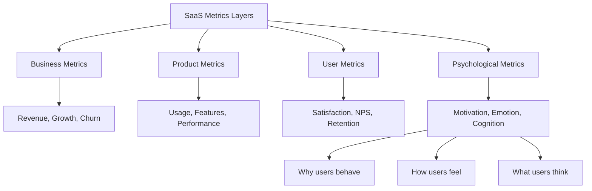

### Core Psychological KPIs

**1. Motivation Metrics:**
Measuring the psychological drivers of user behavior:

| Metric | Definition | Measurement Method | Target Range |
|--------|------------|-------------------|--------------|
| **Intrinsic Motivation Index** | Self-directed usage vs external pressure | Survey + behavioral analysis | 70-85% |
| **Goal Alignment Score** | Product usage supporting user objectives | Journey mapping + interviews | 80-90% |
| **Autonomy Perception** | User sense of control and choice | Control feature usage + surveys | 75-90% |
| **Competence Growth** | Skill development and mastery progress | Feature adoption depth + time | Upward trend |

**2. Emotional Health Metrics:**
Tracking the emotional impact of product usage:

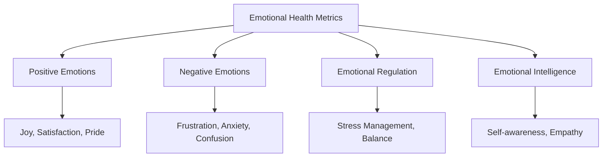

**Positive Emotion Indicators:**
- Achievement celebration engagement
- Voluntary feature exploration
- Positive feedback and reviews
- Social sharing and referrals
- Return usage enthusiasm

**Negative Emotion Detection:**
- Error frustration patterns
- Support ticket sentiment
- Abandonment after errors
- Feature avoidance behaviors
- Passive usage indicators

**3. Cognitive Load Metrics:**
Measuring mental effort and processing efficiency:

| Cognitive Load Type | Measurement | Healthy Range | Warning Signs |
|-------------------|-------------|---------------|---------------|
| **Intrinsic Load** | Task completion time | Decreasing over time | Plateau or increase |
| **Extraneous Load** | Error rates, confusion | <5% error rate | >10% error rate |
| **Germane Load** | Learning progression | Steady skill growth | No progression |
| **Overall Load** | User-reported effort | "Easy" ratings >80% | "Difficult" >20% |

**4. Social Connection Metrics:**
Measuring community and relationship building:

- **Network Growth Rate:** Expanding user connections
- **Collaboration Frequency:** Team feature usage patterns  
- **Community Engagement:** Participation in social features
- **Peer Support Indicators:** Help-giving and receiving
- **Social Learning Metrics:** Knowledge sharing behaviors

### Advanced Psychological Measurement

**The PSYCHOLOGY KPI Framework:**

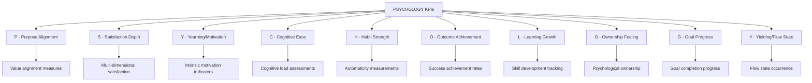

### Measuring Psychological States

**Flow State Detection:**
Identifying when users enter optimal experience:

**Flow Indicators:**
- Extended uninterrupted usage sessions
- Deep feature engagement patterns
- Time perception distortion (sessions feel shorter)
- High task completion rates
- Low error rates during engagement
- Voluntary return to complex tasks

**Flow Measurement Framework:**
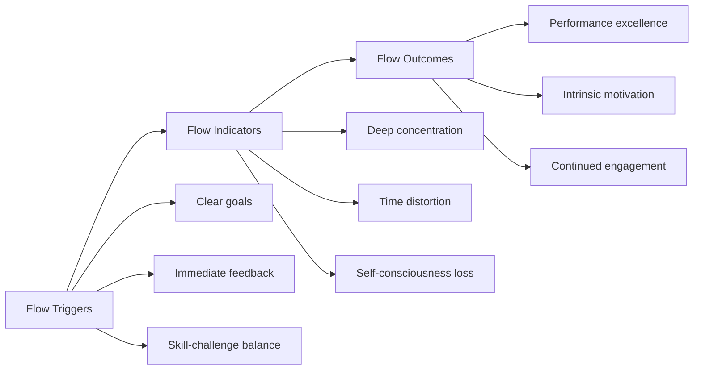

**Stress and Anxiety Detection:**
Identifying when product usage creates negative psychological states:

**Stress Indicators:**
- Rapid, erratic clicking patterns
- Multiple error repetitions
- Task abandonment after difficulties
- Support ticket creation timing
- Negative sentiment in communications

**Anxiety Measurements:**
- Decision hesitation patterns
- Feature avoidance behaviors
- Preference for familiar paths
- Resistance to new feature adoption
- Excessive confirmation-seeking

### Case Study: Headspace's Psychological KPI System

Headspace measures comprehensive psychological impact:

**Core Psychological KPIs:**

**1. Mindfulness Development Index:**
- **Components:** Awareness, attention, acceptance
- **Measurement:** In-app assessments + behavioral patterns
- **Target:** 15% monthly improvement
- **Current:** 23% average monthly growth

**2. Emotional Regulation Score:**
- **Components:** Stress response, mood stability, resilience
- **Measurement:** Pre/post session surveys + usage patterns
- **Target:** 70% report improvement
- **Current:** 78% positive emotional impact

**3. Habit Formation Strength:**
- **Components:** Consistency, automaticity, craving
- **Measurement:** Usage patterns + self-report
- **Target:** 21-day habit formation
- **Current:** 18-day average habit establishment

**4. Life Satisfaction Impact:**
- **Components:** Wellbeing, life satisfaction, stress levels
- **Measurement:** Quarterly life satisfaction surveys
- **Target:** 20% improvement in 3 months
- **Current:** 31% average improvement

**Business Impact:**
- 95% user satisfaction scores
- 23% monthly active user growth
- $320 million annual revenue
- Industry-leading retention rates

## Section 2: Behavioral Cohort Analysis

### Psychology-Based Cohort Segmentation

Traditional cohorts segment by demographics or acquisition date. Psychological cohorts segment by mental models, motivations, and behavioral patterns:

**Psychological Cohort Dimensions:**

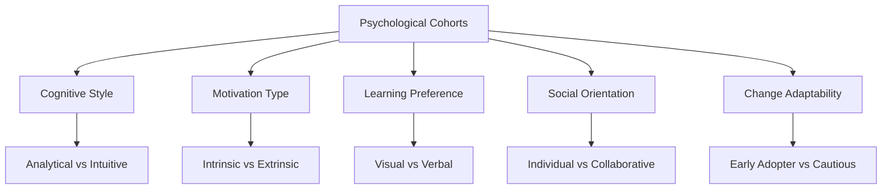

### Advanced Cohort Analysis Framework

**The COHORT Framework:**

| Dimension | Description | Measurement | Application |
|-----------|-------------|-------------|-------------|
| **C**ognitive | How users process information | Task approach patterns | Interface design optimization |
| **O**rientation | Individual vs social focus | Collaboration feature usage | Feature prioritization |
| **H**abit | Routine and consistency patterns | Usage timing and frequency | Engagement strategy design |
| **O**ptimism | Growth vs fixed mindset | Learning behavior tracking | Success pathway design |
| **R**isk | Risk tolerance levels | Feature adoption patterns | Innovation rollout strategy |
| **T**iming | Urgency and planning preferences | Decision-making speed | Communication timing |

### Behavioral Pattern Recognition

**Psychological Behavior Clustering:**

**Cluster 1: Systematic Optimizers**
- **Characteristics:** Methodical, improvement-focused, data-driven
- **Behavior Patterns:** Deep feature usage, customization, metrics tracking
- **Psychological Profile:** High conscientiousness, internal locus of control
- **Product Strategy:** Advanced features, analytics, optimization tools

**Cluster 2: Social Collaborators**
- **Characteristics:** Team-oriented, relationship-focused, consensus-building
- **Behavior Patterns:** High collaboration feature usage, sharing, communication
- **Psychological Profile:** High agreeableness, external validation seeking
- **Product Strategy:** Social features, team tools, community building

**Cluster 3: Creative Explorers**
- **Characteristics:** Innovation-seeking, flexible, experimentation-focused  
- **Behavior Patterns:** Feature exploration, creative usage, customization
- **Psychological Profile:** High openness, intrinsic motivation
- **Product Strategy:** Flexible tools, creative features, experimentation support

**Cluster 4: Efficiency Seekers**
- **Characteristics:** Results-oriented, time-conscious, simplicity-preferring
- **Behavior Patterns:** Core feature focus, automation usage, quick interactions
- **Psychological Profile:** High productivity motivation, time pressure sensitivity
- **Product Strategy:** Automation, shortcuts, streamlined workflows

### Longitudinal Psychological Development

**Tracking Psychological Growth Over Time:**

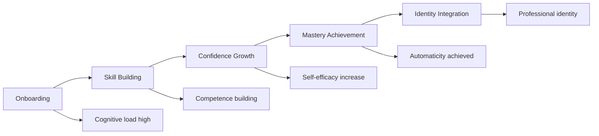

**Psychological Development Metrics:**

| Stage | Duration | Key Indicators | Success Metrics |
|-------|----------|----------------|----------------|
| **Initial Learning** | Days 1-7 | High cognitive load, frequent help-seeking | Task completion, reduced errors |
| **Skill Development** | Days 8-30 | Feature exploration, competence building | Feature adoption, efficiency gains |
| **Confidence Building** | Days 31-90 | Advanced feature usage, creative applications | Self-directed usage, problem solving |
| **Mastery Integration** | Days 91+ | Workflow optimization, teaching others | Expertise demonstration, advocacy |

### Case Study: Figma's Behavioral Cohort Psychology

Figma uses psychological cohorts to optimize user experience:

**Psychological Cohort Identification:**

**Design Leaders:**
- **Psychology:** High creativity, leadership orientation, strategic thinking
- **Behavior:** Tool evaluation, team coordination, design system creation
- **Product Focus:** Advanced features, team management, integration capabilities

**Hands-on Designers:**
- **Psychology:** High creativity, craftsmanship focus, flow-seeking
- **Behavior:** Deep tool usage, creative exploration, skill development
- **Product Focus:** Design tools, creative features, workflow optimization

**Collaborative Teams:**
- **Psychology:** Team-oriented, communication-focused, consensus-building
- **Behavior:** Real-time collaboration, feedback exchange, iteration cycles
- **Product Focus:** Collaboration features, communication tools, version control

**Developer Handoff:**
- **Psychology:** Precision-focused, efficiency-seeking, system-oriented
- **Behavior:** Specification extraction, asset export, technical integration
- **Product Focus:** Developer tools, export features, specification accuracy

**Cohort-Specific Optimizations:**
- Personalized onboarding paths
- Targeted feature recommendations
- Customized interface configurations
- Specialized workflow optimizations

**Results:**
- 4+ million active users
- 90% user satisfaction across cohorts
- Industry-leading collaboration adoption
- $20 billion valuation

## Section 3: Psychological Journey Mapping

### The Psychology of User Journeys

Traditional user journey maps track actions; psychological journey maps track thoughts, emotions, and motivations:

**Psychological Journey Components:**

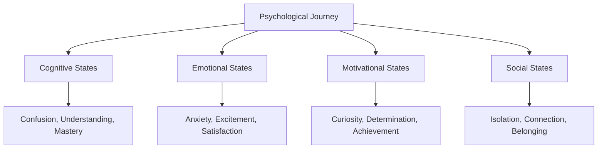

### Advanced Journey Mapping Framework

**The JOURNEY Framework:**

| Stage | Psychological Focus | Measurement | Optimization Strategy |
|-------|-------------------|-------------|----------------------|
| **J**oining | First impressions and expectations | Onboarding sentiment, initial engagement | Trust building, expectation setting |
| **O**rienting | Understanding and cognitive mapping | Learning curve metrics, help usage | Cognitive load reduction, guidance |
| **U**tilizing | Active usage and value realization | Feature adoption, success rates | Value demonstration, quick wins |
| **R**outine | Habit formation and automation | Usage consistency, automatic behaviors | Habit triggers, reward optimization |
| **N**etworking | Social connection and collaboration | Social feature usage, community engagement | Social proof, collaboration tools |
| **E**xpanding | Growth and advancement | Advanced feature adoption, skill development | Progression paths, advanced capabilities |
| **Y**earning | Long-term goals and aspirations | Vision alignment, outcome achievement | Future vision, growth opportunities |

### Emotional Journey Mapping

**The Emotional Arc Framework:**

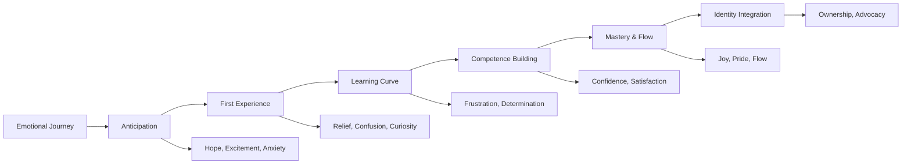

**Emotional Touchpoint Analysis:**

| Touchpoint | Positive Emotions | Negative Emotions | Optimization Opportunity |
|------------|------------------|-------------------|-------------------------|
| **Landing Page** | Excitement, Hope | Skepticism, Confusion | Clear value proposition |
| **Sign-up** | Anticipation | Anxiety, Friction | Reduce cognitive load |
| **Onboarding** | Discovery, Progress | Overwhelm, Frustration | Guided progression |
| **First Success** | Achievement, Relief | Doubt, Inadequacy | Celebrate small wins |
| **Daily Usage** | Flow, Competence | Routine, Boredom | Maintain engagement |
| **Advanced Features** | Growth, Mastery | Complexity, Fear | Progressive disclosure |

### Cognitive Journey Mapping

**Mental Model Development:**

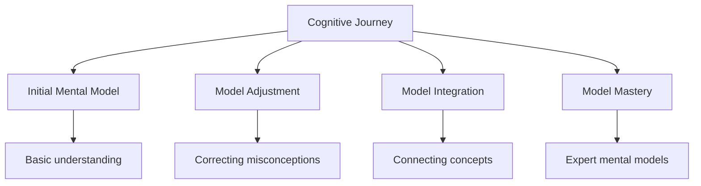

**Cognitive Load Throughout Journey:**

| Journey Stage | Cognitive Load Level | Primary Mental Tasks | Support Strategy |
|---------------|---------------------|---------------------|------------------|
| **Discovery** | High | Understanding value, evaluating fit | Clear explanation, social proof |
| **Setup** | Very High | Learning interface, configuring settings | Step-by-step guidance, defaults |
| **Learning** | High | Building mental models, remembering features | Progressive disclosure, practice |
| **Adoption** | Medium | Integrating into workflow, habit formation | Triggers, rewards, automation |
| **Mastery** | Low | Automatic usage, creative application | Advanced features, customization |

### Case Study: Notion's Psychological Journey Optimization

Notion mapped and optimized the psychological journey of knowledge workers:

**Journey Psychology Analysis:**

**Stage 1: Tool Fatigue (Pre-Notion)**
- **Emotion:** Frustration with tool switching
- **Cognition:** Scattered information, context switching
- **Motivation:** Desire for unified workspace
- **Optimization:** Position as "all-in-one" solution

**Stage 2: Blank Page Anxiety (Initial Setup)**
- **Emotion:** Overwhelm at infinite possibilities
- **Cognition:** Decision paralysis, unclear starting point
- **Motivation:** Need for structure and guidance
- **Optimization:** Template library, guided setup

**Stage 3: Learning Curve Frustration (Week 1-2)**
- **Emotion:** Confusion about blocks and databases
- **Cognition:** New mental model construction
- **Motivation:** Desire for competence
- **Optimization:** Interactive tutorials, progressive disclosure

**Stage 4: First Success Moment (Week 2-3)**
- **Emotion:** Achievement, excitement about possibilities
- **Cognition:** "Aha!" moment understanding blocks
- **Motivation:** Confidence to explore more
- **Optimization:** Success celebration, feature suggestions

**Stage 5: Workflow Integration (Month 1-2)**
- **Emotion:** Growing satisfaction and ownership
- **Cognition:** Mental model solidification
- **Motivation:** Efficiency and organization
- **Optimization:** Workflow templates, automation

**Stage 6: Creative Expression (Month 2+)**
- **Emotion:** Joy in customization and creativity
- **Cognition:** Expert mental models
- **Motivation:** Self-expression and identity
- **Optimization:** Advanced features, community sharing

**Results:**
- 30+ million users
- 90% user satisfaction
- Industry-leading engagement
- $10 billion valuation

## Section 4: Long-term Psychological Health Metrics

### Sustainable Psychology Framework

Long-term psychological health goes beyond engagement to measure user flourishing:

**The FLOURISH Framework:**

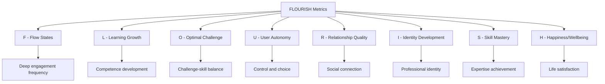

### Psychological Wellbeing Metrics

**Mental Health Indicators:**

| Dimension | Positive Indicators | Negative Indicators | Measurement Method |
|-----------|-------------------|-------------------|------------------|
| **Autonomy** | Self-directed usage, customization | Compliance-driven usage | Choice tracking, control usage |
| **Competence** | Skill growth, mastery achievement | Stagnation, help-seeking | Learning progression, expertise |
| **Relatedness** | Social connection, collaboration | Isolation, competition | Social feature usage, community |
| **Purpose** | Goal alignment, meaning | Aimless usage, disconnection | Goal tracking, value alignment |
| **Resilience** | Error recovery, persistence | Frustration, abandonment | Failure response, comeback rate |

### Digital Wellbeing Assessment

**Healthy Technology Relationship Indicators:**

**Intentional Usage:**
- Users choose when and how to engage
- Usage aligns with stated goals
- Regular breaks and boundaries
- Mindful interaction patterns

**Balanced Engagement:**
- Varied activity types
- Real-world activity integration
- Social connection maintenance
- Physical and mental health support

**Growth and Development:**
- Skill building over time
- Creative and productive usage
- Learning and discovery
- Personal goal achievement

### Addiction and Dependency Monitoring

**Problematic Usage Detection:**

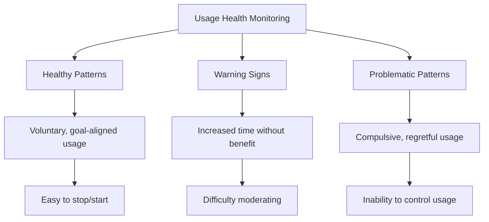

**Intervention Systems:**
- Usage awareness dashboards
- Break reminders and suggestions
- Goal-setting and tracking tools
- Professional resource connections

### Case Study: Instagram's Wellbeing Metrics

Instagram implemented comprehensive wellbeing measurement:

**Psychological Health Metrics:**

**Time Well Spent Index:**
- **Components:** Meaningful interactions, positive emotions, goal achievement
- **Measurement:** Interaction quality + sentiment + outcome tracking
- **Target:** 70% "time well spent" rating
- **Implementation:** Feed algorithm optimization, feature design

**Social Connection Quality:**
- **Components:** Authentic relationships, positive interactions, support
- **Measurement:** Interaction depth + sentiment + relationship strength
- **Target:** Increase meaningful connections
- **Implementation:** Close friends features, story interactions

**Self-Esteem Protection:**
- **Components:** Social comparison impact, body image, self-worth
- **Measurement:** Usage correlation + mental health surveys
- **Warning Signs:** Excessive comparison, negative mood correlation
- **Implementation:** Algorithm adjustment, supportive features

**Digital Wellness Tools:**
- **Your Activity:** Time tracking and awareness
- **Break Reminders:** Gentle usage moderation
- **Mute/Restrict:** Boundary and control tools
- **Crisis Resources:** Mental health support integration

**Results:**
- Reduced problematic usage patterns
- Improved user wellbeing scores
- Maintained healthy engagement levels
- Industry leadership in digital wellness

## Section 5: ROI of Psychological Design

### Calculating Psychology ROI

Measuring the business impact of psychological design investments:

**Psychology ROI Framework:**

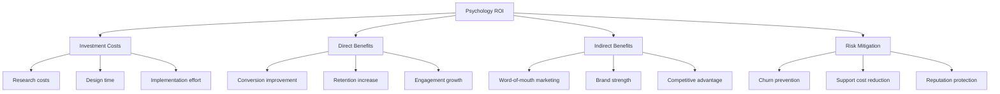

### Business Impact Metrics

**Financial Impact Categories:**

| Impact Category | Measurement | Typical ROI Range | Example |
|----------------|-------------|------------------|---------|
| **Conversion Rate** | Psychology vs control groups | 15-40% improvement | Trust signals, social proof |
| **User Retention** | Cohort retention comparison | 20-60% improvement | Habit formation, engagement |
| **Customer Lifetime Value** | LTV increase from psychology features | 25-75% improvement | Personalization, loyalty programs |
| **Viral Coefficient** | Referral rate improvements | 30-100% improvement | Social psychology, sharing features |
| **Support Cost Reduction** | Ticket volume and resolution time | 20-50% reduction | Cognitive load reduction, clarity |

### Advanced ROI Calculation

**The Psychology Value Stack:**

**Tier 1: Direct Revenue Impact**
- Conversion rate improvements
- Retention rate increases
- Upsell and expansion revenue
- Reduced churn costs

**Tier 2: Operational Efficiency**
- Support cost reduction
- Development efficiency gains
- Marketing effectiveness improvement
- Sales cycle acceleration

**Tier 3: Strategic Value**
- Brand differentiation
- Competitive moat creation
- Market position strengthening
- Innovation capability building

**Tier 4: Risk Mitigation**
- Reputation protection
- User trust maintenance
- Regulatory compliance
- Crisis prevention

### ROI Measurement Framework

**The RETURN Framework:**

| Element | Measurement | Time Frame | Value Type |
|---------|-------------|------------|------------|
| **R**evenue | Direct revenue increase | Immediate-6 months | Quantitative |
| **E**fficiency | Cost reduction, time savings | 3-12 months | Quantitative |
| **T**rust | Brand strength, reputation | 6-24 months | Qualitative/Quantitative |
| **U**ser Value | Satisfaction, loyalty increase | 3-18 months | Mixed |
| **R**isk | Problem prevention, mitigation | Ongoing | Risk-adjusted |
| **N**etwork | Viral effects, word-of-mouth | 6-24 months | Multiplier effect |

### Case Study: Duolingo's Psychology ROI

Duolingo's psychological design investments delivered measurable ROI:

**Investment Areas:**
- **Gamification Psychology:** $2M development cost
- **Habit Formation Research:** $500K research investment  
- **Personalization Engine:** $3M technology investment
- **Social Psychology Features:** $1M development cost
- **Total Investment:** $6.5M

**Direct Returns (Year 1):**
- **Retention Improvement:** 35% increase → $15M additional revenue
- **Engagement Increase:** 40% more daily usage → $8M advertising revenue
- **Conversion Rate:** 25% improvement → $5M subscription revenue
- **Viral Growth:** 60% increase in referrals → $12M acquisition savings

**Indirect Returns (Years 1-3):**
- **Brand Strength:** Market leadership position → $50M+ value
- **Competitive Moat:** Habit-based switching costs → Sustainable advantage
- **Data Network Effects:** Learning optimization → Continuous improvement
- **Category Leadership:** Thought leadership → Premium positioning

**Total ROI Calculation:**
- **Direct ROI:** ($40M - $6.5M) / $6.5M = 515% ROI
- **Strategic Value:** $50M+ in brand and competitive value
- **Compound Returns:** Ongoing benefits from psychological advantages

**Long-term Impact:**
- Became world's #1 language learning app
- 500+ million registered users
- $6.5 billion valuation
- Industry-defining psychological design

## Implementation Dashboard

### Psychology Metrics Dashboard Design

**Executive Dashboard:**
- Overall psychological health score
- User wellbeing trends
- Psychology ROI summary
- Competitive psychology advantages

**Product Team Dashboard:**
- Feature psychological impact
- User journey psychology health
- Cognitive load indicators
- Emotional state tracking

**Research Team Dashboard:**
- Psychological research pipeline
- Insight application tracking
- Hypothesis testing results
- Long-term psychological trends

### Psychological Health Monitoring System

**Real-time Monitoring:**
- Emotional state indicators
- Cognitive load alerts
- Engagement health metrics
- Usage pattern anomalies

**Weekly Reviews:**
- Psychological KPI trends
- User journey health assessment
- Feature impact analysis
- Research insight integration

**Monthly Deep Dives:**
- Longitudinal psychological development
- Cohort psychology analysis
- Competitive psychology benchmarks
- ROI assessment and optimization

## Tools and Technologies

### Psychology Measurement Technology Stack

**Data Collection:**
- **Behavioral Analytics:** Mixpanel, Amplitude, Heap
- **Emotional Analytics:** Affectiva, Microsoft Emotion API
- **Survey Platforms:** Typeform, Qualtrics, SurveyMonkey
- **User Feedback:** Hotjar, FullStory, UserVoice

**Analysis and Visualization:**
- **Statistical Analysis:** R, Python, SPSS
- **Dashboard Creation:** Tableau, Looker, Power BI  
- **Journey Mapping:** UXPressia, Smaply, Journey Map
- **Cohort Analysis:** Amplitude, Mixpanel, Custom tools

**Specialized Psychology Tools:**
- **Wellbeing Assessment:** Custom surveys, validated scales
- **Flow State Detection:** Behavioral pattern analysis
- **Habit Tracking:** Usage pattern algorithms
- **Emotion Recognition:** Sentiment analysis, biometrics

## Action Items and Implementation

### Phase 1: Foundation (Months 1-3)
**Objectives:**
- Establish baseline psychological measurements
- Implement core psychological KPIs
- Create basic psychology dashboard

**Key Actions:**
1. Define key psychological metrics for your product
2. Implement measurement infrastructure
3. Create psychological health baseline
4. Launch basic psychology dashboard

**Success Metrics:**
- Psychological KPI system operational
- Baseline measurements established
- Team trained on psychology metrics

### Phase 2: Optimization (Months 4-9)
**Objectives:**
- Optimize based on psychological insights
- Implement advanced measurement systems
- Calculate psychology ROI

**Key Actions:**
1. Analyze psychological measurement data
2. Implement psychology-driven optimizations
3. Launch advanced measurement systems
4. Calculate initial psychology ROI

**Success Metrics:**
- 20% improvement in key psychological KPIs
- Psychology ROI calculations complete
- Advanced measurement systems operational

### Phase 3: Mastery (Months 10-18)
**Objectives:**
- Achieve industry-leading psychological measurement
- Build predictive psychology capabilities
- Demonstrate clear psychology competitive advantage

**Key Actions:**
1. Build predictive psychology models
2. Achieve measurement industry leadership
3. Share psychology measurement innovations
4. Expand psychology measurement to new areas

**Success Metrics:**
- Industry-leading psychological health scores
- Predictive psychology models operational
- Clear competitive advantages from psychology

## Key Takeaways

1. **Psychological metrics predict business outcomes better than traditional metrics** - they measure the 'why' behind user behavior

2. **Multiple measurement methods are required** - psychology is complex and requires quantitative, qualitative, and behavioral approaches

3. **Long-term psychological health matters more than short-term engagement** - sustainable success requires user flourishing

4. **Psychology ROI is measurable and often substantial** - psychological design investments typically deliver high returns

5. **Behavioral cohorts reveal hidden user psychology** - segmenting by psychological patterns enables better personalization

6. **Journey mapping must include psychological states** - understanding thoughts and emotions throughout the user journey

7. **Measurement systems must evolve continuously** - psychology understanding deepens over time requiring measurement sophistication

The companies that master psychological measurement will have unprecedented insights into user behavior, enabling them to build products that not only succeed in the market but also contribute positively to human wellbeing and flourishing.

---

*Next: Conclusion - The Future of SaaS Psychology*

*Previous: Chapter 27 - Psychological Research Methods*
