# Chapter 5: Habit Formation and User Retention

> *"We are what we repeatedly do. Excellence, then, is not an act, but a habit."* - Aristotle

## Table of Contents
- [Introduction: The Neuroscience of Stickiness](#introduction-the-neuroscience-of-stickiness)
- [The Psychology of Habit Formation](#the-psychology-of-habit-formation)
- [The Hook Model in SaaS Context](#the-hook-model-in-saas-context)
- [Building Habit-Forming Triggers](#building-habit-forming-triggers)
- [Creating Compelling Actions](#creating-compelling-actions)
- [Variable Reward Psychology](#variable-reward-psychology)
- [Investment and Commitment Escalation](#investment-and-commitment-escalation)
- [The Habit Loop in SaaS Workflows](#the-habit-loop-in-saas-workflows)
- [Measuring Habit Formation](#measuring-habit-formation)
- [Breaking Bad Habits, Building Good Ones](#breaking-bad-habits-building-good-ones)
- [Retention Psychology](#retention-psychology)
- [Case Studies: Habit-Forming SaaS](#case-studies-habit-forming-saas)
- [Implementation Framework](#implementation-framework)
- [Conclusion: The Habit Advantage](#conclusion-the-habit-advantage)

---

## Introduction: The Neuroscience of Stickiness

The most successful SaaS products aren't just useful—they're habitual. They become so deeply embedded in users' workflows that switching becomes unthinkable. This isn't accidental; it's the result of understanding and applying the psychology of habit formation.

Habits are powerful because they operate below conscious awareness. When users develop habits around your product, they use it automatically, without deliberation or comparison shopping. This creates the ultimate competitive moat: psychological switching costs.

### The Habit Economy in SaaS

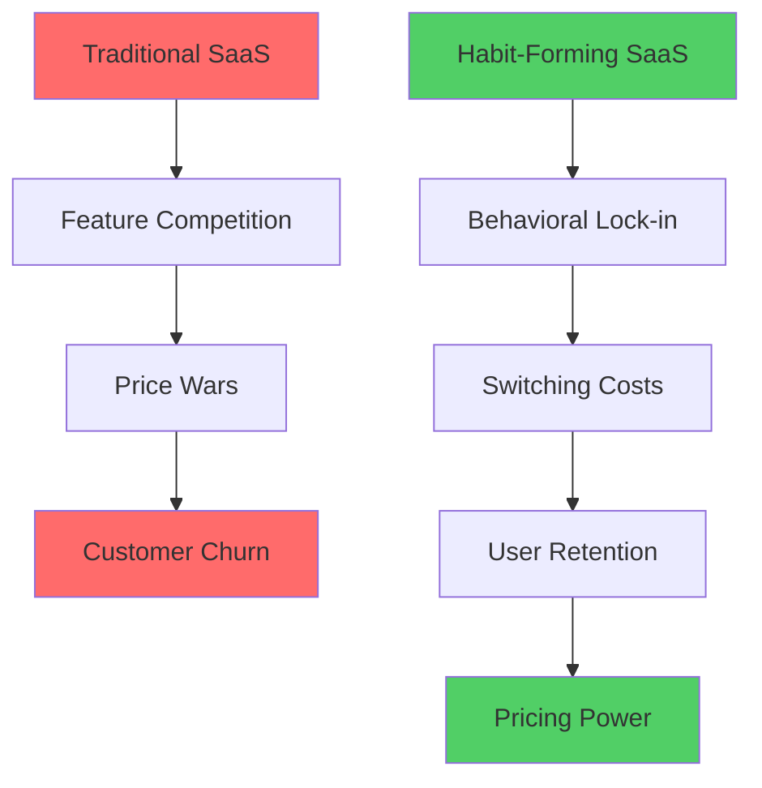

### The Business Impact of Habits

| Metric | Non-Habit Forming SaaS | Habit-Forming SaaS | Difference |
|--------|------------------------|-------------------|------------|
| **Monthly Churn Rate** | 8-12% | 2-4% | 67% lower |
| **Customer LTV** | $2,400 | $8,900 | 271% higher |
| **Price Sensitivity** | High | Low | 89% less elastic |
| **Feature Adoption** | 23% | 67% | 191% higher |
| **Organic Growth** | 12% | 45% | 275% higher |
| **Support Tickets** | High | Low | 56% reduction |

### The Neuroscience of SaaS Habits

#### Brain Changes from Repeated Use
When users repeatedly engage with your SaaS product, their brains physically change:

**Neuroplasticity in Action:**
- Synaptic connections strengthen between trigger and action
- Basal ganglia automate behavioral sequences
- Prefrontal cortex involvement decreases (less conscious thought)
- Dopamine pathways become more efficient

---

## The Psychology of Habit Formation

### The Neurological Habit Loop

#### Charles Duhigg's Habit Loop
The fundamental structure of all habits:

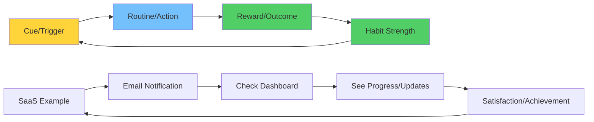

### The Science of Automaticity

#### From Conscious to Unconscious
How SaaS behaviors become automatic:

**Stage 1: Conscious Competence** (Weeks 1-2)
- Users consciously think about using your product
- High cognitive load
- Deliberate decision-making
- Easy to abandon

**Stage 2: Developing Automaticity** (Weeks 3-8)
- Some actions become semi-automatic
- Reduced cognitive load
- Contextual triggers emerge
- Growing investment

**Stage 3: Habit Formation** (Weeks 9-12)
- Actions become largely automatic
- Minimal conscious thought required
- Strong contextual associations
- High switching costs

**Stage 4: Deep Integration** (Months 4+)
- Product becomes part of identity
- Unconscious usage patterns
- Extreme switching resistance
- Advocacy behaviors

### Factors Influencing Habit Formation Speed

#### The Habit Formation Equation
**Habit Strength = Frequency × Consistency × Reward × Context Stability**

| Factor | Impact on Formation Speed | SaaS Optimization |
|--------|-------------------------|-------------------|
| **Frequency** | Daily use = 3x faster | Create daily value |
| **Consistency** | Same time/context = 2x faster | Contextual triggers |
| **Reward** | Clear value = 4x faster | Immediate feedback |
| **Context** | Stable environment = 2x faster | Integrate into workflows |

---

## The Hook Model in SaaS Context

### Nir Eyal's Hook Framework

#### The Four Phases of the Hook
Applied specifically to SaaS products:

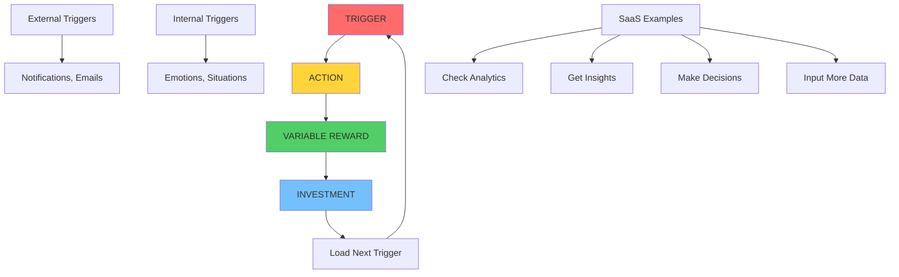

### SaaS-Specific Hook Examples

#### Different Product Categories, Different Hooks

| SaaS Category | Trigger | Action | Variable Reward | Investment |
|---------------|---------|--------|----------------|------------|
| **Analytics** | Daily summary email | Check dashboard | Surprising insights | Tag important metrics |
| **Project Management** | Task deadline | Update status | Team appreciation | Add project details |
| **CRM** | Lead notification | Follow up | Deal progression | Input contact info |
| **Communication** | Message alert | Read/respond | Social connection | Build conversation history |

### Internal vs. External Triggers

#### Transitioning from External to Internal

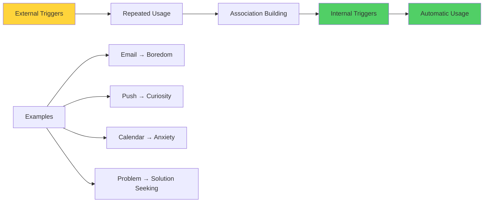

#### Common Internal Triggers in SaaS

| Emotion/State | Trigger Context | SaaS Response | Example Products |
|---------------|----------------|---------------|------------------|
| **Boredom** | Seeking stimulation | Interesting content/updates | LinkedIn, Twitter |
| **Anxiety** | Need for control | Status dashboards | Project tools, Analytics |
| **FOMO** | Fear of missing out | Real-time notifications | Slack, Discord |
| **Curiosity** | Desire to learn | New insights/data | Tableau, Google Analytics |
| **Achievement** | Progress motivation | Goal tracking | Asana, Todoist |

---

## Building Habit-Forming Triggers

### External Trigger Design

#### The Evolution of Trigger Sophistication
From simple notifications to intelligent prompts:

**Level 1: Basic Notifications**
- Generic push notifications
- Email reminders
- Calendar alerts

**Level 2: Contextual Triggers**
- Time-based prompts
- Location-aware notifications
- Activity-triggered alerts

**Level 3: Intelligent Triggers**
- Behavioral pattern recognition
- Predictive prompting
- Personalized timing

**Level 4: Ambient Triggers**
- Environmental integration
- Subtle contextual cues
- Unconscious prompting

### Trigger Timing Optimization

#### The Psychology of Optimal Timing

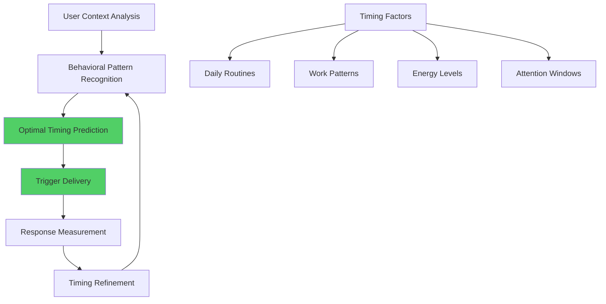

#### Data-Driven Trigger Optimization

| Trigger Type | Optimal Timing Research | SaaS Application |
|--------------|------------------------|------------------|
| **Email Summaries** | Tuesday-Thursday, 10-11 AM | Weekly reports, progress updates |
| **Push Notifications** | During natural breaks | Task reminders, social updates |
| **In-App Prompts** | After successful actions | Feature discovery, upgrade prompts |
| **Mobile Alerts** | Based on usage patterns | Context-specific notifications |

### Creating Compelling Trigger Content

#### The SCARF Model for Trigger Design
Triggers that address fundamental human needs:

**S** - **Status:** "You're ahead of 67% of users"
**C** - **Certainty:** "Your backup completed successfully"
**A** - **Autonomy:** "Ready to customize your dashboard?"
**R** - **Relatedness:** "Your team updated the project"
**F** - **Fairness:** "New features available to all users"

---

## Creating Compelling Actions

### The Psychology of Effortless Action

#### Fogg's Behavior Model in SaaS
**Behavior = Motivation × Ability × Trigger**

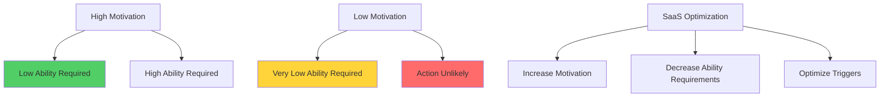

### Reducing Friction in Key Actions

#### The Action-Friction Matrix

| Action Importance | Current Friction | Optimization Priority | Techniques |
|------------------|------------------|----------------------|------------|
| **Core Value Action** | High | Critical | One-click access, shortcuts |
| **Core Value Action** | Low | Maintain | Monitor for degradation |
| **Secondary Action** | High | Important | Progressive disclosure |
| **Secondary Action** | Low | Optional | Consider consolidation |

### Progressive Action Complexity

#### The Skill-Building Ladder
Moving users from simple to complex actions:

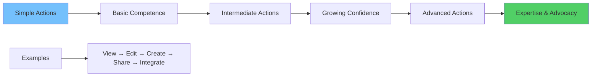

#### Action Complexity Progression

| Stage | Action Type | User Capability | Product Response |
|-------|-------------|----------------|------------------|
| **Beginner** | Simple, single-step | Learning basics | Clear instructions, immediate feedback |
| **Intermediate** | Multi-step workflows | Building confidence | Guidance with freedom |
| **Advanced** | Complex integrations | Seeking efficiency | Shortcuts, customization |
| **Expert** | Custom solutions | Teaching others | Advanced tools, collaboration |

---

## Variable Reward Psychology

### The Neuroscience of Variable Rewards

#### Dopamine and Unpredictability
Why variable rewards are more addictive than consistent ones:

**Fixed Reward Pattern:**
- Dopamine spikes during initial experiences
- Tolerance develops over time
- Motivation decreases
- Habit formation slows

**Variable Reward Pattern:**
- Dopamine anticipation increases
- Tolerance develops more slowly
- Motivation remains high
- Strong habit formation

### Types of Variable Rewards in SaaS

#### The Three Reward Categories

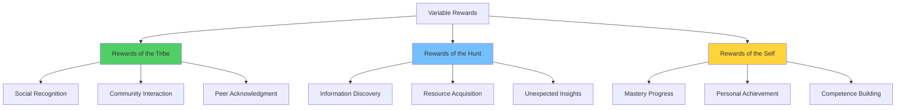

#### SaaS Variable Reward Examples

| Reward Type | SaaS Implementation | Psychological Trigger | Frequency |
|-------------|--------------------|--------------------|-----------|
| **Social** | Comments, likes, shares | Tribal acceptance | High variability |
| **Material** | Feature unlocks, upgrades | Resource acquisition | Medium variability |
| **Achievement** | Badges, levels, progress | Competence building | Low variability |
| **Discovery** | Insights, recommendations | Curiosity satisfaction | High variability |

### Designing Effective Variable Rewards

#### The Variability Sweet Spot
Too little variability = boring
Too much variability = confusing

**Optimal Variability Ratios:**
- **High-Value Rewards:** 1 in 3-5 attempts
- **Medium-Value Rewards:** 1 in 2-3 attempts  
- **Low-Value Rewards:** 2 in 3 attempts
- **Surprise Rewards:** 1 in 10-20 attempts

### Ethical Considerations in Variable Rewards

#### Addiction vs. Engagement
Designing rewards that enhance rather than exploit:

| Healthy Engagement | Problematic Addiction |
|-------------------|----------------------|
| Improves user outcomes | Consumes user time |
| Builds real skills | Creates dependency |
| Adds genuine value | Extracts attention |
| Enhances productivity | Reduces well-being |
| User maintains control | Product controls user |

---

## Investment and Commitment Escalation

### The Psychology of Investment

#### Why Investment Creates Commitment
The more users invest in your product, the more committed they become:

**Psychological Mechanisms:**
- **Cognitive Dissonance:** Investment must be justified
- **Sunk Cost Fallacy:** Past investment influences future decisions
- **Endowment Effect:** Owned things feel more valuable
- **Identity Fusion:** Product becomes part of self-concept

### Types of User Investment

#### The Investment Hierarchy

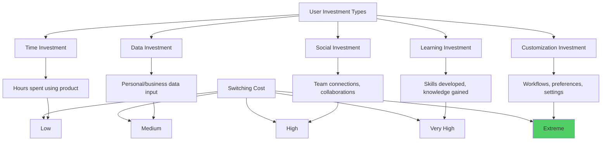

### Investment Ladders in SaaS

#### Progressive Investment Strategies

| Investment Stage | User Action | Psychological Commitment | Switching Difficulty |
|-----------------|-------------|------------------------|-------------------|
| **Initial** | Account creation | Minimal | Very easy |
| **Basic** | Profile completion | Low | Easy |
| **Functional** | Data import | Medium | Moderate |
| **Social** | Team invitation | High | Difficult |
| **Workflow** | Process integration | Very High | Very difficult |
| **Identity** | Public advocacy | Extreme | Nearly impossible |

#### Data Investment Strategies

**The Data Flywheel:**
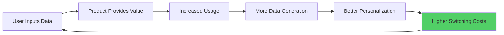

### Social Investment Mechanisms

#### Building Network Effects Through Investment
Users become more valuable to each other:

**Network Investment Types:**
- **Direct Connections:** Inviting team members
- **Content Creation:** Shared documents, templates
- **Collaboration History:** Project archives, conversations
- **Reputation Building:** Reviews, ratings, expertise scores

---

## The Habit Loop in SaaS Workflows

### Integrating Habits into Work Flows

#### The Daily Workflow Integration
Making your SaaS product essential to daily routines:

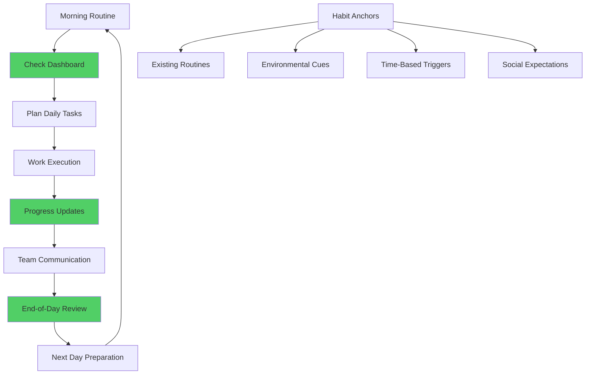

### Context-Dependent Habit Formation

#### Environmental Triggers in SaaS
Habits are strongest when tied to consistent contexts:

| Context Type | SaaS Integration | Habit Formation Speed |
|--------------|------------------|---------------------|
| **Location** | Office dashboard, mobile app | Fast (2-4 weeks) |
| **Time** | Daily reports, scheduled reviews | Medium (4-8 weeks) |
| **Social** | Team meetings, collaboration | Fast (3-6 weeks) |
| **Emotional** | Stress triggers, celebration moments | Variable (1-12 weeks) |

### Breaking Competing Habits

#### Displacement Strategy
Replacing old tools with new habits:

**The Habit Replacement Process:**
1. **Identify** competing habits and tools
2. **Map** triggers and rewards of old habits  
3. **Design** superior alternatives in your product
4. **Gradually** shift usage patterns
5. **Reinforce** new habits until automatic

---

## Measuring Habit Formation

### Habit Strength Metrics

#### Quantitative Habit Indicators

| Metric | Description | Calculation | Target |
|--------|-------------|-------------|--------|
| **Usage Frequency** | How often users engage | Sessions per week | Daily usage |
| **Session Consistency** | Regularity of usage | Standard deviation of session timing | Low variance |
| **Trigger Response Rate** | Response to prompts | Actions / Triggers sent | >60% |
| **Automaticity Index** | Unconscious usage | Time from trigger to action | <5 seconds |
| **Context Dependency** | Usage in specific contexts | Same-context usage rate | >80% |

### The Habit Scoring Framework

#### Composite Habit Strength Score
Combining multiple indicators:

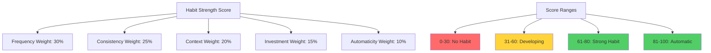

### Cohort Analysis for Habit Formation

#### Tracking Habit Development Over Time

| Week | Usage Rate | Habit Indicators | Retention Risk |
|------|------------|------------------|----------------|
| **Week 1** | 95% | Novelty-driven | Very High |
| **Week 2** | 78% | Conscious effort | High |
| **Week 3** | 65% | Pattern emergence | Medium |
| **Week 4** | 72% | Routine building | Medium |
| **Week 8** | 85% | Semi-automatic | Low |
| **Week 12** | 92% | Strong habit | Very Low |

### Leading vs. Lagging Indicators

#### Predicting Habit Formation Early

| Indicator Type | Metric | Timeline | Predictive Power |
|----------------|--------|----------|------------------|
| **Leading** | Onboarding completion | Week 1 | 73% accuracy |
| **Leading** | Social connections | Week 2 | 81% accuracy |
| **Leading** | Data input volume | Week 3 | 86% accuracy |
| **Lagging** | Consistent usage | Week 8+ | 95% accuracy |
| **Lagging** | Feature adoption | Week 12+ | 97% accuracy |

---

## Breaking Bad Habits, Building Good Ones

### Habit Change Psychology

#### The Challenge of Habit Replacement
Users often have existing habits that compete with your product:

**Common Competing Habits:**
- Email for project management
- Spreadsheets for data analysis
- Phone calls for team communication
- Manual processes for workflows

### The Habit Substitution Framework

#### WRAP Model for Habit Change
**W** - **Watch** for habit triggers
**R** - **Replace** with new routines
**A** - **Adjust** based on feedback
**P** - **Practice** until automatic

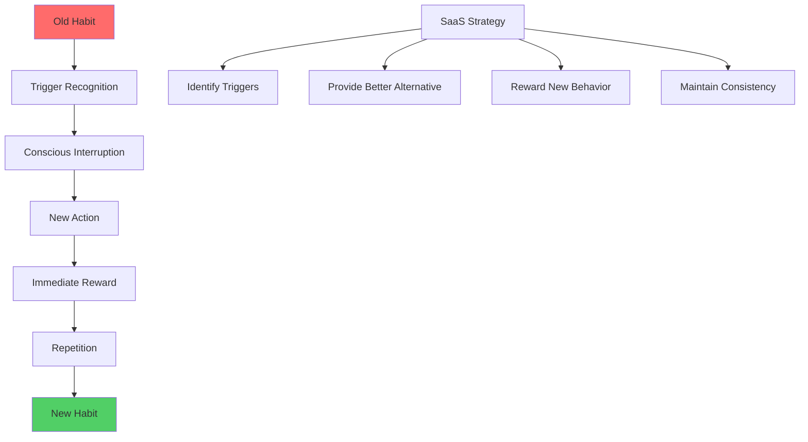

### Overcoming Habit Formation Barriers

#### Common Obstacles and Solutions

| Barrier | User Impact | SaaS Solution | Success Rate |
|---------|-------------|---------------|-------------|
| **Forgetting** | Inconsistent usage | Smart reminders | +145% |
| **Complexity** | Cognitive overload | Progressive disclosure | +89% |
| **No immediate reward** | Motivation loss | Instant feedback | +167% |
| **Social pressure** | Old team habits | Group adoption tools | +234% |
| **Environmental cues** | Context dependency | Multi-platform presence | +78% |

---

## Retention Psychology

### The Relationship Between Habits and Retention

#### Habit Formation Timeline vs. Churn Risk

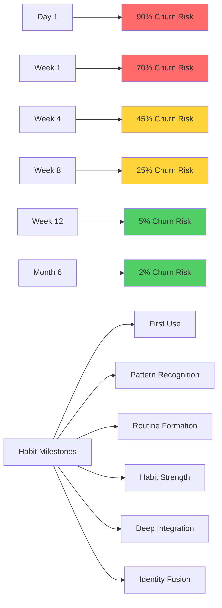

### Long-term Engagement Strategies

#### Beyond Initial Habit Formation
Maintaining engagement after habits form:

**The Engagement Evolution:**
1. **Novelty Phase** (Weeks 1-2): New user excitement
2. **Habit Formation** (Weeks 3-12): Routine building
3. **Mastery Pursuit** (Months 3-12): Skill development
4. **Optimization Focus** (Year 1+): Efficiency seeking
5. **Innovation Adoption** (Year 2+): Advanced feature exploration

#### Preventing Habit Decay

| Decay Risk Factor | Warning Signs | Prevention Strategy |
|------------------|---------------|-------------------|
| **Routine Disruption** | Usage pattern changes | Adaptive notifications |
| **Value Stagnation** | Plateau in benefits | New feature introduction |
| **Competitor Attraction** | Decreased engagement | Competitive differentiation |
| **Life Changes** | Context shifts | Cross-platform consistency |

---

## Case Studies: Habit-Forming SaaS

### Case Study 1: GitHub's Daily Developer Habits

#### Challenge
Making code management a daily habit for developers.

#### Habit Formation Strategy
**The Contribution Graph as Trigger:**
- Visual representation of daily commits
- Social pressure through public profiles
- Streak maintenance motivation
- Identity reinforcement ("active developer")

#### Implementation Details

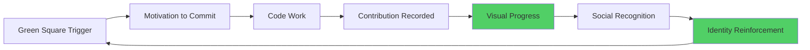

#### Habit Loop Elements
- **Trigger:** Empty day on contribution graph
- **Action:** Make a code commit
- **Variable Reward:** Progress visualization + potential social recognition
- **Investment:** Building coding streak and reputation

#### Results
- 89% of active users commit code at least weekly
- 67% maintain streaks longer than 30 days  
- 156% increase in daily active developers
- Platform became central to developer identity

### Case Study 2: Calendly's Meeting Booking Habits

#### Challenge
Replacing email back-and-forth for meeting scheduling.

#### Habit Formation Strategy
**Time-Saving Addiction:**
- Dramatic reduction in scheduling friction
- Integration with existing calendar habits
- Social pressure (professional appearance)
- Compound time savings over repeated use

#### The Habit Replacement Process

| Old Habit | New Habit | Trigger | Reward |
|-----------|-----------|---------|--------|
| Email scheduling | Share Calendly link | Meeting request | Instant scheduling |
| Calendar conflicts | Automatic availability | Schedule pressure | No double-booking |
| Manual coordination | Automatic reminders | Meeting approach | Reduced no-shows |

#### Results
- 78% of users become daily active within 2 months
- 94% retention rate after first successful booking
- Users save average 8 hours per month on scheduling
- 45% of users upgrade within 6 months

### Case Study 3: Notion's Knowledge Management Habits

#### Challenge
Creating habits around personal and team knowledge management.

#### Habit Formation Strategy
**The Everything Dashboard:**
- Single place for all information needs
- Customizable to individual workflows
- Progressive complexity as users grow
- Social sharing and collaboration

#### Multi-Level Habit Formation

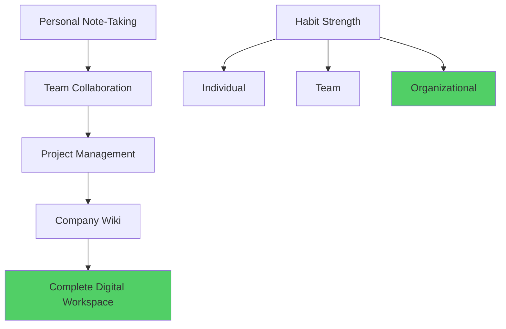

#### Investment Ladder
1. **Personal notes:** Individual data investment
2. **Template creation:** Workflow investment  
3. **Team workspaces:** Social investment
4. **Integration setup:** System investment
5. **Company knowledge base:** Organizational investment

#### Results
- 92% of teams that reach collaborative stage continue using
- Average user creates 47 pages in first 3 months
- 83% of power users say Notion is "essential" to their work
- $10 billion valuation driven by habit formation

---

## Implementation Framework

### The Habit-Forming Product Development Process

#### Phase 1: Habit Opportunity Analysis (2-3 weeks)
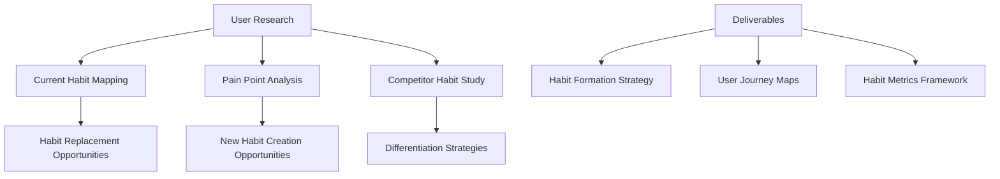

#### Phase 2: Hook Design (1-2 weeks)
**Define Your Product's Hook:**
- **Trigger Design:** External and internal trigger strategy
- **Action Optimization:** Simplify and motivate key actions
- **Variable Reward System:** Design unpredictable value delivery
- **Investment Mechanisms:** Create increasing commitment

#### Phase 3: Implementation Planning (1 week)
- Prioritize habit-forming features
- Create development roadmap
- Establish measurement systems
- Plan A/B testing framework

#### Phase 4: Build and Test (4-8 weeks)
- Develop habit-forming features
- Implement analytics and tracking
- Conduct user testing
- Iterate based on feedback

#### Phase 5: Launch and Optimize (Ongoing)
- Monitor habit formation metrics
- Optimize trigger timing and content
- Adjust reward systems
- Scale successful patterns

### Habit Formation Checklist

#### Pre-Development Analysis
- [ ] Map existing user habits and routines
- [ ] Identify habit replacement opportunities
- [ ] Analyze competitor habit-forming strategies
- [ ] Define target habit behaviors
- [ ] Establish habit formation success metrics

#### Hook Design Phase
- [ ] Design compelling external triggers
- [ ] Create pathways to internal triggers
- [ ] Optimize key actions for simplicity
- [ ] Implement variable reward systems
- [ ] Build progressive investment mechanisms

#### Testing and Measurement
- [ ] Set up habit formation analytics
- [ ] Create user cohort tracking
- [ ] Implement A/B testing for triggers
- [ ] Monitor retention correlation with habits
- [ ] Track long-term engagement patterns

#### Optimization Phase
- [ ] Analyze habit formation data
- [ ] Identify optimization opportunities
- [ ] Test improvements systematically
- [ ] Scale successful patterns
- [ ] Maintain ethical standards

---

## Ethical Considerations in Habit Formation

### The Responsibility of Habit-Forming Products

#### Designing for User Benefit
Ensuring habits serve users rather than exploit them:

**Ethical Guidelines:**
1. **Value Alignment:** Habits should improve user outcomes
2. **Transparency:** Users should understand habit formation
3. **Control:** Users should be able to modify or break habits
4. **Well-being:** Habits should enhance rather than diminish life quality
5. **Sustainability:** Long-term user benefit over short-term metrics

### Avoiding Addictive Design Patterns

#### Healthy Engagement vs. Unhealthy Addiction

| Healthy Habit | Addictive Pattern |
|---------------|------------------|
| Improves productivity | Wastes time |
| Builds skills | Creates dependency |
| Enhances well-being | Causes anxiety |
| User maintains control | Product controls user |
| Clear value delivery | Manipulation-based engagement |

### The Habit Formation Ethics Framework

#### Decision-Making Criteria

| Question | Ethical Standard | Implementation Check |
|----------|------------------|-------------------|
| **Does this habit improve user outcomes?** | Value creation | Measure user success metrics |
| **Can users easily modify the habit?** | User autonomy | Provide control mechanisms |
| **Is the habit transparent to users?** | Informed consent | Clear communication |
| **Does this respect user time and attention?** | Respect principle | Time value analysis |
| **Would I want this habit for myself/family?** | Golden rule test | Personal acceptance check |

---

## Future of Habit Formation in SaaS

### Emerging Trends

#### 1. AI-Powered Habit Personalization
- **Individual habit pattern recognition**
- **Personalized trigger optimization**
- **Predictive habit formation modeling**
- **Adaptive reward systems**

#### 2. Cross-Platform Habit Ecosystems
- **Seamless habit transfer between devices**
- **Context-aware habit activation**
- **IoT integration for environmental triggers**
- **Ambient computing habit support**

#### 3. Neurological Habit Measurement
- **Brain-computer interface integration**
- **Real-time habit strength measurement**
- **Subconscious habit optimization**
- **Neurological feedback loops**

### Preparing for Habit Futures

#### Skills for SaaS Teams
1. **Behavioral Science:** Understanding habit psychology
2. **Data Science:** Analyzing habit formation patterns
3. **Ethics:** Navigating responsible habit design
4. **Neuroscience:** Leveraging brain-based insights
5. **Systems Thinking:** Creating habit ecosystems

---

## Conclusion: The Habit Advantage

In the attention economy, habits are the ultimate competitive advantage. Products that successfully integrate into users' daily routines create psychological switching costs that transcend features and pricing. They become indispensable.

### Key Takeaways

1. **Start with User Value:** Habits must serve user interests first
2. **Design the Complete Hook:** Trigger, action, reward, and investment
3. **Measure Habit Formation:** Track behavioral patterns, not just usage
4. **Think Long-term:** Habit formation takes months, not weeks
5. **Stay Ethical:** User well-being should drive habit design decisions

### The Habit Formation Promise

> We commit to designing habits that enhance user lives, respect user autonomy, and create genuine value. We measure success not just in engagement metrics, but in user outcomes and well-being.

### Next Steps

In Chapter 6, we'll explore social psychology and network effects, examining how human social needs drive viral growth and community engagement in SaaS products. We'll see how individual habits combine with social dynamics to create powerful network effects.

---

## Resources and Further Reading

### Essential Books
- "The Power of Habit" by Charles Duhigg
- "Hooked" by Nir Eyal
- "Atomic Habits" by James Clear
- "The Upward Spiral" by Alex Korb

### Research and Studies
- MIT habit formation research
- Stanford Behavior Design Lab studies  
- Neuroplasticity and habit research
- Behavioral economics of habit formation

### Tools and Platforms
- **Analytics:** Mixpanel, Amplitude for habit tracking
- **A/B Testing:** Optimizely for trigger optimization
- **User Research:** FullStory for behavior analysis
- **Engagement:** Intercom for trigger delivery

---

*This chapter provides the psychological foundation for creating products that users can't live without. The habit formation principles presented here create sustainable competitive advantages that compound over time.*
