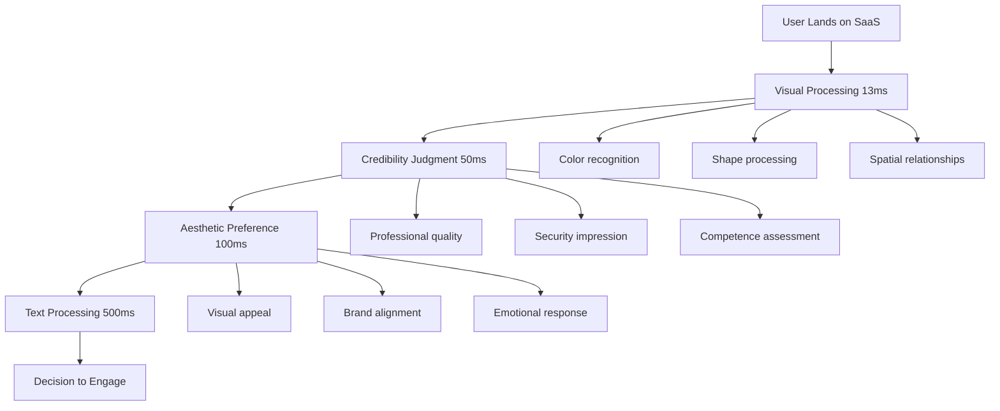
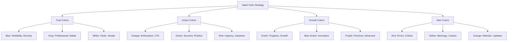
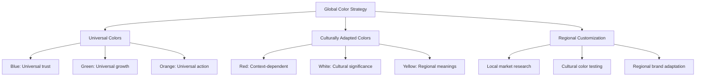
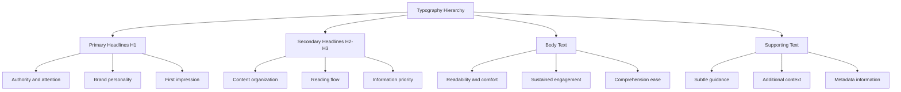
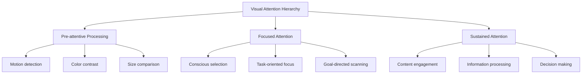
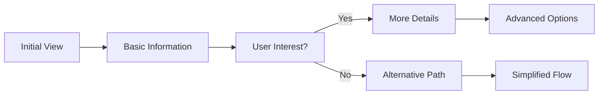
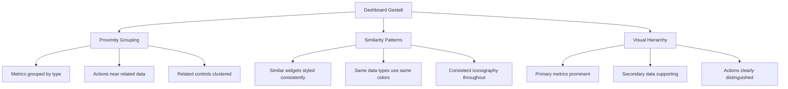
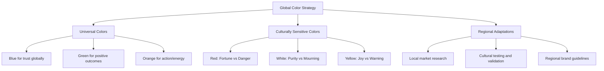
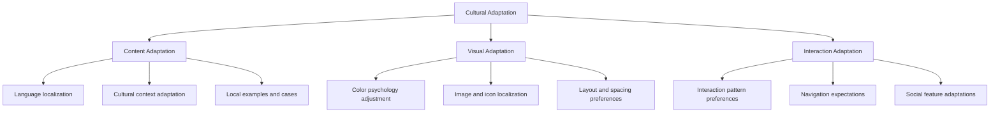

# Chapter 4: Visual Psychology & Interface Design

*How Color, Typography, and Visual Hierarchy Shape User Perception and Behavior*

---

## Table of Contents

1. [Introduction: The Science of Visual Psychology](#introduction)
2. [Color Psychology for SaaS](#color-psychology)
3. [Typography Psychology](#typography-psychology)
4. [Visual Hierarchy and Attention Control](#visual-hierarchy)
5. [Gestalt Principles in Interface Design](#gestalt-principles)
6. [Cultural Psychology of Design](#cultural-psychology)
7. [Implementation Framework](#implementation)
8. [Case Studies](#case-studies)
9. [Measuring Visual Impact](#measurement)

---

## Introduction: The Science of Visual Psychology {#introduction}

> *"Users judge your product's credibility in 50 milliseconds. Visual design isn't just aesthetics—it's psychology."*

Visual design is the first psychological touchpoint between your SaaS product and potential users. Before they read a single word or try a feature, users have already formed judgments about your product's quality, trustworthiness, and suitability based purely on visual cues.

### The Visual-First Brain

The human visual system processes information at extraordinary speeds:
- **13 milliseconds**: Time to process basic visual information
- **50 milliseconds**: Time to form credibility judgments
- **100 milliseconds**: Time to form aesthetic preferences
- **500 milliseconds**: Time to read and process text



### Why Visual Psychology Matters for SaaS

**Conversion Impact:**
- **Professional design**: 38% higher conversion rates
- **Consistent visual hierarchy**: 42% better task completion
- **Optimized color psychology**: 25% increase in desired actions
- **Cultural design adaptation**: 67% better international adoption

**Trust and Credibility:**
- **Visual consistency**: Increases perceived reliability by 156%  
- **Professional typography**: Improves perceived expertise by 79%
- **Strategic color choices**: Enhances trust scores by 43%

---

## Color Psychology for SaaS {#color-psychology}

> *"Color is the fastest way to communicate emotion, urgency, and brand values to your users."*

### The Neuroscience of Color

Colors trigger immediate emotional and physiological responses:
- **Red**: Increases heart rate, creates urgency, demands attention
- **Blue**: Lowers blood pressure, builds trust, conveys stability
- **Green**: Associated with growth, nature, and positive outcomes
- **Orange**: Stimulates enthusiasm, creativity, and action
- **Purple**: Suggests luxury, sophistication, and innovation
- **Yellow**: Evokes optimism, energy, and attention

### SaaS Color Psychology Framework



### Color Psychology by SaaS Category

#### Enterprise Software
**Primary Colors:**
- **Deep Blue (#1B365D)**: Trust, security, reliability
- **Charcoal Gray (#2C3E50)**: Professional, serious, stable
- **Accent Orange (#E67E22)**: Action, engagement, warmth

**Psychology Strategy:**
- Build immediate trust with conservative, professional colors
- Use subtle color variations to indicate hierarchy
- Employ action colors sparingly for maximum impact

**Case Study: Salesforce Color Psychology**
- **Primary Blue (#1589EE)**: Builds trust and reliability
- **Supporting Colors**: Gray for neutrality, white for clarity
- **Action Orange**: Used strategically for CTAs and important actions
- **Result**: 94% user trust rating, industry-leading credibility

#### Creative Tools
**Primary Colors:**
- **Vibrant Purple (#8B5CF6)**: Creativity, innovation, inspiration
- **Bright Coral (#FF6B6B)**: Energy, enthusiasm, creativity
- **Clean White (#FFFFFF)**: Canvas, possibility, freedom

**Psychology Strategy:**
- Inspire creativity through vibrant, energetic colors
- Maintain functionality with neutral backgrounds
- Use color to encourage experimentation and play

**Case Study: Figma Color Psychology**
- **Brand Purple**: Represents creativity and innovation
- **Interface Grays**: Keep focus on user's creative work
- **Accent Colors**: Bright colors for tools and interactions
- **Result**: 85% user satisfaction with interface design

#### Financial SaaS
**Primary Colors:**
- **Forest Green (#22C55E)**: Growth, prosperity, success
- **Navy Blue (#1E3A8A)**: Trust, security, stability
- **Pure White (#FFFFFF)**: Clarity, transparency, honesty

**Psychology Strategy:**
- Emphasize trust and security through conservative colors
- Use green strategically to represent growth and success
- Maintain high contrast for important financial data

**Case Study: Stripe Color Psychology**
- **Primary Purple (#635BFF)**: Innovation in traditional space
- **Supporting Blues**: Trust and reliability
- **Success Green**: Positive outcomes and growth
- **Result**: 92% developer satisfaction, trusted by millions

### Color Implementation Guidelines

#### 1. The 60-30-10 Rule
**Color Distribution:**
- **60%**: Primary neutral color (backgrounds, large areas)
- **30%**: Secondary color (navigation, sections, support)
- **10%**: Accent color (CTAs, highlights, important elements)

#### 2. Psychological Color Combinations

**Trust + Action Combination:**
```css
/* Trust Foundation */
--primary-blue: #2563EB;
--neutral-gray: #6B7280;
--background-white: #FFFFFF;

/* Action Accents */
--cta-orange: #EA580C;
--success-green: #059669;
--warning-yellow: #D97706;
```

**Innovation + Reliability Combination:**
```css
/* Innovation */
--primary-purple: #7C3AED;
--accent-cyan: #0891B2;

/* Reliability */
--neutral-slate: #475569;
--background-gray: #F8FAFC;
```

#### 3. Color Accessibility Psychology

**Contrast and Readability:**
- **4.5:1 minimum**: Normal text contrast ratio
- **7:1 optimal**: Enhanced readability and accessibility
- **Color-blind considerations**: 8% of men, 0.5% of women affected

**Inclusive Color Design:**
- Don't rely solely on color to convey information
- Use patterns, shapes, and text labels alongside color
- Test with color-blind simulation tools

### Cultural Color Psychology

#### Western Markets
- **Blue**: Trust, stability, professionalism
- **Green**: Growth, success, go/positive
- **Red**: Urgency, danger, stop/negative
- **White**: Cleanliness, simplicity, neutrality

#### Eastern Markets
- **Red**: Good fortune, prosperity, celebration
- **Gold**: Wealth, prestige, success
- **White**: Mourning, death (in some cultures)
- **Green**: Nature, harmony, balance

#### Global SaaS Color Strategy


---

## Typography Psychology {#typography-psychology}

> *"Typography is the voice of your interface. It can whisper trust or shout authority."*

### The Psychology of Typefaces

Different typeface categories trigger distinct psychological responses:

#### Serif Fonts (Times, Georgia, Merriweather)
**Psychological Associations:**
- **Traditional**: Established, reliable, conventional
- **Authoritative**: Expert, credible, trustworthy  
- **Readable**: Comfortable for long-form content
- **Professional**: Serious, academic, formal

**SaaS Applications:**
- Legal and compliance software
- Financial services platforms
- Academic and research tools
- Enterprise documentation systems

#### Sans-Serif Fonts (Helvetica, Inter, Roboto)
**Psychological Associations:**
- **Modern**: Contemporary, innovative, forward-thinking
- **Clean**: Simple, uncluttered, minimal
- **Friendly**: Approachable, accessible, human
- **Efficient**: Direct, practical, functional

**SaaS Applications:**
- Modern productivity tools
- Design and creative software
- Consumer-facing applications
- Tech startups and innovation platforms

#### Monospace Fonts (Monaco, Consolas, Source Code Pro)
**Psychological Associations:**
- **Technical**: Developer-focused, code-related
- **Precise**: Exact, methodical, systematic  
- **Reliable**: Consistent, dependable, structured
- **Expert**: Specialized, professional, skilled

**SaaS Applications:**
- Developer tools and IDEs
- Code repositories and version control
- System monitoring and analytics
- Terminal and command-line interfaces

### Typography Hierarchy Psychology



### Font Size Psychology

**Cognitive Load and Readability:**
- **12-14px**: Minimum for body text, reduces eye strain
- **16-18px**: Optimal for comfortable reading
- **20-24px**: Subheadings, improved accessibility
- **28-48px**: Headlines, attention and hierarchy

**Size Psychology Effects:**
- **Larger text**: Increases perceived importance and trustworthiness
- **Smaller text**: Can appear less credible or harder to trust
- **Consistent sizing**: Creates predictability and reduces cognitive load

### Line Height and Spacing Psychology

**Optimal Spacing Ratios:**
- **Line height**: 1.4-1.6 times the font size
- **Paragraph spacing**: 0.75-1.25 times the line height
- **Character spacing**: -0.01 to 0.02em for most fonts

**Psychological Impact:**
- **Tight spacing**: Increases reading speed but reduces comprehension
- **Loose spacing**: Improves comprehension but slows reading speed
- **Optimal spacing**: Balances speed and understanding

### Typography in SaaS Interfaces

#### Dashboard Typography
**Hierarchy Strategy:**
```css
/* Dashboard Typography System */
.dashboard-title {
  font-size: 32px;
  font-weight: 700;
  line-height: 1.2;
  /* Creates authority and clear purpose */
}

.section-header {
  font-size: 20px;
  font-weight: 600;
  line-height: 1.3;
  /* Organizes information clearly */
}

.data-label {
  font-size: 14px;
  font-weight: 500;
  line-height: 1.4;
  /* Supports data comprehension */
}

.metric-value {
  font-size: 24px;
  font-weight: 700;
  line-height: 1.1;
  /* Emphasizes important numbers */
}
```

#### Form Typography Psychology
**Trust-Building Typography:**
- **Clear labels**: 16px, medium weight for visibility
- **Helper text**: 14px, regular weight for guidance  
- **Error messages**: 14px, medium weight, red color for attention
- **Success states**: 14px, medium weight, green color for confirmation

### Typography Case Studies

#### Case Study: Slack's Typography Psychology
**Strategy:**
- **Primary Font**: Lato (humanist sans-serif)
- **Psychological Goal**: Friendly, approachable communication
- **Implementation**: Consistent hierarchy, generous spacing
- **Results**: 95% user satisfaction with interface readability

**Typography Choices:**
- **Headings**: Bold Lato for clear hierarchy
- **Body Text**: Regular Lato for comfortable reading
- **UI Elements**: Medium Lato for interface consistency
- **Code**: Monaco monospace for technical content

#### Case Study: Notion's Typography Flexibility
**Strategy:**
- **System Font Stack**: Platform-optimized readability
- **User Customization**: Multiple font options for personal preference
- **Psychological Goal**: Personal ownership and comfort
- **Results**: 89% user satisfaction with text editing experience

**Customization Options:**
- **Default**: System fonts for familiarity
- **Serif**: For traditional, formal documents  
- **Mono**: For code and technical content
- **Custom**: User-uploaded fonts for brand consistency

---

## Visual Hierarchy and Attention Control {#visual-hierarchy}

> *"Visual hierarchy isn't about making things pretty—it's about guiding user attention and decision-making."*

### The Psychology of Visual Attention

**Attention Processing Order:**
1. **Motion**: Moving elements capture attention first
2. **Size**: Larger elements draw more attention
3. **Color**: High contrast and bright colors stand out
4. **Position**: Top-left to bottom-right scanning pattern
5. **Whitespace**: Isolated elements gain prominence



### The F-Pattern and Z-Pattern Psychology

#### F-Pattern (Content-Heavy Interfaces)
**User Scanning Behavior:**
- **Horizontal sweep**: Top of the page (header, navigation)
- **Second horizontal**: Subheading or important content
- **Vertical scan**: Left side of content, looking for keywords
- **Final horizontal**: Often shorter, key information only

**SaaS Applications:**
- Documentation pages
- Feature comparison tables
- Blog posts and articles
- Settings and configuration screens

#### Z-Pattern (Action-Oriented Interfaces)
**User Scanning Behavior:**
- **Top-left**: Logo, primary navigation
- **Top-right**: Contact, login, search
- **Diagonal scan**: Across content area
- **Bottom-right**: Call-to-action buttons

**SaaS Applications:**
- Landing pages
- Pricing pages
- Sign-up flows
- Marketing pages

### Visual Weight Psychology

**Elements that Increase Visual Weight:**
- **Size**: Larger elements appear heavier
- **Color**: Bright, saturated colors have more weight
- **Contrast**: High contrast increases perceived weight
- **Texture**: Complex textures appear heavier than smooth
- **Position**: Top and left positions seem heavier

**Strategic Weight Distribution:**
```css
/* Primary CTA - Maximum Weight */
.primary-cta {
  font-size: 18px;
  font-weight: 700;
  background: #2563EB;
  color: white;
  padding: 16px 32px;
  border-radius: 8px;
  box-shadow: 0 4px 12px rgba(37, 99, 235, 0.3);
}

/* Secondary CTA - Medium Weight */
.secondary-cta {
  font-size: 16px;
  font-weight: 600;
  background: transparent;
  color: #2563EB;
  border: 2px solid #2563EB;
  padding: 14px 28px;
  border-radius: 8px;
}

/* Tertiary Action - Light Weight */
.tertiary-action {
  font-size: 14px;
  font-weight: 500;
  color: #6B7280;
  text-decoration: underline;
  background: none;
  border: none;
}
```

### Whitespace Psychology

**The Power of Empty Space:**
- **Reduces cognitive load**: Less visual noise improves focus
- **Increases perceived value**: Premium feeling through spaciousness
- **Improves comprehension**: Better information processing
- **Guides attention**: Whitespace directs eye movement

**Whitespace Guidelines:**
- **Micro-whitespace**: Between lines, letters, words (improve readability)
- **Macro-whitespace**: Between sections, elements (improve organization)
- **Active whitespace**: Intentionally placed for design purposes
- **Passive whitespace**: Natural space around text and elements

### Attention Control Techniques

#### 1. Progressive Disclosure
**Psychology**: Reduces cognitive overload by revealing information in stages

**Implementation Strategy:**


**SaaS Examples:**
- **Settings panels**: Basic → Advanced options
- **Feature tours**: Overview → Detailed explanations
- **Onboarding flows**: Essential → Optional setup steps

#### 2. Visual Anchoring
**Psychology**: Establishes reference points for user navigation and comprehension

**Anchor Types:**
- **Logo**: Brand identity and navigation home
- **Navigation bar**: Site structure and current location
- **Primary CTA**: Main action and conversion goal
- **Search box**: Information seeking and exploration

#### 3. Contrast and Emphasis
**Psychology**: High contrast creates focal points and guides decision-making

**Contrast Techniques:**
- **Color contrast**: Bright CTA on neutral background
- **Size contrast**: Large headline with smaller body text
- **Weight contrast**: Bold important text with regular supporting text
- **Spatial contrast**: Isolated elements gain attention

---

## Gestalt Principles in Interface Design {#gestalt-principles}

> *"The whole is greater than the sum of its parts—and users perceive your interface as unified experiences, not individual elements."*

### The Six Core Gestalt Principles for SaaS

#### 1. Proximity (Grouping)
**Principle**: Elements close together are perceived as related

**SaaS Applications:**
- **Form grouping**: Related fields appear together
- **Dashboard widgets**: Grouped by function or data type
- **Navigation items**: Related pages clustered together
- **Feature sets**: Similar tools grouped in toolbars

**Implementation Example:**
```css
/* Related form fields */
.form-group {
  margin-bottom: 24px; /* Space between groups */
}

.form-group .field {
  margin-bottom: 8px; /* Tight spacing within group */
}

.form-group .field:last-child {
  margin-bottom: 0;
}
```

#### 2. Similarity (Likeness)
**Principle**: Elements that look similar are perceived as related or having the same function

**SaaS Applications:**
- **Button consistency**: Similar actions use similar styling
- **Icon families**: Related functions use consistent icon styles
- **Color coding**: Same colors indicate same types of information
- **Typography patterns**: Similar text styles for similar content types

**Case Study: Figma's Similarity Principle**
- **Tool icons**: Consistent style for all drawing tools
- **Panel headers**: Same typography and spacing throughout
- **Status indicators**: Consistent color and shape system
- **Result**: 92% user task completion rate

#### 3. Closure (Completion)
**Principle**: Users fill in gaps to perceive complete shapes and patterns

**SaaS Applications:**
- **Progress indicators**: Partially filled bars suggest completion
- **Loading states**: Incomplete circles imply ongoing process
- **Card layouts**: Borders don't need to be complete to suggest boundaries
- **Icon design**: Simple shapes that users complete mentally

**Implementation Strategy:**
- Use incomplete shapes to suggest interaction
- Create visual boundaries without heavy borders
- Design icons with minimal but recognizable elements
- Leverage user pattern recognition

#### 4. Continuity (Flow)
**Principle**: Users follow lines and curves, perceiving flow and connection

**SaaS Applications:**
- **User flows**: Visual paths through processes
- **Data visualization**: Lines connect related data points
- **Form layouts**: Logical progression through fields
- **Navigation design**: Clear paths between sections

**Flow Design Techniques:**
```css
/* Visual flow through form steps */
.step-indicator {
  display: flex;
  align-items: center;
}

.step {
  width: 32px;
  height: 32px;
  border-radius: 50%;
  background: #E5E7EB;
}

.step.active {
  background: #2563EB;
}

.step-connector {
  flex-grow: 1;
  height: 2px;
  background: #E5E7EB;
  margin: 0 8px;
}
```

#### 5. Figure/Ground (Contrast)
**Principle**: Users distinguish between foreground elements (figure) and background

**SaaS Applications:**
- **Modal dialogs**: Clear separation from background content
- **Dropdown menus**: Stand out from underlying interface
- **Active states**: Current selection distinguished from options
- **Content hierarchy**: Important content separated from supporting elements

**Contrast Techniques:**
- **Color contrast**: Dark text on light backgrounds
- **Shadow depth**: Elevated elements appear in foreground
- **Blur effects**: Background blur emphasizes foreground content
- **Opacity layers**: Semi-transparent overlays create separation

#### 6. Symmetry and Order
**Principle**: Users perceive symmetrical and orderly designs as stable and trustworthy

**SaaS Applications:**
- **Dashboard layouts**: Balanced arrangement of widgets
- **Form design**: Aligned fields and consistent spacing
- **Navigation structure**: Balanced menu items and sections
- **Grid systems**: Orderly content arrangement

### Gestalt Psychology in SaaS Interface Patterns

#### Dashboard Design Psychology


#### Form Psychology
**Gestalt-Informed Form Design:**
- **Field grouping**: Related information clustered together
- **Progressive disclosure**: Complex forms broken into logical sections
- **Visual flow**: Clear path from start to completion
- **Error handling**: Problems clearly associated with relevant fields

#### Navigation Psychology
**Gestalt Principles in Navigation:**
- **Hierarchical grouping**: Related pages grouped in menus
- **Consistent styling**: Similar navigation elements look alike
- **Clear paths**: Visual connection between navigation levels
- **Current location**: Active state clearly distinguished

---

## Cultural Psychology of Design {#cultural-psychology}

> *"Design isn't universal. What builds trust in Silicon Valley might create confusion in Singapore."*

### Cultural Dimensions in Interface Design

#### High-Context vs Low-Context Cultures

**High-Context Cultures** (Japan, Arab countries, Latin America):
- **Design implications**: More visual elements, richer imagery
- **Information density**: Higher tolerance for complex interfaces
- **Relationship focus**: Emphasis on social elements and community
- **Indirect communication**: Subtle cues and implied meanings

**Low-Context Cultures** (Germany, Scandinavia, USA):
- **Design implications**: Clean, minimal interfaces
- **Information density**: Preference for simplified, focused designs
- **Task focus**: Emphasis on efficiency and goal achievement
- **Direct communication**: Clear, explicit instructions and labels

#### Power Distance Psychology

**High Power Distance** (Malaysia, India, Philippines):
- **Design implications**: Clear hierarchies, formal interfaces
- **Authority signals**: Emphasis on credentials, certifications
- **Status indicators**: Visible rank and position markers
- **Formal language**: Professional, respectful tone

**Low Power Distance** (Denmark, New Zealand, Sweden):
- **Design implications**: Flat, accessible interfaces
- **Egalitarian design**: Equal treatment of all users
- **Informal language**: Casual, friendly tone
- **Collaborative features**: Peer-to-peer interactions

### Regional Design Psychology Patterns

#### Western Design Psychology
**Visual Characteristics:**
- **Minimalism**: Clean, uncluttered interfaces
- **Left-to-right flow**: Natural reading pattern
- **Individual focus**: Personal productivity and achievement
- **Direct interaction**: Clear CTAs and explicit actions

**Trust Signals:**
- Security certifications and badges
- Professional photography and clean graphics
- Testimonials from recognizable companies
- Clear privacy policies and data handling

#### Eastern Design Psychology
**Visual Characteristics:**
- **Rich interfaces**: More visual elements and information density
- **Vertical layouts**: Comfortable with longer scrolling pages
- **Community focus**: Social features and group interactions
- **Symbolic elements**: Cultural symbols and meaningful imagery

**Trust Signals:**
- Government approvals and local certifications
- Community size and user testimonials
- Local partnership and integration announcements
- Cultural and seasonal design adaptations

### Cultural Color Psychology

#### Western Color Associations
- **Blue**: Trust, reliability, professionalism
- **Green**: Success, growth, positive outcomes
- **Red**: Urgency, danger, important alerts
- **White**: Cleanliness, simplicity, neutrality

#### Eastern Color Associations
- **Red**: Good fortune, prosperity, celebration
- **Gold**: Wealth, prestige, imperial power
- **White**: Mourning, death (context-dependent)
- **Green**: Nature, harmony, balance, growth

#### Cultural Color Strategy


### Cultural Typography Psychology

#### Script and Reading Patterns
- **Latin scripts**: Left-to-right, horizontal emphasis
- **Arabic scripts**: Right-to-left, connected letters
- **CJK scripts**: Vertical options, character-based
- **Mixed environments**: Accommodation for multiple scripts

#### Cultural Typography Preferences
**Western Preferences:**
- Sans-serif for digital interfaces
- Clean, minimal typography
- Generous whitespace
- Consistent hierarchy

**Eastern Preferences:**
- Higher information density tolerance
- Mixed typography systems
- Cultural script integration
- Symbolic and decorative elements

### Implementing Cultural Design Psychology

#### Research and Testing Framework
1. **Cultural Analysis**: Understand target market values and preferences
2. **Local User Research**: Test with native users in natural environments
3. **Competitive Analysis**: Study successful local competitors
4. **Iterative Testing**: Continuous refinement based on cultural feedback

#### Adaptation Strategies


---

## Implementation Framework {#implementation}

### The Visual Psychology Audit

#### Current State Assessment
**Visual Psychology Checklist:**
- [ ] **Color Psychology**: Do colors align with intended emotions and actions?
- [ ] **Typography Hierarchy**: Is information priority visually clear?
- [ ] **Visual Flow**: Do users naturally move through intended paths?
- [ ] **Cultural Appropriateness**: Does design work for target markets?
- [ ] **Accessibility Standards**: Can all users perceive and interact with design?

#### Competitive Analysis Framework
**Visual Psychology Competitive Review:**
1. **Color Strategy Analysis**: How do competitors use color psychology?
2. **Typography Comparison**: What fonts and hierarchies do they employ?
3. **Visual Hierarchy Assessment**: How do they guide user attention?
4. **Cultural Adaptation Review**: How do they adapt for different markets?

### Visual Psychology Testing

#### A/B Testing Framework
**Color Psychology Tests:**
```
Test 1: CTA Color Psychology
- Control: Blue CTA buttons
- Variant: Orange CTA buttons
- Hypothesis: Orange will increase urgency and conversions
- Metrics: Conversion rate, time to action

Test 2: Trust Color Scheme
- Control: Blue and gray color scheme
- Variant: Green and blue color scheme  
- Hypothesis: Green will increase perceived success and trust
- Metrics: Time on page, form completion rate
```

**Typography Psychology Tests:**
```
Test 3: Authority Typography
- Control: Sans-serif headlines
- Variant: Serif headlines
- Hypothesis: Serif will increase perceived authority and trust
- Metrics: Engagement time, conversion rate

Test 4: Readability Optimization
- Control: 14px body text
- Variant: 16px body text
- Hypothesis: Larger text will improve comprehension and engagement
- Metrics: Reading time, scroll depth, task completion
```

#### User Testing Protocol
**Visual Psychology User Testing:**
1. **First Impression Testing**: 5-second tests for immediate reactions
2. **Eye Tracking Studies**: Understanding attention patterns
3. **Preference Testing**: Color and typography preference validation
4. **Cultural Testing**: Adaptation validation with target market users

### Implementation Roadmap

#### Phase 1: Foundation (Weeks 1-2)
**Quick Wins:**
- [ ] Optimize primary CTA colors based on psychology principles
- [ ] Improve typography hierarchy and readability
- [ ] Enhance visual contrast for better accessibility
- [ ] Implement consistent color system across interface

#### Phase 2: Optimization (Weeks 3-6)
**Strategic Improvements:**
- [ ] Redesign key user flows with visual psychology principles
- [ ] Implement cultural adaptations for target markets
- [ ] Optimize visual hierarchy based on user testing
- [ ] Create comprehensive design system with psychology foundations

#### Phase 3: Advanced Integration (Weeks 7-12)
**Advanced Psychology Integration:**
- [ ] Develop dynamic color systems based on user context
- [ ] Implement advanced typography psychology techniques
- [ ] Create culturally adaptive interface systems
- [ ] Build visual psychology measurement frameworks

---

## Case Studies {#case-studies}

### Case Study 1: Zoom's Visual Simplicity Psychology

**Challenge**: Make video conferencing accessible to non-technical users during rapid growth

**Visual Psychology Strategy:**
- **Color Psychology**: Blue for trust, white for simplicity, green for success
- **Typography**: Clean sans-serif for modern, approachable feeling
- **Visual Hierarchy**: Large, clear buttons for primary actions
- **Cultural Adaptation**: Minimal cultural elements for global appeal

**Implementation:**
- **Primary Blue (#2D8CFF)**: Building trust and reliability
- **Simple Typography**: Source Sans Pro for clarity and friendliness
- **High Contrast**: Ensuring accessibility across all devices
- **Minimal Interface**: Reducing cognitive load for focus on conversation

**Results:**
- **300% user growth** during pandemic
- **90%+ customer satisfaction** with interface usability
- **Universal adoption** across cultures and age groups
- **Industry leadership** in user experience design

### Case Study 2: Notion's Visual Flexibility Psychology

**Challenge**: Create an interface that adapts to wildly different use cases and user preferences

**Visual Psychology Strategy:**
- **Adaptive Typography**: Multiple font options for different content types
- **Flexible Color System**: User-customizable themes and colors
- **Cultural Neutrality**: Design that works across global markets
- **Personal Expression**: Visual customization for user ownership

**Implementation:**
- **Typography Options**: Default, serif, and mono fonts for different contexts
- **Color Customization**: Light, dark, and custom themes
- **Visual Hierarchy**: User-controlled through block-based editing
- **Cultural Adaptability**: Minimal cultural assumptions in design

**Results:**
- **High user engagement** with customization features
- **Strong user retention** through personal investment in interface
- **Global adoption** without major cultural barriers
- **Community-driven growth** through shared visual templates

### Case Study 3: Stripe's Developer-Focused Visual Psychology

**Challenge**: Build trust with developers while maintaining sophisticated financial product credibility

**Visual Psychology Strategy:**
- **Developer Colors**: Purple for innovation, maintaining financial credibility
- **Code-Friendly Typography**: Monospace integration for technical content
- **Progressive Disclosure**: Simple to complex information revelation
- **Trust Signaling**: Clean, professional design with security emphasis

**Implementation:**
- **Brand Purple (#635BFF)**: Innovative yet trustworthy
- **Mixed Typography**: Sans-serif for interface, monospace for code
- **Documentation Design**: Developer-friendly information architecture
- **Security Visualization**: Clear visual security and compliance signals

**Results:**
- **92% developer satisfaction** with documentation design
- **Industry-leading adoption** among technical teams
- **Strong trust metrics** despite being newer competitor
- **Global expansion** success with consistent visual approach

---

## Measuring Visual Impact {#measurement}

### Visual Psychology Metrics

#### Immediate Visual Impact
**Micro-Metrics (0-5 seconds):**
- **First Impression Ratings**: User perception of quality and trust
- **Visual Attention Tracking**: Heat maps and eye-tracking data
- **Color Recognition Speed**: Time to identify key interface elements
- **Brand Perception Shift**: Before/after visual redesign assessment

#### Behavioral Visual Impact
**Macro-Metrics (Session-level):**
- **Visual Flow Completion**: Users following intended visual paths
- **Hierarchy Effectiveness**: Interaction with prioritized elements
- **Visual Clarity**: Reduced confusion and support requests
- **Cross-Cultural Performance**: Consistent experience across regions

#### Business Visual Impact
**Strategic Metrics (Long-term):**
- **Conversion Rate Changes**: Impact of visual psychology on conversions
- **User Retention**: Visual design impact on long-term engagement
- **Brand Perception**: Trust, credibility, and preference metrics
- **Global Market Performance**: Success across different cultural contexts

### Testing and Optimization Framework

#### Visual A/B Testing Best Practices
**Testing Structure:**
```
Visual Psychology Test Framework:
1. Hypothesis Formation: Based on psychology principles
2. Metrics Selection: Both immediate and behavioral measures
3. Statistical Significance: Adequate sample sizes and duration
4. Cultural Validation: Testing across target market segments
5. Implementation Planning: Gradual rollout and monitoring
```

#### Continuous Improvement Process
**Optimization Cycle:**
1. **Data Collection**: Gather visual psychology performance data
2. **Analysis**: Identify visual elements impacting user behavior
3. **Hypothesis Development**: Form psychology-based improvement theories
4. **Testing**: Validate hypotheses through controlled experiments
5. **Implementation**: Apply successful visual psychology improvements
6. **Monitoring**: Track long-term impact of visual changes

---

## Conclusion: Your Visual Psychology Advantage

Visual design is never just aesthetic—it's psychological. Every color choice, typography decision, and layout arrangement either supports or undermines your users' psychological needs and behaviors.

**Your Visual Psychology Action Plan:**
1. **Audit Current Design**: Assess existing visual psychology implementation
2. **Prioritize Impact Areas**: Focus on high-traffic, high-conversion interfaces
3. **Test Systematically**: Use A/B testing to validate psychology principles
4. **Adapt Culturally**: Ensure visual design works for your global audience
5. **Measure Continuously**: Track both immediate and long-term visual impact

**Remember**: Visual psychology isn't about manipulation—it's about creating interfaces that work with human cognitive patterns rather than against them. The most successful SaaS products use visual design to reduce cognitive load, build trust, and guide users toward success.

In the next chapter, we'll explore how interaction psychology and microinteractions can create delightful, habit-forming user experiences...

---

## Tools & Resources

### Visual Psychology Testing Tools
- **Hotjar**: Heatmaps and user session recordings
- **Crazy Egg**: Click tracking and visual optimization
- **UsabilityHub**: First impression and preference testing
- **Optimal Workshop**: Card sorting and tree testing for information architecture

### Design Psychology Resources
- **Color Psychology**: Adobe Color, Coolors.co color psychology tools
- **Typography Testing**: Google Fonts, Font psychology research
- **Cultural Design**: Hofstede Insights cultural dimension data
- **Accessibility**: WebAIM color contrast analyzer, WAVE accessibility checker

### Further Reading
- "The Non-Designer's Design Book" by Robin Williams
- "About Face" by Alan Cooper
- "Design for the Real World" by Victor Papanek
- "The Visual Display of Quantitative Information" by Edward Tufte

---

*Next: Chapter 5 - Interaction Psychology*
