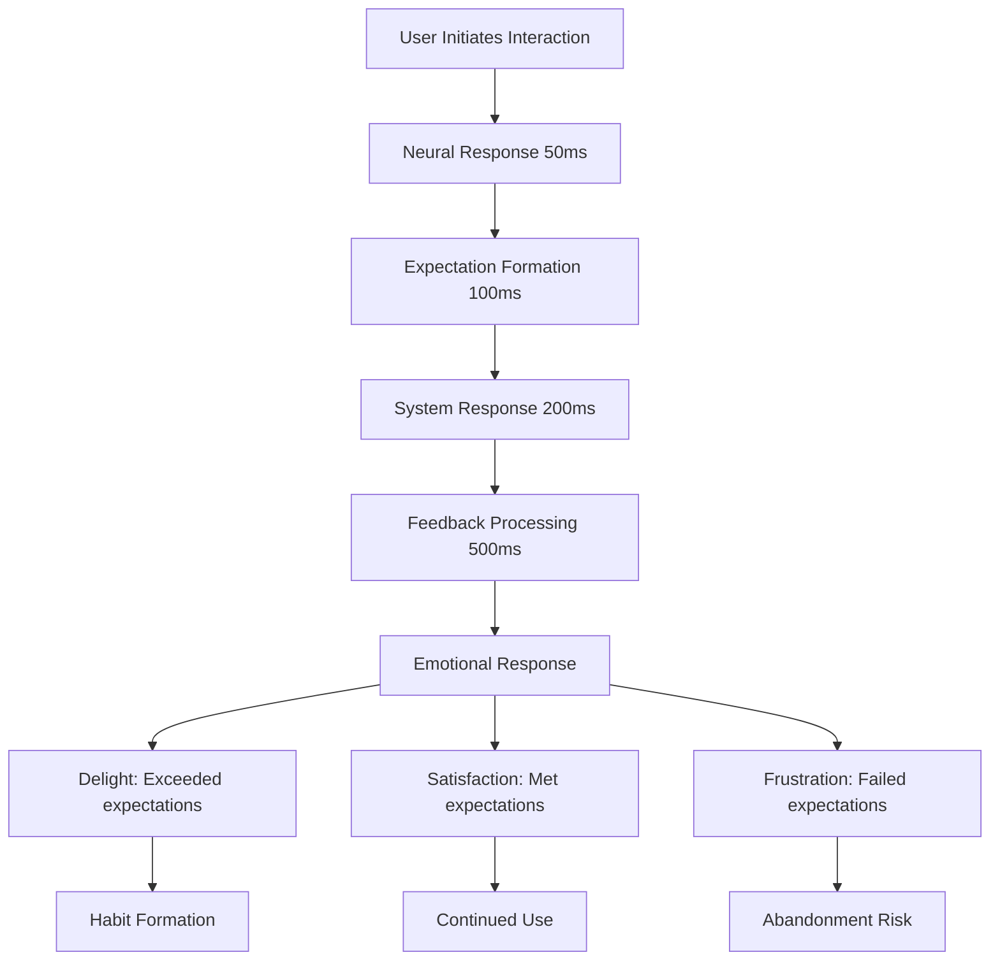
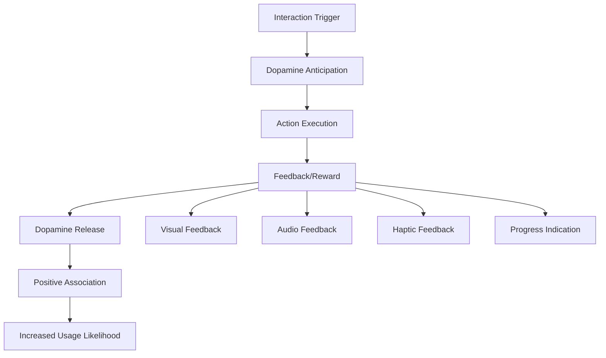
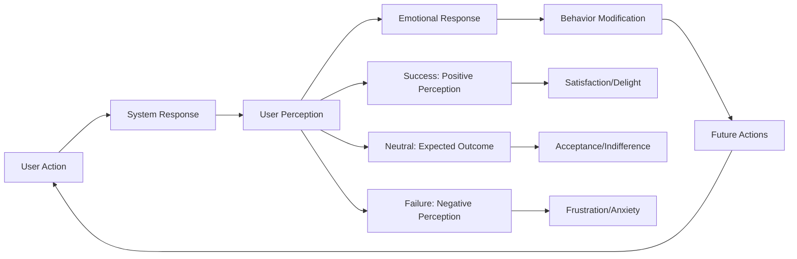
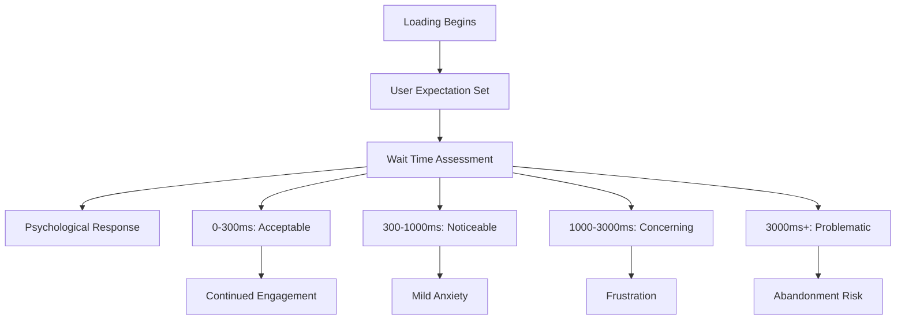
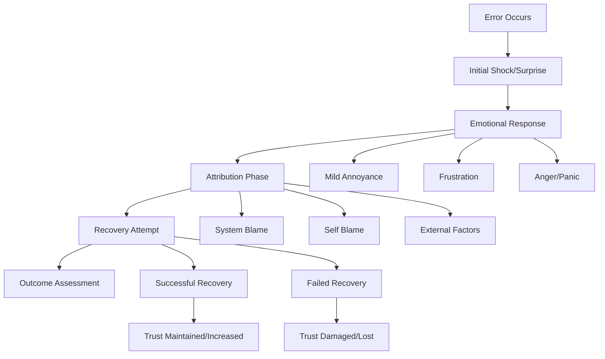

# Chapter 5: Interaction Psychology

*The Science of Microinteractions, Feedback Loops, and Behavioral Reinforcement*

---

## Table of Contents

1. [Introduction: The Psychology of Digital Touch](#introduction)
2. [Microinteractions and Dopamine Triggers](#microinteractions)
3. [Feedback Loops and Behavioral Reinforcement](#feedback-loops)
4. [The Psychology of Loading States and Wait Times](#loading-psychology)
5. [Error Psychology and Recovery Design](#error-psychology)
6. [Gesture Psychology for Touch Interfaces](#gesture-psychology)
7. [Implementation Framework](#implementation)
8. [Case Studies](#case-studies)
9. [Measuring Interaction Impact](#measurement)

---

## Introduction: The Psychology of Digital Touch {#introduction}

> *"Every click, tap, and swipe is a conversation between your user's brain and your interface. Make it feel magical, not mechanical."*

Interaction psychology is where human behavior meets digital design. It's the difference between a tool that users tolerate and one they love to use daily. While visual design creates first impressions, interaction design creates lasting relationships.

### The Neuroscience of Digital Interactions

**The Brain's Response to Digital Interactions:**
- **50-100ms**: Neural response to touch/click
- **100-200ms**: Expectation of system response
- **200-500ms**: Cognitive processing of feedback
- **500ms+**: Conscious evaluation of interaction quality



### Why Interaction Psychology Matters for SaaS

**Psychological Impact of Interactions:**
- **Trust Building**: Responsive interactions create reliability perception
- **Competence Feeling**: Smooth interactions make users feel capable
- **Control Sense**: Predictable responses enhance autonomy
- **Emotional Connection**: Delightful interactions create positive associations

**Business Impact:**
- **38% higher engagement** with well-designed microinteractions
- **47% lower support burden** through clear interaction feedback
- **23% increase in feature adoption** with proper interaction guidance
- **31% improvement in user retention** with delightful interaction patterns

---

## Microinteractions and Dopamine Triggers {#microinteractions}

> *"Microinteractions are the moments that make users smile. They turn routine tasks into tiny celebrations."*

### The Science of Microinteractions

**Definition**: Small, single-purpose interactions that accomplish one task while providing feedback about that task.

**Psychological Components:**
1. **Trigger**: What initiates the interaction
2. **Rules**: What happens during the interaction
3. **Feedback**: How the user knows what happened
4. **Loops & Modes**: What happens next or in special circumstances

### Dopamine and Digital Rewards

**The Dopamine Connection:**
- **Anticipation Phase**: Dopamine peaks before the reward
- **Variable Rewards**: Unpredictable positive outcomes increase dopamine
- **Achievement Recognition**: Completing actions triggers reward pathways
- **Progress Indicators**: Visual progress stimulates motivation systems



### Types of Psychological Microinteractions

#### 1. Achievement Microinteractions
**Psychology**: Celebrate user accomplishments to build positive associations

**Examples:**
- **Task Completion**: Checkmark animations when completing items
- **Progress Milestones**: Celebration animations at key progress points
- **Skill Development**: Badges or level-up animations for learning
- **Goal Achievement**: Special animations for reaching targets

**Implementation Example:**
```css
/* Task completion animation */
@keyframes celebrate {
  0% { transform: scale(1); }
  50% { transform: scale(1.2); background-color: #22C55E; }
  100% { transform: scale(1); }
}

.task-completed {
  animation: celebrate 0.3s ease-in-out;
}
```

#### 2. Feedback Microinteractions
**Psychology**: Provide immediate response to reduce uncertainty and anxiety

**Examples:**
- **Button States**: Visual feedback on hover, active, and disabled states
- **Form Validation**: Real-time feedback on input correctness
- **Save Confirmations**: Visual confirmation of successful saves
- **Loading Acknowledgments**: Immediate response while processing

**Feedback Timing Psychology:**
- **Immediate (0-100ms)**: System responsiveness acknowledgment
- **Quick (100-300ms)**: Processing feedback and state changes
- **Moderate (300-1000ms)**: Complex operation progress indication
- **Extended (1000ms+)**: Entertainment or distraction during long waits

#### 3. Guidance Microinteractions
**Psychology**: Reduce cognitive load by showing users what to do next

**Examples:**
- **Hover Hints**: Subtle animations revealing interactive elements
- **Progress Indicators**: Steps completed and remaining in processes
- **Call-to-Action Pulses**: Gentle animations drawing attention to key actions
- **Tutorial Highlights**: Focused animations during onboarding

#### 4. Delight Microinteractions
**Psychology**: Create positive emotional responses that build user affection

**Examples:**
- **Easter Eggs**: Hidden delightful animations for engaged users
- **Personality Moments**: Brand character expressed through interactions
- **Surprise Celebrations**: Unexpected positive feedback for routine actions
- **Humanization**: Interactions that feel personal and caring

### Microinteraction Design Principles

#### 1. Purposeful Animation
**Psychology**: Every animation should serve a psychological function

**Functional Purposes:**
- **Orientation**: Help users understand spatial relationships
- **Functional**: Communicate what just happened or will happen
- **Story**: Create narrative flow between interface states
- **Personality**: Express brand character and values

#### 2. Appropriate Timing
**Psychology**: Timing affects perceived responsiveness and delight

**Timing Guidelines:**
- **Fast interactions (100-200ms)**: State changes, hover effects
- **Medium interactions (200-500ms)**: Transitions, reveals
- **Slow interactions (500ms+)**: Complex animations, celebrations

#### 3. Natural Motion
**Psychology**: Animations should feel physically believable

**Motion Principles:**
- **Easing**: Animations start fast and slow down (ease-out)
- **Acceleration**: Mirror real-world physics
- **Anticipation**: Small movements prepare for larger ones
- **Follow-through**: Actions have natural consequences

### SaaS-Specific Microinteraction Patterns

#### Dashboard Microinteractions
**Psychology Goals:**
- **Data Confidence**: Smooth data loading builds trust
- **Status Awareness**: Clear indication of system state
- **Action Clarity**: Obvious interaction possibilities

**Pattern Examples:**
```css
/* Data loading states */
.metric-card {
  transition: all 0.2s ease-out;
}

.metric-card:hover {
  transform: translateY(-2px);
  box-shadow: 0 8px 24px rgba(0,0,0,0.1);
}

.metric-card.loading {
  opacity: 0.7;
  pointer-events: none;
}

.metric-card.loaded {
  animation: slideIn 0.3s ease-out;
}
```

#### Form Microinteractions
**Psychology Goals:**
- **Progress Confidence**: Clear advancement through complex forms
- **Error Prevention**: Immediate feedback prevents frustration
- **Success Reinforcement**: Positive feedback encourages completion

**Validation Microinteractions:**
```css
/* Real-time validation feedback */
.form-field.valid input {
  border-color: #22C55E;
  background-image: url('checkmark-icon.svg');
}

.form-field.invalid input {
  border-color: #EF4444;
  animation: shake 0.3s ease-in-out;
}

@keyframes shake {
  0%, 100% { transform: translateX(0); }
  25% { transform: translateX(-4px); }
  75% { transform: translateX(4px); }
}
```

#### Collaboration Microinteractions
**Psychology Goals:**
- **Social Presence**: Make remote collaboration feel connected
- **Turn-Taking**: Clear indication of who can act when
- **Shared Success**: Celebrate team accomplishments

**Examples:**
- **Live Cursors**: Show where team members are working
- **Typing Indicators**: Communicate active collaboration
- **Save Conflicts**: Gentle resolution of simultaneous edits
- **Team Celebrations**: Shared animations for group achievements

---

## Feedback Loops and Behavioral Reinforcement {#feedback-loops}

> *"Great software creates positive feedback loops that make users want to come back and do more."*

### The Psychology of Feedback Loops

**Definition**: Cyclical processes where user actions lead to results that influence future actions.

**Types of Feedback Loops:**
1. **Positive Loops**: Results encourage more of the same behavior
2. **Negative Loops**: Results discourage the behavior
3. **Balancing Loops**: Results maintain equilibrium



### Behavioral Reinforcement in SaaS

#### 1. Variable Ratio Reinforcement
**Psychology**: Unpredictable rewards create strongest behavioral conditioning

**SaaS Applications:**
- **Feature Discovery**: Occasional discovery of useful features
- **Data Insights**: Periodic valuable insights from analytics
- **Social Recognition**: Unpredictable positive feedback from team
- **Performance Improvements**: Variable success in optimization efforts

**Implementation Strategy:**
```javascript
// Example: Variable insight generation
const generateInsight = (userData) => {
  const insights = [
    'productivity_trend',
    'collaboration_pattern',
    'optimization_opportunity',
    'benchmark_comparison'
  ];
  
  // Variable ratio: Not every session gets insights
  if (Math.random() < 0.3) { // 30% chance
    return insights[Math.floor(Math.random() * insights.length)];
  }
  return null;
};
```

#### 2. Progress Feedback Loops
**Psychology**: Visible progress toward goals motivates continued effort

**Progress Types:**
- **Skill Development**: Learning and mastery progression
- **Goal Achievement**: Movement toward user-defined objectives
- **System Mastery**: Increasing sophistication in product usage
- **Social Status**: Growing reputation within user community

**Progress Design Patterns:**
```css
/* Progress visualization */
.progress-bar {
  background: #E5E7EB;
  border-radius: 8px;
  overflow: hidden;
  position: relative;
}

.progress-fill {
  background: linear-gradient(90deg, #3B82F6, #1D4ED8);
  height: 100%;
  transition: width 0.8s ease-out;
  position: relative;
}

.progress-fill::after {
  content: '';
  position: absolute;
  top: 0;
  right: 0;
  width: 20px;
  height: 100%;
  background: linear-gradient(90deg, transparent, rgba(255,255,255,0.3));
  animation: shimmer 2s infinite;
}
```

#### 3. Social Feedback Loops
**Psychology**: Human validation and social proof drive engagement

**Social Reinforcement Types:**
- **Peer Recognition**: Likes, comments, and shares from colleagues
- **Expert Acknowledgment**: Recognition from industry leaders
- **Community Status**: Reputation within user communities
- **Team Impact**: Visible contribution to team success

### Creating Positive Feedback Loops

#### The HOOK Model in SaaS Interactions
**Trigger → Action → Variable Reward → Investment**

1. **Trigger Design**:
   - **External**: Notifications, emails, team mentions
   - **Internal**: User needs, habits, emotions

2. **Action Optimization**:
   - **Motivation**: Clear value proposition
   - **Ability**: Simple, achievable actions
   - **Trigger**: Effective prompting

3. **Variable Reward**:
   - **Tribe**: Social validation and connection
   - **Hunt**: Information and resource discovery
   - **Self**: Personal achievement and mastery

4. **Investment Mechanics**:
   - **Data**: Information input improves future experiences
   - **Content**: User-generated content increases value
   - **Reputation**: Social capital builds over time
   - **Skill**: Learning investment increases switching costs

#### SaaS Feedback Loop Examples

**Productivity Tool Loop:**
```
User completes task → 
Progress visualization → 
Dopamine release → 
Desire to complete more → 
Increased engagement
```

**Collaboration Tool Loop:**
```
User shares insight → 
Team appreciation → 
Social validation → 
Desire to contribute more → 
Increased sharing behavior
```

**Analytics Tool Loop:**
```
User explores data → 
Discovers valuable insight → 
Business impact → 
Curiosity for more analysis → 
Deeper engagement
```

### Designing Ethical Feedback Loops

#### Positive vs. Exploitative Loops
**Positive Feedback Loops:**
- **Value Creation**: Loops that genuinely benefit users
- **Skill Development**: Encourage learning and growth
- **Goal Achievement**: Support user objectives
- **Well-being**: Promote healthy usage patterns

**Exploitative Feedback Loops:**
- **Addiction Patterns**: Create dependency without value
- **Time Waste**: Encourage unproductive usage
- **Anxiety Creation**: Generate fear of missing out
- **Manipulation**: Exploit psychological vulnerabilities

#### Ethical Design Guidelines
**Framework for Ethical Feedback Loops:**
1. **User Value**: Does the loop create genuine value for users?
2. **Autonomy**: Do users maintain control over their engagement?
3. **Transparency**: Are the mechanisms clear and honest?
4. **Well-being**: Does the loop support user mental health?
5. **Long-term**: Are the effects sustainable and positive?

---

## The Psychology of Loading States and Wait Times {#loading-psychology}

> *"Waiting is psychological torture. But the right loading experience can turn frustration into anticipation."*

### The Neuroscience of Waiting

**Brain Response to Delays:**
- **0-100ms**: Feels instantaneous, no conscious awareness
- **100-300ms**: Slight delay noticed but acceptable
- **300-1000ms**: Noticeable delay, expectation for feedback
- **1000ms+**: Significant delay, requires explanation and entertainment

**Psychological Effects of Waiting:**
- **Anxiety**: Uncertainty about system state
- **Frustration**: Blocked goal achievement
- **Abandonment**: Decision to quit and try alternatives
- **Time Distortion**: Perceived time differs from actual time



### Loading State Psychology Principles

#### 1. Perceived Performance vs. Actual Performance
**Psychology**: How fast something feels is more important than how fast it actually is

**Techniques for Improving Perceived Performance:**
- **Optimistic UI**: Show expected results immediately
- **Progressive Loading**: Load and show content in stages
- **Skeleton Screens**: Show content structure before actual content
- **Distraction**: Provide interesting content during waits

#### 2. Expectation Management
**Psychology**: Setting appropriate expectations reduces frustration

**Expectation Setting Strategies:**
- **Time Estimates**: "This will take about 30 seconds"
- **Progress Indicators**: Show completion percentage
- **Process Explanation**: Explain what's happening
- **Value Reinforcement**: Remind users why they're waiting

#### 3. Control and Agency
**Psychology**: Giving users control reduces perceived wait time

**Control Mechanisms:**
- **Cancel Options**: Allow users to abort operations
- **Pause/Resume**: Let users control timing
- **Alternative Actions**: Provide other activities during waits
- **Customization**: Let users choose loading preferences

### Loading State Design Patterns

#### 1. Skeleton Screens
**Psychology**: Familiar shapes reduce uncertainty and perceived load time

```css
/* Skeleton loading animation */
.skeleton {
  background: linear-gradient(90deg, #F3F4F6 25%, #E5E7EB 50%, #F3F4F6 75%);
  background-size: 200% 100%;
  animation: loading 1.5s infinite;
  border-radius: 4px;
}

@keyframes loading {
  0% { background-position: 200% 0; }
  100% { background-position: -200% 0; }
}

.skeleton-text {
  height: 16px;
  width: 100%;
  margin-bottom: 8px;
}

.skeleton-text:last-child {
  width: 60%;
}
```

#### 2. Progressive Loading
**Psychology**: Showing partial content reduces perceived wait time

**Progressive Loading Strategy:**
```javascript
// Progressive dashboard loading
const loadDashboard = async () => {
  // Load and show basic structure immediately
  showDashboardSkeleton();
  
  // Load critical data first
  const criticalData = await fetchCriticalData();
  renderCriticalWidgets(criticalData);
  
  // Load secondary data
  const secondaryData = await fetchSecondaryData();
  renderSecondaryWidgets(secondaryData);
  
  // Load nice-to-have data last
  const supplementaryData = await fetchSupplementaryData();
  renderSupplementaryWidgets(supplementaryData);
};
```

#### 3. Entertaining Loading States
**Psychology**: Distraction makes wait time feel shorter

**Entertainment Strategies:**
- **Branded Animations**: Reinforce brand while waiting
- **Educational Content**: Provide tips or insights
- **Progress Stories**: Narrate what's happening
- **Interactive Elements**: Simple games or activities

```css
/* Playful loading animation */
.loading-character {
  width: 60px;
  height: 60px;
  border-radius: 50%;
  background: #3B82F6;
  position: relative;
  animation: bounce 1s infinite ease-in-out;
}

.loading-character::before,
.loading-character::after {
  content: '';
  width: 60px;
  height: 60px;
  border-radius: 50%;
  background: #3B82F6;
  position: absolute;
  top: 0;
  animation: bounce 1s infinite ease-in-out;
}

.loading-character::before {
  left: -80px;
  animation-delay: -0.32s;
}

.loading-character::after {
  left: 80px;
  animation-delay: 0.32s;
}

@keyframes bounce {
  0%, 80%, 100% { transform: scale(0.8); opacity: 0.5; }
  40% { transform: scale(1); opacity: 1; }
}
```

### Context-Specific Loading Psychology

#### Dashboard Loading
**User Psychology**: Executives and managers expect immediate data access

**Loading Strategy:**
- Show historical data immediately while fetching fresh data
- Load most important metrics first
- Provide clear indication of data freshness
- Allow interaction with loaded portions

#### File Processing
**User Psychology**: Users understand complex operations take time

**Loading Strategy:**
- Provide detailed progress information
- Break process into understandable steps
- Allow background processing
- Send completion notifications

#### Search Results
**User Psychology**: Users expect near-instant search results

**Loading Strategy:**
- Show results as they're found (streaming)
- Provide search suggestions during typing
- Cache common queries for instant results
- Progressive enhancement of result quality

---

## Error Psychology and Recovery Design {#error-psychology}

> *"Errors don't just break workflows—they break trust. But handled well, error recovery can actually strengthen user relationships."*

### The Psychology of Errors

**Emotional Response to Errors:**
1. **Surprise**: Unexpected interruption of intended flow
2. **Frustration**: Blocked progress toward goals
3. **Anxiety**: Uncertainty about what went wrong and how to fix it
4. **Blame**: Attribution of fault to system or self
5. **Recovery**: Problem-solving mode and system reassessment



### Types of SaaS Errors and Their Psychology

#### 1. User Input Errors
**Psychology**: Users feel incompetent or confused

**Common Types:**
- **Validation Errors**: Incorrect format or missing information
- **Permission Errors**: Attempting unauthorized actions
- **Quota Errors**: Exceeding usage limits
- **Conflict Errors**: Simultaneous editing or resource conflicts

**Recovery Psychology:**
- **Immediate Feedback**: Prevent submission of invalid data
- **Clear Explanation**: Specify exactly what's wrong
- **Solution Guidance**: Show how to fix the problem
- **Positive Reinforcement**: Celebrate successful corrections

#### 2. System Errors
**Psychology**: Users feel helpless and question system reliability

**Common Types:**
- **Server Errors**: 500 errors, database failures
- **Network Errors**: Connection timeouts, service unavailable
- **Performance Errors**: Slow responses, timeouts
- **Integration Errors**: Third-party service failures

**Recovery Psychology:**
- **Honest Communication**: Explain what happened without jargon
- **Responsibility Taking**: Acknowledge system ownership of problem
- **Recovery Timeline**: Provide realistic fix timeframes
- **Alternative Options**: Offer workarounds when possible

#### 3. Data Errors
**Psychology**: Users fear data loss and feel vulnerable

**Common Types:**
- **Sync Errors**: Data conflicts between devices/users
- **Import Errors**: Problems with data migration
- **Export Errors**: Failures in data extraction
- **Corruption Errors**: Data integrity problems

**Recovery Psychology:**
- **Data Safety Assurance**: Confirm no data was lost
- **Recovery Options**: Provide multiple paths to resolution
- **Prevention Education**: Help users avoid future issues
- **Backup Confirmation**: Show that data is safely stored

### Error Recovery Design Principles

#### 1. Humane Error Messages
**Psychology**: Error messages should feel helpful, not accusatory

**Message Components:**
- **What Happened**: Clear, jargon-free explanation
- **Why It Happened**: Context that helps understanding
- **What to Do**: Specific, actionable next steps
- **How to Prevent**: Education for future avoidance

**Good Error Message Template:**
```
[WHAT] We couldn't save your changes
[WHY] because you've been signed out for security
[WHAT TO DO] Please sign in again to continue
[PREVENTION] We'll warn you before auto-signout in the future
```

#### 2. Progressive Error Disclosure
**Psychology**: Don't overwhelm users with technical details initially

**Disclosure Levels:**
1. **User-Friendly Summary**: Simple explanation and action
2. **Detailed Explanation**: More context for interested users
3. **Technical Details**: Full error information for debugging
4. **Support Contact**: Path to human assistance

```html
<!-- Progressive error disclosure -->
<div class="error-message">
  <div class="error-summary">
    <h3>Unable to sync your data</h3>
    <p>We're having trouble connecting to our servers.</p>
    <button class="retry-btn">Try Again</button>
  </div>
  
  <details class="error-details">
    <summary>More details</summary>
    <p>This usually happens when there's a temporary network issue...</p>
    <code class="error-code">Error Code: SYNC_TIMEOUT_001</code>
  </details>
  
  <a href="/support" class="support-link">Contact Support</a>
</div>
```

#### 3. Contextual Error Recovery
**Psychology**: Provide recovery options that match the user's context and goals

**Context-Aware Recovery:**
- **Undo Options**: Reverse actions that caused problems
- **Alternative Paths**: Different ways to achieve the same goal
- **Partial Success**: Acknowledge what worked before the error
- **Save State**: Preserve user work despite system failures

### Error Prevention Psychology

#### 1. Constraint-Based Design
**Psychology**: Prevent errors by making them impossible

**Prevention Techniques:**
- **Interface Constraints**: Disable invalid options
- **Input Validation**: Real-time feedback on data entry
- **Progressive Disclosure**: Reveal complexity gradually
- **Smart Defaults**: Choose safe, common options

#### 2. Confirmation Patterns
**Psychology**: Give users pause before destructive actions

**Confirmation Types:**
- **Simple Confirmation**: "Are you sure?"
- **Consequence Explanation**: "This will delete 50 contacts"
- **Action Verification**: "Type 'DELETE' to confirm"
- **Undo Alternative**: "Delete (you can undo this)"

#### 3. Safety Nets
**Psychology**: Reduce anxiety by providing recovery mechanisms

**Safety Net Types:**
- **Auto-Save**: Continuous background saving
- **Version History**: Access to previous states
- **Trash/Archive**: Soft deletes instead of permanent removal
- **Backup Systems**: Automatic data protection

### Error Recovery Case Studies

#### Case Study: Slack's Connection Error Psychology
**Challenge**: Handle network disconnections gracefully in real-time communication

**Psychology Strategy:**
- **Immediate Feedback**: Show connection status clearly
- **Automatic Recovery**: Reconnect without user intervention
- **Message Queuing**: Hold messages until connection restored
- **Transparent Communication**: Explain what's happening

**Implementation:**
```css
.connection-banner {
  background: #FEF3C7;
  border: 1px solid #F59E0B;
  padding: 12px;
  text-align: center;
  animation: slideDown 0.3s ease-out;
}

.connection-banner.error {
  background: #FEE2E2;
  border-color: #EF4444;
}

.connection-banner.reconnecting {
  background: #DBEAFE;
  border-color: #3B82F6;
}
```

**Results:**
- **85% fewer support tickets** related to connection issues
- **Maintained user confidence** during network problems
- **Higher retention** during infrastructure challenges

---

## Gesture Psychology for Touch Interfaces {#gesture-psychology}

> *"Touch interfaces aren't just visual—they're physical. Users have spatial, muscle memory relationships with gestures."*

### The Psychology of Touch

**Human Touch Psychology:**
- **Proprioception**: Body awareness and spatial understanding
- **Muscle Memory**: Physical patterns learned through repetition
- **Haptic Feedback**: Touch sensations that confirm actions
- **Cultural Gestures**: Learned patterns vary by culture and context

### Common Gesture Psychology Patterns

#### 1. Tap Psychology
**Meaning**: Selection, activation, confirmation
**Expectations**: Immediate response, clear target areas
**Psychology**: Most fundamental interaction, lowest cognitive load

**Design Considerations:**
- **Target Size**: Minimum 44px for comfortable tapping
- **Visual Feedback**: Clear indication of tap registration
- **Response Time**: Immediate visual acknowledgment
- **Error Tolerance**: Forgiving hit areas for accuracy

#### 2. Swipe Psychology
**Meaning**: Navigation, dismissal, progression
**Expectations**: Directional movement matches gesture direction
**Psychology**: Natural, intuitive movement patterns

**Swipe Types and Psychology:**
- **Left/Right**: Navigation between items or screens
- **Up/Down**: Scrolling, revealing hidden content
- **Diagonal**: Often unexpected, should be avoided
- **Multi-directional**: Complex but powerful for advanced users

#### 3. Drag Psychology
**Meaning**: Movement, reordering, customization
**Expectations**: Direct manipulation of objects
**Psychology**: High sense of control and ownership

**Drag Design Principles:**
```css
/* Draggable element feedback */
.draggable {
  cursor: grab;
  transition: transform 0.2s ease;
}

.draggable:active {
  cursor: grabbing;
  transform: scale(1.05);
  box-shadow: 0 8px 24px rgba(0,0,0,0.15);
  z-index: 1000;
}

.drop-zone {
  transition: background-color 0.2s ease;
}

.drop-zone.drag-over {
  background-color: #DBEAFE;
  border: 2px dashed #3B82F6;
}
```

#### 4. Pinch and Zoom Psychology
**Meaning**: Scale, detail level adjustment
**Expectations**: Content scales proportionally
**Psychology**: Direct manipulation metaphor, high control

### Mobile vs. Desktop Gesture Psychology

#### Mobile Gesture Expectations
**Psychological Patterns:**
- **Thumb-Driven**: Design for thumb reach and comfort
- **Context Switching**: Quick app-to-app movement
- **Attention Fractured**: Interrupted usage patterns
- **One-Handed Operation**: Primary interaction mode

#### Desktop Gesture Expectations  
**Psychological Patterns:**
- **Precision**: Mouse allows for exact targeting
- **Multi-Modal**: Keyboard + mouse combinations
- **Sustained Attention**: Longer, focused work sessions
- **Complex Operations**: Multi-step, detailed workflows

### Gesture Discoverability Psychology

#### 1. Affordance Design
**Psychology**: Visual cues that suggest possible actions

**Affordance Types:**
- **Explicit**: Clear buttons and controls
- **Pattern**: Common gesture indicators (swipe arrows)
- **Metaphorical**: Real-world analogs (handles, grips)
- **Cultural**: Learned interface conventions

#### 2. Progressive Gesture Introduction
**Psychology**: Introduce complex gestures gradually

**Introduction Strategy:**
1. **Basic Gestures**: Start with tap and scroll
2. **Common Patterns**: Add swipe and drag
3. **Advanced Gestures**: Multi-touch and complex combinations
4. **Power User Features**: Shortcuts and efficiency gestures

#### 3. Gesture Education
**Psychology**: Users need to learn new gesture patterns

**Education Methods:**
- **Onboarding**: Guided tutorial with practice
- **Contextual Hints**: Just-in-time gesture suggestions
- **Progressive Enhancement**: Gestures enhance but don't replace
- **Discoverability**: Easy-to-find gesture reference

### Cultural Gesture Psychology

#### Western Gesture Patterns
- **Left-to-Right**: Reading direction affects swipe expectations
- **Top-to-Bottom**: Information hierarchy expectations
- **Click/Tap**: Primary selection method
- **Right-Click**: Context menus and secondary actions

#### Eastern Gesture Patterns
- **Vertical Scrolling**: Comfort with long-form vertical content
- **Dense Information**: Tolerance for information-rich interfaces
- **Gesture Complexity**: Acceptance of multi-step gestures
- **Social Sharing**: Integration with social platforms

#### Universal Gesture Principles
- **Consistency**: Same gestures should work similarly across contexts
- **Reversibility**: Users should be able to undo gesture actions
- **Feedback**: Clear confirmation of gesture recognition
- **Forgiveness**: Tolerance for imprecise gestures

---

## Implementation Framework {#implementation}

### Interaction Psychology Audit

#### Current State Assessment
**Interaction Psychology Checklist:**
- [ ] **Microinteractions**: Do small interactions provide appropriate feedback?
- [ ] **Loading States**: Are wait times psychologically managed?
- [ ] **Error Handling**: Do errors provide clear recovery paths?
- [ ] **Gesture Support**: Are touch interactions intuitive and discoverable?
- [ ] **Feedback Loops**: Do interactions create positive behavioral reinforcement?

#### User Testing Protocol
**Interaction Psychology Testing:**
1. **Microinteraction Response**: Time user reactions to small interactions
2. **Loading Tolerance**: Test user patience with different loading patterns
3. **Error Recovery**: Observe user behavior during error situations
4. **Gesture Discovery**: Monitor how users learn and adopt gestures
5. **Emotional Response**: Measure frustration and delight levels

### Implementation Roadmap

#### Phase 1: Foundation (Weeks 1-2)
**Quick Wins:**
- [ ] Improve button and form field feedback
- [ ] Add skeleton loading states to slow sections
- [ ] Enhance error messages with clear recovery steps
- [ ] Implement basic hover and focus states

#### Phase 2: Enhancement (Weeks 3-6)
**Microinteraction Development:**
- [ ] Design celebration animations for key achievements
- [ ] Create progressive loading experiences
- [ ] Implement contextual error recovery
- [ ] Add gesture support for mobile interfaces

#### Phase 3: Optimization (Weeks 7-12)
**Advanced Psychology Integration:**
- [ ] Develop variable reward feedback systems
- [ ] Create delightful microinteraction moments
- [ ] Implement advanced gesture patterns
- [ ] Build comprehensive interaction measurement

### Interaction Psychology Metrics

#### Immediate Interaction Metrics
- **Response Time Perception**: User satisfaction with interaction speed
- **Error Recovery Success**: Percentage of users who successfully recover from errors
- **Gesture Adoption**: Rate of advanced gesture pattern usage
- **Microinteraction Engagement**: User response to delightful moments

#### Behavioral Impact Metrics
- **Session Duration**: Impact of interactions on engagement length
- **Feature Adoption**: How interactions affect feature discovery and usage
- **User Sentiment**: Emotional response to interaction patterns
- **Retention Correlation**: Connection between interaction quality and retention

---

## Case Studies {#case-studies}

### Case Study 1: Instagram's Double-Tap Psychology

**Challenge**: Create an intuitive, joyful way to express appreciation for content

**Interaction Psychology Strategy:**
- **Gesture Intuition**: Double-tap matches physical world "double-take"
- **Immediate Feedback**: Heart animation provides instant gratification
- **Variable Reward**: Different heart animations keep experience fresh
- **Social Validation**: Visible likes create social feedback loops

**Implementation Details:**
- **Gesture Recognition**: Detect double-tap with appropriate timing tolerance
- **Visual Feedback**: Heart animation scales and fades with physics-based easing
- **Haptic Feedback**: Subtle vibration confirms gesture recognition
- **Social Integration**: Like count updates reinforce social connection

**Results:**
- **2x increase** in engagement with content
- **Reduced friction** for expressing appreciation
- **Habit formation** around double-tap behavior
- **Cultural adoption** of gesture pattern across platforms

### Case Study 2: Slack's Message Loading Psychology

**Challenge**: Handle message history loading in real-time chat environment

**Loading Psychology Strategy:**
- **Skeleton Messages**: Show message structure before content loads
- **Progressive Loading**: Load recent messages first, older messages on demand  
- **Context Preservation**: Maintain user's position in conversation
- **Smooth Transitions**: Animate content appearance to avoid jarring shifts

**Implementation:**
- **Skeleton Screens**: Show message bubble shapes with loading animation
- **Reverse Chronological**: Load newest content first for immediate context
- **Position Anchoring**: Keep user's scroll position stable during loading
- **Fade-In Animation**: Gentle content appearance reduces visual shock

**Results:**
- **43% faster perceived loading** despite same actual load times
- **Reduced user anxiety** during message history browsing
- **Higher engagement** with older conversation content
- **Better retention** in long conversation threads

### Case Study 3: Figma's Collaborative Gesture Psychology

**Challenge**: Create intuitive multi-user design collaboration on touch devices

**Gesture Psychology Strategy:**
- **Multi-Touch Support**: Multiple users can interact simultaneously
- **Gesture Conflict Resolution**: Handle overlapping gesture areas gracefully
- **Visual Ownership**: Clear indication of who is performing which gestures
- **Collaborative Feedback**: Shared visual feedback for team actions

**Implementation:**
- **Multi-Touch Detection**: Track multiple simultaneous touch points
- **User Identification**: Color-coded cursors and gesture indicators
- **Conflict Handling**: Prioritize gestures based on context and timing
- **Shared Animation**: Synchronized visual feedback across all users

**Results:**
- **67% improvement** in collaborative task completion
- **Reduced confusion** in multi-user scenarios
- **Higher satisfaction** with remote collaboration experience
- **Increased adoption** of collaborative features

---

## Measuring Interaction Impact {#measurement}

### Interaction Psychology Metrics Framework

#### Micro-Level Metrics (Individual Interactions)
**Response Quality Metrics:**
- **Interaction Success Rate**: Percentage of successful gesture/click attempts
- **Error Recovery Time**: Average time to recover from interaction errors
- **Feedback Satisfaction**: User rating of interaction responsiveness
- **Gesture Accuracy**: Precision of user gesture execution

#### Macro-Level Metrics (Session and Behavioral)
**Engagement Impact Metrics:**
- **Session Duration**: How interaction quality affects time spent
- **Feature Adoption**: Interaction design impact on feature discovery
- **Task Completion**: Success rates for multi-step interactive processes
- **User Flow Efficiency**: Time to complete common user journeys

#### Long-Term Metrics (Retention and Growth)
**Behavioral Change Metrics:**
- **Habit Formation**: Frequency of return visits after positive interactions
- **Viral Behavior**: Sharing and recommendation driven by interaction delight
- **Upgrade Conversion**: Premium feature adoption influenced by interaction quality
- **Customer Lifetime Value**: Long-term value correlation with interaction satisfaction

### Measurement Tools and Techniques

#### Analytics Implementation
```javascript
// Interaction quality tracking
const trackInteraction = (element, interactionType, outcome, duration) => {
  analytics.track('interaction_quality', {
    element_type: element.tagName,
    element_id: element.id,
    interaction_type: interactionType, // 'click', 'swipe', 'drag', etc.
    outcome: outcome, // 'success', 'error', 'partial'
    duration: duration,
    timestamp: Date.now(),
    user_context: getUserContext()
  });
};

// Error recovery tracking
const trackErrorRecovery = (errorType, recoveryMethod, successRate) => {
  analytics.track('error_recovery', {
    error_type: errorType,
    recovery_method: recoveryMethod,
    success_rate: successRate,
    user_satisfaction: getUserSatisfactionRating()
  });
};
```

#### A/B Testing Framework
**Interaction Psychology Tests:**
```
Test 1: Microinteraction Timing
- Control: Standard 200ms button animations
- Variant: Optimized 100ms button animations
- Hypothesis: Faster animations will feel more responsive
- Metrics: User satisfaction, perceived performance

Test 2: Loading State Psychology
- Control: Standard progress bars
- Variant: Skeleton screens with entertainment
- Hypothesis: Skeleton screens will reduce perceived wait time
- Metrics: Bounce rate during loading, user sentiment

Test 3: Error Recovery Design
- Control: Technical error messages
- Variant: Human-friendly error messages with recovery guidance
- Hypothesis: Better messages will improve error recovery success
- Metrics: Error resolution rate, support ticket volume
```

---

## Conclusion: Your Interaction Psychology Advantage

Interaction psychology is where digital products become magical or frustrating. Every tap, swipe, click, and gesture is an opportunity to build trust, create delight, and strengthen the relationship between your users and your product.

**Your Interaction Psychology Action Plan:**
1. **Audit Current Interactions**: Identify friction points and missed opportunities
2. **Implement Quick Wins**: Improve basic feedback and loading states
3. **Design Delightful Moments**: Create microinteractions that surprise and delight
4. **Handle Errors Gracefully**: Turn problems into opportunities to build trust
5. **Measure and Optimize**: Track interaction quality and continuously improve

**Remember**: Great interaction design is invisible—users don't notice the interactions themselves, they just feel that the product works beautifully. Focus on creating experiences that feel natural, responsive, and delightful.

In the next chapter, we'll explore how information architecture psychology can organize complex SaaS features in ways that match users' mental models...

---

## Tools & Resources

### Interaction Design Tools
- **Principle**: Advanced interaction and animation prototyping
- **Framer**: Code-based interaction design
- **Lottie**: Web-based animation implementation
- **React Spring**: Physics-based animations for React

### User Testing Platforms
- **Maze**: Usability testing with interaction metrics
- **UserTesting**: Video-based interaction observation
- **Hotjar**: Interaction heatmaps and session recordings
- **FullStory**: Complete user interaction capture and analysis

### Further Reading
- "Microinteractions" by Dan Saffer
- "The Design of Everyday Things" by Don Norman
- "About Face" by Alan Cooper
- "Designing Interfaces" by Jenifer Tidwell

---

*Next: Chapter 6 - Information Architecture Psychology*
