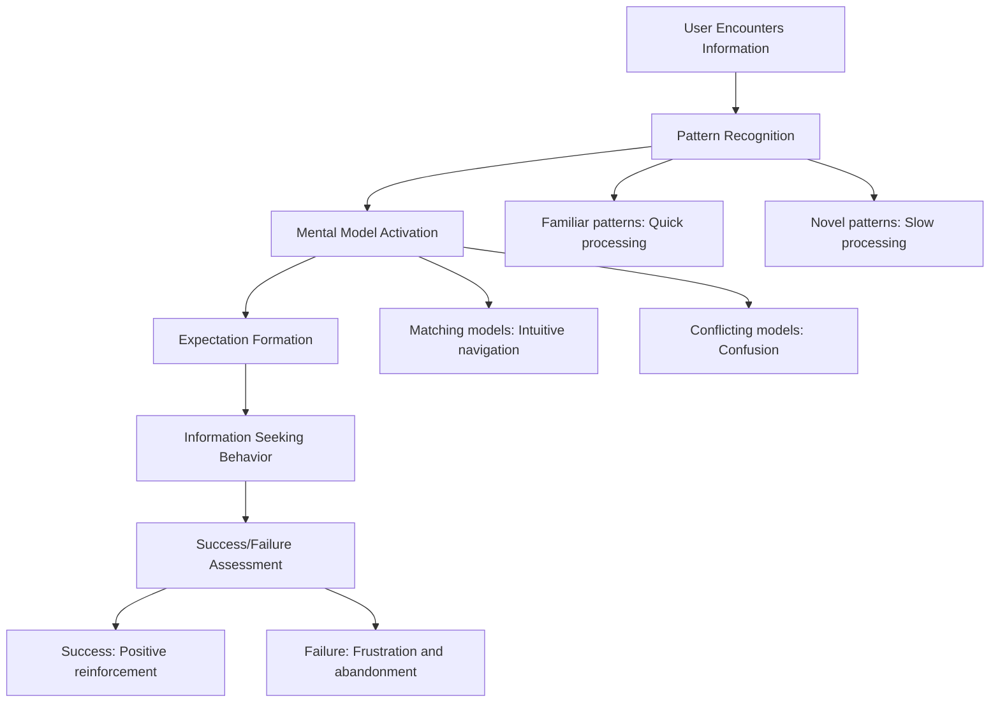
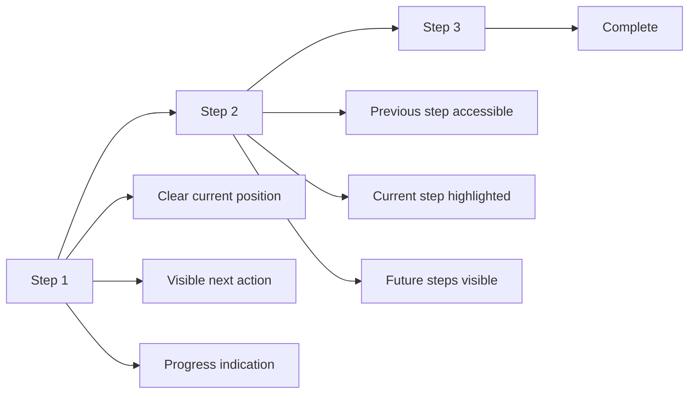
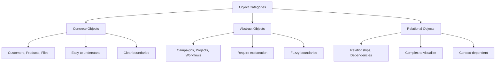
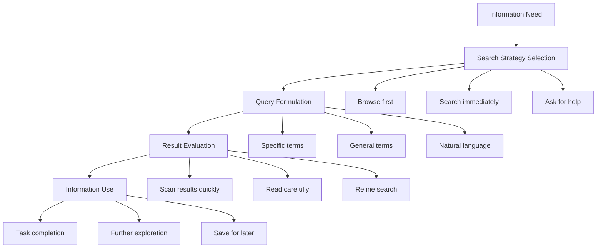
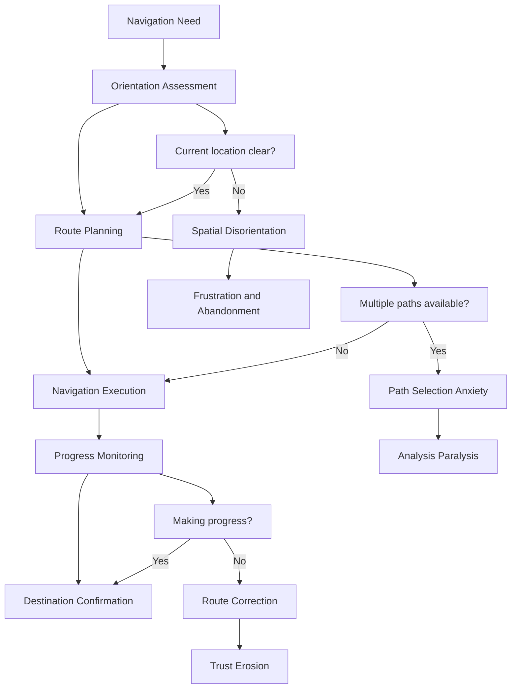
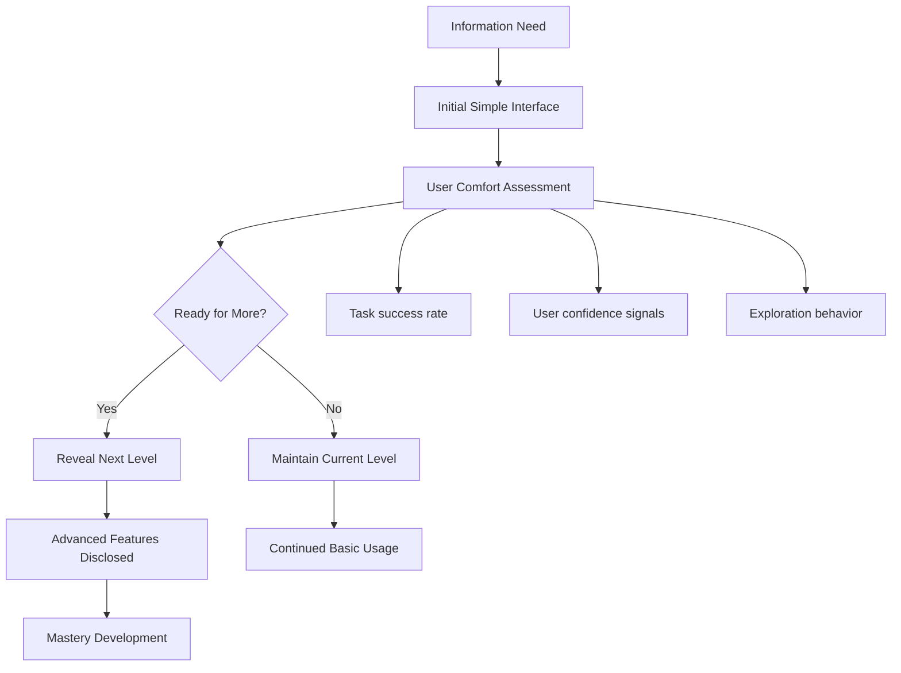

# Chapter 6: Information Architecture Psychology

*How Mental Models and User Expectations Shape Information Organization*

---

## Table of Contents

1. [Introduction: The Psychology of Information Organization](#introduction)
2. [Mental Models and User Expectations](#mental-models)
3. [Category Psychology and Information Organization](#category-psychology)
4. [Search Behavior and Information Seeking](#search-behavior)
5. [Navigation Psychology and Wayfinding](#navigation-psychology)
6. [The Psychology of Progressive Disclosure](#progressive-disclosure)
7. [Implementation Framework](#implementation)
8. [Case Studies](#case-studies)
9. [Measuring Architecture Effectiveness](#measurement)

---

## Introduction: The Psychology of Information Organization {#introduction}

> *"Information architecture isn't about organizing information—it's about organizing it the way users' brains expect to find it."*

Information architecture psychology is the science of organizing complex information in ways that feel intuitive to users. It's the difference between a SaaS product that feels immediately familiar and one that requires extensive learning.

### The Cognitive Science of Information Processing

**How Users Process Information:**
1. **Pattern Recognition**: Looking for familiar organizational patterns
2. **Mental Model Matching**: Comparing interface structure to internal expectations
3. **Cognitive Load Assessment**: Determining how much effort understanding requires
4. **Scent of Information**: Following clues toward desired information
5. **Satisficing Behavior**: Choosing first adequate option rather than optimal



### Why Information Architecture Psychology Matters for SaaS

**Cognitive Impact:**
- **Reduced Learning Curve**: Intuitive organization accelerates onboarding
- **Improved Efficiency**: Users find information faster with better architecture
- **Enhanced Confidence**: Clear organization builds user competence feelings
- **Decreased Support Burden**: Self-service success reduces help requests

**Business Impact:**
- **42% faster feature adoption** with psychology-based information architecture
- **38% reduction in support tickets** through improved findability
- **29% increase in feature usage** when features are logically organized
- **51% improvement in user onboarding success** with intuitive navigation

---

## Mental Models and User Expectations {#mental-models}

> *"Your users already have a mental model of how your product should work. Your job is to discover and design for that model."*

### Understanding Mental Models

**Definition**: Internal representations of how systems work, based on prior experience and cultural learning.

**Mental Model Formation:**
- **Prior Software Experience**: Expectations from similar tools
- **Real-World Analogies**: Physical world metaphors applied to digital interfaces
- **Cultural Patterns**: Learned organizational systems from user's culture
- **Industry Standards**: Common patterns within specific domains

### Common SaaS Mental Models

#### 1. File Cabinet Mental Model
**User Expectation**: Information is organized in hierarchical folders and files

**SaaS Applications:**
- **Document Management**: Folders, subfolders, file organization
- **Project Management**: Projects contain tasks, tasks contain subtasks
- **CRM Systems**: Companies contain contacts, contacts contain activities

**Design Implications:**
```css
/* File cabinet visual metaphor */
.folder-structure {
  border-left: 2px solid #E5E7EB;
  padding-left: 16px;
  margin-left: 8px;
}

.folder-item {
  display: flex;
  align-items: center;
  padding: 8px 0;
  cursor: pointer;
}

.folder-icon {
  width: 16px;
  height: 16px;
  margin-right: 8px;
  background: url('folder-icon.svg');
}

.file-icon {
  background: url('file-icon.svg');
}
```

#### 2. Dashboard/Control Panel Mental Model
**User Expectation**: Central command center showing system status and controls

**SaaS Applications:**
- **Analytics Platforms**: Key metrics displayed prominently
- **Monitoring Tools**: System health and alerts front and center
- **Business Intelligence**: Important KPIs in primary view

**Psychological Design Principles:**
- **Hierarchy**: Most important information largest and most prominent
- **Grouping**: Related metrics clustered together
- **Status Indicators**: Clear visual health/status communication
- **Quick Actions**: Primary controls easily accessible

#### 3. Workflow/Process Mental Model
**User Expectation**: Linear or branching process with clear steps and progression

**SaaS Applications:**
- **Sales CRM**: Lead → Opportunity → Proposal → Closed
- **HR Systems**: Application → Interview → Offer → Hired
- **Project Management**: Planning → Execution → Review → Completion

**Process Design Psychology:**


#### 4. Library/Catalog Mental Model
**User Expectation**: Information is categorized, searchable, and browseable

**SaaS Applications:**
- **Knowledge Bases**: Articles organized by topic and searchable
- **Asset Management**: Resources categorized and tagged
- **Template Libraries**: Designs organized by type and style

**Information Architecture Principles:**
- **Multiple Classification**: Items can belong to multiple categories
- **Search and Browse**: Both exploration methods supported
- **Filtering**: Progressive refinement of large collections
- **Metadata**: Rich information about each item

### Mental Model Research Methods

#### 1. Card Sorting
**Psychology**: Reveals how users naturally group and categorize information

**Process:**
1. **Closed Card Sort**: Users organize items into predefined categories
2. **Open Card Sort**: Users create their own categories and organize items
3. **Hybrid Card Sort**: Combination of predefined and custom categories

**Analysis Framework:**
```
Card Sort Analysis:
- Agreement Score: How much users agree on groupings
- Category Labels: What users call different groups
- Outlier Items: Information that doesn't fit clear patterns
- Mental Model Patterns: Common organizational approaches
```

#### 2. Tree Testing
**Psychology**: Tests navigation success without visual design interference

**Process:**
1. **Task Definition**: Specific information-finding tasks
2. **Tree Navigation**: Users navigate text-only site structure
3. **Success Measurement**: Did users find the right information?
4. **Path Analysis**: How did users navigate through the structure?

#### 3. First-Click Testing
**Psychology**: Tests whether users' initial navigation instincts are correct

**Process:**
1. **Task Scenarios**: Realistic information-seeking tasks
2. **First Click Tracking**: Record users' initial navigation choices
3. **Success Correlation**: Relationship between first click and task success
4. **Mental Model Validation**: Do first clicks align with intended architecture?

### Designing for Mental Models

#### 1. Progressive Mental Model Building
**Psychology**: Help users build accurate mental models gradually

**Strategies:**
- **Onboarding Tours**: Introduce organizational structure systematically
- **Progressive Disclosure**: Reveal complexity as users become comfortable
- **Consistent Patterns**: Reinforce mental models through repetition
- **Clear Labels**: Use terminology that matches users' existing vocabulary

#### 2. Mental Model Flexibility
**Psychology**: Different users may have different but valid mental models

**Approaches:**
- **Multiple Navigation Methods**: Search, browse, filter options
- **Customizable Organization**: User-defined categories and layouts
- **Adaptive Interfaces**: System learns from user behavior patterns
- **Context-Sensitive Architecture**: Different views for different tasks

---

## Category Psychology and Information Organization {#category-psychology}

> *"Humans are natural categorizers. The key is understanding how your users naturally think about categories."*

### The Psychology of Categorization

**Basic Level Categories**: The most natural level of categorization for humans
- **Too General**: "Software" (not specific enough)
- **Basic Level**: "CRM" (just right for most users)
- **Too Specific**: "Lead Management Module" (too detailed for navigation)

**Categorization Principles:**
1. **Prototype Theory**: Categories organized around best examples
2. **Family Resemblance**: Items share some but not all characteristics
3. **Fuzzy Boundaries**: Category edges are often unclear
4. **Cultural Variation**: Category systems vary across cultures and domains

### SaaS Categorization Strategies

#### 1. Functional Categorization
**Psychology**: Organize by what users want to accomplish

**Examples:**
- **Marketing Tools**: "Generate Leads", "Nurture Prospects", "Analyze Performance"
- **Project Management**: "Plan Projects", "Track Progress", "Manage Resources"
- **HR Systems**: "Recruit Talent", "Manage Employees", "Develop Skills"

**Implementation:**
```javascript
// Function-based navigation structure
const functionalCategories = {
  "Acquire Customers": {
    tools: ["Lead Generation", "Landing Pages", "Email Campaigns"],
    psychology: "Goal-oriented organization"
  },
  "Engage Users": {
    tools: ["Onboarding", "Feature Tours", "Push Notifications"],
    psychology: "Activity-based grouping"
  },
  "Retain & Grow": {
    tools: ["Analytics", "Churn Prediction", "Upsell Campaigns"],
    psychology: "Outcome-focused structure"
  }
};
```

#### 2. Role-Based Categorization
**Psychology**: Organize by who will use the features

**Examples:**
- **Enterprise Software**: "Administrators", "Managers", "End Users"
- **Design Tools**: "Designers", "Developers", "Stakeholders"
- **Analytics Platforms**: "Analysts", "Marketers", "Executives"

**Role-Based Design Considerations:**
- **Permission Levels**: Categories may have different access controls
- **Complexity Gradients**: Some roles need simpler, others more advanced features
- **Workflow Alignment**: Categories should match role-specific processes
- **Language Adaptation**: Terminology appropriate for each role type

#### 3. Object-Based Categorization
**Psychology**: Organize by the things users work with

**Examples:**
- **CRM Systems**: "Contacts", "Companies", "Deals", "Tasks"
- **Content Management**: "Articles", "Images", "Videos", "Documents"
- **E-commerce**: "Products", "Orders", "Customers", "Inventory"

**Object Category Psychology:**


#### 4. Temporal Categorization
**Psychology**: Organize by time-based patterns

**Examples:**
- **Analytics**: "Real-time", "Daily", "Weekly", "Monthly", "Historical"
- **Task Management**: "Today", "This Week", "Upcoming", "Overdue"
- **Communication**: "Recent", "Starred", "Archive"

**Temporal Psychology Considerations:**
- **Recency Bias**: Recent items feel more important
- **Future Planning**: Different time horizons require different detail levels
- **Cyclical Patterns**: Weekly, monthly, quarterly business cycles
- **Event-Based Timing**: Deadlines, launches, seasonal patterns

### Cross-Category Navigation Psychology

#### 1. Faceted Classification
**Psychology**: Allow multiple, simultaneous categorization approaches

**Implementation Strategy:**
```css
/* Faceted navigation interface */
.faceted-nav {
  display: flex;
  gap: 16px;
  margin-bottom: 24px;
}

.facet-group {
  background: #F9FAFB;
  border: 1px solid #E5E7EB;
  border-radius: 8px;
  padding: 12px;
}

.facet-label {
  font-weight: 600;
  margin-bottom: 8px;
  color: #374151;
}

.facet-option {
  display: flex;
  align-items: center;
  margin-bottom: 4px;
}

.facet-option input[type="checkbox"] {
  margin-right: 8px;
}
```

**Faceted Navigation Benefits:**
- **Flexible Exploration**: Multiple ways to slice information
- **Progressive Refinement**: Gradually narrow down options
- **Mental Model Support**: Works with different user categorization preferences
- **Complex Data Handling**: Manages multi-dimensional information effectively

#### 2. Contextual Categorization
**Psychology**: Categories change based on user context and goals

**Context Variables:**
- **User Role**: Different categories for different user types
- **Task Context**: Categories adapt to what user is trying to accomplish
- **Data State**: Empty, partial, or full data states show different options
- **Time Context**: Categories change based on business cycles or deadlines

### Category Labeling Psychology

#### 1. Cognitive Load and Label Length
**Psychology**: Shorter labels reduce cognitive processing time

**Label Guidelines:**
- **1-2 words**: Ideal for primary navigation
- **3-4 words**: Acceptable for secondary categories
- **5+ words**: Only for very specific, infrequent categories

#### 2. Familiar vs. Precise Language
**Psychology**: Balance between familiar terms and precise descriptions

**Language Strategy:**
```
Familiar Language:
- "Customers" instead of "Customer Relationship Records"
- "Reports" instead of "Business Intelligence Analytics"
- "Settings" instead of "Configuration Management"

Precise Language (when familiar is ambiguous):
- "Email Campaigns" instead of just "Email"
- "Sales Pipeline" instead of just "Pipeline"
- "User Permissions" instead of just "Permissions"
```

#### 3. Cultural and Domain Adaptation
**Psychology**: Category labels should match user's professional vocabulary

**Domain-Specific Adaptations:**
- **Healthcare**: "Patients" not "Customers"
- **Education**: "Students" not "Users"
- **Legal**: "Cases" not "Projects"
- **Nonprofit**: "Donors" not "Customers"

---

## Search Behavior and Information Seeking {#search-behavior}

> *"Search isn't just about finding information—it's about understanding how users think about problems and solutions."*

### The Psychology of Search

**Search Behavior Patterns:**
1. **Orienteering**: General exploration to understand available information
2. **Known-Item Search**: Looking for specific information user knows exists
3. **Exploratory Search**: Learning about unfamiliar topics or domains
4. **Re-finding**: Locating previously seen information



### Search Psychology Principles

#### 1. Query Construction Psychology
**How Users Form Search Queries:**

**Progressive Query Refinement:**
- **Initial Query**: Broad, often imprecise terms
- **Refined Query**: More specific based on initial results
- **Final Query**: Precise terms after learning system vocabulary

**Query Types by Psychology:**
```javascript
const queryTypes = {
  exploratory: {
    patterns: ["how to", "what is", "overview"],
    psychology: "Learning and discovery mode",
    interface_needs: ["broad results", "educational content", "related topics"]
  },
  navigational: {
    patterns: ["login", "dashboard", "settings"],
    psychology: "Goal-directed, knows destination",
    interface_needs: ["quick access", "top result accuracy", "minimal friction"]
  },
  transactional: {
    patterns: ["create", "delete", "export"],
    psychology: "Task completion focus",
    interface_needs: ["action-oriented results", "clear next steps", "process guidance"]
  }
};
```

#### 2. Result Scanning Psychology
**How Users Evaluate Search Results:**

**F-Pattern Scanning:**
- **First horizontal**: Read across top results
- **Second horizontal**: Scan key results in middle
- **Vertical scan**: Look down left side for relevant keywords

**Satisficing Behavior:**
- Users often choose first adequate result
- Rarely examine results beyond first page
- Trust ranking as quality indicator

#### 3. Search Context Psychology
**Mental Context Affects Search Behavior:**

**Task Urgency:**
- **High urgency**: Quick scanning, satisficing behavior
- **Low urgency**: Thorough exploration, comparison shopping
- **Learning mode**: Comprehensive information gathering

**Domain Expertise:**
- **Novices**: Use general terms, need guidance
- **Experts**: Use precise terminology, want comprehensive results
- **Intermediate**: Mix of behaviors depending on specific knowledge gaps

### SaaS Search Design Psychology

#### 1. Scoped Search Psychology
**Psychology**: Users expect search scope to match their current context

**Scoped Search Implementation:**
```html
<!-- Context-aware search -->
<div class="search-container">
  <div class="search-scope">
    <span class="scope-indicator">Searching in: Projects</span>
    <button class="scope-change">Change scope</button>
  </div>
  
  <input type="search" 
         placeholder="Search projects, tasks, and documents..."
         class="search-input">
  
  <div class="search-filters">
    <button class="filter-toggle">Filters</button>
  </div>
</div>
```

**Scope Psychology Benefits:**
- **Cognitive Load Reduction**: Fewer irrelevant results
- **Mental Model Alignment**: Matches user's current task context
- **Efficiency**: Faster navigation to relevant information
- **Confidence**: Clear understanding of search boundaries

#### 2. Autocomplete and Suggestion Psychology
**Psychology**: Predictive assistance reduces cognitive load and improves success

**Suggestion Types:**
- **Query Completion**: Finish what user is typing
- **Popular Searches**: Show common search terms
- **Recent Searches**: User's personal search history
- **Contextual Suggestions**: Based on current page/section

**Autocomplete Design Psychology:**
```css
/* Autocomplete styling that builds confidence */
.autocomplete-dropdown {
  background: white;
  border: 1px solid #E5E7EB;
  border-radius: 8px;
  box-shadow: 0 4px 12px rgba(0, 0, 0, 0.1);
  max-height: 300px;
  overflow-y: auto;
}

.suggestion-item {
  padding: 12px 16px;
  cursor: pointer;
  border-bottom: 1px solid #F3F4F6;
}

.suggestion-item:hover {
  background: #F9FAFB;
}

.suggestion-highlight {
  background: #FEF3C7;
  font-weight: 600;
}

.suggestion-category {
  font-size: 12px;
  color: #6B7280;
  text-transform: uppercase;
}
```

#### 3. No Results Psychology
**Psychology**: Failed searches create frustration and abandonment risk

**No Results Recovery Strategies:**
- **Spell Check**: Suggest corrections for typos
- **Query Expansion**: Suggest broader terms
- **Alternative Actions**: Provide other ways to find information
- **Support Options**: Easy access to help

**No Results Page Psychology:**
```html
<!-- Helpful no results experience -->
<div class="no-results">
  <div class="no-results-message">
    <h3>No results found for "advaned analytics"</h3>
    <p>We couldn't find anything matching your search.</p>
  </div>
  
  <div class="search-suggestions">
    <h4>Did you mean:</h4>
    <button class="suggestion">"advanced analytics"</button>
  </div>
  
  <div class="alternative-actions">
    <h4>Try these instead:</h4>
    <a href="/browse/analytics">Browse Analytics Tools</a>
    <a href="/help/search">Search Help</a>
    <button class="contact-support">Contact Support</button>
  </div>
</div>
```

### Advanced Search Psychology

#### 1. Faceted Search Psychology
**Psychology**: Allow users to progressively refine large result sets

**Faceted Search Benefits:**
- **Cognitive Control**: Users feel in control of the search process
- **Progressive Discovery**: Learn about available options while searching
- **Flexible Mental Models**: Support different categorization approaches
- **Exploration Encouragement**: Easy to try different filter combinations

#### 2. Search Result Ranking Psychology
**Psychology**: Result order heavily influences user behavior

**Ranking Factors by User Psychology:**
- **Recency**: Recent items feel more relevant
- **Personal Relevance**: Items related to user's work
- **Authority**: Content from trusted sources or popular items
- **Contextual Relevance**: Match to current task or location

#### 3. Search Learning and Adaptation
**Psychology**: Systems that learn improve user satisfaction over time

**Learning Mechanisms:**
- **Click-Through Tracking**: Learn from which results users choose
- **Search Refinement Patterns**: Understand how users modify queries
- **Contextual Usage**: Adapt to user's role and common tasks
- **Collaborative Filtering**: Learn from similar users' successful searches

---

## Navigation Psychology and Wayfinding {#navigation-psychology}

> *"Navigation isn't just about getting from A to B—it's about helping users understand where they are, where they can go, and how to get back."*

### The Psychology of Digital Wayfinding

**Wayfinding Requirements:**
1. **Orientation**: Where am I now?
2. **Route Decision**: How do I get where I want to go?
3. **Route Monitoring**: Am I going the right way?
4. **Destination Recognition**: Have I arrived?



### Navigation Mental Models

#### 1. Hierarchical Mental Model
**Psychology**: Information organized in tree-like structures

**Design Implications:**
- **Breadcrumbs**: Show current position in hierarchy
- **Parent/Child Relationships**: Clear up/down navigation
- **Consistent Depth**: Avoid irregular hierarchy depths
- **Predictable Structure**: Similar content at similar levels

**Hierarchical Navigation Implementation:**
```css
/* Breadcrumb navigation psychology */
.breadcrumbs {
  display: flex;
  align-items: center;
  font-size: 14px;
  color: #6B7280;
  margin-bottom: 16px;
}

.breadcrumb-item {
  color: #374151;
}

.breadcrumb-item:not(:last-child)::after {
  content: "›";
  margin: 0 8px;
  color: #9CA3AF;
}

.breadcrumb-item:last-child {
  color: #1F2937;
  font-weight: 600;
}

.breadcrumb-link:hover {
  color: #2563EB;
  text-decoration: underline;
}
```

#### 2. Network Mental Model
**Psychology**: Information connected in web-like relationships

**Design Implications:**
- **Cross-References**: Links between related content
- **Tag Systems**: Multiple ways to categorize and find content
- **Related Items**: Suggestions for connected information
- **Graph Visualizations**: Show relationship structures

#### 3. Sequential Mental Model
**Psychology**: Information organized in step-by-step processes

**Design Implications:**
- **Progress Indicators**: Show current step and progress
- **Previous/Next Navigation**: Linear movement through content
- **Step Validation**: Ensure completion before progression
- **Exit Options**: Clear way to leave process

### Primary Navigation Psychology

#### 1. Global Navigation
**Psychology**: Persistent navigation that provides constant orientation

**Global Navigation Principles:**
- **Consistency**: Same navigation across all pages
- **Prominence**: Visually distinct and easy to find
- **Completeness**: Access to all major sections
- **Current Location**: Clear indication of active section

```javascript
// Global navigation state management
const navigationState = {
  currentSection: 'dashboard',
  availableSections: [
    { id: 'dashboard', label: 'Dashboard', icon: 'dashboard' },
    { id: 'customers', label: 'Customers', icon: 'users' },
    { id: 'projects', label: 'Projects', icon: 'folder' },
    { id: 'reports', label: 'Reports', icon: 'chart' },
    { id: 'settings', label: 'Settings', icon: 'gear' }
  ],
  
  // Psychology-based active state
  setActiveSection(sectionId) {
    this.currentSection = sectionId;
    updateNavigationUI();
    trackNavigationChange(sectionId);
  }
};
```

#### 2. Local Navigation
**Psychology**: Context-specific navigation within sections

**Local Navigation Types:**
- **Sidebar Navigation**: Hierarchical section content
- **Tab Navigation**: Related content at same level
- **Contextual Menus**: Actions specific to current content
- **Related Links**: Cross-references to connected content

#### 3. Utility Navigation
**Psychology**: Secondary functions that users occasionally need

**Utility Navigation Examples:**
- **User Account**: Profile, settings, logout
- **Help and Support**: Documentation, contact options
- **System Status**: Notifications, system health
- **Administrative**: Advanced configuration options

### Navigation Feedback Psychology

#### 1. Active State Psychology
**Psychology**: Clear indication of current location reduces anxiety

**Active State Design:**
```css
/* Strong visual indication of current location */
.nav-item {
  padding: 12px 16px;
  border-radius: 6px;
  color: #6B7280;
  text-decoration: none;
  transition: all 0.2s ease;
}

.nav-item:hover {
  background: #F3F4F6;
  color: #374151;
}

.nav-item.active {
  background: #2563EB;
  color: white;
  font-weight: 600;
}

.nav-item.active::before {
  content: "";
  position: absolute;
  left: 0;
  top: 0;
  bottom: 0;
  width: 4px;
  background: #1D4ED8;
}
```

#### 2. Navigation Feedback Loops
**Psychology**: Immediate response to navigation actions builds confidence

**Feedback Types:**
- **Visual State Changes**: Immediate highlighting of selected items
- **Loading Indicators**: Show that navigation action was registered
- **Breadcrumb Updates**: Reflect new location immediately
- **Content Transitions**: Smooth changes between sections

#### 3. Navigation Error Recovery
**Psychology**: Help users recover from navigation mistakes

**Error Recovery Strategies:**
- **"Back" Functionality**: Easy return to previous location
- **Navigation History**: Breadcrumb trail or history menu
- **Home/Reset Options**: Quick return to familiar starting point
- **Search as Backup**: When navigation fails, search succeeds

### Mobile Navigation Psychology

#### 1. Thumb-Driven Navigation
**Psychology**: Design for comfortable one-handed use

**Thumb Zone Considerations:**
```css
/* Mobile navigation optimized for thumb reach */
.mobile-nav {
  position: fixed;
  bottom: 0;
  left: 0;
  right: 0;
  background: white;
  border-top: 1px solid #E5E7EB;
  padding: 8px 0;
}

.mobile-nav-item {
  flex: 1;
  display: flex;
  flex-direction: column;
  align-items: center;
  padding: 12px 8px;
  min-height: 56px; /* Minimum touch target */
  color: #6B7280;
}

.mobile-nav-item.active {
  color: #2563EB;
}

.mobile-nav-icon {
  width: 24px;
  height: 24px;
  margin-bottom: 4px;
}

.mobile-nav-label {
  font-size: 12px;
  font-weight: 500;
}
```

#### 2. Context Collapse Psychology
**Psychology**: Mobile screens hide navigation context, increasing cognitive load

**Context Preservation Strategies:**
- **Persistent Headers**: Always show current section
- **Contextual Back Buttons**: Clear return paths
- **Modal Navigation**: Overlay menus that preserve context
- **Progressive Enhancement**: Reveal navigation on demand

### Advanced Navigation Patterns

#### 1. Adaptive Navigation
**Psychology**: Navigation that adapts to user behavior and preferences

**Adaptive Strategies:**
- **Frequency-Based Ordering**: Most-used items appear first
- **Role-Based Customization**: Different navigation for different user types
- **Context-Aware Suggestions**: Relevant navigation options based on current task
- **Learning Navigation**: System learns from user navigation patterns

#### 2. Social Navigation
**Psychology**: Navigation influenced by what others do

**Social Navigation Elements:**
- **Popular Destinations**: Show where other users commonly go
- **Collaborative Spaces**: Shared workspaces and projects
- **Activity Streams**: See where team members are working
- **Recommendation Systems**: Suggest navigation based on similar users

---

## The Psychology of Progressive Disclosure {#progressive-disclosure}

> *"Don't show users everything at once. Reveal complexity gradually as they're ready for it."*

### Understanding Progressive Disclosure Psychology

**Definition**: A technique that presents only essential information initially, revealing additional details as needed.

**Psychological Benefits:**
- **Cognitive Load Reduction**: Prevents information overload
- **Confidence Building**: Success with simple tasks builds confidence for complex ones
- **Learning Facilitation**: Natural progression from basic to advanced concepts
- **Choice Architecture**: Guides users toward optimal paths



### Progressive Disclosure Patterns

#### 1. Layered Disclosure
**Psychology**: Information organized in increasing levels of detail

**Implementation Example:**
```html
<!-- Layered settings interface -->
<div class="settings-panel">
  <!-- Level 1: Basic Settings -->
  <div class="basic-settings">
    <h3>Basic Settings</h3>
    <label>
      <input type="checkbox" id="notifications"> 
      Enable notifications
    </label>
    <label>
      <input type="checkbox" id="auto-save"> 
      Auto-save changes
    </label>
  </div>
  
  <!-- Level 2: Advanced Options -->
  <details class="advanced-settings">
    <summary>Advanced Options</summary>
    <div class="advanced-content">
      <label>
        Notification frequency:
        <select>
          <option>Immediate</option>
          <option>Hourly digest</option>
          <option>Daily summary</option>
        </select>
      </label>
      <!-- More complex options -->
    </div>
  </details>
  
  <!-- Level 3: Expert Configuration -->
  <details class="expert-settings">
    <summary>Expert Configuration</summary>
    <div class="expert-content">
      <!-- Complex configuration options -->
    </div>
  </details>
</div>
```

#### 2. Contextual Disclosure
**Psychology**: Show additional information only when relevant to current task

**Contextual Examples:**
- **Form Help**: Show field explanations on focus
- **Feature Tours**: Highlight relevant features during specific tasks
- **Error Details**: Provide technical information only when basic recovery fails
- **Power User Options**: Reveal advanced features based on usage patterns

#### 3. Sequential Disclosure
**Psychology**: Guide users through complex processes step-by-step

**Sequential Patterns:**
- **Onboarding Flows**: Introduce features gradually over multiple sessions
- **Setup Wizards**: Break complex configuration into manageable steps
- **Feature Discovery**: Introduce advanced features after basic mastery
- **Skill Building**: Progressive complexity in learning experiences

### Psychological Triggers for Disclosure

#### 1. Competence-Based Disclosure
**Psychology**: Reveal complexity as users demonstrate readiness

**Competence Indicators:**
- **Task Completion**: Successfully finishing basic tasks
- **Feature Usage**: Adopting and using introduced features
- **Help-Seeking**: User requests for more advanced capabilities
- **Time-Based**: Tenure and regular usage patterns

```javascript
// Competence-based feature disclosure
const userCompetenceTracker = {
  basicTasksCompleted: 0,
  featuresAdopted: [],
  sessionCount: 0,
  
  // Assess readiness for advanced features
  assessReadiness() {
    const basicMastery = this.basicTasksCompleted >= 5;
    const featureAdoption = this.featuresAdopted.length >= 3;
    const regularUser = this.sessionCount >= 10;
    
    return basicMastery && featureAdoption && regularUser;
  },
  
  // Progressively reveal features
  updateFeatureAccess() {
    if (this.assessReadiness()) {
      revealAdvancedFeatures();
      trackFeatureDisclosure('advanced_features_unlocked');
    }
  }
};
```

#### 2. Interest-Based Disclosure
**Psychology**: Reveal information when users show specific interest

**Interest Signals:**
- **Hover Behavior**: Extended hover over interface elements
- **Exploration Patterns**: Clicking around to discover features
- **Search Queries**: Looking for specific advanced functionality
- **Help Requests**: Asking about capabilities not currently visible

#### 3. Context-Based Disclosure
**Psychology**: Show relevant information based on current situation

**Context Triggers:**
- **Data State**: Different options for empty vs. full data sets
- **User Role**: Role-specific feature revelation
- **Time Context**: Seasonal or deadline-based feature disclosure
- **Integration State**: Show options when connected to other tools

### Progressive Disclosure Design Principles

#### 1. Graceful Degradation
**Psychology**: Ensure basic functionality works without advanced features

**Design Strategy:**
- **Core Functionality First**: Essential features always visible and accessible
- **Optional Enhancement**: Advanced features enhance but don't break basic workflows
- **Fallback Options**: Alternative paths when advanced features aren't available
- **Universal Access**: Critical functions don't require progressive disclosure

#### 2. Clear Advancement Paths
**Psychology**: Users should understand how to access more functionality

**Path Clarity Techniques:**
```css
/* Visual cues for expandable content */
.expandable-section {
  border: 1px solid #E5E7EB;
  border-radius: 8px;
  margin-bottom: 16px;
}

.expand-trigger {
  display: flex;
  align-items: center;
  justify-content: space-between;
  padding: 16px;
  cursor: pointer;
  background: #F9FAFB;
  border-radius: 8px 8px 0 0;
}

.expand-trigger:hover {
  background: #F3F4F6;
}

.expand-icon {
  transition: transform 0.2s ease;
}

.expandable-section[open] .expand-icon {
  transform: rotate(180deg);
}

.expandable-content {
  padding: 16px;
  border-top: 1px solid #E5E7EB;
}
```

#### 3. Reversible Disclosure
**Psychology**: Allow users to return to simpler states when overwhelmed

**Reversibility Features:**
- **Collapse Options**: Easy way to hide complex features
- **Simple Mode**: Toggle between basic and advanced interfaces
- **Progressive Hiding**: Hide unused advanced features over time
- **Reset to Defaults**: Quick return to initial simple state

### Progressive Disclosure in Different SaaS Contexts

#### 1. Dashboard Complexity Management
**Psychology**: Prevent dashboard overwhelm while providing comprehensive data access

**Dashboard Disclosure Strategy:**
```javascript
// Dashboard complexity management
const dashboardComplexity = {
  levels: {
    basic: {
      widgets: ['key_metrics', 'recent_activity'],
      maxWidgets: 4,
      customization: false
    },
    intermediate: {
      widgets: ['all_metrics', 'charts', 'tables', 'activity'],
      maxWidgets: 8,
      customization: 'limited'
    },
    advanced: {
      widgets: 'all_available',
      maxWidgets: 'unlimited',
      customization: 'full'
    }
  },
  
  determineLevel(user) {
    if (user.dashboardInteractions > 50) return 'advanced';
    if (user.dashboardInteractions > 10) return 'intermediate';
    return 'basic';
  }
};
```

#### 2. Feature Introduction Psychology
**Psychology**: Introduce new features without disrupting existing workflows

**Feature Introduction Patterns:**
- **Soft Launch**: Make features available but not prominent
- **Guided Discovery**: Proactive introduction during relevant tasks
- **Opt-in Advanced**: Let users choose to enable complex features
- **Usage-Based Revelation**: Show features when patterns suggest usefulness

#### 3. Settings and Configuration
**Psychology**: Prevent settings overwhelm while providing full control

**Settings Disclosure Hierarchy:**
- **Essential Settings**: Always visible, affect core functionality
- **Common Settings**: One level deep, frequently adjusted
- **Advanced Settings**: Two levels deep, occasional adjustments
- **Expert Settings**: Three levels deep, rare but important configurations

---

## Implementation Framework {#implementation}

### Information Architecture Psychology Audit

#### Current State Assessment
**IA Psychology Checklist:**
- [ ] **Mental Model Alignment**: Does structure match user expectations?
- [ ] **Category Logic**: Are categories psychologically coherent?
- [ ] **Search Effectiveness**: Can users find information efficiently?
- [ ] **Navigation Clarity**: Is wayfinding intuitive and error-resistant?
- [ ] **Progressive Disclosure**: Is complexity revealed appropriately?

#### Research and Testing Protocol
**IA Psychology Research Methods:**
1. **Card Sorting Studies**: Understand natural categorization patterns
2. **Tree Testing**: Validate navigation structure without visual interference
3. **First-Click Testing**: Test initial navigation intuition
4. **Search Query Analysis**: Understand how users think about information
5. **Mental Model Interviews**: Discover user expectations and assumptions

### Implementation Roadmap

#### Phase 1: Foundation Research (Weeks 1-3)
**Mental Model Discovery:**
- [ ] Conduct card sorting studies with representative users
- [ ] Interview users about their mental models and expectations
- [ ] Analyze current navigation analytics and search queries
- [ ] Map user task flows and information needs

#### Phase 2: Architecture Design (Weeks 4-6)
**Structure Development:**
- [ ] Design category systems based on research insights
- [ ] Create navigation hierarchies that match mental models
- [ ] Develop progressive disclosure patterns for complex features
- [ ] Design search and filtering systems

#### Phase 3: Implementation and Testing (Weeks 7-12)
**Build and Validate:**
- [ ] Implement new information architecture
- [ ] Conduct tree testing to validate navigation structure
- [ ] Test search effectiveness and query satisfaction
- [ ] Optimize based on user testing feedback

### Measurement Framework

#### Information Architecture Success Metrics
**Findability Metrics:**
- **Task Success Rate**: Percentage of users who successfully find information
- **Time to Information**: Average time to locate specific content
- **Search Success Rate**: Percentage of searches that lead to desired information
- **Navigation Efficiency**: Steps required to reach common destinations

**User Satisfaction Metrics:**
- **Mental Model Alignment**: How well structure matches user expectations
- **Cognitive Load Assessment**: Perceived difficulty of finding information
- **Confidence Ratings**: User confidence in navigation and search
- **Error Recovery Success**: Ability to recover from navigation mistakes

**Business Impact Metrics:**
- **Feature Discovery Rate**: How effectively users find available features
- **Support Ticket Reduction**: Decrease in "how do I find..." questions
- **User Onboarding Success**: Information architecture impact on new user success
- **Advanced Feature Adoption**: Progressive disclosure effectiveness

---

## Case Studies {#case-studies}

### Case Study 1: Slack's Information Architecture Evolution

**Challenge**: Organize growing feature set without overwhelming users

**Information Architecture Psychology Strategy:**
- **Mental Model**: Chat-first organization with progressive feature disclosure
- **Category System**: Channels, Direct Messages, Apps organized by communication type
- **Progressive Disclosure**: Advanced features revealed through usage patterns
- **Search Integration**: Powerful search that works across all content types

**Implementation Highlights:**
- **Sidebar Organization**: Follows communication mental models (recent, favorites, all)
- **Contextual Menus**: Advanced features accessible through right-click context
- **Search Scope**: Automatically scopes search to relevant content types
- **Progressive Enhancement**: Features like workflow builder revealed to power users

**Results:**
- **89% task success rate** for finding information
- **43% reduction** in support tickets about navigation
- **67% increase** in advanced feature adoption
- **Industry-leading** user satisfaction with information findability

### Case Study 2: Notion's Flexible Information Architecture

**Challenge**: Support infinite customization while maintaining usability

**Information Architecture Psychology Strategy:**
- **Multiple Mental Models**: Support file, database, and workflow mental models simultaneously
- **User-Defined Categories**: Let users create their own organizational systems
- **Progressive Complexity**: Start simple, reveal power features gradually
- **Search and Browse**: Multiple ways to find information

**Implementation Approach:**
- **Block-Based Structure**: Atomic content units that can be organized flexibly
- **Template System**: Provide organizational starting points for common mental models
- **Powerful Search**: Find content regardless of organizational structure
- **Nested Navigation**: Support deep hierarchies while maintaining navigability

**Results:**
- **High user engagement** with customization features
- **Strong user retention** despite initial complexity
- **Viral growth** through shared organizational templates
- **Community-driven** evolution of best practices

### Case Study 3: Figma's Collaborative Information Architecture

**Challenge**: Organize design files and projects for team collaboration

**Information Architecture Psychology Strategy:**
- **Team Mental Model**: Organization around teams and projects rather than individual files
- **Contextual Access**: Different views for different roles (designer, stakeholder, developer)
- **Social Navigation**: See where team members are working
- **Progressive Sharing**: Evolving permissions and visibility as projects develop

**Collaborative Features:**
- **Team Spaces**: Organize work around team structure
- **Project Grouping**: Logical project containers with appropriate permissions
- **Version Management**: Time-based organization for design iteration
- **Smart Search**: Find designs by content, team, or project context

**Results:**
- **78% improvement** in team file organization
- **52% faster** design handoff processes
- **34% increase** in cross-team collaboration
- **Significant reduction** in file duplication and confusion

---

## Measuring Architecture Effectiveness {#measurement}

### Information Architecture Analytics

#### Navigation Pattern Analysis
**Key Metrics:**
```javascript
// Navigation analytics tracking
const navigationAnalytics = {
  // Path analysis
  trackNavigationPath(path, taskType, success) {
    analytics.track('navigation_path', {
      path: path,
      task_type: taskType,
      success: success,
      path_length: path.length,
      timestamp: Date.now()
    });
  },
  
  // Search behavior analysis
  trackSearchBehavior(query, results, clickedResult, refinements) {
    analytics.track('search_behavior', {
      query: query,
      results_count: results.length,
      clicked_result: clickedResult,
      refinements: refinements,
      query_success: clickedResult !== null
    });
  },
  
  // Progressive disclosure tracking
  trackDisclosureUsage(feature, level, userContext) {
    analytics.track('progressive_disclosure', {
      feature: feature,
      complexity_level: level,
      user_experience: userContext.experienceLevel,
      session_number: userContext.sessionNumber
    });
  }
};
```

#### Information Scent Analysis
**Measuring Information Findability:**
- **Click-Through Rates**: How often users follow specific navigation paths
- **Abandonment Points**: Where users give up searching for information
- **Query Refinement Patterns**: How users modify searches to find information
- **Help-Seeking Behavior**: When users resort to asking for help

#### Mental Model Validation
**Ongoing Mental Model Assessment:**
- **Card Sort Comparisons**: Regular validation of category systems
- **Tree Test Performance**: Navigation structure effectiveness over time
- **User Interview Insights**: Qualitative feedback on information architecture
- **Comparative Analysis**: How user models evolve with product changes

### Continuous Improvement Framework

#### Quarterly IA Health Checks
**Regular Assessment Process:**
1. **Analytics Review**: Analyze navigation and search patterns
2. **User Research**: Conduct focused studies on problem areas
3. **Competitive Analysis**: Monitor information architecture trends
4. **Implementation Planning**: Prioritize improvements based on impact

#### A/B Testing Information Architecture
**Testing Approaches:**
```
Test 1: Navigation Label Psychology
- Control: Technical/Internal terminology
- Variant: User-friendly/External terminology
- Hypothesis: User language will improve findability
- Metrics: Task success rate, time to information

Test 2: Category Organization
- Control: Feature-based organization
- Variant: Task-based organization
- Hypothesis: Task-based will match user mental models better
- Metrics: Navigation efficiency, user satisfaction

Test 3: Progressive Disclosure Timing
- Control: All features visible immediately
- Variant: Gradual feature revelation based on usage
- Hypothesis: Progressive disclosure will reduce overwhelm
- Metrics: Feature adoption, user confidence ratings
```

---

## Conclusion: Your Information Architecture Psychology Advantage

Information architecture psychology is about creating digital spaces that feel intuitive and familiar to your users. When done well, users don't think about the organization—they just find what they need when they need it.

**Your Information Architecture Psychology Action Plan:**
1. **Understand User Mental Models**: Research how your users naturally categorize and think about information
2. **Design for Multiple Approaches**: Support different ways of finding the same information
3. **Implement Progressive Disclosure**: Reveal complexity gradually as users are ready
4. **Optimize Search and Navigation**: Make both browsing and searching effective
5. **Measure and Iterate**: Continuously improve based on user behavior data

**Remember**: Great information architecture is invisible. Users should feel like the information is organized exactly as they would organize it themselves. Focus on matching mental models rather than imposing your own organizational logic.

In the next chapter, we'll explore how cognitive load management can make complex SaaS products feel simple and approachable...

---

## Tools & Resources

### Information Architecture Research Tools
- **OptimalSort**: Card sorting and tree testing platform
- **Treejack**: Tree testing for navigation validation
- **UserZoom**: Comprehensive IA research capabilities
- **Miro/Mural**: Collaborative IA design and research

### Analytics and Testing Tools
- **Google Analytics**: Navigation flow and search analytics
- **Hotjar**: User behavior and navigation patterns
- **Maze**: Unmoderated IA testing
- **Lookback**: Moderated IA research sessions

### Further Reading
- "Information Architecture" by Louis Rosenfeld and Peter Morville
- "Don't Make Me Think" by Steve Krug
- "The Elements of User Experience" by Jesse James Garrett
- "Mental Models" by Indi Young

---

*Next: Chapter 7 - Cognitive Load Management*
