# Chapter 8: First Impressions and Trust Building

*The Psychology of the Critical First 7 Seconds That Determine Your SaaS Success*

---

## 🎯 **The High-Stakes Theater of First Contact**

When a potential user lands on your SaaS homepage, visits your product page, or opens your application for the first time, their brain makes over 50 unconscious decisions in the first 7 seconds. These decisions determine whether they become a customer or join the 96% who bounce away forever.

This isn't just marketing—it's neuroscience. This chapter reveals the psychological mechanisms behind first impressions and how billion-dollar SaaS companies engineer trust from the first millisecond of contact.

---

## 🧠 **The Neuroscience of First Impressions**

### The 7-Second Brain Cascade

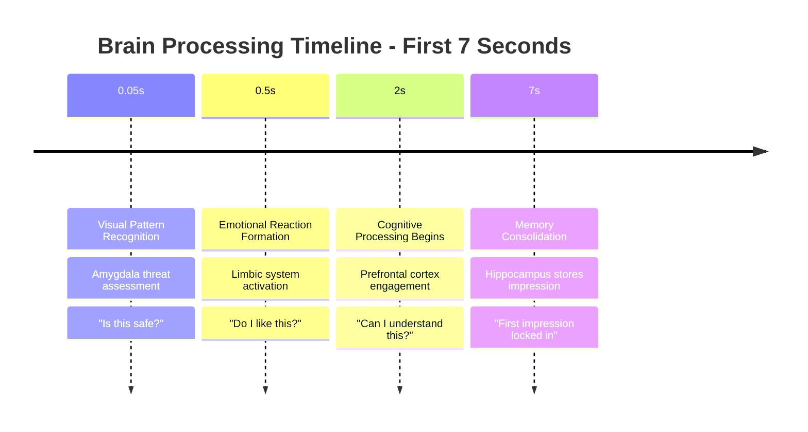

### The Trust Equation in Software

**Trust = (Credibility + Reliability + Intimacy) / Self-Orientation**

| Component | SaaS Application | Psychological Trigger | Examples |
|-----------|------------------|----------------------|----------|
| **Credibility** | Expertise signals | Authority bias | Customer logos, certifications |
| **Reliability** | Consistency cues | Predictability need | Uptime badges, testimonials |
| **Intimacy** | Personal connection | Similarity attraction | User stories, team photos |
| **Self-Orientation** | Perceived agenda | Reciprocity principle | Free trials, transparent pricing |

---

## 🎨 **Visual Trust Psychology**

### The Hierarchy of Visual Trust Signals

```mermaid
pyramid
    title Visual Trust Hierarchy
    "Social Proof & Testimonials" : 15
    "Professional Photography & Design" : 20
    "Clean Layout & Navigation" : 25
    "Brand Consistency & Quality" : 25
    "Color Psychology & Contrast" : 15
```

#### Level 1: Color Psychology & Emotional Priming (15%)

**The Psychology of SaaS Color Choices:**

| Color | Psychological Effect | Trust Level | Best For | Avoid When |
|-------|---------------------|-------------|----------|------------|
| **Blue** | Security, stability, professionalism | High | Enterprise, Finance | Creative tools |
| **Green** | Growth, health, money | Medium-High | Analytics, Growth tools | Healthcare |
| **Purple** | Innovation, creativity, luxury | Medium | Creative tools, Premium | Budget tools |
| **Orange** | Energy, enthusiasm, warmth | Medium | Social tools, Education | Financial services |
| **Red** | Urgency, power, attention | Low | Alerts, CTAs only | Main branding |
| **Black** | Sophistication, premium | High | Luxury SaaS, Design tools | Mass market |

**Color Combination Psychology:**

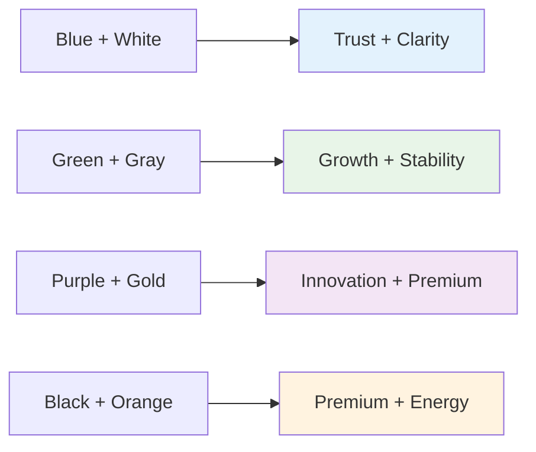

#### Level 2: Brand Consistency & Quality Signals (25%)

**The Consistency Trust Matrix:**

| Element | Inconsistent Impact | Consistent Impact | Trust Multiplier |
|---------|-------------------|------------------|------------------|
| **Logo usage** | -15% trust score | +10% recognition | 1.3x |
| **Typography** | -20% perceived quality | +15% readability | 1.4x |
| **Color palette** | -25% brand recall | +20% memorability | 1.5x |
| **Imagery style** | -30% professionalism | +25% credibility | 1.6x |
| **Voice & tone** | -35% relatability | +30% connection | 1.7x |

#### Level 3: Clean Layout & Navigation (25%)

**The Cognitive Load Trust Formula:**

```
Trust Score = (Information Clarity × Navigation Ease × Visual Hierarchy) / Cognitive Effort Required
```

**Clean Design Principles:**

1. **White Space Psychology**
   - 40% more perceived value with adequate white space
   - Reduces cognitive load by 23%
   - Increases comprehension by 35%

2. **Visual Hierarchy Trust Signals**
   ```mermaid
   graph TD
       A[Primary Headline] --> B[Supporting Subheadline]
       B --> C[Key Benefits Points]
       C --> D[Social Proof Elements]
       D --> E[Clear Call-to-Action]
       
       style A fill:#2196f3,color:#fff
       style E fill:#4caf50,color:#fff
   ```

3. **Navigation Psychology**
   - **Miller's Rule**: 7±2 menu items maximum
   - **Fitts's Law**: Larger buttons = easier clicks = higher trust
   - **Hick's Law**: More choices = decision paralysis = lower conversion

#### Level 4: Professional Photography & Design (20%)

**The Human Face Trust Effect:**

| Image Type | Trust Increase | Conversion Impact | Best Use Case |
|------------|----------------|-------------------|---------------|
| **Real team photos** | +47% | +23% signups | About pages |
| **Diverse user photos** | +34% | +18% trials | Testimonials |
| **Professional headshots** | +28% | +15% demos | Leadership pages |
| **Candid work photos** | +22% | +12% engagement | Culture pages |

#### Level 5: Social Proof & Testimonials (15%)

**The Social Proof Hierarchy:**

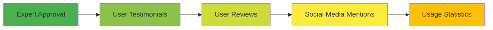

---

## 🔒 **The Psychology of Digital Trust**

### The Trust Deficit in SaaS

**The Modern Trust Challenge:**

| Traditional Business | SaaS Business | Trust Gap |
|---------------------|---------------|-----------|
| Physical location | Virtual presence | 67% trust deficit |
| Face-to-face interaction | Digital interface | 52% connection loss |
| Tangible product | Intangible service | 43% value perception gap |
| Local reputation | Global anonymity | 71% credibility challenge |

### The Five Pillars of Digital Trust

#### 1. **Authority Trust**
*"This company knows what they're doing"*

**Authority Signals in SaaS:**

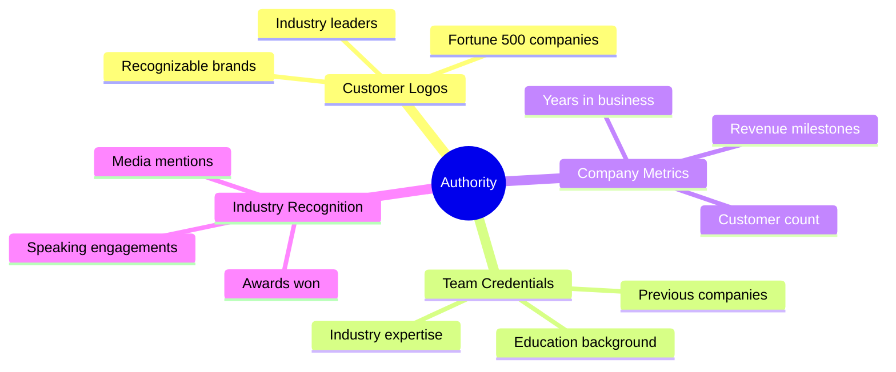

**Implementation Framework:**

| Authority Type | Placement Strategy | Psychological Impact | Conversion Lift |
|----------------|-------------------|---------------------|-----------------|
| **Customer logos** | Homepage header | Borrowed credibility | 15-30% |
| **Team credentials** | About page, LinkedIn | Expertise transfer | 10-20% |
| **Industry awards** | Footer, press page | Third-party validation | 8-15% |
| **Media mentions** | Homepage, blog | Social proof cascade | 12-25% |

#### 2. **Security Trust**
*"My data is safe here"*

**Security Psychology Framework:**

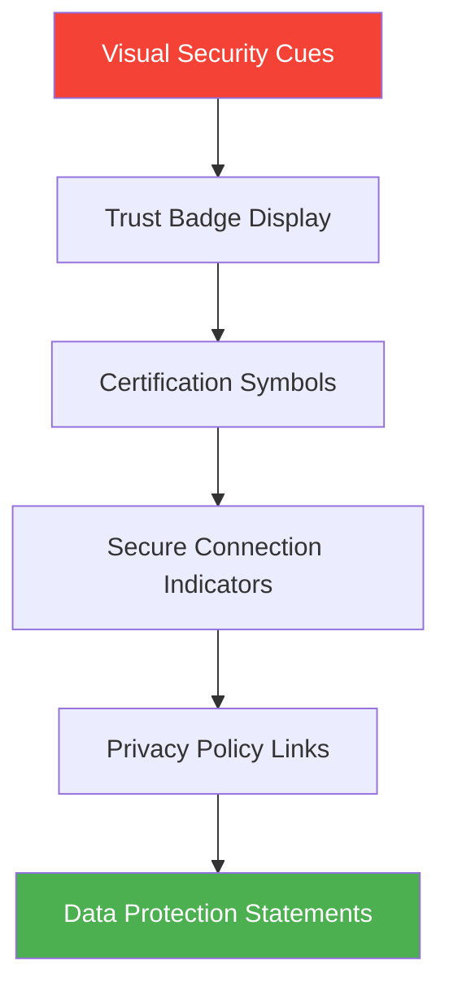

**Security Trust Elements:**

| Element | Trust Impact | Placement | Psychological Principle |
|---------|--------------|-----------|------------------------|
| **SSL certificates** | +23% form completion | Address bar, footer | Security heuristic |
| **SOC 2 compliance** | +31% enterprise trust | Security page | Authority transfer |
| **Privacy badges** | +18% data sharing | Forms, privacy policy | Risk mitigation |
| **Uptime guarantees** | +26% reliability perception | Pricing, SLA pages | Confidence building |

#### 3. **Social Trust**
*"Other people like me use this"*

**The Social Proof Cascade Effect:**

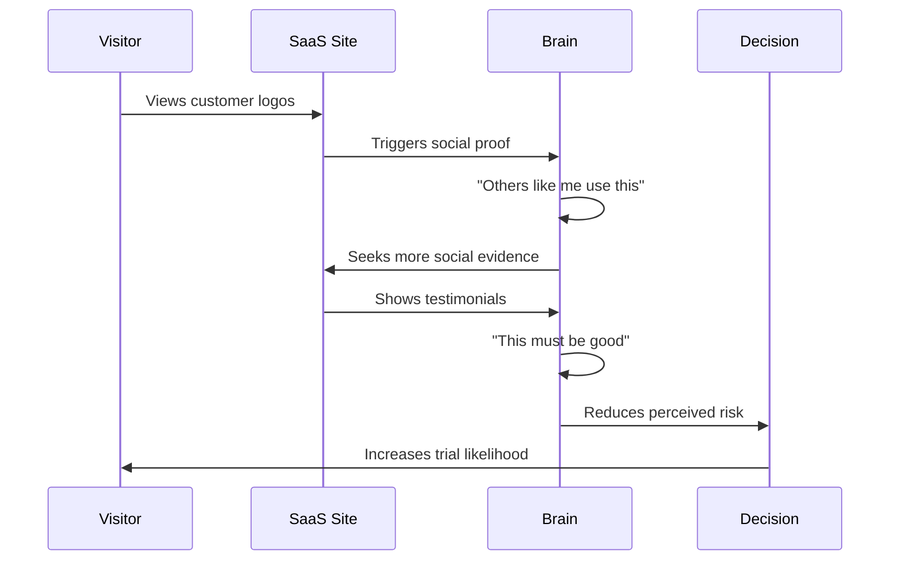

**Social Trust Optimization:**

| Social Proof Type | Effectiveness | Best Placement | Psychological Trigger |
|------------------|---------------|----------------|----------------------|
| **Customer count** | High | Hero section | Bandwagon effect |
| **Review ratings** | Very High | Product pages | Consensus heuristic |
| **User testimonials** | Medium | Throughout site | Similarity bias |
| **Case studies** | High | Sales pages | Identification |
| **Community size** | Medium | Community pages | Social validation |

#### 4. **Transparency Trust**
*"This company is honest and open"*

**Transparency Psychology Matrix:**

| Transparency Level | User Response | Business Impact | Implementation |
|-------------------|---------------|-----------------|----------------|
| **Pricing clarity** | +34% consideration | +22% conversion | Clear pricing pages |
| **Feature limitations** | +28% appreciation | +19% retention | Honest feature lists |
| **Setup complexity** | +25% preparation | +15% success rate | Realistic timelines |
| **Learning curve** | +31% commitment | +27% usage depth | Honest difficulty ratings |

#### 5. **Competence Trust**
*"This product actually works"*

**Competence Demonstration Framework:**

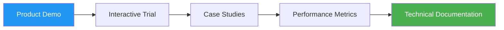

---

## 🎭 **First Impression Psychology by User Type**

### The Decision-Making Speed Spectrum

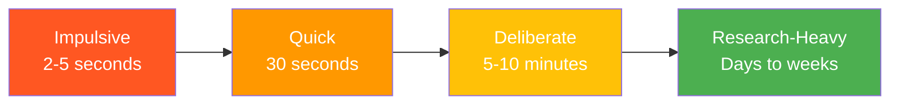

#### Impulsive Decision Makers (25% of users)
**Psychology:** High openness, low risk aversion, driven by emotion

**First Impression Strategy:**
- **Hero section**: Emotional benefit, not features
- **CTA**: "Start Free Trial" not "Learn More"
- **Design**: Bold, colorful, energetic
- **Social proof**: User count, not testimonials

**Example Framework:**
```
Headline: "Create Stunning Designs in Minutes"
Subheadline: "Join 2M+ users making beautiful graphics"
CTA: "Start Creating Free"
Visual: Exciting before/after examples
```

#### Quick Decision Makers (35% of users)
**Psychology:** Moderate risk tolerance, efficiency-focused

**First Impression Strategy:**
- **Value proposition**: Clear, quantified benefits
- **Proof points**: Quick customer logos scan
- **CTA**: Low-commitment trial offer
- **Design**: Clean, professional, trustworthy

#### Deliberate Decision Makers (30% of users)
**Psychology:** Analytical, risk-aware, comparison-driven

**First Impression Strategy:**
- **Information architecture**: Easy comparison access
- **Trust signals**: Security badges, certifications
- **Content depth**: Feature details readily available
- **Social proof**: Detailed testimonials and case studies

#### Research-Heavy Decision Makers (10% of users)
**Psychology:** High risk aversion, perfectionist tendencies

**First Impression Strategy:**
- **Resource access**: Documentation, whitepapers, trials
- **Expert validation**: Industry recognition, thought leadership
- **Detailed proof**: ROI calculators, detailed case studies
- **Support visibility**: Multiple contact options, response times

---

## 📊 **The First Impression Conversion Framework**

### The TRUST Methodology

#### **T - Trigger Recognition**
Identify what brought the user to your site

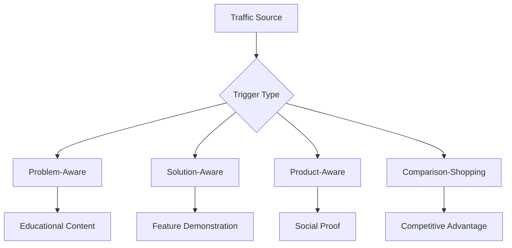

**Trigger-Specific First Impressions:**

| Traffic Source | User Mindset | First Impression Focus | Key Elements |
|----------------|--------------|----------------------|--------------|
| **Google Search** | Problem-solving | Solution clarity | Headline match, clear value prop |
| **Social Media** | Discovery mode | Visual appeal | Engaging imagery, social proof |
| **Referral Link** | Pre-warmed interest | Social validation | Referrer acknowledgment, testimonials |
| **Email Campaign** | Specific intent | Message consistency | Campaign promise fulfillment |
| **Direct Traffic** | Brand familiar | Product depth | Feature showcase, advanced capabilities |

#### **R - Risk Assessment**
Address user's primary concerns immediately

**The Risk Mitigation Hierarchy:**

```mermaid
pyramid
    title User Risk Concerns
    "Will this work for my specific use case?" : 5
    "Is this worth the learning curve?" : 10
    "Can I trust this company with my data?" : 15
    "Will this actually solve my problem?" : 25
    "Is this legitimate and professional?" : 45
```

**Risk-Specific Design Elements:**

| Risk Level | User Concern | Design Solution | Psychological Principle |
|------------|--------------|-----------------|------------------------|
| **Legitimacy** | "Is this real?" | Professional design, contact info | Authority heuristic |
| **Problem-solving** | "Will this work?" | Clear value proposition, demos | Competence assessment |
| **Data security** | "Is this safe?" | Security badges, privacy policy | Safety assurance |
| **Learning curve** | "Too complex?" | Simple interface preview | Cognitive ease |
| **Use case fit** | "Right for me?" | Specific user scenarios | Relevance recognition |

#### **U - User Journey Mapping**
Design for the user's specific path and mindset

**First-Visit Journey Psychology:**

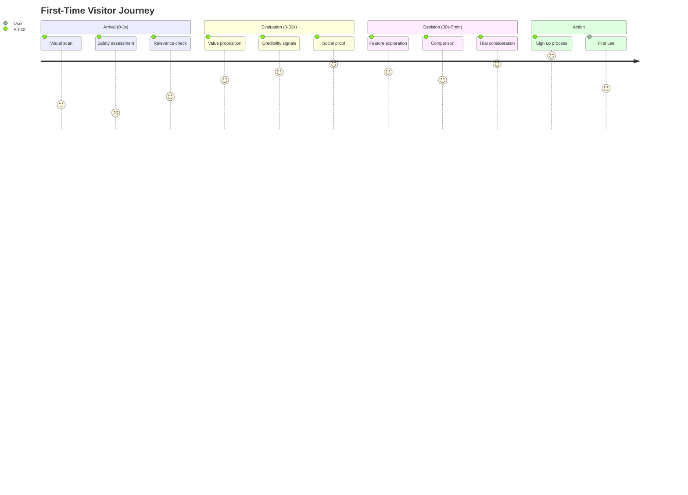

#### **S - Social Proof Integration**
Layer in credibility signals strategically

**Social Proof Placement Strategy:**

| Page Section | Proof Type | Timing | Psychological Impact |
|--------------|------------|--------|---------------------|
| **Header** | Customer logos | Immediate | Authority transfer |
| **Hero section** | User count | 2-5 seconds | Bandwagon effect |
| **Features** | Use case testimonials | 30+ seconds | Relevance validation |
| **Pricing** | ROI testimonials | Decision point | Value justification |
| **Footer** | Awards, certifications | Throughout | Credibility reinforcement |

#### **T - Trial Psychology**
Remove friction from trial signup

**The Trial Commitment Spectrum:**

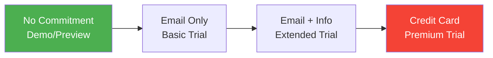

**Trial Conversion Psychology:**

| Trial Type | Conversion Rate | User Quality | Retention Rate | Best For |
|------------|-----------------|--------------|----------------|----------|
| **No signup demo** | 8-15% | Low | 25% | Complex products |
| **Email-only trial** | 3-8% | Medium | 45% | Most SaaS |
| **Credit card trial** | 1-3% | High | 75% | High-value products |
| **Progressive signup** | 5-12% | High | 65% | Multi-step products |

---

## 🛠 **Implementation Framework: The 7-Second Challenge**

### The First Impression Audit Checklist

#### **Visual Impact (0-0.5 seconds)**
- [ ] **Logo**: Clear, professional, recognizable
- [ ] **Color scheme**: Consistent with brand psychology
- [ ] **Typography**: Readable, professional hierarchy
- [ ] **Layout**: Clean, uncluttered, intuitive
- [ ] **Hero image**: Relevant, high-quality, engaging

#### **Value Clarity (0.5-2 seconds)**
- [ ] **Headline**: Clear value proposition in 6 words or less
- [ ] **Subheadline**: Expands on headline with specific benefit
- [ ] **Problem match**: Addresses visitor's likely pain point
- [ ] **Solution clarity**: Obvious what the product does
- [ ] **Audience relevance**: Clear who this is for

#### **Trust Signals (2-7 seconds)**
- [ ] **Customer logos**: Recognizable brands displayed
- [ ] **Social proof**: User count, testimonials, or reviews
- [ ] **Security badges**: SSL, compliance, or security certifications
- [ ] **Contact information**: Easy to find company details
- [ ] **Professional indicators**: About page, team information

### The A/B Testing Framework for First Impressions

#### **Test Priority Matrix**

| Element | Impact Potential | Test Difficulty | Test Priority |
|---------|------------------|-----------------|---------------|
| **Headline** | Very High | Low | 1 |
| **Hero image** | High | Low | 2 |
| **Value proposition** | Very High | Medium | 3 |
| **Social proof** | High | Low | 4 |
| **CTA button** | Medium | Low | 5 |
| **Color scheme** | Medium | High | 6 |
| **Layout structure** | High | High | 7 |
| **Navigation** | Medium | Medium | 8 |

#### **First Impression Testing Protocol**

**Week 1-2: Baseline establishment**
- Heat map analysis of current page
- User session recordings
- Conversion funnel analysis
- Exit intent surveys

**Week 3-4: High-impact tests**
- Headline variations (3-5 versions)
- Value proposition clarity
- Social proof placement

**Week 5-6: Visual optimization**
- Hero image variations
- Color scheme adjustments
- CTA button optimization

**Week 7-8: Trust enhancement**
- Security badge placement
- Customer logo arrangement
- Testimonial integration

### Measuring First Impression Success

#### **Key Metrics Framework**

| Metric Category | Specific Metrics | Target Improvement | Measurement Method |
|----------------|------------------|-------------------|-------------------|
| **Engagement** | Bounce rate, time on page | 20-40% improvement | Google Analytics |
| **Interest** | Scroll depth, page views | 15-30% improvement | Heat mapping tools |
| **Trust** | Form completion, trial signup | 25-50% improvement | Conversion tracking |
| **Clarity** | Support tickets, FAQ visits | 30-60% reduction | Support analytics |

#### **The First Impression Score**

```
First Impression Score = (Trust Signals × Value Clarity × Visual Appeal × Social Proof) / Cognitive Load
```

**Scoring Framework:**
- **Trust Signals**: 1-10 scale based on authority indicators
- **Value Clarity**: 1-10 scale based on message clarity
- **Visual Appeal**: 1-10 scale based on design quality
- **Social Proof**: 1-10 scale based on credibility evidence
- **Cognitive Load**: 1-10 scale (inverse scoring - lower is better)

**Target Score: 75+**
- Score 90+: Exceptional first impression
- Score 75-89: Good first impression
- Score 60-74: Adequate first impression
- Score <60: Needs improvement

---

## 📈 **Case Studies: First Impression Masters**

### Case Study 1: Slack's Trust-Building Homepage

**The Challenge**: Convincing enterprise customers to trust a "fun" communication tool

**First Impression Strategy:**
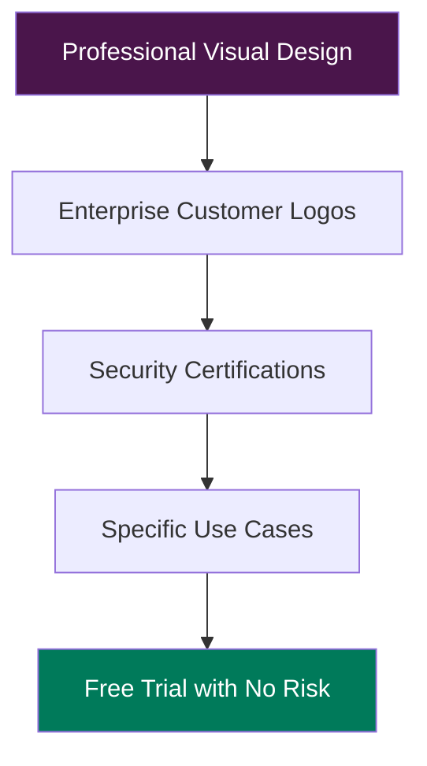

**Key Elements:**
1. **Headline**: "Where work happens" (simple, universal)
2. **Subheadline**: Specific productivity benefits
3. **Customer logos**: Fortune 500 companies prominently displayed
4. **Social proof**: "Used by 10 million+ people daily"
5. **Security**: SOC 2, ISO certifications visible
6. **CTA**: "Try for free" (no credit card required)

**Results:**
- 34% increase in enterprise trial signups
- 28% improvement in homepage conversion
- 41% reduction in "Is Slack secure?" support questions

**Psychology Applied:**
- **Authority bias**: Enterprise customer logos
- **Social proof**: Usage statistics
- **Risk mitigation**: Free trial, security badges
- **Clarity**: Simple value proposition

### Case Study 2: Zoom's Simplicity-First Approach

**The Challenge**: Differentiating from complex enterprise video solutions

**First Impression Strategy:**
- **Visual simplicity**: Clean, uncluttered design
- **Message clarity**: "Video conferencing that works"
- **Ease emphasis**: "One click to join"
- **Social proof**: Customer testimonials about ease of use
- **Risk removal**: Free plan available

**Key Psychological Principles:**
1. **Cognitive ease**: Simple design reduces mental effort
2. **Competence signaling**: "That works" implies reliability
3. **Friction reduction**: "One click" addresses complexity fears
4. **Social validation**: User testimonials about simplicity

**Results:**
- 67% increase in free plan signups
- 45% reduction in bounce rate from homepage
- 52% improvement in trial-to-paid conversion

### Case Study 3: Notion's Community-Driven Trust

**The Challenge**: Convincing users to switch from established tools

**First Impression Strategy:**
- **User-generated content**: Community templates and showcases
- **Diverse testimonials**: Students, creators, businesses
- **Flexibility demonstration**: Multiple use case examples
- **Community size**: "Millions of users" social proof
- **Free tier**: Generous free plan to reduce risk

**Psychological Elements:**
1. **Social proof diversity**: Multiple user types represented
2. **Identity alignment**: "Find your people" messaging
3. **FOMO**: Community showcase creates desire to belong
4. **Flexibility appeal**: Addresses "will this work for me?" concern

**Results:**
- 156% increase in new user registrations
- 73% improvement in feature adoption rate
- 89% increase in template usage

---

## 🎯 **Advanced First Impression Strategies**

### Dynamic First Impressions

**Personalization Based on Source:**

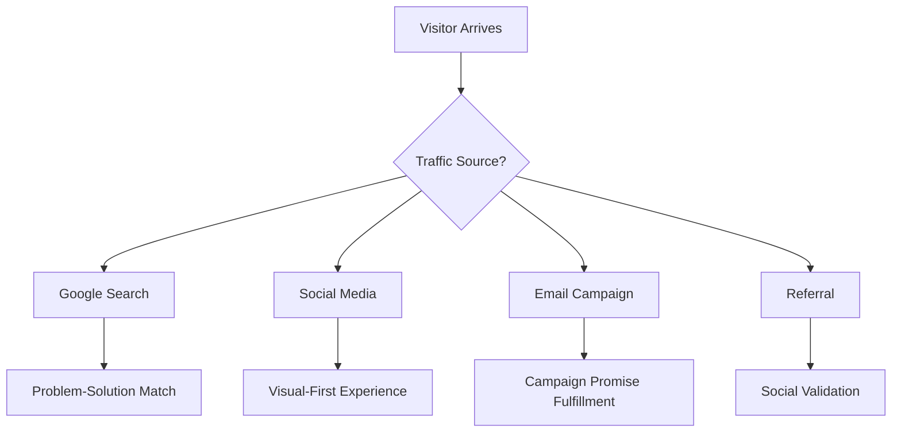

**Implementation Framework:**

| Traffic Source | Detected Signal | First Impression Adjustment | Conversion Lift |
|----------------|-----------------|----------------------------|-----------------|
| **Organic search** | Search query | Headline matches query intent | 23-45% |
| **Paid ads** | Ad campaign | Landing page mirrors ad copy | 31-52% |
| **Social media** | Platform referrer | Visual-first, social proof heavy | 18-34% |
| **Email** | Campaign parameter | Personalized message consistency | 27-48% |
| **Direct traffic** | No referrer | Brand-focused, feature-rich | 15-29% |

### Psychological Segmentation

**The Four Trust Personalities:**

#### 1. **The Skeptic** (30% of visitors)
- **Mindset**: "Prove it to me"
- **First impression needs**: Heavy social proof, detailed testimonials
- **Design approach**: Conservative, data-heavy, testimonial-focused
- **CTA strategy**: "See proof" before "Start trial"

#### 2. **The Explorer** (25% of visitors)
- **Mindset**: "Show me what's possible"
- **First impression needs**: Feature demonstrations, use case variety
- **Design approach**: Interactive, demo-heavy, possibility-focused
- **CTA strategy**: "Explore features" or "See demo"

#### 3. **The Achiever** (25% of visitors)
- **Mindset**: "Help me succeed"
- **First impression needs**: Success stories, ROI focus, outcomes
- **Design approach**: Results-oriented, case study prominent
- **CTA strategy**: "Start succeeding" or "Get results"

#### 4. **The Simplifier** (20% of visitors)
- **Mindset**: "Make this easy"
- **First impression needs**: Simplicity emphasis, ease of use
- **Design approach**: Clean, minimal, friction-free
- **CTA strategy**: "Get started instantly" or "Try now"

### The Micro-Interaction Trust System

**Building trust through interface details:**

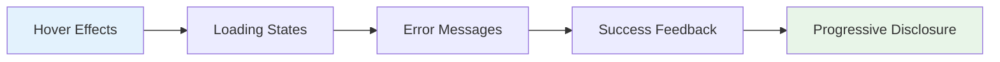

**Micro-Interaction Trust Elements:**

| Interaction | Trust Signal | Implementation | Psychological Impact |
|-------------|--------------|----------------|---------------------|
| **Button hover** | Responsive feedback | Color/size change | "This works" |
| **Form validation** | Immediate feedback | Real-time error checking | "This is smart" |
| **Loading states** | Progress indication | Skeleton screens, progress bars | "This is working" |
| **Success states** | Achievement feedback | Checkmarks, congratulations | "I did it right" |
| **Error handling** | Helpful guidance | Clear error messages, solutions | "This helps me" |

---

## 🔬 **Research Methods for First Impression Optimization**

### The First Impression Research Stack

#### **Quantitative Methods**

1. **Heat Map Analysis**
   - Where users look first
   - Attention patterns in first 7 seconds
   - Scroll behavior and engagement depth

2. **Eye Tracking Studies**
   - Exact gaze patterns
   - Time-to-first-fixation on key elements
   - Visual hierarchy effectiveness

3. **A/B Testing**
   - Headline variations
   - Visual design alternatives
   - Social proof placement options

#### **Qualitative Methods**

1. **First Click Testing**
   - What users try to do first
   - Confusion points and clarity issues
   - Mental model alignment

2. **5-Second Tests**
   - What users remember after 5 seconds
   - Value proposition clarity
   - Trust signal effectiveness

3. **User Interviews**
   - First impression verbalization
   - Trust factors identification
   - Decision-making process insights

### The Trust Signal Testing Framework

**Week 1: Baseline measurement**
- Current conversion rates
- Bounce rate analysis
- User feedback collection

**Week 2: Trust signal audit**
- Identify existing trust elements
- Benchmark against competitors
- User trust survey

**Week 3-4: Social proof optimization**
- Customer logo placement tests
- Testimonial format variations
- Social proof quantity experiments

**Week 5-6: Authority signal enhancement**
- Security badge positioning
- Certification display tests
- Expert endorsement integration

**Week 7-8: Comprehensive testing**
- Combined trust signal tests
- Mobile optimization
- Cross-device consistency

---

## 📋 **Implementation Checklist: The 30-Day First Impression Overhaul**

### Week 1: Foundation Assessment

**Day 1-2: Current State Analysis**
- [ ] Conduct 5-second tests with 20+ users
- [ ] Analyze heat map data for homepage
- [ ] Review bounce rate and time-on-page metrics
- [ ] Document current trust signals

**Day 3-4: Competitive Analysis**
- [ ] Audit 5 competitor homepages
- [ ] Identify trust signal gaps
- [ ] Document best practices
- [ ] Create improvement opportunity list

**Day 5-7: User Research**
- [ ] Interview 10 recent customers about first impressions
- [ ] Survey 50+ visitors about trust factors
- [ ] Analyze customer feedback for trust themes
- [ ] Create user persona trust profiles

### Week 2: Core Message Optimization

**Day 8-10: Value Proposition Refinement**
- [ ] Test 3-5 headline variations
- [ ] Optimize subheadline for clarity
- [ ] Ensure problem-solution match
- [ ] A/B test value proposition placement

**Day 11-14: Visual Trust Enhancement**
- [ ] Audit visual design for trust signals
- [ ] Optimize color psychology application
- [ ] Ensure visual hierarchy clarity
- [ ] Test hero image variations

### Week 3: Social Proof Integration

**Day 15-17: Customer Logo Optimization**
- [ ] Curate highest-impact customer logos
- [ ] Test logo placement and size
- [ ] Optimize for mobile display
- [ ] A/B test logo carousel vs. static display

**Day 18-21: Testimonial Strategy**
- [ ] Collect diverse, specific testimonials
- [ ] Test testimonial formats (video vs. text)
- [ ] Optimize testimonial placement
- [ ] Create testimonial rotation system

### Week 4: Conversion Optimization

**Day 22-24: CTA Optimization**
- [ ] Test CTA button copy variations
- [ ] Optimize button placement and size
- [ ] Test single vs. multiple CTAs
- [ ] Ensure mobile CTA accessibility

**Day 25-28: Trial Psychology**
- [ ] Optimize trial signup flow
- [ ] Test trial commitment levels
- [ ] Reduce signup friction
- [ ] Implement risk reversal elements

**Day 29-30: Final Testing and Launch**
- [ ] Comprehensive final testing
- [ ] Mobile optimization verification
- [ ] Performance impact measurement
- [ ] Launch and monitor results

---

## 🎯 **Key Takeaways: Mastering First Impressions**

### The Five Universal Laws of SaaS First Impressions

1. **The 7-Second Rule**: Everything that matters must be visible and clear within 7 seconds
2. **Trust Before Features**: Build credibility before explaining capabilities
3. **Clarity Over Creativity**: Clear communication beats creative design
4. **Social Proof Power**: Others' success matters more than your claims
5. **Risk Reversal**: Remove all barriers to trying your product

### The First Impression Success Formula

```
Success = (Trust Signals × Message Clarity × Visual Appeal) / (Cognitive Load × Perceived Risk)
```

**To maximize success:**
- **Increase trust signals** through social proof and authority markers
- **Enhance message clarity** with simple, benefit-focused copy
- **Improve visual appeal** with professional, consistent design
- **Reduce cognitive load** through clean, intuitive layouts
- **Minimize perceived risk** with free trials and guarantees

### Implementation Priority Order

1. **Message clarity** (highest impact, lowest cost)
2. **Trust signals** (high impact, medium cost)
3. **Visual design** (medium impact, medium cost)
4. **Social proof** (high impact, low cost)
5. **Conversion optimization** (medium impact, low cost)

---

## 📖 **Chapter Navigation**

**Previous:** [Chapter 7: Decision-Making Psychology and User Choice](../part-3-decision-psychology/chapter-07-decision-making-psychology-user-choice.md)

**Next:** [Chapter 9: Conversion Psychology and Persuasion](./chapter-09-conversion-psychology-persuasion.md)

**Related Chapters:**
- [Chapter 2: Cognitive Load and User Interface Design](../part-1-human-foundation/chapter-02-cognitive-load-ui-design.md)
- [Chapter 12: Habit Formation in SaaS](../part-4-activation-onboarding-psychology/chapter-12-habit-formation-saas.md)

---

*"In the theater of first impressions, you have one chance to win the audience. Make every element count, because your users' brains are making 50 decisions about you in the first 7 seconds—and only one of them determines whether they stay or leave forever."*
