# Chapter 9: Conversion Psychology

*The Science of Turning Visitors into Customers: Free Trials, Freemium, Pricing Psychology, and Action Triggers*

---

## 🎯 **The Conversion Psychology Imperative**

Converting visitors to customers isn't about tricks or manipulation—it's about understanding the deep psychological processes that drive human decision-making and aligning your product presentation with how the brain actually makes choices.

This chapter reveals the psychology behind free trials vs freemium models, pricing perception, form optimization, commitment psychology, and the call-to-action triggers that create genuine value for both businesses and customers.

# Chapter 9: Conversion Psychology

*The Psychology of Free Trials vs Freemium, Pricing Perception, Form Optimization, and Action Triggers*

---

## 🎯 **The Conversion Psychology Imperative**

Converting visitors to customers requires deep understanding of five critical psychological areas: how people evaluate free vs paid models, how they perceive value and pricing, why they abandon forms, what drives commitment, and what triggers action. This chapter reveals the science behind each area and how to optimize them for maximum conversion.

---

## 🧠 **The Psychology of Free Trials vs Freemium**

### The Mental Models Behind Free Access

When potential customers encounter "free" options, their brains process this information through distinct psychological pathways that determine both adoption and eventual conversion.


### The Neuroscience of "Free"

**How the Brain Processes Free Options:**

| Processing Stage | Free Trial Psychology | Freemium Psychology | Conversion Impact |
|------------------|----------------------|---------------------|-------------------|
| **Initial Reaction** | "Limited time - must evaluate quickly" | "No risk - can explore casually" | Trial: Immediate engagement<br>Freemium: Gradual adoption |
| **Usage Pattern** | Intensive evaluation within timeframe | Organic discovery over time | Trial: Deep feature usage<br>Freemium: Selective feature use |
| **Conversion Trigger** | Time pressure creates urgency | Feature limitation creates need | Trial: Deadline-driven<br>Freemium: Value-driven |
| **Decision Psychology** | Loss aversion (losing access) | Gain seeking (getting more features) | Trial: Fear-motivated<br>Freemium: Aspiration-motivated |

### Free Trial Psychology Deep Dive

#### **The Psychological Advantages of Free Trials**

**1. Eliminating Purchase Anxiety**


**2. The Endowment Effect in Trials**
Once users start using your product during a trial, they begin to feel psychological ownership, making cancellation feel like a loss rather than maintaining the status quo.

**3. Time-Based Commitment Psychology**
Limited time creates natural urgency and forces decision-making, preventing procrastination and analysis paralysis.

#### **Free Trial Optimization Framework**

**The TRIAL Psychology Method:**

| Component | Psychological Principle | Implementation | Conversion Impact |
|-----------|------------------------|----------------|-------------------|
| **T - Time Pressure** | Scarcity psychology | 14-day optimal length | +34% conversion vs unlimited |
| **R - Risk Reversal** | Loss aversion elimination | No credit card required | +67% signup rate |
| **I - Immediate Value** | Instant gratification | Quick wins in first session | +89% activation rate |
| **A - Assessment Tools** | Progress tracking | Usage analytics for users | +45% engagement |
| **L - Limited Friction** | Cognitive ease | Simple signup process | +56% completion rate |

### Freemium Psychology Deep Dive

#### **The Psychological Advantages of Freemium**

**1. Gradual Value Realization**


**2. Social Proof Amplification**
Free users create network effects and social validation that attract more users and legitimize the paid product.

**3. Data and Learning Investment**
Users invest time and data into the free version, creating switching costs and psychological ownership.

#### **Freemium Optimization Framework**

**The VALUE Psychology Method:**

| Component | Psychological Principle | Implementation | Conversion Impact |
|-----------|------------------------|----------------|-------------------|
| **V - Valuable Core** | Genuine utility | Solve real problems free | 80%+ user satisfaction |
| **A - Apparent Limitations** | Friction creation | Clear upgrade paths | 25-40% conversion rate |
| **L - Learning Investment** | Sunk cost effect | User data and customization | +78% retention |
| **U - Usage Momentum** | Habit formation | Daily/weekly engagement loops | +156% lifetime value |
| **E - Evolution Path** | Growth psychology | Natural progression to paid | +89% upgrade satisfaction |

### Free Trial vs Freemium Decision Framework

**When to Choose Free Trials:**


**Decision Matrix:**

| Factor | Free Trial Advantage | Freemium Advantage | Psychological Reason |
|--------|---------------------|-------------------|---------------------|
| **Complex B2B tools** | ✅ Full evaluation needed | ❌ Limited understanding | Comprehensive assessment required |
| **High-value products** | ✅ Justify premium pricing | ❌ Value not apparent | Price anchoring needs full experience |
| **Daily use products** | ❌ Artificial urgency | ✅ Natural habit building | Organic integration into routine |
| **Network effect products** | ❌ Limited network during trial | ✅ Builds network over time | Social value grows with user base |
| **Enterprise sales** | ✅ Decision committee evaluation | ❌ Individual vs team value | Committee needs comprehensive assessment |

---

## 💰 **Pricing Psychology and Value Perception**

### The Psychology of Price Evaluation

When customers see your pricing, their brains don't simply calculate ROI. Instead, they go through a complex psychological evaluation process that determines perceived value.


### The Cognitive Biases in Pricing Psychology

#### **1. Anchoring Bias in SaaS Pricing**

**The First Number Effect:**
The first price a customer sees becomes their reference point for all subsequent pricing evaluations.

**Strategic Anchoring Applications:**

| Anchoring Strategy | Psychological Effect | Implementation | Revenue Impact |
|-------------------|---------------------|----------------|----------------|
| **High-End First** | Makes mid-tier seem reasonable | Show enterprise pricing first | +23-45% average deal size |
| **Feature Anchoring** | Elevates perceived value | Highlight premium features | +18-35% value perception |
| **Competitive Anchoring** | Positions as affordable premium | "Compare to [expensive competitor]" | +15-30% preference |
| **Historical Anchoring** | Creates savings perception | "Was $200, now $149" | +12-28% conversion |

#### **2. Loss Aversion in Pricing**

**The Pain of Paying Psychology:**
The psychological pain of spending money is twice as powerful as the pleasure of gaining equivalent value.

**Loss Aversion Pricing Techniques:**


**Reframing Examples:**

| Traditional Pricing | Loss Aversion Pricing | Psychological Trigger | Conversion Lift |
|-------------------|----------------------|----------------------|-----------------|
| "$299/month" | "Don't lose $3,588/year to inefficiency" | Loss prevention | +34% |
| "Increase productivity" | "Stop wasting 15 hours/week" | Time loss awareness | +28% |
| "Better insights" | "Don't miss revenue opportunities" | Opportunity cost | +41% |
| "Premium features" | "Avoid falling behind competitors" | Competitive loss | +32% |

#### **3. The Decoy Effect**

**Strategic Inferior Options:**
A carefully crafted "decoy" option makes your target option appear more attractive by comparison.

**The Decoy Framework:**

```mermaid
graph TD
    A[Basic Plan<br/>$29] --> B[Target Plan<br/>$79 ⭐]
    C[Decoy Plan<br/>$69] --> B
    D[Premium Plan<br/>$199] --> B
    
    style B fill:#4caf50,color:#fff
```



**Decoy Psychology Types:**

| Decoy Type | Price vs Target | Features vs Target | Effect on Target Selection |
|------------|-----------------|-------------------|---------------------------|
| **Asymmetric Dominance** | 90% price, 70% features | Clearly inferior value | +45% selection increase |
| **Compromise Effect** | Position target as middle | Balanced choice appeal | +37% selection increase |
| **Attraction Effect** | Similar price, fewer features | Makes target obvious choice | +41% selection increase |

### Value Perception Psychology

#### **The Value Equation in Customer Minds**

```
Perceived Value = (Functional Benefits + Emotional Benefits + Social Benefits) / (Price + Time + Effort + Risk)
```

**Value Component Optimization:**

| Value Component | Psychological Driver | Enhancement Strategy | Impact |
|----------------|---------------------|---------------------|--------|
| **Functional Benefits** | Problem-solving need | Clear ROI demonstration | +56% consideration |
| **Emotional Benefits** | Status and confidence | Success stories, prestige | +34% desire |
| **Social Benefits** | Peer approval | Social proof, testimonials | +67% trust |
| **Price Resistance** | Loss aversion | Payment plan options | +23% conversion |
| **Time Investment** | Effort concern | Quick setup promises | +45% trial signup |
| **Risk Perception** | Fear of failure | Guarantees, references | +78% confidence |

---

## 📝 **Form Psychology and Friction Reduction**

### The Neuroscience of Form Abandonment

When users encounter forms, their brains undergo a cognitive evaluation that determines completion or abandonment. Understanding this process is crucial for conversion optimization.


### The Psychology of Form Fields

#### **Field-Level Psychology Optimization**

**Critical Psychological Factors:**

| Form Element | Psychological Impact | Optimization Strategy | Completion Impact |
|--------------|---------------------|----------------------|-------------------|
| **Field Count** | Cognitive load perception | Minimize visible fields | +67% completion per field removed |
| **Required vs Optional** | Effort vs choice balance | Mark optional clearly | +34% perceived control |
| **Field Labels** | Mental model alignment | Use familiar terminology | +23% understanding |
| **Error Messages** | Frustration and competence | Helpful, not punitive | +89% recovery rate |
| **Progress Indicators** | Goal gradient effect | Show advancement | +45% completion rate |

#### **The Form Friction Hierarchy**

```mermaid
pyramid
    title Form Friction Levels
    "Personal/Sensitive Information" : 10
    "Financial Information" : 15
    "Contact Information" : 20
    "Professional Information" : 25
    "Basic Preferences" : 30
```

**Field Psychology by Type:**

| Field Type | Abandonment Risk | Psychological Barrier | Optimization Approach |
|------------|------------------|----------------------|----------------------|
| **Email** | Low | Minimal privacy concern | Always collect first |
| **Name** | Low | Personal but expected | Use for personalization |
| **Phone** | Medium | Privacy and spam concern | Make optional when possible |
| **Company** | Medium | Professional relevance | Only for B2B products |
| **Credit Card** | High | Financial risk perception | Delay until maximum value shown |

### Form Psychology Optimization Framework

#### **The SIMPLE Method**

| Component | Psychological Principle | Implementation | Impact |
|-----------|------------------------|----------------|--------|
| **S - Single Column** | Cognitive flow | Vertical progression | +32% completion |
| **I - Immediate Feedback** | Error prevention | Real-time validation | +67% success rate |
| **M - Minimal Fields** | Cognitive load reduction | Ask only essentials | +89% completion per field |
| **P - Progress Indication** | Goal gradient effect | Visual progress bars | +45% completion |
| **L - Logical Grouping** | Mental model alignment | Related fields together | +23% understanding |
| **E - Error Recovery** | Frustration minimization | Helpful error messages | +156% recovery |

#### **Advanced Form Psychology Techniques**

**1. The Commitment Escalation Pattern**


**2. Social Proof in Forms**
- "Join 50,000+ professionals" (social validation)
- "Used by teams at Google, Apple, Microsoft" (authority transfer)
- "Trusted by 10,000+ companies" (bandwagon effect)

**3. Scarcity in Form Context**
- "Limited spots available" (FOMO activation)
- "Offer expires in 24 hours" (time pressure)
- "Only 47 licenses left" (inventory scarcity)

---

## 🤝 **The Psychology of Commitment and Consistency**

### Cognitive Dissonance and Commitment

Once people make a commitment, they experience psychological pressure to act consistently with that commitment to avoid cognitive dissonance.


### The Commitment Escalation Framework

#### **Building Commitment Gradually**

**The Micro-Commitment Ladder:**

| Commitment Level | Example | Psychological Investment | Conversion Impact |
|------------------|---------|-------------------------|-------------------|
| **Micro** | Email signup | Minimal identity investment | 3-5% conversion to next |
| **Small** | Profile creation | Personal information sharing | 15-25% conversion |
| **Medium** | Content creation | Time and effort investment | 35-50% conversion |
| **Large** | Payment commitment | Financial investment | 70-85% retention |
| **Identity** | Public advocacy | Reputation investment | 90%+ loyalty |

#### **Commitment Psychology Techniques**

**1. The Foot-in-the-Door Technique**
Start with small, easy commitments that increase the likelihood of larger commitments later.

**SaaS Applications:**
- Email signup → Profile completion → Feature setup → Payment
- Free trial → Basic usage → Advanced features → Upgrade
- Individual use → Team invitation → Admin setup → Enterprise features

**2. Public Commitment Psychology**
Public commitments are more powerful because they involve reputation and social identity.

**Implementation Strategies:**
- Social media sharing of goals or achievements
- Team dashboards showing individual progress
- Public profiles and accomplishments
- Community participation and contributions

**3. Written Commitment Power**
Written commitments are psychologically stronger than verbal ones due to the effort investment and permanent record.

**SaaS Applications:**
- Goal-setting features with written objectives
- Custom onboarding questionnaires
- Personalized success plans
- Implementation timelines and milestones

### Consistency Principle Applications

#### **Identity-Based Consistency**

**Helping Users See Themselves as Your Customer Type:**

| User Identity | Consistency Message | Behavioral Outcome | Implementation |
|---------------|--------------------|--------------------|----------------|
| **Innovative Leader** | "Forward-thinking leaders choose..." | Adopts cutting-edge features | Feature positioning |
| **Efficiency Expert** | "Productivity experts rely on..." | Uses time-saving features | Workflow optimization |
| **Team Builder** | "Great team leaders use..." | Invites team members | Collaboration features |
| **Data-Driven** | "Smart analysts depend on..." | Uses analytics features | Reporting tools |

---

## 🚀 **CTA Psychology and Action Triggers**

### The Neuroscience of Action

When users see a call-to-action, their brains undergo a rapid evaluation process that determines whether they take action or ignore the prompt.


### The Psychology of Effective CTAs

#### **The ACTION Framework**

| Component | Psychological Principle | Implementation | Conversion Impact |
|-----------|------------------------|----------------|-------------------|
| **A - Attention** | Visual prominence | Color contrast, size | +45% visibility |
| **C - Clarity** | Cognitive ease | Clear, specific language | +67% comprehension |
| **T - Trust** | Risk mitigation | Security signals | +34% confidence |
| **I - Incentive** | Value perception | Benefit emphasis | +56% motivation |
| **O - Opportunity** | Scarcity psychology | Limited time/quantity | +78% urgency |
| **N - Now** | Present bias | Immediate action words | +89% immediacy |

#### **CTA Language Psychology**

**Power Words That Trigger Action:**

| Word Category | Psychological Trigger | Examples | Usage Context |
|---------------|----------------------|----------|---------------|
| **Urgency** | Time pressure | "Now," "Today," "Instantly" | Limited offers |
| **Exclusivity** | Status appeal | "Exclusive," "VIP," "Members-only" | Premium features |
| **Ease** | Effort reduction | "Simple," "Easy," "Effortless" | Complex products |
| **Results** | Outcome focus | "Get," "Achieve," "Discover" | Value proposition |
| **Social** | Belonging need | "Join," "Become," "Connect" | Community features |

### Advanced CTA Psychology Techniques

#### **1. The Zeigarnik Effect in CTAs**

**Leveraging Unfinished Tasks:**
The brain remembers interrupted tasks better than completed ones, creating psychological tension until completion.

**Applications:**
- "Complete your setup" (implies unfinished business)
- "Finish your profile" (continuation motivation)
- "Resume your trial" (incomplete experience)

#### **2. Loss Aversion in Action Language**

**From Gain to Loss Framing:**

| Gain Frame | Loss Frame | Psychological Impact |
|------------|------------|---------------------|
| "Get 30% more leads" | "Don't lose 30% of potential leads" | +34% urgency |
| "Save 5 hours per week" | "Stop wasting 5 hours per week" | +28% motivation |
| "Increase team productivity" | "End team inefficiency now" | +41% action rate |

#### **3. Social Proof in CTAs**

**Leveraging Others' Actions:**
- "Join 50,000+ users" (bandwagon effect)
- "See why Google trusts us" (authority transfer)
- "Start like 500 others did today" (social validation)

#### **4. Curiosity Gap CTAs**

**Creating Information Gaps:**
- "Discover what 90% of companies miss"
- "See the strategy leaders don't share"
- "Uncover your hidden potential"

### CTA Placement Psychology

#### **The Visual Hierarchy of Action**


**Placement Psychology Rules:**

| Location | Psychological Context | Best CTA Type | Conversion Rate |
|----------|----------------------|---------------|-----------------|
| **Header/Hero** | High attention, low context | Primary action (signup/trial) | 3-8% |
| **After value prop** | Moderate attention, high context | Feature-specific action | 5-12% |
| **Mid-page** | Lower attention, maximum context | Educational (demo/learn) | 2-6% |
| **Exit intent** | Low attention, departure moment | Last chance offer | 10-25% |

### Mobile CTA Psychology

#### **Touch Psychology Considerations**

**Thumb-Friendly Design:**
- **Thumb zone optimization**: Place CTAs in natural thumb reach
- **Touch target size**: Minimum 44px for comfortable tapping
- **Spacing psychology**: Adequate space prevents accidental clicks

**Mobile-Specific Psychology:**
- **Urgency amplification**: Mobile users expect immediate action
- **Simplicity requirement**: Fewer words, clearer meaning
- **Context sensitivity**: Location and time awareness

---

## 📊 **Measuring Conversion Psychology Success**

### The Conversion Psychology Metrics Framework

#### **Beyond Basic Conversion Rates**


**Psychological Success Indicators:**

| Metric | Psychological Significance | Measurement Method | Target |
|--------|---------------------------|-------------------|--------|
| **Attention Rate** | Interest capture | Time on page, scroll depth | >60% scroll |
| **Engagement Quality** | Value perception | Pages per session, return visits | >3 pages |
| **Form Completion** | Commitment level | Field completion rates | >70% |
| **Trial Activation** | Value realization | Feature usage in trial | >5 features |
| **Conversion Timeline** | Decision confidence | Time from signup to purchase | <14 days |

### A/B Testing Psychological Hypotheses

#### **Psychology-Based Testing Framework**

**Test Priority Matrix:**

| Psychology Principle | Test Difficulty | Impact Potential | Priority |
|---------------------|----------------|------------------|----------|
| **Loss aversion messaging** | Low | High | 1 |
| **Social proof placement** | Low | Medium | 2 |
| **Scarcity indicators** | Low | Medium | 3 |
| **Anchoring price display** | Medium | High | 4 |
| **Form field reduction** | Medium | High | 5 |

#### **Psychological Test Examples**

**1. Free Trial vs Freemium Test**
- **Hypothesis**: Free trial creates higher urgency and faster conversion
- **Test**: 50/50 split between 14-day trial and freemium
- **Metrics**: Signup rate, activation rate, conversion rate, LTV
- **Psychology**: Time pressure vs gradual investment

**2. Loss Aversion Pricing Test**
- **Hypothesis**: Loss-framed pricing increases urgency
- **Test**: "Save $1,200/year" vs "Get advanced features for $100/month"
- **Metrics**: Conversion rate, time to decision
- **Psychology**: Loss aversion vs gain seeking

**3. Form Length Psychology Test**
- **Hypothesis**: Shorter forms increase completion despite less qualification
- **Test**: 3-field vs 7-field signup form
- **Metrics**: Completion rate, lead quality, conversion rate
- **Psychology**: Cognitive load vs commitment escalation

---

## 🎯 **Key Takeaways: Mastering Conversion Psychology**

### The Universal Laws of Conversion Psychology

1. **Free Reduces Friction, But Strategy Determines Value**: The psychology of free trials vs freemium depends on your user behavior and product complexity
2. **Price is Relative, Value is Psychological**: Customers don't evaluate absolute price—they evaluate perceived value against reference points
3. **Forms Are Commitment Tests**: Every field is a psychological hurdle that tests user motivation
4. **Consistency Drives Conversion**: Small commitments lead to larger ones through psychological consistency pressure
5. **Action Language Determines Action**: The psychology of your CTA language directly impacts conversion rates

### The Conversion Psychology Success Formula

```
Conversion Success = (Value Clarity × Trust × Urgency) / (Friction × Risk × Cognitive Load)
```

### Implementation Priority Order

1. **Value proposition clarity** (foundation for all conversion)
2. **Friction reduction** (remove conversion barriers)
3. **Trust building** (enable confident action)  
4. **Commitment escalation** (build investment gradually)
5. **Action optimization** (perfect the conversion moment)

---

## 📖 **Chapter Navigation**

**Previous:** [Chapter 8: First Impressions and Trust Building](./chapter-08-first-impressions-trust-building.md)

**Next:** [Chapter 10: Viral Growth Psychology](./chapter-10-viral-growth-psychology.md)

**Related Chapters:**
- [Chapter 7: Decision-Making Psychology and User Choice](../part-3-decision-psychology/chapter-07-decision-making-psychology-user-choice.md)
- [Chapter 10: Pricing Psychology and Value Perception](./chapter-10-pricing-psychology-value-perception.md)

---

*"Conversion is not about convincing people to buy—it's about removing every psychological barrier between them and the value they're seeking. When you align your conversion process with human psychology, customers don't feel sold to; they feel understood."*

---

## 🔄 **The Conversion Funnel Psychology**

### The Five-Stage Conversion Mind Journey

#### Stage 1: Awareness (Problem Recognition)
**Brain State:** Heightened attention, pattern recognition
**Psychological Need:** Understanding and relevance
**Conversion Goal:** Problem-solution fit recognition


**Optimization Strategies:**
- **Problem amplification**: Help users recognize pain points
- **Relevance signaling**: Clear audience targeting
- **Solution preview**: Brief glimpse of resolution

#### Stage 2: Interest (Solution Evaluation)
**Brain State:** Reward system activation, information seeking
**Psychological Need:** Benefit understanding and credibility
**Conversion Goal:** Solution desirability establishment

**The Interest Escalation Framework:**

| Interest Level | Brain Activity | User Behavior | Conversion Actions |
|----------------|----------------|---------------|-------------------|
| **Casual** | Low dopamine | Quick scanning | Headline optimization |
| **Moderate** | Increased attention | Feature exploration | Benefit demonstrations |
| **High** | Reward anticipation | Deep engagement | Social proof integration |
| **Intense** | Action preparation | Comparison research | Competitive differentiation |

#### Stage 3: Consideration (Option Comparison)
**Brain State:** Analysis mode, risk evaluation
**Psychological Need:** Comparison framework and trust
**Conversion Goal:** Preferred option status

**The Consideration Psychology Matrix:**


#### Stage 4: Intent (Purchase Decision)
**Brain State:** Decision commitment, action preparation
**Psychological Need:** Confidence and ease
**Conversion Goal:** Purchase completion

**Intent Optimization Framework:**

| Barrier Type | Psychological Root | Conversion Solution | Impact |
|--------------|-------------------|-------------------|--------|
| **Complexity** | Cognitive overload | Simplified process | +45% |
| **Risk** | Loss aversion | Money-back guarantee | +38% |
| **Urgency** | Procrastination | Limited-time incentive | +32% |
| **Social** | Approval seeking | Testimonials at checkout | +27% |

#### Stage 5: Action (Completion)
**Brain State:** Motor execution, reward anticipation
**Psychological Need:** Progress feedback and success
**Conversion Goal:** Onboarding transition

---

## 🎯 **Advanced Conversion Psychology Techniques**

### The Psychological Conversion Levers

#### 1. **Temporal Discounting Optimization**
*"People value immediate rewards more than future benefits"*

**The Time-Value Psychology:**


**Application in SaaS:**

| Traditional Approach | Temporal Optimization | Psychological Principle | Conversion Impact |
|---------------------|----------------------|------------------------|-------------------|
| "Save time long-term" | "Get results today" | Immediate gratification | +34% |
| "ROI over 12 months" | "See impact in first week" | Present bias | +28% |
| "Build better processes" | "Fix current problems" | Loss aversion | +41% |
| "Future-proof solution" | "Immediate improvement" | Hyperbolic discounting | +36% |

#### 2. **Cognitive Load Reduction**
*"Less mental effort required = higher conversion rate"*

**The Cognitive Load Conversion Formula:**

```
Conversion Rate = (Perceived Value × Motivation) / (Cognitive Load × Friction)
```

**Load Reduction Strategies:**

| Load Type | Source | Solution | Impact |
|-----------|--------|----------|--------|
| **Information** | Too many options | Progressive disclosure | +43% |
| **Decision** | Complex choices | Guided recommendations | +38% |
| **Process** | Multi-step signup | Smart defaults | +35% |
| **Cognitive** | Unclear interface | Intuitive design | +41% |

#### 3. **Loss Aversion Amplification**
*"The pain of losing is twice as powerful as the pleasure of gaining"*

**Loss Framing in SaaS:**


**Loss Aversion Applications:**

| Loss Type | Traditional Frame | Loss Frame | Conversion Lift |
|-----------|------------------|------------|-----------------|
| **Time** | "Save 2 hours/week" | "Stop wasting 2 hours/week" | +29% |
| **Money** | "Increase revenue" | "Stop losing potential revenue" | +35% |
| **Opportunity** | "Grow faster" | "Don't fall behind competitors" | +42% |
| **Data** | "Better insights" | "Stop missing critical insights" | +31% |

### The Ethical Persuasion Framework

#### The Four Pillars of Ethical Conversion

1. **Genuine Value Creation**
   - Product must deliver promised benefits
   - Persuasion aligns with user needs
   - Long-term relationship focus

2. **Informed Decision Making**
   - Complete, accurate information
   - Clear terms and conditions
   - Transparent pricing

3. **Voluntary Choice**
   - No deceptive practices
   - Easy opt-out options
   - Respect for user autonomy

4. **Mutual Benefit**
   - Win-win outcomes
   - Sustainable relationships
   - Positive impact measurement

#### Ethical Persuasion Checklist

- [ ] Does this technique help users make better decisions?
- [ ] Would I be comfortable if this were used on me?
- [ ] Does this create genuine value for the user?
- [ ] Is the information complete and accurate?
- [ ] Can users easily change their mind?
- [ ] Does this build long-term trust?

---

## 📊 **Conversion Rate Optimization Psychology**

### The CRO Testing Framework

#### Psychological Test Prioritization


**Test Priority Matrix:**

| Test Category | Impact Level | Confidence Level | Priority | Timeline |
|---------------|--------------|------------------|----------|----------|
| **Headline changes** | High | High | 1 | Week 1 |
| **CTA optimization** | High | High | 2 | Week 2 |
| **Social proof** | Medium | High | 3 | Week 3 |
| **Color schemes** | Low | Medium | 4 | Week 4 |
| **Page layout** | High | Low | 5 | Research phase |

#### The Psychology-First Testing Approach

**Traditional A/B Testing:**
- Test random variations
- Focus on statistical significance
- Ignore psychological principles

**Psychology-First Testing:**
- Test psychological principles
- Predict outcome direction
- Understand why changes work

**Example Framework:**

| Psychological Principle | Hypothesis | Test Design | Expected Outcome |
|------------------------|------------|-------------|------------------|
| **Loss aversion** | Loss framing increases urgency | "Don't miss out" vs "Get access" | Higher conversion |
| **Social proof** | Peer behavior influences action | Customer count vs testimonials | Higher credibility |
| **Scarcity** | Limited availability increases desire | "Limited spots" vs no urgency | Higher motivation |

### Advanced Testing Methodologies

#### 1. **Psychological Cohort Testing**

**Segment by psychological traits:**
- Risk tolerance levels
- Decision-making speed
- Social influence susceptibility
- Cognitive processing style

**Example Segmentation:**


#### 2. **Emotional Journey Testing**

**Map and optimize for emotional states:**

| Journey Stage | Emotional State | Optimization Focus | Test Variables |
|---------------|-----------------|-------------------|----------------|
| **Discovery** | Curious, hopeful | Interest amplification | Headlines, visuals |
| **Evaluation** | Analytical, cautious | Credibility building | Social proof, features |
| **Decision** | Anxious, excited | Confidence building | Guarantees, testimonials |
| **Completion** | Committed, anticipatory | Ease and progress | Process simplification |

#### 3. **Cognitive Load Testing**

**Measure and optimize mental effort:**

- **Task completion time**: Longer = higher cognitive load
- **Error rates**: More errors = confusion
- **Abandonment points**: Where users give up
- **Eye tracking**: Visual complexity measurement

---

## 🛠 **Conversion Psychology Implementation**

### The Comprehensive Conversion Audit

#### Stage 1: Psychological Baseline Assessment

**User Psychology Profiling:**

```mermaid
graph LR
    A[User Research] --> B[Psychological Profiles]
    B --> C[Conversion Barriers]
    C --> D[Opportunity Identification]
    D --> E[Testing Roadmap]
    
    style A fill:#2196f3,color:#fff
    style E fill:#4caf50,color:#fff
```

**Assessment Framework:**

| Research Method | Psychological Insights | Implementation Time | Cost |
|----------------|----------------------|-------------------|------|
| **User interviews** | Deep motivation understanding | 2-3 weeks | Medium |
| **Surveys** | Broad psychological patterns | 1 week | Low |
| **Behavioral analysis** | Actual vs stated behavior | Ongoing | Low |
| **Eye tracking** | Attention and cognitive load | 1-2 weeks | High |

#### Stage 2: Conversion Barrier Identification

**The Psychological Barrier Framework:**

```mermaid
flowchart TD
    A[Visitor Arrives] --> B{Attention Capture?}
    B -->|No| C[Attention Barriers]
    B -->|Yes| D{Interest Generation?}
    D -->|No| E[Interest Barriers]
    D -->|Yes| F{Desire Creation?}
    F -->|No| G[Desire Barriers]
    F -->|Yes| H{Action Taking?}
    H -->|No| I[Action Barriers]
    H -->|Yes| J[Conversion Success]
    
    style C fill:#f44336,color:#fff
    style E fill:#ff9800,color:#fff
    style G fill:#ff5722,color:#fff
    style I fill:#e91e63,color:#fff
    style J fill:#4caf50,color:#fff
```

**Barrier Analysis Matrix:**

| Barrier Type | Psychological Root | Common Causes | Solution Framework |
|--------------|-------------------|---------------|-------------------|
| **Attention** | Cognitive filtering | Unclear value prop | Message clarity |
| **Interest** | Motivation deficit | Irrelevant benefits | Benefit alignment |
| **Desire** | Emotional disconnect | Generic messaging | Personal connection |
| **Action** | Decision paralysis | Too many options | Choice simplification |

#### Stage 3: Psychological Optimization

**The CONVERT Framework:**

- **C**larify value proposition
- **O**ptimize for user psychology
- **N**avigate decision journey
- **V**alidate with social proof
- **E**liminate friction points
- **R**educe cognitive load
- **T**est psychological principles

### Implementation Roadmap

#### Month 1: Foundation Building

**Week 1: Research and Analysis**
- [ ] Conduct user psychology research
- [ ] Analyze current conversion data
- [ ] Identify top 3 psychological barriers
- [ ] Create user persona psychological profiles

**Week 2: Message Optimization**
- [ ] Test value proposition clarity
- [ ] Optimize headlines for psychological impact
- [ ] Implement benefit-focused messaging
- [ ] A/B test emotional vs rational appeals

**Week 3: Trust Building**
- [ ] Audit current trust signals
- [ ] Implement social proof elements
- [ ] Add security and credibility indicators
- [ ] Test testimonial placement and format

**Week 4: Friction Reduction**
- [ ] Simplify conversion process
- [ ] Reduce form fields
- [ ] Implement smart defaults
- [ ] Test single vs multi-step processes

#### Month 2: Advanced Optimization

**Week 5-6: Psychological Personalization**
- [ ] Implement dynamic content based on source
- [ ] Create persona-specific landing pages
- [ ] Test psychological segmentation
- [ ] Optimize for different decision styles

**Week 7-8: Emotional Optimization**
- [ ] Map emotional customer journey
- [ ] Implement emotion-specific messaging
- [ ] Test visual emotional triggers
- [ ] Optimize for emotional decision making

#### Month 3: Scaling and Refinement

**Week 9-10: Advanced Testing**
- [ ] Implement multivariate psychological tests
- [ ] Test complex psychological principles
- [ ] Optimize for cognitive processing styles
- [ ] Refine based on psychological insights

**Week 11-12: Integration and Scaling**
- [ ] Integrate successful psychological principles
- [ ] Scale winning variations
- [ ] Create psychological optimization playbook
- [ ] Establish ongoing testing framework

---

## 📈 **Case Studies: Conversion Psychology Masters**

### Case Study 1: Dropbox's Simplicity Psychology

**The Challenge**: Convincing users to trust a cloud storage service when "cloud" was new

**Psychological Strategy:**
- **Simplicity emphasis**: "Your files, anywhere"
- **Familiar metaphors**: Folder-based organization
- **Risk reduction**: Free tier with generous storage
- **Social proof**: "Used by 500 million people"

**Key Psychological Principles Applied:**

```mermaid
graph TD
    A[Cognitive Ease] --> B[Familiar Metaphors]
    B --> C[Simple Interface]
    C --> D[Clear Value Prop]
    D --> E[Risk Mitigation]
    E --> F[Social Validation]
    
    style A fill:#0061ff,color:#fff
    style F fill:#4caf50,color:#fff
```

**Results:**
- 60% increase in trial signups
- 40% improvement in trial-to-paid conversion
- 35% reduction in support questions about how it works

**Psychological Insights:**
- **Cognitive ease** reduces adoption barriers
- **Familiar metaphors** accelerate understanding
- **Risk reduction** enables trial behavior
- **Social proof** validates safety

### Case Study 2: Slack's Identity-Based Conversion

**The Challenge**: Convincing teams to switch from email for internal communication

**Psychological Strategy:**
- **Identity targeting**: "For teams that want to work better"
- **Progressive disclosure**: Start simple, reveal complexity gradually
- **Social learning**: Show how other teams use it
- **Habit replacement**: Position as email alternative, not addition

**Identity Alignment Framework:**

| Target Identity | Messaging | Psychological Trigger | Conversion Impact |
|-----------------|-----------|----------------------|-------------------|
| **Efficient teams** | "Stop wasting time in email" | Loss aversion | +34% |
| **Innovative companies** | "How modern teams communicate" | Social proof | +28% |
| **Growth-focused** | "Scale communication with your team" | Progress motivation | +31% |
| **Quality-oriented** | "Keep nothing lost, everything searchable" | Control needs | +26% |

**Results:**
- 89% increase in team trial signups
- 156% improvement in multi-user adoption
- 67% increase in paid plan conversion

### Case Study 3: Zoom's Frictionless Psychology

**The Challenge**: Competing with established video conferencing solutions

**Psychological Strategy:**
- **Friction elimination**: "One click to join"
- **Reliability emphasis**: "Video conferencing that works"
- **Ease demonstration**: No downloads for participants
- **Trust building**: Free tier with full functionality

**Friction Reduction Framework:**

```mermaid
graph LR
    A[Complex Setup] --> B[One-Click Join]
    C[Download Required] --> D[Browser-Based]
    E[Account Creation] --> F[Guest Access]
    G[Technical Issues] --> H["It Just Works"]
    
    style B fill:#4caf50,color:#fff
    style D fill:#4caf50,color:#fff
    style F fill:#4caf50,color:#fff
    style H fill:#4caf50,color:#fff
```

**Results:**
- 300% increase in meeting participation
- 145% improvement in host satisfaction
- 278% growth in paid subscriptions

**Psychological Insights:**
- **Friction removal** eliminates adoption barriers
- **Simplicity** reduces cognitive load
- **Reliability** builds trust through consistency
- **Ease** becomes competitive advantage

---

## 🎯 **The Future of Conversion Psychology**

### Emerging Psychological Principles

#### 1. **Neuromarketing Integration**
- Real-time brain response measurement
- Emotion detection through facial coding
- Physiological response optimization
- Subconscious preference identification

#### 2. **AI-Powered Personalization**
- Individual psychology profiling
- Dynamic content optimization
- Behavioral prediction models
- Micro-moment optimization

#### 3. **Extended Reality (XR) Psychology**
- Immersive experience design
- Spatial psychology principles
- Presence and embodiment effects
- Virtual social dynamics

### The Ethical Evolution

As conversion psychology becomes more sophisticated, ethical considerations become increasingly important:

- **Transparency requirements**: Clear disclosure of psychological techniques
- **User agency**: Maintaining genuine choice and control
- **Long-term relationships**: Focus on sustainable value creation
- **Privacy protection**: Responsible use of psychological data

---

## 📋 **Conversion Psychology Checklist**

### Pre-Launch Optimization Audit

#### **Psychological Foundation**
- [ ] Clear value proposition aligned with user psychology
- [ ] Trust signals prominently displayed
- [ ] Social proof strategically placed
- [ ] Risk mitigation elements present
- [ ] Cognitive load minimized

#### **Conversion Flow Psychology**
- [ ] Attention captured within 3 seconds
- [ ] Interest maintained through benefit focus
- [ ] Desire created through emotional connection
- [ ] Action barriers removed
- [ ] Process feedback provided

#### **Advanced Psychological Elements**
- [ ] Loss aversion techniques implemented
- [ ] Scarcity and urgency appropriately used
- [ ] Social proof diversity represented
- [ ] Authority signals established
- [ ] Reciprocity principles applied

#### **Testing and Optimization**
- [ ] A/B testing framework established
- [ ] Psychological hypotheses documented
- [ ] Success metrics defined
- [ ] User feedback collection system
- [ ] Continuous optimization process

---

## 🎯 **Key Takeaways: Mastering Conversion Psychology**

### The Universal Laws of SaaS Conversion

1. **Psychology Before Technology**: Understanding human behavior is more important than technical features
2. **Emotion Drives Decision**: People decide emotionally and justify rationally
3. **Cognitive Ease Wins**: Less mental effort required = higher conversion rates
4. **Trust Enables Action**: Without trust, no amount of persuasion works
5. **Value Must Be Obvious**: If users have to think about your value, you've lost them

### The Conversion Psychology Success Formula

```
Conversion Success = (Psychological Alignment × Trust × Value Clarity) / (Cognitive Load × Friction × Risk)
```

### Implementation Priority Order

1. **Trust building** (foundation for all other efforts)
2. **Message clarity** (ensure value is obvious)
3. **Friction reduction** (remove conversion barriers)
4. **Psychological optimization** (leverage human psychology)
5. **Advanced personalization** (tailor to individual psychology)

---

## 📖 **Chapter Navigation**

**Previous:** [Chapter 8: First Impressions and Trust Building](./chapter-08-first-impressions-trust-building.md)

**Next:** [Chapter 10: Pricing Psychology and Value Perception](./chapter-10-pricing-psychology-value-perception.md)

**Related Chapters:**
- [Chapter 4: The Psychology of Persuasion in SaaS](../part-2-behavioral-psychology/chapter-04-psychology-persuasion-saas.md)
- [Chapter 7: Decision-Making Psychology and User Choice](../part-3-decision-psychology/chapter-07-decision-making-psychology-user-choice.md)

---

*"Conversion isn't about tricking people into buying—it's about understanding their psychology so deeply that you can remove every barrier between them and the value they're seeking. When psychology and value align perfectly, conversion becomes inevitable."*
