# Chapter 10: Viral Growth Psychology

*Network Effects, Social Sharing, Referrals, and Community Psychology That Creates Exponential Growth*

---

## 🎯 **The Psychology of Exponential Growth**

Viral growth isn't about luck or gaming algorithms—it's about understanding the deep psychological motivations that drive people to share, refer, and invite others. The most successful SaaS companies have mastered the psychology behind network effects, social sharing, referral programs, viral loops, and community belonging.

This chapter reveals the psychological principles that power exponential growth, how to design viral loops that align with human psychology, and the science of building communities that naturally expand through psychological network effects.

---

## 🧠 **The Neuroscience of Viral Behavior**

### How the Brain Processes Sharing Decisions

When users consider sharing your product, their brains undergo a complex evaluation process that determines viral action or silence.

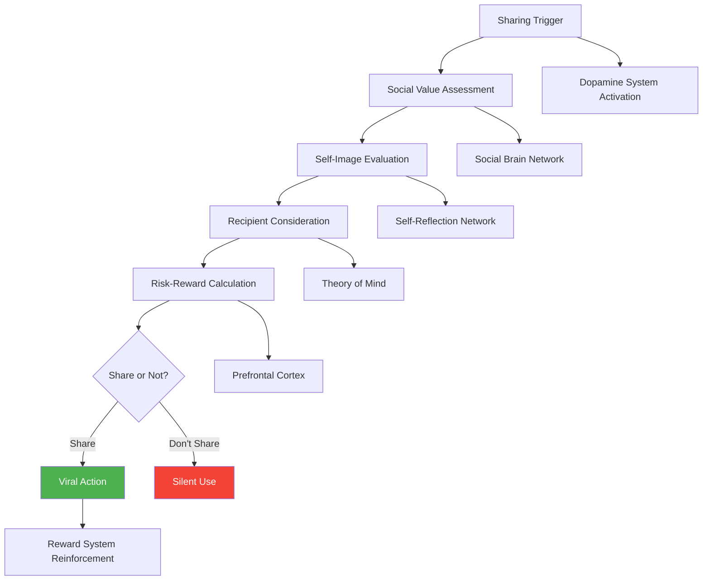

### The Sharing Psychology Timeline

**0-2 seconds: Automatic Social Evaluation**
- Mirror neurons assess social value
- Emotional response to sharing opportunity
- Initial impulse formation

**2-10 seconds: Self-Image Processing**
- "How will this reflect on me?"
- Identity alignment assessment
- Status impact consideration

**10-30 seconds: Recipient Analysis**
- "Who would benefit from this?"
- Relationship context evaluation
- Value-to-recipient calculation

**30+ seconds: Decision Commitment**
- Risk-reward final calculation
- Action commitment formation
- Sharing method selection

---

## 🌐 **Network Effect Psychology**

### The Psychology of Network Value

Network effects create psychological value that goes beyond functional utility, tapping into fundamental human needs for connection, status, and belonging.

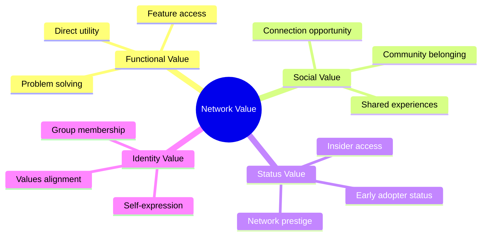

### Types of Network Effects and Their Psychology

#### **1. Direct Network Effects**
*"The more users, the more valuable for everyone"*

**Psychological Drivers:**
- **Social facilitation**: Performance improves in presence of others
- **Network externalities**: Individual benefit from group size
- **Communication utility**: Value increases with connection possibilities

**SaaS Examples:**
- **Slack**: More team members = more communication value
- **Zoom**: More users = more meeting possibilities
- **WhatsApp**: Larger network = more connection opportunities

**Psychological Optimization Strategies:**

| Strategy | Psychological Principle | Implementation | Network Growth |
|----------|------------------------|----------------|----------------|
| **Network visualization** | Social proof | Show user network size | +34% invitation rate |
| **Connection facilitation** | Social bonding | Easy contact discovery | +67% network expansion |
| **Activity indicators** | Social presence | Show who's online/active | +45% engagement |
| **Network prompts** | Social facilitation | "X colleagues are here" | +89% join likelihood |

#### **2. Indirect Network Effects**
*"Platform value increases with ecosystem participants"*

**Psychological Drivers:**
- **Variety-seeking**: Desire for diverse options and experiences
- **Quality improvement**: Better outcomes through competition
- **Ecosystem trust**: Platform credibility through participation

**SaaS Examples:**
- **Salesforce AppExchange**: More apps = more utility
- **Shopify**: More merchants = better ecosystem
- **Zapier**: More integrations = more possibilities

#### **3. Data Network Effects**
*"More usage creates better product intelligence"*

**Psychological Drivers:**
- **Competence enhancement**: Better performance through intelligence
- **Personalization value**: Tailored experiences increase attachment
- **Predictive utility**: Anticipatory features create dependence

**SaaS Examples:**
- **Spotify**: More listening = better recommendations
- **Grammarly**: More writing = better suggestions
- **LinkedIn**: More profiles = better matching

#### **4. Social Network Effects**
*"Status and belonging drive network participation"*

**Psychological Drivers:**
- **Status signaling**: Network membership communicates identity
- **Social validation**: Peer presence validates choices
- **Belonging needs**: Community membership fulfills relatedness

**SaaS Examples:**
- **GitHub**: Developer community status
- **Behance**: Creative professional network
- **LinkedIn**: Professional network prestige

### Network Effect Measurement Psychology

**The Network Psychology Metrics:**

| Metric | Psychological Significance | Measurement | Target |
|--------|---------------------------|-------------|--------|
| **Network Density** | Connection strength | Connections per user | Industry-specific |
| **Active Network Ratio** | Engagement quality | Active connections/total | >60% |
| **Network Clustering** | Community formation | Groups within network | Multiple clusters |
| **Cross-Network Activity** | Value realization | Inter-user interactions | Growing trend |

---

## 📱 **Social Sharing Motivations**

### The Five Core Sharing Motivations

Understanding why people share is crucial for designing viral features that align with natural human psychology.

#### **1. Status Enhancement**
*"I want to look good to my network"*

**Psychological Mechanism:**
- Social comparison theory drives status-seeking behavior
- Sharing high-value content elevates perceived expertise
- Association with quality products improves reputation

**SaaS Applications:**

| Sharing Opportunity | Status Signal | Implementation | Viral Coefficient |
|-------------------|---------------|----------------|-------------------|
| **Achievement sharing** | Competence display | "I completed 100% setup" | 1.2-1.5 |
| **Insight sharing** | Intelligence signal | "My data shows..." | 0.8-1.2 |
| **Tool sharing** | Resource provision | "This tool helps with..." | 1.5-2.0 |
| **Success sharing** | Accomplishment display | "I achieved X with Y" | 1.8-2.3 |

#### **2. Altruism and Helping**
*"I want to help others succeed"*

**Psychological Mechanism:**
- Empathy drives desire to help similar others
- Reciprocity expectations create sharing motivation
- Helper's high: psychological reward from assisting others

**Optimization Strategies:**

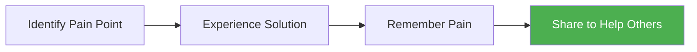

**Implementation Framework:**

| Helper Motivation | Sharing Trigger | Message Frame | Response Rate |
|------------------|-----------------|---------------|---------------|
| **Problem solving** | After successful resolution | "Help others solve this too" | 34% |
| **Time saving** | After efficiency gain | "Save others time like I did" | 28% |
| **Learning** | After skill acquisition | "Share knowledge with peers" | 41% |
| **Discovery** | After finding valuable tool | "Others should know about this" | 37% |

#### **3. Self-Expression**
*"This represents who I am"*

**Psychological Mechanism:**
- Identity signaling through product association
- Values communication through sharing choices
- Personality expression via tool selection

**Identity-Based Sharing Categories:**

| Identity Type | Product Association | Sharing Behavior | Viral Impact |
|---------------|-------------------|------------------|--------------|
| **Innovator** | Cutting-edge tools | Early adoption sharing | High reach, low conversion |
| **Educator** | Learning platforms | Knowledge sharing | Medium reach, high conversion |
| **Achiever** | Productivity tools | Success sharing | Medium reach, medium conversion |
| **Creator** | Design/content tools | Creation sharing | High reach, high conversion |

#### **4. Social Connection**
*"I want to connect and bond with others"*

**Psychological Mechanism:**
- Shared experiences create social bonds
- Common tools facilitate collaboration
- Mutual activities strengthen relationships

**Connection-Driven Sharing:**

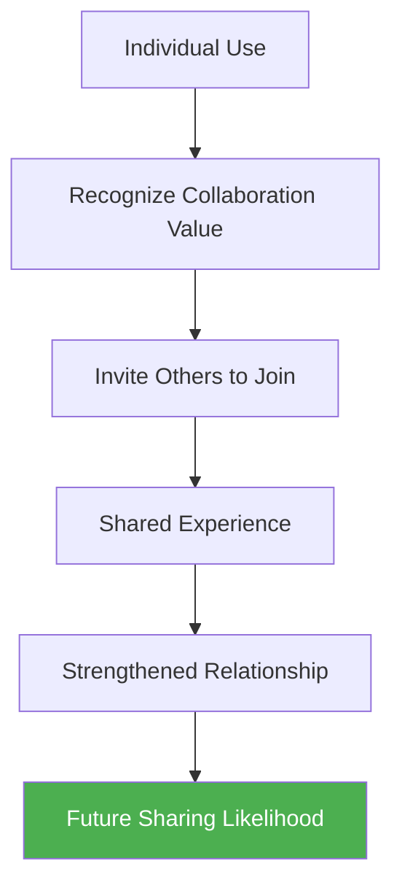

#### **5. Reciprocity Expectation**
*"If I share valuable things, others will share with me"*

**Psychological Mechanism:**
- Social exchange theory drives reciprocal behavior
- Building social capital through value provision
- Creating obligation through helpful sharing

---

## 🎁 **Referral Program Psychology**

### The Psychology of Recommendation Behavior

Successful referral programs tap into deep psychological motivations that make sharing feel natural and rewarding rather than forced or manipulative.

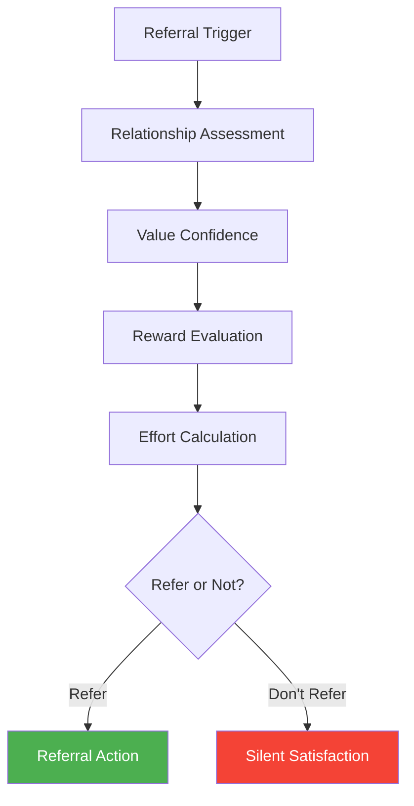

### The Referral Psychology Framework

#### **The REFER Model**

| Component | Psychological Principle | Implementation | Impact |
|-----------|------------------------|----------------|--------|
| **R - Relationship** | Social bond strength | Target close connections | +156% success rate |
| **E - Experience** | Satisfaction level | Trigger after positive experience | +89% willingness |
| **F - Fit Assessment** | Relevance evaluation | Help assess recipient fit | +67% quality |
| **E - Ease** | Effort minimization | Simple sharing process | +134% completion |
| **R - Reward** | Reciprocity activation | Mutual benefit design | +78% motivation |

#### **Referral Timing Psychology**

**The Optimal Referral Moment:**

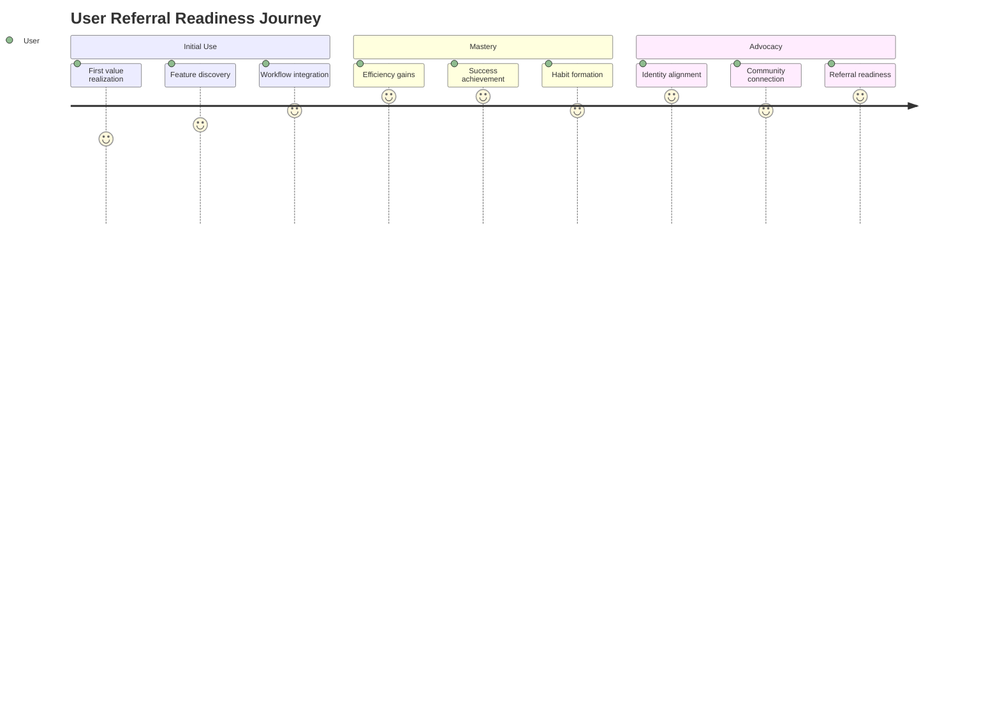

**Psychological Readiness Indicators:**

| Indicator | Psychological State | Referral Likelihood | Timing Strategy |
|-----------|-------------------|-------------------|-----------------|
| **Repeated usage** | Habit formation | 65% | After 7+ days active use |
| **Feature depth** | Value realization | 78% | After using 3+ core features |
| **Success achievement** | Competence satisfaction | 89% | After completing key goal |
| **Positive support** | Trust establishment | 67% | After positive service experience |

### Referral Reward Psychology

#### **Intrinsic vs Extrinsic Motivation Balance**

**The Motivation Spectrum:**

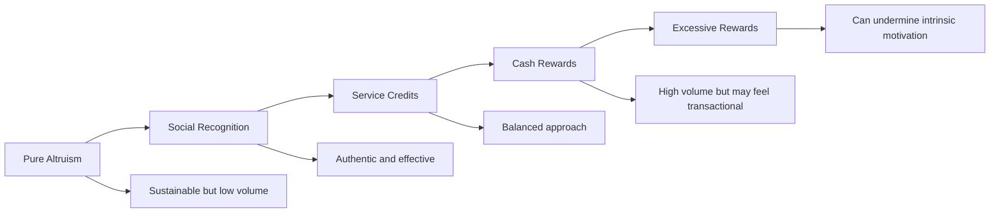

**Reward Psychology Guidelines:**

| Reward Type | Psychological Effect | Best Application | Potential Risks |
|-------------|---------------------|------------------|-----------------|
| **No reward** | Pure altruism | High-satisfaction products | Low participation |
| **Recognition** | Status enhancement | Professional/B2B products | Limited scalability |
| **Product credits** | Value alignment | Subscription services | Usage dependency |
| **Cash rewards** | Extrinsic motivation | High-value products | Transactional feeling |
| **Reciprocal benefits** | Mutual value | Network effect products | Complexity management |

#### **The Optimal Referral Reward Formula**

```
Reward Value = (Customer LTV × Referral Success Rate × Psychological Motivation Factor) / Acquisition Cost
```

**Psychological Motivation Factors:**

| Factor | Multiplier | Reasoning |
|--------|------------|-----------|
| **Altruistic satisfaction** | 1.2x | Helper's high effect |
| **Social recognition** | 1.5x | Status enhancement value |
| **Reciprocal benefit** | 1.8x | Mutual value creation |
| **Monetary reward** | 2.0x | Direct financial incentive |
| **Excessive reward** | 0.7x | Overjustification effect |

---

## 🔄 **Viral Loop Design**

### The Psychology of Viral Mechanisms

A viral loop is a self-reinforcing cycle where user actions naturally lead to new user acquisition. The most effective viral loops align with psychological motivations rather than forcing artificial sharing.


### Types of Viral Loops and Their Psychology

#### **1. Product-Inherent Viral Loops**
*"The product works better when others use it"*

**Psychological Driver:** Functional necessity creates natural invitation behavior

**Examples:**
- **Slack**: Team communication requires team members
- **Google Docs**: Collaboration requires collaborators  
- **Calendly**: Scheduling requires participants

**Optimization Strategies:**

| Strategy | Psychological Principle | Implementation | Viral Coefficient |
|----------|------------------------|----------------|-------------------|
| **Necessity emphasis** | Functional requirement | "Add team to get started" | 2.0-3.5 |
| **Value demonstration** | Immediate benefit | Show collaboration value | 1.5-2.2 |
| **Friction reduction** | Effort minimization | Easy invitation process | +45% completion |
| **Progress dependency** | Goal gradient effect | Require others for completion | 1.8-2.8 |

#### **2. Social Recognition Viral Loops**
*"Sharing increases status and recognition"*

**Psychological Driver:** Status enhancement through public sharing

**Examples:**
- **LinkedIn**: Professional achievement sharing
- **GitHub**: Code contribution visibility
- **Behance**: Creative work showcase

**Social Recognition Framework:**

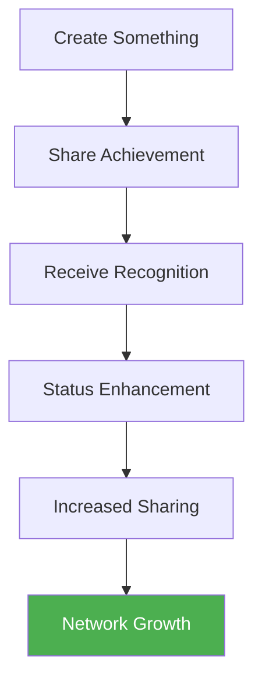

#### **3. Network Effect Viral Loops**
*"More users create more value for everyone"*

**Psychological Driver:** Network externalities increase personal value

**Implementation Psychology:**

| Network Type | Sharing Motivation | Viral Mechanism | Growth Rate |
|--------------|-------------------|-----------------|-------------|
| **Communication** | Contact necessity | Address book integration | Exponential |
| **Marketplace** | Buyer/seller balance | Cross-side incentives | Power law |
| **Social** | Community building | Friend discovery | Viral coefficient >1 |
| **Content** | Audience building | Creator-audience dynamics | Variable |

#### **4. Content-Driven Viral Loops**
*"Valuable content naturally gets shared"*

**Psychological Driver:** Value provision and status enhancement

**Content Virality Psychology:**

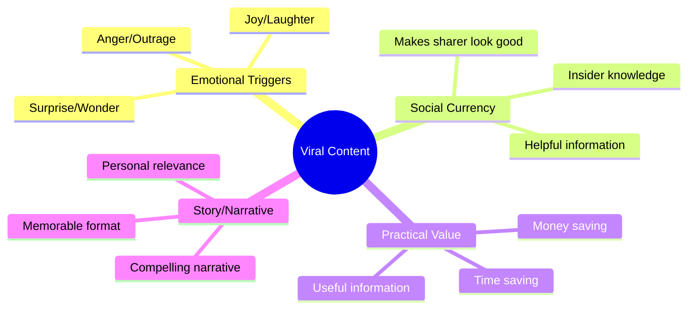

### Viral Loop Optimization Psychology

#### **The Viral Coefficient Psychology Formula**

```
Viral Coefficient = (Invitation Rate × Acceptance Rate × Conversion Rate)
```

**Psychological Optimization Points:**

| Component | Psychological Lever | Optimization Strategy | Impact |
|-----------|-------------------|----------------------|--------|
| **Invitation Rate** | Social motivation | Align with sharing psychology | +67% invitations |
| **Acceptance Rate** | Trust and relevance | Personalize invitations | +45% acceptance |
| **Conversion Rate** | Value demonstration | Immediate value delivery | +89% conversion |

#### **Friction Points Psychology**

**Common Psychological Barriers:**

| Barrier | Psychological Root | Solution | Improvement |
|---------|-------------------|----------|-------------|
| **Sharing hesitation** | Social risk aversion | Social proof of sharing | +34% sharing |
| **Invitation fatigue** | Effort aversion | Smart contact suggestion | +56% completion |
| **Acceptance skepticism** | Trust deficit | Sender credibility signals | +78% acceptance |
| **Onboarding friction** | Cognitive overload | Simplified new user flow | +89% conversion |

---

## 👥 **Community Psychology and Belonging**

### The Psychology of Community Formation

Communities don't just happen—they form through specific psychological processes that create belonging, identity, and mutual value creation.

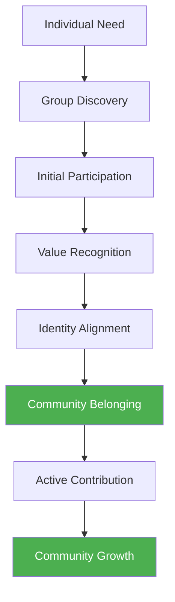

### The BELONG Framework for Community Psychology

#### **B - Boundaries and Identity**
*"Clear group definition creates belonging"*

**Psychological Principle:** In-group vs out-group psychology
**Implementation:** 
- Clear membership criteria
- Shared values and goals
- Distinct community culture
- Exclusive access or features

#### **E - Emotional Connection**
*"Shared experiences create bonds"*

**Psychological Principle:** Emotional contagion and empathy
**Implementation:**
- Shared challenges and victories
- Emotional storytelling
- Vulnerability and authenticity
- Mutual support systems

#### **L - Leadership and Hierarchy**
*"Structure provides security and aspiration"*

**Psychological Principle:** Need for order and status
**Implementation:**
- Clear community roles
- Recognition systems
- Expertise acknowledgment
- Growth pathways

#### **O - Opportunities for Contribution**
*"Contributing creates investment and ownership"*

**Psychological Principle:** Investment psychology and ownership
**Implementation:**
- User-generated content opportunities
- Peer helping systems
- Community governance participation
- Knowledge sharing platforms

#### **N - Norms and Shared Rituals**
*"Common practices create cohesion"*

**Psychological Principle:** Social conformity and tradition
**Implementation:**
- Community guidelines
- Regular events and activities
- Shared language and terminology
- Celebration rituals

#### **G - Growth and Learning**
*"Progress creates continued engagement"*

**Psychological Principle:** Competence and mastery needs
**Implementation:**
- Skill development opportunities
- Knowledge sharing
- Mentorship programs
- Progressive challenges

### Community Engagement Psychology

#### **The Participation Ladder**


**Psychological Motivations by Level:**

| Level | Primary Motivation | Psychological Need | Engagement Strategy |
|-------|-------------------|-------------------|-------------------|
| **Lurker** | Information seeking | Safety and learning | Valuable content, low barrier |
| **Participant** | Social connection | Belonging and acceptance | Easy contribution opportunities |
| **Contributor** | Recognition and impact | Esteem and influence | Acknowledgment and feedback |
| **Leader** | Purpose and legacy | Self-actualization | Leadership opportunities |
| **Champion** | Identity and mission | Transcendence | Advocacy and growth roles |

#### **Community Network Effects Psychology**

**The Community Value Formula:**

```
Community Value = (Member Quality × Interaction Density × Knowledge Sharing × Support Availability)²
```

**Network Effects in Communities:**

| Effect Type | Psychological Mechanism | Community Example | Growth Impact |
|-------------|------------------------|-------------------|---------------|
| **Knowledge Network** | Collective intelligence | Expert answers availability | Exponential learning |
| **Social Network** | Relationship building | Professional connections | Career advancement |
| **Support Network** | Mutual assistance | Problem-solving help | Reduced friction |
| **Innovation Network** | Collaborative creation | Co-creation opportunities | Enhanced product value |

---

## 📊 **Measuring Viral Growth Psychology**

### Viral Growth Psychology Metrics

#### **Beyond Viral Coefficient**

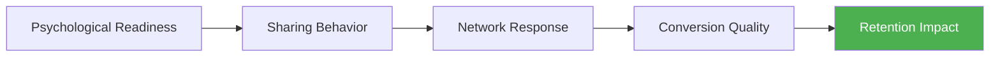

**Psychological Viral Metrics:**

| Metric | Psychological Significance | Measurement | Target |
|--------|---------------------------|-------------|--------|
| **Sharing Sentiment** | Positive association | NPS of sharers | >70 |
| **Network Quality** | Relationship strength | Connected user retention | >85% |
| **Community Health** | Belonging satisfaction | Active participation rate | >40% |
| **Viral Satisfaction** | Referral experience quality | Referrer satisfaction score | >8/10 |

#### **Psychological Cohort Analysis**

**Viral User Psychology Segments:**

| Segment | Characteristics | Viral Behavior | Optimization Strategy |
|---------|----------------|----------------|----------------------|
| **Natural Sharers** | High social motivation | Frequent, organic sharing | Provide easy sharing tools |
| **Selective Sharers** | Quality-focused | Infrequent but high-quality shares | Trigger after great experiences |
| **Reluctant Sharers** | Privacy-conscious | Rare sharing, needs incentive | Build trust, offer incentives |
| **Non-Sharers** | Individual-focused | Minimal sharing behavior | Focus on product value |

### A/B Testing Viral Psychology

#### **Viral Feature Testing Framework**

**Test Priority by Psychology:**

| Test Type | Psychological Hypothesis | Success Metric | Impact Potential |
|-----------|-------------------------|---------------|------------------|
| **Sharing triggers** | Timing affects willingness | Share rate | High |
| **Reward structure** | Motivation balance | Quality referrals | High |
| **Social proof** | Others' behavior influences | Conversion rate | Medium |
| **Community features** | Belonging increases retention | Community engagement | High |

---

## 📈 **Case Studies: Viral Growth Psychology Masters**

### Case Study 1: Slack's Network Effect Psychology

**The Challenge**: Creating viral growth in enterprise software

**Psychological Strategy:**
- **Necessity-based virality**: Team communication requires team members
- **Value demonstration**: Show immediate collaboration benefits
- **Social facilitation**: Better performance with more participants
- **Status psychology**: Early adopters gain organizational influence

**Viral Mechanism Design:**


**Results:**
- 2.18 viral coefficient at peak growth
- 67% of new teams came from referrals
- 89% team adoption rate within organizations

### Case Study 2: Dropbox's Referral Psychology

**The Challenge**: Growing storage service through user referrals

**Psychological Strategy:**
- **Mutual benefit**: Both referrer and referee get free storage
- **Scarcity psychology**: Limited free storage creates upgrade pressure
- **Altruism activation**: Help friends get free storage
- **Simple mechanics**: Easy sharing and tracking

**Referral Psychology Elements:**
- **Timing**: Triggered when users approach storage limits
- **Reward**: Valuable to both parties (free storage)
- **Effort**: Minimal friction in sharing process
- **Feedback**: Clear tracking of referral success

**Results:**
- 3900% growth in 15 months
- 35% of daily signups from referrals
- $388M acquisition cost savings

### Case Study 3: LinkedIn's Professional Network Psychology

**The Challenge**: Building professional network through viral growth

**Psychological Strategy:**
- **Status enhancement**: Professional profile as status symbol
- **Network externalities**: More connections = more opportunity
- **Social proof**: Show mutual connections and endorsements
- **Content sharing**: Professional content sharing for reputation

**Network Psychology Framework:**

| Psychology Principle | Implementation | Network Effect |
|---------------------|----------------|----------------|
| **Status signaling** | Professional achievements display | Profile completion |
| **Weak tie theory** | Connection suggestions | Network expansion |
| **Social proof** | Mutual connections display | Trust building |
| **Content virality** | Professional content sharing | Thought leadership |

**Results:**
- 85% of Fortune 500 executives have profiles
- Average user has 400+ connections
- 40% of users access weekly

---

## 🛠 **Implementation Framework: Viral Growth Psychology**

### The 90-Day Viral Psychology Implementation

#### Month 1: Foundation and Research

**Week 1: Viral Psychology Assessment**
- [ ] Analyze current sharing behavior patterns
- [ ] Identify natural viral moments in user journey
- [ ] Survey users about sharing motivations
- [ ] Map psychological barriers to viral growth

**Week 2: Network Effect Opportunities**
- [ ] Identify potential network effects in product
- [ ] Analyze collaboration and social features
- [ ] Map user relationship patterns
- [ ] Design network value propositions

**Week 3: Community Psychology Foundation**
- [ ] Assess community potential and needs
- [ ] Design belonging and identity elements
- [ ] Create community engagement framework
- [ ] Plan community leadership structure

**Week 4: Referral Psychology Design**
- [ ] Design referral program psychology
- [ ] Create optimal timing and triggers
- [ ] Develop reward psychology framework
- [ ] Build referral tracking and feedback

#### Month 2: Implementation and Testing

**Week 5-6: Viral Feature Development**
- [ ] Implement sharing psychology features
- [ ] Build network effect enhancements
- [ ] Create community psychology elements
- [ ] Develop referral program

**Week 7-8: Psychological Optimization**
- [ ] Test sharing motivation triggers
- [ ] Optimize network effect psychology
- [ ] Refine community belonging elements
- [ ] A/B test referral psychology

#### Month 3: Scaling and Refinement

**Week 9-10: Growth Acceleration**
- [ ] Scale successful viral psychology elements
- [ ] Expand network effect opportunities
- [ ] Grow community engagement
- [ ] Optimize referral conversion

**Week 11-12: Measurement and Iteration**
- [ ] Measure viral psychology success
- [ ] Analyze network effect growth
- [ ] Assess community health metrics
- [ ] Refine based on psychological insights

---

## 🎯 **Key Takeaways: Mastering Viral Growth Psychology**

### The Universal Laws of Viral Growth Psychology

1. **Viral Growth Follows Human Psychology**: Successful viral features align with natural sharing motivations, not forced behaviors
2. **Network Effects Are Social Psychology**: People join networks for status, belonging, and functional value
3. **Communities Form Through Belonging**: Identity, contribution opportunities, and shared experiences create lasting communities
4. **Referrals Require Relationship Psychology**: Understanding social bonds determines referral success
5. **Timing Is Psychological**: Viral triggers must align with user emotional and psychological states

### The Viral Psychology Success Formula

```
Viral Growth = (Sharing Motivation × Network Value × Community Belonging) / (Social Risk × Effort Required × Trust Barriers)
```

### Implementation Priority Order

1. **Natural viral moments** (align with existing user psychology)
2. **Network effect enhancement** (increase value through connections)
3. **Community belonging creation** (build identity and relationships)
4. **Referral psychology optimization** (perfect the recommendation experience)
5. **Advanced viral features** (innovate beyond standard approaches)

### The Viral Growth Psychology Maturity Model

```mermaid
pyramid
    title Viral Psychology Sophistication
    "AI-Powered Viral Optimization" : 10
    "Dynamic Community Psychology" : 15
    "Advanced Network Effects" : 20
    "Optimized Referral Psychology" : 25
    "Basic Sharing Features" : 30
```

---

## 📖 **Chapter Navigation**

**Previous:** [Chapter 9: Conversion Psychology](./chapter-09-conversion-psychology-persuasion.md)

**Next:** [Chapter 11: First-Use Psychology](../part-5-activation-psychology/chapter-11-first-use-psychology.md)

**Related Chapters:**
- [Chapter 20: Network Effects Psychology](../part-7-advanced-psychological-strategies/chapter-20-network-effects-psychology.md)
- [Chapter 26: The Psychology of Market Categories](../part-9-psychological-moats/chapter-26-psychology-market-categories.md)

---

*"Viral growth is not about getting lucky with an algorithm—it's about understanding the deep psychological motivations that drive human sharing behavior. When you align your viral features with authentic human psychology, growth becomes a natural byproduct of genuine value creation and social connection."*
