# Chapter 7: Decision-Making Psychology and User Choice

> *"The paradox of choice: More options lead to less satisfaction, but the right amount of choice leads to optimal outcomes."* - Barry Schwartz

## Table of Contents
- [Introduction: The Psychology of SaaS Decisions](#introduction-the-psychology-of-saas-decisions)
- [How Humans Make Decisions](#how-humans-make-decisions)
- [The Choice Architecture Framework](#the-choice-architecture-framework)
- [Cognitive Biases in SaaS Decision-Making](#cognitive-biases-in-saas-decision-making)
- [The Paradox of Choice in Software](#the-paradox-of-choice-in-software)
- [Decision Fatigue and Mental Load](#decision-fatigue-and-mental-load)
- [Pricing Psychology and Value Perception](#pricing-psychology-and-value-perception)
- [The Psychology of Free vs. Paid](#the-psychology-of-free-vs-paid)
- [Commitment and Decision Persistence](#commitment-and-decision-persistence)
- [Social Influence on Decision-Making](#social-influence-on-decision-making)
- [Regret and Post-Decision Psychology](#regret-and-post-decision-psychology)
- [Case Studies: Decision-Optimized SaaS](#case-studies-decision-optimized-saas)
- [Implementation Framework](#implementation-framework)
- [Conclusion: Designing for Confident Decisions](#conclusion-designing-for-confident-decisions)

---

## Introduction: The Psychology of SaaS Decisions

Every interaction with a SaaS product involves decisions—from the initial choice to sign up, to daily micro-decisions about which features to use, to the eventual renewal or cancellation decision. Understanding how users make these decisions is crucial for creating products that users choose confidently and stick with long-term.

The psychology of decision-making reveals that humans are not the rational actors that traditional economics assumes. Instead, we're cognitive misers who rely on mental shortcuts, are influenced by irrelevant factors, and often make choices that contradict our stated preferences.

### The Decision Landscape in SaaS

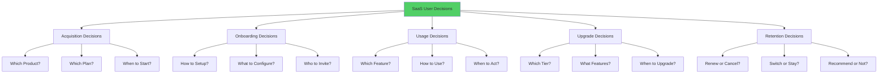

### The Cost of Poor Decision Design

| Decision Type | Poor Design Impact | Good Design Impact | Difference |
|---------------|-------------------|-------------------|------------|
| **Product Selection** | 67% abandon during evaluation | 23% abandon | 44% improvement |
| **Plan Choice** | 34% choose suboptimal plan | 12% regret choice | 22% optimization |
| **Feature Adoption** | 78% never discover key features | 34% quick adoption | 44% increase |
| **Upgrade Timing** | 89% delay beneficial upgrades | 45% timely upgrades | 44% acceleration |
| **Renewal Decision** | 32% churn due to complexity | 8% decision-based churn | 24% retention gain |

---

## How Humans Make Decisions

### The Dual-Process Theory of Decision-Making

#### System 1 vs. System 2 Thinking
Understanding the two modes of human decision-making:

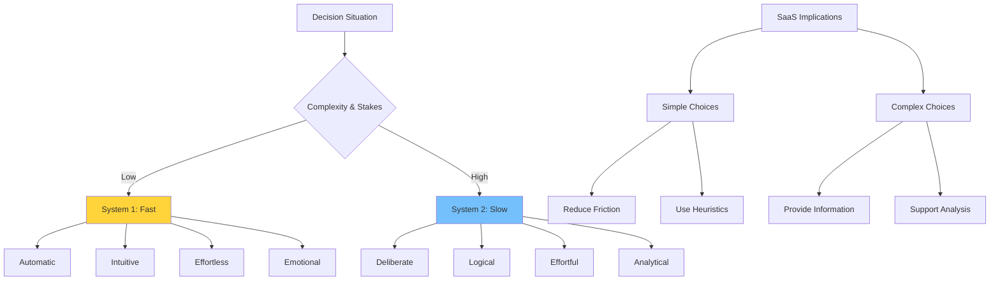

### The Decision-Making Process

#### The DECIDE Model in SaaS Context
How users actually make software decisions:

**D** - **Define** the problem or need
**E** - **Establish** criteria for solutions
**C** - **Consider** alternatives
**I** - **Identify** best alternatives
**D** - **Develop** and implement action plan
**E** - **Evaluate** and monitor outcomes

#### Real User Decision Process

| Stage | User Thoughts | SaaS Support Needed | Common Failures |
|-------|---------------|-------------------|----------------|
| **Problem Definition** | "I need to solve X" | Problem education | Unclear value props |
| **Criteria Setting** | "What matters most?" | Feature comparison | Too many options |
| **Alternative Search** | "What's available?" | Discoverable content | Poor SEO/marketing |
| **Evaluation** | "Which is best?" | Trials, demos, reviews | Information overload |
| **Decision** | "Let's try this one" | Easy signup, clear next steps | Friction, complexity |
| **Implementation** | "How do I use this?" | Onboarding, support | Poor user experience |
| **Evaluation** | "Is this working?" | Analytics, feedback | Unclear success metrics |

---

## The Choice Architecture Framework

### Nudge Theory in SaaS Design

#### The Power of Choice Architecture
How the presentation of options influences decisions:

**Key Principles:**
- **Default options** dramatically influence choice
- **Order effects** bias toward first or last options
- **Framing effects** change perception of identical options
- **Anchoring effects** set reference points for value

### Choice Architecture Elements

#### The NUDGES Framework
**N** - **iNcentives:** Align user and business interests
**U** - **Understand mappings:** Clear cause-and-effect relationships
**D** - **Defaults:** Set optimal default choices
**G** - **Give feedback:** Show results of choices
**E** - **Expect error:** Design for human mistakes
**S** - **Structure complex choices:** Simplify difficult decisions

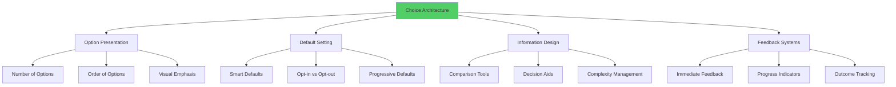

### Designing Effective Choice Sets

#### The Rule of Three in SaaS
Why three options often work best:

**Psychological Basis:**
- **Cognitive limit:** Easy to compare three options
- **Goldilocks effect:** Middle option feels "just right"
- **Decision confidence:** Not too few, not too many
- **Decoy effect:** Third option can guide choice

#### Option Set Optimization

| Number of Options | User Behavior | Optimal Use Case | Example |
|------------------|---------------|------------------|---------|
| **1 Option** | Take it or leave it | Simple upgrades | "Unlock premium features" |
| **2 Options** | Binary choice | Basic/Advanced tiers | Free vs. Pro |
| **3 Options** | Goldilocks effect | Standard pricing | Basic/Pro/Enterprise |
| **4+ Options** | Analysis paralysis | Complex enterprise | Only with good filtering |

---

## Cognitive Biases in SaaS Decision-Making

### Key Biases Affecting SaaS Choices

#### The Big Five SaaS Decision Biases

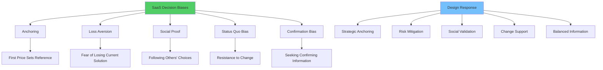

### Anchoring Bias in Pricing

#### How First Impressions Shape Value Perception
The first price users see becomes their reference point:

**Anchoring Strategies:**
- **High anchor:** Start with premium option
- **Value anchor:** Show cost of problem vs. solution
- **Time anchor:** Annual vs. monthly pricing presentation
- **Feature anchor:** Full feature list before pricing

#### Anchoring Implementation Examples

| Anchoring Type | Implementation | Psychological Effect | Conversion Impact |
|----------------|----------------|---------------------|------------------|
| **Price Anchoring** | Show enterprise price first | Makes standard plan seem reasonable | +34% Pro plan selection |
| **Value Anchoring** | "Saves 40 hours/month" | Justifies any reasonable price | +67% trial-to-paid |
| **Feature Anchoring** | List all premium features | Makes upgrade seem valuable | +45% upgrade rate |
| **Time Anchoring** | "Annual: Save 20%" | Makes annual feel like deal | +89% annual selection |

### Loss Aversion in SaaS

#### Why Users Fear Switching
People feel losses twice as strongly as equivalent gains:

**Loss Aversion Manifestations:**
- **Data loss fears:** "What if I lose my work?"
- **Learning cost anxiety:** "I'd have to relearn everything"
- **Integration disruption:** "This connects to everything"
- **Team resistance:** "Others won't want to switch"

#### Overcoming Loss Aversion

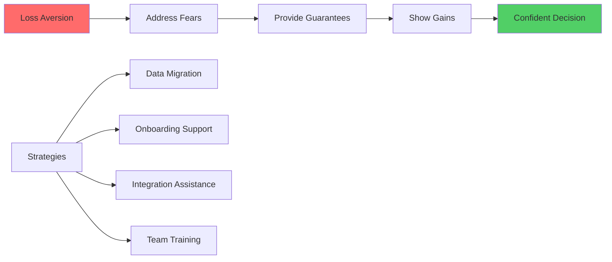

### Status Quo Bias

#### The Psychology of Switching Resistance
Why users stick with suboptimal solutions:

**Causes of Status Quo Bias:**
- **Endowment effect:** Current solution feels more valuable
- **Sunk cost fallacy:** Investment in current system
- **Uncertainty avoidance:** Unknown risks feel larger
- **Cognitive dissonance:** Admitting current choice was wrong

#### Overcoming Status Quo Bias

| Strategy | Implementation | Psychological Mechanism | Success Rate |
|----------|----------------|------------------------|-------------|
| **Free Trial** | Risk-free evaluation | Reduces uncertainty | +78% |
| **Migration Support** | White-glove onboarding | Minimizes switching costs | +89% |
| **Gradual Transition** | Parallel usage period | Reduces change shock | +67% |
| **Social Proof** | Similar company switches | Normalizes change | +56% |

---

## The Paradox of Choice in Software

### Understanding Choice Overload

#### When More Options Hurt Sales
The relationship between choice and satisfaction:

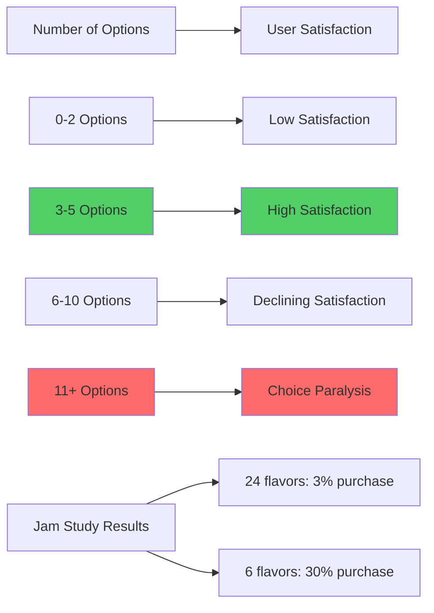

### Choice Overload in SaaS

#### Common Overload Scenarios

| Context | Too Many Choices | User Response | Business Impact |
|---------|------------------|---------------|----------------|
| **Pricing Plans** | 7+ tiers | Analysis paralysis | 45% abandon |
| **Feature Settings** | 50+ configuration options | Use defaults only | 23% feature adoption |
| **Integration Options** | 100+ available integrations | Overwhelm, select none | 67% skip setup |
| **Template Library** | 500+ templates | Search failure | 34% create from scratch |

### Solving Choice Overload

#### The Progressive Disclosure Strategy
Revealing complexity gradually:

**Level 1: Essential Choices**
- Core decisions only
- 2-3 primary options
- Clear recommendations

**Level 2: Important Choices**
- Secondary configurations
- 4-6 additional options
- Context-sensitive

**Level 3: Advanced Choices**
- Power user options
- Unlimited customization
- Expert-mode access

#### Choice Simplification Techniques

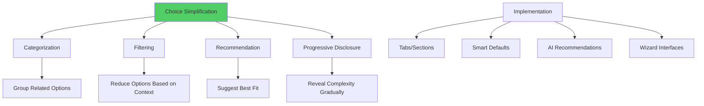

---

## Decision Fatigue and Mental Load

### The Psychology of Decision Fatigue

#### How Decision-Making Depletes Mental Resources
Every decision consumes cognitive energy:

**Decision Fatigue Effects:**
- **Quality deterioration:** Later decisions are worse
- **Default preference:** Choosing easiest option
- **Avoidance behavior:** Postponing decisions
- **Impulse choices:** Less self-control

### Measuring Mental Load in SaaS

#### Decision Load Assessment Framework

| Decision Type | Mental Load | Optimal Strategy | Example |
|---------------|-------------|------------------|---------|
| **Binary** | Low | Present clearly | Enable/Disable notifications |
| **Multiple Choice** | Medium | Limit to 3-7 options | Choose dashboard theme |
| **Configuration** | High | Smart defaults + customization | Email notification settings |
| **Complex Planning** | Very High | Guided wizard | Complete onboarding setup |

### Reducing Decision Fatigue

#### The Decision Budget Framework
Managing users' daily decision capacity:

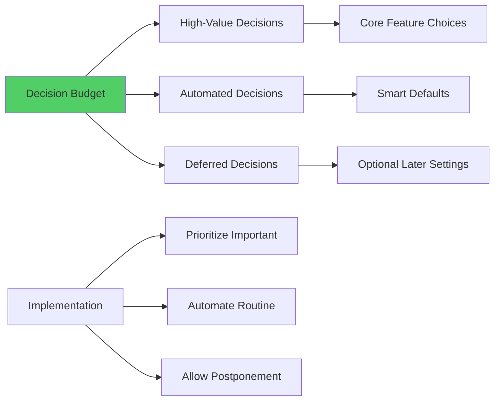

#### Smart Defaults Strategy

| Setting Category | Default Strategy | Customization Option | User Override Rate |
|-----------------|------------------|---------------------|-------------------|
| **Privacy Settings** | Most restrictive | Clear privacy controls | 23% |
| **Notification Preferences** | Moderate frequency | Granular controls | 67% |
| **Feature Configurations** | Most popular setup | Progressive customization | 34% |
| **Integration Settings** | Essential connections only | Full marketplace access | 45% |

---

## Pricing Psychology and Value Perception

### The Psychology of Price Perception

#### How Users Process Pricing Information
Price isn't just a number—it's a psychological signal:

**Price Psychology Principles:**
- **Reference price dependence:** Comparison to internal standard
- **Loss vs. gain framing:** Monthly cost vs. yearly savings
- **Payment pain:** Immediate vs. delayed payment
- **Value justification:** Price must match perceived value

### Psychological Pricing Strategies

#### The Price-Value Perception Matrix

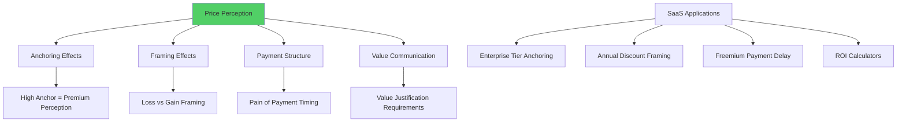

### Freemium Psychology

#### The Free-to-Paid Conversion Challenge
Understanding why users resist paying:

**Psychological Barriers:**
- **Loss aversion:** Paying feels like losing money
- **Endowment effect:** Free version feels valuable
- **Justification difficulty:** Hard to explain expense
- **Reference price:** Zero as comparison point

#### Overcoming Free-to-Paid Resistance

| Strategy | Psychological Mechanism | Implementation | Conversion Lift |
|----------|------------------------|----------------|----------------|
| **Usage-Based Limits** | Natural progression | "You've exceeded 100 projects" | +156% |
| **Feature Teasing** | Desire creation | "Unlock advanced analytics" | +89% |
| **Social Pressure** | FOMO activation | "Join 10,000+ Pro users" | +67% |
| **Time Pressure** | Scarcity motivation | "50% off for 48 hours" | +234% |

---

## The Psychology of Free vs. Paid

### Understanding "Free" Psychology

#### Why Free is Irrationally Attractive
The psychological power of zero price:

**Free Psychology Effects:**
- **Risk elimination:** No financial downside
- **Cognitive ease:** No cost-benefit analysis needed
- **Social acceptability:** Easy to share and recommend
- **Endowment creation:** Users invest time and data

### Freemium Conversion Psychology

#### The Value Realization Journey
How users transition from free to paid mindset:

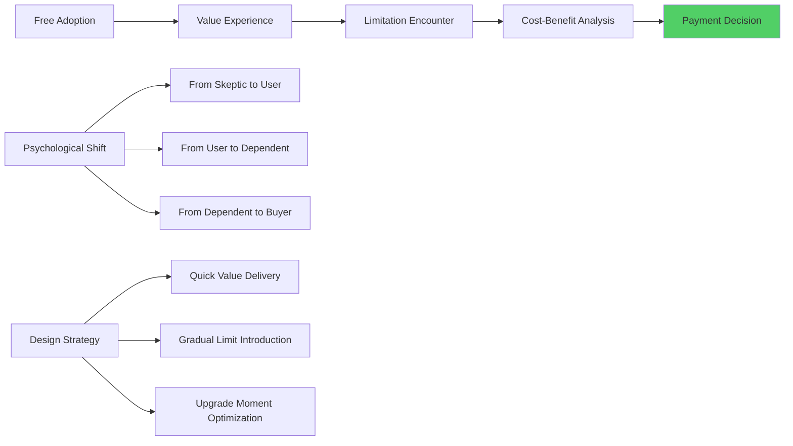

#### Conversion Optimization Strategies

| Conversion Stage | Psychological Need | Design Response | Success Metrics |
|-----------------|------------------|-----------------|----------------|
| **Initial Value** | Competence | Quick wins, easy success | Time to first value |
| **Habit Formation** | Autonomy | Customization, control | Daily/weekly usage |
| **Limit Encounter** | Relatedness | Team features, sharing | Social feature usage |
| **Upgrade Decision** | Identity | Professional status | Conversion rate |

---

## Commitment and Decision Persistence

### The Psychology of Commitment

#### Why Commitments Stick
How decisions create psychological lock-in:

**Commitment Mechanisms:**
- **Cognitive dissonance:** Must justify decisions
- **Sunk cost fallacy:** Past investment influences future
- **Identity consistency:** Decisions reflect self-concept
- **Social accountability:** Public commitments bind stronger

### Building Commitment Through Design

#### The Commitment Escalation Framework

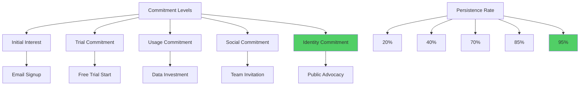

#### Commitment Design Strategies

| Commitment Type | Implementation | Psychological Effect | Retention Impact |
|----------------|----------------|---------------------|------------------|
| **Goal Setting** | Onboarding objectives | Internal motivation | +67% |
| **Public Declaration** | Social sharing | Social accountability | +89% |
| **Data Investment** | Profile completion | Sunk cost effect | +145% |
| **Team Integration** | Collaborative features | Network effect | +234% |
| **Identity Fusion** | Professional branding | Self-concept protection | +356% |

---

## Social Influence on Decision-Making

### Social Proof in Decision Context

#### How Others' Choices Influence Our Own
The power of social influence on individual decisions:

**Social Influence Types:**
- **Informational influence:** Others provide information
- **Normative influence:** Pressure to conform
- **Identification influence:** Desire to be like others
- **Authority influence:** Deference to experts

### Designing Social Decision Support

#### Social Validation Mechanisms

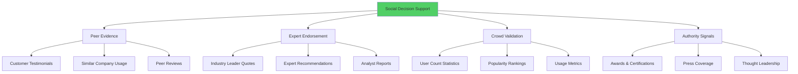

#### Social Proof Effectiveness by Decision Stage

| Decision Stage | Most Effective Social Proof | Conversion Impact | Implementation |
|---------------|----------------------------|------------------|----------------|
| **Awareness** | User count, growth metrics | +34% interest | Homepage statistics |
| **Evaluation** | Similar company case studies | +78% consideration | Targeted testimonials |
| **Trial** | Peer recommendations | +89% signup | Review integration |
| **Purchase** | Success stories, ROI data | +156% conversion | Checkout testimonials |
| **Renewal** | Loyalty indicators | +67% retention | Peer usage data |

---

## Regret and Post-Decision Psychology

### Understanding Decision Regret

#### The Psychology of Buyer's Remorse
Why users second-guess their choices:

**Regret Sources:**
- **Opportunity cost:** Wondering about alternatives
- **Expectation mismatch:** Reality vs. hopes
- **Complexity overwhelm:** Decision feels too hard
- **Social comparison:** Others seem to have better deals

### Preventing and Managing Regret

#### The Regret Prevention Framework

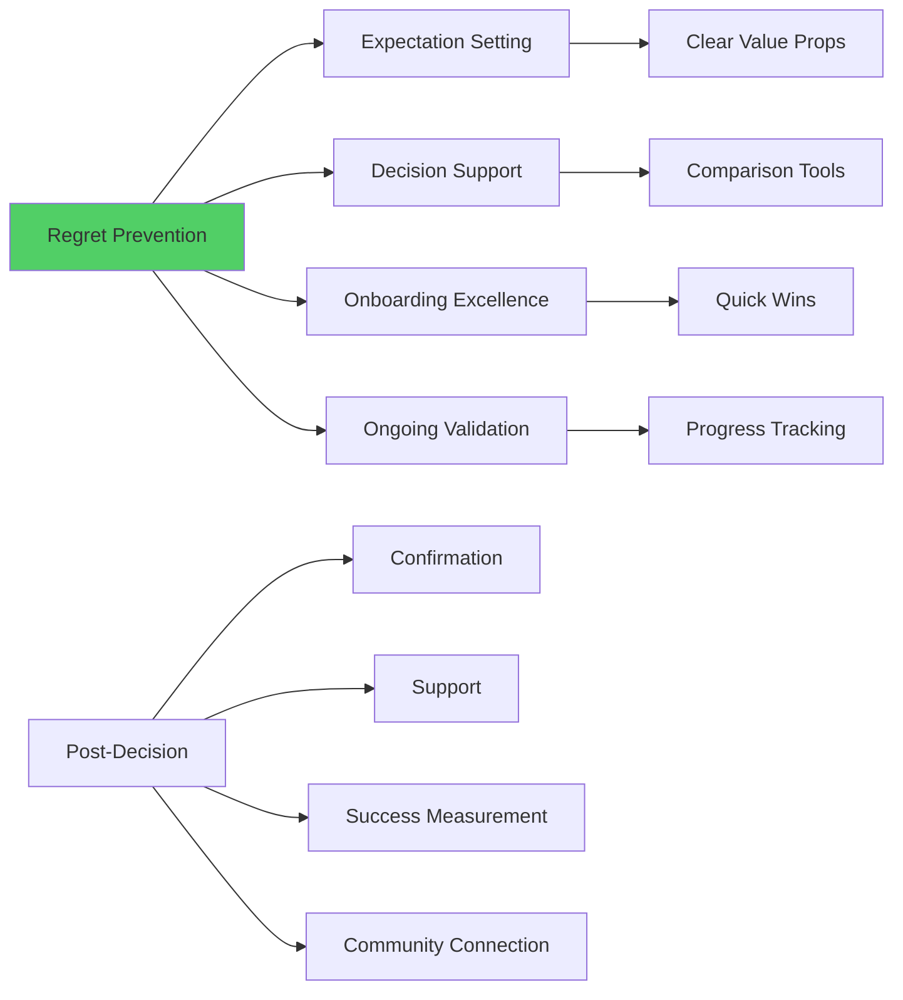

#### Regret Mitigation Strategies

| Regret Type | Cause | Mitigation Strategy | Success Rate |
|-------------|-------|-------------------|-------------|
| **Buyer's Remorse** | Price sensitivity | ROI demonstration | +67% |
| **Feature Overwhelm** | Complexity | Guided onboarding | +89% |
| **Integration Issues** | Technical problems | Setup assistance | +78% |
| **Team Resistance** | Social friction | Change management | +56% |
| **Performance Gap** | Unmet expectations | Success coaching | +134% |

### Post-Decision Reinforcement

#### Confirming User Choices
Helping users feel good about their decisions:

**Reinforcement Techniques:**
- **Progress celebration:** Highlighting achievements
- **Peer validation:** Showing similar successful users
- **Value demonstration:** ROI and benefit tracking
- **Community integration:** Connecting with other users

---

## Case Studies: Decision-Optimized SaaS

### Case Study 1: Stripe's Friction-Free Decisions

#### Challenge
Simplifying complex payment processing decisions for developers.

#### Decision Optimization Strategy
**Reduce Decision Complexity:**
- Single integration covers most use cases
- Smart defaults for common configurations
- Progressive disclosure of advanced features
- Clear documentation with decision trees

#### Implementation Details

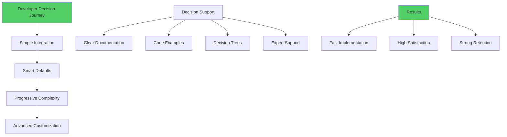

#### Results
- 15-minute average integration time (vs. weeks for competitors)
- 97% developer satisfaction scores
- 89% annual retention rate
- $95B valuation driven by decision simplicity

### Case Study 2: Zoom's Meeting Decision Psychology

#### Challenge
Making video conferencing choice and usage effortless.

#### Decision Strategy
**Eliminate Choice Friction:**
- One-click meeting start
- Smart scheduling integration
- Automatic quality optimization
- Minimal configuration required

#### Decision Simplification Elements

| Decision Point | Traditional Approach | Zoom's Approach | Result |
|---------------|---------------------|----------------|--------|
| **Meeting Setup** | Multiple configuration steps | One-click start | +234% usage |
| **Quality Settings** | Manual audio/video adjustment | Automatic optimization | +156% satisfaction |
| **Participant Management** | Complex permissions | Simple host controls | +89% adoption |
| **Integration Choice** | Select from many options | Calendar auto-detection | +167% integration |

#### Results
- Became verb for video calling ("let's Zoom")
- 300M+ daily meeting participants
- 90%+ Net Promoter Score
- Market leadership through decision simplicity

### Case Study 3: Notion's Progressive Decision Design

#### Challenge
Managing complexity of an all-in-one workspace tool.

#### Decision Strategy
**Progressive Complexity Revelation:**
- Start with simple note-taking
- Gradually introduce advanced features
- Template-driven decision support
- Community-driven choice guidance

#### Progressive Decision Architecture

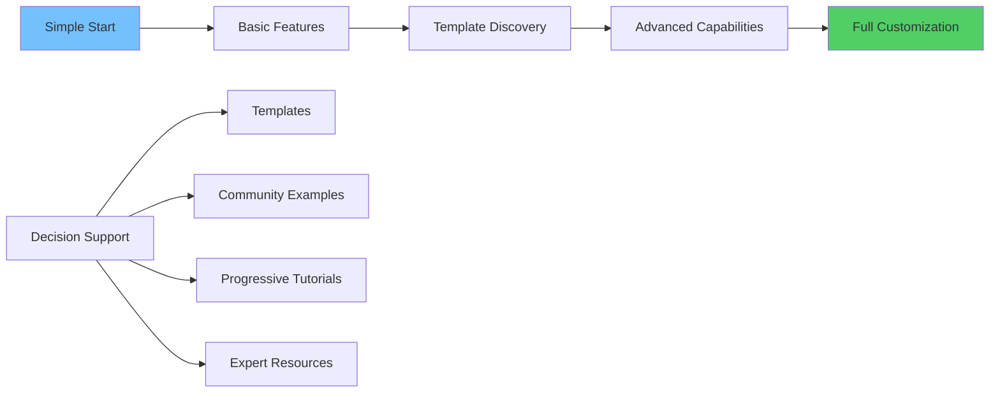

#### Results
- 83% of users progress beyond basic note-taking
- 67% adoption rate for advanced features
- $10B valuation through complexity management
- Strong community-driven growth

---

## Implementation Framework

### Decision-Optimized Design Process

#### Phase 1: Decision Journey Mapping (2-3 weeks)
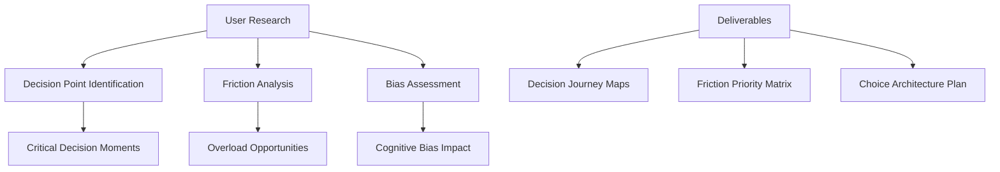

#### Phase 2: Choice Architecture Design (1-2 weeks)
**Design Decision Support Systems:**
- **Option presentation:** Number, order, emphasis
- **Default strategies:** Smart defaults, progressive disclosure
- **Information architecture:** Comparison tools, decision aids
- **Feedback mechanisms:** Progress tracking, validation

#### Phase 3: Implementation and Testing (4-6 weeks)
- Build decision support interfaces
- Implement choice architecture principles
- Create A/B testing framework
- Develop analytics for decision tracking

#### Phase 4: Optimization (Ongoing)
- Monitor decision analytics
- Test choice architecture variations
- Optimize based on user behavior
- Iterate on decision support tools

### Decision Optimization Checklist

#### Pre-Design Analysis
- [ ] Map user decision journey and critical choice points
- [ ] Identify decision fatigue and choice overload risks
- [ ] Analyze cognitive biases affecting user choices
- [ ] Assess current decision support effectiveness
- [ ] Define decision success metrics and KPIs

#### Choice Architecture Design
- [ ] Optimize number and presentation of options
- [ ] Implement smart defaults and progressive disclosure
- [ ] Create decision aids and comparison tools
- [ ] Design feedback and validation systems
- [ ] Build regret prevention mechanisms

#### Testing and Measurement
- [ ] Set up decision analytics and tracking
- [ ] Create A/B testing framework for choices
- [ ] Monitor decision quality and user satisfaction
- [ ] Track business impact of decision optimization
- [ ] Collect qualitative feedback on decision experience

#### Continuous Improvement
- [ ] Analyze decision performance data
- [ ] Identify optimization opportunities
- [ ] Test decision architecture improvements
- [ ] Scale successful decision patterns
- [ ] Maintain decision support documentation

---

## Future of Decision Psychology in SaaS

### Emerging Trends

#### 1. AI-Powered Decision Support
- **Personalized recommendations:** AI suggests optimal choices
- **Decision outcome prediction:** Machine learning forecasts results
- **Cognitive load optimization:** AI adapts complexity to user capacity
- **Behavioral nudging:** Intelligent choice architecture

#### 2. Neuro-Decision Interfaces
- **Brain-computer decision input:** Direct neural choice indication
- **Cognitive load measurement:** Real-time decision fatigue detection
- **Subconscious preference mining:** Unconscious choice optimization
- **Emotional decision support:** Mood-aware choice presentation

#### 3. Contextual Decision Adaptation
- **Environmental decision factors:** Location, time, social context
- **Cross-platform decision continuity:** Seamless choice across devices
- **Collaborative decision making:** Group choice optimization
- **Temporal decision optimization:** Right choice at right time

### Preparing for Decision Futures

#### Skills for SaaS Teams
1. **Behavioral Economics:** Understanding decision psychology
2. **Choice Architecture:** Designing optimal choice environments
3. **Data Analysis:** Measuring decision effectiveness
4. **UX Research:** Understanding user decision patterns
5. **AI/ML Integration:** Leveraging intelligent decision support

---

## Conclusion: Designing for Confident Decisions

The future of SaaS belongs to products that make decisions feel effortless, not overwhelming. By understanding the psychology of human decision-making, we can create experiences that guide users to choices they feel confident about and satisfied with long-term.

### Key Takeaways

1. **Understand Decision Psychology:** Humans are cognitive misers who rely on shortcuts
2. **Design Choice Architecture:** How options are presented matters more than the options themselves
3. **Manage Cognitive Load:** Every decision depletes mental resources
4. **Address Biases:** Understand and design for cognitive biases
5. **Support Post-Decision:** Help users feel good about their choices

### The Decision Design Promise

> We commit to designing choice experiences that honor human psychology, reduce decision burden, and support confident choices. We measure success not just in conversion rates, but in user satisfaction and decision quality.

### Next Steps

In Chapter 8, we'll explore the psychology of pricing and value perception in depth, examining how users evaluate worth and make purchase decisions. We'll see how decision psychology principles apply specifically to pricing and monetization strategies.

---

## Resources and Further Reading

### Essential Books
- "Thinking, Fast and Slow" by Daniel Kahneman
- "The Paradox of Choice" by Barry Schwartz
- "Nudge" by Richard Thaler and Cass Sunstein
- "Predictably Irrational" by Dan Ariely

### Research and Studies
- Behavioral economics research
- Choice overload studies
- Cognitive bias research
- Decision-making neuroscience

### Tools and Platforms
- **A/B Testing:** Optimizely, VWO for choice testing
- **Analytics:** Mixpanel, Amplitude for decision tracking
- **User Research:** UserTesting, Hotjar for decision insights
- **Choice Architecture:** Unbounce, ConversionXL for optimization

---

*This chapter provides the foundation for understanding how users make choices throughout their SaaS journey. The principles here inform everything from pricing pages to feature discovery to retention strategies.*
