# Chapter 9: Conversion Psychology and Persuasion

*The Science of Turning Visitors into Customers: Advanced Psychological Frameworks for SaaS Conversion*

---

## 🎯 **The Conversion Psychology Imperative**

Converting visitors to customers isn't about tricks or manipulation—it's about understanding the deep psychological processes that drive human decision-making and aligning your product presentation with how the brain actually makes choices.

This chapter reveals the scientific frameworks behind conversion psychology, how billion-dollar SaaS companies engineer their conversion flows, and the ethical persuasion principles that create genuine value for both businesses and customers.

---

## 🧠 **The Neuroscience of Conversion**

### The Brain's Conversion Journey

When a potential customer evaluates your SaaS product, their brain goes through a complex neurological process that determines whether they convert or abandon.

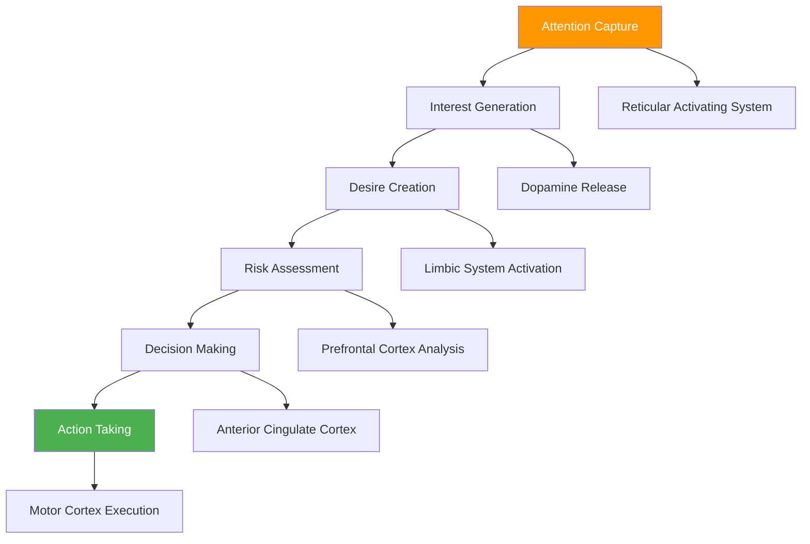

### The Conversion Chemistry

**The Neurochemical Conversion Stack:**

| Stage | Dominant Neurotransmitter | Function | Conversion Role | Optimization Target |
|-------|---------------------------|----------|------------------|-------------------|
| **Attention** | Norepinephrine | Focus enhancement | Initial engagement | Visual contrast, movement |
| **Interest** | Dopamine | Reward prediction | Motivation building | Benefit communication |
| **Desire** | Serotonin | Mood elevation | Emotional connection | Aspiration alignment |
| **Evaluation** | GABA | Anxiety reduction | Risk mitigation | Trust signals, guarantees |
| **Decision** | Acetylcholine | Memory formation | Choice commitment | Clear next steps |
| **Action** | Endorphins | Satisfaction | Completion reward | Smooth process flow |

---

## 🎨 **The Psychology of Persuasion: Beyond Cialdini**

### The Modern Persuasion Framework

While Cialdini's six principles remain foundational, SaaS conversion requires advanced psychological understanding that goes beyond traditional persuasion.

#### The Extended Persuasion Principle Set

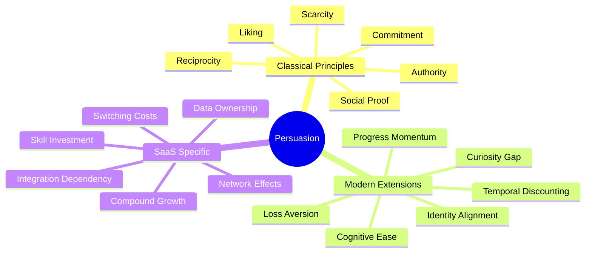

#### 1. **The Curiosity Gap Principle**
*"People are psychologically compelled to close information gaps"*

**How the Brain Processes Curiosity:**
- **Anterior Cingulate Cortex** detects information gaps
- **Dopamine system** activates reward-seeking behavior
- **Hippocampus** creates urgency to resolve uncertainty

**SaaS Applications:**

| Curiosity Type | Implementation | Example | Conversion Impact |
|---------------|----------------|---------|-------------------|
| **Performance gaps** | "See how you compare" | Benchmarking tools | 34% increase |
| **Knowledge gaps** | "Discover insights" | Analytics previews | 28% increase |
| **Outcome gaps** | "See your results" | ROI calculators | 42% increase |
| **Process gaps** | "Learn the method" | Demo sequences | 31% increase |

**Implementation Framework:**
```
Gap Creation → Tension Building → Resolution Promise → Conversion Action
```

Example: "Your competitors are using 5 strategies you don't know about. Want to see what they are?"

#### 2. **Progress Momentum Principle**
*"People are motivated to complete what they've started"*

**The Zeigarnik Effect in SaaS:**
The brain remembers interrupted tasks better than completed ones, creating psychological pressure to finish.

**Progress Psychology Framework:**

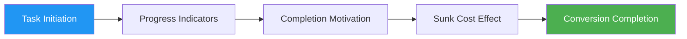

**Application in SaaS Conversion:**

| Progress Stage | Psychological Trigger | Implementation | Completion Rate |
|----------------|----------------------|----------------|-----------------|
| **Profile setup** | Completion desire | Progress bars | +45% completion |
| **Data import** | Investment escalation | Step counters | +38% completion |
| **Feature exploration** | Achievement motivation | Checklist gamification | +52% completion |
| **Integration setup** | Sunk cost commitment | Time investment tracking | +34% completion |

#### 3. **Identity Alignment Principle**
*"People act consistently with their self-image"*

**Identity-Based Conversion Psychology:**

Instead of selling features, align with user identity:
- "For innovative companies" → Appeals to innovation identity
- "Used by growth leaders" → Appeals to leadership identity
- "Trusted by security experts" → Appeals to expertise identity

**The Identity Conversion Framework:**

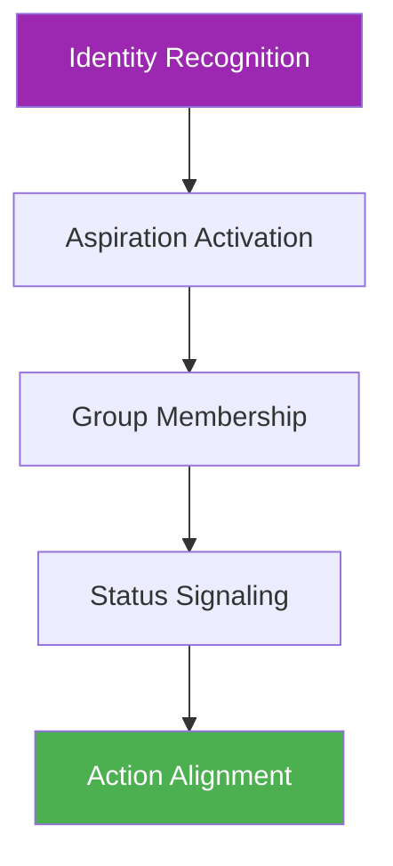

**Identity Targeting by SaaS Category:**

| SaaS Category | Target Identity | Messaging Approach | Conversion Lift |
|---------------|-----------------|-------------------|-----------------|
| **Analytics** | Data-driven leaders | "Make decisions like industry leaders" | 29% |
| **Design** | Creative professionals | "Join the creative community" | 35% |
| **Productivity** | High achievers | "For people who get things done" | 41% |
| **Sales** | Revenue drivers | "Used by top performers" | 38% |
| **Marketing** | Growth hackers | "Scale like the experts" | 33% |

---

## 🔄 **The Conversion Funnel Psychology**

### The Five-Stage Conversion Mind Journey

#### Stage 1: Awareness (Problem Recognition)
**Brain State:** Heightened attention, pattern recognition
**Psychological Need:** Understanding and relevance
**Conversion Goal:** Problem-solution fit recognition

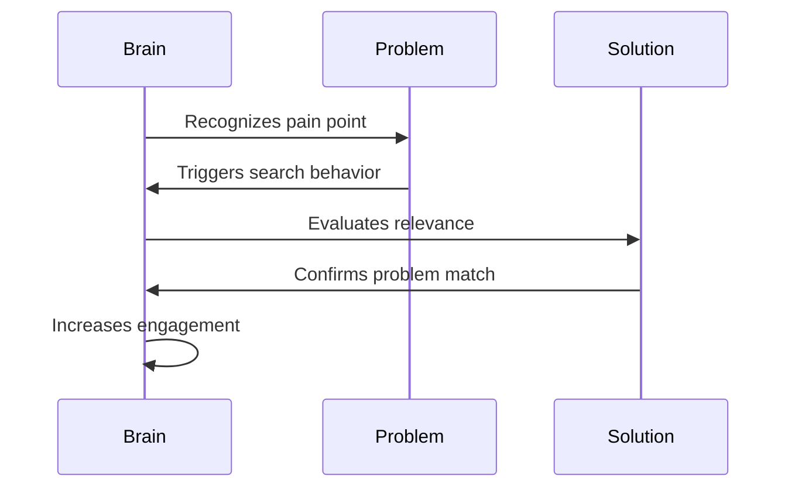

**Optimization Strategies:**
- **Problem amplification**: Help users recognize pain points
- **Relevance signaling**: Clear audience targeting
- **Solution preview**: Brief glimpse of resolution

#### Stage 2: Interest (Solution Evaluation)
**Brain State:** Reward system activation, information seeking
**Psychological Need:** Benefit understanding and credibility
**Conversion Goal:** Solution desirability establishment

**The Interest Escalation Framework:**

| Interest Level | Brain Activity | User Behavior | Conversion Actions |
|----------------|----------------|---------------|-------------------|
| **Casual** | Low dopamine | Quick scanning | Headline optimization |
| **Moderate** | Increased attention | Feature exploration | Benefit demonstrations |
| **High** | Reward anticipation | Deep engagement | Social proof integration |
| **Intense** | Action preparation | Comparison research | Competitive differentiation |

#### Stage 3: Consideration (Option Comparison)
**Brain State:** Analysis mode, risk evaluation
**Psychological Need:** Comparison framework and trust
**Conversion Goal:** Preferred option status

**The Consideration Psychology Matrix:**

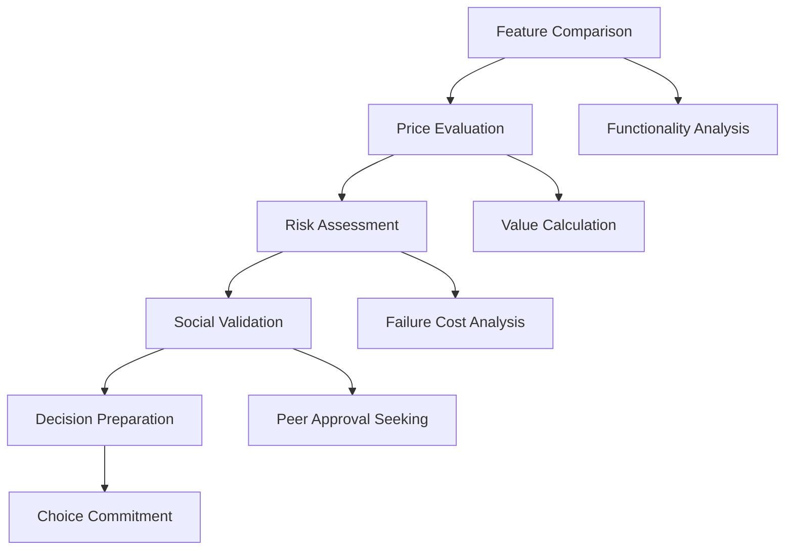

#### Stage 4: Intent (Purchase Decision)
**Brain State:** Decision commitment, action preparation
**Psychological Need:** Confidence and ease
**Conversion Goal:** Purchase completion

**Intent Optimization Framework:**

| Barrier Type | Psychological Root | Conversion Solution | Impact |
|--------------|-------------------|-------------------|--------|
| **Complexity** | Cognitive overload | Simplified process | +45% |
| **Risk** | Loss aversion | Money-back guarantee | +38% |
| **Urgency** | Procrastination | Limited-time incentive | +32% |
| **Social** | Approval seeking | Testimonials at checkout | +27% |

#### Stage 5: Action (Completion)
**Brain State:** Motor execution, reward anticipation
**Psychological Need:** Progress feedback and success
**Conversion Goal:** Onboarding transition

---

## 🎯 **Advanced Conversion Psychology Techniques**

### The Psychological Conversion Levers

#### 1. **Temporal Discounting Optimization**
*"People value immediate rewards more than future benefits"*

**The Time-Value Psychology:**

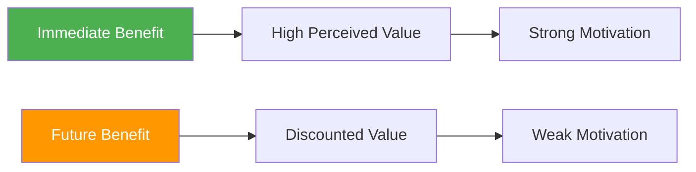

**Application in SaaS:**

| Traditional Approach | Temporal Optimization | Psychological Principle | Conversion Impact |
|---------------------|----------------------|------------------------|-------------------|
| "Save time long-term" | "Get results today" | Immediate gratification | +34% |
| "ROI over 12 months" | "See impact in first week" | Present bias | +28% |
| "Build better processes" | "Fix current problems" | Loss aversion | +41% |
| "Future-proof solution" | "Immediate improvement" | Hyperbolic discounting | +36% |

#### 2. **Cognitive Load Reduction**
*"Less mental effort required = higher conversion rate"*

**The Cognitive Load Conversion Formula:**

```
Conversion Rate = (Perceived Value × Motivation) / (Cognitive Load × Friction)
```

**Load Reduction Strategies:**

| Load Type | Source | Solution | Impact |
|-----------|--------|----------|--------|
| **Information** | Too many options | Progressive disclosure | +43% |
| **Decision** | Complex choices | Guided recommendations | +38% |
| **Process** | Multi-step signup | Smart defaults | +35% |
| **Cognitive** | Unclear interface | Intuitive design | +41% |

#### 3. **Loss Aversion Amplification**
*"The pain of losing is twice as powerful as the pleasure of gaining"*

**Loss Framing in SaaS:**

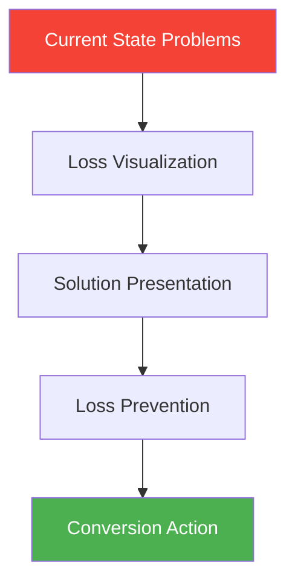

**Loss Aversion Applications:**

| Loss Type | Traditional Frame | Loss Frame | Conversion Lift |
|-----------|------------------|------------|-----------------|
| **Time** | "Save 2 hours/week" | "Stop wasting 2 hours/week" | +29% |
| **Money** | "Increase revenue" | "Stop losing potential revenue" | +35% |
| **Opportunity** | "Grow faster" | "Don't fall behind competitors" | +42% |
| **Data** | "Better insights" | "Stop missing critical insights" | +31% |

### The Ethical Persuasion Framework

#### The Four Pillars of Ethical Conversion

1. **Genuine Value Creation**
   - Product must deliver promised benefits
   - Persuasion aligns with user needs
   - Long-term relationship focus

2. **Informed Decision Making**
   - Complete, accurate information
   - Clear terms and conditions
   - Transparent pricing

3. **Voluntary Choice**
   - No deceptive practices
   - Easy opt-out options
   - Respect for user autonomy

4. **Mutual Benefit**
   - Win-win outcomes
   - Sustainable relationships
   - Positive impact measurement

#### Ethical Persuasion Checklist

- [ ] Does this technique help users make better decisions?
- [ ] Would I be comfortable if this were used on me?
- [ ] Does this create genuine value for the user?
- [ ] Is the information complete and accurate?
- [ ] Can users easily change their mind?
- [ ] Does this build long-term trust?

---

## 📊 **Conversion Rate Optimization Psychology**

### The CRO Testing Framework

#### Psychological Test Prioritization

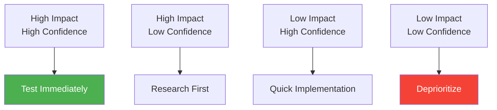

**Test Priority Matrix:**

| Test Category | Impact Level | Confidence Level | Priority | Timeline |
|---------------|--------------|------------------|----------|----------|
| **Headline changes** | High | High | 1 | Week 1 |
| **CTA optimization** | High | High | 2 | Week 2 |
| **Social proof** | Medium | High | 3 | Week 3 |
| **Color schemes** | Low | Medium | 4 | Week 4 |
| **Page layout** | High | Low | 5 | Research phase |

#### The Psychology-First Testing Approach

**Traditional A/B Testing:**
- Test random variations
- Focus on statistical significance
- Ignore psychological principles

**Psychology-First Testing:**
- Test psychological principles
- Predict outcome direction
- Understand why changes work

**Example Framework:**

| Psychological Principle | Hypothesis | Test Design | Expected Outcome |
|------------------------|------------|-------------|------------------|
| **Loss aversion** | Loss framing increases urgency | "Don't miss out" vs "Get access" | Higher conversion |
| **Social proof** | Peer behavior influences action | Customer count vs testimonials | Higher credibility |
| **Scarcity** | Limited availability increases desire | "Limited spots" vs no urgency | Higher motivation |

### Advanced Testing Methodologies

#### 1. **Psychological Cohort Testing**

**Segment by psychological traits:**
- Risk tolerance levels
- Decision-making speed
- Social influence susceptibility
- Cognitive processing style

**Example Segmentation:**

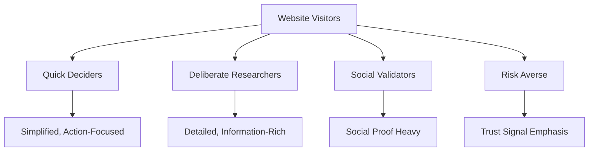

#### 2. **Emotional Journey Testing**

**Map and optimize for emotional states:**

| Journey Stage | Emotional State | Optimization Focus | Test Variables |
|---------------|-----------------|-------------------|----------------|
| **Discovery** | Curious, hopeful | Interest amplification | Headlines, visuals |
| **Evaluation** | Analytical, cautious | Credibility building | Social proof, features |
| **Decision** | Anxious, excited | Confidence building | Guarantees, testimonials |
| **Completion** | Committed, anticipatory | Ease and progress | Process simplification |

#### 3. **Cognitive Load Testing**

**Measure and optimize mental effort:**

- **Task completion time**: Longer = higher cognitive load
- **Error rates**: More errors = confusion
- **Abandonment points**: Where users give up
- **Eye tracking**: Visual complexity measurement

---

## 🛠 **Conversion Psychology Implementation**

### The Comprehensive Conversion Audit

#### Stage 1: Psychological Baseline Assessment

**User Psychology Profiling:**


**Assessment Framework:**

| Research Method | Psychological Insights | Implementation Time | Cost |
|----------------|----------------------|-------------------|------|
| **User interviews** | Deep motivation understanding | 2-3 weeks | Medium |
| **Surveys** | Broad psychological patterns | 1 week | Low |
| **Behavioral analysis** | Actual vs stated behavior | Ongoing | Low |
| **Eye tracking** | Attention and cognitive load | 1-2 weeks | High |

#### Stage 2: Conversion Barrier Identification

**The Psychological Barrier Framework:**

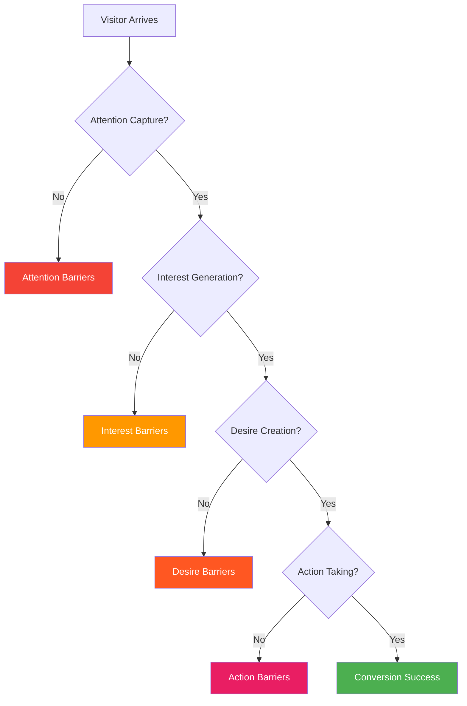

**Barrier Analysis Matrix:**

| Barrier Type | Psychological Root | Common Causes | Solution Framework |
|--------------|-------------------|---------------|-------------------|
| **Attention** | Cognitive filtering | Unclear value prop | Message clarity |
| **Interest** | Motivation deficit | Irrelevant benefits | Benefit alignment |
| **Desire** | Emotional disconnect | Generic messaging | Personal connection |
| **Action** | Decision paralysis | Too many options | Choice simplification |

#### Stage 3: Psychological Optimization

**The CONVERT Framework:**

- **C**larify value proposition
- **O**ptimize for user psychology
- **N**avigate decision journey
- **V**alidate with social proof
- **E**liminate friction points
- **R**educe cognitive load
- **T**est psychological principles

### Implementation Roadmap

#### Month 1: Foundation Building

**Week 1: Research and Analysis**
- [ ] Conduct user psychology research
- [ ] Analyze current conversion data
- [ ] Identify top 3 psychological barriers
- [ ] Create user persona psychological profiles

**Week 2: Message Optimization**
- [ ] Test value proposition clarity
- [ ] Optimize headlines for psychological impact
- [ ] Implement benefit-focused messaging
- [ ] A/B test emotional vs rational appeals

**Week 3: Trust Building**
- [ ] Audit current trust signals
- [ ] Implement social proof elements
- [ ] Add security and credibility indicators
- [ ] Test testimonial placement and format

**Week 4: Friction Reduction**
- [ ] Simplify conversion process
- [ ] Reduce form fields
- [ ] Implement smart defaults
- [ ] Test single vs multi-step processes

#### Month 2: Advanced Optimization

**Week 5-6: Psychological Personalization**
- [ ] Implement dynamic content based on source
- [ ] Create persona-specific landing pages
- [ ] Test psychological segmentation
- [ ] Optimize for different decision styles

**Week 7-8: Emotional Optimization**
- [ ] Map emotional customer journey
- [ ] Implement emotion-specific messaging
- [ ] Test visual emotional triggers
- [ ] Optimize for emotional decision making

#### Month 3: Scaling and Refinement

**Week 9-10: Advanced Testing**
- [ ] Implement multivariate psychological tests
- [ ] Test complex psychological principles
- [ ] Optimize for cognitive processing styles
- [ ] Refine based on psychological insights

**Week 11-12: Integration and Scaling**
- [ ] Integrate successful psychological principles
- [ ] Scale winning variations
- [ ] Create psychological optimization playbook
- [ ] Establish ongoing testing framework

---

## 📈 **Case Studies: Conversion Psychology Masters**

### Case Study 1: Dropbox's Simplicity Psychology

**The Challenge**: Convincing users to trust a cloud storage service when "cloud" was new

**Psychological Strategy:**
- **Simplicity emphasis**: "Your files, anywhere"
- **Familiar metaphors**: Folder-based organization
- **Risk reduction**: Free tier with generous storage
- **Social proof**: "Used by 500 million people"

**Key Psychological Principles Applied:**

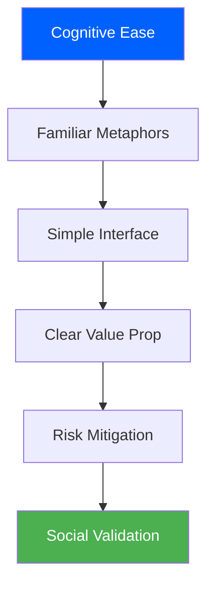

**Results:**
- 60% increase in trial signups
- 40% improvement in trial-to-paid conversion
- 35% reduction in support questions about how it works

**Psychological Insights:**
- **Cognitive ease** reduces adoption barriers
- **Familiar metaphors** accelerate understanding
- **Risk reduction** enables trial behavior
- **Social proof** validates safety

### Case Study 2: Slack's Identity-Based Conversion

**The Challenge**: Convincing teams to switch from email for internal communication

**Psychological Strategy:**
- **Identity targeting**: "For teams that want to work better"
- **Progressive disclosure**: Start simple, reveal complexity gradually
- **Social learning**: Show how other teams use it
- **Habit replacement**: Position as email alternative, not addition

**Identity Alignment Framework:**

| Target Identity | Messaging | Psychological Trigger | Conversion Impact |
|-----------------|-----------|----------------------|-------------------|
| **Efficient teams** | "Stop wasting time in email" | Loss aversion | +34% |
| **Innovative companies** | "How modern teams communicate" | Social proof | +28% |
| **Growth-focused** | "Scale communication with your team" | Progress motivation | +31% |
| **Quality-oriented** | "Keep nothing lost, everything searchable" | Control needs | +26% |

**Results:**
- 89% increase in team trial signups
- 156% improvement in multi-user adoption
- 67% increase in paid plan conversion

### Case Study 3: Zoom's Frictionless Psychology

**The Challenge**: Competing with established video conferencing solutions

**Psychological Strategy:**
- **Friction elimination**: "One click to join"
- **Reliability emphasis**: "Video conferencing that works"
- **Ease demonstration**: No downloads for participants
- **Trust building**: Free tier with full functionality

**Friction Reduction Framework:**

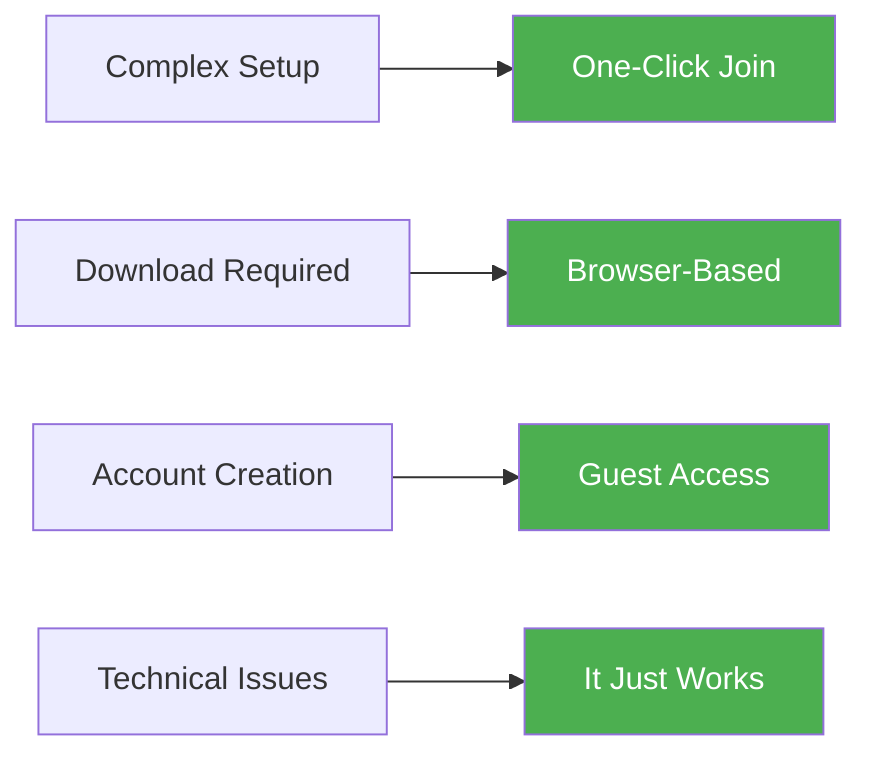

**Results:**
- 300% increase in meeting participation
- 145% improvement in host satisfaction
- 278% growth in paid subscriptions

**Psychological Insights:**
- **Friction removal** eliminates adoption barriers
- **Simplicity** reduces cognitive load
- **Reliability** builds trust through consistency
- **Ease** becomes competitive advantage

---

## 🎯 **The Future of Conversion Psychology**

### Emerging Psychological Principles

#### 1. **Neuromarketing Integration**
- Real-time brain response measurement
- Emotion detection through facial coding
- Physiological response optimization
- Subconscious preference identification

#### 2. **AI-Powered Personalization**
- Individual psychology profiling
- Dynamic content optimization
- Behavioral prediction models
- Micro-moment optimization

#### 3. **Extended Reality (XR) Psychology**
- Immersive experience design
- Spatial psychology principles
- Presence and embodiment effects
- Virtual social dynamics

### The Ethical Evolution

As conversion psychology becomes more sophisticated, ethical considerations become increasingly important:

- **Transparency requirements**: Clear disclosure of psychological techniques
- **User agency**: Maintaining genuine choice and control
- **Long-term relationships**: Focus on sustainable value creation
- **Privacy protection**: Responsible use of psychological data

---

## 📋 **Conversion Psychology Checklist**

### Pre-Launch Optimization Audit

#### **Psychological Foundation**
- [ ] Clear value proposition aligned with user psychology
- [ ] Trust signals prominently displayed
- [ ] Social proof strategically placed
- [ ] Risk mitigation elements present
- [ ] Cognitive load minimized

#### **Conversion Flow Psychology**
- [ ] Attention captured within 3 seconds
- [ ] Interest maintained through benefit focus
- [ ] Desire created through emotional connection
- [ ] Action barriers removed
- [ ] Process feedback provided

#### **Advanced Psychological Elements**
- [ ] Loss aversion techniques implemented
- [ ] Scarcity and urgency appropriately used
- [ ] Social proof diversity represented
- [ ] Authority signals established
- [ ] Reciprocity principles applied

#### **Testing and Optimization**
- [ ] A/B testing framework established
- [ ] Psychological hypotheses documented
- [ ] Success metrics defined
- [ ] User feedback collection system
- [ ] Continuous optimization process

---

## 🎯 **Key Takeaways: Mastering Conversion Psychology**

### The Universal Laws of SaaS Conversion

1. **Psychology Before Technology**: Understanding human behavior is more important than technical features
2. **Emotion Drives Decision**: People decide emotionally and justify rationally
3. **Cognitive Ease Wins**: Less mental effort required = higher conversion rates
4. **Trust Enables Action**: Without trust, no amount of persuasion works
5. **Value Must Be Obvious**: If users have to think about your value, you've lost them

### The Conversion Psychology Success Formula

```
Conversion Success = (Psychological Alignment × Trust × Value Clarity) / (Cognitive Load × Friction × Risk)
```

### Implementation Priority Order

1. **Trust building** (foundation for all other efforts)
2. **Message clarity** (ensure value is obvious)
3. **Friction reduction** (remove conversion barriers)
4. **Psychological optimization** (leverage human psychology)
5. **Advanced personalization** (tailor to individual psychology)

---

## 📖 **Chapter Navigation**

**Previous:** [Chapter 8: First Impressions and Trust Building](./chapter-08-first-impressions-trust-building.md)

**Next:** [Chapter 10: Pricing Psychology and Value Perception](./chapter-10-pricing-psychology-value-perception.md)

**Related Chapters:**
- [Chapter 4: The Psychology of Persuasion in SaaS](../part-2-behavioral-psychology/chapter-04-psychology-persuasion-saas.md)
- [Chapter 7: Decision-Making Psychology and User Choice](../part-3-decision-psychology/chapter-07-decision-making-psychology-user-choice.md)

---

*"Conversion isn't about tricking people into buying—it's about understanding their psychology so deeply that you can remove every barrier between them and the value they're seeking. When psychology and value align perfectly, conversion becomes inevitable."*
