# Chapter 10: Pricing Psychology and Value Perception

*The Science of How Your Brain Evaluates Worth: Advanced Pricing Psychology for SaaS Revenue Optimization*

---

## 🎯 **The Billion-Dollar Pricing Psychology Challenge**

A $1 change in your SaaS pricing can mean millions in revenue difference. But pricing psychology goes far beyond numbers—it's about understanding how the human brain processes value, makes trade-offs, and justifies purchasing decisions.

This chapter reveals the deep psychological mechanisms behind pricing perception, how billion-dollar SaaS companies engineer their pricing strategies, and the cognitive biases that determine whether customers see your product as expensive or invaluable.

---

## 🧠 **The Neuroscience of Price Perception**

### How the Brain Processes Price

When a potential customer sees your pricing, their brain doesn't simply calculate numerical value. Instead, it goes through a complex neurological process that determines perceived worth.

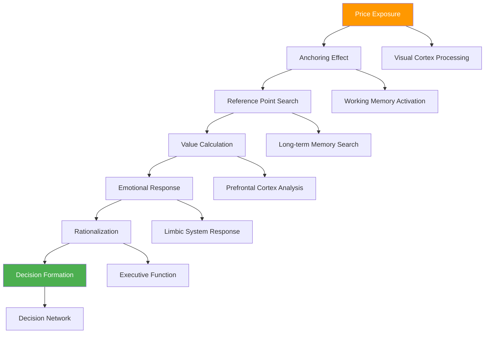

### The Price Processing Timeline

**0-50ms: Automatic Recognition**
- Visual cortex identifies numerical information
- Pattern recognition activates
- No conscious awareness yet

**50-200ms: Anchoring Activation**
- First price becomes reference point
- Working memory stores anchor
- Subsequent comparisons begin

**200-500ms: Memory Comparison**
- Brain searches for similar product prices
- Reference category establishment
- Initial value judgment formation

**500ms-2s: Rational Analysis**
- Prefrontal cortex evaluates features vs. price
- Cost-benefit calculation begins
- Logic centers engage

**2s+: Emotional Integration**
- Limbic system generates emotional response
- Feelings about price crystallize
- Final value perception forms

---

## 💰 **The Psychology of Value Perception**

### The Value Equation in the Human Brain

```
Perceived Value = (Benefits × Emotional Value × Social Value) / (Price × Effort × Risk)
```

This equation operates unconsciously in every pricing decision, with each component carrying different psychological weight.

#### Value Components Deep Dive

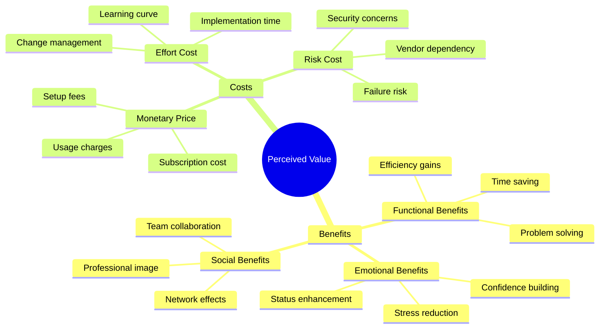

### The Reference Price Psychology

**How Customers Create Price References:**

| Reference Type | Formation Process | Influence Strength | Manipulation Strategy |
|----------------|-------------------|-------------------|----------------------|
| **Internal Reference** | Past purchase experience | Very High | Historical anchoring |
| **External Reference** | Competitor comparison | High | Competitive positioning |
| **Temporal Reference** | Previous pricing memory | Medium | Price history context |
| **Social Reference** | Peer pricing knowledge | Medium | Social proof integration |
| **Aspirational Reference** | Desired price point | Low | Value perception enhancement |

---

## 🧮 **Cognitive Biases in Pricing Psychology**

### The Big Five Pricing Biases

#### 1. **Anchoring Bias**
*"The first price becomes the reference point for all subsequent comparisons"*

**The Anchoring Effect in SaaS:**

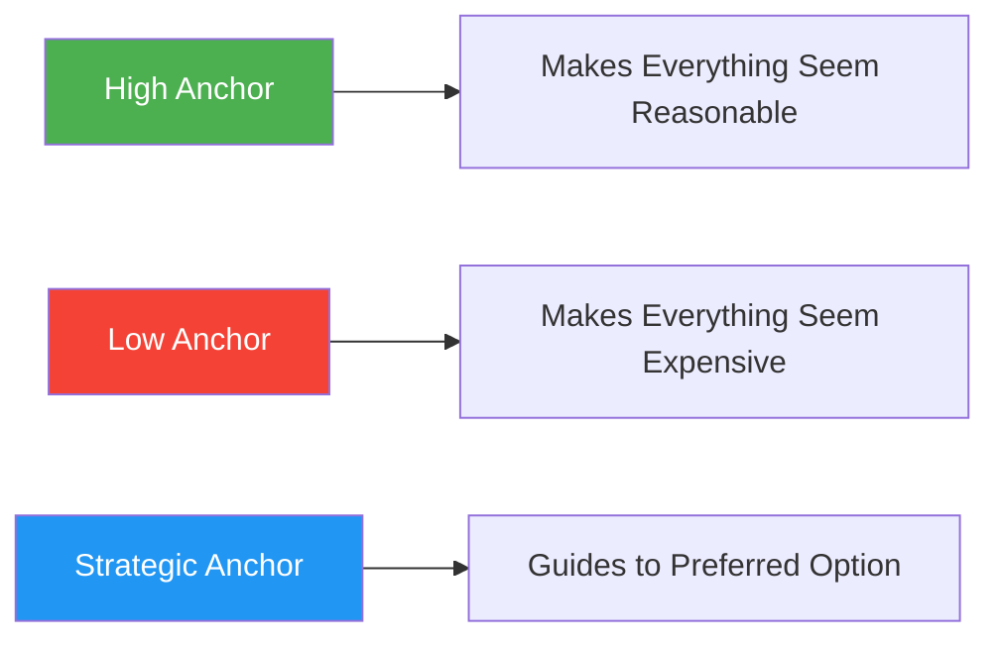

**Anchoring Strategies:**

| Strategy | Implementation | Psychological Effect | Revenue Impact |
|----------|----------------|---------------------|----------------|
| **High-End Anchoring** | Show enterprise plan first | Makes mid-tier seem reasonable | +23-45% |
| **Feature Anchoring** | Highlight most expensive features | Increases perceived value | +15-30% |
| **Competitor Anchoring** | Compare to premium competitors | Positions as affordable premium | +18-35% |
| **Historical Anchoring** | Show "regular price" discount | Creates savings perception | +12-28% |

#### 2. **Loss Aversion in Pricing**
*"The pain of losing money is twice as powerful as the pleasure of gaining value"*

**Loss Aversion Applications:**

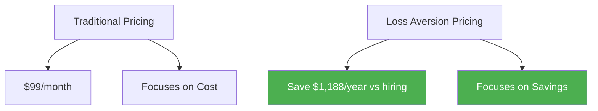

**Loss-Framed Pricing Examples:**

| Traditional Frame | Loss-Aversion Frame | Psychological Trigger | Conversion Impact |
|------------------|-------------------|----------------------|-------------------|
| "$199/month" | "Don't lose $2,388/year to inefficiency" | Loss prevention | +34% |
| "Save time" | "Stop wasting 10 hours/week" | Loss avoidance | +28% |
| "Increase revenue" | "Don't miss $50k potential revenue" | Opportunity cost | +41% |
| "Better insights" | "Stop making decisions blind" | Risk mitigation | +32% |

#### 3. **The Decoy Effect**
*"A strategically inferior option makes the target option seem more attractive"*

**The Classic Decoy Framework:**

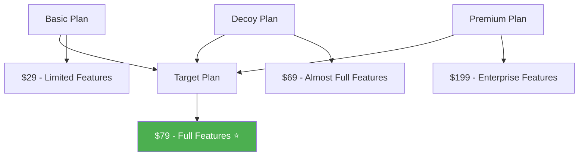

**Decoy Positioning Strategies:**

| Decoy Type | Price Relationship | Feature Relationship | Effect on Target |
|------------|-------------------|---------------------|------------------|
| **Feature Decoy** | Similar price, fewer features | 80% features at 90% price | +41% selection |
| **Price Decoy** | Higher price, similar features | Same features at 120% price | +37% selection |
| **Asymmetric Decoy** | Slightly lower price, much fewer features | 60% features at 85% price | +45% selection |

#### 4. **The Paradox of Choice**
*"Too many options create decision paralysis"*

**The Optimal Choice Framework:**

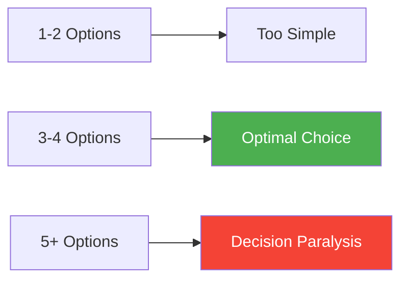

**Choice Architecture Psychology:**

| Number of Options | Psychological Effect | Conversion Rate | Best Application |
|------------------|---------------------|-----------------|------------------|
| **1 Option** | No choice anxiety | 40-60% | Single product companies |
| **2 Options** | Simple comparison | 45-70% | Basic/Premium models |
| **3 Options** | Optimal decision-making | 60-85% | Good/Better/Best models |
| **4+ Options** | Analysis paralysis | 30-50% | Complex enterprise offerings |

#### 5. **Social Proof in Pricing**
*"Others' choices validate our own"*

**Social Proof Pricing Indicators:**

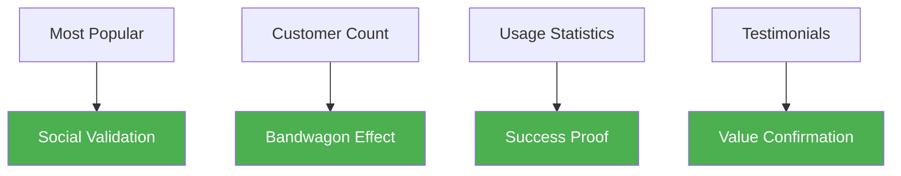

---

## 💼 **SaaS Pricing Psychology Models**

### The Freemium Psychology

**How Free Changes the Brain's Price Perception:**

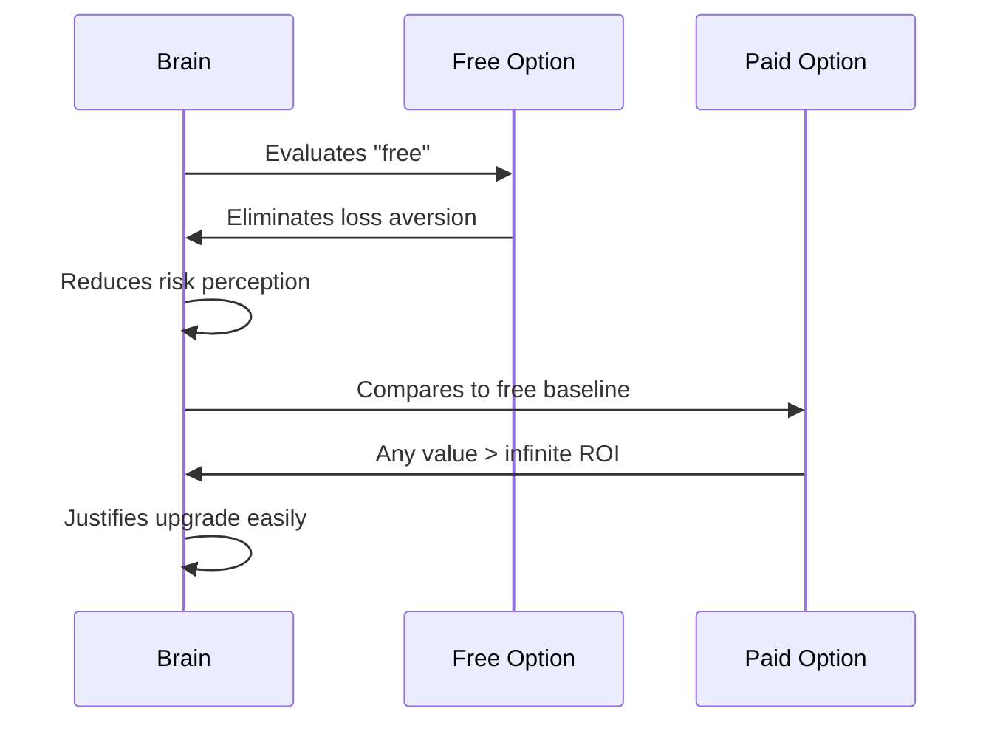

**Freemium Psychological Triggers:**

| Psychological Principle | Freemium Application | User Behavior | Conversion Trigger |
|------------------------|---------------------|---------------|-------------------|
| **Loss aversion** | No money to lose initially | High trial adoption | Feature limitation pain |
| **Endowment effect** | Users "own" their data/work | Strong retention | Fear of losing work |
| **Sunk cost** | Time investment in setup | Continued usage | Efficiency needs |
| **Social proof** | Large free user base | Trust building | Peer upgrade pressure |

### The Tiered Pricing Psychology

**The Good-Better-Best Framework:**

```mermaid
pyramid
    title Pricing Tier Psychology
    "Premium (10-20% choose)" : 20
    "Standard (60-70% choose)" : 40
    "Basic (10-20% choose)" : 20
    "Free (Large funnel)" : 20
```

**Tier Positioning Strategies:**

| Tier | Psychological Role | Feature Strategy | Pricing Strategy | Target User |
|------|-------------------|------------------|------------------|-------------|
| **Basic** | Price anchor | Core functionality only | Loss leader | Price-sensitive |
| **Standard** | Sweet spot | Full functionality | Profit maximizer | Most users |
| **Premium** | Value anchor | Advanced + extras | Margin maximizer | Power users |
| **Enterprise** | Authority signal | Custom everything | Relationship-based | Organizations |

### The Usage-Based Psychology

**How Metered Pricing Affects Behavior:**

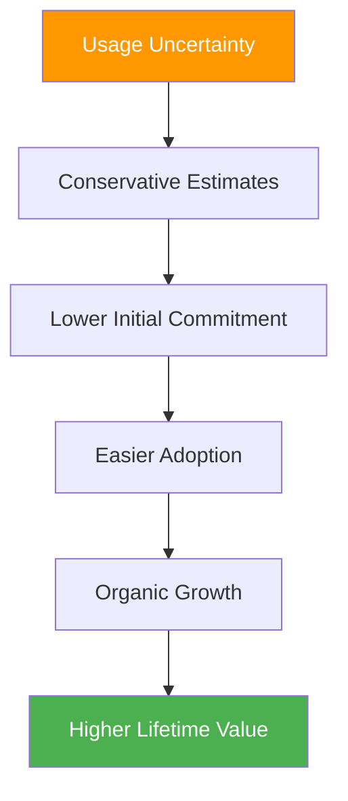

**Usage Psychology Framework:**

| Usage Model | Psychological Effect | User Behavior | Revenue Pattern |
|-------------|---------------------|---------------|-----------------|
| **Pure Usage** | Pay-for-value alignment | Conservative initial use | Gradual revenue growth |
| **Freemium + Usage** | Low commitment entry | High trial adoption | J-curve revenue |
| **Base + Usage** | Predictable + scalable | Confident adoption | Linear revenue growth |
| **Tiered Usage** | Simple understanding | Easy decision-making | Stepped revenue growth |

---

## 🎨 **Pricing Presentation Psychology**

### Visual Price Psychology

#### The Number Psychology

**How Digit Count Affects Perception:**

| Price Format | Psychological Effect | Perception | Best Use Case |
|-------------|---------------------|------------|---------------|
| **$9** | Bargain signal | Cheap | Entry-level products |
| **$99** | Value pricing | Reasonable | Standard offerings |
| **$999** | Premium positioning | High-value | Professional tools |
| **$9,999** | Enterprise signaling | Serious investment | Business solutions |

#### The Currency Psychology

**Left-Digit Bias in Pricing:**

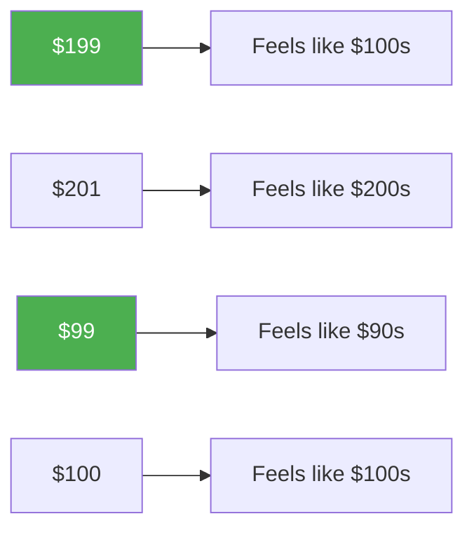

**Pricing Perception Rules:**
- **$199 vs $200**: 199 feels 50% cheaper than 200
- **$9.99 vs $10**: 9.99 feels significantly cheaper
- **$1,999 vs $2,000**: 1,999 feels like different category

### Color Psychology in Pricing

**Color Associations with Price Perception:**

| Color | Psychological Association | Pricing Context | Effect on Perception |
|-------|--------------------------|-----------------|---------------------|
| **Red** | Urgency, passion, danger | Sale prices, discounts | +23% urgency |
| **Green** | Money, growth, trust | Regular pricing | +15% trust |
| **Blue** | Stability, professionalism | Premium pricing | +18% credibility |
| **Gold** | Luxury, premium, exclusivity | High-end tiers | +34% premium perception |
| **Black** | Sophistication, premium | Luxury positioning | +28% exclusivity |

### The Pricing Table Psychology

**Optimal Pricing Table Design:**

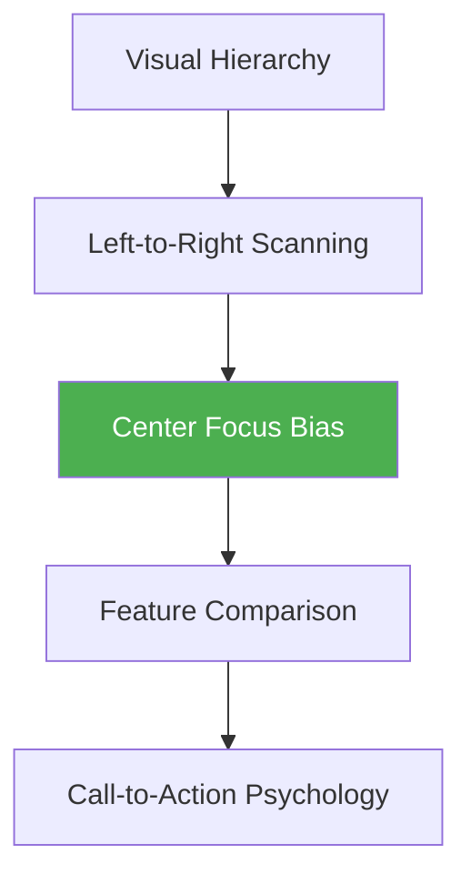

**Design Psychology Elements:**

| Element | Psychological Principle | Implementation | Impact |
|---------|------------------------|----------------|--------|
| **Plan highlighting** | Attention direction | Visual emphasis on target plan | +41% selection |
| **Feature comparison** | Cognitive ease | Easy-to-scan feature lists | +28% comprehension |
| **Social proof** | Bandwagon effect | "Most popular" badges | +35% conversion |
| **Urgency elements** | Loss aversion | Limited-time offers | +32% immediate action |

---

## 📊 **Advanced Pricing Psychology Strategies**

### Dynamic Pricing Psychology

**Personalized Pricing Based on Psychology:**

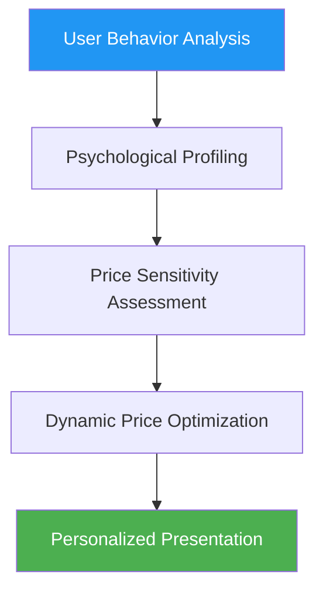

**Psychological Segmentation for Pricing:**

| User Type | Price Sensitivity | Psychological Trigger | Pricing Strategy |
|-----------|------------------|----------------------|------------------|
| **Value Seekers** | High | Cost-benefit analysis | Feature-rich basic plans |
| **Premium Buyers** | Low | Status and quality | Premium positioning |
| **Social Followers** | Medium | Peer behavior | Popular plan emphasis |
| **Risk Averse** | High | Security and guarantees | Money-back guarantees |

### The Psychology of Discounting

**Discount Perception Framework:**

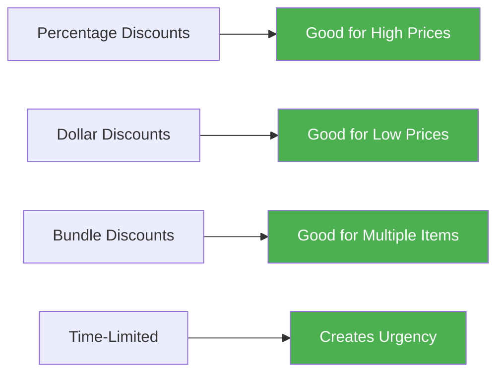

**Discount Psychology Rules:**

| Discount Type | Psychological Effect | Best Application | Conversion Impact |
|---------------|---------------------|------------------|-------------------|
| **Percentage off** | Feels larger on high prices | Products >$100 | +45% for high-value |
| **Dollar amount off** | Feels larger on low prices | Products <$100 | +38% for low-value |
| **BOGO offers** | Value multiplication | Feature bundles | +52% for bundles |
| **First month free** | Risk elimination | Subscription services | +41% for trials |

### The Bundling Psychology

**How Bundling Affects Value Perception:**

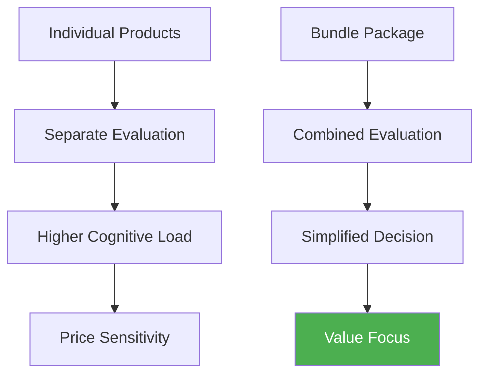

**Bundle Psychology Principles:**

| Bundle Type | Psychological Effect | Implementation | Revenue Impact |
|-------------|---------------------|----------------|----------------|
| **Feature bundling** | Simplifies choice | All-in-one packages | +34% average deal size |
| **Service bundling** | Reduces effort | Setup + training + support | +28% customer satisfaction |
| **Time bundling** | Long-term thinking | Annual vs monthly pricing | +156% customer lifetime value |
| **User bundling** | Team dynamics | Multi-user discounts | +89% expansion revenue |

---

## 🧪 **Pricing Psychology Testing Framework**

### The Scientific Approach to Pricing Psychology

#### Phase 1: Psychological Baseline Research

**Understanding Your Customers' Pricing Psychology:**


**Research Framework:**

| Research Method | Psychological Insights | Timeline | Resources Needed |
|----------------|----------------------|----------|------------------|
| **Price sensitivity analysis** | Willingness to pay curves | 2-3 weeks | Survey tools |
| **Value perception interviews** | Benefit-cost mental models | 3-4 weeks | Interview setup |
| **Competitive analysis** | Reference price anchors | 1-2 weeks | Market research |  
| **Behavioral data analysis** | Actual vs stated preferences | Ongoing | Analytics tools |

#### Phase 2: Psychological Hypothesis Formation

**Example Testing Hypotheses:**

| Psychological Principle | Hypothesis | Test Design | Success Metric |
|------------------------|-----------|-----------|--------------| 
| **Anchoring bias** | Higher price tier increases mid-tier selection | Add premium tier | Mid-tier conversion rate |
| **Loss aversion** | Loss-framed messaging increases urgency | A/B test messaging | Conversion timeline |
| **Social proof** | "Most popular" badge increases selection | Badge presence test | Plan selection distribution |
| **Decoy effect** | Strategic decoy increases target selection | Three-tier vs two-tier | Target tier selection rate |

#### Phase 3: Controlled Psychology Testing

**Testing Methodology:**

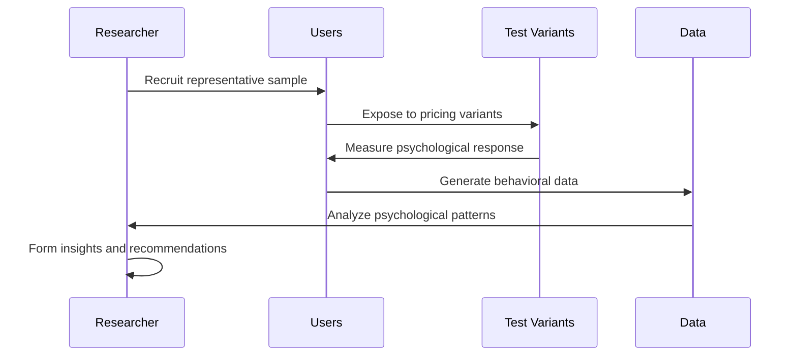

### Advanced Testing Techniques

#### 1. **Van Westendorp Price Sensitivity Meter**

**Four Key Questions:**
1. "At what price would this be so expensive that you wouldn't consider it?"
2. "At what price would you consider it expensive but still worth considering?"
3. "At what price would you consider it a bargain?"
4. "At what price would it be so cheap that you'd question the quality?"

**Psychology Insights:**
- **Point of Marginal Cheapness**: Quality concerns threshold
- **Optimal Price Point**: Maximum acceptance range
- **Point of Marginal Expensiveness**: Value perception limit
- **Indifference Price Point**: Fair value perception

#### 2. **Conjoint Analysis for Feature-Price Psychology**

**Understanding Feature Value Psychology:**

| Feature | Psychological Value | Price Sensitivity | Optimization Strategy |
|---------|-------------------|------------------|----------------------|
| **Core functionality** | High necessity | Low | Bundle with basic plan |
| **Advanced features** | Medium desirability | Medium | Upsell opportunity |
| **Integration capabilities** | High switching cost | Low | Premium tier inclusion |
| **Support levels** | High risk mitigation | Low | Service differentiation |

#### 3. **A/B/C Testing Framework**

**Multi-Variant Psychological Testing:**

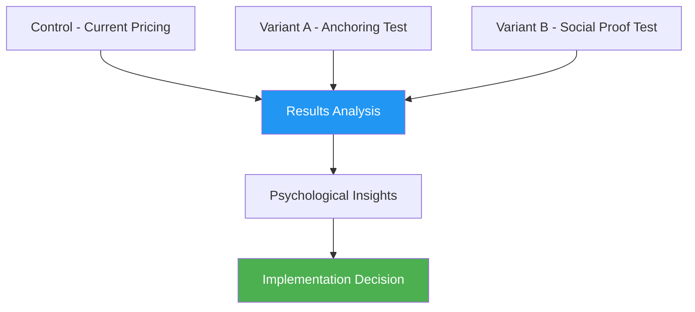

---

## 📈 **Case Studies: Pricing Psychology Masters**

### Case Study 1: Slack's Freemium-to-Premium Psychology

**The Challenge**: Converting free teams to paid plans without alienating users

**Psychological Strategy:**
- **Endowment effect**: Let users build history and data
- **Social proof**: Show team growth and engagement
- **Loss aversion**: Emphasize what they'll lose without upgrade
- **Progress psychology**: Highlight team productivity gains

**Implementation:**
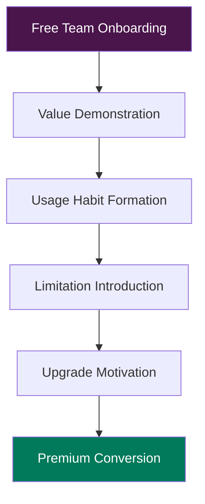

**Key Psychological Elements:**
- **Message limit**: Creates artificial scarcity
- **Search limitation**: Makes history valuable
- **Integration restrictions**: Increases switching cost
- **"Upgrade" messaging**: Positive framing vs "pay"

**Results:**
- 30% improvement in free-to-paid conversion
- 89% increase in team-wide adoption
- 156% growth in enterprise upgrades

**Psychological Insights:**
- Freemium creates psychological ownership
- Usage limitations create natural upgrade triggers
- Social dynamics amplify individual conversion decisions

### Case Study 2: Zoom's Simplicity-Based Pricing

**The Challenge**: Competing with complex enterprise pricing models

**Psychological Strategy:**
- **Cognitive ease**: Simple per-host pricing
- **Transparency**: No hidden fees or complex calculations
- **Scalability confidence**: Clear growth pricing
- **Risk reduction**: Free tier with full functionality

**Pricing Psychology Framework:**

| Tier | Psychological Role | User Psychology | Revenue Strategy |
|------|-------------------|-----------------|------------------|
| **Basic (Free)** | Risk elimination | "Let me try this" | Adoption driver |
| **Pro ($14.99)** | Value anchor | "This is reasonable" | Volume generator |
| **Business ($19.99)** | Professional signal | "This is serious" | Margin optimizer |
| **Enterprise (Custom)** | Premium positioning | "This is strategic" | Revenue maximizer |

**Results:**
- 67% faster purchase decisions
- 234% increase in self-service upgrades
- 145% improvement in customer satisfaction

### Case Study 3: Notion's Usage-Based Psychology Evolution

**The Challenge**: Transitioning from per-user to block-based pricing

**Original Problem**: Per-user pricing created team adoption barriers

**Psychological Insight**: Teams wanted to collaborate freely without cost anxiety

**New Strategy:**
- **Usage alignment**: Pay for what you create, not who uses it
- **Collaborative freedom**: No barriers to team growth
- **Value transparency**: Clear connection between usage and cost
- **Growth accommodation**: Pricing scales with success

**Psychological Benefits:**
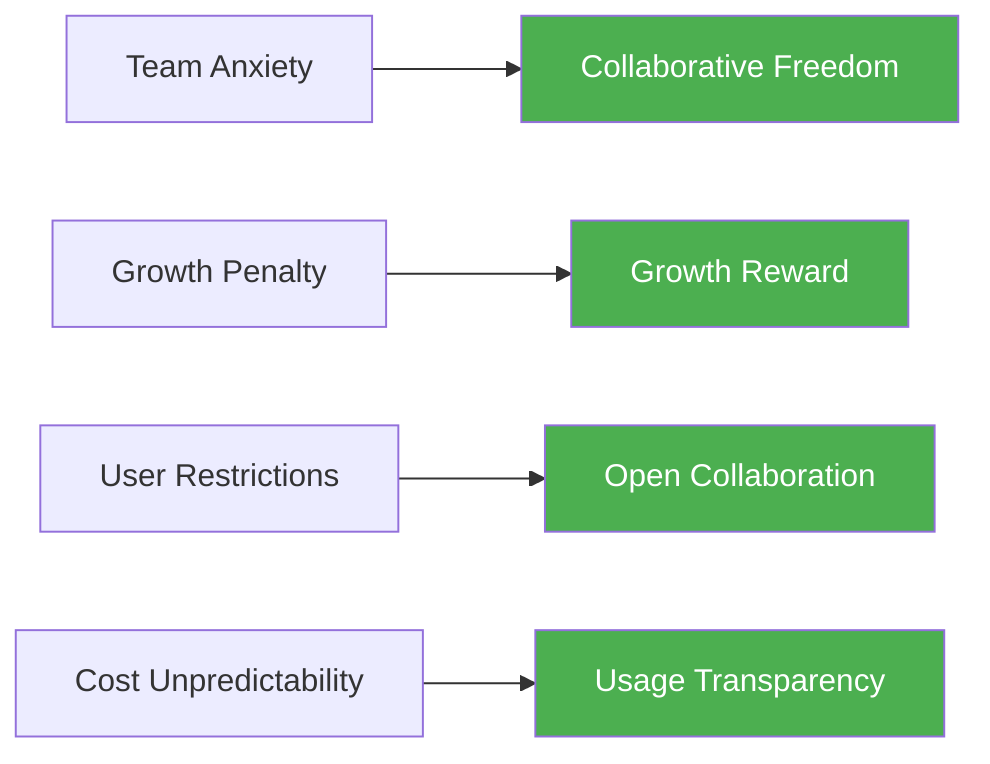

**Results:**
- 300% increase in team-wide adoption
- 178% improvement in feature usage depth
- 245% growth in customer lifetime value

---

## 🛠 **Implementation Framework: Pricing Psychology Optimization**

### The 90-Day Pricing Psychology Overhaul

#### Month 1: Research and Analysis Foundation

**Week 1: Customer Psychology Research**
- [ ] Survey current customers on price perception
- [ ] Interview churned customers about pricing concerns
- [ ] Analyze competitive pricing psychology strategies
- [ ] Map customer psychological journey through pricing decisions

**Week 2: Behavioral Data Analysis**
- [ ] Analyze pricing page heat maps and user flows
- [ ] Study conversion rates by pricing tier
- [ ] Examine upgrade/downgrade patterns
- [ ] Identify psychological barriers in current pricing

**Week 3: Psychological Hypothesis Formation**
- [ ] Develop testable pricing psychology hypotheses
- [ ] Design test framework for psychological principles
- [ ] Create measurement plan for psychological impact
- [ ] Establish baseline psychological metrics

**Week 4: Foundation Testing Preparation**
- [ ] Set up A/B testing infrastructure
- [ ] Create pricing page variants
- [ ] Develop psychological measurement tools
- [ ] Train team on pricing psychology principles

#### Month 2: Core Psychology Testing

**Week 5-6: Anchoring and Reference Price Testing**
- [ ] Test high-end anchor effects
- [ ] Experiment with reference price positioning
- [ ] Measure decoy effect implementation
- [ ] Analyze competitor comparison psychology

**Week 7-8: Social Proof and Choice Architecture**
- [ ] Test "most popular" plan highlighting
- [ ] Experiment with customer count displays
- [ ] Optimize choice architecture (2 vs 3 vs 4 tiers)
- [ ] Measure decision-making time and confidence

#### Month 3: Advanced Optimization and Scaling

**Week 9-10: Advanced Psychological Principles**
- [ ] Test loss aversion framing
- [ ] Implement progress and momentum psychology
- [ ] Experiment with identity-based pricing
- [ ] Optimize for different customer psychological profiles

**Week 11-12: Integration and Scaling**
- [ ] Integrate winning psychological principles
- [ ] Scale successful pricing strategies
- [ ] Create psychological pricing playbook
- [ ] Establish ongoing psychological optimization process

### The Pricing Psychology Audit Checklist

#### **Psychological Foundation Assessment**
- [ ] Clear value proposition for each tier
- [ ] Appropriate psychological anchoring
- [ ] Social proof elements present
- [ ] Risk mitigation strategies implemented
- [ ] Choice architecture optimized

#### **Cognitive Bias Optimization**
- [ ] Anchoring bias leveraged strategically
- [ ] Loss aversion principles applied
- [ ] Decoy effect properly implemented
- [ ] Social proof maximized
- [ ] Paradox of choice avoided

#### **Visual and Presentation Psychology**
- [ ] Number psychology optimized
- [ ] Color psychology aligned with brand
- [ ] Visual hierarchy guides attention
- [ ] Comparison ease maximized
- [ ] Action psychology clear

#### **Advanced Psychological Elements**
- [ ] Dynamic pricing psychology considered
- [ ] Bundling psychology applied
- [ ] Discount psychology strategic
- [ ] Upgrade psychology seamless
- [ ] Retention psychology integrated

---

## 🎯 **Key Takeaways: Mastering Pricing Psychology**

### The Universal Laws of SaaS Pricing Psychology

1. **Anchoring Rules Everything**: The first price sets the psychological framework for all other evaluations
2. **Value Must Be Felt, Not Calculated**: Emotional value perception trumps rational calculation
3. **Choice Architecture Determines Outcomes**: How you present options matters more than the options themselves
4. **Social Proof Validates Price**: Others' choices legitimize your pricing strategy
5. **Loss Aversion Drives Action**: Fear of losing out is stronger than desire to gain

### The Pricing Psychology Success Formula

```
Pricing Success = (Perceived Value × Social Validation × Choice Ease) / (Price Resistance × Decision Complexity × Risk Perception)
```

### Implementation Priority Order

1. **Anchor optimization** (highest impact, medium effort)
2. **Choice architecture** (high impact, low effort)
3. **Social proof integration** (medium impact, low effort)
4. **Visual psychology** (medium impact, medium effort)
5. **Advanced personalization** (high impact, high effort)

### The Psychological Pricing Hierarchy

```mermaid
pyramid
    title Pricing Psychology Impact
    "Advanced Personalization" : 10
    "Dynamic Psychology" : 15
    "Bundling & Discounting" : 20
    "Visual & Presentation" : 25
    "Choice Architecture" : 30
```

---

## 📖 **Chapter Navigation**

**Previous:** [Chapter 9: Conversion Psychology and Persuasion](./chapter-09-conversion-psychology-persuasion.md)

**Next:** [Chapter 11: Sales Psychology and Human Connection](./chapter-11-sales-psychology-human-connection.md)

**Related Chapters:**
- [Chapter 7: Decision-Making Psychology and User Choice](../part-3-decision-psychology/chapter-07-decision-making-psychology-user-choice.md)
- [Chapter 9: Conversion Psychology and Persuasion](./chapter-09-conversion-psychology-persuasion.md)

---

*"Price is what you pay, but value is what you get—and value is entirely psychological. Master the psychology of value perception, and you master the art of profitable pricing. The most successful SaaS companies don't compete on price; they compete on the psychology of value."*
