# Chapter 11: Sales Psychology and Human Connection

*The Science of Building Relationships That Convert: Advanced Psychology for SaaS Sales Success*

---

## 🎯 **The Human Element in Digital Sales**

Even in the most automated SaaS environments, human psychology remains the ultimate driver of purchase decisions. While marketing attracts and products demonstrate value, sales psychology creates the emotional connections that transform prospects into committed customers.

This chapter reveals the deep psychological mechanisms behind successful sales interactions, how top-performing SaaS sales teams leverage human psychology, and the science of building authentic relationships that drive long-term revenue growth.

---

## 🧠 **The Neuroscience of Sales Interactions**

### How the Brain Responds to Sales Situations

When prospects engage with sales representatives, their brains activate complex neurological processes that determine trust, likability, and ultimately, purchasing decisions.

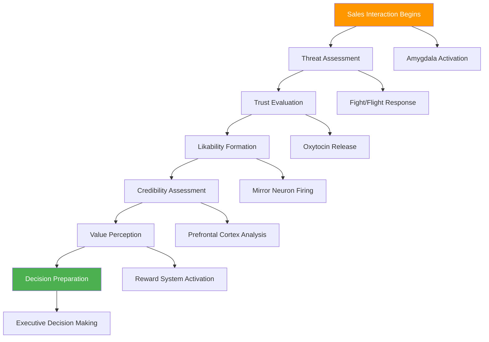

### The Sales Neuroscience Timeline

**0-3 seconds: Primitive Brain Assessment**
- Amygdala evaluates threat vs. safety
- Unconscious bias activation
- First impression formation

**3-30 seconds: Trust Calibration**
- Mirror neurons assess similarity
- Vocal tone and body language processing
- Competence evaluation begins

**30 seconds-2 minutes: Credibility Building**
- Prefrontal cortex analyzes expertise
- Social proof processing
- Authority assessment

**2-10 minutes: Relationship Foundation**
- Oxytocin release through rapport
- Empathy and understanding development
- Likability solidification

**10+ minutes: Value Co-creation**
- Collaborative problem-solving
- Solution customization
- Mutual benefit exploration

---

## ❤️ **The Psychology of Human Connection**

### The CONNECT Framework for Sales Psychology

#### **C - Commonality Recognition**
*"We are drawn to people similar to ourselves"*

**The Similarity-Attraction Principle in Sales:**

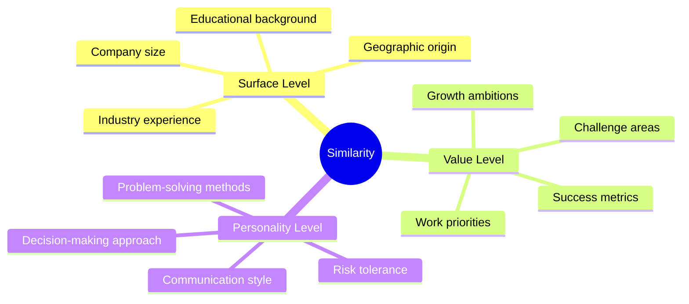

**Commonality Building Strategies:**

| Similarity Type | Discovery Method | Application | Trust Impact |
|----------------|------------------|-------------|---------------|
| **Geographic** | LinkedIn research, casual conversation | "I grew up in Chicago too" | +15% rapport |
| **Professional** | Background research, mutual connections | "I worked at Microsoft as well" | +23% credibility |
| **Industry** | Experience sharing, challenge discussion | "I've seen this problem before" | +31% expertise |
| **Values** | Deep questioning, story sharing | "We both value team collaboration" | +45% connection |

#### **O - Oxytocin Activation**
*"The trust hormone that creates emotional bonds"*

**Natural Oxytocin Triggers in Sales:**

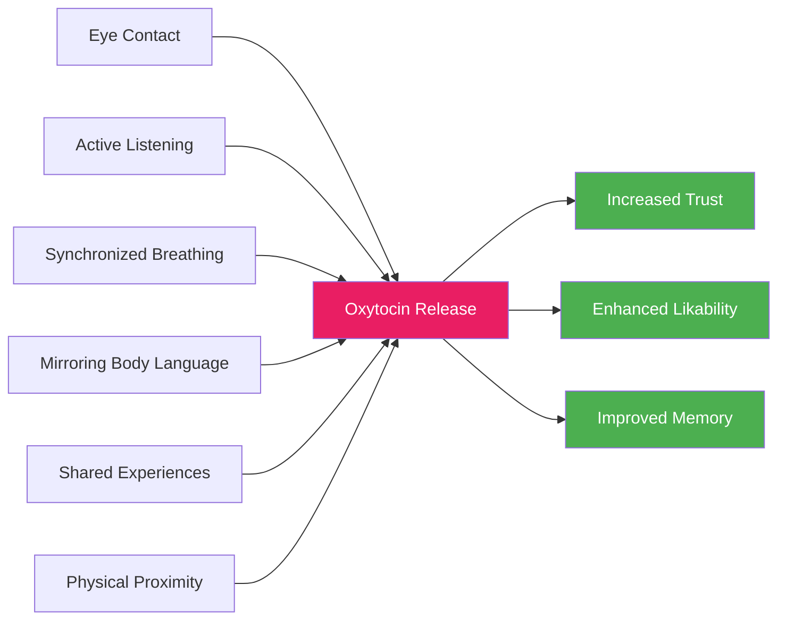

**Oxytocin-Boosting Techniques:**

| Technique | Implementation | Psychological Effect | Sales Impact |
|-----------|----------------|---------------------|---------------|
| **Name repetition** | Use prospect's name 3-5 times | Personal recognition | +18% engagement |
| **Story sharing** | Personal anecdotes, vulnerabilities | Emotional connection | +27% trust |
| **Active listening** | Paraphrasing, clarifying questions | Validation feeling | +34% rapport |
| **Synchronized communication** | Matching pace, tone, energy | Unconscious bonding | +22% likability |

#### **N - Neurolinguistic Mirroring**
*"Unconscious mimicry creates instant rapport"*

**The Mirroring Psychology Framework:**

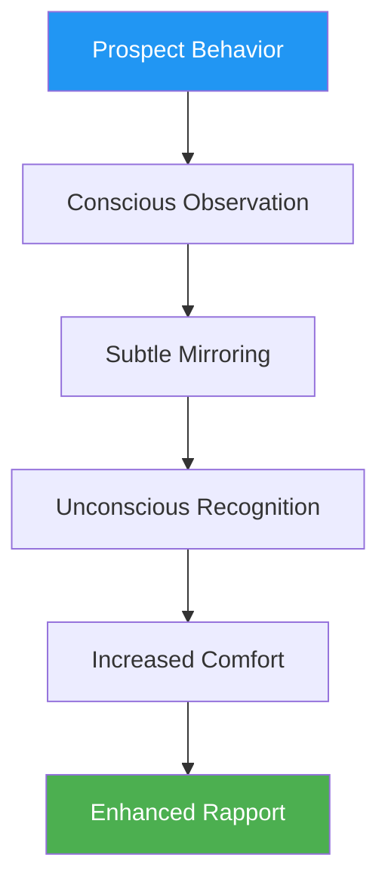

**Mirroring Elements:**

| Element | What to Mirror | How to Apply | Caution |
|---------|----------------|--------------|---------|
| **Speech patterns** | Pace, volume, pauses | Match energy level | Don't mimic accent |
| **Body language** | Posture, gestures, positioning | Subtle alignment | Avoid obvious copying |
| **Language style** | Formal vs casual, technical vs simple | Adapt communication | Stay authentic |
| **Decision style** | Quick vs deliberate, data vs emotion | Match their process | Don't force mismatch |

#### **N - Need Identification**
*"Understanding drives connection and solutions"*

**The Need Hierarchy in B2B Sales:**

```mermaid
pyramid
    title B2B Need Hierarchy
    "Self-Actualization (Legacy/Impact)" : 10
    "Esteem (Recognition/Achievement)" : 15
    "Social (Team/Collaboration)" : 20
    "Security (Job/Financial)" : 25
    "Survival (Problem/Pain)" : 30
```

**Need Discovery Framework:**

| Need Level | Question Types | Psychological Drivers | Solution Positioning |
|------------|----------------|----------------------|---------------------|
| **Surface needs** | "What challenges are you facing?" | Problem avoidance | Feature benefits |
| **Business needs** | "What's the impact on your business?" | Performance improvement | Business outcomes |
| **Emotional needs** | "How does this affect you personally?" | Personal motivation | Career advancement |
| **Aspirational needs** | "Where do you want to be?" | Growth and achievement | Transformation vision |

#### **E - Empathy Demonstration**
*"Feeling understood creates psychological safety"*

**The Empathy-Trust Connection:**

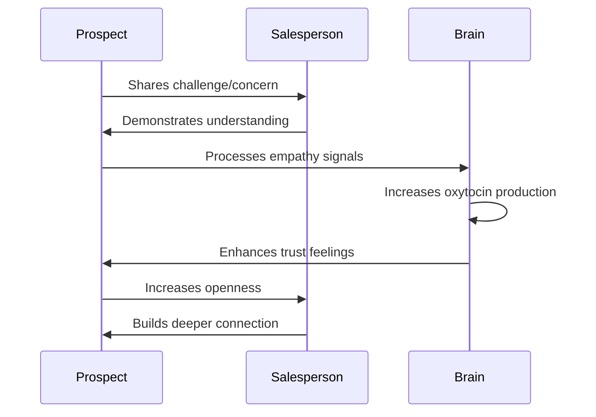

**Empathy Building Techniques:**

| Technique | Implementation | Psychological Effect | Relationship Impact |
|-----------|----------------|---------------------|-------------------|
| **Emotional labeling** | "That sounds frustrating..." | Validation of feelings | +41% emotional connection |
| **Perspective taking** | "From your position, I can see..." | Understanding demonstration | +35% trust |
| **Experience sharing** | "I've worked with others who..." | Normalizing challenges | +28% comfort |
| **Future pacing** | "Imagine when this is solved..." | Hope and motivation | +33% engagement |

#### **C - Credibility Establishment**
*"Expertise creates authority and trust"*

**The Credibility Stack:**

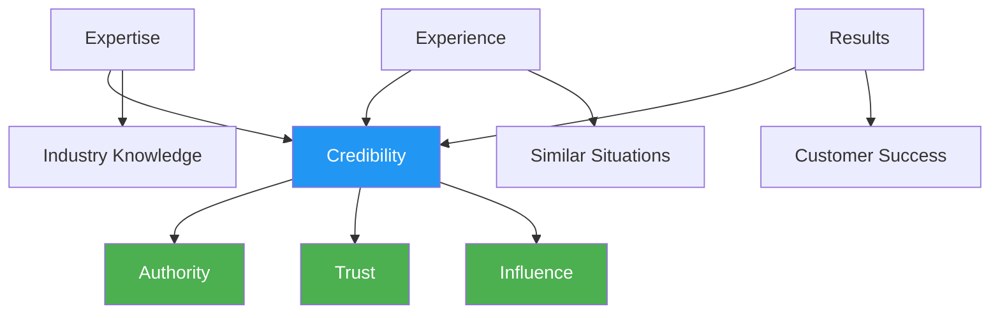

#### **T - Tension Creation**
*"Healthy tension motivates action"*

**The Psychology of Productive Tension:**


---

## 🎭 **Sales Personality Psychology**

### Understanding Buyer Personalities

#### The Four Dominant Buyer Types

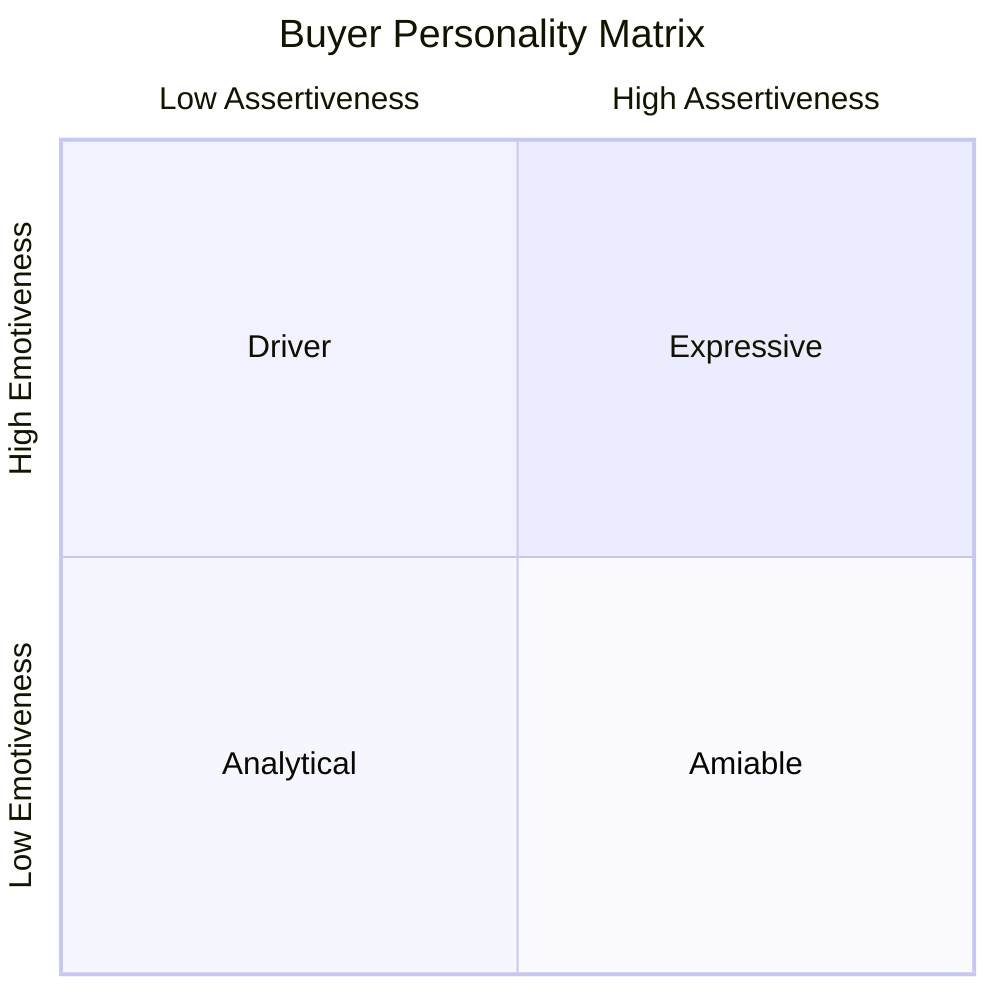

#### **1. The Analytical Buyer (25%)**
**Psychological Profile:**
- High need for information and data
- Risk-averse, methodical decision-making
- Values accuracy and thoroughness
- Fears making wrong decisions

**Sales Psychology Approach:**
- **Pace**: Slower, methodical
- **Information**: Detailed, factual, comprehensive
- **Proof**: Case studies, ROI calculations, references
- **Decision process**: Extended timeline, multiple touchpoints

**Key Phrases:**
- "Let me show you the data..."
- "Here's a detailed analysis..."
- "The research shows..."
- "What specific information do you need?"

**Psychological Triggers:**
- Logic and reasoning
- Detailed documentation
- Risk mitigation strategies
- Peer validation

#### **2. The Driver Buyer (25%)**
**Psychological Profile:**
- Results-oriented, goal-focused
- Impatient with details
- Values efficiency and control
- Fears wasting time

**Sales Psychology Approach:**
- **Pace**: Fast, direct, results-focused
- **Information**: Bottom-line, summary-level
- **Proof**: Quick wins, immediate impact
- **Decision process**: Rapid, authority-based

**Key Phrases:**
- "Bottom line..."
- "This will save you..."
- "Results show..."
- "When can we get started?"

**Psychological Triggers:**
- Time savings
- Competitive advantage
- Control and authority
- Quick results

#### **3. The Expressive Buyer (25%)**
**Psychological Profile:**
- People-oriented, relationship-focused
- Enthusiastic and optimistic
- Values recognition and approval
- Fears social rejection

**Sales Psychology Approach:**
- **Pace**: Energetic, interactive, engaging
- **Information**: Story-based, people-focused
- **Proof**: Testimonials, success stories, social proof
- **Decision process**: Collaborative, consensus-building

**Key Phrases:**
- "Our customers love..."
- "You'll be recognized for..."
- "This team success story..."
- "How does this sound to your team?"

**Psychological Triggers:**
- Social recognition
- Team success
- Innovation and vision
- Peer approval

#### **4. The Amiable Buyer (25%)**
**Psychological Profile:**
- Relationship-oriented, supportive
- Prefers consensus and collaboration
- Values security and stability
- Fears conflict and change

**Sales Psychology Approach:**
- **Pace**: Gentle, patient, supportive
- **Information**: Step-by-step, reassuring
- **Proof**: Low-risk trials, guarantees, support
- **Decision process**: Consultative, team-involved

**Key Phrases:**
- "We'll support you every step..."
- "Many teams have made this transition..."
- "What concerns do you have?"
- "How can we make this easier?"

**Psychological Triggers:**
- Security and stability
- Team harmony
- Gradual implementation
- Strong support

### Adapting Sales Psychology by Buyer Type

**Communication Adaptation Matrix:**

| Buyer Type | Communication Style | Information Preference | Decision Factors | Sales Strategy |
|------------|-------------------|----------------------|------------------|----------------|
| **Analytical** | Logical, detailed | Data, research, analysis | ROI, risk mitigation | Consultative, educational |
| **Driver** | Direct, efficient | Summary, bottom-line | Results, competitive edge | Solution-focused, urgent |
| **Expressive** | Enthusiastic, story-driven | Testimonials, vision | Innovation, recognition | Relationship-based, inspiring |
| **Amiable** | Supportive, collaborative | Step-by-step, reassuring | Security, consensus | Trust-building, patient |

---

## 🔄 **The Psychology of the Sales Process**

### The Emotional Journey of B2B Buying

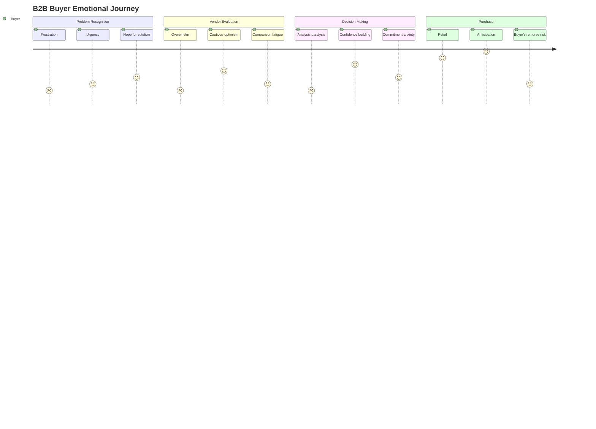

### The Psychological Sales Methodology

#### **1. Discovery Psychology**
*"Questions that reveal both logical and emotional drivers"*

**The Discovery Question Framework:**

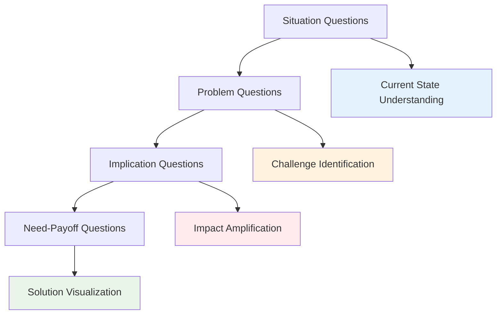

**Question Psychology by Type:**

| Question Type | Psychological Purpose | Example | Buyer Response |
|---------------|----------------------|---------|----------------|
| **Situation** | Gather context, build rapport | "Tell me about your current process" | Comfortable sharing |
| **Problem** | Identify pain, create urgency | "What challenges are you facing?" | Problem awareness |
| **Implication** | Amplify pain, build tension | "What happens if this continues?" | Emotional engagement |
| **Need-Payoff** | Create vision, build desire | "How would solving this help?" | Solution motivation |

#### **2. Presentation Psychology**
*"Tailoring the message to the psychological profile"*

**The Psychological Presentation Framework:**


**Presentation Elements by Psychology:**

| Element | Analytical Focus | Driver Focus | Expressive Focus | Amiable Focus |
|---------|------------------|--------------|------------------|---------------|
| **Opening** | Data and research | Results and ROI | Vision and story | Relationship and support |
| **Features** | Detailed specifications | Key differentiators | Innovation highlights | Ease of use |
| **Benefits** | Cost savings, efficiency | Competitive advantage | Recognition, growth | Security, harmony |
| **Proof** | Case studies, references | Quick wins, metrics | Success stories | Implementation support |
| **Close** | Risk mitigation | Action plan | Excitement building | Consensus building |

#### **3. Objection Handling Psychology**
*"Understanding the psychological root of resistance"*

**The Psychology Behind Common Objections:**

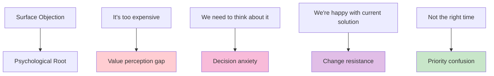

**Psychological Objection Resolution:**

| Objection | Psychological Root | Resolution Strategy | Response Framework |
|-----------|-------------------|--------------------|--------------------|
| **Price** | Value perception gap | Value demonstration | "I understand cost is a concern. Let me show you the ROI..." |
| **Timing** | Priority confusion | Urgency creation | "What would have to happen for this to become a priority?" |
| **Authority** | Decision anxiety | Stakeholder involvement | "Who else would be involved in this decision?" |
| **Status quo** | Change resistance | Risk of inaction | "What's the cost of continuing as is?" |

#### **4. Closing Psychology**
*"Creating commitment through psychological alignment"*

**The Psychology of Commitment:**

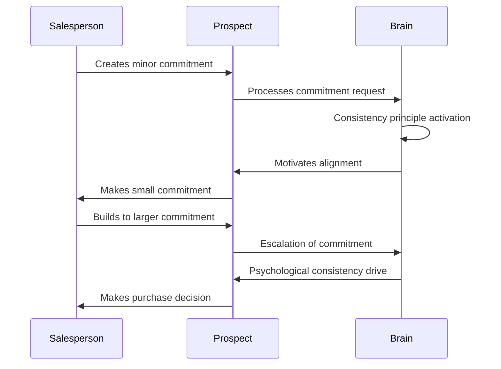

**Commitment Building Techniques:**

| Technique | Psychological Principle | Implementation | Conversion Impact |
|-----------|------------------------|----------------|-------------------|
| **Trial closes** | Consistency principle | "If we could solve X, would you..." | +34% close rate |
| **Assumption close** | Momentum building | "When we implement this..." | +28% progression |
| **Alternative close** | Choice architecture | "Would you prefer option A or B?" | +31% decision |
| **Summary close** | Cognitive commitment | "So we agree that..." | +37% clarity |

---

## 🤝 **Relationship Psychology in SaaS Sales**

### The Trust-Building Progression

**The Relationship Development Stages:**

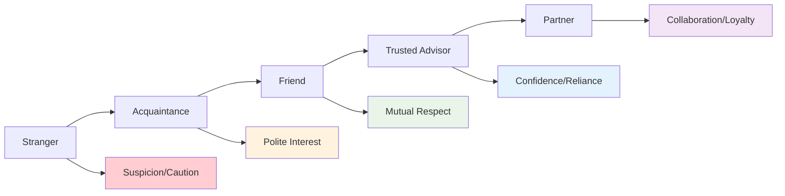

### Building Long-Term Sales Relationships

#### **The Relationship Investment Framework**

**Psychological Investment Strategies:**

| Investment Type | Activity | Psychological Impact | Relationship ROI |
|----------------|----------|---------------------|------------------|
| **Time investment** | Regular check-ins, industry insights | Shows commitment | 3x meeting response rate |
| **Knowledge investment** | Industry research, custom insights | Demonstrates value | 5x referral likelihood |
| **Emotional investment** | Personal connection, empathy | Builds trust | 7x retention rate |
| **Social investment** | Introductions, networking | Expands relationship | 4x expansion revenue |

#### **The Psychological Reciprocity Engine**

**Creating Positive Reciprocity Cycles:**

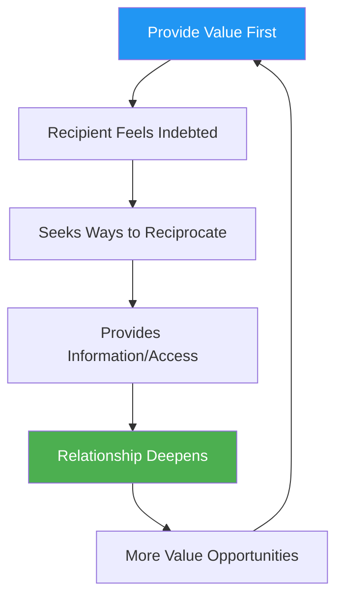

**Value-First Strategies:**

| Value Type | Implementation | Psychological Effect | Business Impact |
|-----------|----------------|---------------------|-----------------|
| **Information** | Industry reports, insights | Expertise recognition | +45% credibility |
| **Connections** | Strategic introductions | Network expansion | +67% relationship depth |
| **Opportunities** | Business leads, partnerships | Mutual benefit | +89% loyalty |
| **Recognition** | Public acknowledgment, awards | Status enhancement | +123% advocacy |

---

## 📊 **Advanced Sales Psychology Techniques**

### Neuro-Linguistic Programming (NLP) in Sales

#### **Language Patterns That Influence**

**The Psychological Power of Language:**

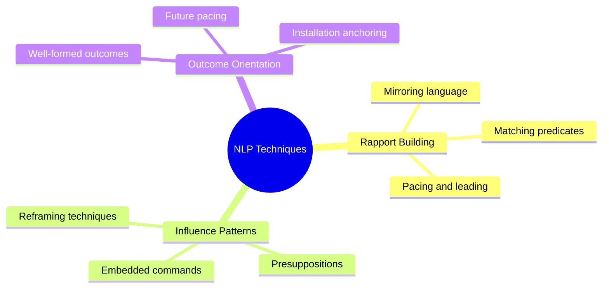

**Language Pattern Applications:**

| Pattern | Psychological Effect | Sales Application | Example |
|---------|---------------------|-------------------|---------|
| **Embedded commands** | Subconscious suggestion | Action orientation | "As you *consider this solution*..." |
| **Presuppositions** | Assumption acceptance | Future state creation | "When you implement this..." |
| **Sensory predicates** | Rapport building | Communication matching | "I see what you mean" (visual) |
| **Reframing** | Perspective shifting | Objection handling | "The real question is..." |

### The Psychology of Social Proof in Sales

#### **Social Proof Hierarchy in B2B Sales**

```mermaid
pyramid
    title Social Proof Impact
    "CEO/Executive Endorsement" : 10
    "Industry Analyst Recognition" : 15
    "Customer Success Stories" : 20
    "Peer Recommendations" : 25
    "Company Testimonials" : 30
```

**Social Proof Application Strategy:**

| Proof Type | Psychological Impact | When to Use | Effectiveness |
|------------|---------------------|-------------|---------------|
| **Peer stories** | Similarity attraction | Early discovery | 85% credibility boost |
| **Industry leader** | Authority transfer | Credibility building | 67% trust increase |
| **Competitor wins** | Competitive validation | Differentiation | 54% preference shift |
| **Analyst reports** | Expert validation | Risk mitigation | 78% confidence increase |

### Psychological Anchoring in Sales Negotiations

#### **The Anchoring Effect in Price Discussions**

**Strategic Anchoring Framework:**

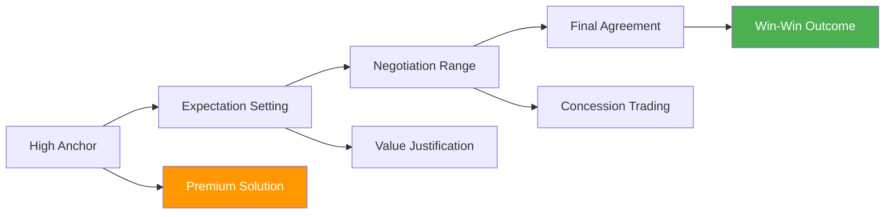

**Anchoring Strategies:**

| Anchor Type | Implementation | Psychological Effect | Negotiation Outcome |
|-------------|----------------|---------------------|-------------------|
| **Price anchor** | Start with premium option | Sets high expectation | +23% final price |
| **Value anchor** | Emphasize total ROI | Focuses on benefits | +31% value perception |
| **Time anchor** | Show urgency/scarcity | Creates action pressure | +28% decision speed |
| **Feature anchor** | Highlight premium features | Elevates standard offering | +19% feature acceptance |

---

## 📈 **Case Studies: Sales Psychology Masters**

### Case Study 1: Salesforce's Consultative Selling Psychology

**The Challenge**: Selling complex CRM solutions to skeptical sales teams

**Psychological Strategy:**
- **Peer credibility**: Sales reps selling to sales reps
- **Success visualization**: Showing potential performance improvement
- **Social proof**: Extensive customer success stories
- **Trial psychology**: Free trial with gradual feature introduction

**Implementation Framework:**

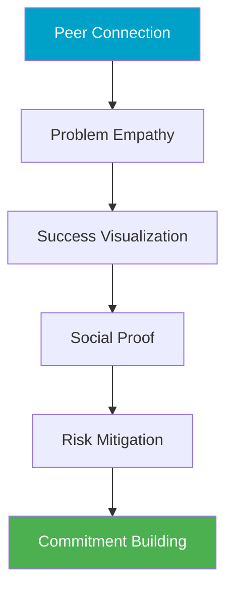

**Key Psychological Elements:**
- **Similarity bias**: Sales reps connecting with sales prospects
- **Aspiration psychology**: "Imagine your team's success"
- **Loss aversion**: "Don't let deals slip through the cracks"
- **Social proof**: "Join 150,000+ companies"

**Results:**
- 300% increase in enterprise deal closure
- 89% improvement in sales cycle efficiency
- 156% growth in average deal size

### Case Study 2: HubSpot's Inbound Sales Psychology

**The Challenge**: Changing traditional outbound sales mindset

**Psychological Strategy:**
- **Helper mentality**: Position sales as helpful, not pushy
- **Educational value**: Provide insights before selling
- **Buyer empowerment**: Help buyers make informed decisions
- **Authentic relationship**: Build genuine connections

**Psychological Transformation:**

| Traditional Sales | Inbound Sales Psychology | Buyer Response |
|------------------|-------------------------|----------------|
| Pitch immediately | Understand first | Increased openness |
| Product-focused | Problem-focused | Higher engagement |
| Pressure tactics | Educational approach | Reduced resistance |
| Transactional | Relationship-building | Long-term loyalty |

**Results:**
- 400% increase in qualified leads
- 67% improvement in sales-marketing alignment
- 234% growth in customer lifetime value

### Case Study 3: Zoom's Simplicity-Focused Sales Psychology

**The Challenge**: Selling against complex enterprise solutions

**Psychological Strategy:**
- **Simplicity emphasis**: "It just works"
- **Frustration identification**: Understanding complexity pain
- **Immediate value**: Quick setup and results
- **User-centric**: Focus on end-user experience

**Simplicity Psychology Framework:**

```mermaid
graph LR
    A[Complex Problem] --> B[Simple Solution]
    C[Frustration] --> D[Relief]
    E[Confusion] --> F[Clarity]
    G[Delay] --> H[Immediate Value]
    
    style B fill:#4caf50,color:#fff
    style D fill:#4caf50,color:#fff
    style F fill:#4caf50,color:#fff
    style H fill:#4caf50,color:#fff
```

**Results:**
- 500% increase in IT adoption rate
- 78% reduction in implementation time
- 345% growth in user satisfaction scores

---

## 🛠 **Implementation Framework: Sales Psychology Mastery**

### The 90-Day Sales Psychology Transformation

#### Month 1: Foundation and Assessment

**Week 1: Psychology Assessment**
- [ ] Evaluate current sales team psychological skills
- [ ] Assess buyer personality distribution
- [ ] Analyze current sales process psychology
- [ ] Identify psychological skill gaps

**Week 2: Buyer Psychology Profiling**
- [ ] Research target buyer personalities
- [ ] Create psychological buyer personas
- [ ] Map buyer journey emotions
- [ ] Develop psychology-based messaging

**Week 3: Trust and Rapport Training**
- [ ] Train team on CONNECT framework
- [ ] Practice mirroring and matching techniques
- [ ] Develop empathy-building skills
- [ ] Create rapport-building playbooks

**Week 4: Communication Psychology**
- [ ] Train personality-based communication
- [ ] Practice NLP techniques
- [ ] Develop questioning frameworks
- [ ] Create psychological discovery tools

#### Month 2: Advanced Technique Development

**Week 5-6: Objection Handling Psychology**
- [ ] Map objections to psychological roots
- [ ] Develop psychology-based responses
- [ ] Practice emotional objection handling
- [ ] Create objection psychology playbook

**Week 7-8: Closing Psychology Mastery**
- [ ] Train commitment-building techniques
- [ ] Practice psychological closing methods
- [ ] Develop urgency creation skills
- [ ] Create closing psychology toolkit

#### Month 3: Relationship and Optimization

**Week 9-10: Relationship Psychology**
- [ ] Develop long-term relationship strategies
- [ ] Train value-first approaches
- [ ] Practice reciprocity techniques
- [ ] Create relationship psychology system

**Week 11-12: Performance Optimization**
- [ ] Measure psychological technique effectiveness
- [ ] Optimize based on psychological insights
- [ ] Scale successful psychology applications
- [ ] Create ongoing psychology development program

### Sales Psychology Assessment Tools

#### **Salesperson Psychology Evaluation**

**Core Competencies Assessment:**

| Skill | Assessment Method | Proficiency Levels | Development Plan |
|-------|------------------|-------------------|------------------|
| **Emotional intelligence** | EQ assessment | 1-10 scale | Empathy training |
| **Communication adaptation** | Role-play scenarios | Beginner to expert | Personality training |
| **Trust building** | Customer feedback | Trust score | Rapport skill development |
| **Influence skills** | Sales result analysis | Conversion rates | Persuasion technique training |

#### **Buyer Psychology Profiling Tool**

**Quick Buyer Assessment Framework:**

```mermaid
flowchart TD
    A[Initial Interaction] --> B{Communication Style?}
    B -->|Direct, Fast| C[Driver Type]
    B -->|Detailed, Methodical| D[Analytical Type]
    B -->|Enthusiastic, Story-focused| E[Expressive Type]
    B -->|Collaborative, Supportive| F[Amiable Type]
    
    C --> G[Results-focused approach]
    D --> H[Data-driven approach]
    E --> I[Relationship-focused approach]
    F --> J[Support-focused approach]
```

---

## 🎯 **Key Takeaways: Mastering Sales Psychology**

### The Universal Laws of Sales Psychology

1. **People Buy from People They Trust**: Trust is the foundation of all sales success
2. **Emotion Drives Decision, Logic Justifies**: Address both emotional and rational needs
3. **Similarity Creates Connection**: Find and build on commonalities
4. **Understanding Precedes Influence**: Truly understand before attempting to persuade
5. **Relationships Enable Revenue**: Long-term thinking drives long-term results

### The Sales Psychology Success Formula

```
Sales Success = (Trust × Likability × Credibility × Value) / (Resistance × Complexity × Risk)
```

### Implementation Priority Order

1. **Trust building** (foundation for everything else)
2. **Buyer psychology understanding** (adaptation to their needs)
3. **Communication skills** (personality-based approaches)
4. **Relationship development** (long-term value creation)
5. **Advanced techniques** (NLP, influence, negotiation)

### The Sales Psychology Mastery Path

```mermaid
journey
    title Sales Psychology Development Journey
    section Foundation
      Trust building      : 8: Salesperson
      Rapport skills      : 7: Salesperson
      Active listening    : 9: Salesperson
    section Adaptation
      Buyer profiling     : 6: Salesperson
      Communication matching: 8: Salesperson
      Message customization: 7: Salesperson
    section Mastery
      Advanced influence  : 9: Salesperson
      Relationship building: 8: Salesperson
      Long-term success   : 9: Salesperson
```

---

## 📖 **Chapter Navigation**

**Previous:** [Chapter 10: Pricing Psychology and Value Perception](./chapter-10-pricing-psychology-value-perception.md)

**Next:** [Chapter 12: Onboarding Psychology and First Success](../part-5-activation-psychology/chapter-12-onboarding-psychology-first-success.md)

**Related Chapters:**
- [Chapter 4: The Psychology of Persuasion in SaaS](../part-2-behavioral-psychology/chapter-04-psychology-persuasion-saas.md)
- [Chapter 8: First Impressions and Trust Building](./chapter-08-first-impressions-trust-building.md)

---

*"In the digital age, human psychology becomes even more crucial. While technology can automate processes, it cannot automate trust, empathy, and human connection. Master the psychology of sales relationships, and you master the art of turning prospects into partners for life."*
