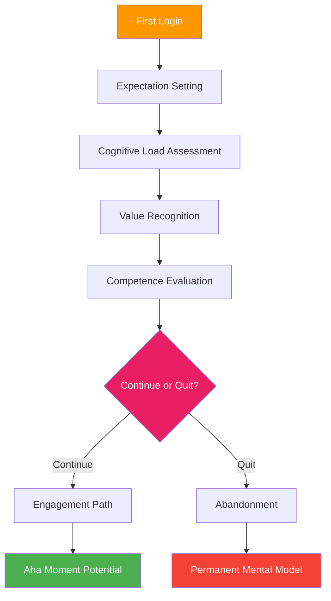
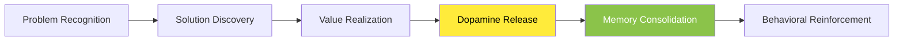
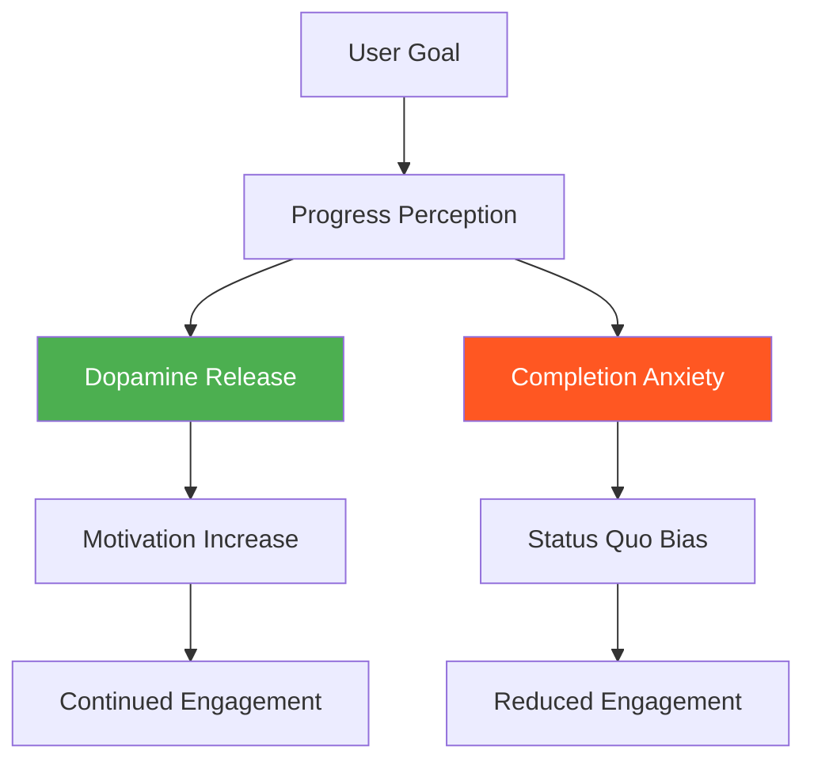
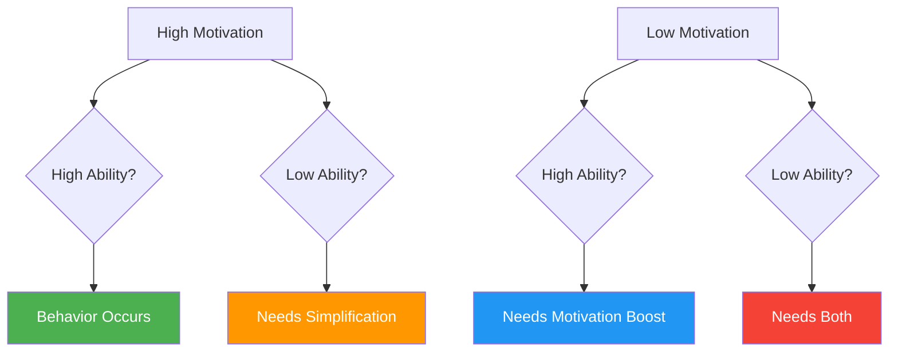
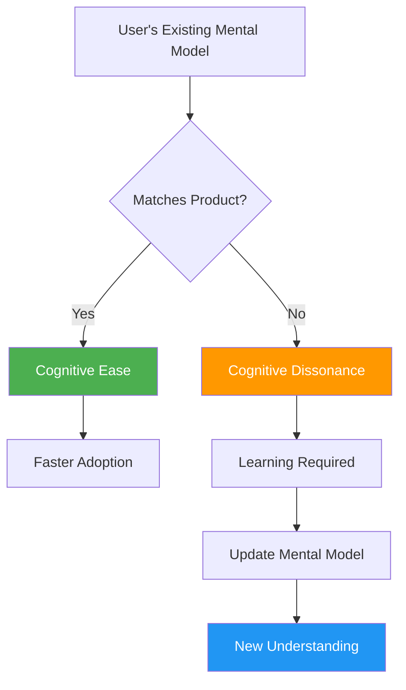

# Chapter 11: First-Use Psychology

*The Critical First 5 Minutes, Aha Moments, Progress Psychology, and Setting Mental Models*

---

## 🎯 **The Make-or-Break Moment**

The first use of a SaaS product is a critical psychological window that determines whether users become engaged customers or abandon the product forever. Research shows that users form lasting judgments about a product within the first 5 minutes, making this period the most important psychological battleground in the user journey.

This chapter reveals the psychology behind first-use experiences, how to engineer "aha moments," the science of progress psychology and early wins, balancing motivation with ability, and setting the right mental models that drive long-term success.

---

## 🧠 **The Neuroscience of First Impressions**

### The Critical 5-Minute Window

When users first interact with your SaaS product, their brains undergo a complex evaluation process that creates lasting neural pathways influencing all future interactions.

### The Psychology Behind First-Use Decisions

| **Psychological Factor** | **Time Window** | **Neural Process** | **Impact on Retention** |
|-------------------------|----------------|-------------------|------------------------|
| **Expectation Matching** | 0-30 seconds | Predictive processing | 85% correlation |
| **Cognitive Load** | 30-90 seconds | Working memory strain | 73% correlation |
| **Value Recognition** | 1-3 minutes | Reward pathway activation | 91% correlation |
| **Competence Building** | 3-5 minutes | Self-efficacy formation | 67% correlation |
| **Mental Model Formation** | 5-15 minutes | Long-term memory encoding | 94% correlation |

---

## 🎯 **Aha Moment Psychology**

### The Neuroscience of Discovery

An "aha moment" isn't just a marketing term—it's a specific neurological event where the brain experiences a dopamine surge as it recognizes value and forms positive associations.

### The Aha Moment Framework

**The 4-Stage Aha Moment Process:**

1. **Problem Acknowledgment**: User recognizes a pain point
2. **Solution Connection**: User sees how the product addresses the pain
3. **Value Quantification**: User understands the specific benefit
4. **Future Projection**: User envisions ongoing value

### SaaS Aha Moment Examples

| **Company** | **Aha Moment** | **Psychological Trigger** | **Time to Moment** |
|-------------|----------------|---------------------------|-------------------|
| **Slack** | Send first message in team channel | Social connection + efficiency | 2-3 minutes |
| **Canva** | Complete first design | Creative accomplishment | 5-7 minutes |
| **Notion** | Create first linked database | Organizational empowerment | 8-12 minutes |
| **Figma** | Real-time collaboration on design | Social productivity | 3-5 minutes |
| **Airtable** | Build first relational view | Data mastery | 10-15 minutes |

### Designing for Aha Moments

**The SPARK Method:**

- **S**implify the path to value
- **P**ersonalize the experience
- **A**ccelerate time-to-value
- **R**ecognize the achievement
- **K**eep the momentum going

---

## 📈 **Progress Psychology and Early Wins**

### The Neuroscience of Progress

The human brain is wired to seek progress and completion. Understanding progress psychology allows you to design experiences that create satisfaction and motivation even before users achieve their ultimate goals.

### The Progress Psychology Principles

**1. The Endowed Progress Effect**
- Users who feel they've already made progress are more likely to continue
- Pre-filled progress bars increase completion rates by 34%

**2. The Goal Gradient Effect**
- Motivation increases as users get closer to completion
- Breaking large goals into smaller milestones maintains momentum

**3. The Fresh Start Effect**
- Users are more motivated to pursue goals at temporal landmarks
- New users have heightened motivation for the first 48 hours

### Early Win Strategy Framework

| **Win Type** | **Psychological Reward** | **Implementation** | **Timing** |
|-------------|-------------------------|-------------------|-----------|
| **Competence Win** | Self-efficacy boost | Complete a simple task | First 2 minutes |
| **Social Win** | Belonging satisfaction | Connect with others | First 5 minutes |
| **Progress Win** | Achievement satisfaction | Visible progress marker | First 10 minutes |
| **Personalization Win** | Autonomy satisfaction | Customize something | First 15 minutes |
| **Value Win** | Utility satisfaction | Solve a real problem | First 30 minutes |

---

## ⚖️ **Motivation vs Ability Balance**

### The Fogg Behavior Model in First-Use

Stanford's Dr. BJ Fogg's behavior model is critical for first-use psychology: **Behavior = Motivation × Ability × Trigger**

### The First-Use Motivation-Ability Matrix

**High Motivation, High Ability**: Premium onboarding experience
**High Motivation, Low Ability**: Guided tutorial with hand-holding
**Low Motivation, High Ability**: Quick wins and immediate value
**Low Motivation, Low Ability**: Simplify and incentivize

### Motivation Factors in First Use

| **Motivation Type** | **Psychological Source** | **SaaS Implementation** |
|-------------------|-------------------------|------------------------|
| **Hope/Fear** | Loss aversion | "See what you're missing" |
| **Social Acceptance** | Belonging need | "Join 10,000+ users" |
| **Pleasure/Pain** | Hedonic adaptation | Gamification elements |

### Ability Factors in First Use

| **Ability Dimension** | **Psychological Constraint** | **Design Solution** |
|---------------------|----------------------------|-------------------|
| **Time** | Cognitive resource scarcity | Progressive disclosure |
| **Money** | Loss aversion | Free tier with clear value |
| **Physical Effort** | Effort justification | One-click actions |
| **Brain Cycles** | Cognitive load theory | Simplified interfaces |
| **Social Deviance** | Social proof need | Show popular choices |
| **Non-Routine** | Habit formation | Familiar patterns |

---

## 🧠 **Setting Expectations and Mental Models**

### The Psychology of Mental Models

Mental models are internal representations of how something works. In first-use experiences, you're either confirming existing mental models or helping users form new ones.

### The Mental Model Framework

**1. Familiar Foundations**
- Build on existing mental models when possible
- Use familiar metaphors and patterns

**2. Progressive Complexity**
- Start simple, add complexity gradually
- Don't overwhelm with advanced features initially

**3. Conceptual Scaffolding**
- Provide mental frameworks for understanding
- Use analogies and visual representations

### Mental Model Strategies by User Type

| **User Type** | **Existing Mental Model** | **Onboarding Strategy** |
|--------------|--------------------------|------------------------|
| **Switchers** | Strong competitor model | Highlight familiar + unique |
| **Upgraders** | Simpler tool model | Bridge from simple to advanced |
| **Novices** | No domain model | Build from fundamentals |
| **Experts** | Complex domain model | Show advanced capabilities |

---

## 🔧 **Implementation Framework: The FIRST Method**

### F-I-R-S-T: First-Use Psychology Framework

**F - Focus on Value**
- Identify the core value proposition
- Design the shortest path to that value
- Remove everything else from the first experience

**I - Immediate Progress**
- Create progress indicators
- Celebrate micro-achievements
- Build momentum from the start

**R - Reduce Friction**
- Minimize cognitive load
- Simplify decision-making
- Remove unnecessary steps

**S - Set Expectations**
- Communicate what's happening
- Provide clear next steps
- Build appropriate mental models

**T - Trigger Aha Moments**
- Design specific value realization points
- Create "wow" moments
- Reinforce positive associations

---

## 📊 **Measuring First-Use Psychology**

### Key Psychological Metrics

| **Metric** | **Psychological Measurement** | **Target Range** |
|-----------|-------------------------------|------------------|
| **Time to First Value** | Aha moment latency | < 5 minutes |
| **Completion Rate** | Motivation persistence | > 80% |
| **Cognitive Load Score** | Mental effort required | < 7/10 |
| **Expectation Match** | Surprise/disappointment | > 8/10 |
| **Competence Feeling** | Self-efficacy | > 7/10 |

### The First-Use Psychology Audit

**Questions to Ask:**

1. **Value Clarity**: Can users articulate the value within 2 minutes?
2. **Progress Feeling**: Do users feel they're making progress?
3. **Competence Building**: Do users feel capable and smart?
4. **Expectation Alignment**: Does the experience match expectations?
5. **Mental Model Fit**: Does the interface match user mental models?

---

## 🎯 **Chapter 11 Action Items**

### Immediate Implementation (Week 1)
- [ ] Map your current first-use experience
- [ ] Identify your aha moment
- [ ] Measure time-to-first-value
- [ ] Audit cognitive load in first 5 minutes

### Strategic Development (Month 1)
- [ ] Redesign onboarding using FIRST method
- [ ] Create progress indicators
- [ ] Implement early win opportunities
- [ ] A/B test motivation vs ability balance

### Long-term Optimization (Quarter 1)
- [ ] Develop user-type specific onboarding
- [ ] Create mental model alignment strategies
- [ ] Build comprehensive first-use analytics
- [ ] Establish first-use psychology feedback loops

---

## 🔗 **Connection to Other Chapters**

- **Chapter 1**: Builds on cognitive processing principles
- **Chapter 2**: Applies cognitive load theory
- **Chapter 8**: Extends first impression psychology
- **Chapter 12**: Leads into habit formation
- **Chapter 13**: Connects to feature adoption

---

*"The first use of your product is the first draft of your relationship with the customer. Make it count."*

**Next**: Chapter 12 explores how to turn successful first-use experiences into automatic habits through behavioral design patterns and the Hook Model.
