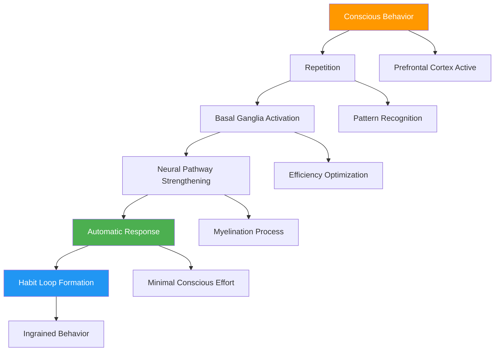
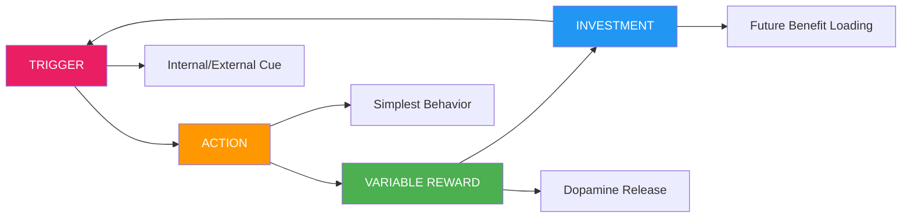
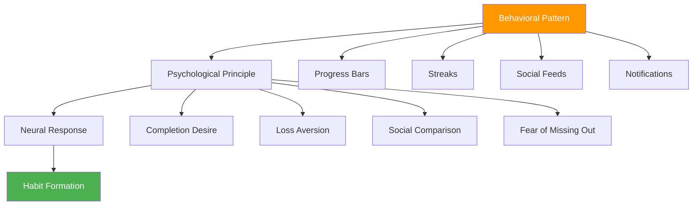
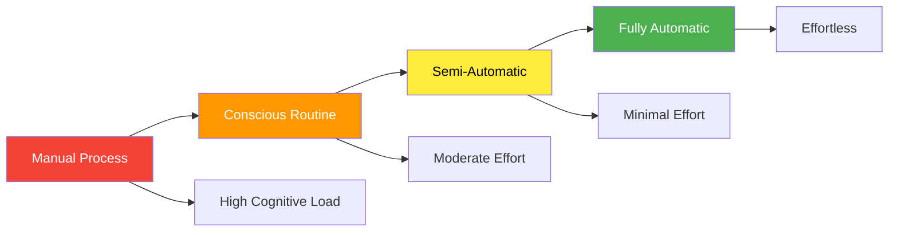
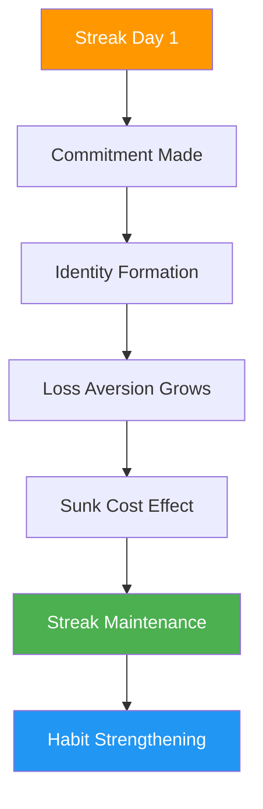
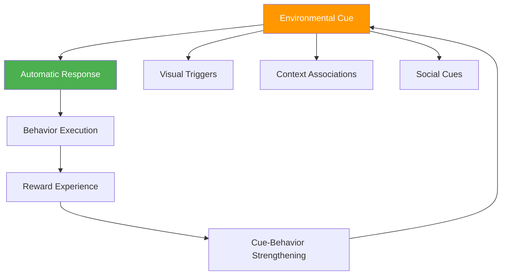
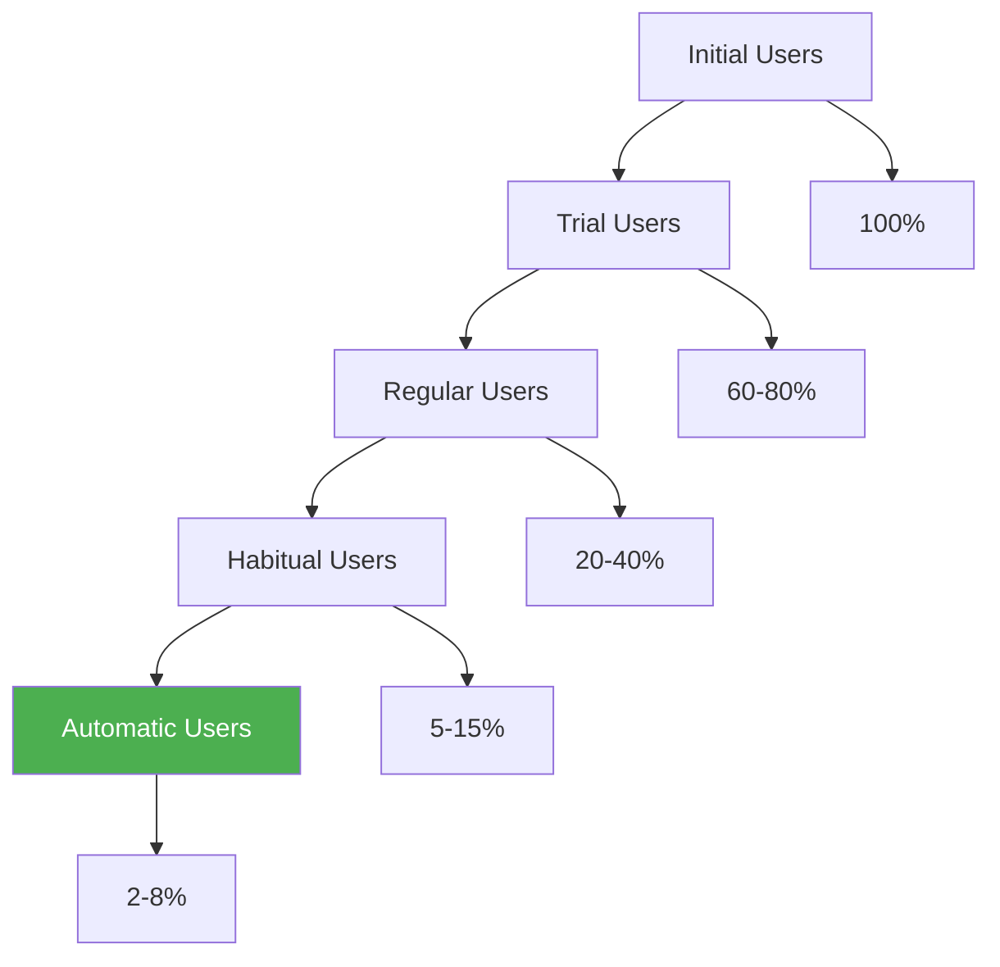

# Chapter 12: Habit Formation in SaaS

*The Hook Model Deep Dive, Behavioral Design Patterns, Creating Automatic Behaviors, Streaks Psychology, and Environmental Design*

---

## 🎯 **The Psychology of Automatic Behaviors**

Transforming occasional users into habitual users is the ultimate goal of SaaS psychology. Habits represent the pinnacle of user engagement—automatic behaviors that require minimal conscious effort and create lasting competitive advantages that are nearly impossible for competitors to break.

This chapter reveals the science behind habit formation, the Hook Model's psychological foundations, behavioral design patterns that create automatic usage, the psychology of streaks and consistency, and environmental design strategies that make your product indispensable.

---

## 🧠 **The Neuroscience of Habit Formation**

### How Habits Form in the Brain

Habit formation occurs through a neurological process that moves behaviors from conscious decision-making to automatic responses, creating neural pathways that become stronger with repetition.

### The Habit Formation Timeline

| **Stage** | **Duration** | **Neural Activity** | **User Experience** |
|-----------|-------------|-------------------|-------------------|
| **Initiation** | Days 1-7 | High prefrontal cortex activity | Conscious effort required |
| **Learning** | Days 8-21 | Basal ganglia engagement | Decreasing effort |
| **Stabilization** | Days 22-66 | Neural pathway myelination | Becoming automatic |
| **Automaticity** | Day 66+ | Minimal conscious processing | Effortless behavior |

---

## 🎣 **The Hook Model Deep Dive**

### Nir Eyal's Hook Model Psychology

The Hook Model isn't just a framework—it's based on deep psychological principles that govern how humans form behavioral patterns and emotional attachments to products.

### The Four Stages of the Hook Model

**1. TRIGGER: The Call to Action**

*External Triggers (Beginning)*
- Paid triggers: Advertising, sponsored content
- Earned triggers: PR, viral content
- Relationship triggers: Word-of-mouth recommendations
- Owned triggers: App notifications, email, newsletters

*Internal Triggers (Advanced)*
- Emotional states: Boredom, loneliness, frustration
- Situational contexts: Commuting, waiting, working
- Temporal patterns: Morning routine, end of workday

**2. ACTION: The Simplest Behavior**

Based on BJ Fogg's Behavior Model: **Behavior = Motivation × Ability × Trigger**

*High-Frequency SaaS Actions:*
- Opening the app/platform
- Checking notifications
- Performing core workflow
- Seeking information/answers
- Collaborating with others

**3. VARIABLE REWARD: The Dopamine Driver**

Three types of variable rewards that drive continued engagement:

*Rewards of the Tribe (Social)*
- Recognition from peers
- Community status
- Social validation
- Collaborative achievements

*Rewards of the Hunt (Achievement)*
- Progress indicators
- Level progression
- Goal completion
- Skill mastery

*Rewards of the Self (Identity)*
- Personal growth
- Creative expression
- Problem-solving satisfaction
- Autonomy fulfillment

**4. INVESTMENT: Loading the Next Trigger**

Users invest time, data, effort, or social capital, increasing the likelihood of returning and making the service more valuable with use.

*Types of Investment:*
- **Data**: User preferences, history, content
- **Content**: Created documents, designs, projects
- **Social**: Followers, connections, reputation
- **Skill**: Learned workflows, expertise
- **Time**: Customization, setup, configuration

---

## 🎯 **Behavioral Design Patterns**

### The Psychology of Design Patterns

Successful SaaS companies use specific design patterns that leverage psychological principles to encourage habitual use.

### Core Behavioral Design Patterns

| **Pattern** | **Psychological Principle** | **SaaS Implementation** | **Habit Impact** |
|-------------|----------------------------|------------------------|------------------|
| **Progress Indication** | Completion compulsion | Progress bars, percentages | High |
| **Social Proof** | Conformity bias | Activity feeds, user counts | Medium |
| **Commitment Consistency** | Cognitive dissonance reduction | Goal setting, public commitments | High |
| **Variable Ratio Schedules** | Intermittent reinforcement | Notifications, discoveries | Very High |
| **Loss Aversion** | Endowment effect | Streaks, accumulated data | High |
| **Social Comparison** | Competitive instinct | Leaderboards, benchmarks | Medium |

### Pattern Implementation Framework

**The HABIT Design Method:**

**H** - Hook users with compelling triggers
**A** - Align actions with existing behaviors
**B** - Build variable reward systems
**I** - Increase investment over time
**T** - Track and optimize habit metrics

---

## 🔥 **Creating Automatic Behaviors**

### The Automaticity Spectrum

Not all behaviors become equally automatic. Understanding the spectrum helps prioritize which behaviors to focus on for habit formation.

### The Automaticity Factors

**Frequency Requirements:**
- Daily behaviors: 18-254 days to automate (average 66 days)
- Weekly behaviors: 4-18 months to automate
- Monthly behaviors: Rarely become fully automatic

**Complexity Impact:**
- Simple behaviors (1-2 steps): Automate faster
- Complex behaviors (3+ steps): Require chunking
- Variable behaviors: Resist automation

### Designing for Automaticity

**1. Start Simple**
- Identify the minimum viable habit
- Remove unnecessary complexity
- Focus on single actions initially

**2. Create Context Cues**
- Associate behaviors with existing routines
- Use environmental triggers
- Build temporal patterns

**3. Reduce Friction**
- Minimize steps to completion
- Remove decision-making
- Optimize for speed

**4. Build Momentum**
- Celebrate small wins
- Create visible progress
- Link to identity ("I am someone who...")

---

## 📈 **The Psychology of Streaks and Consistency**

### Why Streaks Work: The Neuroscience

Streaks leverage multiple psychological principles simultaneously, making them one of the most powerful habit formation tools.

### The Psychological Mechanisms of Streaks

| **Mechanism** | **Days 1-7** | **Days 8-21** | **Days 22+** |
|---------------|--------------|---------------|--------------|
| **Commitment Consistency** | Initial promise | Building evidence | Strong identity |
| **Loss Aversion** | Small investment | Growing value | Significant loss potential |
| **Sunk Cost Fallacy** | Minimal investment | Noticeable effort | Major investment |
| **Identity Reinforcement** | Trying behavior | Seeing patterns | "I am this type of person" |
| **Social Proof** | Sharing attempts | Showing progress | Demonstrating mastery |

### Streak Design Principles

**1. Make Streaks Visible**
- Use visual representations (flames, chains, progress bars)
- Show current streak prominently
- Display personal best and historical data

**2. Create Streak Recovery**
- Allow "make-up" days for legitimate breaks
- Offer streak freezes for planned absences
- Provide gentle restart encouragement after breaks

**3. Celebrate Milestones**
- Acknowledge significant streak lengths (7, 30, 100 days)
- Create special rewards for long streaks
- Share achievements socially

**4. Design for Different Streak Types**
- Daily action streaks (login, core action)
- Weekly goal streaks (completing objectives)
- Monthly achievement streaks (hitting targets)

### SaaS Streak Examples

| **Company** | **Streak Type** | **Psychological Hook** | **Retention Impact** |
|-------------|----------------|----------------------|-------------------|
| **Duolingo** | Daily lesson completion | Language learning identity | +40% retention |
| **GitHub** | Daily commits | Developer identity | +35% activity |
| **Peloton** | Workout consistency | Fitness identity | +50% usage |
| **Todoist** | Task completion | Productivity identity | +25% engagement |

---

## 🏗️ **Environmental Design for Habit Building**

### The Psychology of Environmental Cues

Our environment shapes our behavior more than we realize. Strategic environmental design can make habits feel natural and effortless.

### Environmental Design Strategies

**1. Visual Environment Design**
- Strategic placement of action triggers
- Consistent visual cues across touchpoints
- Progress visualization in the interface

**2. Social Environment Design**
- Community features that encourage regular participation
- Social accountability mechanisms
- Peer influence systems

**3. Temporal Environment Design**
- Optimal timing for notifications and reminders
- Rhythm-based engagement patterns
- Time-based contextual triggers

**4. Digital Environment Integration**
- Browser bookmarks and shortcuts
- Mobile app placement strategies
- Integration with existing workflows

### The Habit-Forming Environment Checklist

**Visibility:**
- [ ] Are habit cues prominently displayed?
- [ ] Is progress immediately visible?
- [ ] Are next actions clearly indicated?

**Accessibility:**
- [ ] Can users access the habit behavior in < 30 seconds?
- [ ] Are there multiple pathways to the same action?
- [ ] Is the behavior available across all user contexts?

**Social Integration:**
- [ ] Are other users' behaviors visible?
- [ ] Is there social accountability?
- [ ] Can users share their progress?

**Reward Systems:**
- [ ] Are rewards immediate and visible?
- [ ] Do rewards vary to maintain interest?
- [ ] Are there both intrinsic and extrinsic rewards?

---

## 📊 **Measuring Habit Formation**

### Key Habit Metrics

| **Metric** | **Measurement** | **Target** | **Psychological Indicator** |
|-----------|----------------|-----------|---------------------------|
| **Frequency** | Actions per time period | Daily+ | Routine establishment |
| **Consistency** | Regular usage patterns | >80% days | Automaticity development |
| **Retention Curves** | Usage over time | Flattening curve | Habit stabilization |
| **Time to Action** | Speed of behavior | Decreasing | Reduced friction |
| **Context Independence** | Usage across situations | Increasing | True habit formation |

### The Habit Formation Funnel

### Habit Health Diagnostics

**Questions to Assess Habit Formation:**

1. **Trigger Effectiveness**: Are users responding to both external and internal triggers?
2. **Action Simplicity**: Is the core behavior simple enough to become automatic?
3. **Reward Variability**: Do users experience varied and satisfying rewards?
4. **Investment Growth**: Are users increasingly invested in the product over time?
5. **Context Generalization**: Do users engage across different contexts and situations?

---

## 🔧 **Implementation Framework: The AUTOMATIC Method**

### A-U-T-O-M-A-T-I-C: Habit Formation Framework

**A - Anchor to Existing Behaviors**
- Identify current user routines
- Link new behaviors to established habits
- Use temporal and contextual anchors

**U - Unify the Experience**
- Create consistent interaction patterns
- Maintain visual and functional consistency
- Build predictable user flows

**T - Trigger Strategically**
- Start with external triggers
- Gradually develop internal triggers
- Optimize trigger timing and frequency

**O - Optimize for Simplicity**
- Reduce cognitive load
- Minimize decision-making
- Streamline core actions

**M - Make Progress Visible**
- Show immediate feedback
- Display long-term progress
- Create milestone celebrations

**A - Add Variable Rewards**
- Implement multiple reward types
- Create unpredictable positive experiences
- Balance intrinsic and extrinsic motivation

**T - Track and Iterate**
- Measure habit formation metrics
- A/B test habit-forming features
- Continuously optimize based on data

**I - Increase Investment Over Time**
- Create opportunities for user investment
- Build switching costs naturally
- Develop user-generated value

**C - Create Social Connections**
- Build community features
- Enable social accountability
- Leverage peer influence

---

## 🎯 **Chapter 12 Action Items**

### Immediate Assessment (Week 1)
- [ ] Audit current user behaviors for habit potential
- [ ] Identify your product's Hook Model components
- [ ] Map existing behavioral design patterns
- [ ] Assess current habit formation metrics

### Strategic Implementation (Month 1)
- [ ] Design Hook Model optimization
- [ ] Implement streak systems for core behaviors
- [ ] Create environmental cues for habit formation
- [ ] Build habit tracking and analytics

### Long-term Development (Quarter 1)
- [ ] Develop comprehensive behavioral design system
- [ ] Create user journey optimization for automaticity
- [ ] Build advanced habit formation features
- [ ] Establish habit health monitoring

---

## 🔗 **Connection to Other Chapters**

- **Chapter 11**: Builds on first-use psychology foundations
- **Chapter 5**: Expands habit formation principles from Part 2
- **Chapter 13**: Connects to feature adoption psychology
- **Chapter 16**: Links to engagement psychology
- **Chapter 20**: Relates to retention psychology

---

*"The ultimate goal isn't just to create users—it's to create habits. When your product becomes automatic, you've achieved true product-market fit."*

**Next**: Chapter 13 explores how to extend habit formation principles to drive adoption of new features and capabilities.
