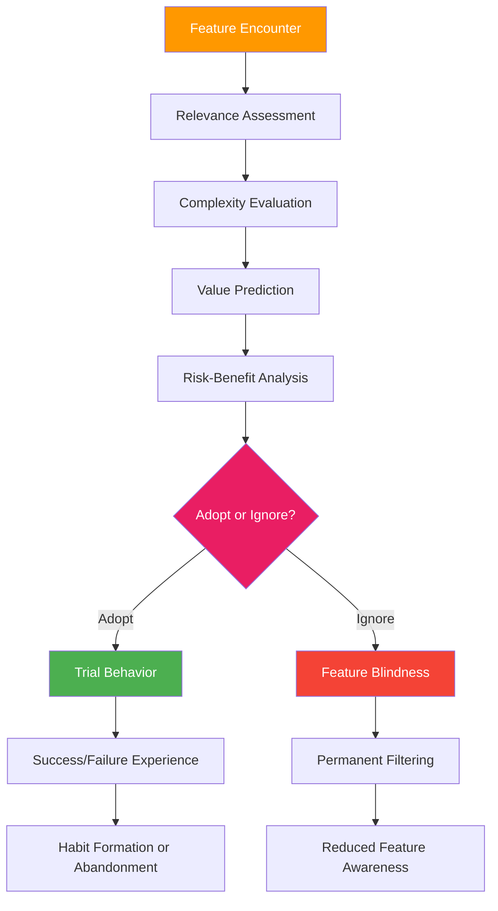
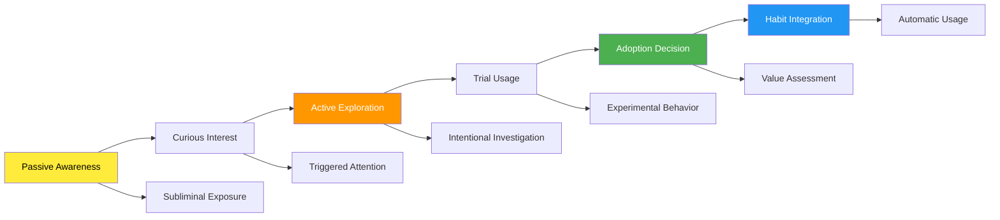
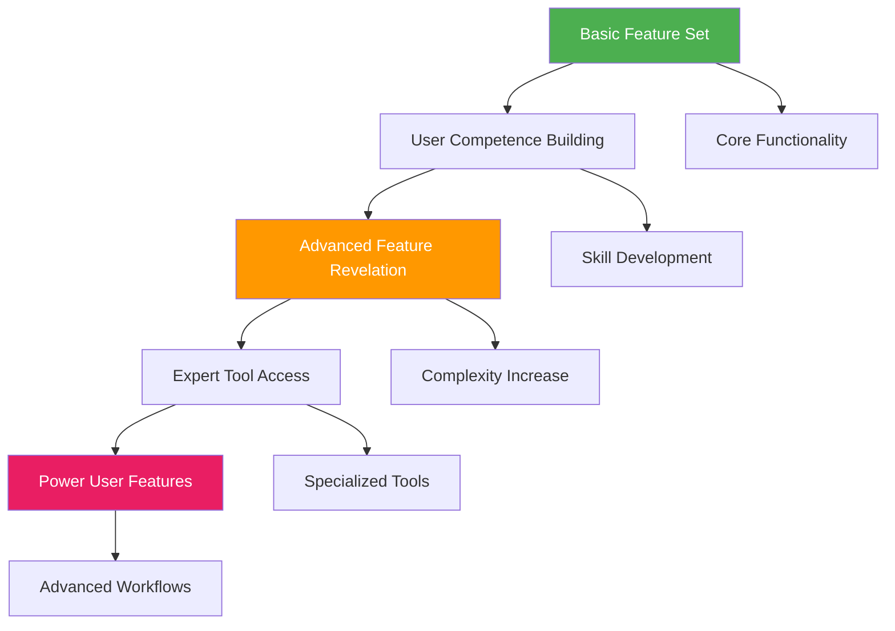
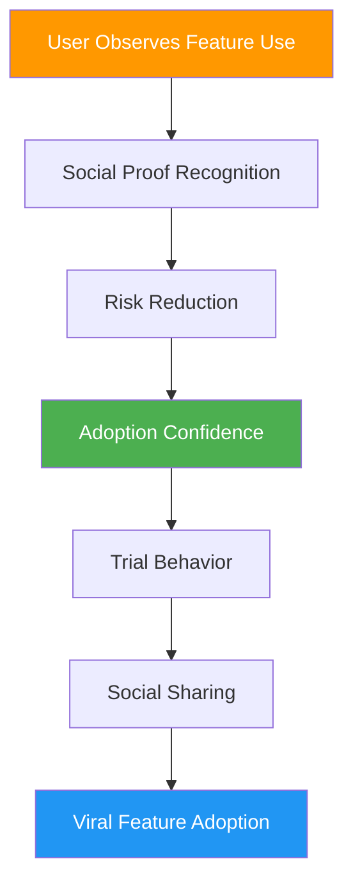
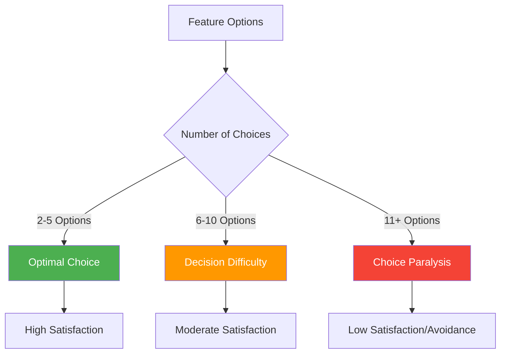
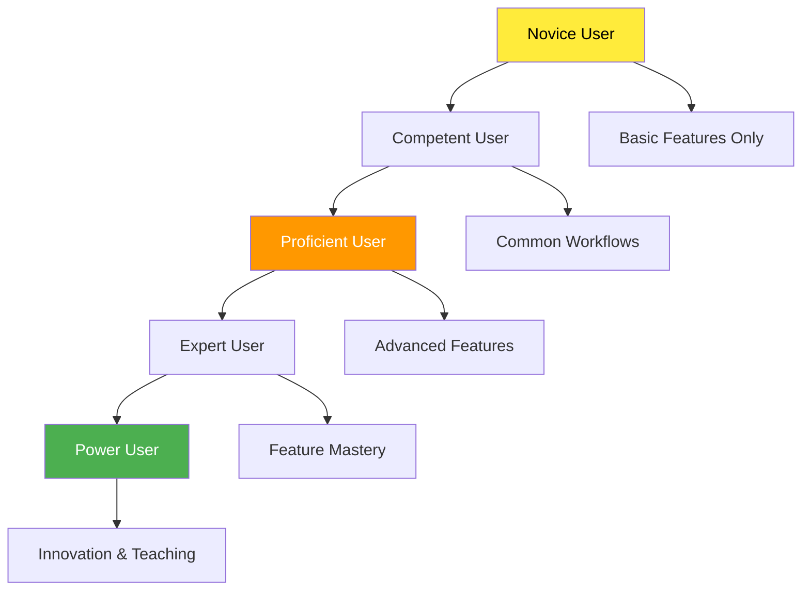
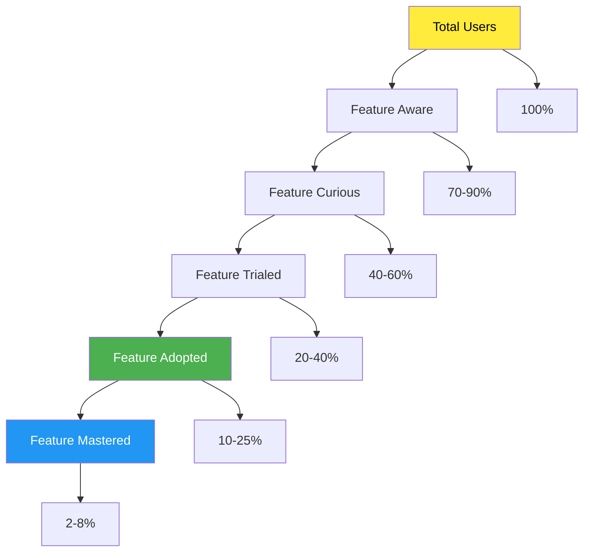

# Chapter 13: Feature Adoption Psychology

*The Psychology of Feature Discovery, Progressive Revelation, Social Learning, Choice Paradox, and Power User Development*

---

## 🎯 **The Feature Adoption Challenge**

Having users discover and adopt new features is one of the most complex psychological challenges in SaaS. Most users never explore beyond 20% of available features, creating a massive gap between product potential and user value realization. Understanding feature adoption psychology is crucial for maximizing user engagement and preventing churn.

This chapter reveals the psychological principles behind feature discovery, how to progressively reveal functionality without overwhelming users, the social dynamics of feature adoption, managing choice paradox in feature-rich products, and the psychology of developing power users.

---

## 🧠 **The Neuroscience of Feature Discovery**

### How the Brain Processes New Functionality

When users encounter new features, their brains undergo a complex evaluation process that determines whether they'll explore, adopt, or ignore the functionality.

### The Feature Adoption Psychological Barriers

| **Barrier Type** | **Psychological Mechanism** | **User Experience** | **Adoption Impact** |
|------------------|----------------------------|-------------------|-------------------|
| **Cognitive Overload** | Working memory limitations | "Too much to process" | 78% reduction |
| **Status Quo Bias** | Resistance to change | "Current way works fine" | 65% reduction |
| **Analysis Paralysis** | Choice overload | "Too many options" | 52% reduction |
| **Competence Anxiety** | Fear of failure | "I might break something" | 71% reduction |
| **Time Scarcity** | Perceived effort cost | "Don't have time to learn" | 84% reduction |
| **Relevance Doubt** | Value uncertainty | "Not sure if I need this" | 67% reduction |

---

## 🔍 **The Psychology of Feature Discovery**

### The Discovery Spectrum

Feature discovery exists on a psychological spectrum from passive awareness to active exploration, each requiring different psychological triggers.

### Discovery Triggers and Psychological Motivations

**1. Contextual Discovery**
- *Psychological Principle*: Relevance recognition
- *Implementation*: Show features when users encounter related problems
- *Example*: Notion shows database features when users create lists

**2. Social Discovery**
- *Psychological Principle*: Social proof and FOMO
- *Implementation*: Highlight features other users are adopting
- *Example*: Slack shows "Used by 50 people in your workspace"

**3. Progressive Disclosure**
- *Psychological Principle*: Manageable complexity
- *Implementation*: Reveal features as users demonstrate readiness
- *Example*: Figma unlocks advanced tools as users complete basic tasks

**4. Curiosity-Driven Discovery**
- *Psychological Principle*: Information gap theory
- *Implementation*: Create intrigue without overwhelming
- *Example*: Airtable's "Pro tip" hints at advanced functionality

### The Feature Discovery Framework

**The SPARK Discovery Method:**

**S** - **Situational Relevance**: Present features in context of user goals
**P** - **Progressive Complexity**: Introduce features in logical sequence
**A** - **Attention Direction**: Guide focus without overwhelming
**R** - **Relevance Confirmation**: Validate feature value immediately
**K** - **Knowledge Building**: Connect new features to existing understanding

---

## 📈 **Progressive Feature Revelation**

### The Psychology of Information Layering

Progressive revelation leverages cognitive load theory to present features in digestible layers that match users' evolving mental models and capabilities.

### The Revelation Timing Psychology

**1. Competence-Based Revelation**
- Reveal features when users demonstrate mastery of prerequisites
- Use behavioral signals to gauge readiness
- Avoid overwhelming novices with advanced features

**2. Need-Based Revelation**
- Present features when users encounter relevant problems
- Use contextual cues to determine feature relevance
- Connect features to immediate user goals

**3. Time-Based Revelation**
- Gradually introduce features over usage sessions
- Respect cognitive adaptation periods
- Allow users to request faster revelation

### Progressive Revelation Strategies

| **Strategy** | **Psychological Basis** | **Implementation** | **Best Use Case** |
|-------------|------------------------|-------------------|------------------|
| **Layered Menus** | Cognitive load management | Hierarchical feature organization | Complex tools |
| **Guided Tours** | Social learning theory | Step-by-step feature introduction | New user onboarding |
| **Contextual Hints** | Just-in-time learning | Situational feature suggestions | Workflow optimization |
| **Achievement Unlocks** | Gamification psychology | Feature access through accomplishment | Skill-based tools |
| **Usage Triggers** | Behavioral prediction | Feature revelation based on activity | Power user development |

### Case Study: Figma's Progressive Revelation

**Stage 1: Basic Drawing Tools** (Day 1-7)
- Rectangle, circle, line tools
- Basic color and text options
- Simple selection and movement

**Stage 2: Design System Features** (Day 8-21)
- Components and instances
- Styles and libraries
- Layout grids

**Stage 3: Collaboration Tools** (Day 22-60)
- Real-time collaboration
- Comments and annotations
- Version history

**Stage 4: Advanced Features** (Day 61+)
- Auto-layout and constraints
- Plugins and integrations
- Advanced prototyping

*Result: 73% higher feature adoption rate compared to showing all features immediately*

---

## 🤝 **Social Learning and Feature Adoption**

### The Psychology of Social Feature Discovery

Humans are inherently social learners. Feature adoption accelerates dramatically when users observe others successfully using features, creating social proof and reducing perceived risk.

### Social Learning Mechanisms

**1. Observational Learning**
- *Psychological Principle*: Bandura's social learning theory
- *Implementation*: Show feature usage by teammates/peers
- *Example*: "John used the new calendar feature 5 times this week"

**2. Social Proof Cascades**
- *Psychological Principle*: Informational social influence
- *Implementation*: Display adoption statistics and trends
- *Example*: "89% of teams like yours use this feature"

**3. Peer Influence**
- *Psychological Principle*: Social identity theory
- *Implementation*: Feature recommendations from similar users
- *Example*: "Users in marketing roles frequently use..."

**4. Collaborative Discovery**
- *Psychological Principle*: Cooperative learning
- *Implementation*: Features that require or benefit from collaboration
- *Example*: Slack's channel features that improve with team participation

### The Social Adoption Framework

**The TRIBE Method:**

**T** - **Transparency**: Make feature usage visible to others
**R** - **Recommendations**: Suggest features based on peer behavior
**I** - **Influence**: Leverage social connections for feature promotion
**B** - **Belonging**: Connect feature adoption to group identity
**E** - **Expertise**: Showcase feature mastery within social context

### Social Learning Implementation Strategies

| **Strategy** | **Psychological Trigger** | **Technical Implementation** | **Adoption Increase** |
|-------------|-------------------------|----------------------------|---------------------|
| **Usage Dashboards** | Social comparison | Team feature usage analytics | +34% |
| **Peer Recommendations** | Homophily bias | Similar user suggestions | +47% |
| **Collaborative Features** | Social facilitation | Multi-user functionality | +62% |
| **Expert Showcases** | Authority influence | Power user demonstrations | +28% |
| **Team Challenges** | Group identity | Collective feature goals | +41% |

---

## ⚖️ **The Paradox of Choice in Feature Sets**

### Choice Overload Psychology

While features provide value, too many options can paradoxically decrease adoption and satisfaction. Understanding choice psychology is crucial for feature presentation.

### The Choice Paradox Principles

**1. The Magic Number Seven**
- Cognitive psychology suggests 7±2 items as optimal for decision-making
- Feature menus should respect working memory limitations
- Group related features to reduce cognitive load

**2. Choice Architecture**
- The way choices are presented dramatically affects selection
- Default options carry significant psychological weight
- Order effects influence perceived importance

**3. Decision Fatigue**
- Each choice depletes mental resources
- Users avoid features requiring complex decisions
- Simplification increases adoption rates

### Managing Choice Complexity

**The SIMPLE Framework:**

**S** - **Simplify**: Reduce unnecessary options
**I** - **Intelligently Default**: Use smart defaults based on user context
**M** - **Modularize**: Break complex features into smaller components
**P** - **Personalize**: Customize options based on user behavior
**L** - **Learn**: Use data to optimize choice presentation
**E** - **Eliminate**: Remove underused or confusing options

### Choice Management Strategies

| **Strategy** | **Psychological Principle** | **Implementation** | **Usage Impact** |
|-------------|----------------------------|-------------------|------------------|
| **Smart Defaults** | Status quo bias | AI-driven option selection | +52% adoption |
| **Progressive Options** | Cognitive load theory | Reveal options gradually | +38% completion |
| **Categorization** | Chunking principle | Group related features | +29% findability |
| **Recommendation Engine** | Authority bias | Suggest optimal choices | +44% satisfaction |
| **Customizable Interfaces** | Personal agency | User-controlled complexity | +31% engagement |

### Case Study: Slack's Choice Management

**Challenge**: 100+ integrations overwhelming users
**Solution**: 
- Categorize by use case (productivity, communication, etc.)
- Show only 5 most relevant integrations initially
- Use team usage data for personalized recommendations
- Provide search with intelligent filtering

**Result**: 67% increase in integration adoption, 34% reduction in choice abandonment

---

## 🚀 **Power User Psychology**

### The Psychology of Expertise Development

Power users represent the pinnacle of feature adoption, but their development follows predictable psychological patterns that can be encouraged and accelerated.

### Power User Development Stages

**1. Feature Hunger (Weeks 2-4)**
- Psychological State: Curiosity and exploration
- Behavior: Trying new features rapidly
- Support Needed: Discovery mechanisms and tutorials

**2. Workflow Optimization (Weeks 5-12)**
- Psychological State: Efficiency seeking
- Behavior: Integrating features into workflows
- Support Needed: Automation and customization options

**3. Mastery Demonstration (Weeks 13-26)**
- Psychological State: Competence and confidence
- Behavior: Teaching others and sharing knowledge
- Support Needed: Social features and recognition

**4. Innovation and Extension (Weeks 27+)**
- Psychological State: Creative application
- Behavior: Using features in novel ways
- Support Needed: Advanced capabilities and flexibility

### The Power User Psychological Profile

**Motivational Drivers:**
- **Mastery**: Desire to fully understand and control the tool
- **Efficiency**: Drive to optimize workflows and save time
- **Status**: Recognition for expertise and influence
- **Autonomy**: Ability to customize and control experience
- **Purpose**: Using expertise to help others and achieve goals

**Behavioral Characteristics:**
- High tolerance for complexity
- Preference for keyboard shortcuts and automation
- Tendency to explore hidden or advanced features
- Willingness to invest time in learning for long-term benefit
- Desire to share knowledge and teach others

### Designing for Power User Development

**The POWER Framework:**

**P** - **Provide Advanced Features**: Offer depth for exploration
**O** - **Optimize for Efficiency**: Enable speed and automation
**W** - **Welcome Complexity**: Don't oversimplify for experts
**E** - **Enable Customization**: Allow personal optimization
**R** - **Recognize Expertise**: Acknowledge and celebrate mastery

### Power User Feature Strategies

| **Feature Type** | **Psychological Appeal** | **Implementation** | **Power User Value** |
|------------------|-------------------------|-------------------|---------------------|
| **Keyboard Shortcuts** | Efficiency and mastery | Customizable hotkeys | Speed optimization |
| **Automation Tools** | Cognitive offloading | Macros and scripts | Workflow efficiency |
| **Advanced Settings** | Control and customization | Granular configuration | Personal optimization |
| **Expert Mode** | Status and competence | Simplified interfaces toggle | Professional identity |
| **API Access** | Creativity and extension | Developer tools | Innovation enablement |

### Case Study: Notion's Power User Journey

**Stage 1: Template Discovery** (Weeks 1-4)
- Users discover pre-built templates
- Psychology: Reduces barrier to entry
- Features: Gallery and quick setup

**Stage 2: Database Mastery** (Weeks 5-12)
- Users learn relational databases
- Psychology: Competence building
- Features: Relations, rollups, formulas

**Stage 3: System Building** (Weeks 13-26)
- Users create complex interconnected systems
- Psychology: Creative expression
- Features: Advanced properties, automation

**Stage 4: Community Leadership** (Weeks 27+)
- Users share templates and teach others
- Psychology: Status and purpose
- Features: Publishing, collaboration

*Result: Power users have 8x higher retention and 3x higher expansion revenue*

---

## 📊 **Measuring Feature Adoption Psychology**

### Key Psychological Metrics

| **Metric** | **Psychological Measurement** | **Target Range** | **Insight** |
|-----------|-------------------------------|------------------|-------------|
| **Discovery Rate** | Awareness and attention | 70-90% | Feature visibility |
| **Trial Rate** | Motivation and confidence | 40-60% | Adoption barriers |
| **Adoption Rate** | Value recognition | 20-40% | Relevance match |
| **Retention Rate** | Habit formation | 60-80% | Stickiness |
| **Mastery Rate** | Competence development | 10-25% | Power user potential |

### The Feature Adoption Funnel

### Psychological Adoption Diagnostics

**Questions to Assess Feature Adoption:**

1. **Discovery**: Are users aware features exist?
2. **Relevance**: Do users understand feature value?
3. **Confidence**: Do users feel capable of using features?
4. **Motivation**: Do users have sufficient drive to try features?
5. **Success**: Do users achieve their goals with features?
6. **Integration**: Do features fit into existing workflows?

---

## 🔧 **Implementation Framework: The ADOPT Method**

### A-D-O-P-T: Feature Adoption Psychology Framework

**A - Awareness Creation**
- Make features discoverable in context
- Use multiple discovery channels
- Respect attention economics

**D - Desire Building**
- Communicate clear value propositions
- Use social proof and testimonials
- Address skepticism and concerns

**O - Obstacle Removal**
- Reduce cognitive load and complexity
- Provide adequate support and guidance
- Minimize risk perception

**P - Progressive Engagement**
- Start with simple use cases
- Build complexity gradually
- Celebrate early wins

**T - Transformation Support**
- Enable workflow integration
- Provide advanced capabilities
- Develop mastery pathways

---

## 🎯 **Chapter 13 Action Items**

### Immediate Assessment (Week 1)
- [ ] Audit current feature adoption rates
- [ ] Identify most underutilized valuable features
- [ ] Map feature discovery pathways
- [ ] Analyze choice complexity in your interface

### Strategic Implementation (Month 1)
- [ ] Implement progressive feature revelation
- [ ] Create social learning mechanisms
- [ ] Reduce choice overload in feature presentation
- [ ] Design power user development pathways

### Long-term Optimization (Quarter 1)
- [ ] Build comprehensive feature adoption analytics
- [ ] Develop personalized feature recommendation system
- [ ] Create community-driven feature education
- [ ] Establish power user recognition programs

---

## 🔗 **Connection to Other Chapters**

- **Chapter 11**: Builds on first-use psychology principles
- **Chapter 12**: Extends habit formation to feature adoption
- **Chapter 14**: Connects to daily engagement psychology
- **Chapter 16**: Links to personalization psychology
- **Chapter 27**: Relates to psychological research methods

---

*"Features don't create value—feature adoption creates value. Master the psychology of adoption, and you maximize your product's potential."*

**Next**: Chapter 14 explores how to create daily engagement habits that keep users coming back consistently and predictably.
