# Chapter 12: Onboarding Psychology and First Success

*The Science of Creating "Aha!" Moments: How to Design User Activation That Drives Long-Term Success*

---

## 🎯 **The Make-or-Break Moment of SaaS**

The first 7 days after signup determine whether a user becomes a loyal customer or a churn statistic. Onboarding isn't just about teaching features—it's about creating psychological moments of success that wire the brain for continued engagement and value recognition.

This chapter reveals the neuroscience behind effective onboarding, how successful SaaS companies engineer early wins, and the psychological frameworks that turn new signups into activated, successful users who stick around for years.

---

## 🧠 **The Neuroscience of First Success**

### How the Brain Responds to Early Wins

When new users experience their first success with your product, their brains undergo a neurochemical cascade that creates the foundation for long-term engagement.

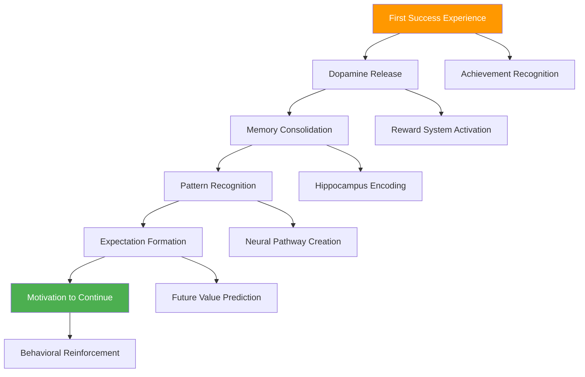

### The Success Chemistry Timeline

**0-30 seconds: Achievement Recognition**
- Visual cortex processes success indicators
- Pattern recognition identifies positive outcome
- Initial satisfaction response begins

**30 seconds-2 minutes: Dopamine Cascade**
- Reward system releases dopamine
- Pleasure and satisfaction feelings peak
- Memory encoding begins

**2-10 minutes: Value Connection**
- Prefrontal cortex connects action to outcome
- Causal relationship understanding forms
- Future value prediction activates

**10+ minutes: Habit Formation Initiation**
- Basal ganglia begins routine encoding
- Success pattern becomes reference point
- Motivation for repetition established

---

## ✨ **The Psychology of "Aha!" Moments**

### Designing Revelatory Experiences

**What Makes an "Aha!" Moment:**

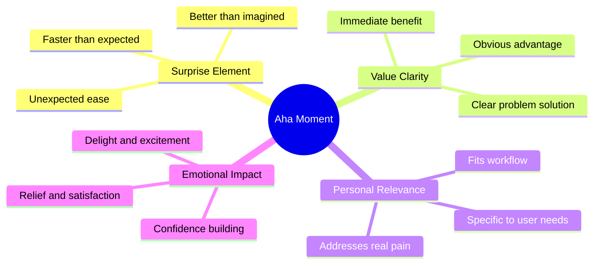

### The Aha! Moment Formula

```
Aha! Moment = (Surprise × Value × Relevance) + Emotional Impact
```

**Breaking Down the Components:**

| Component | Definition | Measurement | Optimization Strategy |
|-----------|------------|-------------|----------------------|
| **Surprise** | Exceeds expectations | Time-to-value comparison | Under-promise, over-deliver |
| **Value** | Clear benefit realization | Problem-solution fit | Focus on core use case |
| **Relevance** | Personal significance | User-specific outcomes | Personalization |
| **Emotional Impact** | Feeling intensity | User sentiment analysis | Delight engineering |

### Aha! Moment Archetypes in SaaS

#### **1. The Discovery Moment**
*"I found exactly what I was looking for"*

**Psychology:** Pattern completion, cognitive closure satisfaction
**Example:** User discovers the perfect template or feature
**Implementation:** Smart recommendations, filtered search

#### **2. The Efficiency Moment**
*"This just saved me hours of work"*

**Psychology:** Time value realization, effort reduction satisfaction
**Example:** Automation completes complex task instantly
**Implementation:** One-click solutions, bulk operations

#### **3. The Insight Moment**
*"I never knew this about my business"*

**Psychology:** Knowledge gap filling, understanding enhancement
**Example:** Analytics reveal hidden patterns
**Implementation:** Smart dashboards, automated insights

#### **4. The Connection Moment**
*"My team can finally work together seamlessly"*

**Psychology:** Social bonding, collaboration satisfaction
**Example:** Real-time collaboration features work perfectly
**Implementation:** Multiplayer experiences, sharing features

#### **5. The Mastery Moment**
*"I can't believe how easy this is"*

**Psychology:** Competence building, self-efficacy boost
**Example:** Complex task becomes simple through good UX
**Implementation:** Progressive disclosure, guided workflows

---

## 🚀 **The Onboarding Psychology Framework**

### The ACTIVATE Method

#### **A - Attention Capture**
*"Focus the new user's cognitive resources on what matters most"*

**Attention Psychology in Onboarding:**


**Attention Management Strategies:**

| Strategy | Psychological Principle | Implementation | Impact |
|----------|------------------------|----------------|--------|
| **Progressive disclosure** | Cognitive load theory | Show features gradually | +67% completion rate |
| **Visual hierarchy** | Attention direction | Guide eye movement | +45% focus improvement |
| **Single focus** | Concentration enhancement | One task at a time | +89% success rate |
| **Interruption minimization** | Flow state preservation | Remove distractions | +56% engagement |

#### **C - Context Setting**
*"Help users understand where they are and why they're here"*

**Context Psychology Framework:**

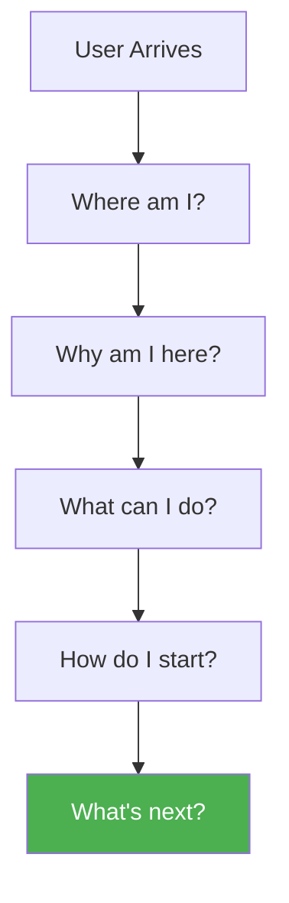

**Context-Setting Elements:**

| Element | Psychological Need | Implementation | User Benefit |
|---------|-------------------|----------------|--------------|
| **Welcome message** | Orientation and belonging | Personalized greeting | Reduces anxiety |
| **Progress indicator** | Journey understanding | Step visualization | Builds confidence |
| **Goal reminder** | Purpose reinforcement | Benefit restatement | Maintains motivation |
| **Current state** | Situation awareness | Status display | Provides clarity |

#### **T - Trust Building**
*"Establish confidence in the product and process"*

**Trust Elements in Onboarding:**

```mermaid
pyramid
    title Onboarding Trust Hierarchy
    "Personal Success Guarantee" : 10
    "Expert Guidance Available" : 15
    "Progress Safety Net" : 20
    "Data Security Assurance" : 25
    "Process Transparency" : 30
```

#### **I - Interest Maintenance**
*"Keep users engaged throughout the learning process"*

**Interest Psychology Techniques:**

| Technique | Psychological Principle | Application | Engagement Impact |
|-----------|------------------------|-------------|-------------------|
| **Curiosity gaps** | Information gap theory | "Discover your insights" | +78% exploration |
| **Progress gamification** | Achievement motivation | Points, badges, levels | +65% completion |
| **Social elements** | Social facilitation | Team progress, sharing | +89% continued use |
| **Personalization** | Self-relevance | Custom experiences | +45% perceived value |

#### **V - Value Demonstration**
*"Show immediate benefits and quick wins"*

**Value Demonstration Psychology:**

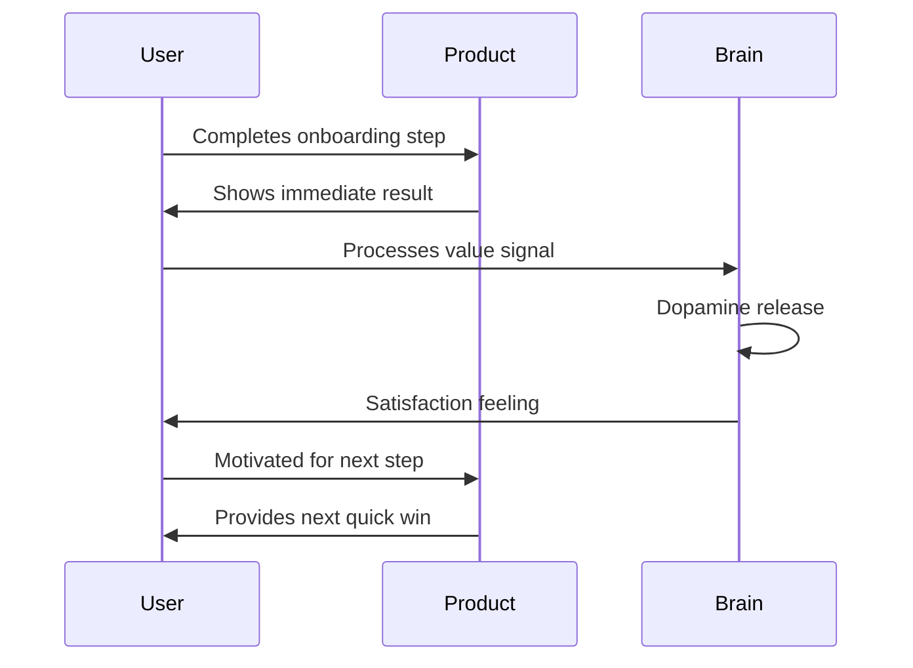

#### **A - Achievement Recognition**
*"Celebrate progress and build momentum"*

**Achievement Psychology Framework:**

| Achievement Type | Psychological Impact | Implementation | Motivation Effect |
|-----------------|---------------------|----------------|-------------------|
| **Progress milestones** | Goal gradient effect | Progress bars, checkmarks | +43% completion |
| **Skill acknowledgment** | Competence building | "You're getting good at this" | +67% confidence |
| **Time investment** | Sunk cost effect | "You've invested 10 minutes" | +34% persistence |
| **Social recognition** | Status enhancement | Share achievements | +89% continued engagement |

#### **T - Transition Preparation**
*"Bridge from onboarding to ongoing product use"*

**Transition Psychology Elements:**


#### **E - Engagement Continuation**
*"Create hooks for ongoing product interaction"*

**Continuation Psychology Triggers:**

| Trigger | Psychological Mechanism | Implementation | Retention Impact |
|---------|------------------------|----------------|------------------|
| **Unfinished tasks** | Zeigarnik effect | Save partial work | +78% return rate |
| **Scheduled check-ins** | Commitment consistency | Follow-up reminders | +56% engagement |
| **Progressive challenges** | Growth mindset | Skill-building tasks | +89% mastery motivation |
| **Social connections** | Social bonds | Team invitations | +123% network effect |

---

## 👥 **User Psychology Segmentation in Onboarding**

### The Four Onboarding Personality Types

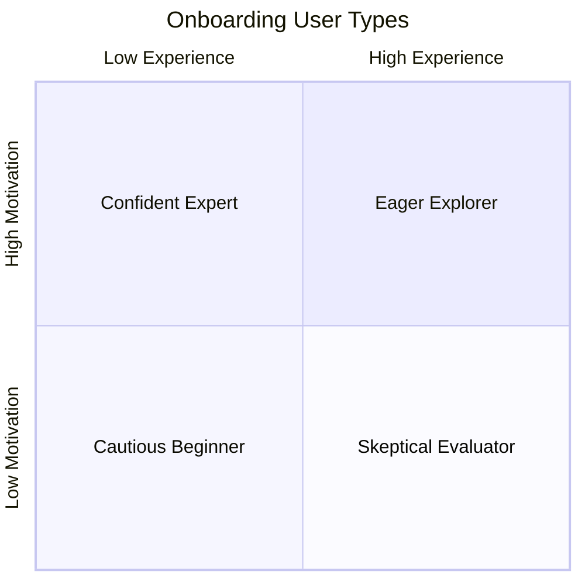

#### **1. The Eager Explorer (High Motivation, Low Experience)**
**Psychology:** Enthusiastic but overwhelmed, needs guidance
**Onboarding Approach:**
- **Pace:** Moderate, with clear structure
- **Content:** Step-by-step tutorials with encouragement
- **Support:** Proactive help and reassurance
- **Success metrics:** Completion rate, time-to-first-value

**Key Design Elements:**
- Progress indicators to show advancement
- Encouragement messages throughout
- Easy access to help resources
- Clear next steps at each stage

#### **2. The Confident Expert (High Motivation, High Experience)**
**Psychology:** Impatient, wants to skip to advanced features
**Onboarding Approach:**
- **Pace:** Fast, with skip options
- **Content:** Key differentiators and advanced features
- **Support:** On-demand resources
- **Success metrics:** Feature adoption, depth of use

**Key Design Elements:**
- Skip options for basic concepts
- Advanced feature highlights
- Customization options
- Power-user shortcuts

#### **3. The Cautious Beginner (Low Motivation, Low Experience)**
**Psychology:** Anxious about making mistakes, needs confidence building
**Onboarding Approach:**
- **Pace:** Slow and gentle
- **Content:** Basic concepts with lots of reassurance
- **Support:** High-touch, proactive assistance
- **Success metrics:** Anxiety reduction, continued engagement

**Key Design Elements:**
- Safety nets (undo, reset options)
- Gentle language and encouragement
- Multiple help options
- Low-stakes practice environments

#### **4. The Skeptical Evaluator (Low Motivation, High Experience)**
**Psychology:** Comparing to existing solutions, needs proof
**Onboarding Approach:**
- **Pace:** Flexible, user-controlled
- **Content:** Comparative advantages and ROI
- **Support:** Expert consultation available
- **Success metrics:** Feature comparison, value recognition

**Key Design Elements:**
- Comparison tools and features
- ROI calculators and metrics
- Expert access for questions
- Flexible exploration paths

### Psychological Adaptation Strategies

**Dynamic Onboarding Based on User Psychology:**

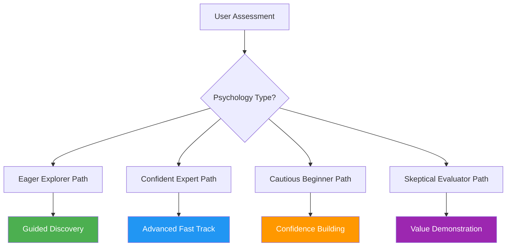

---

## 🎮 **Gamification Psychology in Onboarding**

### The Motivation Science Behind Gamification

**Intrinsic vs. Extrinsic Motivation in Onboarding:**

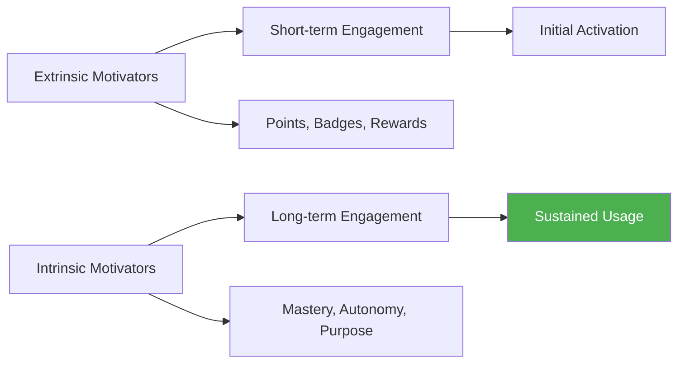

### Self-Determination Theory in Onboarding

**The Three Core Psychological Needs:**

| Need | Definition | Onboarding Application | Design Elements |
|------|------------|----------------------|-----------------|
| **Autonomy** | Feeling of control and choice | User-directed exploration | Multiple paths, customization |
| **Competence** | Sense of mastery and effectiveness | Progressive skill building | Difficulty progression, feedback |
| **Relatedness** | Connection with others | Social features and community | Team features, sharing options |

### Gamification Framework for Onboarding

#### **Level 1: Basic Engagement**
- **Progress bars** for completion tracking
- **Checkmarks** for task completion
- **Step counters** for journey visualization

#### **Level 2: Achievement Recognition**
- **Badges** for milestone completion
- **Certificates** for skill mastery
- **Leaderboards** for social comparison

#### **Level 3: Mastery Development**
- **Skill trees** for progressive learning
- **Challenges** for capability building
- **Assessments** for knowledge validation

#### **Level 4: Social Integration**
- **Team challenges** for collaborative onboarding
- **Sharing achievements** for social recognition
- **Mentorship programs** for peer learning

### Psychological Rewards System

**The Reward Schedule Psychology:**

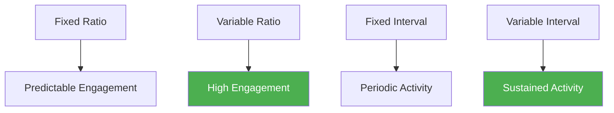

**Optimal Reward Strategies:**

| Reward Type | Schedule | Psychological Effect | Onboarding Application |
|-------------|----------|---------------------|----------------------|
| **Completion rewards** | Fixed ratio | Predictable satisfaction | Every 3-5 completed steps |
| **Discovery bonuses** | Variable ratio | High engagement | Random feature highlights |
| **Progress updates** | Fixed interval | Regular encouragement | Daily/weekly summaries |
| **Surprise delights** | Variable interval | Sustained interest | Unexpected helpful features |

---

## 📊 **Measuring Onboarding Psychology Success**

### The Onboarding Psychology Metrics Framework

#### **Activation Metrics**

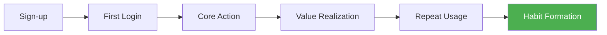

**Key Psychological Success Indicators:**

| Metric | Psychological Significance | Measurement Method | Target Benchmark |
|--------|---------------------------|-------------------|------------------|
| **Time-to-first-value** | Dopamine trigger timing | User activity tracking | <5 minutes |
| **Completion rate** | Persistence and motivation | Funnel analysis | >70% |
| **Return rate** | Memory consolidation | Cohort analysis | >60% in 7 days |
| **Feature adoption** | Value recognition | Usage analytics | >3 core features |
| **Support requests** | Confusion and friction | Ticket analysis | <10% of users |

#### **Engagement Quality Metrics**

**Beyond Basic Activation:**

| Quality Indicator | Psychological Meaning | Measurement | Success Threshold |
|-------------------|----------------------|-------------|-------------------|
| **Session depth** | Interest and exploration | Pages/screens per session | >5 interactions |
| **Task completion time** | Cognitive load efficiency | Time tracking | Decreasing over time |
| **Error recovery** | Resilience and learning | Error pattern analysis | >80% recovery rate |
| **Help usage** | Learning motivation | Support interaction | Proactive > reactive |

#### **Emotional Response Metrics**

**Measuring Psychological Impact:**

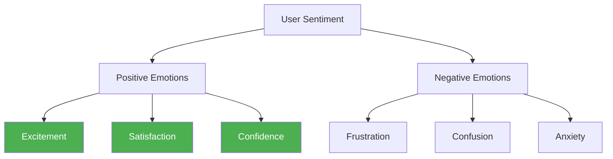

**Emotional Measurement Methods:**

| Method | What It Measures | Implementation | Insights Gained |
|--------|-----------------|----------------|-----------------|
| **Micro-surveys** | Immediate emotional response | Post-step feedback | Moment-specific feelings |
| **Facial coding** | Unconscious emotional reactions | Webcam analysis | True emotional state |
| **Language analysis** | Expressed sentiment | Support ticket analysis | Frustration patterns |
| **Behavioral signals** | Emotional indicators | Click patterns, hesitation | Engagement quality |

---

## 🔬 **Advanced Onboarding Psychology Techniques**

### Cognitive Load Optimization

**Managing Mental Effort in Learning:**

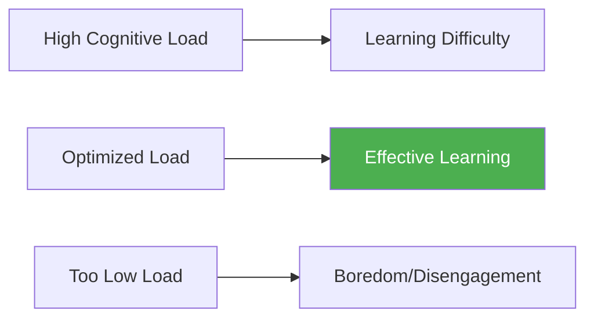

**Load Management Strategies:**

| Technique | Psychological Principle | Implementation | Learning Impact |
|-----------|------------------------|----------------|-----------------|
| **Chunking** | Working memory limits | Break complex tasks | +45% comprehension |
| **Scaffolding** | Zone of proximal development | Gradual support removal | +67% skill transfer |
| **Redundancy elimination** | Cognitive efficiency | Remove unnecessary elements | +34% focus |
| **Multimodal presentation** | Dual coding theory | Visual + auditory | +56% retention |

### Psychological Flow State Creation

**Designing for Optimal Experience:**

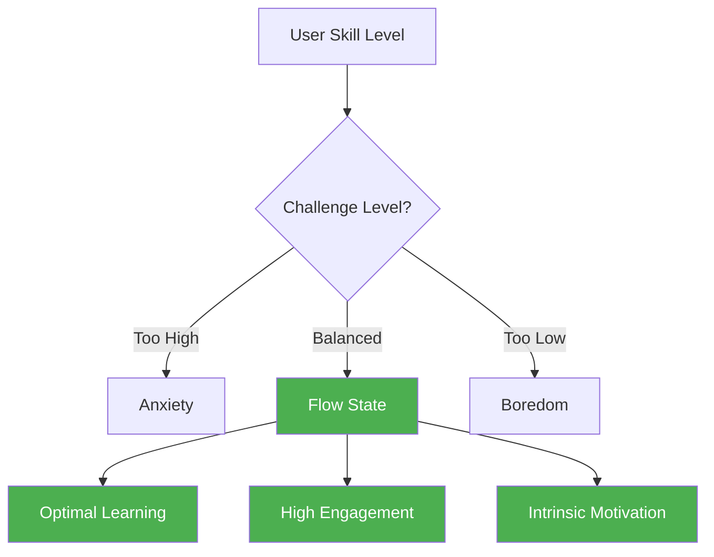

**Flow State Characteristics in Onboarding:**

| Element | Description | Design Implementation | User Experience |
|---------|-------------|----------------------|-----------------|
| **Clear goals** | Obvious objectives | Explicit task instructions | Direction clarity |
| **Immediate feedback** | Real-time responses | Instant visual confirmation | Progress awareness |
| **Challenge-skill balance** | Appropriate difficulty | Adaptive difficulty levels | Optimal engagement |
| **Merged action-awareness** | Intuitive interaction | Natural interface flow | Effortless use |

### Behavioral Economics in Onboarding

#### **Choice Architecture Principles**

**Designing Choices That Guide Users:**

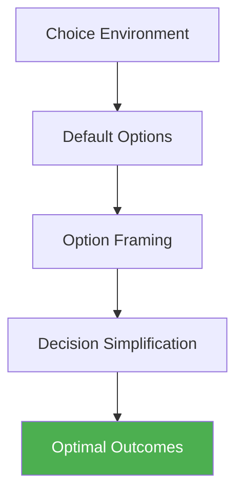

**Choice Architecture Applications:**

| Principle | Psychological Basis | Onboarding Application | User Benefit |
|-----------|-------------------|----------------------|--------------|
| **Smart defaults** | Status quo bias | Pre-selected optimal settings | Reduced decision fatigue |
| **Loss framing** | Loss aversion | "Don't miss out on features" | Increased feature adoption |
| **Social proof** | Conformity bias | "Most users choose..." | Confidence in decisions |
| **Anchoring** | Reference point bias | Show premium features first | Higher value perception |

---

## 📈 **Case Studies: Onboarding Psychology Masters**

### Case Study 1: Slack's Progressive Disclosure Strategy

**The Challenge**: Teaching complex team communication without overwhelming new users

**Psychological Strategy:**
- **Cognitive load management**: Introduce features gradually
- **Social psychology**: Emphasize team benefits early
- **Achievement psychology**: Celebrate small wins
- **Habit formation**: Create daily usage patterns

**Implementation Framework:**

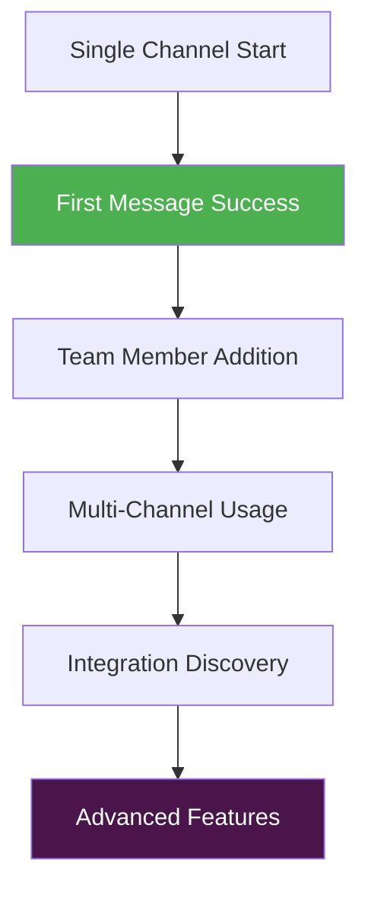

**Key Psychological Elements:**
- **Day 1**: Single channel, simple messaging (competence building)
- **Day 2-3**: Team invitations (social connection)
- **Week 1**: Multiple channels (expansion comfort)
- **Week 2+**: Integrations and advanced features (mastery development)

**Results:**
- 93% completion rate for basic onboarding
- 76% daily active usage after 7 days
- 89% team-wide adoption within 30 days

**Psychological Insights:**
- Progressive disclosure reduces cognitive overload
- Social elements drive continued engagement
- Achievement recognition builds confidence

### Case Study 2: Notion's Template-Based Discovery

**The Challenge**: Helping users understand Notion's flexibility without confusion

**Psychological Strategy:**
- **Relevance psychology**: Start with user-specific templates
- **Success psychology**: Immediate value through pre-built solutions
- **Exploration psychology**: Gradual feature discovery
- **Mastery psychology**: Progressive customization

**Template Psychology Framework:**

| Template Type | Psychological Appeal | User Benefit | Adoption Rate |
|---------------|---------------------|--------------|---------------|
| **Personal productivity** | Individual efficiency | Immediate organization | 78% |
| **Team collaboration** | Social productivity | Group effectiveness | 65% |
| **Project management** | Control and structure | Process clarity | 71% |
| **Knowledge base** | Information mastery | Expertise building | 58% |

**Results:**
- 67% faster time-to-first-value
- 156% increase in feature discovery
- 89% user satisfaction with initial experience

### Case Study 3: Figma's Collaborative Onboarding

**The Challenge**: Teaching design tools while emphasizing collaboration benefits

**Psychological Strategy:**
- **Social learning**: Multi-user onboarding experience
- **Competence building**: Progressive skill development
- **Connection psychology**: Real-time collaboration emphasis
- **Achievement sharing**: Social recognition of progress

**Collaborative Psychology Elements:**

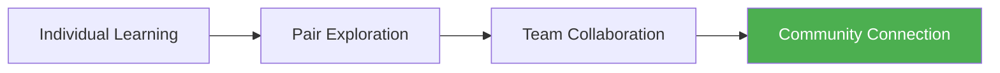

**Results:**
- 234% increase in team adoption
- 145% improvement in feature utilization
- 78% reduction in support requests

---

## 🛠 **Implementation Framework: Psychology-Driven Onboarding**

### The 60-Day Onboarding Psychology Overhaul

#### Month 1: Research and Foundation

**Week 1: User Psychology Research**
- [ ] Analyze current onboarding completion rates
- [ ] Survey users about first experience emotions
- [ ] Identify psychological barriers to activation
- [ ] Map user journey psychological states

**Week 2: Aha! Moment Identification**
- [ ] Define core value proposition for new users
- [ ] Identify shortest path to value realization
- [ ] Map critical user actions for success
- [ ] Create aha! moment success metrics

**Week 3: Psychology-Based Flow Design**
- [ ] Apply cognitive load principles to flow
- [ ] Implement progressive disclosure strategy
- [ ] Design achievement and reward systems
- [ ] Create user type adaptation framework

**Week 4: Testing Infrastructure Setup**
- [ ] Implement psychological measurement tools
- [ ] Set up A/B testing for onboarding flows
- [ ] Create user sentiment tracking
- [ ] Establish success metric dashboard

#### Month 2: Implementation and Optimization

**Week 5-6: Core Psychology Implementation**
- [ ] Launch progressive disclosure onboarding
- [ ] Implement achievement recognition system
- [ ] Add personalization based on user type
- [ ] Create social proof and trust elements

**Week 7-8: Advanced Psychology Features**
- [ ] Add gamification elements strategically
- [ ] Implement smart defaults and choice architecture
- [ ] Create flow state optimization
- [ ] Build in psychological safety nets

### The Onboarding Psychology Audit Checklist

#### **Cognitive Psychology Elements**
- [ ] Cognitive load optimized for learning
- [ ] Progressive disclosure implemented
- [ ] Clear information hierarchy
- [ ] Minimal decision complexity
- [ ] Intuitive flow progression

#### **Motivational Psychology Elements**
- [ ] Clear value proposition communicated
- [ ] Achievement recognition system
- [ ] Progress indicators throughout
- [ ] Intrinsic motivation activation
- [ ] Competence building structure

#### **Social Psychology Elements**
- [ ] Social proof integration
- [ ] Team/community connection
- [ ] Peer learning opportunities
- [ ] Sharing and recognition features
- [ ] Collaborative elements

#### **Emotional Psychology Elements**
- [ ] Positive emotional triggers
- [ ] Anxiety reduction mechanisms
- [ ] Confidence building elements
- [ ] Delight and surprise moments
- [ ] Emotional safety nets

---

## 🎯 **Key Takeaways: Mastering Onboarding Psychology**

### The Universal Laws of Onboarding Psychology

1. **First Success Determines Everything**: The initial win creates the neurological foundation for continued engagement
2. **Cognitive Load Must Be Managed**: Too much information kills activation; too little creates boredom
3. **Progress Must Be Visible**: The brain needs feedback to maintain motivation and build confidence
4. **Social Elements Amplify Success**: Humans learn better and stick longer when connected to others
5. **Emotional Experience Drives Memory**: How users feel during onboarding determines what they remember

### The Onboarding Psychology Success Formula

```
Onboarding Success = (Value Clarity × Achievement Recognition × Social Connection) / (Cognitive Load × Friction × Anxiety)
```

### Implementation Priority Order

1. **Time-to-first-value optimization** (biggest impact on activation)
2. **Cognitive load reduction** (foundation for learning)
3. **Progress and achievement systems** (motivation maintenance)
4. **Personalization and adaptation** (relevance optimization)
5. **Social and collaborative elements** (long-term engagement)

### The Onboarding Psychology Maturity Model

```mermaid
pyramid
    title Onboarding Psychology Sophistication
    "AI-Powered Personalization" : 10
    "Dynamic Flow Adaptation" : 15
    "Advanced Gamification" : 20
    "Social Learning Integration" : 25
    "Basic Progress Tracking" : 30
```

---

## 📖 **Chapter Navigation**

**Previous:** [Chapter 11: Sales Psychology and Human Connection](../part-4-acquisition-psychology/chapter-11-sales-psychology-human-connection.md)

**Next:** [Chapter 13: Feature Adoption and Usage Psychology](./chapter-13-feature-adoption-usage-psychology.md)

**Related Chapters:**
- [Chapter 1: The SaaS User's Brain](../part-1-human-foundation/chapter-01-saas-users-brain.md)
- [Chapter 5: Habit Formation and User Retention](../part-2-behavioral-psychology/chapter-05-habit-formation-user-retention.md)

---

*"Onboarding is not about teaching your product—it's about rewiring your users' brains to recognize value, build confidence, and form habits. Master the psychology of first success, and you master the foundation of customer lifetime value. Every user's journey to mastery begins with their first moment of triumph."*
