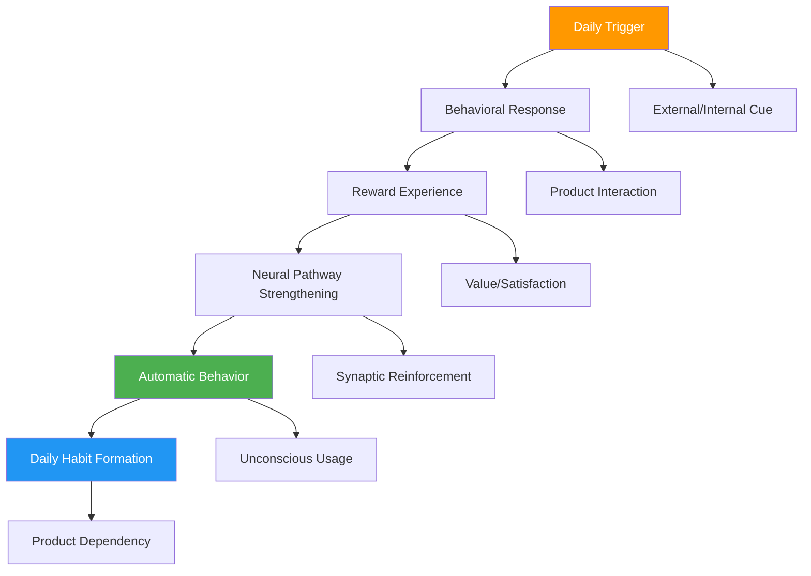
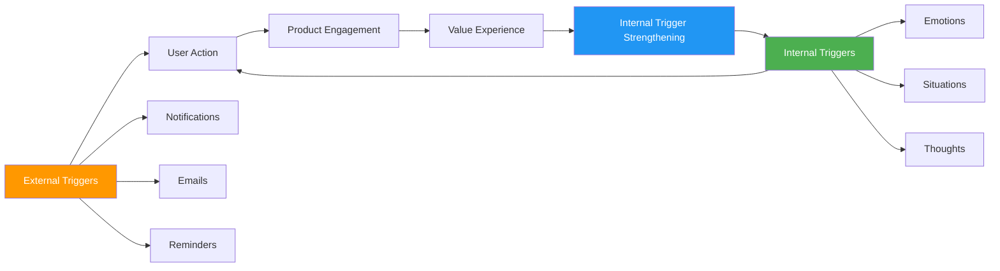
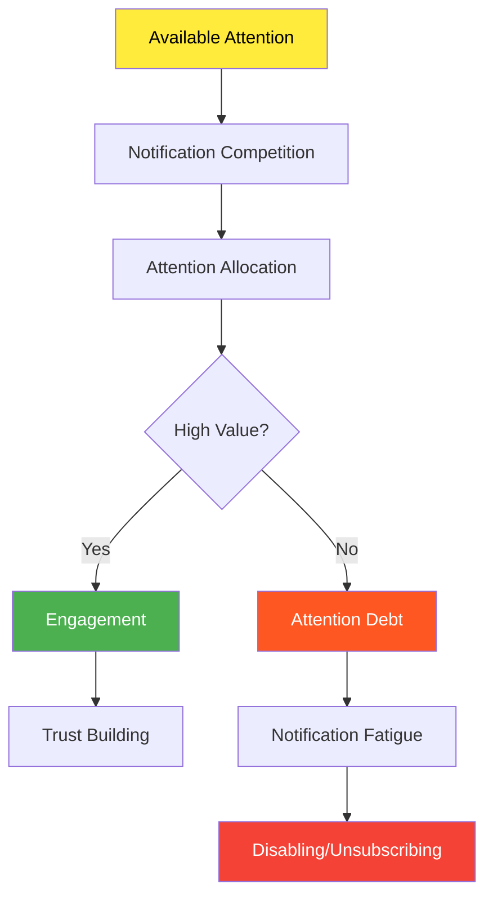
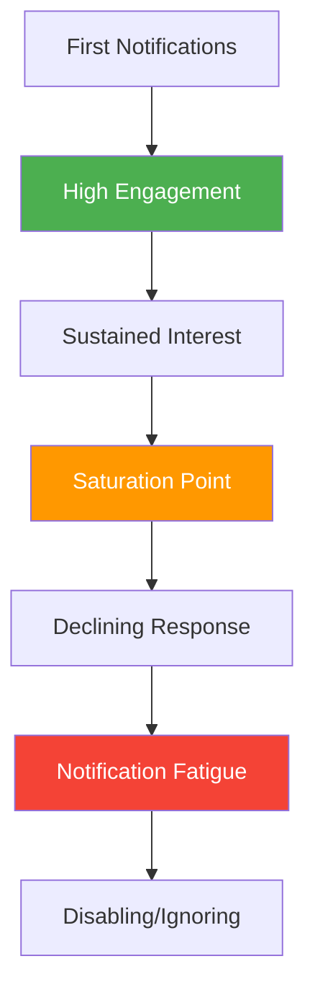
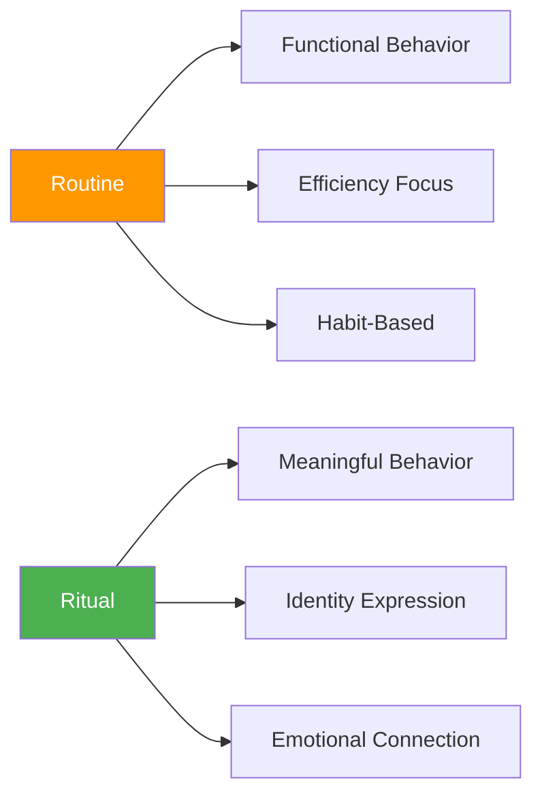
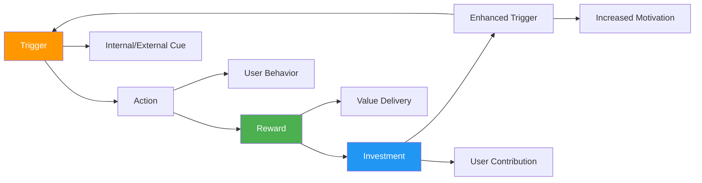
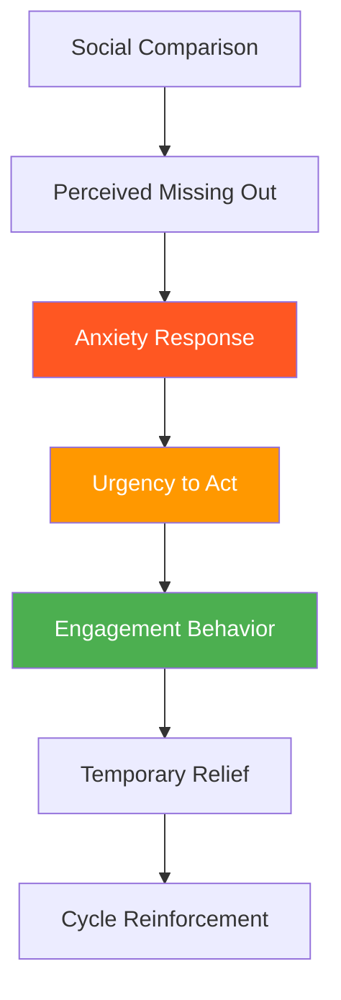
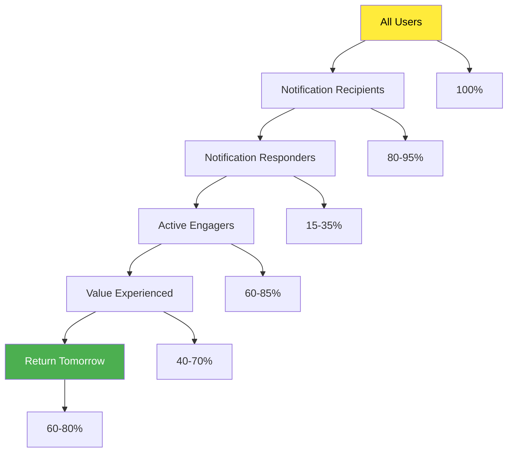

# Chapter 14: The Psychology of Daily Active Use

*Trigger Psychology, Notification Economics, Routine and Ritual Psychology, Engagement Loops, and FOMO Psychology*

---

## 🎯 **The Daily Engagement Imperative**

Daily active usage is the holy grail of SaaS engagement. Products that become part of users' daily routines create psychological dependency that drives retention, expansion, and viral growth. Understanding the psychology behind daily engagement is crucial for building sustainable, long-term user relationships.

This chapter reveals the psychological triggers that drive daily usage, how notifications influence attention and behavior, the science of routines and rituals, designing engagement loops that create habitual return, and leveraging FOMO psychology to create urgency without manipulation.

---

## 🧠 **The Neuroscience of Daily Habits**

### How Daily Behaviors Form Neural Pathways

Daily usage creates strong neural pathways through repetition, environmental cues, and reward associations, making products feel essential rather than optional.

### The Daily Usage Psychology Timeline

| **Stage** | **Duration** | **Psychological State** | **Neural Activity** | **User Experience** |
|-----------|-------------|------------------------|-------------------|-------------------|
| **Initiation** | Days 1-3 | Conscious effort | High prefrontal activity | "I need to remember to use this" |
| **Routine Building** | Days 4-14 | Developing patterns | Basal ganglia engagement | "Getting into a rhythm" |
| **Habit Stabilization** | Days 15-66 | Automatic responses | Neural pathway myelination | "Just part of my day" |
| **Deep Integration** | Day 67+ | Unconscious dependency | Minimal conscious processing | "Can't imagine working without it" |

---

## 🔔 **Trigger Psychology (External vs Internal)**

### The Dual-Trigger System

Successful daily engagement products master both external triggers (notifications, emails, reminders) and internal triggers (emotions, situations, thoughts) to create comprehensive engagement systems.

### External Trigger Psychology

**1. Notification Psychology**
- *Optimal Timing*: Based on individual usage patterns and availability
- *Relevance Matching*: Personalized to user context and needs
- *Urgency Calibration*: Balanced to create action without annoyance

**2. Environmental Cues**
- *Visual Triggers*: App icons, browser bookmarks, desktop shortcuts
- *Contextual Triggers*: Location-based, time-based, activity-based
- *Social Triggers*: Team activity, peer usage, collaborative needs

**3. Reward Schedule Optimization**
- *Variable Ratio Schedules*: Intermittent reinforcement for maximum engagement
- *Fixed Interval Schedules*: Predictable value delivery for routine building
- *Continuous Reinforcement*: Immediate feedback for new behaviors

### Internal Trigger Psychology

**1. Emotional Triggers**
- *Boredom*: "Let me check what's new"
- *Anxiety*: "I need to make sure everything's okay"
- *Curiosity*: "I wonder what happened while I was away"
- *FOMO*: "I might be missing something important"

**2. Situational Triggers**
- *Transitional Moments*: Between meetings, during commutes, waiting periods
- *Routine Anchors*: Morning coffee, lunch break, end of workday
- *Problem Recognition*: When specific needs arise

**3. Social Triggers**
- *Collaboration Needs*: Team communication requirements
- *Status Checking*: Monitoring social connections and updates
- *Reciprocity Pressure*: Responding to others' actions

### Trigger Optimization Framework

**The TRIGGER Method:**

**T** - **Time**: Optimize timing based on user behavior patterns
**R** - **Relevance**: Ensure triggers match user context and needs
**I** - **Intensity**: Calibrate urgency and attention-grabbing power
**G** - **Gradual**: Develop internal triggers through external trigger success
**G** - **Goal-Aligned**: Connect triggers to user objectives
**E** - **Emotional**: Leverage emotional states for maximum response
**R** - **Reciprocal**: Create trigger loops that reinforce themselves

---

## 📱 **Notification Psychology and Attention Economics**

### The Attention Economy Psychology

In an attention-scarce environment, notifications compete for the most valuable resource: human attention. Understanding attention economics is crucial for effective notification strategy.

### The Psychology of Notification Response

**Notification Response Factors:**

| **Factor** | **Psychological Principle** | **Optimization Strategy** | **Response Rate Impact** |
|-----------|----------------------------|--------------------------|-------------------------|
| **Sender Authority** | Authority bias | Brand trust and reputation | +45% |
| **Personal Relevance** | Self-reference effect | Personalization and context | +67% |
| **Social Proof** | Conformity pressure | Peer activity and usage | +34% |
| **Urgency Indicators** | Loss aversion | Time-sensitive language | +28% |
| **Value Clarity** | Cognitive ease | Clear benefit communication | +52% |
| **Timing Optimization** | Availability heuristic | Context-aware scheduling | +41% |

### Notification Fatigue Psychology

**The Notification Fatigue Curve:**

**Preventing Notification Fatigue:**

1. **Frequency Optimization**: Adaptive notification frequency based on response rates
2. **Value Threshold**: Only notify when value exceeds attention cost
3. **Personalization**: Tailored timing, content, and channels
4. **User Control**: Granular notification preferences and controls
5. **Feedback Loops**: Monitor and respond to engagement metrics

### Smart Notification Strategies

**The NOTIFY Framework:**

**N** - **Necessary**: Only send when action is truly needed
**O** - **Optimal Timing**: Respect user schedules and preferences
**T** - **Tailored**: Personalized content and context
**I** - **Interactive**: Enable immediate action when possible
**F** - **Feedback**: Learn from user responses and preferences
**Y** - **Yield Control**: Provide user agency over notification settings

---

## 🔄 **The Psychology of Routine and Ritual**

### Routine vs Ritual Psychology

While routines are functional behavioral patterns, rituals carry emotional and psychological significance that creates deeper engagement and meaning.

### The Psychology of Digital Rituals

**Elements of Effective Digital Rituals:**

1. **Symbolic Meaning**: Actions that represent larger values or identity
2. **Consistent Structure**: Predictable patterns that create comfort
3. **Emotional Resonance**: Feelings of accomplishment, connection, or purpose
4. **Identity Reinforcement**: Behaviors that strengthen self-concept
5. **Community Connection**: Shared experiences with others

### Routine and Ritual Design Principles

**1. Anchoring to Existing Behaviors**
- Attach product usage to established routines
- Use temporal anchors (morning coffee, lunch break)
- Leverage environmental cues and contexts

**2. Creating Meaningful Sequences**
- Design multi-step interactions that feel purposeful
- Build anticipation and satisfaction into the sequence
- Connect actions to larger goals and values

**3. Celebrating Completion**
- Acknowledge routine completion with meaningful feedback
- Create visual or auditory satisfaction cues
- Build streaks and consistency recognition

### Case Study: Duolingo's Daily Ritual Design

**The Ritual Structure:**
1. **Opening Ceremony**: Friendly owl greeting and streak display
2. **Skill Selection**: Choosing the day's learning focus
3. **Practice Session**: Interactive lessons with immediate feedback
4. **Achievement Recognition**: XP earned, streak maintained, progress celebrated
5. **Social Sharing**: Option to share progress with friends
6. **Closing Ritual**: Tomorrow's lesson preview and motivation

**Psychological Elements:**
- **Identity**: "I am someone who learns languages daily"
- **Progress**: Visible advancement and skill building
- **Community**: Connection with other learners
- **Accomplishment**: Daily achievement and consistency
- **Anticipation**: Tomorrow's lesson creates return motivation

*Result: 15+ million daily active users with 40+ day average streak length*

---

## 🔄 **Engagement Loop Design**

### The Psychology of Engagement Loops

Engagement loops are psychological cycles that create self-reinforcing patterns of usage, combining triggers, actions, rewards, and investments to maintain user interest and involvement.

### The Multi-Loop Engagement System

**Micro-Loops (Minutes to Hours)**
- Individual feature interactions
- Immediate feedback and satisfaction
- Quick value delivery

**Meso-Loops (Days to Weeks)**
- Daily usage patterns and routines
- Progress tracking and achievement
- Social interaction and collaboration

**Macro-Loops (Weeks to Months)**
- Long-term goal achievement
- Skill development and mastery
- Identity formation and community building

### Engagement Loop Optimization

**The ENGAGE Framework:**

**E** - **Entice**: Create compelling triggers that motivate action
**N** - **Navigate**: Design smooth, intuitive user flows
**G** - **Gratify**: Deliver immediate and satisfying rewards
**A** - **Amplify**: Increase value through user investment
**G** - **Generate**: Create new triggers from user actions
**E** - **Evolve**: Adapt loops based on user behavior and feedback

### Psychological Reward Types

| **Reward Type** | **Psychological Mechanism** | **SaaS Implementation** | **Engagement Impact** |
|----------------|----------------------------|------------------------|---------------------|
| **Achievement** | Competence satisfaction | Progress bars, milestones | High |
| **Social** | Connection and status | Likes, shares, comments | Very High |
| **Discovery** | Curiosity satisfaction | New content, features | Medium |
| **Customization** | Autonomy expression | Personalization options | Medium |
| **Mastery** | Skill development | Learning and improvement | High |
| **Purpose** | Meaning and impact | Goal achievement | Very High |

---

## ⚡ **The Psychology of FOMO and Urgency**

### Understanding FOMO Psychology

Fear of Missing Out (FOMO) is a powerful psychological driver that can increase engagement when used ethically, but can also create anxiety and unhealthy usage patterns when overused.

### Ethical FOMO Implementation

**1. Genuine Urgency vs Artificial Scarcity**
- Real deadlines and time-sensitive opportunities
- Authentic limited availability situations
- Avoid fake countdown timers or false scarcity

**2. Value-Driven vs Anxiety-Driven**
- Focus on positive outcomes rather than negative consequences
- Emphasize opportunities gained rather than losses avoided
- Provide clear value propositions

**3. User Agency vs Manipulation**
- Offer clear choices and opt-out mechanisms
- Respect user preferences and boundaries
- Prioritize long-term relationship over short-term engagement

### FOMO Implementation Strategies

**The URGENCY Framework:**

**U** - **Understand**: Know what users fear missing
**R** - **Relevant**: Make urgency personally meaningful
**G** - **Genuine**: Use authentic time-sensitive situations
**E** - **Ethical**: Avoid manipulative or harmful tactics
**N** - **Natural**: Integrate urgency into natural user flows
**C** - **Controlled**: Give users agency over urgency exposure
**Y** - **Yielding**: Prioritize user wellbeing over engagement

### Healthy Urgency Psychology

| **Strategy** | **Psychological Principle** | **Implementation** | **User Impact** |
|-------------|----------------------------|-------------------|-----------------|
| **Opportunity Highlighting** | Positive framing | "Don't miss this chance to..." | Motivating |
| **Social Activity** | FOMO through social proof | "5 colleagues active now" | Engaging |
| **Time-Sensitive Value** | Scarcity principle | Limited-time features/offers | Action-driving |
| **Progress Urgency** | Loss aversion | "2 days left to complete..." | Goal-focused |
| **Collaborative Urgency** | Social obligation | "Team waiting for your input" | Responsibility-driven |

---

## 📊 **Measuring Daily Engagement Psychology**

### Key Daily Engagement Metrics

| **Metric** | **Psychological Measurement** | **Target Range** | **Insight** |
|-----------|-------------------------------|------------------|-------------|
| **Daily Active Users (DAU)** | Habit formation strength | Product-specific | Routine establishment |
| **Session Frequency** | Trigger effectiveness | 2-8 per day | Engagement depth |
| **Time Between Sessions** | Internal trigger development | Decreasing over time | Habit automaticity |
| **Notification Response Rate** | Attention value exchange | 15-35% | Message effectiveness |
| **Return Visit Rate** | Satisfaction and value | 60-80% next day | Experience quality |

### The Daily Engagement Funnel

### Daily Engagement Diagnostics

**Questions to Assess Daily Engagement:**

1. **Trigger Effectiveness**: Are users responding to engagement triggers?
2. **Value Consistency**: Does daily usage provide consistent value?
3. **Habit Formation**: Are usage patterns becoming automatic?
4. **Satisfaction Levels**: Do users feel positive about daily engagement?
5. **Sustainable Patterns**: Is daily usage creating healthy long-term relationships?

---

## 🔧 **Implementation Framework: The DAILY Method**

### D-A-I-L-Y: Daily Engagement Psychology Framework

**D - Develop Strong Triggers**
- Create both external and internal trigger systems
- Optimize timing and relevance
- Build trigger-response loops

**A - Anchor to Routines**
- Identify existing user routines and behaviors
- Integrate product usage into established patterns
- Create meaningful ritual experiences

**I - Implement Engagement Loops**
- Design multi-layered loop systems
- Optimize reward delivery and timing
- Build investment mechanisms

**L - Leverage Social Psychology**
- Use social proof and peer influence
- Create collaborative engagement opportunities
- Build community-driven daily habits

**Y - Yield Sustainable Value**
- Focus on genuine value delivery
- Avoid manipulative or harmful tactics
- Build long-term relationship health

---

## 🎯 **Chapter 14 Action Items**

### Immediate Assessment (Week 1)
- [ ] Audit current daily engagement rates and patterns
- [ ] Analyze trigger effectiveness and notification performance
- [ ] Identify existing user routines and ritual opportunities
- [ ] Evaluate current engagement loop design

### Strategic Implementation (Month 1)
- [ ] Optimize notification timing and personalization
- [ ] Design routine-anchored engagement strategies
- [ ] Implement multi-layer engagement loop systems
- [ ] Create ethical FOMO and urgency mechanisms

### Long-term Development (Quarter 1)
- [ ] Build comprehensive daily engagement analytics
- [ ] Develop AI-driven trigger optimization
- [ ] Create community-driven daily engagement features
- [ ] Establish sustainable engagement health monitoring

---

## 🔗 **Connection to Other Chapters**

- **Chapter 12**: Builds on habit formation principles
- **Chapter 13**: Extends feature adoption to daily usage
- **Chapter 15**: Connects to gamification psychology
- **Chapter 16**: Links to personalization psychology
- **Chapter 19**: Relates to retention and churn psychology

---

*"Daily engagement isn't about addiction—it's about creating genuine value that makes your product feel essential to users' daily success and happiness."*

**Next**: Chapter 15 explores how gamification psychology can enhance engagement while avoiding the psychological pitfalls that create unhealthy user relationships.
