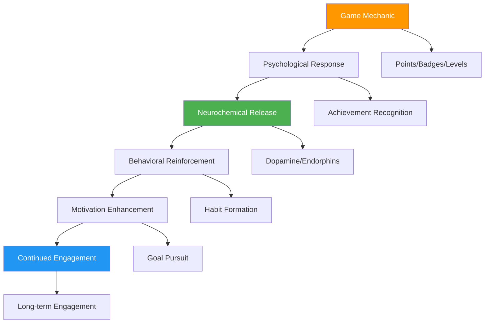
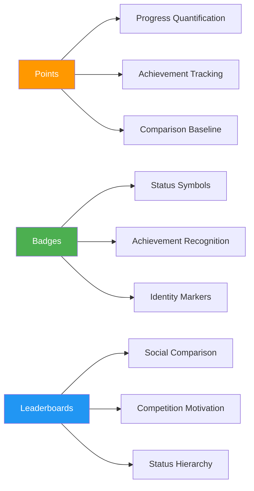
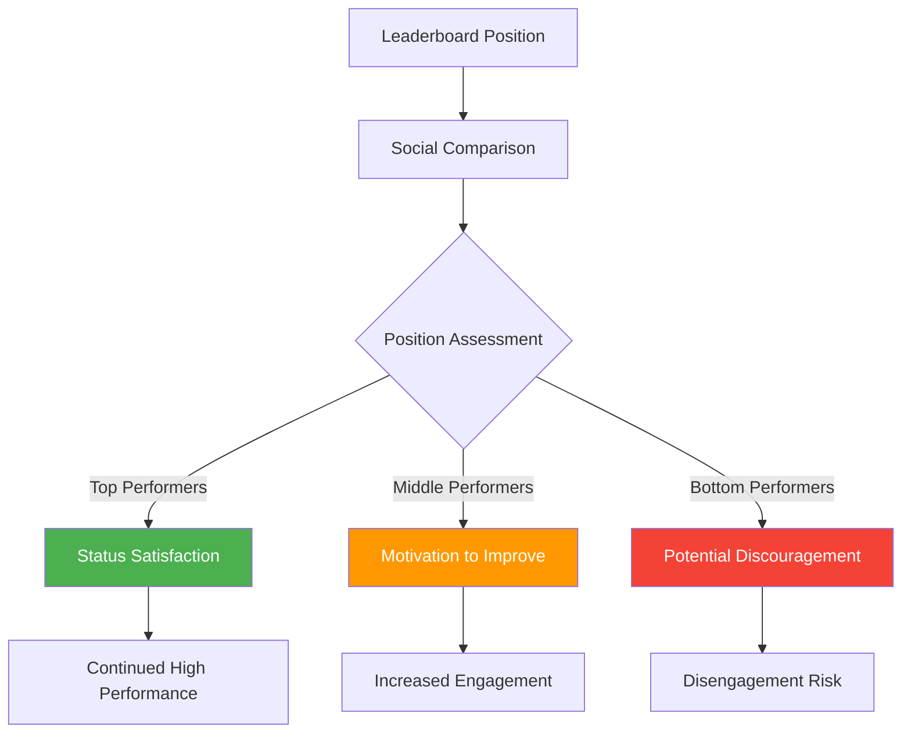
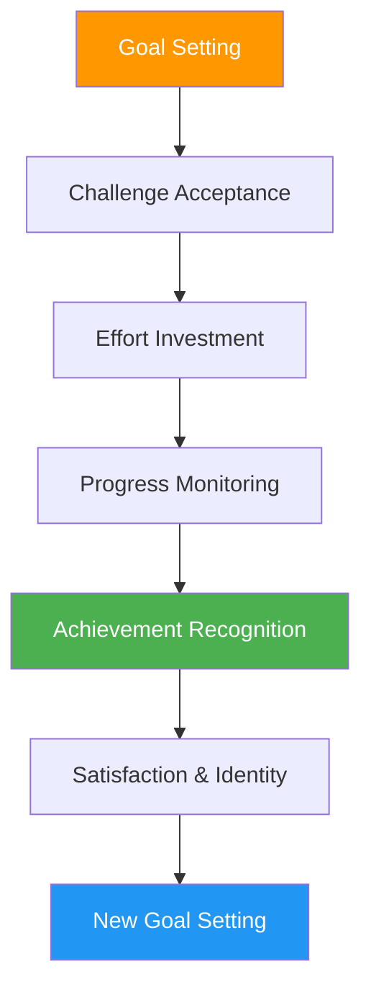
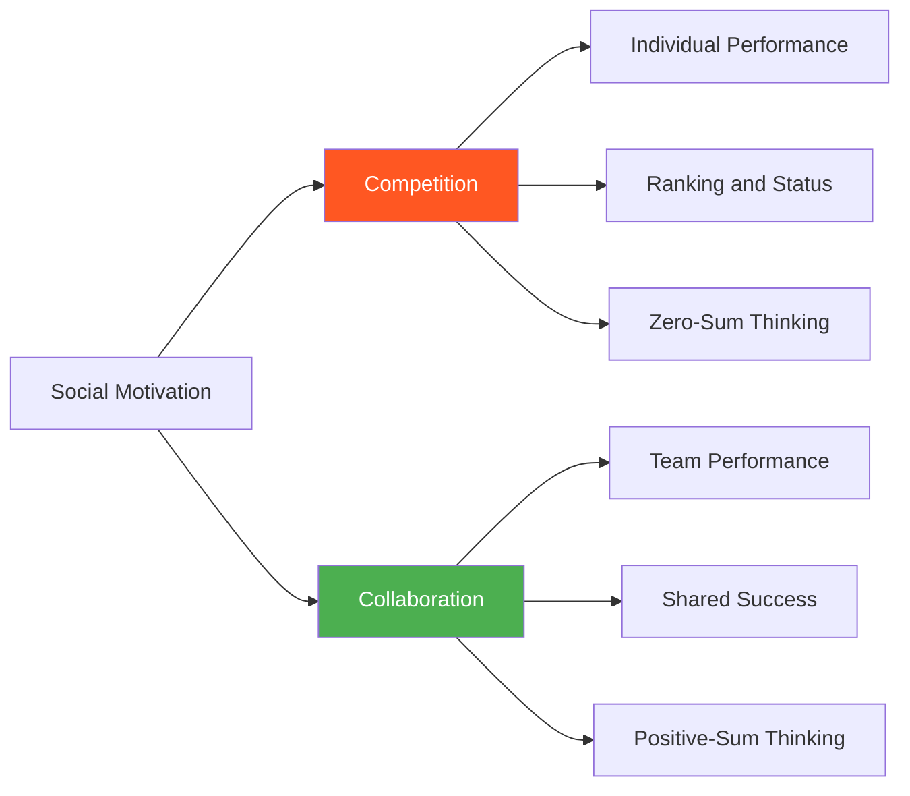
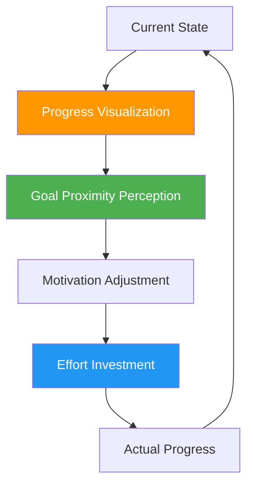
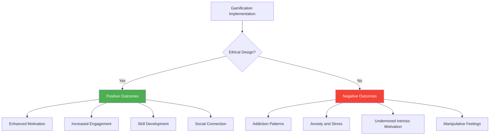

# Chapter 15: Gamification Psychology

*Points, Badges, Leaderboards Psychology, Achievement and Goal Setting, Competition vs Collaboration, Progress Visualization, and The Dark Side of Gamification*

---

## 🎯 **The Psychology Behind Game Mechanics**

Gamification leverages the psychological principles that make games engaging and applies them to non-game contexts. When done ethically, gamification can increase motivation, engagement, and learning. When done poorly, it can create addiction, anxiety, and shallow engagement that undermines long-term user relationships.

This chapter reveals the psychology behind points, badges, and leaderboards, how achievement psychology drives behavior, the delicate balance between competition and collaboration, effective progress visualization strategies, and crucially, how to avoid the dark psychological patterns that harm users.

---

## 🧠 **The Neuroscience of Game Psychology**

### How Game Mechanics Affect the Brain

Game mechanics activate multiple reward systems in the brain simultaneously, creating powerful psychological experiences that can drive sustained engagement.

### The Psychology of Reward Systems

**Intrinsic vs Extrinsic Motivation Balance:**

| **Motivation Type** | **Game Mechanic** | **Psychological Effect** | **Long-term Impact** |
|-------------------|------------------|-------------------------|-------------------|
| **Intrinsic** | Mastery progression | Competence satisfaction | Sustainable engagement |
| **Extrinsic** | Points and rewards | External validation | Can undermine intrinsic motivation |
| **Balanced** | Achievement with purpose | Both competence and recognition | Optimal long-term engagement |

### The Gamification Motivation Framework

**Self-Determination Theory in Gamification:**

1. **Autonomy**: Choice and control in game progression
2. **Competence**: Achievable challenges that build mastery
3. **Relatedness**: Social connection and shared experiences

---

## 🏆 **Points, Badges, and Leaderboards Psychology**

### The PBL System Psychology

Points, Badges, and Leaderboards (PBL) are the most common gamification elements, each serving distinct psychological functions.

### Points Psychology

**Psychological Functions of Points:**

1. **Progress Visualization**: Making abstract progress concrete and visible
2. **Achievement Quantification**: Providing measurable success metrics
3. **Comparison Framework**: Enabling self and social comparison
4. **Motivation Maintenance**: Creating incremental reward experiences

**Points Implementation Strategies:**

| **Strategy** | **Psychological Principle** | **Implementation** | **Engagement Impact** |
|-------------|----------------------------|-------------------|---------------------|
| **Variable Ratio Rewards** | Intermittent reinforcement | Random bonus points | +45% engagement |
| **Meaningful Increments** | Goal gradient effect | Appropriately sized rewards | +32% completion |
| **Loss Aversion Points** | Endowment effect | Points that can be lost | +28% retention |
| **Social Point Sharing** | Social proof | Visible point achievements | +37% viral growth |

### Badge Psychology

**The Psychological Power of Badges:**

Badges serve as digital trophies that represent achievement, status, and identity. They leverage multiple psychological principles simultaneously.

**Badge Psychological Functions:**

1. **Achievement Recognition**: Celebrating specific accomplishments
2. **Status Signaling**: Communicating expertise and dedication
3. **Identity Formation**: "I am someone who..."
4. **Social Proof**: Demonstrating capabilities to others
5. **Collection Motivation**: Completionist psychology

**Effective Badge Design Principles:**

- **Meaningful Achievement**: Represent genuine accomplishments
- **Progressive Difficulty**: Create achievement hierarchies
- **Visual Appeal**: Aesthetically pleasing and distinctive
- **Social Visibility**: Enable sharing and display
- **Rare vs Common**: Balance accessibility with exclusivity

### Leaderboard Psychology

**The Competitive Psychology of Rankings:**

Leaderboards tap into fundamental human competitive instincts and social comparison tendencies.

**Leaderboard Design Psychology:**

1. **Relative Position Focus**: Show users their local ranking context
2. **Achievement Accessibility**: Ensure most users can achieve some recognition
3. **Temporal Dynamics**: Reset periods to provide fresh opportunities
4. **Category Segmentation**: Multiple leaderboards for different achievements

---

## 🎯 **Achievement Psychology and Goal Setting**

### The Psychology of Achievement Systems

Achievement systems in SaaS tap into fundamental human needs for competence, progress, and recognition. Understanding achievement psychology is crucial for creating motivating goal structures.

### Goal Setting Theory in SaaS

**SMART Goals Psychology:**

- **Specific**: Clear, unambiguous objectives reduce cognitive load
- **Measurable**: Quantifiable progress enables tracking and motivation
- **Achievable**: Realistic goals maintain motivation and prevent frustration
- **Relevant**: Personal relevance increases investment and effort
- **Time-bound**: Deadlines create urgency and focus

### Achievement Types and Psychological Impact

| **Achievement Type** | **Psychological Appeal** | **SaaS Implementation** | **User Impact** |
|---------------------|-------------------------|------------------------|-----------------|
| **Completion** | Closure and satisfaction | Project milestones, task completion | High satisfaction |
| **Mastery** | Competence building | Skill development, expertise levels | Long-term engagement |
| **Discovery** | Curiosity satisfaction | Feature exploration, content discovery | Increased product knowledge |
| **Social** | Connection and status | Team achievements, collaboration | Community building |
| **Personal** | Self-improvement | Individual progress, habit formation | Identity reinforcement |

### Progressive Achievement Design

**The Achievement Ladder Psychology:**

1. **Starter Achievements**: Build confidence and engagement
2. **Skill-Building Achievements**: Develop competence and mastery
3. **Challenge Achievements**: Test abilities and provide stretch goals
4. **Mastery Achievements**: Recognize expertise and dedication
5. **Legacy Achievements**: Celebrate long-term commitment

---

## ⚔️ **Competition vs Collaboration Psychology**

### The Dual Nature of Social Motivation

Both competition and collaboration can drive engagement, but they activate different psychological systems and create different user experiences.

### Competition Psychology

**Positive Aspects of Competition:**

1. **Performance Enhancement**: Competition can increase effort and focus
2. **Goal Clarity**: Clear winners and losers provide unambiguous feedback
3. **Excitement and Engagement**: Competitive dynamics create emotional investment
4. **Skill Development**: Competition drives learning and improvement

**Negative Aspects of Competition:**

1. **Anxiety and Stress**: High-stakes competition can create negative emotions
2. **Exclusion Effects**: Losers may feel excluded or demoralized
3. **Cheating Temptation**: Intense competition can encourage unethical behavior
4. **Relationship Damage**: Competition can harm social connections

### Collaboration Psychology

**Benefits of Collaborative Gamification:**

1. **Inclusive Engagement**: Everyone can contribute and succeed
2. **Social Bonding**: Shared goals strengthen relationships
3. **Collective Intelligence**: Teams often outperform individuals
4. **Sustainable Motivation**: Collaboration creates mutually supportive environments

### Hybrid Competition-Collaboration Models

**Team-Based Competition:**
- Compete between teams while collaborating within teams
- Combines competitive excitement with collaborative support
- Reduces individual pressure while maintaining engagement

**Cooperative Competition:**
- Individual performance contributes to collective goals
- Personal achievements help team success
- Balances individual recognition with group outcomes

### Implementation Strategies

| **Model** | **Psychological Benefit** | **SaaS Application** | **User Experience** |
|-----------|-------------------------|---------------------|-------------------|
| **Pure Competition** | High individual motivation | Sales contests, performance rankings | Intense, potentially stressful |
| **Pure Collaboration** | Inclusive team building | Group projects, shared goals | Supportive, potentially low-energy |
| **Team Competition** | Balanced social dynamics | Department challenges, group contests | Exciting with social support |
| **Cooperative Goals** | Individual + collective success | Company-wide achievements | Personal growth within community |

---

## 📊 **Progress Visualization and Motivation**

### The Psychology of Progress Perception

Visual progress indicators are among the most powerful motivational tools in gamification, leveraging fundamental psychological principles about goal pursuit and achievement.

### Progress Visualization Principles

**1. The Goal Gradient Effect**
- Motivation increases as users get closer to goals
- Visual progress bars should reflect this psychological reality
- Break large goals into smaller milestones

**2. The Endowed Progress Effect**
- Users who feel they've already made progress are more likely to continue
- Pre-fill progress indicators when psychologically appropriate
- Acknowledge existing user investments

**3. The Progress Feedback Loop**
- Immediate visual feedback increases engagement
- Progress updates should be frequent and noticeable
- Connect visual progress to actual achievement

### Effective Progress Visualization Techniques

| **Technique** | **Psychological Principle** | **Implementation** | **Motivation Impact** |
|--------------|----------------------------|-------------------|---------------------|
| **Progress Bars** | Goal gradient effect | Linear completion indicators | High |
| **Step Counters** | Incremental achievement | Discrete progress steps | Medium |
| **Streak Counters** | Loss aversion | Consecutive day/action tracking | Very High |
| **Level Systems** | Mastery progression | Hierarchical advancement | High |
| **Completion Percentages** | Quantified progress | Numerical completion indicators | Medium |
| **Visual Metaphors** | Concrete representation | Journey maps, building progress | High |

### Case Study: LinkedIn's Progress Psychology

**Profile Completion Progress:**
- **Initial State**: Profile strength meter starts partially filled
- **Clear Next Steps**: Specific actions to improve score
- **Social Pressure**: "Profiles like yours are 7x more likely to be discovered"
- **Incremental Rewards**: Each improvement provides immediate positive feedback
- **Achievement Recognition**: "All-Star" status for complete profiles

**Psychological Elements:**
- **Endowed Progress**: Profile starts with some completion
- **Social Proof**: Comparison to similar users
- **Clear Actionability**: Specific steps to progress
- **Status Achievement**: Elite status for completion

*Result: 55% higher profile completion rates and 40% increased user engagement*

---

## 🌑 **The Dark Side of Gamification**

### When Gamification Becomes Harmful

While gamification can enhance motivation and engagement, it can also create negative psychological effects when poorly implemented or used manipulatively.

### Psychological Dark Patterns in Gamification

**1. Addictive Mechanics**
- *Problem*: Creating compulsive usage patterns
- *Manifestation*: Variable ratio reward schedules that ignore user wellbeing
- *Solution*: Respect user agency and provide usage controls

**2. Exploitation of Loss Aversion**
- *Problem*: Using fear of loss to manipulate behavior
- *Manifestation*: Streaks that create anxiety, points that expire artificially
- *Solution*: Focus on positive achievement rather than loss prevention

**3. Meaningless Achievement**
- *Problem*: Rewards that don't connect to genuine value
- *Manifestation*: Badges for trivial actions, points for engagement rather than value
- *Solution*: Align achievements with user goals and real accomplishments

**4. Social Manipulation**
- *Problem*: Using social pressure for unhealthy engagement
- *Manifestation*: Leaderboards that shame low performers
- *Solution*: Create inclusive social experiences that support all users

### Ethical Gamification Principles

**The ETHICAL Framework:**

**E** - **Empowerment**: Gamification should increase user agency and capability
**T** - **Transparency**: Users should understand how systems work
**H** - **Health**: Long-term user wellbeing over short-term engagement
**I** - **Intrinsic**: Support rather than undermine intrinsic motivation
**C** - **Choice**: Provide user control over gamification elements
**A** - **Alignment**: Align game mechanics with user goals and values
**L** - **Long-term**: Focus on sustainable relationships over quick wins

### Avoiding Dark Pattern Psychology

| **Dark Pattern** | **Psychological Harm** | **Ethical Alternative** | **Implementation** |
|-----------------|----------------------|----------------------|-------------------|
| **Infinite Scroll Rewards** | Compulsive usage | Defined completion points | Clear ending signals |
| **Pay-to-Win Mechanics** | Unfair advantage anxiety | Skill-based progression | Merit-based advancement |
| **Shame-Based Leaderboards** | Social anxiety | Supportive comparison | Personal improvement focus |
| **Artificial Scarcity** | FOMO manipulation | Genuine limited resources | Honest availability |
| **Addiction Mechanics** | Compulsive behavior | Healthy engagement patterns | Usage awareness tools |

---

## 📊 **Measuring Gamification Psychology**

### Key Gamification Metrics

| **Metric** | **Psychological Measurement** | **Target Range** | **Insight** |
|-----------|-------------------------------|------------------|-------------|
| **Achievement Rate** | Goal completion satisfaction | 60-80% | Challenge appropriateness |
| **Repeat Engagement** | Intrinsic motivation | 40-70% | Sustainable interest |
| **Social Participation** | Community connection | 30-60% | Social feature effectiveness |
| **Long-term Retention** | Sustained motivation | 70-90% | Healthy engagement patterns |
| **User Satisfaction** | Overall experience quality | 4.0-4.5/5 | Gamification value perception |

### Gamification Health Diagnostics

**Questions to Assess Gamification Health:**

1. **Motivation Quality**: Is engagement driven by intrinsic or extrinsic factors?
2. **User Agency**: Do users feel in control of their gamification experience?
3. **Value Alignment**: Do game mechanics support user goals and values?
4. **Social Impact**: Does gamification create positive or negative social dynamics?
5. **Long-term Sustainability**: Are engagement patterns healthy and sustainable?

### The Gamification Audit Framework

**Audit Categories:**

1. **Psychological Safety**: Does gamification create stress or anxiety?
2. **Intrinsic Motivation**: Does it support or undermine internal motivation?
3. **Social Health**: Are social dynamics positive and inclusive?
4. **Value Creation**: Do game mechanics create genuine user value?
5. **Ethical Standards**: Are practices transparent and user-centric?

---

## 🔧 **Implementation Framework: The GAME Method**

### G-A-M-E: Gamification Psychology Framework

**G - Ground in User Goals**
- Align game mechanics with genuine user objectives
- Ensure achievements represent real value creation
- Connect gamification to user success metrics

**A - Activate Intrinsic Motivation**
- Focus on autonomy, mastery, and purpose
- Support rather than replace internal drive
- Create meaningful rather than arbitrary challenges

**M - Manage Social Dynamics**
- Design inclusive rather than exclusive experiences
- Balance competition with collaboration
- Create supportive community environments

**E - Ensure Ethical Implementation**
- Prioritize user wellbeing over engagement metrics
- Provide transparency and user control
- Monitor for psychological harm and addiction patterns

---

## 🎯 **Chapter 15 Action Items**

### Immediate Assessment (Week 1)
- [ ] Audit existing gamification elements for psychological impact
- [ ] Evaluate achievement systems for intrinsic vs extrinsic motivation
- [ ] Analyze social dynamics in competitive features
- [ ] Assess progress visualization effectiveness

### Strategic Implementation (Month 1)
- [ ] Design ethical achievement and progression systems
- [ ] Implement balanced competition-collaboration features
- [ ] Create meaningful progress visualization
- [ ] Establish gamification health monitoring

### Long-term Development (Quarter 1)
- [ ] Build comprehensive gamification analytics
- [ ] Develop AI-driven personalized achievement systems
- [ ] Create community-driven gamification features
- [ ] Establish ethical gamification guidelines and reviews

---

## 🔗 **Connection to Other Chapters**

- **Chapter 12**: Builds on habit formation psychology
- **Chapter 14**: Extends daily engagement principles
- **Chapter 16**: Connects to personalization psychology
- **Chapter 23**: Links to ethical psychology principles
- **Chapter 24**: Relates to psychological harm prevention

---

*"The best gamification doesn't feel like a game—it feels like natural progression toward meaningful goals. Focus on empowering users, not manipulating them."*

**Next**: Chapter 16 explores how personalization psychology can create deeply relevant experiences while respecting user privacy and autonomy.
