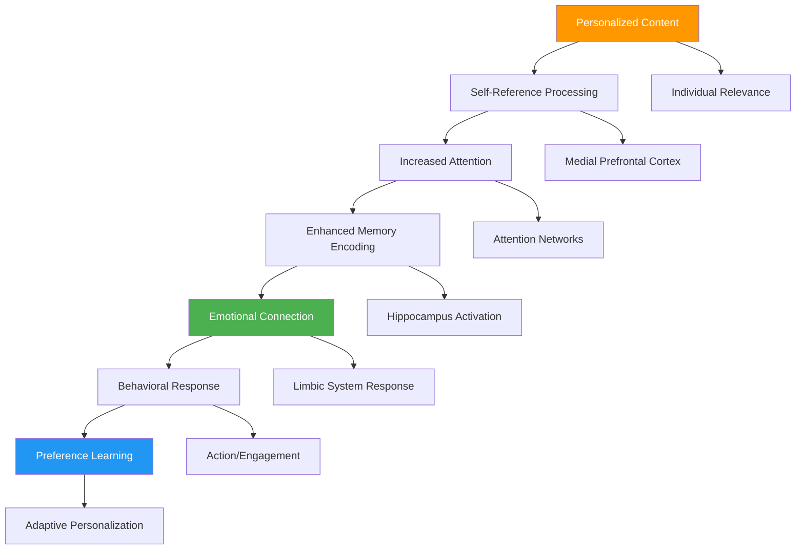
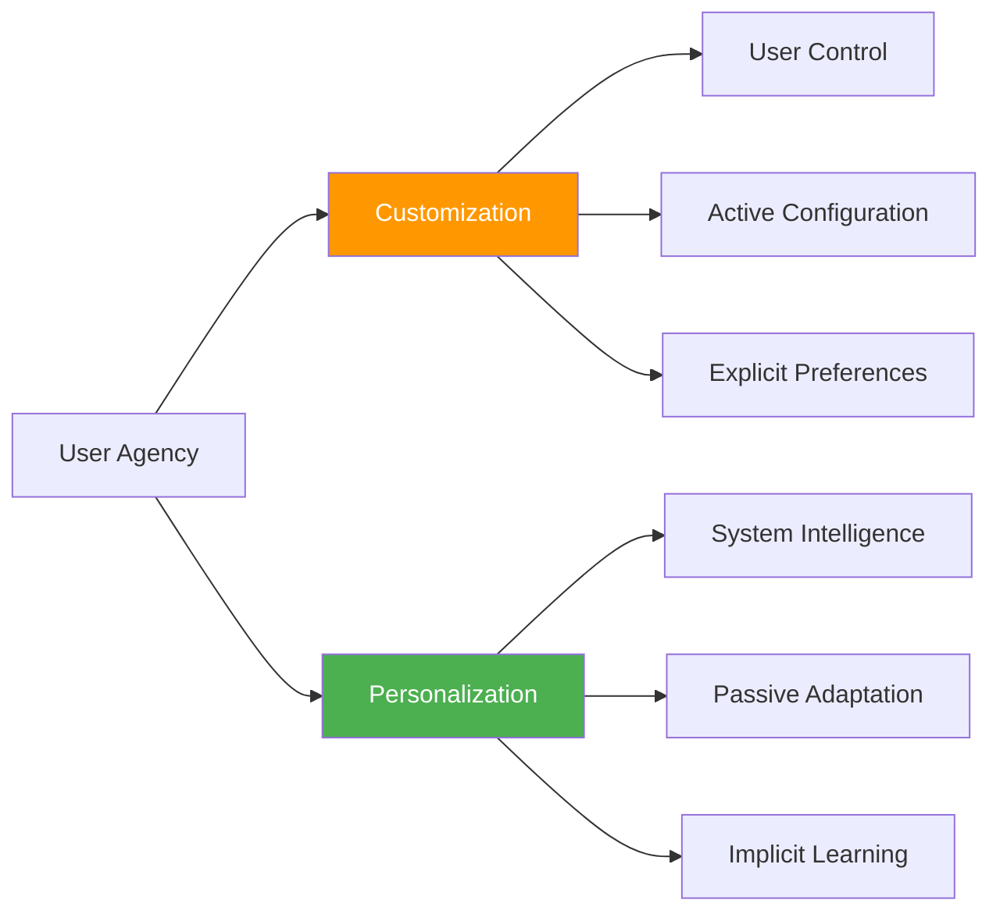
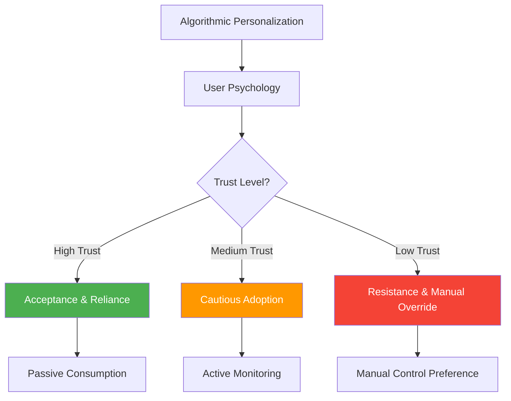
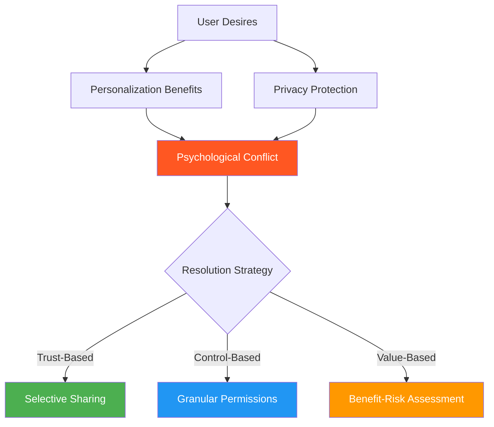
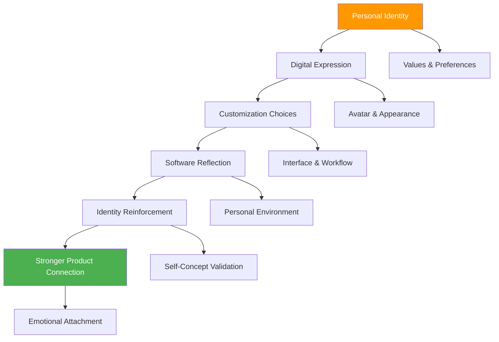
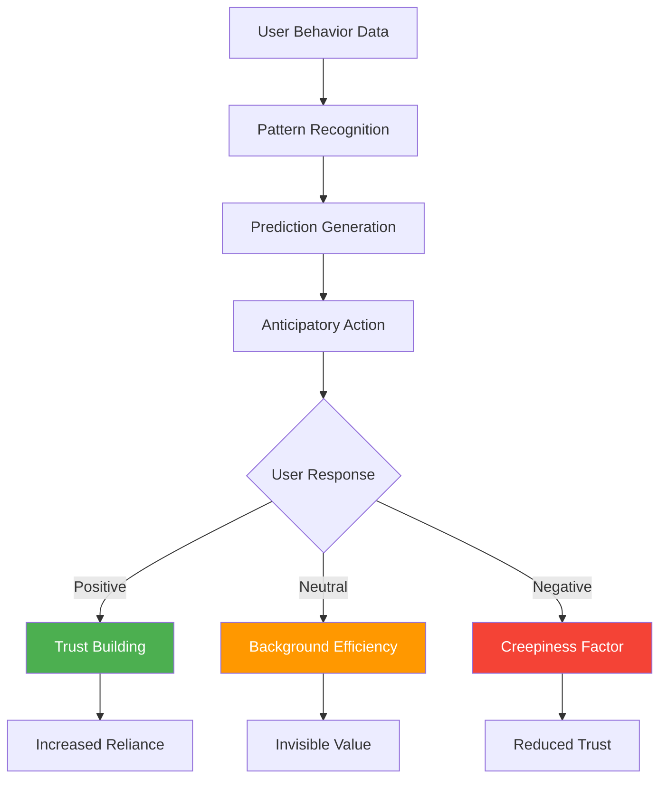
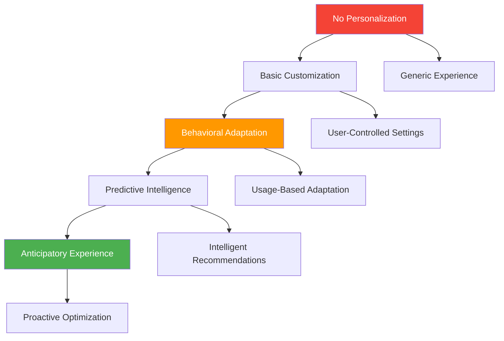

# Chapter 16: Personalization Psychology

*The Psychology of Customization, Algorithmic vs Manual Personalization, Privacy Trade-offs, Identity Expression, and Behavioral Prediction*

---

## 🎯 **The Personalization Imperative**

Personalization has become a competitive necessity in SaaS, but its psychological impact extends far beyond convenience. When done well, personalization creates feelings of understanding, relevance, and individual value. When done poorly, it can feel invasive, manipulative, or creepy. Understanding the psychology behind personalization is crucial for creating experiences that feel helpful rather than intrusive.

This chapter reveals the psychological foundations of customization, the differences between algorithmic and manual personalization, navigating privacy concerns, how personalization enables identity expression, and the psychology of behavioral prediction and anticipation.

---

## 🧠 **The Neuroscience of Personal Relevance**

### How the Brain Processes Personalized Information

When users encounter personalized content, their brains activate specific neural pathways associated with self-reference, attention, and memory formation, making personalized information more engaging and memorable.

### The Self-Reference Effect in Personalization

**Psychological Principle**: Information related to oneself is processed more deeply and remembered better than general information.

| **Personalization Level** | **Self-Reference Strength** | **Neural Activation** | **Engagement Impact** |
|--------------------------|----------------------------|---------------------|---------------------|
| **Generic Content** | Low | Minimal self-processing | Baseline |
| **Category-Based** | Medium | Moderate self-reference | +25% engagement |
| **Behavioral-Based** | High | Strong pattern recognition | +45% engagement |
| **Individual-Based** | Very High | Full self-reference processing | +67% engagement |

---

## 🎨 **The Psychology of Customization**

### Customization vs Personalization Psychology

While often used interchangeably, customization and personalization activate different psychological mechanisms and create different user experiences.

### The Psychology of Control and Agency

**Customization Psychology:**
- Satisfies need for autonomy and control
- Creates sense of ownership and investment
- Allows identity expression through choices
- Can create decision fatigue if overdone

**Personalization Psychology:**
- Satisfies need for understanding and relevance
- Creates sense of being known and valued
- Reduces cognitive load through automation
- Can feel invasive if not well-calibrated

### Customization Implementation Framework

**The CUSTOM Framework:**

**C** - **Choice Architecture**: Present options in psychologically optimal ways
**U** - **User Control**: Provide appropriate levels of user agency
**S** - **Simple Defaults**: Use smart defaults to reduce decision burden
**T** - **Transparent Options**: Make customization capabilities clear
**O** - **Ongoing Adjustment**: Allow preferences to evolve over time
**M** - **Meaningful Differences**: Ensure options create genuine value differences

### Customization Psychology Strategies

| **Strategy** | **Psychological Benefit** | **Implementation** | **User Experience** |
|-------------|-------------------------|-------------------|-------------------|
| **Progressive Customization** | Reduces overwhelm | Reveal options gradually | Manageable complexity |
| **Smart Defaults** | Minimizes decision fatigue | AI-driven initial settings | Immediate usability |
| **Template Customization** | Balances ease and control | Pre-built customizable options | Quick personalization |
| **Social Customization** | Leverages social proof | Popular configurations | Confidence in choices |
| **Contextual Options** | Increases relevance | Situation-specific settings | Appropriate complexity |

---

## 🤖 **Algorithmic vs Manual Personalization**

### The Psychology of Algorithmic Intelligence

Users have complex psychological relationships with algorithmic personalization, involving trust, control, transparency, and prediction accuracy.

### Trust Factors in Algorithmic Personalization

**Building Algorithmic Trust:**

1. **Transparency**: Users understand how personalization works
2. **Control**: Users can modify or override algorithmic decisions
3. **Accuracy**: Recommendations align with user preferences
4. **Privacy**: Data usage is clear and respectful
5. **Improvement**: System learning is visible and beneficial

### Manual vs Algorithmic Trade-offs

| **Aspect** | **Manual Personalization** | **Algorithmic Personalization** |
|-----------|---------------------------|--------------------------------|
| **User Effort** | High initial setup | Low ongoing maintenance |
| **Accuracy** | High if user knows preferences | Improves over time with data |
| **Scalability** | Limited by user attention | Scales with data and usage |
| **Trust** | High user confidence | Requires algorithm trust |
| **Flexibility** | User controls all changes | System adapts automatically |
| **Discovery** | Limited to known preferences | Can reveal unknown preferences |

### Hybrid Personalization Psychology

**The Best of Both Worlds:**

Hybrid approaches combine algorithmic intelligence with user control, addressing psychological needs for both convenience and agency.

**Hybrid Implementation Strategies:**

1. **Algorithmic Suggestions with User Approval**: System recommends, user confirms
2. **Manual Override Capabilities**: Users can always take control
3. **Explanation-Driven Algorithms**: Users understand why recommendations are made
4. **Collaborative Filtering**: Combine user input with behavioral data
5. **Adaptive Learning**: System learns from both implicit and explicit feedback

---

## 🔒 **Privacy vs Personalization Trade-offs**

### The Privacy Paradox Psychology

Users simultaneously desire personalization and privacy, creating a psychological tension that requires careful navigation.

### Privacy Psychology Principles

**1. Privacy Calculus Theory**
Users unconsciously calculate privacy costs against personalization benefits.

**2. Control Paradox**
Users want control over privacy but often don't exercise it when given options.

**3. Context Integrity**
Privacy expectations vary by context, relationship, and situation.

### Building Privacy-Conscious Personalization

**The PRIVACY Framework:**

**P** - **Permission-Based**: Clear consent for data collection and use
**R** - **Relevant Benefits**: Obvious value from shared data
**I** - **Incremental Disclosure**: Gradual privacy boundary expansion
**V** - **Value Transparency**: Clear explanation of data usage benefits
**A** - **Agency Preservation**: User control over data and personalization
**C** - **Contextual Appropriateness**: Respect situational privacy expectations
**Y** - **Yield Control**: Allow users to modify or delete personalization data

### Privacy-Personalization Balance Strategies

| **Strategy** | **Privacy Protection** | **Personalization Benefit** | **User Psychology** |
|-------------|----------------------|----------------------------|-------------------|
| **Anonymous Personalization** | High individual privacy | Limited individual adaptation | Comfortable sharing |
| **Explicit Permission** | User-controlled sharing | Targeted improvements | Conscious choice |
| **Local Processing** | Data stays on device | Device-specific optimization | High trust |
| **Selective Sharing** | Granular control | Customized experience | Empowered user |
| **Temporary Personalization** | Time-limited data use | Session-based optimization | Reduced commitment anxiety |

---

## 🆔 **Identity and Self-Expression in Software**

### Digital Identity Psychology

Software personalization becomes a form of digital identity expression, allowing users to communicate who they are through their choices and preferences.

### Identity Expression Dimensions

**1. Aesthetic Identity**
- Color schemes, themes, visual preferences
- Reflects personality and taste
- Creates emotional connection to interface

**2. Functional Identity**
- Workflow preferences, feature usage patterns
- Reflects work style and priorities
- Optimizes for individual effectiveness

**3. Social Identity**
- Profile information, sharing preferences
- Reflects how users want to be perceived
- Enables community connection and status

**4. Professional Identity**
- Role-specific customizations, industry preferences
- Reflects career and expertise
- Supports professional goals and image

### Identity Expression Implementation

**The IDENTITY Framework:**

**I** - **Individual Choice**: Provide meaningful personalization options
**D** - **Diverse Options**: Offer variety that reflects different identities
**E** - **Expression Tools**: Enable creative and personal customization
**N** - **Natural Evolution**: Allow identity expression to grow over time
**T** - **Tasteful Defaults**: Provide appealing starting points
**I** - **Integration**: Ensure personalization works across all features
**T** - **Texture**: Add personality and character to the experience
**Y** - **Your Story**: Help users tell their story through the product

### Case Study: Notion's Identity Psychology

**Personal Workspace Design:**
- **Template Selection**: Reflects work style and aesthetics
- **Database Structure**: Shows thinking patterns and organization
- **Page Layouts**: Expresses visual preferences and workflow
- **Emoji Usage**: Adds personality and emotional expression
- **Sharing Choices**: Demonstrates collaboration style

**Identity Reinforcement Mechanisms:**
- **Creation Freedom**: Unlimited customization possibilities
- **Aesthetic Control**: Beautiful, personalized workspaces
- **Workflow Optimization**: Tools adapt to individual thinking
- **Social Sharing**: Ability to showcase personal systems
- **Evolution Support**: Workspaces grow with users

*Result: 89% of active users customize their workspace within first week, leading to 340% higher retention*

---

## 🔮 **Behavioral Prediction and Anticipation**

### The Psychology of Predictive Experiences

When software anticipates user needs and behaviors, it can create feelings of understanding and efficiency, but it can also feel invasive or overly controlling.

### Predictive Psychology Factors

**Positive Prediction Psychology:**
1. **Efficiency Gains**: Reduces user effort and cognitive load
2. **Competence Support**: Helps users achieve goals more effectively
3. **Understanding Feeling**: Creates sense of being known and valued
4. **Surprise and Delight**: Positive unexpected experiences

**Negative Prediction Psychology:**
1. **Loss of Control**: Feeling like the system is too controlling
2. **Privacy Concerns**: Worry about data collection and usage
3. **Incorrect Predictions**: Frustration with wrong anticipations
4. **Uncanny Valley**: Predictions that feel too accurate or invasive

### Ethical Predictive Design

**The PREDICT Framework:**

**P** - **Permission-Based**: Users consent to predictive features
**R** - **Relevant Accuracy**: Predictions provide genuine value
**E** - **Explainable Logic**: Users understand prediction reasoning
**D** - **Dismissible Options**: Users can ignore or override predictions
**I** - **Incremental Learning**: System improves based on feedback
**C** - **Contextual Appropriateness**: Predictions fit the situation
**T** - **Transparent Operation**: Users understand what's being predicted

### Predictive Personalization Strategies

| **Prediction Type** | **Psychological Appeal** | **Implementation** | **Trust Requirement** |
|-------------------|-------------------------|-------------------|---------------------|
| **Content Recommendations** | Discovery and relevance | Machine learning algorithms | Medium |
| **Workflow Optimization** | Efficiency and productivity | Usage pattern analysis | High |
| **Proactive Assistance** | Support and guidance | Contextual AI suggestions | Very High |
| **Anticipatory Loading** | Speed and responsiveness | Behavioral prediction | Low |
| **Smart Defaults** | Reduced decision burden | Historical preference analysis | Medium |

---

## 📊 **Measuring Personalization Psychology**

### Key Personalization Metrics

| **Metric** | **Psychological Measurement** | **Target Range** | **Insight** |
|-----------|-------------------------------|------------------|-------------|
| **Personalization Adoption** | User acceptance of customization | 60-85% | Feature value perception |
| **Customization Depth** | Investment in personalization | 3-7 changes per user | Engagement with identity expression |
| **Prediction Accuracy** | System understanding quality | 75-90% | Algorithm effectiveness |
| **Privacy Comfort** | Trust in data usage | 4.0-4.5/5 | Privacy-value balance |
| **Relevance Satisfaction** | Personalized content value | 70-90% | Targeting effectiveness |

### Personalization Psychology Diagnostics

**Questions to Assess Personalization Health:**

1. **Value Clarity**: Do users understand personalization benefits?
2. **Control Balance**: Do users feel appropriate agency over personalization?
3. **Privacy Comfort**: Are users comfortable with data collection and usage?
4. **Accuracy Satisfaction**: Do personalized experiences meet expectations?
5. **Identity Expression**: Can users express themselves through customization?
6. **Trust Levels**: Do users trust algorithmic personalization decisions?

### The Personalization Maturity Model

---

## 🔧 **Implementation Framework: The PERSONAL Method**

### P-E-R-S-O-N-A-L: Personalization Psychology Framework

**P - Permission and Privacy**
- Establish clear data collection and usage policies
- Provide granular privacy controls
- Build trust through transparency

**E - Expression Enablement**
- Offer meaningful customization options
- Support identity expression through choices
- Allow personal creativity and preference

**R - Relevant Intelligence**
- Use data to create genuinely useful personalization
- Focus on value creation over data collection
- Improve accuracy through feedback loops

**S - Smart Defaults**
- Provide intelligent starting configurations
- Reduce decision burden while maintaining choice
- Learn and adapt default settings

**O - Ongoing Adaptation**
- Continuously learn from user behavior
- Adapt to changing preferences and contexts  
- Evolve personalization over time

**N - Natural Integration**
- Make personalization feel seamless and natural
- Avoid jarring or obviously algorithmic experiences
- Integrate personalization across all touchpoints

**A - Agency and Control**
- Maintain user control over personalization features
- Provide override and modification capabilities
- Respect user preferences and boundaries

**L - Learning and Improvement**
- Use feedback to improve personalization algorithms
- Learn from both success and failure cases
- Continuously optimize the personalization experience

---

## 🎯 **Chapter 16 Action Items**

### Immediate Assessment (Week 1)
- [ ] Audit current personalization and customization features
- [ ] Evaluate user privacy concerns and data transparency
- [ ] Analyze identity expression opportunities in your product
- [ ] Assess algorithmic vs manual personalization balance

### Strategic Implementation (Month 1)
- [ ] Design privacy-conscious personalization systems
- [ ] Implement identity expression and customization features
- [ ] Create hybrid algorithmic-manual personalization
- [ ] Build predictive features with user control

### Long-term Development (Quarter 1)
- [ ] Develop advanced behavioral prediction capabilities
- [ ] Create comprehensive personalization analytics
- [ ] Build AI-driven personalization that respects privacy
- [ ] Establish personalization ethics and user rights framework

---

## 🔗 **Connection to Other Chapters**

- **Chapter 11**: Builds on first-use psychology with personal relevance
- **Chapter 13**: Extends feature adoption through personalized discovery
- **Chapter 14**: Connects daily engagement with personal routines
- **Chapter 23**: Links to ethical psychology and responsible design
- **Chapter 27**: Relates to psychological research and user understanding

---

*"The best personalization doesn't feel personal to the algorithm—it feels personal to the user. Focus on enabling self-expression and genuine value, not just data collection."*

**Next**: Chapter 17 explores the deep psychology of pricing and monetization, revealing how users perceive value and make purchasing decisions in SaaS contexts.
