# Chapter 17: Pricing Psychology Mastery

*Psychological Pricing Strategies, Value Perception and Anchoring, Subscription vs One-time Psychology, Freemium Upgrade Triggers, and Discount Psychology*

---

## 🎯 **The Psychology of Value Exchange**

Pricing is fundamentally a psychological exercise. Users don't just evaluate functional features—they assess perceived value, compare alternatives, and make emotional decisions about worth and affordability. Understanding pricing psychology is crucial for optimizing revenue while maintaining ethical user relationships.

This chapter reveals the psychological principles behind effective pricing strategies, how users perceive and anchor value, the mental models behind subscription vs one-time purchases, psychological triggers that drive freemium upgrades, and the complex psychology of discounts and promotions.

---

## 🧠 **The Neuroscience of Pricing Decisions**

### How the Brain Processes Price Information

When users encounter pricing, their brains activate multiple systems simultaneously: analytical processing, emotional responses, social comparison, and memory recall, creating complex decision-making scenarios.

### The Pain of Paying Psychology

**Dual-System Processing in Pricing:**

| **System 1 (Fast/Emotional)** | **System 2 (Slow/Analytical)** |
|------------------------------|--------------------------------|
| Immediate emotional reaction | Careful cost-benefit analysis |
| Loss aversion triggers | Feature comparison |
| Anchoring to first price seen | Market research and alternatives |
| Social proof influences | ROI calculations |
| "Feels expensive/cheap" | "Worth X dollars because..." |

**The Pain of Paying Scale:**

---

## 💰 **Psychological Pricing Strategies**

### The Psychology of Price Presentation

How prices are presented dramatically affects perception and purchase decisions, leveraging cognitive biases and mental shortcuts.

```mermaid
graph TD
    A[Price Presentation] --> B[Cognitive Processing]
    B --> C[Psychological Effect]
    C --> D[Purchase Likelihood]
    
    A --> A1[Charm Pricing $9.99]
    A --> A2[Bundling $39/month]
    A --> A3[Anchoring $199 → $99]
    A --> A4[Social Proof 10,000 users]
    
    C --> C1[Perceived Value]
    C --> C2[Affordability Feeling]
    C --> C3[Comparison Advantage]
    C --> C4[Decision Confidence]
    
    style A fill:#ff9800,color:#fff
    style D fill:#4caf50,color:#fff
```

### Core Pricing Psychology Principles

**1. Charm Pricing Psychology**
- *Principle*: Prices ending in 9 feel significantly lower
- *Neural Basis*: Left-digit bias in number processing
- *Implementation*: $29, $99, $199 instead of $30, $100, $200
- *Effectiveness*: 30-60% increase in conversion rates

**2. Anchoring Effect**
- *Principle*: First price seen becomes reference point
- *Neural Basis*: Insufficient adjustment from initial anchor
- *Implementation*: Show highest-tier pricing first
- *Effectiveness*: 15-25% higher average selling price

**3. Decoy Effect (Asymmetric Dominance)**
- *Principle*: Strategically inferior option makes target option attractive
- *Neural Basis*: Relative value comparison processing
- *Implementation*: Three-tier pricing with middle tier as target
- *Effectiveness*: 20-40% shift toward target option

**4. Loss Aversion in Pricing**
- *Principle*: Avoid losses more than acquiring gains
- *Neural Basis*: Amygdala activation for loss scenarios
- *Implementation*: Frame as savings rather than costs
- *Effectiveness*: 25-35% higher acceptance rates

### Advanced Pricing Psychology Techniques

| **Technique** | **Psychological Principle** | **Implementation** | **Conversion Impact** |
|--------------|----------------------------|-------------------|---------------------|
| **Partitioned Pricing** | Payment depreciation | Separate base + add-ons | +23% acceptance |
| **Temporal Bundling** | Payment depreciation | Annual vs monthly framing | +31% annual subscriptions |
| **Social Proof Pricing** | Conformity bias | "Most popular plan" | +28% selection rate |
| **Scarcity Pricing** | Loss aversion | Limited-time offers | +19% urgency response |
| **Compromise Effect** | Extremeness aversion | Middle option preference | +34% mid-tier selection |

---

## ⚖️ **Value Perception and Anchoring**

### The Psychology of Value Assessment

Value perception is highly subjective and influenced by psychological anchors, comparisons, and contextual factors rather than absolute features or costs.

### Value Anchoring Strategies

**1. High-Value Anchoring**
- Present premium options first to establish high-value reference
- Use competitor comparisons to show relative value
- Highlight enterprise features to justify pricing tiers

**2. Benefit-Cost Anchoring**
- Calculate and present ROI/savings from using the product
- Compare to alternative solutions (hiring, other tools, inefficiency)
- Show time savings with monetary value equivalents

**3. Social Anchoring**
- Display what similar companies/users pay
- Show usage statistics and outcomes
- Leverage authority figures and testimonials

### The Value Perception Framework

**The VALUE Method:**

**V** - **Visible Benefits**: Make value concrete and observable
**A** - **Anchored Comparisons**: Provide favorable reference points
**L** - **Loss Prevention**: Show costs of not using the product  
**U** - **Usage Evidence**: Demonstrate real-world success
**E** - **Emotional Connection**: Create feelings beyond functional benefits

### Case Study: Salesforce's Value Anchoring

**Value Anchoring Strategy:**
- **High Anchor**: Enterprise pricing starts at $300/user/month
- **ROI Calculator**: Shows potential revenue increase
- **Comparison**: Cost vs hiring additional sales staff
- **Social Proof**: "Used by 150,000+ companies"
- **Success Stories**: Quantified business outcomes

**Result**: Average deal size increased 67% after implementing value anchoring, with 34% higher close rates

---

## 🔄 **The Psychology of Subscription vs One-time**

### Mental Models for Different Payment Structures

Users process subscription and one-time payments using fundamentally different psychological frameworks, affecting their evaluation and commitment.

### Subscription Psychology Advantages

**1. Reduced Financial Friction**
- Lower upfront cost reduces initial pain of paying
- Mental accounting treats subscriptions as operating expenses
- Payment method saves creates recurring convenience

**2. Commitment and Consistency**
- Once committed, status quo bias maintains subscriptions
- Identity formation around being a "user" of the service
- Sunk cost fallacy keeps users engaged

**3. Continuous Value Expectation**
- Ongoing payment creates expectation of ongoing value
- Regular touchpoints for value demonstration
- Opportunity for expanding relationship over time

### One-time Purchase Psychology

**1. Ownership and Control**
- Stronger sense of ownership and permanent access
- No ongoing financial commitment anxiety
- Clear cost-benefit calculation

**2. Higher Commitment Threshold**
- Larger upfront investment requires stronger conviction
- More thorough evaluation process
- Higher switching costs once purchased

### Hybrid Payment Psychology

**The Psychology of Mixed Models:**

| **Model** | **Psychological Appeal** | **Use Case** | **Conversion Pattern** |
|-----------|-------------------------|-------------|----------------------|
| **Freemium → Subscription** | Low risk trial, ongoing value | Feature-rich products | Gradual conversion |
| **Free Trial → Subscription** | Risk-free evaluation | High-value products | Time-pressure conversion |
| **One-time → Subscription** | Ownership + ongoing value | Software with updates | Upgrade conversion |
| **Usage-based → Subscription** | Pay-as-you-go comfort | Variable usage products | Natural scaling |

---

## 🆓 **Freemium Psychology and Upgrade Triggers**

### The Psychology of "Free"

The word "free" triggers powerful psychological responses that bypass rational decision-making, but converting free users to paid requires understanding different psychological mechanisms.

### Freemium Conversion Psychology

**1. The Endowment Effect**
- Free users develop ownership feelings over their data/work
- Switching costs increase over time with investment
- Loss aversion makes leaving painful

**2. Progressive Value Recognition**
- Users gradually understand product value through usage
- Feature limitations become more apparent with deeper engagement
- Success with free version builds confidence in paid version

**3. Social and Professional Pressure**
- Team collaboration requirements drive upgrades
- Professional appearance needs (removing "powered by" branding)
- Status signaling through premium features

### Psychological Upgrade Triggers

| **Trigger Type** | **Psychological Mechanism** | **Implementation** | **Conversion Rate Impact** |
|-----------------|----------------------------|-------------------|---------------------------|
| **Usage Limits** | Artificial scarcity | Storage/API call limits | +45% upgrade rate |
| **Feature Gates** | Competence restriction | Advanced functionality | +32% conversion |
| **Social Pressure** | Status and collaboration | Team features, branding | +28% upgrade motivation |
| **Time Investment** | Sunk cost psychology | Data/content accumulation | +51% retention |
| **Success Amplification** | Achievement recognition | "Upgrade to do more" | +37% natural progression |

### The Freemium Upgrade Journey

**Stage 1: Honeymoon (Days 1-14)**
- Focus on core value delivery
- Minimize friction and limitations
- Build product engagement and habit formation

**Stage 2: Adoption (Days 15-60)**
- Introduce advanced features and capabilities
- Show value of premium through education and demos
- Create social sharing and team invitation opportunities

**Stage 3: Limitation (Days 61-120)**
- Users encounter meaningful restrictions
- Upgrade prompts appear at moments of high engagement
- Success stories and ROI information provided

**Stage 4: Conversion (Days 121+)**
- Direct upgrade prompts based on usage patterns
- Limited-time offers and incentives
- Personal success metrics and achievement recognition

---

## 🏷️ **The Psychology of Discounts and Promotions**

### Discount Psychology: Benefits and Risks

Discounts activate powerful psychological responses but can also undermine value perception and customer psychology if not carefully managed.

### Positive Discount Psychology

**1. Savings Satisfaction**
- Getting a "deal" activates reward centers in the brain
- Comparative advantage over regular pricing
- Smart shopper identity reinforcement

**2. Loss Aversion Motivation**
- Limited-time offers create fear of missing out
- Scarcity perception increases urgency
- Regret avoidance drives immediate action

**3. Social Proof Enhancement**
- Special pricing suggests popularity/demand
- Exclusive access creates status feelings
- Community membership benefits

### Negative Discount Psychology

**1. Value Anchoring Concerns**
- Discounted price becomes new reference point
- Questions about "real" value of the product
- Difficulty returning to full pricing

**2. Quality Perception Issues**
- Heavy discounting can signal inferior quality
- Bargain hunting mentality vs premium positioning
- Cheapens brand perception

**3. Customer Conditioning**
- Users learn to wait for discounts
- Reduces full-price purchase willingness
- Creates promotion-dependent revenue

### Strategic Discount Psychology

**The DISCOUNT Framework:**

**D** - **Deliberate Timing**: Use discounts strategically, not desperately
**I** - **Increase Urgency**: Create legitimate time pressure
**S** - **Segment Appropriately**: Target discounts to specific user groups
**C** - **Communicate Value**: Maintain value perception during promotions
**O** - **Offer Exclusivity**: Make discounts feel special and limited
**U** - **Upgrade Motivation**: Use discounts to drive higher-tier adoption
**N** - **New Customer Focus**: Prioritize acquisition over retention discounts
**T** - **Test and Measure**: Monitor long-term impact on pricing power

### Ethical Discount Strategies

| **Strategy** | **Psychological Appeal** | **Implementation** | **Long-term Impact** |
|-------------|-------------------------|-------------------|---------------------|
| **New Customer Discounts** | Reduced barrier to entry | First-month pricing | Positive acquisition |
| **Annual Payment Discounts** | Commitment reward | 15-20% annual savings | Improved retention |
| **Upgrade Incentives** | Growth encouragement | Tier-jump promotions | Higher lifetime value |
| **Loyalty Rewards** | Relationship appreciation | Long-term customer benefits | Increased satisfaction |
| **Seasonal Promotions** | Context-appropriate timing | Holiday/budget season | Maintained brand value |

---

## 📊 **Measuring Pricing Psychology**

### Key Pricing Psychology Metrics

| **Metric** | **Psychological Measurement** | **Target Range** | **Insight** |
|-----------|-------------------------------|------------------|-------------|
| **Price Sensitivity** | Pain of paying threshold | Product-specific | Optimal pricing range |
| **Value Perception Score** | Perceived worth vs price | 3.5-4.5/5 | Pricing-value alignment |
| **Conversion Rate by Price** | Purchase likelihood | Varies by tier | Price optimization |
| **Customer Lifetime Value** | Long-term relationship value | 3-5x acquisition cost | Pricing sustainability |
| **Net Promoter Score** | Overall satisfaction including price | 50-70+ | Price-satisfaction balance |

### Pricing Psychology Diagnostics

**Questions to Assess Pricing Health:**

1. **Value Clarity**: Do users understand what they're paying for?
2. **Price Anchoring**: Are users comparing to appropriate alternatives?
3. **Payment Friction**: Does pricing create unnecessary barriers?
4. **Upgrade Motivation**: Do users see clear value in higher tiers?
5. **Discount Dependency**: Are users conditioned to expect promotions?
6. **Long-term Satisfaction**: Do users feel pricing is fair over time?

---

## 🔧 **Implementation Framework: The PRICE Method**

### P-R-I-C-E: Pricing Psychology Framework

**P - Psychological Anchoring**
- Establish favorable reference points
- Use high-value anchors appropriately
- Create compelling comparison frameworks

**R - Relevant Value Communication**
- Make value concrete and measurable
- Connect pricing to user outcomes
- Show ROI and savings clearly

**I - Incentive Structure Design**
- Create natural upgrade motivations
- Align pricing with user success
- Build psychological commitment

**C - Cognitive Load Reduction**
- Simplify pricing decisions
- Reduce choice overload
- Make value calculations easy

**E - Ethical Pricing Practices**
- Maintain transparency and honesty
- Avoid manipulative tactics
- Focus on long-term relationships

---

## 🎯 **Chapter 17 Action Items**

### Immediate Assessment (Week 1)
- [ ] Audit current pricing presentation and psychology
- [ ] Analyze value perception and anchoring strategies
- [ ] Evaluate freemium conversion triggers and barriers
- [ ] Review discount strategies and long-term impacts

### Strategic Implementation (Month 1)
- [ ] Implement psychological pricing presentation optimization
- [ ] Design value anchoring and communication strategies
- [ ] Create ethical freemium upgrade trigger systems
- [ ] Develop strategic discount and promotion frameworks

### Long-term Development (Quarter 1)
- [ ] Build comprehensive pricing psychology analytics
- [ ] Develop AI-driven personalized pricing strategies
- [ ] Create value-based pricing optimization systems
- [ ] Establish pricing ethics and customer value frameworks

---

## 🔗 **Connection to Other Chapters**

- **Chapter 9**: Builds on conversion psychology foundations
- **Chapter 18**: Connects to upsell and expansion psychology
- **Chapter 19**: Links to churn prevention through pricing
- **Chapter 23**: Relates to ethical psychology in monetization
- **Chapter 25**: Connects to psychological competitive advantages

---

*"Price is not what customers pay—it's what they believe they're receiving in return. Master value perception, and pricing becomes a tool for relationship building rather than revenue extraction."*

**Next**: Chapter 18 explores the psychology of upselling and expansion, revealing how to grow customer relationships through natural value progression rather than aggressive sales tactics.
