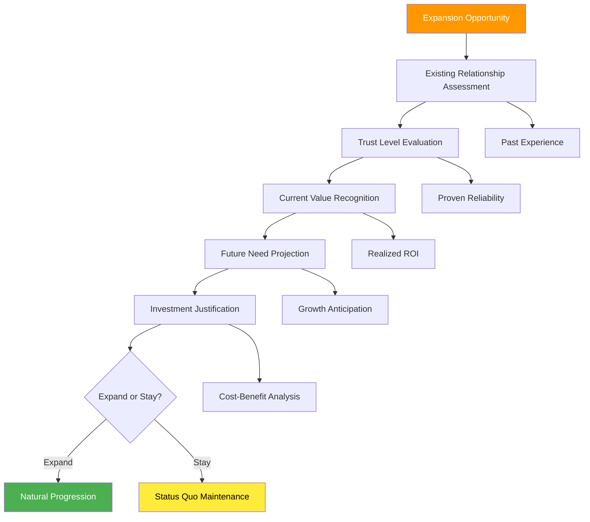
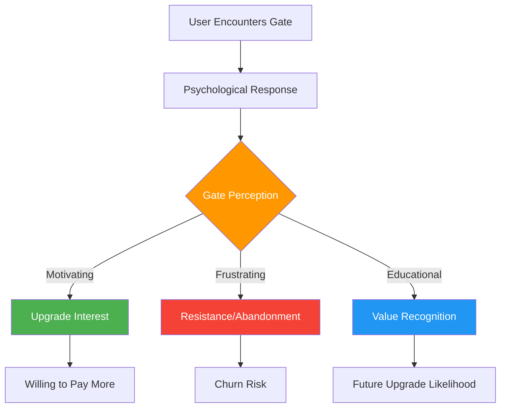
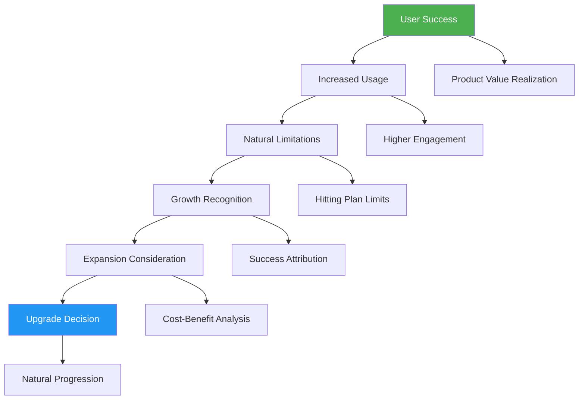
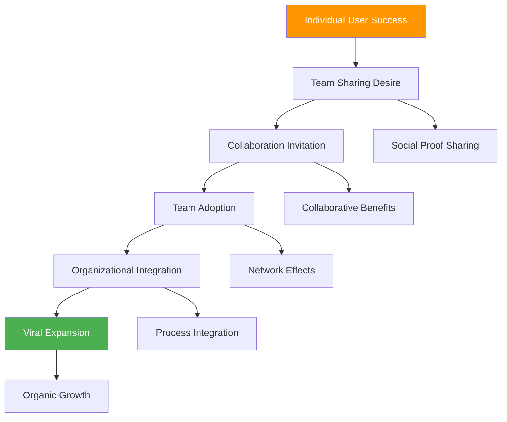
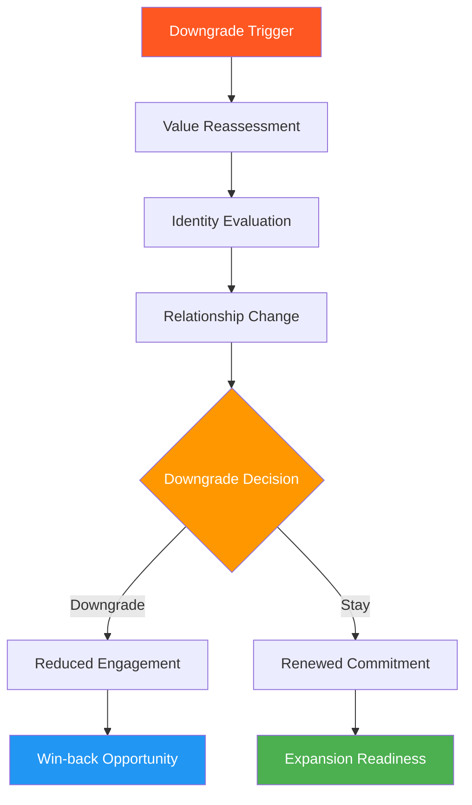
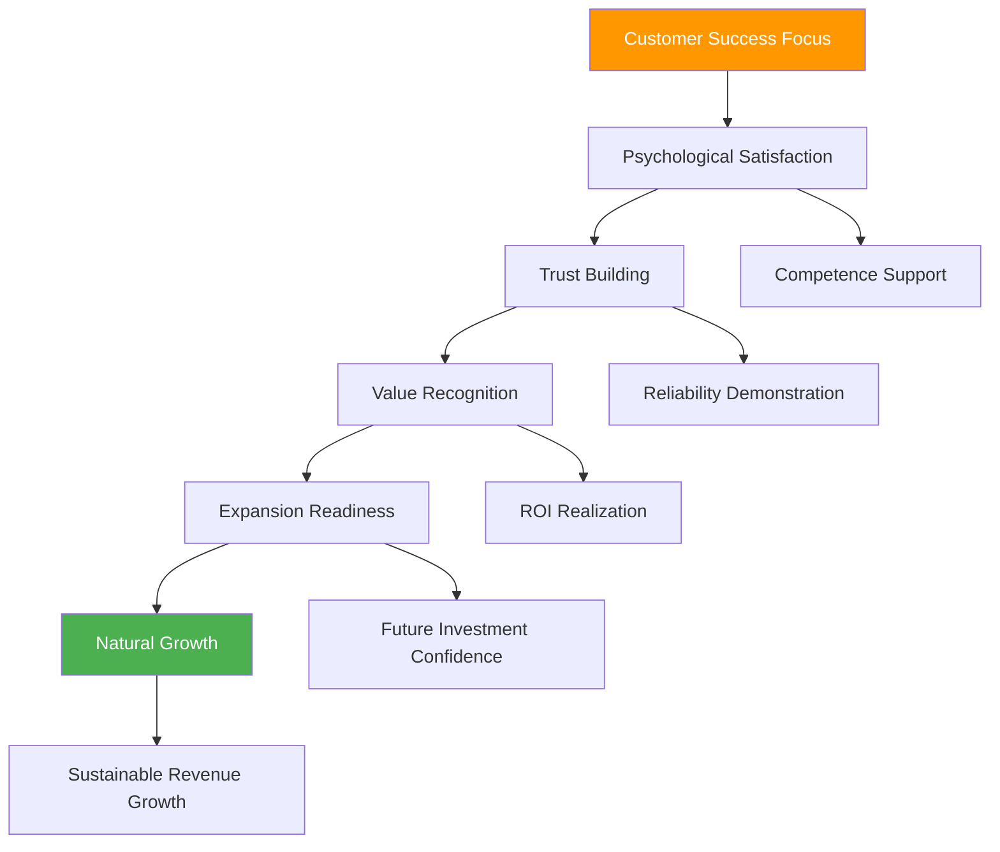

# Chapter 18: Upsell & Expansion Psychology

*The Psychology of Feature Gating, Usage-Based Natural Expansion, Team Psychology and Viral Expansion, Downgrade and Win-back Psychology, and Customer Success Psychology*

---

## 🎯 **The Psychology of Growth Within**

Customer expansion is often more valuable than new customer acquisition, both financially and psychologically. Existing customers have already overcome initial barriers, developed trust, and integrated your product into their workflows. Understanding expansion psychology is crucial for sustainable SaaS growth without the constant pressure of new customer acquisition.

This chapter reveals the psychological principles behind effective feature gating, how usage naturally drives expansion needs, team psychology that creates viral growth within organizations, the complex psychology of downgrades and win-back strategies, and how customer success psychology drives long-term expansion.

---

## 🧠 **The Neuroscience of Customer Expansion**

### How Existing Customers Process Growth Opportunities

When current customers encounter expansion opportunities, their brains process these decisions differently than new customer acquisitions, leveraging existing trust, familiarity, and investment.

### The Psychology of Existing Customer Decisions

**Expansion Decision Factors:**

| **Factor** | **New Customer** | **Existing Customer** | **Psychology Difference** |
|-----------|------------------|----------------------|-------------------------|
| **Trust Level** | Must be established | Already established | Lower barrier to entry |
| **Risk Perception** | High uncertainty | Known experience | Reduced risk aversion |
| **Value Evidence** | Promises and demos | Proven track record | Higher confidence |
| **Decision Speed** | Careful evaluation | Faster commitment | Trust-based decisions |
| **Investment Justification** | Full ROI calculation | Incremental benefit | Lower justification threshold |

---

## 🚪 **The Psychology of Feature Gating**

### Feature Gating as Psychological Architecture

Feature gating isn't just about limiting functionality—it's about creating psychological experiences that guide users through value discovery and natural upgrade progression.

### Psychological Principles of Effective Feature Gating

**1. Progressive Value Revelation**
- *Principle*: Show enough value to create desire, but not so much to eliminate need
- *Psychology*: Curiosity gap and completion drive
- *Implementation*: Partial feature access with clear expansion benefits

**2. Natural Limitation Points**
- *Principle*: Gates should feel logical rather than arbitrary
- *Psychology*: Perceived fairness and reasonable constraints
- *Implementation*: Usage-based limits that align with user growth

**3. Aspirational Positioning**
- *Principle*: Premium features represent user growth and success
- *Psychology*: Identity and status motivation
- *Implementation*: Features positioned as tools for advanced/successful users

### Feature Gating Strategies by Psychology

| **Gating Strategy** | **Psychological Mechanism** | **User Experience** | **Expansion Impact** |
|-------------------|----------------------------|-------------------|-------------------|
| **Usage Limits** | Artificial scarcity + growth alignment | "You're succeeding, need more" | +45% natural expansion |
| **Advanced Features** | Competence and mastery drive | "Ready for next level tools" | +32% aspirational upgrades |
| **Team Features** | Social collaboration needs | "Include your team" | +67% viral expansion |
| **Integration Gates** | Workflow completion desire | "Connect your stack" | +28% ecosystem lock-in |
| **Customization Limits** | Identity expression needs | "Make it truly yours" | +31% personalization upgrades |

### The Feature Gate Optimization Framework

**The GATE Method:**

**G** - **Gradual Introduction**: Introduce limitations progressively, not abruptly
**A** - **Aligned with Growth**: Tie limitations to user success and scaling needs
**T** - **Transparent Value**: Clearly communicate what's unlocked at each tier
**E** - **Easy Expansion**: Make upgrading simple and logical

### Case Study: Figma's Collaborative Feature Gating

**Gating Strategy:**
- **Free Tier**: 3 Figma files, 2 editors per file
- **Professional Tier**: Unlimited files, unlimited editors
- **Organization Tier**: Advanced admin controls, team libraries

**Psychological Design:**
- **Natural Growth**: Limits align with team/project expansion
- **Social Pressure**: Team members want to collaborate
- **Professional Identity**: Moving from personal to professional use
- **Clear Value**: Obvious benefits for each tier

**Result**: 89% of teams that hit the collaboration limit upgrade within 30 days, with 94% retention after upgrade

---

## 📈 **Usage-Based Psychology and Natural Expansion**

### The Psychology of Organic Growth Needs

The most effective expansion happens when users naturally outgrow their current plan through success with the product, creating psychological alignment between user achievement and revenue growth.

### Usage-Based Expansion Psychology

**1. Success Attribution**
- Users attribute their success partially to the tool
- Creates positive association with the product
- Generates willingness to invest more in continued success

**2. Growth Mindset Activation**
- Hitting limits signals progress and growth
- Creates aspirational motivation for next level
- Transforms limitations from frustrations to achievements

**3. Investment Justification**
- Past success provides ROI evidence
- Future investment feels safer based on proven results
- Incremental cost increase feels proportional to value increase

### Natural Expansion Trigger Points

| **Trigger Type** | **Psychological Moment** | **Implementation** | **Conversion Rate** |
|-----------------|-------------------------|-------------------|-------------------|
| **Volume Limits** | "I'm succeeding enough to need more" | Storage, API calls, users | 67% upgrade rate |
| **Performance Needs** | "My success requires better tools" | Speed, advanced features | 54% upgrade rate |
| **Team Growth** | "My team needs to collaborate" | Multi-user features | 78% upgrade rate |
| **Integration Needs** | "I need to connect my workflow" | API access, connectors | 43% upgrade rate |
| **Compliance Requirements** | "My growth requires compliance" | Security, audit features | 81% upgrade rate |

### The Natural Expansion Framework

**The EXPAND Method:**

**E** - **Enable Success First**: Focus on user achievement before expansion
**X** - **eXpect Growth**: Design for user scaling from the beginning
**P** - **Predictable Patterns**: Create clear upgrade paths
**A** - **Aligned Incentives**: Your revenue grows with their success
**N** - **Natural Timing**: Present expansion at moments of user success
**D** - **Demonstrate Value**: Show clear ROI for next tier

---

## 👥 **Team Psychology and Viral Expansion**

### The Psychology of Organizational Adoption

When individual users expand to team usage, they activate powerful psychological forces including social proof, collaborative identity, and organizational momentum.

### Team Expansion Psychological Drivers

**1. Social Validation**
- Users want to share their successful discoveries
- Demonstrates competence and thought leadership
- Creates social capital within the organization

**2. Collaborative Efficiency**
- Working together becomes more efficient than working separately
- Creates positive peer pressure for adoption
- Builds shared workflows and dependencies

**3. Professional Identity**
- Teams develop identity around shared tools
- Creates belonging and group cohesion
- Establishes professional standards and practices

### Viral Team Expansion Strategies

**The VIRAL Framework:**

**V** - **Valuable Sharing**: Make it beneficial to invite others
**I** - **Integrated Workflows**: Create collaborative dependencies
**R** - **Recognition Systems**: Reward team builders and advocates
**A** - **Administrative Control**: Provide management and oversight tools
**L** - **Learning Together**: Enable collective skill development

### Team Psychology Implementation

| **Strategy** | **Psychological Appeal** | **Implementation** | **Viral Coefficient** |
|-------------|-------------------------|-------------------|---------------------|
| **Collaborative Features** | Efficiency + social connection | Real-time editing, comments | 2.3x user growth |
| **Team Templates** | Shared success patterns | Pre-built team workflows | 1.8x adoption rate |
| **Admin Dashboards** | Control and visibility | Usage analytics, permissions | 1.4x management buy-in |
| **Team Challenges** | Group achievement | Collective goals, leaderboards | 2.1x engagement |
| **Knowledge Sharing** | Social learning | Team libraries, best practices | 1.6x retention |

### Case Study: Slack's Team Psychology Mastery

**Viral Team Mechanics:**
- **Channel Creation**: Easy to create shared spaces
- **@mentions**: Social pressure and attention
- **Integration Hub**: Becomes central workflow tool
- **Custom Emojis**: Team identity and culture building
- **Archive Visibility**: FOMO for missing conversations

**Psychological Elements:**
- **Inclusion Pressure**: Don't want to miss team communications
- **Efficiency Gains**: Faster than email, more organized than meetings
- **Social Bonding**: Shared experiences and culture
- **Professional Identity**: "We're a Slack team"

*Result: Average team grows from 3 to 12 users within 6 months of adoption*

---

## 📉 **The Psychology of Downgrades and Win-back**

### Understanding Downgrade Psychology

Downgrades are complex psychological events that involve identity shifts, value reassessment, and relationship changes with the product. Understanding this psychology is crucial for prevention and recovery.

### Downgrade Psychological Triggers

**1. Value Perception Shift**
- Changed circumstances reduce perceived need
- Competitor alternatives appear more attractive
- ROI calculation no longer favorable

**2. Identity Evolution**
- User/company growth changes requirements
- Professional role or responsibility shifts
- Team structure or workflow modifications

**3. Economic Pressure**
- Budget constraints force optimization
- Cost-cutting initiatives target subscriptions
- Economic uncertainty drives conservative spending

### Downgrade Prevention Psychology

**The RETAIN Framework:**

**R** - **Recognize Early Signals**: Monitor usage and engagement patterns
**E** - **Engage Proactively**: Reach out before formal downgrade requests
**T** - **Tailor Solutions**: Offer customized alternatives to standard downgrades
**A** - **Anchor Value**: Remind users of achieved benefits and ROI
**I** - **Incentivize Retention**: Provide compelling reasons to maintain current tier
**N** - **Nurture Relationship**: Focus on long-term partnership over short-term revenue

### Win-back Psychology Strategies

| **Strategy** | **Psychological Appeal** | **Implementation** | **Success Rate** |
|-------------|-------------------------|-------------------|-----------------|
| **Success Reminders** | Past achievement recognition | ROI reports, usage highlights | 34% retention |
| **Exclusive Offers** | Loss aversion + exclusivity | Special pricing, early access | 28% win-back |
| **Feature Demonstrations** | Renewed value perception | Personalized demos, use cases | 41% re-engagement |
| **Peer Comparisons** | Social proof + FOMO | Industry benchmarks, case studies | 23% reconsideration |
| **Relationship Investment** | Sunk cost psychology | Training, customization offers | 37% retention |

---

## 🤝 **Customer Success Psychology**

### The Psychology of Customer Success

Customer success is fundamentally about understanding and optimizing the psychological journey of value realization, satisfaction, and growth within the customer relationship.

### Customer Success Psychological Principles

**1. Competence Building**
- Help customers feel smart and capable
- Provide education and skill development
- Celebrate customer achievements and milestones

**2. Autonomy Support**
- Enable customer self-sufficiency
- Provide tools and resources for independent success
- Respect customer decision-making and preferences

**3. Relationship Investment**
- Build personal connections and trust
- Understand customer goals and challenges
- Demonstrate genuine care for customer success

### The Customer Success Psychology Framework

**The SUCCESS Method:**

**S** - **Support Competence**: Help customers feel capable and smart
**U** - **Understand Goals**: Deeply comprehend customer objectives
**C** - **Celebrate Achievements**: Recognize and reward customer success
**C** - **Create Value**: Continuously deliver meaningful benefits
**E** - **Enable Growth**: Facilitate customer expansion and development
**S** - **Strengthen Relationships**: Build trust and personal connections
**S** - **Sustain Success**: Ensure long-term value realization

### Customer Success Impact on Expansion

| **Customer Success Activity** | **Psychological Impact** | **Expansion Correlation** |
|------------------------------|-------------------------|-------------------------|
| **Onboarding Excellence** | Confidence and competence | +67% expansion likelihood |
| **Regular Check-ins** | Relationship and care | +43% retention increase |
| **Success Measurement** | Achievement recognition | +52% value perception |
| **Proactive Support** | Trust and reliability | +38% satisfaction boost |
| **Growth Planning** | Future-focused partnership | +71% expansion discussions |

---

## 📊 **Measuring Expansion Psychology**

### Key Expansion Psychology Metrics

| **Metric** | **Psychological Measurement** | **Target Range** | **Insight** |
|-----------|-------------------------------|------------------|-------------|
| **Net Revenue Retention** | Customer growth satisfaction | 110-130% | Expansion health |
| **Expansion Rate** | Growth readiness | 20-40% annually | Natural progression |
| **Time to Expand** | Value recognition speed | 3-9 months | Trust building |
| **Expansion Satisfaction** | Post-upgrade happiness | 4.2-4.7/5 | Value delivery |
| **Downgrade Recovery** | Win-back effectiveness | 25-45% | Relationship strength |

### Expansion Psychology Diagnostics

**Questions to Assess Expansion Health:**

1. **Value Realization**: Are customers achieving meaningful outcomes?
2. **Growth Alignment**: Does expansion align with customer success?
3. **Trust Levels**: Do customers trust us with bigger investments?
4. **Natural Progression**: Does upgrading feel logical and beneficial?
5. **Relationship Strength**: Do customers see us as partners or vendors?
6. **Future Confidence**: Are customers optimistic about continued value?

---

## 🔧 **Implementation Framework: The GROWTH Method**

### G-R-O-W-T-H: Expansion Psychology Framework

**G - Generate Success First**
- Focus on customer achievement before expansion asks
- Build evidence of value and ROI
- Create success stories and case studies

**R - Recognize Expansion Signals**
- Monitor usage patterns and growth indicators
- Identify natural expansion trigger points
- Proactively engage at optimal moments

**O - Optimize Value Delivery**
- Continuously improve customer experience
- Address barriers to success and satisfaction
- Enhance features that drive the most value

**W - Win-back Gracefully**
- Handle downgrades with dignity and care
- Maintain relationships through transitions
- Create pathways for future re-engagement

**T - Team-ify Individual Success**
- Help successful individuals become team advocates
- Create viral expansion through collaboration
- Build organizational adoption momentum

**H - Health-focused Metrics**
- Measure expansion health, not just expansion revenue
- Monitor customer satisfaction and long-term success
- Balance growth objectives with customer wellbeing

---

## 🎯 **Chapter 18 Action Items**

### Immediate Assessment (Week 1)
- [ ] Audit current feature gating strategy and user psychology
- [ ] Analyze usage-based expansion patterns and triggers
- [ ] Evaluate team expansion and viral growth mechanisms
- [ ] Review downgrade patterns and win-back effectiveness

### Strategic Implementation (Month 1)
- [ ] Optimize feature gating for natural expansion psychology
- [ ] Implement usage-based expansion trigger systems
- [ ] Design team psychology and viral expansion features
- [ ] Create downgrade prevention and win-back strategies

### Long-term Development (Quarter 1)
- [ ] Build comprehensive expansion psychology analytics
- [ ] Develop AI-driven expansion opportunity identification
- [ ] Create customer success psychology optimization
- [ ] Establish expansion health and satisfaction monitoring

---

## 🔗 **Connection to Other Chapters**

- **Chapter 12**: Builds on habit formation for customer retention
- **Chapter 14**: Extends daily engagement to expansion opportunities
- **Chapter 17**: Connects to pricing psychology and value perception
- **Chapter 19**: Links to churn prevention and customer psychology
- **Chapter 25**: Relates to building psychological competitive advantages

---

*"The best expansions don't feel like upsells—they feel like natural progressions. Focus on customer success, and expansion becomes the obvious next step in their journey."*

**Next**: Chapter 19 explores churn psychology, revealing why customers leave and how to prevent and recover from churn through deep psychological understanding.
