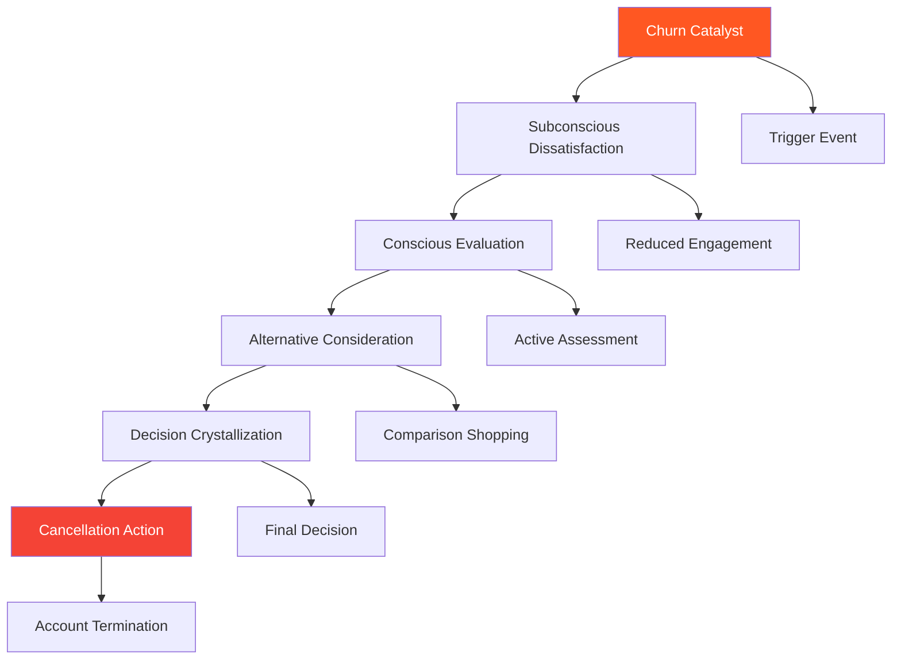
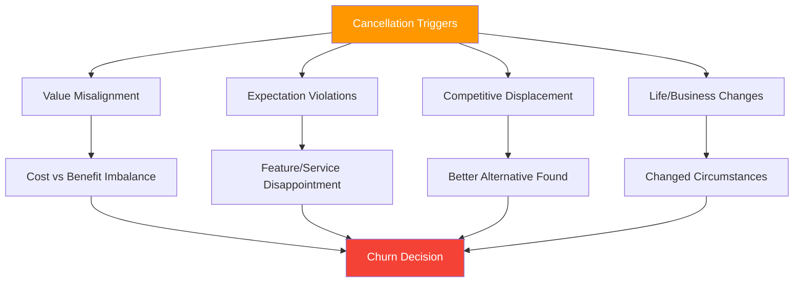
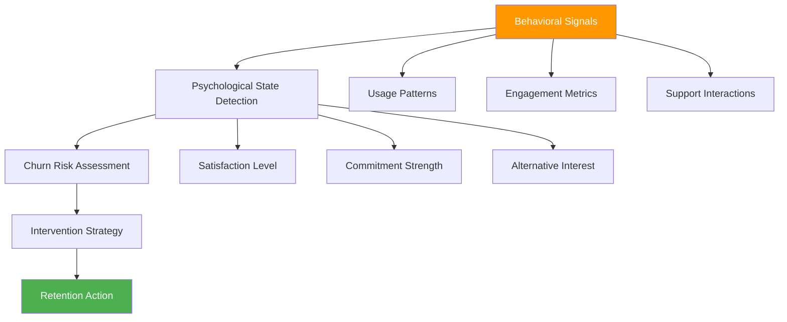
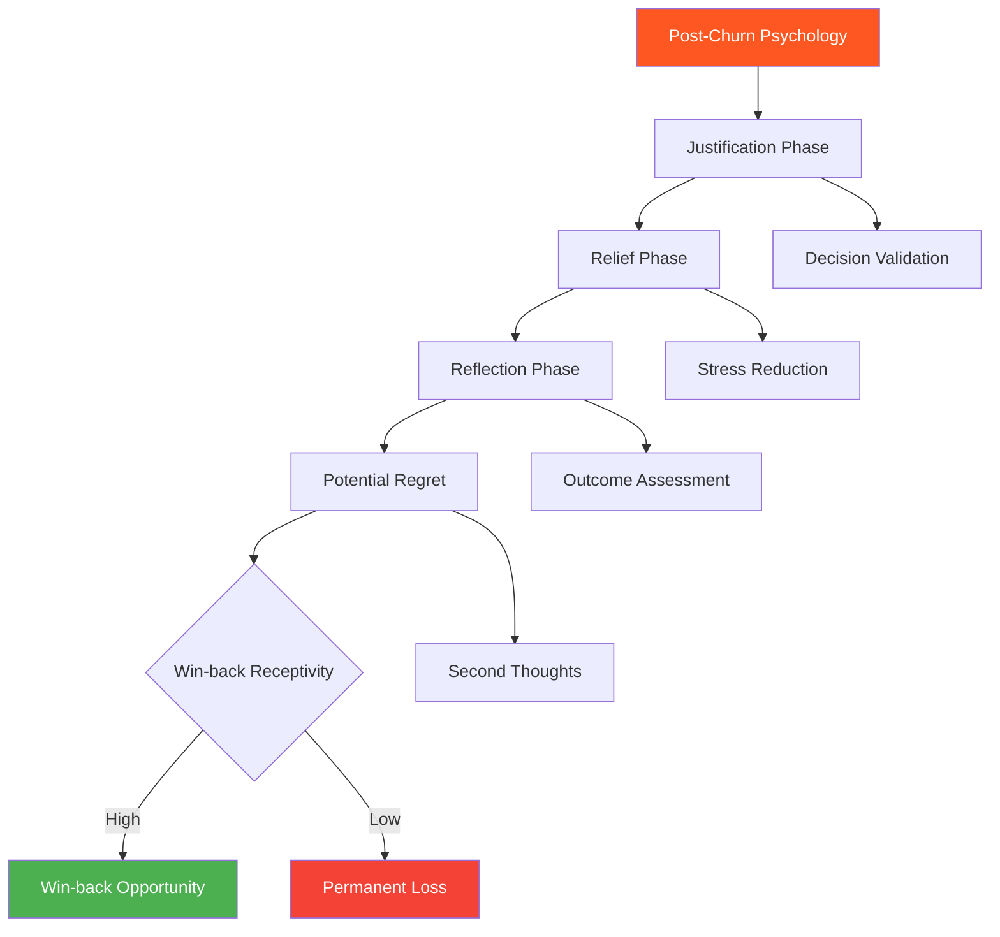
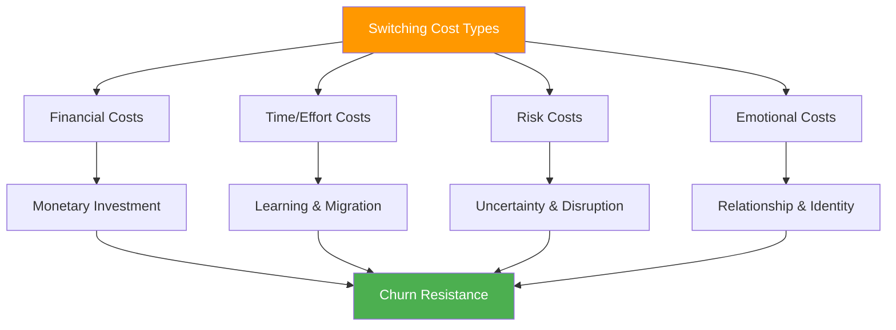
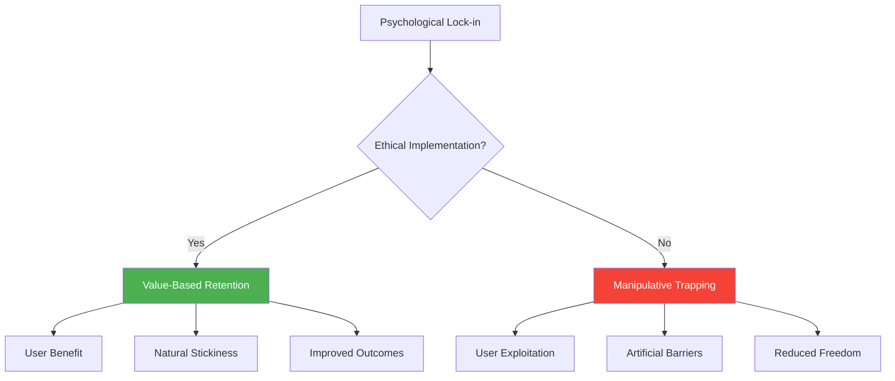

# Chapter 19: Churn Psychology

*The Psychology of Cancellation, Churn Prediction Through Behavioral Psychology, Win-back and Re-engagement Psychology, Switching Costs Psychology, and Building Psychological Lock-in*

---

## 🎯 **The Psychology of Leaving**

Churn is the ultimate psychological failure in SaaS—it represents a breakdown in the value relationship, trust, or engagement that once existed between user and product. Understanding churn psychology is crucial not just for prevention, but for building products that create genuine, lasting relationships with users.

This chapter reveals the psychological processes behind cancellation decisions, how behavioral patterns predict churn before users are consciously aware of it, the complex psychology of winning back lost customers, how switching costs create psychological barriers to leaving, and ethical ways to build psychological lock-in that benefits both users and businesses.

---

## 🧠 **The Neuroscience of Cancellation Decisions**

### How the Brain Processes Churn Decisions

Cancellation decisions involve complex psychological processes that often begin weeks or months before the actual cancellation event, involving gradual disengagement, value reassessment, and alternative evaluation.

### The Churn Psychology Timeline

| **Stage** | **Duration** | **Psychological State** | **Observable Behaviors** | **Intervention Opportunity** |
|-----------|-------------|------------------------|-------------------------|------------------------------|
| **Satisfaction Decline** | Weeks 1-4 | Subtle disappointment | Reduced usage frequency | High - preventive care |
| **Disengagement** | Weeks 5-8 | Growing frustration | Lower feature adoption | Medium - re-engagement |
| **Evaluation** | Weeks 9-12 | Active dissatisfaction | Competitor research | Low - competitive response |
| **Decision** | Weeks 13-16 | Resolved to leave | Cancellation process | Very Low - last-ditch effort |

---

## 🚪 **The Psychology of Cancellation**

### Understanding Cancellation Triggers

Cancellation decisions are rarely sudden—they're the culmination of psychological processes that can be understood, predicted, and often prevented through proper intervention.

### Primary Cancellation Psychology Categories

**1. Value-Based Churn**
- *Psychology*: Cost-benefit analysis becomes unfavorable
- *Triggers*: Price increases, reduced usage, budget constraints
- *Prevention*: Value demonstration, pricing flexibility, ROI proof

**2. Experience-Based Churn**
- *Psychology*: Accumulated frustration exceeds satisfaction
- *Triggers*: Poor support, bugs, usability issues
- *Prevention*: Experience optimization, proactive support

**3. Competitive-Based Churn**
- *Psychology*: Alternative appears superior
- *Triggers*: Competitor features, pricing, marketing
- *Prevention*: Differentiation, switching costs, relationship strength

**4. Circumstantial Churn**
- *Psychology*: External factors change needs
- *Triggers*: Business changes, role changes, life events
- *Prevention*: Flexible solutions, pause options, relationship maintenance

### The Cancellation Psychology Framework

**The CANCEL Analysis:**

**C** - **Catalyst Identification**: What triggered the cancellation consideration?
**A** - **Alternative Evaluation**: What options is the customer considering?
**N** - **Needs Assessment**: Have customer needs changed or evolved?
**C** - **Cost-Benefit Perception**: How does value perception compare to cost?
**E** - **Experience Quality**: What pain points have accumulated?
**L** - **Loyalty Factors**: What relationship elements might retain them?

### Cancellation Prevention Strategies

| **Churn Type** | **Psychological Intervention** | **Implementation** | **Success Rate** |
|---------------|-------------------------------|-------------------|------------------|
| **Value Churn** | ROI demonstration | Usage reports, savings calculators | 43% prevention |
| **Experience Churn** | Frustration resolution | Proactive support, UX improvements | 67% prevention |
| **Competitive Churn** | Differentiation emphasis | Unique value props, switching costs | 34% prevention |
| **Circumstantial Churn** | Flexible solutions | Pause options, plan modifications | 52% prevention |

---

## 🔮 **Churn Prediction Through Behavioral Psychology**

### The Psychology of Pre-Churn Behaviors

Users exhibit predictable behavioral patterns weeks or months before conscious cancellation decisions, allowing for proactive intervention based on psychological indicators.

### Behavioral Churn Prediction Indicators

**Early Warning Signals (30-60 days before churn):**

1. **Engagement Decline**
   - Reduced login frequency
   - Shorter session durations
   - Lower feature adoption rates

2. **Value Realization Decrease**
   - Fewer goal completions
   - Reduced output/productivity
   - Lower utilization of key features

3. **Support Pattern Changes**
   - Increased frustration in support tickets
   - Questions about alternatives or comparisons
   - Requests for data export or migration

4. **Social Disengagement**
   - Reduced team collaboration
   - Less sharing or inviting others
   - Decreased community participation

### Psychological Churn Prediction Models

**The PREDICT Framework:**

**P** - **Pattern Recognition**: Identify behavioral deviation from baseline
**R** - **Risk Scoring**: Quantify churn probability based on psychological factors
**E** - **Early Intervention**: Act on signals before conscious decision-making
**D** - **Dynamic Monitoring**: Continuously assess and update risk levels
**I** - **Individual Profiling**: Customize predictions to user psychological profiles
**C** - **Contextual Factors**: Consider external circumstances and triggers
**T** - **Timing Optimization**: Intervene at psychologically optimal moments

### Churn Prediction Implementation

| **Signal Category** | **Psychological Indicator** | **Technical Measurement** | **Prediction Accuracy** |
|-------------------|----------------------------|-------------------------|------------------------|
| **Engagement Decay** | Decreased emotional investment | Session frequency/duration | 78% accuracy |
| **Value Perception Shift** | ROI satisfaction decline | Feature usage patterns | 71% accuracy |
| **Alternative Exploration** | Competitive interest | Search behavior, questions | 84% accuracy |
| **Social Disconnection** | Reduced collaboration | Team interaction metrics | 69% accuracy |
| **Support Escalation** | Frustration accumulation | Ticket sentiment analysis | 76% accuracy |

---

## 🔄 **Win-back Psychology and Re-engagement**

### The Psychology of Lost Customers

Winning back churned customers requires understanding their post-cancellation psychology, which involves justification, relief, regret, and openness to reconciliation under the right circumstances.

### Win-back Psychology Principles

**1. Cognitive Dissonance Resolution**
- Churned customers need to justify their decision
- Successful win-back must acknowledge their reasons were valid
- Provide new information that changes the cost-benefit equation

**2. Trust Rebuilding**
- Cancellation often involves trust breakdown
- Win-back requires demonstrating changes and improvements
- Transparency about what went wrong and how it's been fixed

**3. Low-Pressure Re-engagement**
- High-pressure win-back tactics increase resistance
- Gentle, value-focused approaches reduce psychological barriers
- Patience and respect for their decision-making autonomy

### Win-back Campaign Psychology

**The WINBACK Framework:**

**W** - **Wait Appropriately**: Give customers time to experience life without the product
**I** - **Investigate Reasons**: Understand why they truly left
**N** - **New Value Proposition**: Offer something genuinely different or improved
**B** - **Build Trust**: Demonstrate reliability and commitment to their success
**A** - **Acknowledge Past**: Validate their decision and show learning
**C** - **Create Easy Return**: Minimize friction and risk in coming back
**K** - **Keep Expectations Realistic**: Not all customers will or should return

### Win-back Strategies by Churn Reason

| **Churn Reason** | **Win-back Psychology** | **Strategy** | **Success Rate** |
|-----------------|------------------------|-------------|------------------|
| **Value Concerns** | Show improved ROI | New features, pricing options | 28% return rate |
| **Poor Experience** | Demonstrate improvements | UX updates, better support | 34% return rate |
| **Competitive Loss** | Highlight unique advantages | Differentiation, switching incentives | 19% return rate |
| **Changed Needs** | Address new requirements | Product evolution, new solutions | 41% return rate |
| **Budget Constraints** | Flexible options | Discounts, payment plans | 37% return rate |

---

## 🔒 **The Psychology of Switching Costs**

### Understanding Switching Cost Psychology

Switching costs aren't just financial—they're deeply psychological, involving time, effort, risk, and emotional investment that create natural barriers to leaving.

### Psychological Switching Cost Categories

**1. Cognitive Switching Costs**
- Learning new systems and workflows
- Mental model reconstruction
- Skill transfer and adaptation challenges

**2. Emotional Switching Costs**
- Loss of familiarity and comfort
- Relationship dissolution with support/success teams
- Identity shifts from tool/platform associations

**3. Social Switching Costs**
- Team disruption and change management
- Collaboration workflow interruption
- Community and network disconnection

**4. Procedural Switching Costs**
- Data migration complexity
- Integration reconfiguration
- Workflow reconstruction effort

### Building Ethical Switching Costs

**The STICKY Framework:**

**S** - **Skill Development**: Help users become proficient and invested
**T** - **Trust Building**: Create reliable, dependable relationships
**I** - **Integration Deep**: Become essential to their workflow
**C** - **Community Connection**: Foster relationships beyond the product
**K** - **Knowledge Accumulation**: Build valuable data and content
**Y** - **Year-over-year Value**: Increase value with time and usage

### Ethical vs Manipulative Switching Costs

| **Ethical Switching Costs** | **Manipulative Switching Costs** |
|----------------------------|----------------------------------|
| **Value-based retention** | **Lock-in through complexity** |
| **Skill development investment** | **Proprietary format traps** |
| **Improved user capabilities** | **Punitive export restrictions** |
| **Genuine workflow integration** | **Artificial incompatibilities** |
| **Community relationships** | **Hostage-holding tactics** |
| **Data value enhancement** | **Data portability obstacles** |

---

## 🔐 **Building Psychological Lock-in**

### The Ethics of Psychological Lock-in

Psychological lock-in should create genuine value for users while naturally discouraging churn—not trap users in unfavorable relationships.

### Positive Psychological Lock-in Mechanisms

**1. Competence Investment**
- Users develop expertise and mastery
- Skills become valuable professional assets
- Switching means losing accumulated competence

**2. Identity Integration**
- Product becomes part of professional identity
- Personal brand association with the tool
- Community status and recognition

**3. Workflow Optimization**
- Customized processes and configurations
- Perfected workflows and automations
- Efficiency gains that would be lost

**4. Relationship Value**
- Personal connections with team/support
- Community relationships and networks
- Trust and familiarity with people

### The Psychological Lock-in Framework

**The RETAIN Method:**

**R** - **Relationship Building**: Foster human connections, not just product usage
**E** - **Expertise Development**: Help users become skilled and confident
**T** - **Trust Accumulation**: Build reliability and dependability over time
**A** - **Asset Creation**: Help users build valuable data, content, and configurations
**I** - **Identity Alignment**: Connect product usage to professional/personal identity
**N** - **Network Effects**: Create value through community and collaboration

### Measuring Healthy Psychological Lock-in

| **Lock-in Type** | **Healthy Indicator** | **Unhealthy Indicator** | **Measurement** |
|-----------------|----------------------|------------------------|-----------------|
| **Skill-Based** | Professional growth | Forced dependency | Certification/expertise levels |
| **Data-Based** | Value accumulation | Export difficulty | Data richness, portability ease |
| **Network-Based** | Community benefit | Isolation from alternatives | Network activity, connections |
| **Workflow-Based** | Efficiency gains | Process complexity | Automation usage, customization |

---

## 📊 **Measuring Churn Psychology**

### Key Churn Psychology Metrics

| **Metric** | **Psychological Measurement** | **Target Range** | **Insight** |
|-----------|-------------------------------|------------------|-------------|
| **Churn Rate** | Relationship failure rate | <5% monthly | Overall retention health |
| **Churn Prediction Accuracy** | Behavioral pattern recognition | 75-85% | Early warning effectiveness |
| **Win-back Success Rate** | Relationship repair capability | 25-40% | Recovery potential |
| **Switching Cost Strength** | Retention stickiness | High satisfaction scores | Healthy lock-in |
| **Time to Churn** | Relationship deterioration speed | >12 months average | Retention durability |

### Churn Psychology Diagnostics

**Questions to Assess Churn Health:**

1. **Early Detection**: Can we predict churn before customers know they'll leave?
2. **Root Cause Understanding**: Do we truly understand why customers churn?
3. **Prevention Effectiveness**: Are our retention interventions working?
4. **Win-back Capability**: Can we successfully re-engage churned customers?
5. **Switching Cost Value**: Do our switching costs benefit customers or just us?
6. **Relationship Quality**: Are customers staying because they want to or have to?

---

## 🔧 **Implementation Framework: The PROTECT Method**

### P-R-O-T-E-C-T: Churn Psychology Framework

**P - Predict Early Warning Signs**
- Monitor behavioral indicators of declining satisfaction
- Use psychological models to identify at-risk customers
- Intervene before conscious churn consideration begins

**R - Respond to Customer Needs**
- Address satisfaction issues proactively
- Adapt product and service to evolving needs
- Demonstrate genuine care for customer success

**O - Optimize Value Delivery**
- Continuously improve ROI and user experience
- Remove friction and enhance satisfaction
- Build stronger value propositions over time

**T - Treat Churn as Learning**
- Conduct thorough churn analysis and interviews
- Use departures to improve retention strategies
- Transform feedback into product improvements

**E - Execute Win-back Campaigns**
- Develop respectful re-engagement strategies
- Address root causes of previous churn
- Offer genuine improvements and value

**C - Create Ethical Switching Costs**
- Build value-based retention mechanisms
- Help customers become more successful with your product
- Foster genuine relationships and community

**T - Track Long-term Relationship Health**
- Monitor satisfaction and loyalty trends
- Measure healthy vs unhealthy retention
- Focus on sustainable customer relationships

---

## 🎯 **Chapter 19 Action Items**

### Immediate Assessment (Week 1)
- [ ] Analyze current churn patterns and psychological triggers
- [ ] Implement behavioral churn prediction models
- [ ] Evaluate existing switching costs for ethical balance
- [ ] Review win-back strategies and success rates

### Strategic Implementation (Month 1)
- [ ] Develop psychological churn prediction systems
- [ ] Create proactive retention intervention strategies
- [ ] Design ethical switching cost mechanisms
- [ ] Build respectful win-back campaign frameworks

### Long-term Development (Quarter 1)
- [ ] Build comprehensive churn psychology analytics
- [ ] Develop AI-driven retention and win-back systems
- [ ] Create customer relationship health monitoring
- [ ] Establish churn ethics and customer care standards

---

## 🔗 **Connection to Other Chapters**

- **Chapter 12**: Builds on habit formation for retention
- **Chapter 14**: Extends daily engagement to prevent churn
- **Chapter 17**: Connects to pricing psychology and value perception
- **Chapter 18**: Links to expansion psychology and customer success
- **Chapter 25**: Relates to building sustainable competitive advantages

---

*"Churn is not just a business metric—it's a relationship metric. Focus on understanding why people leave, and you'll discover how to make them want to stay."*

**Next**: Chapter 20 begins Part VII with Network Effects Psychology, exploring how psychological principles drive exponential growth through multi-sided markets and platform effects.
