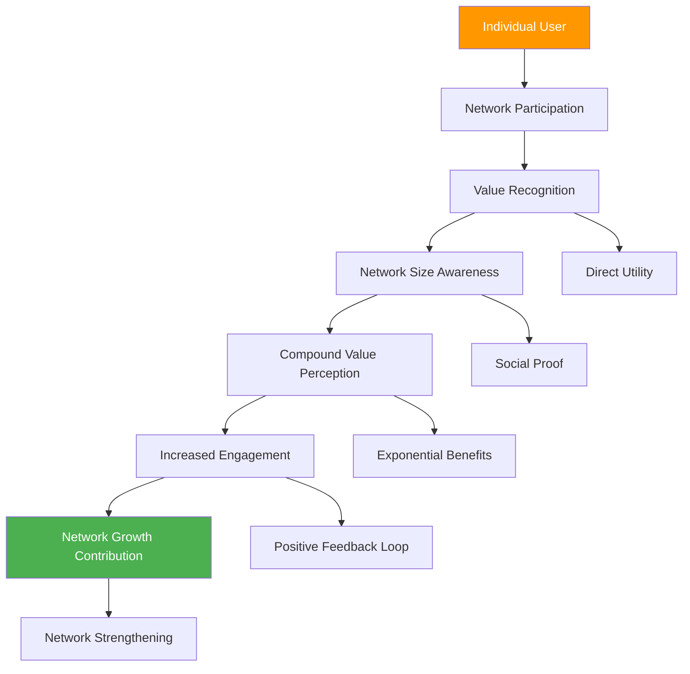
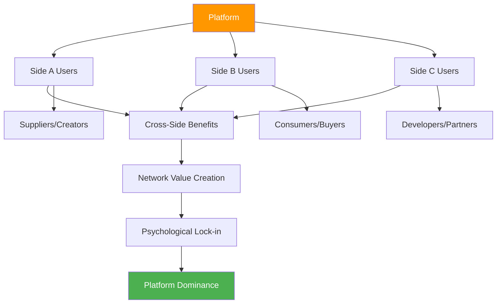
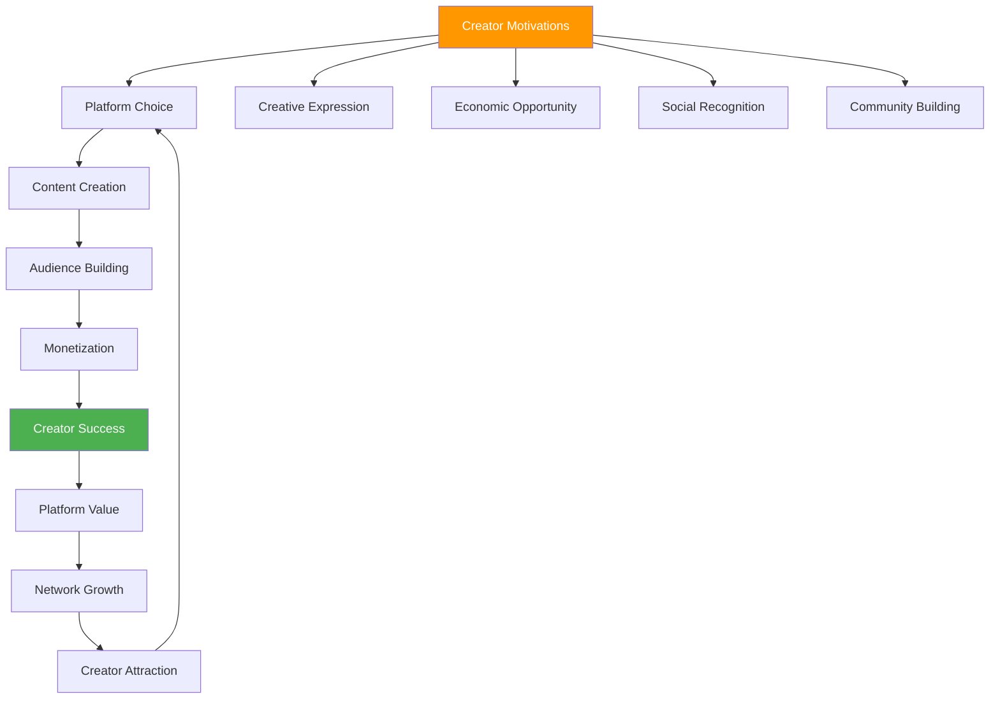
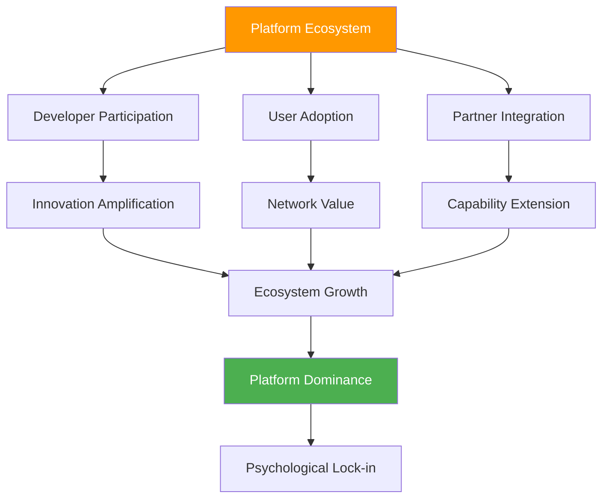
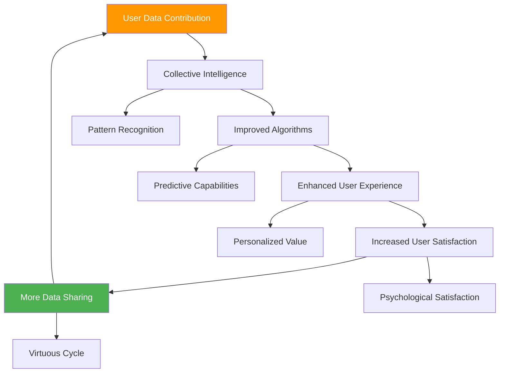
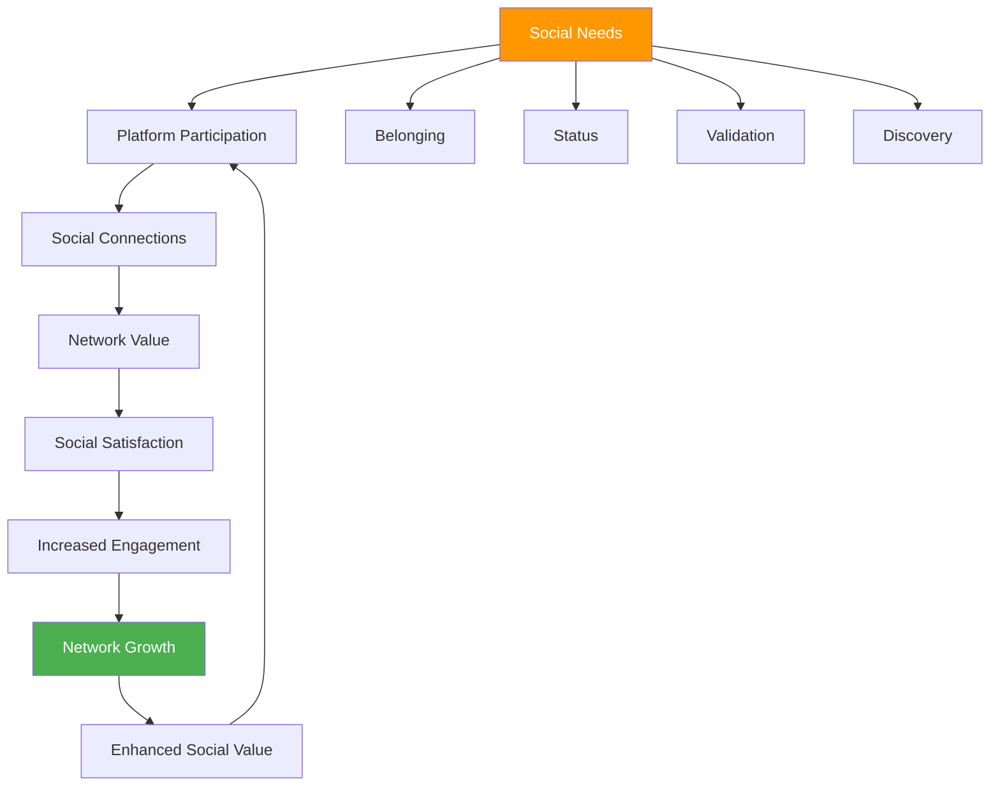

# Chapter 20: Network Effects Psychology

*Multi-sided Market Psychology, Creator Economy Psychology, Platform Psychology and Ecosystem Effects, Data Network Effects and Intelligence, and Social Network Psychology*

---

## 🎯 **The Psychology of Exponential Value**

Network effects represent the pinnacle of SaaS psychology—when each new user makes the product more valuable for existing users, creating exponential growth and powerful competitive moats. Understanding network effects psychology is crucial for building products that become more valuable, not just larger, as they scale.

This chapter reveals the psychological principles behind multi-sided markets, the creator economy psychology driving platform success, how ecosystem effects create psychological lock-in, the intelligence amplification from data network effects, and the fundamental social psychology that powers network-based products.

---

## 🧠 **The Neuroscience of Network Value**

### How the Brain Processes Network Benefits

When users experience network effects, their brains recognize value that compounds with scale, creating psychological experiences of increasing returns and exponential benefit.

### The Psychology of Network Value Recognition

**Network Effect Value Hierarchy:**

| **Network Size** | **Psychological Experience** | **Value Perception** | **Engagement Driver** |
|-----------------|----------------------------|---------------------|---------------------|
| **Small (1-10 users)** | Experimental participation | Utility-based value | Feature curiosity |
| **Medium (11-100 users)** | Community formation | Social value emergence | Relationship building |
| **Large (101-1000 users)** | Ecosystem participation | Network value clarity | Status and influence |
| **Massive (1000+ users)** | Platform dependence | Exponential value | Essential tool status |

---

## 🔄 **Multi-sided Market Psychology**

### The Psychology of Platform Intermediation

Multi-sided markets succeed by understanding and optimizing the psychological needs of different user groups, creating value through facilitated interactions and network orchestration.

### Multi-sided Psychology Principles

**1. Cross-Side Network Effects**
- Value creation through interaction between different user types
- Each side makes the platform more valuable for other sides
- Psychological satisfaction from successful matches/transactions

**2. Same-Side Network Effects**
- Users benefit from others of the same type joining
- Community formation and peer learning
- Social proof and legitimacy through peer presence

**3. Platform Mediated Value**
- Platform provides tools, trust, and infrastructure
- Reduces transaction costs and psychological friction
- Creates safe spaces for interaction and exchange

### Multi-sided Market Psychology Strategies

**The PLATFORM Framework:**

**P** - **Participant Balance**: Ensure optimal ratios between user types
**L** - **Low Friction**: Minimize barriers to cross-side interaction
**A** - **Amplify Value**: Enhance benefits each side provides to others
**T** - **Trust Building**: Create safety and reliability for all participants
**F** - **Feedback Systems**: Enable reputation and quality signaling
**O** - **Optimize Matching**: Improve relevance and success of connections
**R** - **Reward Participation**: Incentivize valuable contributions
**M** - **Monitor Health**: Track ecosystem balance and satisfaction

### Case Study: Airbnb's Multi-sided Psychology

**Side Psychology Management:**

**Hosts (Supply Side):**
- Economic opportunity and entrepreneurship appeal
- Community belonging and sharing culture
- Achievement recognition through reviews and status
- Control and autonomy over their space and schedule

**Guests (Demand Side):**
- Authentic local experiences and cultural connection
- Value and uniqueness compared to hotels
- Discovery and adventure psychology
- Trust through host profiles and reviews

**Psychological Bridges:**
- Review systems create mutual accountability
- Messaging enables relationship building
- Insurance and guarantees reduce risk psychology
- Community guidelines establish behavioral norms

*Result: 87% of hosts report feeling part of a community, 93% of guests prefer Airbnb for the "local experience"*

---

## 🎨 **Creator Economy Psychology**

### The Psychology of Creator Platforms

Creator economy platforms succeed by understanding the deep psychological needs of creators: autonomy, mastery, purpose, recognition, and sustainable livelihood.

### Creator Psychology Drivers

**1. Creative Autonomy**
- Freedom to express unique voice and perspective
- Control over content creation and distribution
- Ability to build personal brand and following

**2. Economic Empowerment**
- Multiple monetization pathways and revenue streams
- Transparent and fair compensation structures
- Financial independence and career sustainability

**3. Social Recognition**
- Audience feedback and engagement satisfaction
- Peer recognition and creator community status
- Impact measurement and influence metrics

**4. Professional Growth**
- Skill development and creative improvement
- Network expansion and collaboration opportunities
- Platform-provided tools and resources

### Creator Economy Platform Psychology

| **Platform Element** | **Creator Psychology Need** | **Implementation** | **Success Factor** |
|---------------------|---------------------------|-------------------|-------------------|
| **Creation Tools** | Competence and efficiency | Easy-to-use editors, templates | Feature richness + simplicity |
| **Audience Building** | Social connection and growth | Discovery algorithms, sharing tools | Reach and engagement quality |
| **Monetization** | Financial sustainability | Multiple revenue streams | Fair and transparent economics |
| **Analytics** | Performance understanding | Detailed insights, optimization tips | Actionable intelligence |
| **Community** | Peer support and learning | Creator forums, collaboration tools | Active and supportive environment |

### Creator Success Psychology Framework

**The CREATE Method:**

**C** - **Competence Support**: Provide tools and education for skill development
**R** - **Recognition Systems**: Enable audience feedback and peer acknowledgment  
**E** - **Economic Opportunity**: Create multiple paths to sustainable revenue
**A** - **Autonomy Preservation**: Maintain creator control and creative freedom
**T** - **Trust Building**: Establish fair, transparent relationships
**E** - **Evolution Enablement**: Support growth and adaptation over time

---

## 🏗️ **Platform Psychology and Ecosystem Effects**

### The Psychology of Ecosystem Participation

Successful platforms create psychological ecosystems where participants feel they're part of something larger than individual transactions—they're contributing to and benefiting from a thriving community.

### Ecosystem Psychology Principles

**1. Participation Psychology**
- People want to be part of successful, growing ecosystems
- FOMO drives participation in thriving platforms
- Success begets success through social proof

**2. Investment Psychology**
- Participants invest time, money, and reputation in ecosystem
- Sunk cost psychology creates switching resistance
- Success within ecosystem becomes part of identity

**3. Innovation Psychology**
- Platforms enable creativity and entrepreneurship
- Third-party innovation extends platform value
- Collaborative innovation creates compound benefits

### Platform Ecosystem Development Strategy

**The ECOSYSTEM Framework:**

**E** - **Enable Third-party Innovation**: Provide APIs, SDKs, and developer tools
**C** - **Cultivate Community**: Build relationships between ecosystem participants
**O** - **Optimize Discovery**: Help users find relevant partners and integrations
**S** - **Support Success**: Provide resources for partner and developer success
**Y** - **Yield Benefits**: Share value creation with ecosystem participants
**S** - **Standardize Interactions**: Create consistent, reliable integration experiences
**T** - **Track Health**: Monitor ecosystem vitality and participant satisfaction
**E** - **Evolve Together**: Adapt platform based on ecosystem feedback and needs
**M** - **Measure Impact**: Quantify ecosystem value and network effects

### Ecosystem Psychological Lock-in

| **Lock-in Type** | **Psychological Mechanism** | **Example** | **Strength** |
|-----------------|----------------------------|-------------|--------------|
| **Skills Investment** | Competence development | Learning platform-specific tools | High |
| **Data Accumulation** | Sunk cost psychology | Years of data and configurations | Very High |
| **Integration Dependency** | Workflow entrenchment | Connected systems and processes | Very High |
| **Community Investment** | Social capital | Relationships and reputation | Medium |
| **Economic Dependency** | Livelihood attachment | Revenue streams through platform | Very High |

---

## 📊 **Data Network Effects and Intelligence**

### The Psychology of Intelligent Systems

Data network effects create psychological experiences of increasing intelligence and personalization, making products feel more valuable and relevant as they learn from collective usage.

### Data Network Effect Psychology

**1. Intelligence Appreciation**
- Users recognize and value system intelligence
- Smart recommendations feel almost magical
- Personalization creates sense of being understood

**2. Contribution Satisfaction**
- Users feel good about contributing to system improvement
- Collective benefit from individual data sharing
- Reciprocal value exchange psychology

**3. Competitive Advantage Recognition**
- Users understand that data makes their experience unique
- Switching would mean losing personalized intelligence
- Historical data becomes increasingly valuable

### Data Psychology Principles

**The DATA Framework:**

**D** - **Demonstrate Value**: Show clear benefits from data collection
**A** - **Acknowledge Contribution**: Recognize user data sharing
**T** - **Transparency**: Explain how data improves user experience
**A** - **Agency**: Provide control over data usage and sharing

### Data Network Effect Implementation

| **Data Type** | **Intelligence Application** | **User Benefit** | **Network Strength** |
|--------------|----------------------------|------------------|-------------------|
| **Usage Patterns** | Behavioral prediction | Anticipatory features | Medium |
| **Content Data** | Recommendation systems | Discovery and relevance | High |
| **Social Data** | Collaborative filtering | Peer-based suggestions | Very High |
| **Performance Data** | Optimization algorithms | Improved efficiency | Medium |
| **Preference Data** | Personalization engines | Customized experiences | High |

---

## 👥 **Social Network Psychology**

### The Psychology of Social Connection

Social networks tap into fundamental human needs for connection, belonging, status, and social validation, creating powerful engagement and retention effects.

### Social Network Psychological Drivers

**1. Social Connection**
- Fundamental human need for relationships and community
- Digital platforms enable connection at scale
- Asynchronous and synchronous interaction opportunities

**2. Social Validation**
- Likes, shares, comments provide psychological rewards
- Peer recognition and status signaling
- Social proof and belonging confirmation

**3. Social Discovery**
- Finding like-minded people and communities
- Learning from others' experiences and knowledge
- Expanding social and professional networks

**4. Social Identity**
- Expressing and reinforcing personal/professional identity
- Group membership and tribal belonging
- Reputation building and maintenance

### Social Network Psychology Framework

**The SOCIAL Method:**

**S** - **Stimulate Connections**: Make it easy to find and connect with others
**O** - **Optimize Interactions**: Design for meaningful engagement
**C** - **Cultivate Community**: Foster belonging and shared identity
**I** - **Incentivize Participation**: Reward valuable contributions
**A** - **Amplify Social Value**: Increase benefits of network participation
**L** - **Learn from Behavior**: Use social data to improve connections

### Social Network Effect Measurement

| **Social Metric** | **Psychological Indicator** | **Network Strength** |
|------------------|----------------------------|-------------------|
| **Connection Formation Rate** | Social exploration and openness | Medium |
| **Interaction Frequency** | Relationship depth and engagement | High |
| **Content Sharing Rate** | Trust and social validation seeking | High |
| **Community Participation** | Belonging and identity investment | Very High |
| **Network Growth Contribution** | Advocacy and social proof behavior | Very High |

---

## 🔧 **Implementation Framework: The NETWORK Method**

### N-E-T-W-O-R-K: Network Effects Psychology Framework

**N - Nurture Early Adoption**
- Focus on attracting influential early users
- Create exclusive experiences for pioneers
- Build momentum through early success stories

**E - Enable Cross-Side Value**
- Design clear benefits for all participant types
- Facilitate valuable interactions and transactions
- Reduce friction in cross-network engagement

**T - Track Network Health**
- Monitor participant satisfaction across all sides
- Measure interaction quality, not just quantity
- Watch for network imbalances or deterioration

**W - Welcome New Participants**
- Design seamless onboarding for all user types
- Provide immediate value to newcomers
- Connect new users with relevant network participants

**O - Optimize Matching and Discovery**
- Improve relevance of connections and recommendations
- Use AI and data to enhance network intelligence
- Facilitate serendipitous and intentional discoveries

**R - Reward Network Contributors**
- Recognize and incentivize valuable network participation
- Share value creation with active contributors
- Build reputation and status systems

**K - Keep Evolving**
- Adapt to changing network needs and dynamics
- Innovate based on network feedback and behavior
- Scale infrastructure to support network growth

---

## 📊 **Measuring Network Effects Psychology**

### Key Network Effect Metrics

| **Metric** | **Psychological Measurement** | **Target Range** | **Insight** |
|-----------|-------------------------------|------------------|-------------|
| **Network Density** | Connection strength | Industry-specific | Relationship depth |
| **Cross-Side Activity** | Multi-sided engagement | >60% participation | Platform balance |
| **Viral Coefficient** | Network growth rate | >1.0 sustained | Organic expansion |
| **Network NPS** | Participant satisfaction | 50-70+ | Network health |
| **Switching Cost Index** | Psychological lock-in | High retention scores | Network stickiness |

### Network Psychology Diagnostics

**Questions to Assess Network Health:**

1. **Value Clarity**: Do participants understand network benefits?
2. **Cross-Side Balance**: Are all participant types engaged and satisfied?
3. **Growth Sustainability**: Is network growth quality maintaining high standards?
4. **Community Health**: Are interactions positive and valuable?
5. **Innovation Pipeline**: Are participants creating new value within the network?
6. **Lock-in Ethics**: Are switching costs beneficial or exploitative?

---

## 🎯 **Chapter 20 Action Items**

### Immediate Assessment (Week 1)
- [ ] Analyze current network effects and participant psychology
- [ ] Evaluate multi-sided market balance and satisfaction
- [ ] Assess data network effects and intelligence value
- [ ] Review social network psychology and community health

### Strategic Implementation (Month 1)
- [ ] Design enhanced cross-side value creation mechanisms
- [ ] Implement creator economy psychology principles
- [ ] Optimize data network effects and user intelligence
- [ ] Strengthen social network psychology features

### Long-term Development (Quarter 1)
- [ ] Build comprehensive network effects analytics
- [ ] Develop AI-driven network optimization systems
- [ ] Create ecosystem psychology and partner success programs
- [ ] Establish network health and ethics monitoring

---

## 🔗 **Connection to Other Chapters**

- **Chapter 6**: Builds on social psychology foundations
- **Chapter 10**: Extends viral growth psychology to network effects
- **Chapter 12**: Connects habit formation to network participation
- **Chapter 18**: Links expansion psychology to network growth
- **Chapter 25**: Relates to building network-based competitive moats

---

*"Network effects are not just about scale—they're about creating value that compounds with every new participant. Focus on making each person's participation valuable to others, and watch exponential growth unfold."*

**Next**: Chapter 21 explores AI Psychology in SaaS, revealing how to design human-AI interactions that feel natural, trustworthy, and empowering rather than threatening or confusing.
