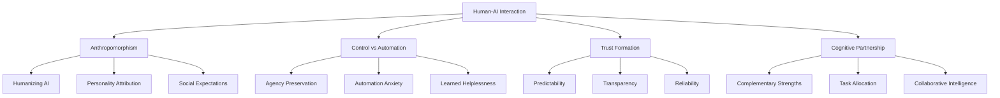
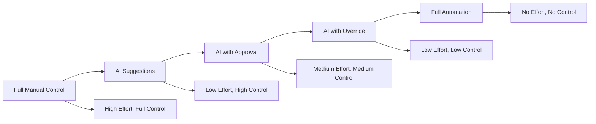
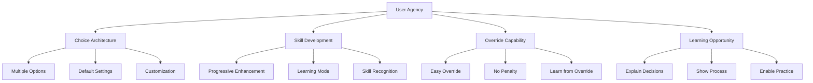
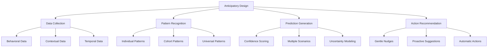
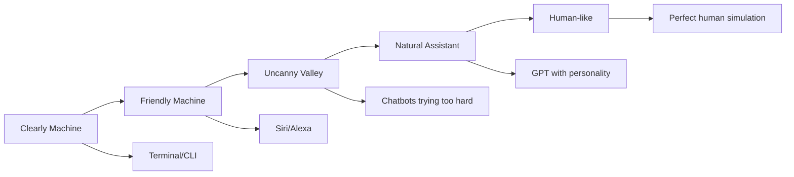
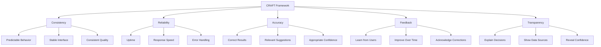
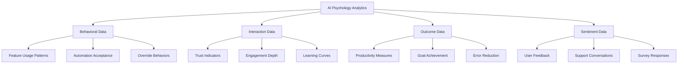

# Chapter 21: AI Psychology in SaaS

> *"The most profound technologies are those that disappear. They weave themselves into the fabric of everyday life until they are indistinguishable from it."* - Mark Weiser

## Introduction

As artificial intelligence becomes increasingly integrated into SaaS products, understanding the psychology of human-AI interaction becomes critical for billion-dollar success. This chapter explores how users perceive, trust, and interact with AI-powered features, providing frameworks for designing AI experiences that feel natural, trustworthy, and empowering rather than threatening or confusing.

The psychology of AI in SaaS isn't just about the technology—it's about how humans form relationships with intelligent systems, when they trust versus fear automation, and how to design AI that enhances rather than replaces human capabilities.

## Section 1: Human-AI Interaction Psychology

### The Fundamental Psychological Principles

### Anthropomorphism in AI Design

Humans naturally attribute human characteristics to AI systems, which creates both opportunities and risks:

**The Psychology of AI Personality:**

| Personality Trait | User Expectation | Design Implication | SaaS Example |
|-------------------|------------------|-------------------|--------------|
| Competence | AI should be expert-level | Show confidence intervals | Grammarly's writing suggestions |
| Warmth | AI should be helpful, not cold | Use encouraging language | Loom's AI-generated summaries |
| Reliability | AI should be consistent | Maintain interaction patterns | Calendly's scheduling AI |
| Humility | AI should acknowledge limits | Show uncertainty when appropriate | Notion's AI writing assistant |

### Control vs Automation Balance

**The Automation Paradox:**
- Users want AI to save time but fear losing control
- Over-automation leads to learned helplessness
- Under-automation feels like manual labor

**Framework: The Control Continuum**

### Trust Formation with AI Systems

**The AI Trust Stack:**

1. **Functional Trust:** Does it work reliably?
2. **Cognitive Trust:** Do I understand how it works?
3. **Emotional Trust:** Do I feel comfortable with it?
4. **Social Trust:** Do others trust it?

**Building AI Trust:**

| Trust Level | Psychology | Implementation | Slack Example |
|-------------|------------|----------------|---------------|
| **Initial** | Skepticism | Clear capabilities | "AI can summarize threads" |
| **Functional** | Performance | Consistent results | Accurate thread summaries |
| **Cognitive** | Understanding | Explain reasoning | "Based on 15 messages..." |
| **Emotional** | Comfort | Respectful interaction | Polite, helpful tone |
| **Social** | Validation | Usage indicators | "Used by 10K+ teams" |

## Section 2: The Psychology of Automation vs Control

### Automation Anxiety and User Agency

**Core Psychological Fears:**
- Job displacement anxiety
- Loss of skill development
- Reduced decision-making autonomy
- Technology dependence

**The Agency Preservation Framework:**

### Optimal Automation Levels

**The Goldilocks Zone of AI Assistance:**

| Too Little | Just Right | Too Much |
|------------|------------|----------|
| User feels AI is useless | User feels empowered | User feels replaced |
| High cognitive load | Optimal cognitive load | Learned helplessness |
| Manual repetition | Strategic automation | Over-dependence |
| **Example:** Basic spell-check | **Example:** Smart compose suggestions | **Example:** Full auto-responses |

### Implementation Strategy: Progressive Automation

**Phase 1: Introduction**
- Simple, obvious automation
- Clear user control
- Easy to understand

**Phase 2: Adaptation**
- More sophisticated features
- Personalized automation
- User-defined rules

**Phase 3: Integration**
- Seamless automation
- Anticipatory features
- Invisible assistance

## Section 3: Predictive Psychology and Anticipatory Design

### The Psychology of Prediction

Users have complex relationships with predictive features:
- **Delight:** When predictions feel magical
- **Creepiness:** When predictions feel invasive
- **Frustration:** When predictions are wrong
- **Dependence:** When predictions become essential

### The Anticipatory Design Framework

### Psychological Principles of Good Predictions

1. **Transparency:** Users understand the basis
2. **Accuracy:** Predictions are more right than wrong
3. **Relevance:** Predictions matter to the user
4. **Timing:** Predictions arrive when needed
5. **Control:** Users can modify or ignore

### Case Study: Superhuman's AI Predictions

Superhuman's email client uses AI to predict user actions:

**Psychological Design Principles:**
- **Subtle Integration:** Predictions don't interrupt flow
- **High Accuracy:** Only surface high-confidence predictions
- **User Learning:** Help users understand their patterns
- **Easy Override:** One-click to ignore predictions

**Results:**
- 40% reduction in email processing time
- 85% user satisfaction with AI features
- 12% increase in daily active usage

## Section 4: The Uncanny Valley in AI Interfaces

### Understanding the AI Uncanny Valley

Just as robots can fall into the uncanny valley, AI interfaces can feel "almost human but not quite right," creating user discomfort.

**AI Uncanny Valley Triggers:**
- Inconsistent personality
- Human-like but imperfect responses
- Over-familiar interaction patterns
- Emotional responses that feel fake

### The AI Personality Spectrum

### Avoiding the Uncanny Valley

**Design Principles:**

1. **Consistent Personality:** Maintain the same tone and capabilities
2. **Appropriate Anthropomorphism:** Don't claim human emotions
3. **Clear Limitations:** Be honest about what AI can/cannot do
4. **Predictable Behavior:** Users should know what to expect

**Implementation Framework:**

| Aspect | Avoid | Embrace |
|--------|-------|---------|
| **Language** | "I feel excited about..." | "This data suggests..." |
| **Errors** | "I'm having a bad day" | "I don't have enough information" |
| **Capabilities** | Claiming human-like understanding | Clear functional descriptions |
| **Personality** | Emotional inconsistency | Stable, helpful persona |

## Section 5: Trust in AI-Driven Features

### The Psychology of AI Trust

Trust in AI is different from trust in humans or traditional software:

**Traditional Software Trust:**
- Predictable outputs for inputs
- Clear functionality boundaries
- Binary success/failure

**AI Trust:**
- Probabilistic outputs
- Emergent capabilities
- Gradual improvement over time

### Building AI Trust: The CRAFT Framework

### Trust Calibration Strategies

**Under-trust Solutions:**
- Demonstrate capability gradually
- Provide social proof of AI effectiveness
- Show the human oversight in AI decisions
- Offer trial periods with AI features

**Over-trust Solutions:**
- Display confidence intervals
- Highlight when human judgment is needed
- Show AI limitations clearly
- Provide easy override mechanisms

### Case Study: GitHub Copilot's Trust Building

GitHub Copilot builds trust through:

**Gradual Introduction:**
- Start with simple autocompletions
- Progress to complex function generation
- Build user confidence over time

**Transparency:**
- Show multiple suggestions
- Display confidence through ordering
- Allow easy rejection/modification

**Learning:**
- Adapt to coding style
- Improve suggestions based on acceptance
- Learn from user corrections

**Results:**
- 30% faster coding for active users
- 88% user satisfaction
- 70% report feeling more productive

## Implementation Framework: AI Psychology Integration

### Phase 1: Foundation (Months 1-3)

**Objectives:**
- Establish AI personality and interaction patterns
- Implement basic trust-building mechanisms
- Create user control frameworks

**Key Actions:**
1. Define AI personality guidelines
2. Implement suggestion-based features
3. Add explanation capabilities
4. Create user preference settings

**Success Metrics:**
- User adoption of AI features
- Trust survey scores
- Feature usage depth

### Phase 2: Enhancement (Months 4-6)

**Objectives:**
- Add predictive capabilities
- Implement learning from user feedback
- Expand AI assistance scope

**Key Actions:**
1. Deploy predictive features
2. Add feedback collection systems
3. Implement personalization
4. Create advanced user controls

**Success Metrics:**
- Prediction accuracy rates
- User customization adoption
- Advanced feature usage

### Phase 3: Optimization (Months 7-12)

**Objectives:**
- Achieve optimal automation balance
- Maximize user trust and satisfaction
- Scale AI capabilities

**Key Actions:**
1. Fine-tune automation levels
2. Implement advanced transparency
3. Add collaborative AI features
4. Optimize for user outcomes

**Success Metrics:**
- User productivity improvements
- Long-term engagement with AI features
- Trust and satisfaction scores

## Measuring AI Psychology Success

### Key Performance Indicators

**Trust Metrics:**
- AI feature adoption rate
- Feature abandonment rate
- User satisfaction with AI
- Trust survey scores

**Interaction Quality:**
- Override frequency
- Customization usage
- Feedback quality
- Learning curve metrics

**Business Impact:**
- User productivity gains
- Feature stickiness
- Expansion revenue from AI features
- Net Promoter Score for AI

### Advanced Analytics Framework

## Common AI Psychology Pitfalls

### Pitfall 1: Over-Anthropomorphizing
**Problem:** Making AI seem too human
**Solution:** Maintain appropriate machine personality
**Example:** Avoid "I'm sorry you're frustrated" → Use "Let me help you resolve this"

### Pitfall 2: Black Box Syndrome
**Problem:** Users don't understand AI decisions
**Solution:** Provide appropriate transparency
**Example:** Show why a recommendation was made

### Pitfall 3: Automation Overwhelm
**Problem:** Too much automation too quickly
**Solution:** Gradual introduction with user control
**Example:** Progressive feature rollout

### Pitfall 4: Trust Miscalibration
**Problem:** Users trust AI too much or too little
**Solution:** Accurate capability communication
**Example:** Clear confidence indicators

## Future Considerations

### Emerging AI Psychology Trends

1. **Multimodal AI Interaction**
   - Voice + visual + text combinations
   - Context-aware interface switching
   - Natural conversation patterns

2. **Collaborative Intelligence**
   - Human-AI team dynamics
   - Shared decision-making
   - Complementary capabilities

3. **Emotional AI Integration**
   - Mood-aware interfaces
   - Empathetic responses
   - Emotional state adaptation

4. **Ethical AI Psychology**
   - Bias awareness and mitigation
   - Fair AI decision-making
   - User agency preservation

## Action Items and Next Steps

### Immediate Actions (Next 30 Days)
- [ ] Audit current AI features for psychological design
- [ ] Define AI personality guidelines
- [ ] Implement basic transparency features
- [ ] Add user control mechanisms

### Short-term Goals (Next 90 Days)
- [ ] Deploy user feedback systems for AI
- [ ] Implement confidence indicators
- [ ] Add AI feature onboarding
- [ ] Create AI trust measurement framework

### Long-term Vision (Next Year)
- [ ] Achieve optimal human-AI collaboration
- [ ] Build advanced predictive capabilities
- [ ] Develop industry-leading AI psychology
- [ ] Scale AI features across product suite

## Key Takeaways

1. **Human-AI interaction is fundamentally psychological** - success depends on understanding human perceptions, fears, and needs regarding AI

2. **Trust must be actively built and maintained** - through consistency, transparency, reliability, and appropriate capability communication

3. **The balance between automation and control is critical** - users need to feel empowered, not replaced by AI

4. **Predictive features require careful psychological design** - to avoid the "creepy" factor while providing genuine value

5. **The AI uncanny valley is real in interfaces** - avoid making AI seem almost-but-not-quite human

6. **AI psychology is measurable and improvable** - through careful analytics and user feedback systems

AI psychology in SaaS is about creating intelligent systems that enhance human capabilities while respecting human psychology. The most successful AI features will be those that feel like natural extensions of the user's own intelligence rather than foreign replacements for human thinking.

---

*Next: Chapter 22 - Global Psychology: Cultural Psychology in SaaS Design*

*Previous: Chapter 20 - Network Effects Psychology*
