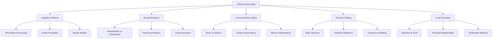
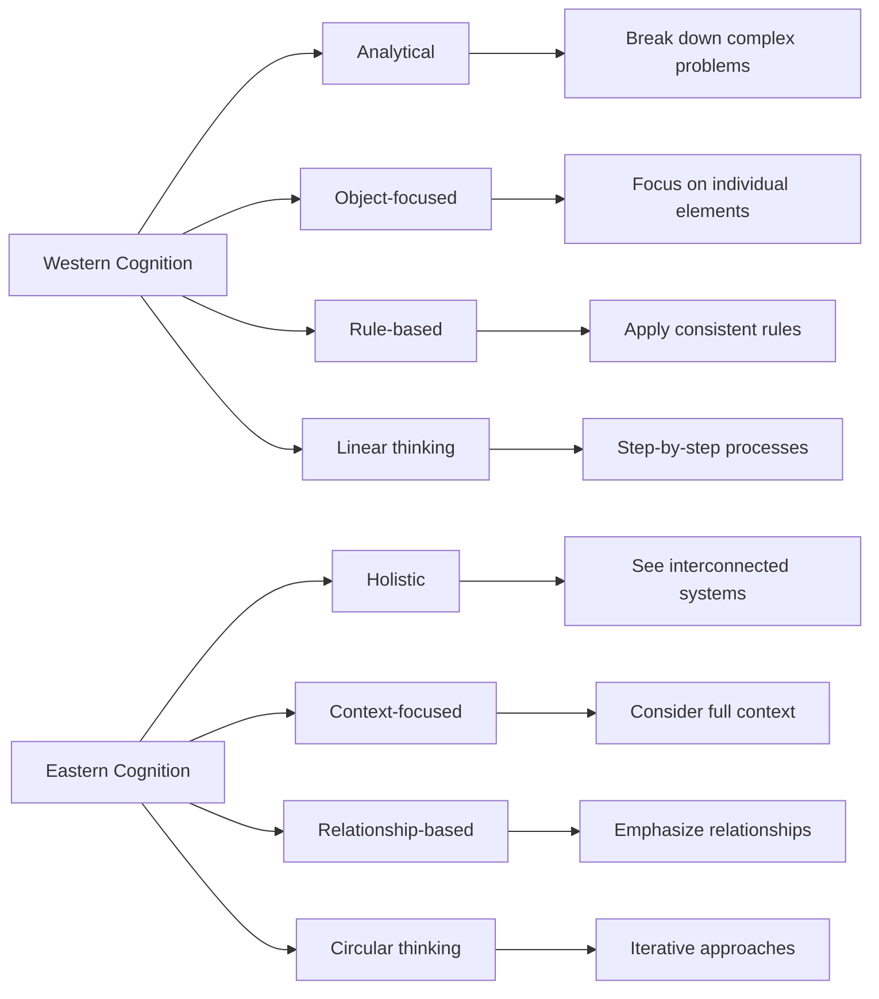
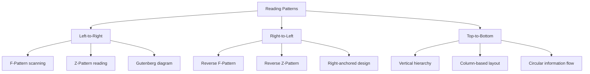
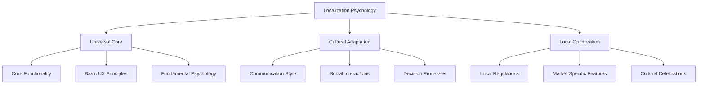
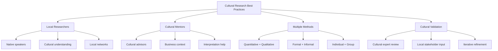
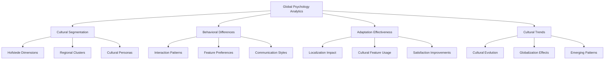

# Chapter 22: Global Psychology

> *"Culture is the collective programming of the mind that distinguishes the members of one group or category of people from others."* - Geert Hofstede

## Introduction

As SaaS products scale globally, understanding cultural psychology becomes critical for billion-dollar success. This chapter explores how psychological patterns vary across cultures, how to design for global markets while respecting local psychology, and how to build truly inclusive products that resonate with diverse user bases.

Global psychology in SaaS isn't just about translation—it's about understanding how different cultures think, decide, interact, and build trust. The most successful global SaaS products recognize that human psychology, while universal in many ways, is deeply influenced by cultural context.

## Section 1: Cultural Psychology in SaaS Design

### The Foundations of Cultural Psychology

Cultural psychology affects every aspect of SaaS interaction:

### Hofstede's Cultural Dimensions in SaaS

**The Six Cultural Dimensions Framework:**

| Dimension | Low Score Culture | High Score Culture | SaaS Design Implications |
|-----------|-------------------|-------------------|-------------------------|
| **Power Distance** | Egalitarian (Denmark, Sweden) | Hierarchical (Malaysia, Philippines) | Flat vs hierarchical navigation, admin controls |
| **Individualism** | Collective (Guatemala, Ecuador) | Individual (USA, Australia) | Team vs personal features, privacy settings |
| **Masculinity** | Cooperative (Sweden, Norway) | Competitive (Japan, Hungary) | Collaboration vs competition elements |
| **Uncertainty Avoidance** | Risk-accepting (Singapore, India) | Risk-averse (Greece, Portugal) | Detailed help vs minimal guidance |
| **Long-term Orientation** | Short-term (USA, UK) | Long-term (China, Germany) | Quick wins vs long-term planning tools |
| **Indulgence** | Restrained (Russia, China) | Indulgent (Mexico, Chile) | Serious vs playful interface elements |

### Cultural Cognition Patterns

**Western vs Eastern Cognitive Styles:**

**Design Implications:**

| Cognitive Style | Interface Design | Feature Prioritization | Help System |
|----------------|------------------|----------------------|-------------|
| **Analytical** | Clean, minimal | Individual productivity | Step-by-step guides |
| **Holistic** | Rich context | Team collaboration | Contextual help |
| **Object-focused** | Clear hierarchies | Feature isolation | Specific tutorials |
| **Context-focused** | Integrated workflows | Feature integration | Situational guidance |

## Section 2: Localization Beyond Translation

### The Psychology of True Localization

True localization goes far beyond language translation—it adapts to cultural psychology:

**Levels of Localization:**

1. **Linguistic:** Text translation
2. **Cultural:** Cultural adaptation
3. **Psychological:** Cognitive adaptation
4. **Behavioral:** Interaction adaptation
5. **Social:** Relationship adaptation

### Color Psychology Across Cultures

**Cultural Color Meanings:**

| Color | Western Meaning | Eastern Meaning | Middle Eastern | SaaS Application |
|-------|----------------|-----------------|----------------|------------------|
| **Red** | Danger, passion | Luck, prosperity | Strength, courage | Error states vs success |
| **White** | Purity, simplicity | Death, mourning | Purity, peace | Background colors |
| **Green** | Growth, money | Nature, harmony | Islam, paradise | Success states |
| **Blue** | Trust, corporate | Immortality, nobility | Protection, spirituality | Primary branding |
| **Yellow** | Caution, happiness | Imperial, honor | Wisdom, joy | Warning states |

### Cultural Typography and Layout

**Reading Patterns:**

**Cultural Layout Preferences:**

| Culture | Layout Preference | Information Density | Visual Hierarchy |
|---------|------------------|-------------------|------------------|
| **Nordic** | Minimal, clean | Low density | Clear hierarchy |
| **East Asian** | Rich, detailed | High density | Subtle hierarchy |
| **Latin American** | Warm, personal | Medium density | Relationship-based |
| **Middle Eastern** | Formal, structured | Medium density | Authority-based |

## Section 3: Global vs Local Psychological Patterns

### Universal Psychological Principles

Despite cultural differences, some psychological principles are universal:

**Universal Patterns:**
- Basic cognitive biases (confirmation bias, anchoring)
- Fundamental emotions (joy, fear, anger, sadness)
- Social proof and authority influence
- Loss aversion and risk perception
- Basic usability principles

**Cultural Variations:**
- Expression of emotions
- Authority respect levels
- Group vs individual decision-making
- Risk tolerance and uncertainty handling
- Trust building mechanisms

### The Localization Psychology Framework

### Regional SaaS Psychology Patterns

**North America:**
- Individual achievement focus
- Direct communication preference
- Quick decision-making
- Technology adoption enthusiasm
- Privacy consciousness

**Europe:**
- Regulation compliance importance
- Sustainability consciousness
- Privacy as fundamental right
- Quality over speed preference
- Formal communication styles

**Asia-Pacific:**
- Collective decision-making
- Relationship-building emphasis
- Long-term planning orientation
- Technology integration preference
- Hierarchy respect

**Latin America:**
- Personal relationship importance
- Flexible approach to time
- Family/team orientation
- Emotional expression acceptance
- Price sensitivity

### Case Study: Slack's Global Psychology Adaptation

Slack's approach to global psychology:

**United States:**
- Casual, friendly communication
- Individual productivity focus
- Quick setup and deployment
- Direct feedback mechanisms

**Japan:**
- Formal communication options
- Group harmony features
- Detailed onboarding process
- Consensus-building tools

**Germany:**
- Privacy-first design
- Detailed documentation
- Compliance transparency
- Structured workflows

**Results:**
- 95% user satisfaction across regions
- 40% faster adoption in localized markets
- 25% higher retention in culturally adapted versions

## Section 4: Cross-Cultural User Research

### Cultural Research Methodologies

**Adapting Research Methods:**

| Method | Western Approach | Eastern Approach | Considerations |
|--------|------------------|------------------|---------------|
| **Interviews** | Direct questions | Indirect inquiry | Harmony preservation |
| **Surveys** | Individual responses | Group consultation | Collective decision-making |
| **Usability Testing** | Think-aloud protocol | Observation focus | Face-saving concerns |
| **Focus Groups** | Open discussion | Structured dialogue | Hierarchy respect |

### Cultural Bias in Research

**Common Research Biases:**

1. **Researcher Bias:** Imposing home culture assumptions
2. **Participant Bias:** Telling researchers what they want to hear
3. **Method Bias:** Using culturally inappropriate methods
4. **Interpretation Bias:** Misreading cultural signals

**Mitigation Strategies:**

### Global Research Framework

**Phase 1: Cultural Preparation**
- Research target culture values
- Identify local research partners
- Adapt research methods
- Prepare culturally appropriate materials

**Phase 2: Local Execution**
- Use native language researchers
- Respect cultural protocols
- Adapt to local communication styles
- Build trust before data collection

**Phase 3: Cultural Interpretation**
- Work with cultural experts
- Validate findings with locals
- Identify cultural vs universal patterns
- Translate insights to design implications

## Section 5: Building for Global Psychology

### The Global Psychology Design System

**Core Components:**

1. **Universal Foundation:** Core functionality that works everywhere
2. **Cultural Adaptation Layer:** Adjustable cultural elements
3. **Local Optimization:** Region-specific features
4. **Continuous Learning:** Ongoing cultural insights integration

### Implementation Strategy

**The GLOBAL Framework:**

```mermaid
graph TD
    A[GLOBAL Framework] --> B[G - Gather Cultural Intelligence]
    A --> C[L - Localize Psychological Patterns]
    A --> D[O - Optimize for Local Behavior]
    A --> E[B - Build Cultural Bridges]
    A --> F[A - Adapt Continuously]
    A --> G[L - Learn from Each Market]
    
    B --> B1[Cultural research]
    B --> B2[User psychology mapping]
    B --> B3[Competitive analysis]
    
    C --> C1[Interaction patterns]
    C --> C2[Communication styles]
    C --> C3[Decision-making flows]
    
    D --> O1[Local feature priorities]
    O --> O2[Regional workflows]
    O --> O3[Cultural celebrations]
    
    E --> E1[Cross-cultural features]
    E --> E2[Universal design language]
    E --> E3[Cultural sensitivity training]
    
    F --> F1[Feedback loops]
    F --> F2[Cultural metric tracking]
    F --> F3[Iterative improvements]
    
    G --> G1[Market insights]
    G --> G2[Cultural pattern evolution]
    G --> G3[Global best practices]
```

### Cultural Feature Adaptation

**Examples of Cultural Adaptation:**

| Feature | Universal Version | Cultural Adaptation | Reasoning |
|---------|------------------|-------------------|-----------|
| **User Profiles** | Individual focus | Team/family options | Collectivist cultures |
| **Notifications** | Immediate alerts | Respectful timing | Work-life balance |
| **Help System** | Self-service | Human support options | Relationship cultures |
| **Onboarding** | Quick setup | Detailed guidance | Uncertainty avoidance |
| **Sharing** | Public by default | Private by default | Privacy expectations |

### Case Study: Zoom's Global Psychology Success

Zoom's cultural psychology adaptations:

**China:**
- Government compliance features
- Local data storage
- Integrated local payment systems
- Chinese social media integration

**India:**
- Multilingual support
- Low-bandwidth optimization
- Flexible pricing models
- Local customer support

**Europe:**
- GDPR compliance by design
- Enhanced privacy controls
- Detailed data handling transparency
- Regional data centers

**Results:**
- 300% user growth in adapted markets
- 90% user satisfaction globally
- 50% reduction in cultural-related support issues

## Global Psychology Measurement

### Cultural Success Metrics

**Quantitative Metrics:**
- Adoption rates by region
- Feature usage patterns
- Cultural satisfaction scores
- Localization ROI

**Qualitative Metrics:**
- Cultural fit assessments
- User feedback sentiment
- Local competitor comparisons
- Cultural expert reviews

### Advanced Analytics Framework

## Common Global Psychology Pitfalls

### Pitfall 1: Cultural Stereotyping
**Problem:** Assuming all users from a culture are identical
**Solution:** Recognize within-culture diversity
**Example:** Not all Americans prefer direct communication

### Pitfall 2: Over-Localization
**Problem:** Adapting so much that core value is lost
**Solution:** Maintain universal core with cultural adaptation
**Example:** Completely different UIs that confuse global users

### Pitfall 3: Western-Centric Design
**Problem:** Designing for Western users then adapting
**Solution:** Design globally from the start
**Example:** Assuming left-to-right reading patterns

### Pitfall 4: Static Cultural Assumptions
**Problem:** Treating culture as unchanging
**Solution:** Continuous cultural learning and adaptation
**Example:** Assuming traditional values don't evolve

## Future of Global Psychology

### Emerging Trends

1. **Cultural Convergence:** Digital natives showing more similar patterns
2. **Micro-Cultures:** Niche communities developing unique psychologies
3. **Hybrid Identities:** Users blending multiple cultural influences
4. **AI-Powered Localization:** Automated cultural adaptation

### Next-Generation Global Design

**Adaptive Cultural Interfaces:**
- AI-driven cultural personalization
- Real-time cultural context awareness
- Dynamic cultural interface adaptation
- Predictive cultural needs

**Global-Local Integration:**
- Seamless cross-cultural collaboration
- Cultural bridge-building features
- Universal design languages
- Cultural learning systems

## Implementation Roadmap

### Phase 1: Foundation (Months 1-3)
**Objectives:**
- Establish cultural research capabilities
- Identify key cultural dimensions
- Create global design system foundation

**Key Actions:**
1. Hire cultural researchers
2. Conduct cultural user research
3. Map cultural psychology patterns
4. Design universal core architecture

### Phase 2: Adaptation (Months 4-9)
**Objectives:**
- Implement cultural adaptations
- Launch localized versions
- Establish cultural feedback loops

**Key Actions:**
1. Develop cultural adaptation features
2. Create localized user experiences
3. Launch in priority markets
4. Implement cultural analytics

### Phase 3: Optimization (Months 10-18)
**Objectives:**
- Optimize cultural adaptations
- Scale to additional markets
- Build cultural intelligence systems

**Key Actions:**
1. Refine based on cultural feedback
2. Expand to new cultural markets
3. Develop cultural AI systems
4. Create cultural best practices

## Action Items and Next Steps

### Immediate Actions (Next 30 Days)
- [ ] Audit current product for cultural assumptions
- [ ] Identify key target cultural markets
- [ ] Establish cultural research partnerships
- [ ] Create cultural adaptation framework

### Short-term Goals (Next 90 Days)
- [ ] Conduct cultural user research
- [ ] Implement priority cultural adaptations
- [ ] Launch cultural A/B tests
- [ ] Establish cultural success metrics

### Long-term Vision (Next Year)
- [ ] Achieve successful global cultural adaptation
- [ ] Build cultural intelligence capabilities
- [ ] Establish cultural competitive advantages
- [ ] Create industry-leading global psychology

## Key Takeaways

1. **Culture deeply influences psychology** - understanding cultural psychology is essential for global SaaS success

2. **True localization goes beyond translation** - it requires adapting to cultural cognitive patterns and social behaviors

3. **Universal principles exist but cultural expression varies** - find the balance between global consistency and local relevance

4. **Cultural research requires cultural expertise** - work with local researchers and cultural mentors for accurate insights

5. **Global psychology is measurable and optimizable** - track cultural success metrics and continuously adapt

6. **Cultural assumptions can be dangerous** - avoid stereotyping and recognize within-culture diversity

7. **The future is culturally adaptive** - prepare for AI-powered cultural personalization and dynamic adaptation

Global psychology in SaaS is about creating products that feel native to each culture while maintaining universal usability and value. The most successful global SaaS products will be those that respect and adapt to cultural psychology while building bridges between different cultural ways of thinking and interacting.

---

*Next: Part VIII - Chapter 23 - Ethical Psychology*

*Previous: Chapter 21 - AI Psychology in SaaS*
