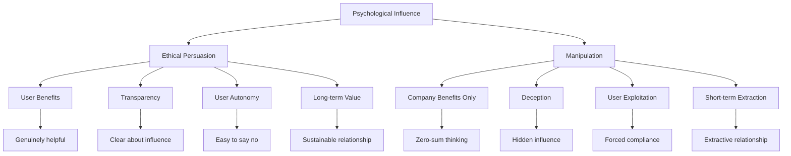
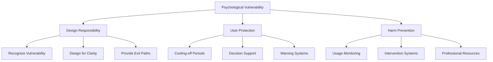
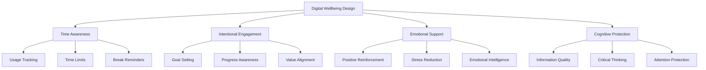
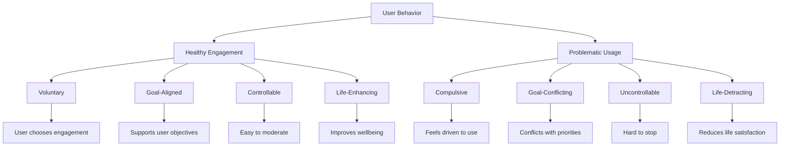
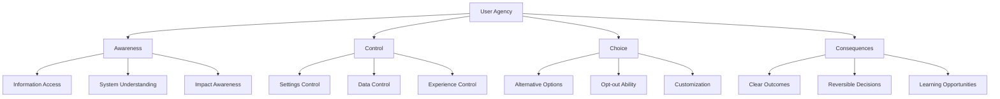
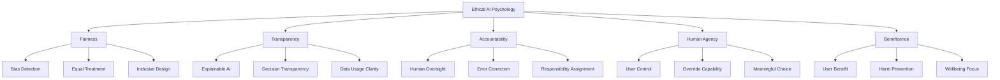
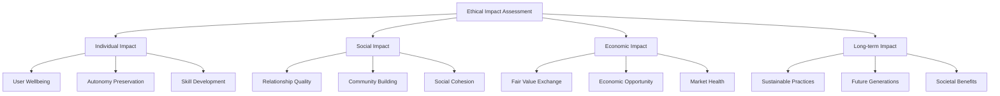

# Chapter 23: Ethical Psychology

> *"With great power comes great responsibility. The psychological techniques that can build billion-dollar SaaS products can also cause tremendous harm if used unethically."* - Digital Ethics Institute

## Introduction

As SaaS products become increasingly sophisticated in their use of psychological principles, the ethical implications become more critical. This chapter explores the difference between ethical persuasion and manipulation, how to design for user wellbeing, and how to build products that enhance rather than exploit human psychology.

The line between persuasion and manipulation is often subtle but always important. Ethical psychology in SaaS means using psychological insights to create genuine value for users while respecting their autonomy, wellbeing, and long-term interests.

## Section 1: Persuasion vs Manipulation

### The Fundamental Distinction

The difference between ethical persuasion and manipulation lies in intent, transparency, and user benefit:

### The Ethical Persuasion Framework

**The RESPECT Framework:**

| Principle | Ethical Approach | Manipulative Approach | SaaS Example |
|-----------|-----------------|----------------------|--------------|
| **R**espect | Honor user autonomy | Override user will | Optional vs mandatory features |
| **E**thical | Serve user interests | Serve only company interests | Helpful notifications vs spam |
| **S**ustainable | Build long-term value | Extract short-term value | Feature education vs feature forcing |
| **P**erspective | Consider user viewpoint | Ignore user experience | User-centric vs company-centric design |
| **E**mpathy | Understand user needs | Exploit user vulnerabilities | Support vs addiction |
| **C**onsent | Informed agreement | Coercive compliance | Clear opt-ins vs hidden defaults |
| **T**ransparency | Clear communication | Deceptive practices | Honest pricing vs hidden fees |

### Psychological Vulnerability and Responsibility

**High-Risk Psychological Vulnerabilities:**

1. **Cognitive Overload:** When users can't properly evaluate decisions
2. **Emotional Distress:** When users are in vulnerable emotional states
3. **Time Pressure:** When users feel rushed to make decisions
4. **Social Pressure:** When users feel compelled by peer pressure
5. **Addiction Susceptibility:** When users have addictive tendencies

**Ethical Responsibilities:**

### Case Study: Headspace's Ethical Approach

Headspace demonstrates ethical psychology through:

**Ethical Persuasion Techniques:**
- **Goal Alignment:** Helps users achieve their wellness goals
- **Gentle Nudges:** Reminds users of their own stated intentions
- **User Control:** Easy to pause, modify, or cancel subscriptions
- **Transparency:** Clear about app usage and mindfulness benefits

**Avoiding Manipulation:**
- **No Guilt-Tripping:** Positive reinforcement instead of shame
- **Realistic Expectations:** Honest about meditation benefits
- **User Agency:** Supports user decisions even if they reduce usage
- **Wellbeing Focus:** Prioritizes user mental health over engagement

**Results:**
- 95% user satisfaction scores
- 4.8/5 app store ratings
- Strong user advocacy and referrals
- Sustainable long-term growth

## Section 2: Digital Wellbeing and Healthy Usage

### The Psychology of Digital Wellbeing

Digital wellbeing encompasses:
- **Intentional Usage:** Users choosing how to spend their time
- **Emotional Regulation:** Technology supporting emotional health
- **Cognitive Freedom:** Maintaining ability to think independently
- **Relationship Health:** Technology enhancing rather than replacing human connections
- **Physical Wellbeing:** Considering impact on sleep, exercise, and health

### Designing for Healthy Usage Patterns

**The Wellbeing Design Framework:**

### Healthy Engagement Metrics

**Traditional Metrics vs Wellbeing Metrics:**

| Traditional Metric | Wellbeing Alternative | Why It Matters |
|-------------------|----------------------|----------------|
| **Time Spent** | **Value Created** | Quality over quantity |
| **Daily Active Users** | **Intentional Users** | Purposeful engagement |
| **Session Length** | **Goal Achievement** | Effectiveness over duration |
| **Click-through Rate** | **Informed Decisions** | Quality decisions |
| **Retention** | **Satisfaction** | Happy users stay longer |

### Implementation: Wellbeing Features

**User Time Awareness:**
- Usage dashboards showing time spent
- Weekly/monthly usage summaries
- Goal-setting for healthy usage
- Break reminders and suggestions

**Intentional Design:**
- Clear value propositions for features
- Easy-to-find settings and controls
- Friction for impulsive actions
- Support for user-defined goals

**Emotional Intelligence:**
- Mood tracking and awareness
- Stress-reduction features
- Positive reinforcement systems
- Crisis intervention resources

### Case Study: Notion's Wellbeing Approach

Notion promotes healthy usage through:

**Time Awareness:**
- Focus mode to reduce distractions
- Clear task completion indicators
- Progress tracking for meaningful work

**Intentional Design:**
- Customizable workspaces for different needs
- Clear information architecture
- Powerful search to find information quickly

**Cognitive Support:**
- Templates to reduce cognitive load
- Collaborative features for shared thinking
- Integration with other tools to reduce app switching

**Results:**
- 83% of users report feeling more organized
- 67% report reduced work stress
- 91% user satisfaction with productivity impact

## Section 3: The Psychology of Addiction vs Engagement

### Understanding the Difference

**Healthy Engagement:**
- Users choose when and how to engage
- Usage aligns with user goals
- Users can easily stop or take breaks
- Engagement enhances life quality
- Users feel in control

**Problematic Usage:**
- Compulsive or uncontrolled usage
- Usage conflicts with user goals
- Difficulty stopping or taking breaks
- Engagement detracts from life quality
- Users feel out of control

### The Addiction Psychology Framework

### Addictive Design Patterns to Avoid

**Variable Ratio Reinforcement:**
- **Problematic:** Unpredictable rewards that create compulsion
- **Ethical Alternative:** Predictable value delivery
- **Example:** Random notifications vs scheduled, valuable updates

**Fear of Missing Out (FOMO):**
- **Problematic:** Creating anxiety about missing opportunities
- **Ethical Alternative:** JOMO (Joy of Missing Out) - helping users focus
- **Example:** "Limited time" pressure vs "Available when you need it"

**Social Approval Addiction:**
- **Problematic:** Designing for validation-seeking behavior
- **Ethical Alternative:** Intrinsic motivation support
- **Example:** Like counts vs personal progress tracking

**Infinite Scroll:**
- **Problematic:** Endless content consumption without natural stopping points
- **Ethical Alternative:** Chunked content with clear endpoints
- **Example:** Pagination vs infinite feeds

### Designing Against Addiction

**The MINDFUL Framework:**

| Principle | Implementation | Example |
|-----------|---------------|---------|
| **M**indful Defaults | Default to healthy usage patterns | Notifications off by default |
| **I**ntentional Friction | Add friction to impulsive actions | Confirm before major actions |
| **N**atural Breaks | Design clear stopping points | Chapter/section boundaries |
| **D**ata Transparency | Show usage patterns clearly | Time spent dashboards |
| **F**lexible Control | Give users control over their experience | Granular notification settings |
| **U**ser Goals | Align with user's stated objectives | Goal-setting features |
| **L**ife Integration | Support healthy life balance | Do not disturb modes |

## Section 4: Transparency and User Agency

### The Psychology of Transparency

Transparency builds trust and enables informed decision-making:

**Levels of Transparency:**

1. **Functional Transparency:** What the system does
2. **Algorithmic Transparency:** How the system makes decisions
3. **Data Transparency:** What data is collected and used
4. **Commercial Transparency:** How the business model works
5. **Psychological Transparency:** How the system influences behavior

### User Agency Framework

### Implementing Transparent Design

**Data Collection Transparency:**
- Clear privacy policies in plain language
- Just-in-time consent for data collection
- Easy access to personal data
- Simple data deletion processes

**Algorithmic Transparency:**
- Explain how recommendations are made
- Show confidence levels in AI decisions
- Provide alternative suggestions
- Allow users to influence algorithms

**Psychological Transparency:**
- Acknowledge persuasive techniques
- Explain why certain design choices were made
- Provide information about psychological effects
- Offer ways to reduce or modify influence

### Case Study: Buffer's Radical Transparency

Buffer demonstrates transparency through:

**Business Transparency:**
- Public revenue dashboard
- Open salary formula
- Transparent pricing model
- Clear terms of service

**Product Transparency:**
- Explain algorithm changes
- Show post scheduling logic
- Clear analytics explanations
- Open about feature limitations

**Psychological Transparency:**
- Honest about engagement tactics
- Clear about business motivations
- Open about user behavior influence
- Transparent about feature psychology

**Results:**
- 4.5/5 trust scores from users
- 40% higher customer lifetime value
- Strong brand advocacy
- Industry leadership in ethical practices

## Section 5: Building Ethical AI Psychology

### AI Ethics in SaaS Psychology

AI amplifies both the benefits and risks of psychological influence:

**Benefits:**
- Personalized experiences that truly serve users
- Predictive assistance that saves time and effort
- Intelligent interfaces that reduce cognitive load
- Emotional support through AI companions

**Risks:**
- Manipulation through micro-targeting
- Addiction through personalized triggers
- Bias amplification in decision-making
- Loss of human agency to AI systems

### Ethical AI Psychology Framework

### Implementing Ethical AI Psychology

**Bias Prevention:**
- Diverse training data
- Regular bias audits
- Fairness metrics tracking
- Inclusive design teams

**Transparency Requirements:**
- Explain AI decision-making
- Show confidence levels
- Provide alternative options
- Allow user feedback

**User Control:**
- Easy AI opt-out options
- Granular control settings
- Human override capabilities
- Regular consent renewal

**Harm Prevention:**
- Monitor for negative impacts
- Implement safety guardrails
- Provide user support resources
- Regular ethical reviews

### Case Study: Spotify's Ethical AI Approach

Spotify's ethical AI psychology:

**Fairness:**
- Diverse recommendation algorithms
- Support for emerging artists
- Bias detection in music suggestions
- Inclusive playlist creation

**Transparency:**
- Explain "Discover Weekly" creation
- Show listening pattern insights
- Clear data usage policies
- Open about recommendation logic

**User Control:**
- Customizable recommendation settings
- Easy playlist modification
- Genre and mood controls
- Privacy-focused listening modes

**Results:**
- 92% user satisfaction with recommendations
- 15% increase in music discovery
- Strong artist and label partnerships
- Industry leadership in ethical AI

## Ethical Psychology Measurement

### Ethical Success Metrics

**Quantitative Metrics:**
- User wellbeing scores
- Healthy usage patterns
- Informed consent rates
- Ethical feature adoption

**Qualitative Metrics:**
- User trust assessments
- Ethical feedback analysis
- Long-term relationship quality
- Brand reputation measures

### The Ethical Impact Framework

## Common Ethical Pitfalls

### Pitfall 1: "Just Business" Mindset
**Problem:** Separating business success from ethical responsibility
**Solution:** Integrate ethics into business strategy
**Example:** Make ethical metrics part of team OKRs

### Pitfall 2: Informed Consent Theater
**Problem:** Long, complex consent forms that users don't read
**Solution:** Just-in-time, contextual consent with clear explanations
**Example:** Explain data usage when the feature is first used

### Pitfall 3: Addiction Denial
**Problem:** Claiming "engagement" when users show addiction patterns
**Solution:** Monitor for problematic usage and provide support
**Example:** Usage warnings and break suggestions

### Pitfall 4: Algorithmic Washing
**Problem:** Hiding human bias behind "objective" algorithms
**Solution:** Regular bias audits and transparent decision-making
**Example:** Show how AI recommendations are influenced by human curation

## Building an Ethical Culture

### Organizational Ethics Framework

**Leadership Commitment:**
- Ethics in company mission and values
- Ethical decision-making processes
- Regular ethical training and discussion
- Ethics officer or committee

**Team Integration:**
- Ethics training for all team members
- Ethical review processes
- User advocacy roles
- Regular ethical discussions

**User Involvement:**
- User feedback on ethical issues
- Ethical advisory boards
- Transparent communication about challenges
- Co-creation of ethical guidelines

### Implementation Roadmap

**Phase 1: Foundation (Months 1-3)**
- Establish ethical principles
- Conduct ethical audit of current product
- Implement basic transparency features
- Train team on ethical psychology

**Phase 2: Integration (Months 4-9)**
- Integrate ethics into design process
- Implement wellbeing features
- Launch ethical AI practices
- Establish ethical measurement systems

**Phase 3: Leadership (Months 10-18)**
- Achieve industry-leading ethical practices
- Share ethical insights with community
- Influence industry standards
- Build ethical competitive advantages

## Action Items and Next Steps

### Immediate Actions (Next 30 Days)
- [ ] Conduct ethical audit of current psychological techniques
- [ ] Establish ethical design principles
- [ ] Implement basic transparency features
- [ ] Create user wellbeing metrics

### Short-term Goals (Next 90 Days)
- [ ] Launch wellbeing dashboard for users
- [ ] Implement ethical AI guidelines
- [ ] Establish ethical review processes
- [ ] Train team on ethical psychology

### Long-term Vision (Next Year)
- [ ] Achieve industry-leading ethical practices
- [ ] Build sustainable ethical competitive advantages
- [ ] Influence industry ethical standards
- [ ] Create positive societal impact

## Key Takeaways

1. **Ethics is not optional** - in the age of psychological sophistication, ethical responsibility is crucial for long-term success

2. **Persuasion and manipulation are fundamentally different** - the difference lies in intent, transparency, and user benefit

3. **Digital wellbeing should be designed in, not added on** - healthy usage patterns must be core to product design

4. **Addiction and engagement are not the same** - sustainable success comes from healthy, voluntary engagement

5. **Transparency builds trust and enables agency** - users make better decisions when they understand the system

6. **AI amplifies both benefits and risks** - ethical AI requires careful design, oversight, and user control

7. **Ethical practices create competitive advantages** - users increasingly prefer ethical products and companies

Ethical psychology in SaaS is about using psychological insights to create genuine value while respecting user autonomy and wellbeing. The most successful SaaS products will be those that prove ethical practices and business success are not just compatible, but mutually reinforcing.

---

*Next: Chapter 24 - Psychological Harm Prevention*

*Previous: Chapter 22 - Global Psychology*
