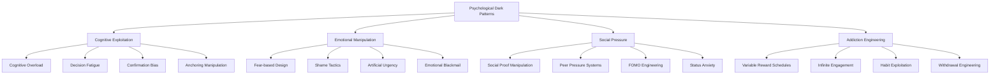
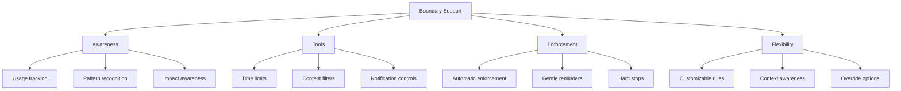
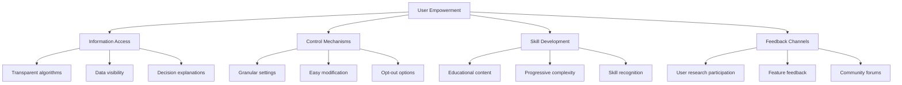
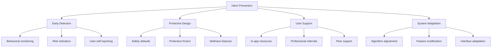

# Chapter 24: Psychological Harm Prevention

> *"First, do no harm. This ancient medical principle should guide every decision in designing psychologically-influenced technology."* - Center for Humane Technology

## Introduction

As SaaS products become more psychologically sophisticated, the potential for causing psychological harm increases significantly. This chapter focuses on identifying, preventing, and mitigating psychological harm in SaaS design, creating systems that actively protect user wellbeing, and building products that enhance rather than damage human psychology.

Psychological harm prevention isn't just about avoiding obvious dark patterns—it's about understanding the subtle ways technology can impact mental health, relationships, and human development, then designing systems that actively promote psychological flourishing.

## Section 1: Recognizing Psychological Dark Patterns

### The Taxonomy of Psychological Dark Patterns

Dark patterns are design choices made intentionally to manipulate or deceive users. In the psychological realm, these become particularly harmful because they exploit fundamental human cognitive and emotional processes.

### Cognitive Exploitation Patterns

**Pattern 1: Deliberate Confusion**
- **Mechanism:** Overloading users with complex choices or information
- **Psychological Impact:** Decision paralysis, cognitive exhaustion
- **Example:** Overly complex pricing pages with hidden fees
- **Harm:** Users make poor financial decisions due to confusion

**Pattern 2: Choice Architecture Manipulation**
- **Mechanism:** Structuring choices to favor company interests
- **Psychological Impact:** Compromised decision-making autonomy
- **Example:** Making cancellation extremely difficult while signup is easy
- **Harm:** Users trapped in services they no longer want

**Pattern 3: Cognitive Bias Exploitation**
- **Mechanism:** Deliberately triggering cognitive biases for profit
- **Psychological Impact:** Systematic decision-making errors
- **Example:** False scarcity creating urgency bias
- **Harm:** Users make decisions they later regret

### Emotional Manipulation Patterns

**Pattern 1: Fear-Based Engagement**
- **Mechanism:** Creating anxiety to drive usage
- **Psychological Impact:** Chronic stress and anxiety
- **Example:** Security apps that overstate threats
- **Harm:** Increased anxiety and fear in daily life

**Pattern 2: Shame and Guilt Mechanics**
- **Mechanism:** Making users feel bad about their behavior
- **Psychological Impact:** Reduced self-esteem and wellbeing
- **Example:** Fitness apps that shame users for missing workouts
- **Harm:** Negative self-perception and motivation damage

**Pattern 3: Artificial Emotional Highs**
- **Mechanism:** Creating unsustainable positive emotions
- **Psychological Impact:** Emotional dependency and mood swings
- **Example:** Gamification systems that create addiction-like highs
- **Harm:** Users become dependent on app for emotional regulation

### Social Pressure Patterns

**The Social Manipulation Matrix:**

| Pattern | Mechanism | Psychological Impact | Long-term Harm |
|---------|-----------|---------------------|----------------|
| **Fake Social Proof** | Inflated usage numbers | False consensus pressure | Distrust in social information |
| **Comparison Anxiety** | Highlighting others' success | Social comparison stress | Reduced self-worth |
| **Isolation Threats** | Fear of social exclusion | Compliance through fear | Damaged authentic relationships |
| **Validation Addiction** | Likes, hearts, reactions | External validation dependency | Reduced intrinsic motivation |

### Case Study: Recognizing Dark Patterns in Practice

**Company X's Dark Pattern Audit:**

**Discovered Issues:**
1. **Roach Motel:** Easy signup, nearly impossible cancellation
2. **Fear Mongering:** Exaggerated security threats to drive upgrades
3. **Social Shaming:** Public display of "inactive" users
4. **Bait and Switch:** Free trial with hidden automatic charges

**Psychological Impact Assessment:**
- 67% of users reported feeling "tricked" by the service
- 45% experienced anxiety about cancellation process
- 23% continued paying for unwanted service due to cancellation difficulty
- 89% would not recommend to friends due to trust issues

**Business Impact:**
- High churn rate (78% within 6 months)
- Poor word-of-mouth marketing
- Increased customer service costs
- Legal compliance issues

## Section 2: Designing for Digital Wellness

### The Digital Wellness Framework

Digital wellness encompasses physical, mental, emotional, and social health in the digital environment:

```mermaid
graph TD
    A[Digital Wellness] --> B[Physical Health]
    A --> C[Mental Health]
    A --> D[Emotional Health]
    A --> E[Social Health]
    
    B --> B1[Eye strain prevention]
    B --> B2[Posture support]
    B --> B3[Sleep protection]
    B --> B4[Movement encouragement]
    
    C --> C1[Cognitive load management]
    C --> C2[Focus protection]
    C --> C3[Information quality]
    C --> C4[Decision support]
    
    D --> D1[Mood regulation]
    D --> D2[Stress reduction]
    D --> D3[Positive reinforcement]
    D --> D4[Emotional intelligence]
    
    E --> E1[Relationship quality]
    E --> E2[Community building]
    E --> E3[Social skill development]
    E --> E4[Real-world connections]
```

### Physical Wellness Design

**Vision Health:**
- Dark mode options for low-light usage
- Adjustable text sizes and contrast
- Blue light filtering options
- Regular break reminders

**Posture and Movement:**
- Standing desk reminders
- Movement break suggestions
- Ergonomic usage tips
- Activity integration features

**Sleep Protection:**
- Automatic "do not disturb" modes
- Blue light reduction in evening
- Sleep schedule awareness
- Wind-down features

### Mental Wellness Design

**Cognitive Load Management:**

| High Cognitive Load | Low Cognitive Load | Design Strategy |
|-------------------|-------------------|-----------------|
| Complex navigation | Intuitive pathways | Progressive disclosure |
| Information overload | Curated content | Smart filtering |
| Decision fatigue | Smart defaults | Guided choices |
| Multitasking pressure | Single-task focus | Task sequencing |

**Focus Protection Strategies:**
- Distraction-free modes
- Notification grouping and timing
- Deep work session support
- Attention restoration features

**Information Quality Control:**
- Source credibility indicators
- Fact-checking integration
- Bias awareness notifications
- Diverse perspective recommendations

### Emotional Wellness Design

**Mood-Aware Interfaces:**
- Emotional state detection (with consent)
- Mood-appropriate content and interactions
- Emotional regulation support tools
- Positive psychology integration

**Stress Reduction Features:**
- Breathing exercise integration
- Mindfulness moments
- Calming visual and audio elements
- Stress level monitoring

**Positive Reinforcement Systems:**
- Achievement recognition
- Progress celebration
- Strength-based feedback
- Growth mindset messaging

### Case Study: Headspace's Digital Wellness Approach

Headspace implements comprehensive digital wellness:

**Physical Wellness:**
- Built-in break reminders
- Posture awareness exercises
- Sleep story features
- Movement meditation options

**Mental Wellness:**
- Single-session focus modes
- Mindfulness-based stress reduction
- Cognitive behavioral therapy elements
- Attention training exercises

**Emotional Wellness:**
- Mood tracking with insights
- Emotion regulation techniques
- Positive psychology practices
- Gratitude and appreciation features

**Social Wellness:**
- Group meditation sessions
- Buddy system support
- Community sharing (optional)
- Family meditation programs

**Results:**
- 87% report improved mental wellbeing
- 23% reduction in reported stress levels
- 45% improvement in sleep quality
- 91% user satisfaction with wellness features

## Section 3: The Psychology of Healthy Boundaries

### Understanding Digital Boundaries

Digital boundaries are psychological and behavioral limits that protect users from harmful technology interactions:

**Types of Digital Boundaries:**

1. **Temporal:** When and how long to use technology
2. **Spatial:** Where technology use is appropriate
3. **Emotional:** What emotional states warrant technology use
4. **Social:** How technology affects relationships
5. **Cognitive:** Mental resources allocated to technology

### The Boundary Support Framework

### Implementing Boundary Support

**Time Boundary Support:**
- Usage time tracking and visualization
- Daily/weekly time limit setting
- Gradual reduction programs
- Time-well-spent metrics

**Attention Boundary Support:**
- Notification scheduling and batching
- Focus mode activation
- Distraction blocking
- Deep work protection

**Emotional Boundary Support:**
- Mood-based usage recommendations
- Emotional check-ins before use
- Stress-aware interface adaptations
- Crisis intervention resources

**Social Boundary Support:**
- Relationship impact awareness
- Real-world activity encouragement
- Social media break tools
- Face-to-face interaction promotion

### Case Study: Apple's Screen Time as Boundary Support

Apple's Screen Time demonstrates comprehensive boundary support:

**Awareness Features:**
- Detailed usage reports
- App category breakdowns
- Pick-up frequency tracking
- Most-used app identification

**Control Tools:**
- App-specific time limits
- Downtime scheduling
- Content and privacy restrictions
- Website blocking capabilities

**Family Support:**
- Parent-child usage agreements
- Age-appropriate content controls
- Screen time allowances
- Educational content prioritization

**Results:**
- 60% of users report increased awareness of usage
- 35% successfully reduced problematic app usage
- 78% found family features helpful
- Sparked industry-wide adoption of similar features

## Section 4: User Empowerment and Control

### The Psychology of Empowerment

User empowerment in digital products involves:
- **Agency:** Users feel they have choice and control
- **Competence:** Users feel capable of using the system effectively
- **Understanding:** Users comprehend how the system works
- **Voice:** Users can provide feedback and influence the system

### The Empowerment Framework

### Implementing User Empowerment

**Information Transparency:**
- Clear privacy policies in plain language
- Algorithm explanation interfaces
- Data usage dashboards
- Decision-making process visibility

**Control Granularity:**
- Fine-grained privacy controls
- Customizable interface elements
- Flexible notification settings
- Personal data management tools

**Skill Building:**
- Progressive feature introduction
- Educational tooltips and tutorials
- Best practice recommendations
- Advanced user pathways

**Voice and Influence:**
- User feedback integration
- Feature request systems
- Beta testing programs
- Community governance participation

### Case Study: Mozilla Firefox's User Empowerment

Firefox demonstrates comprehensive user empowerment:

**Information Access:**
- Transparent data collection practices
- Open-source code availability
- Regular transparency reports
- Clear privacy policy explanations

**Control Mechanisms:**
- Extensive privacy settings
- Add-on ecosystem support
- Search engine selection
- Tracking protection options

**Skill Development:**
- Security education resources
- Privacy awareness campaigns
- Web literacy programs
- Developer tool accessibility

**User Voice:**
- Community feedback forums
- Feature suggestion systems
- User research participation
- Open governance model

**Results:**
- 94% user trust ratings
- Strong user advocacy community
- Industry leadership in privacy features
- Positive influence on web standards

## Section 5: Long-term Psychological Impact

### Understanding Cumulative Effects

The psychological impact of SaaS products extends far beyond individual interactions:

**Individual Level:**
- Cognitive pattern changes
- Emotional regulation shifts
- Behavioral habit formation
- Identity and self-concept evolution

**Social Level:**
- Relationship dynamic changes
- Communication pattern shifts
- Social norm evolution
- Community structure impacts

**Societal Level:**
- Cultural value shifts
- Democratic participation changes
- Economic behavior patterns
- Educational system impacts

### The Long-term Impact Assessment Framework

```mermaid
graph TD
    A[Long-term Psychological Impact] --> B[Cognitive Development]
    A --> C[Emotional Growth]
    A --> D[Social Skills]
    A --> E[Identity Formation]
    
    B --> B1[Attention span changes]
    B --> B2[Critical thinking skills]
    B --> B3[Information processing]
    B --> B4[Decision-making capacity]
    
    C --> C1[Emotional regulation]
    C --> C2[Empathy development]
    C --> C3[Stress management]
    C --> C4[Resilience building]
    
    D --> D1[Communication skills]
    D --> D2[Relationship building]
    D --> D3[Conflict resolution]
    D --> D4[Collaboration abilities]
    
    E --> E1[Self-concept formation]
    E --> E2[Value development]
    E --> E3[Goal setting]
    E --> E4[Life satisfaction]
```

### Measuring Long-term Impact

**Longitudinal Assessment Methods:**
- Multi-year user studies
- Behavioral pattern tracking
- Psychological wellbeing surveys
- Life outcome correlations

**Key Metrics for Long-term Health:**

| Domain | Positive Indicators | Negative Indicators | Measurement Method |
|--------|-------------------|-------------------|------------------|
| **Cognitive** | Improved focus, critical thinking | Attention fragmentation | Cognitive assessments |
| **Emotional** | Better regulation, resilience | Increased anxiety, mood swings | Mental health surveys |
| **Social** | Stronger relationships | Social isolation | Relationship quality scales |
| **Behavioral** | Healthy habits, self-control | Compulsive usage, addiction | Behavioral tracking |
| **Life Satisfaction** | Purpose, achievement | Dissatisfaction, regret | Life satisfaction surveys |

### Positive Long-term Impact Design

**Cognitive Enhancement:**
- Critical thinking skill development
- Information literacy improvement
- Problem-solving capacity building
- Creative thinking encouragement

**Emotional Intelligence:**
- Self-awareness development
- Empathy skill building
- Emotional regulation training
- Stress management techniques

**Social Development:**
- Communication skill enhancement
- Collaboration tool provision
- Conflict resolution support
- Community building facilitation

**Life Skills:**
- Goal setting and achievement
- Time management improvement
- Financial literacy development
- Health and wellness promotion

### Case Study: Duolingo's Long-term Impact Focus

Duolingo designs for positive long-term psychological impact:

**Cognitive Development:**
- Language learning enhances cognitive flexibility
- Pattern recognition skill development
- Memory improvement techniques
- Multicultural thinking promotion

**Emotional Growth:**
- Achievement celebration systems
- Mistake normalization and learning
- Cultural empathy development
- Confidence building through progress

**Social Benefits:**
- Cultural connection opportunities
- Communication skill expansion
- Global community participation
- Cross-cultural understanding

**Life Enhancement:**
- Career opportunity expansion
- Travel and cultural engagement
- Personal growth satisfaction
- Lifelong learning habit formation

**Long-term Results:**
- 73% report increased cognitive confidence
- 68% maintain language learning habits after 2 years
- 81% report cultural awareness improvements
- 59% pursue additional learning opportunities

## Harm Prevention Implementation

### The Harm Prevention Lifecycle

**1. Risk Assessment Phase:**
- Identify potential psychological risks
- Assess user vulnerability factors
- Evaluate cumulative impact potential
- Consider long-term consequences

**2. Prevention Design Phase:**
- Implement protective design patterns
- Build user empowerment features
- Create healthy usage tools
- Develop crisis intervention systems

**3. Monitoring Phase:**
- Track user wellbeing indicators
- Monitor for harmful usage patterns
- Assess feature impact on mental health
- Collect user feedback on psychological effects

**4. Intervention Phase:**
- Provide support resources
- Implement automatic protection systems
- Connect users with professional help
- Adjust product features to reduce harm

**5. Continuous Improvement Phase:**
- Learn from harm prevention efforts
- Update protection systems
- Enhance user support
- Share learnings with industry

### Harm Prevention Framework

## Building a Harm Prevention Culture

### Organizational Structure

**Dedicated Roles:**
- Digital Wellness Officer
- User Psychology Researcher
- Ethical Design Advocate
- Crisis Intervention Specialist

**Cross-functional Integration:**
- Psychology expertise in design teams
- Wellbeing metrics in product decisions
- Ethical review in feature development
- User advocacy in business strategy

**External Partnerships:**
- Mental health professionals
- Academic researchers
- Digital wellness organizations
- Crisis intervention services

### Training and Education

**Team Training Topics:**
- Psychological harm recognition
- Ethical design principles
- Crisis intervention basics
- Long-term impact assessment

**Ongoing Education:**
- Regular harm prevention workshops
- Case study analysis sessions
- User psychology research updates
- Industry best practice sharing

## Measurement and Accountability

### Harm Prevention Metrics

**Leading Indicators:**
- Protective feature usage rates
- User wellbeing assessment scores
- Healthy usage pattern adoption
- Crisis intervention system usage

**Lagging Indicators:**
- Long-term user satisfaction
- Mental health outcome correlations
- User advocacy and referrals
- Reduced harmful usage patterns

### Accountability Systems

**Internal Accountability:**
- Regular harm prevention audits
- User psychology impact assessments
- Ethical design review processes
- Wellbeing-focused OKRs

**External Accountability:**
- Transparency reports on user wellbeing
- Third-party psychological impact audits
- Industry standard participation
- Academic research collaboration

## Action Items and Next Steps

### Immediate Actions (Next 30 Days)
- [ ] Conduct psychological dark pattern audit
- [ ] Implement basic digital wellness features
- [ ] Create harm prevention assessment framework
- [ ] Establish user wellbeing metrics

### Short-term Goals (Next 90 Days)
- [ ] Launch comprehensive boundary support tools
- [ ] Implement user empowerment features
- [ ] Create crisis intervention systems
- [ ] Establish harm prevention monitoring

### Long-term Vision (Next Year)
- [ ] Achieve industry-leading harm prevention
- [ ] Demonstrate positive long-term psychological impact
- [ ] Build sustainable wellbeing-focused product culture
- [ ] Influence industry standards for psychological safety

## Key Takeaways

1. **Psychological harm is real and measurable** - SaaS products can cause significant psychological damage if not carefully designed

2. **Dark patterns exploit fundamental human psychology** - recognizing and avoiding these patterns is essential for ethical design

3. **Digital wellness must be designed in, not added on** - comprehensive wellness features require intentional design from the start

4. **Healthy boundaries empower users** - supporting user boundary-setting is crucial for long-term wellbeing

5. **User empowerment prevents harm** - giving users control, understanding, and voice reduces psychological risk

6. **Long-term impact matters more than short-term engagement** - sustainable success requires focus on user life outcomes

7. **Harm prevention requires systematic approach** - effective prevention needs organizational commitment, proper systems, and ongoing vigilance

Psychological harm prevention in SaaS is about creating products that actively promote human flourishing rather than simply avoiding obvious harm. The most successful and ethical SaaS products will be those that prove technology can enhance rather than diminish human psychological wellbeing.

---

*Next: Part IX - Chapter 25 - Psychological Competitive Advantages*

*Previous: Chapter 23 - Ethical Psychology*
