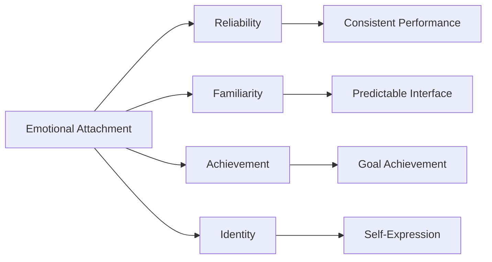
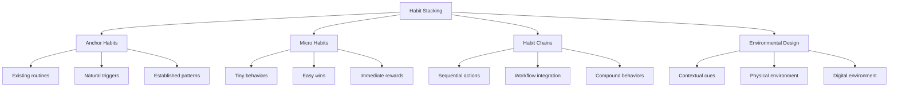
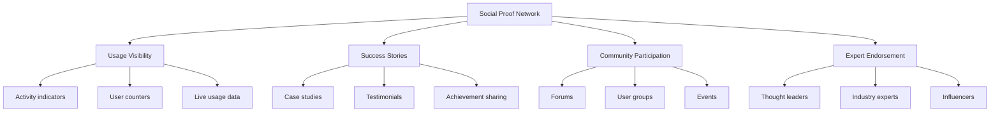
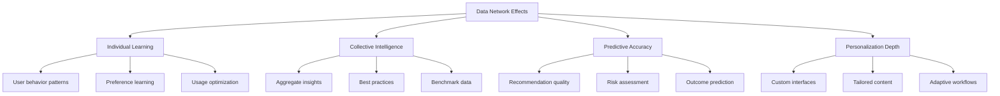
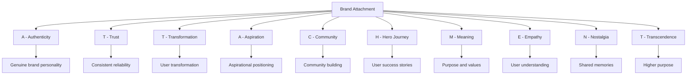
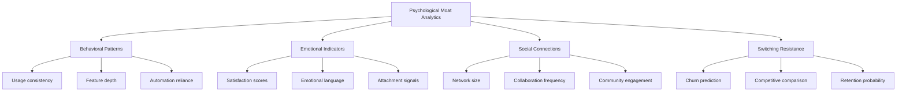

# Chapter 25: Psychological Competitive Advantages

> *"The best business moats are built in the mind. When you own the psychology, you own the market."* - Behavioral Economics Institute

## Introduction

In the hyper-competitive SaaS landscape, traditional competitive advantages—features, pricing, or technology—can be quickly replicated. However, psychological competitive advantages are much harder to copy because they're built into the fundamental experience of using your product. This chapter explores how to create lasting competitive advantages through psychological design that becomes embedded in user behavior, habits, and mental models.

Psychological competitive advantages work because they change how users think, feel, and behave. Once established, they create switching costs that go far beyond financial considerations—they become part of the user's identity and workflow in ways that competitors cannot easily replicate.

## Section 1: Creating Switching Cost Psychology

### The Psychology of Switching Costs

Traditional switching costs are economic—time, money, or effort required to change providers. Psychological switching costs are deeper:

```mermaid
graph TD
    A[Switching Cost Psychology] --> B[Cognitive Costs]
    A --> C[Emotional Costs]
    A --> D[Social Costs]
    A --> E[Identity Costs]
    
    B --> B1[Mental Model Disruption]
    B --> B2[Learning Curve Anxiety]
    B --> B3[Cognitive Load of Change]
    B --> B4[Decision Fatigue]
    
    C --> C1[Loss Aversion]
    C --> C2[Sunk Cost Fallacy]
    C --> C3[Comfort Zone Disruption]
    C --> C4[Change Anxiety]
    
    D --> D1[Network Effects]
    D --> D2[Social Status Loss]
    D --> D3[Peer Pressure]
    D --> D4[Professional Reputation]
    
    E --> E1[Self-Concept Integration]
    E --> E2[Personal Brand Association]
    E --> E3[Skill Identity]
    E --> E4[Value Alignment]
```

### Types of Psychological Switching Costs

**1. Cognitive Switching Costs**

| Type | Description | Example | Psychological Principle |
|------|-------------|---------|----------------------|
| **Mental Model Lock-in** | Users develop specific ways of thinking about tasks | Photoshop's layer paradigm | Cognitive schemas |
| **Workflow Integration** | Product becomes embedded in thinking patterns | Excel formulas as problem-solving language | Procedural memory |
| **Expertise Investment** | Users develop specialized knowledge | Salesforce admin skills | Sunk cost + expertise pride |
| **Shortcut Dependency** | Users rely on specific interface patterns | Keyboard shortcuts and muscle memory | Automaticity |

**2. Emotional Switching Costs**

**Attachment Theory in SaaS:**
- **Secure Attachment:** Users feel safe and supported by the product
- **Anxious Attachment:** Fear of losing functionality creates dependency
- **Avoidant Attachment:** Users resist learning new systems
- **Disorganized Attachment:** Chaotic relationship with multiple tools

**Building Emotional Attachment:**

**3. Social Switching Costs**

**Network Effects Psychology:**
- **Direct Network Effects:** More users = more value
- **Indirect Network Effects:** Ecosystem participation
- **Data Network Effects:** Collective intelligence
- **Social Network Effects:** Status and belonging

**Case Study: Slack's Social Switching Costs**

Slack creates multiple layers of social switching costs:

**Professional Identity Integration:**
- Users become "Slack power users"
- Slack skills become resume items
- Professional communication style adapts to Slack norms

**Team Dynamics:**
- Shared channels create community
- Custom emoji and culture development
- Institutional knowledge embedded in threads

**Network Value:**
- Integrations with other tools
- Workflow automation specific to Slack
- Cross-team collaboration patterns

**Results:**
- 43% annual revenue retention rate
- $20,000+ average customer lifetime value
- 10x cost to switch to competitors

### Implementing Switching Cost Psychology

**The LOCK-IN Framework:**

```mermaid
graph TD
    A[LOCK-IN Framework] --> B[L - Learn User Patterns]
    A --> C[O - Optimize for Habit Formation]
    A --> D[C - Create Network Effects]
    A --> E[K - Keep Users Invested]
    A --> F[I - Integrate with Identity]
    A --> G[N - Nurture Emotional Bonds]
    
    B --> B1[Behavioral analytics]
    B --> B2[Usage pattern analysis]
    B --> B3[Workflow mapping]
    
    C --> C1[Trigger optimization]
    C --> C2[Reward consistency]
    C --> C3[Friction reduction]
    
    D --> D1[User-generated content]
    D --> D2[Collaboration features]
    D --> D3[Community building]
    
    E --> E1[Customization options]
    E --> E2[Data accumulation]
    E --> E3[Skill development]
    
    F --> F1[Personal branding]
    F --> F2[Professional growth]
    F --> F3[Value alignment]
    
    G --> G1[Emotional design]
    G --> G2[Success celebration]
    G --> G3[Support quality]
```

## Section 2: Habit-Based Moats

### The Neuroscience of Habit Formation

Habits are automatic behaviors that become neurologically encoded:

**The Habit Loop:**
1. **Cue:** Environmental trigger
2. **Routine:** Automatic behavior
3. **Reward:** Neurochemical payoff
4. **Craving:** Anticipation of reward

**Habit Strength Factors:**
- **Frequency:** How often the behavior occurs
- **Stability:** Consistency of context and reward
- **Automaticity:** Degree of conscious control required
- **Satisfaction:** Strength of neurochemical reward

### Building Habit-Based Competitive Advantages

**The Habit Stacking Framework:**

**Habit-Based Moat Strategies:**

| Strategy | Mechanism | Implementation | Example |
|----------|-----------|----------------|---------|
| **Morning Ritual** | Become part of daily startup routine | First-thing-in-morning design | Email checking, dashboard review |
| **Micro-Habit Chain** | Link small actions into larger routines | Sequential feature design | Check notifications → Review tasks → Update status |
| **Trigger Stacking** | Use existing habits as triggers | Integrate with established workflows | "After I open my laptop, I check Slack" |
| **Reward Optimization** | Maximize neurochemical rewards | Variable reward schedules | Surprise achievements, progress celebrations |

### Case Study: GitHub's Habit-Based Moat

GitHub creates habit-based competitive advantages through:

**Daily Commit Habit:**
- Green squares create visual progress tracking
- Streak psychology encourages daily engagement
- Social proof through contribution graphs
- Identity formation around "GitHub activity"

**Workflow Integration:**
- Version control becomes automatic
- Pull request process becomes standard
- Issue tracking becomes natural thinking pattern
- Code review becomes habitual collaboration

**Learning Curve Investment:**
- Git commands become muscle memory
- GitHub interface becomes familiar
- Repository organization becomes personal system
- Open source contribution becomes career building

**Psychological Results:**
- 85% of developers use GitHub daily
- 40+ million developers globally
- Switching cost estimated at 6+ months
- Strong developer identity association

**Business Results:**
- $7.5 billion acquisition by Microsoft
- 90%+ market share in code hosting
- 40% annual growth in paid users
- Network effects across entire developer ecosystem

## Section 3: Social and Network Psychology Moats

### The Psychology of Network Effects

Network effects create value that increases with each additional user:

**Types of Network Effects:**

1. **Direct Network Effects:** Communication value
2. **Data Network Effects:** Collective intelligence
3. **Social Network Effects:** Status and belonging
4. **Marketplace Network Effects:** Buyer-seller dynamics
5. **Platform Network Effects:** Ecosystem value

### Social Psychology Principles

**Social Proof Amplification:**

**Social Identity Theory in SaaS:**
- **In-group Formation:** Users identify with the community
- **Status Hierarchies:** Recognition and ranking systems
- **Shared Values:** Common beliefs and practices
- **Collective Identity:** "We are [Product] users"

### Building Social Psychology Moats

**The COMMUNITY Framework:**

| Element | Psychology | Implementation | Example |
|---------|------------|----------------|---------|
| **C**ulture | Shared values and norms | Brand personality, community guidelines | Slack's workplace culture |
| **O**wnership | Psychological ownership | User-generated content, customization | Notion's template library |
| **M**embership | Belonging and identity | Exclusive access, member benefits | GitHub's developer community |
| **M**entorship | Learning relationships | Expert programs, peer learning | Salesforce Trailhead |
| **U**tility | Practical value exchange | Knowledge sharing, problem solving | Stack Overflow's Q&A |
| **N**etworking | Professional connections | Events, introductions, collaboration | LinkedIn's professional network |
| **I**nfluence | Status and recognition | Leaderboards, badges, featured content | ProductHunt's maker community |
| **T**radition | Rituals and ceremonies | Regular events, anniversaries | Atlassian's ShipIt days |
| **Y**earning | Aspiration and growth | Career development, skill building | Coursera's learning paths |

### Case Study: Salesforce's Social Psychology Moat

Salesforce builds social psychology moats through:

**Trailhead Community:**
- **Identity Formation:** "Trailblazers" as professional identity
- **Skill Recognition:** Badges and certifications
- **Career Advancement:** Trailhead skills become job requirements
- **Social Network:** Trailblazer community events and groups

**Ecosystem Psychology:**
- **Partner Network:** AppExchange creates developer community
- **Success Stories:** Customer success drives social proof
- **Thought Leadership:** Dreamforce as industry gathering
- **Cultural Movement:** "Customer Success Revolution"

**Results:**
- 4+ million Trailhead users
- 90% customer satisfaction
- $21 billion annual revenue
- Dominant market position across multiple categories

## Section 4: Data Psychology and Personalization Moats

### The Psychology of Personalization

Personalization creates psychological switching costs through:

**Cognitive Investment:**
- Users teach the system their preferences
- Time invested in customization
- Mental models built around personalized experience

**Emotional Attachment:**
- System "knows" the user
- Anticipates needs and preferences
- Creates feeling of being understood

**Identity Integration:**
- Personalized experience reflects user's identity
- System becomes extension of self
- Customization becomes self-expression

### Data Network Effects Psychology

### Building Data Psychology Moats

**The PERSONAL Framework:**

| Element | Psychology | Implementation | Switching Cost |
|---------|------------|----------------|----------------|
| **P**references | Cognitive investment | Settings, configurations | Learning curve |
| **E**xperience | Emotional attachment | Customized interface | Comfort loss |
| **R**ecommendations | Trust and reliance | AI-driven suggestions | Accuracy loss |
| **S**ocial | Network effects | Connections, collaborations | Relationship loss |
| **O**ptimization | Efficiency gains | Workflow automation | Productivity loss |
| **N**avigation | Muscle memory | Familiar patterns | Relearning required |
| **A**chievements | Identity investment | Progress tracking | Status loss |
| **L**earning | Skill development | System expertise | Expertise devaluation |

### Case Study: Spotify's Data Psychology Moat

Spotify creates data-driven psychological switching costs:

**Personalization Depth:**
- **Discover Weekly:** AI-curated personal playlists
- **Daily Mix:** Mood and activity-based music
- **Spotify Wrapped:** Annual personal music identity
- **Liked Songs:** Accumulated musical preferences

**Social Integration:**
- **Friend Activity:** Social discovery and connection
- **Collaborative Playlists:** Shared music experiences
- **Social Sharing:** Musical identity expression
- **Concert Recommendations:** Real-world event integration

**Behavioral Learning:**
- **Listening Patterns:** Time, mood, activity-based learning
- **Skip Behavior:** Negative preference learning
- **Search History:** Interest and discovery patterns
- **Playlist Creation:** Creative expression and organization

**Psychological Switching Costs:**
- **Music Identity Loss:** Years of preference learning
- **Social Connection Loss:** Shared playlists and discovery
- **Convenience Loss:** Perfect music matching
- **Discovery Loss:** Serendipitous music finding

**Results:**
- 489 million monthly active users
- 63% conversion from free to premium
- 2.5 hours average daily listening
- 90%+ user satisfaction with personalization

## Section 5: Brand Psychology and Emotional Attachment

### The Psychology of Brand Attachment

Brand attachment goes beyond preference—it's an emotional bond that creates strong switching costs:

**Levels of Brand Attachment:**
1. **Functional:** Product meets needs
2. **Emotional:** Product creates positive feelings
3. **Self-Expressive:** Product reflects identity
4. **Social:** Product connects to community
5. **Transcendent:** Product represents higher purpose

### Building Emotional Attachment

**The ATTACHMENT Framework:**

### Emotional Attachment Strategies

**1. Identity Integration:**
- Product becomes part of professional identity
- Usage signals values and aspirations
- Personal brand association
- Self-concept enhancement

**2. Emotional Rewards:**
- Achievement and progress celebration
- Positive reinforcement systems
- Surprise and delight moments
- Emotional support during challenges

**3. Community Belonging:**
- Shared values and culture
- Exclusive access and privileges
- Peer recognition and status
- Collective identity formation

**4. Transformational Narratives:**
- Before and after stories
- Growth and development support
- Capability enhancement
- Life/career improvement

### Case Study: Apple's Brand Psychology Moat

Apple creates brand attachment through:

**Identity Integration:**
- **Creative Professional Identity:** "I'm a Mac person"
- **Innovation Association:** Early adopter status
- **Design Appreciation:** Aesthetic sensibility
- **Simplicity Values:** Minimalist lifestyle

**Emotional Rewards:**
- **Unboxing Experience:** Anticipation and surprise
- **Product Craftsmanship:** Quality appreciation
- **Ecosystem Harmony:** Seamless integration
- **Innovation Pride:** Cutting-edge technology

**Community Elements:**
- **Store Experience:** Genius Bar and workshops
- **User Groups:** Local Apple communities
- **Developer Ecosystem:** App Store creators
- **Brand Evangelism:** Passionate user advocacy

**Transformational Narrative:**
- **Creativity Enablement:** "Think Different"
- **Professional Enhancement:** Pro-level tools
- **Lifestyle Improvement:** Technology integration
- **Self-Expression:** Personal customization

**Psychological Switching Costs:**
- **Identity Dissonance:** Changing brand conflicts with self-image
- **Ecosystem Lock-in:** Integrated device experience
- **Community Loss:** Shared culture and values
- **Status Loss:** Brand association and signaling

**Results:**
- 94% customer satisfaction
- 92% brand loyalty rates
- $365 billion annual revenue
- Strongest brand value globally

## Psychological Moat Measurement

### Key Performance Indicators

**Switching Cost Metrics:**
- Time to value for new users
- Feature adoption depth
- Customization usage rates
- Learning curve duration

**Habit Formation Metrics:**
- Daily/weekly active usage
- Session frequency patterns
- Automatic behavior indicators
- Habit strength assessments

**Network Effect Metrics:**
- User-generated content volume
- Social feature engagement
- Community participation rates
- Referral and invitation rates

**Emotional Attachment Metrics:**
- Net Promoter Score (NPS)
- Customer satisfaction scores
- Brand sentiment analysis
- User testimonial quality

### Advanced Analytics Framework

## Implementation Roadmap

### Phase 1: Foundation (Months 1-6)
**Objectives:**
- Establish psychological switching cost baseline
- Identify key habit formation opportunities
- Build basic personalization capabilities
- Strengthen brand emotional connection

**Key Actions:**
1. Audit existing psychological switching costs
2. Implement habit formation triggers
3. Launch personalization features
4. Strengthen brand personality

**Success Metrics:**
- 20% increase in user customization
- 15% improvement in habit formation
- 25% increase in brand attachment scores

### Phase 2: Network Effects (Months 7-12)
**Objectives:**
- Build strong network effects
- Create community-driven value
- Implement social switching costs
- Develop ecosystem partnerships

**Key Actions:**
1. Launch community platforms
2. Implement social features
3. Create user-generated content systems
4. Build partner ecosystem

**Success Metrics:**
- 40% increase in social feature usage
- 300% growth in community engagement
- 50% increase in referral rates

### Phase 3: Dominance (Months 13-24)
**Objectives:**
- Achieve market-leading psychological moats
- Create industry-standard practices
- Build ecosystem lock-in effects
- Establish thought leadership

**Key Actions:**
1. Launch advanced AI personalization
2. Create industry events and education
3. Build comprehensive ecosystem
4. Establish category leadership

**Success Metrics:**
- Market-leading retention rates
- Industry recognition and awards
- Ecosystem adoption by competitors
- Thought leadership establishment

## Common Pitfalls and Solutions

### Pitfall 1: Over-Engineering Features
**Problem:** Building complex features that don't create real switching costs
**Solution:** Focus on simple, habit-forming behaviors
**Example:** Daily check-ins vs complex dashboards

### Pitfall 2: Ignoring Network Effects
**Problem:** Building solo-user experiences without social elements
**Solution:** Design for collaboration and community from the start
**Example:** Add sharing, commenting, and collaboration features

### Pitfall 3: Weak Brand Differentiation
**Problem:** Generic brand that doesn't create emotional attachment
**Solution:** Develop strong brand personality and values
**Example:** Take clear positions on industry issues

### Pitfall 4: Data Silos
**Problem:** Not leveraging data for personalization and intelligence
**Solution:** Build comprehensive data strategy and AI capabilities
**Example:** Cross-feature personalization and predictive assistance

## Action Items and Next Steps

### Immediate Actions (Next 30 Days)
- [ ] Audit current psychological switching costs
- [ ] Identify top 3 habit formation opportunities
- [ ] Assess brand emotional attachment levels
- [ ] Map potential network effect opportunities

### Short-term Goals (Next 90 Days)
- [ ] Implement habit-forming trigger systems
- [ ] Launch basic personalization features
- [ ] Strengthen brand personality and messaging
- [ ] Create community engagement initiatives

### Long-term Vision (Next Year)
- [ ] Achieve market-leading psychological moats
- [ ] Build comprehensive network effects
- [ ] Establish dominant competitive position
- [ ] Create industry-standard practices

## Key Takeaways

1. **Psychological switching costs are more durable than functional ones** - they're harder for competitors to replicate because they're built into user behavior and identity

2. **Habits create the strongest moats** - when your product becomes automatic behavior, switching becomes psychologically difficult

3. **Network effects amplify every other advantage** - social connections and community make individual switching costs collective

4. **Data and personalization create compounding advantages** - the more users use your product, the better it becomes for them

5. **Brand attachment transcends functionality** - emotional connections create switching costs that persist even when competitors offer better features

6. **Psychological moats require intentional design** - they don't happen accidentally but must be built systematically over time

7. **Measurement is crucial for optimization** - track psychological indicators, not just usage metrics

The strongest SaaS businesses will be those that create psychological competitive advantages that become deeply embedded in user behavior, identity, and social connections. These moats protect against competition while creating sustainable growth through user loyalty and advocacy.

---

*Next: Chapter 26 - The Psychology of Market Categories*

*Previous: Chapter 24 - Psychological Harm Prevention*
