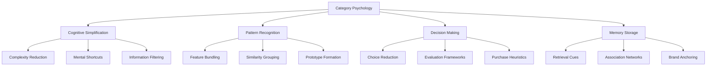
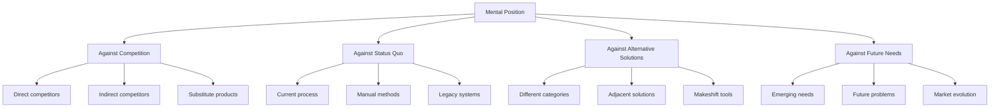
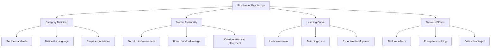
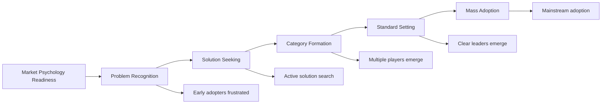
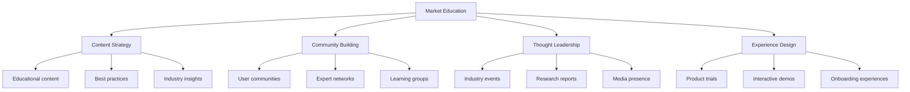
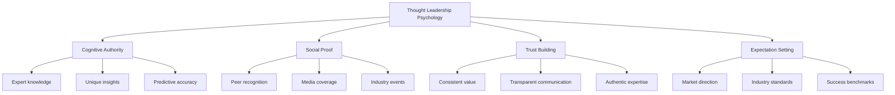
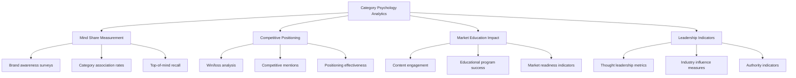

# Chapter 26: The Psychology of Market Categories

> *"The greatest competitive advantage is to create a category where you are the only logical choice. This happens in the mind before it happens in the market."* - Category Design Institute

## Introduction

Creating and owning market categories is one of the most powerful psychological strategies for building billion-dollar SaaS companies. This chapter explores how human psychology shapes market perception, why being first in the mind matters more than being first to market, and how to leverage psychological principles to create, define, and dominate new market categories.

Category psychology isn't just about marketing—it's about fundamentally shaping how customers, investors, employees, and the market think about problems and solutions. When you own the category psychology, you don't just compete for market share; you define what the market is.

## Section 1: Category Creation Psychology

### The Psychology of Categories

Human brains organize information into categories to make sense of complex information:

### Why Categories Matter Psychologically

**Cognitive Load Reduction:**
- Categories simplify complex decisions
- Reduce information processing burden
- Create mental shortcuts for evaluation
- Enable faster decision-making

**Social Proof and Validation:**
- Categories signal market acceptance
- Provide context for value assessment
- Enable peer comparison and validation
- Create industry credibility markers

**Investment and Resource Allocation:**
- Categories attract investor attention
- Define budget allocation frameworks
- Create competitive analysis contexts
- Enable market size estimation

### The Category Creation Framework

**The CATEGORY Framework:**

```mermaid
graph TD
    A[CATEGORY Framework] --> B[C - Create the Problem]
    A --> C[A - Anchor the Solution]
    A --> D[T - Tell the Story]
    A --> E[E - Educate the Market]
    A --> F[G - Generate Ecosystem]
    A --> G[O - Own the Language]
    A --> H[R - Reinforce Leadership]
    A --> I[Y - Yield Network Effects]
    
    B --> B1[Problem definition]
    B --> B2[Pain point articulation]
    B --> B3[Status quo critique]
    
    C --> C1[Solution positioning]
    C --> C2[Unique value prop]
    C --> C3[Differentiation]
    
    D --> D1[Narrative creation]
    D --> D2[Vision articulation]
    D --> D3[Future painting]
    
    E --> E1[Market education]
    E --> E2[Thought leadership]
    E --> E3[Content strategy]
    
    F --> F1[Partner ecosystem]
    F --> F2[Developer community]
    F --> F3[Integration network]
    
    G --> G1[Terminology ownership]
    G --> G2[Concept definition]
    G --> G3[Language evolution]
    
    H --> H1[Category leadership]
    H --> H2[Market share growth]
    H --> H3[Competitive positioning]
    
    I --> I1[Network growth]
    I --> I2[Ecosystem expansion]
    I --> I3[Market dynamics]
```

### Psychological Principles of Category Creation

**1. Problem-Solution Fit in the Mind:**
Before you can own a solution category, you must own the problem definition:

| Problem Definition Level | Psychological Impact | Market Response | Example |
|-------------------------|---------------------|-----------------|---------|
| **Symptom Level** | Temporary relief | Tactical solutions | "Email is overwhelming" |
| **System Level** | Process improvement | Workflow solutions | "Communication is fragmented" |
| **Strategic Level** | Transformation | Platform solutions | "Work collaboration needs reimagining" |
| **Paradigm Level** | Revolutionary change | Category creation | "The future of work is distributed" |

**2. Anchoring and Adjustment:**
The first strong category definition becomes the anchor for all future comparisons:
- First impression advantage
- Comparison framework establishment
- Evaluation criteria setting
- Competitive positioning context

**3. Availability Heuristic:**
Categories that are easily recalled are perceived as more important:
- Memorable naming and messaging
- Consistent market presence
- Thought leadership visibility
- Media coverage and mentions

### Case Study: Salesforce's CRM Category Transformation

Salesforce didn't invent CRM, but they redefined the category:

**Original CRM Category:**
- On-premise software installation
- IT-managed systems
- Complex customization
- Enterprise-only focus

**Salesforce's Category Redefinition:**
- Cloud-based "Software as a Service"
- User-managed systems
- Click-not-code customization
- Democratized CRM access

**Psychological Transformation:**
- **Problem Redefinition:** From "managing customer data" to "growing customer relationships"
- **Solution Repositioning:** From "software" to "platform"
- **Market Expansion:** From IT buyers to business users
- **Category Evolution:** CRM became "Customer Success Platform"

**Results:**
- Created $200B+ SaaS market category
- Maintained category leadership for 20+ years
- Influenced entire software industry transformation
- Built ecosystem of thousands of partners

## Section 2: Positioning and Perception Psychology

### The Psychology of Positioning

Positioning is fundamentally about psychology—it's how you want to exist in the prospect's mind:

**Mental Positioning Framework:**

### Perception Psychology Principles

**1. Contrast Effect:**
How you're perceived depends on what you're compared against:
- Position against weaker alternatives to appear stronger
- Position against complex solutions to appear simple
- Position against expensive options to appear valuable
- Position against outdated methods to appear innovative

**2. Halo Effect:**
Success in one area creates perception of competence in others:
- Category leadership implies overall superiority
- Strong execution suggests future capability
- Market momentum indicates sustainability
- Customer success demonstrates value

**3. Confirmation Bias:**
People seek information that confirms their existing beliefs:
- Align with buyer's existing worldview
- Confirm their suspicions about current solutions
- Validate their vision for the future
- Support their decision-making framework

### The Positioning Psychology Framework

**The POSITION Framework:**

| Element | Psychology | Implementation | Example |
|---------|------------|----------------|---------|
| **P**roblem | Pain amplification | Make status quo unbearable | "Manual processes are killing productivity" |
| **O**pportunity | Hope and aspiration | Paint compelling future vision | "Automate routine work to focus on strategy" |
| **S**olution | Relief and capability | Position as perfect fit | "AI-powered workflow automation" |
| **I**nsight | Authority and credibility | Demonstrate unique understanding | "The future of work is human-AI collaboration" |
| **T**iming | Urgency and momentum | Create sense of now-or-never | "Companies that don't adapt will fall behind" |
| **I**dentity | Self-concept alignment | Connect to buyer identity | "For forward-thinking operations leaders" |
| **O**utcome | Success visualization | Show transformation | "Reduce manual work by 80%" |
| **N**arrative | Coherent story | Tie everything together | "Leading the automation revolution" |

### Perceptual Positioning Strategies

**1. Reframe the Competition:**
- **Direct Reframe:** "We're not just another CRM, we're a revenue operations platform"
- **Category Reframe:** "We're not competing with project management tools, we're creating work intelligence"
- **Problem Reframe:** "The problem isn't collaboration, it's context switching"

**2. Redefine Success Metrics:**
- Shift from feature comparison to outcome comparison
- Emphasize new metrics that favor your solution
- Create measurement frameworks that highlight your advantages
- Establish benchmarks where you excel

**3. Temporal Positioning:**
- **Past:** "Old way vs new way" positioning
- **Present:** "Status quo vs transformation" positioning  
- **Future:** "Where the market is heading" positioning

### Case Study: Slack's Positioning Psychology

Slack repositioned workplace communication:

**Against Email:**
- **Problem Reframe:** Email is async and siloed vs real-time and collaborative
- **Solution Position:** Team communication platform vs messaging tool
- **Outcome Focus:** Team alignment vs message delivery

**Against Enterprise Tools:**
- **User Experience:** Consumer-grade simplicity vs enterprise complexity
- **Implementation:** Ready-to-use vs months of configuration
- **Culture:** Fun and engaging vs formal and rigid

**Psychological Positioning Elements:**
- **Identity Alignment:** "For teams that want to work better together"
- **Problem Amplification:** "Email is where knowledge goes to die"
- **Future Vision:** "The digital workplace transformation"
- **Social Proof:** "Join millions of teams already using Slack"

**Results:**
- Redefined workplace communication category
- Achieved fastest SaaS growth in history
- $27.7 billion acquisition by Salesforce
- Influenced entire workplace software industry

## Section 3: The Psychology of Being First vs Being Better

### First vs Better: The Psychological Reality

The psychological advantage of being first often outweighs the advantage of being better:

**First Mover Psychological Advantages:**

### When Being Better Wins

**Fast Follower Psychological Advantages:**

| Advantage | Psychological Mechanism | Implementation | Example |
|-----------|------------------------|----------------|---------|
| **Learning from Mistakes** | Loss aversion | Avoid first mover errors | Google+ learning from Facebook |
| **Market Education Complete** | Reduced cognitive load | Enter educated market | Dropbox after file sharing existed |
| **Technology Maturity** | Risk reduction | Use proven technology | Notion after wikis and documents |
| **User Frustration** | Problem amplification | Solve first mover limitations | Slack after IRC and enterprise chat |

### The Psychology of Market Timing

**The Market Readiness Framework:**

**Timing Psychology Strategies:**

1. **Too Early (Pioneering):**
   - **Challenge:** Market education burden
   - **Strategy:** Patient capital and education investment
   - **Psychology:** Shape future customer thinking

2. **Perfect Timing (Category Creation):**
   - **Opportunity:** Market ready for solutions
   - **Strategy:** Fast execution and category ownership
   - **Psychology:** Become the obvious choice

3. **Too Late (Fast Following):**
   - **Challenge:** Established competitors
   - **Strategy:** Differentiation and better execution
   - **Psychology:** Disrupt existing category thinking

### Case Study: Being Better vs Being First

**HubSpot vs Marketo (Marketing Automation):**

**Marketo (First Mover - 2006):**
- Created marketing automation category
- Enterprise-focused positioning
- Complex, powerful feature set
- High implementation barriers

**HubSpot (Better Execution - 2006, different positioning):**
- Redefined as "Inbound Marketing"
- SMB-focused positioning
- Simple, integrated approach
- Low barrier to entry

**Psychological Positioning Differences:**

| Aspect | Marketo (First) | HubSpot (Better) |
|--------|----------------|------------------|
| **Problem Definition** | "Need marketing automation" | "Need more leads and customers" |
| **Target Psychology** | Technical marketing users | Business-focused marketers |
| **Complexity Positioning** | "Powerful enterprise tool" | "Marketing made simple" |
| **Success Metrics** | Campaign efficiency | Business growth |

**Results:**
- HubSpot achieved higher valuation ($35B vs $5B acquisition)
- Broader market adoption and brand recognition
- Created larger, more accessible market category
- Demonstrated "better" can beat "first" with right psychology

## Section 4: Market Education Psychology

### The Psychology of Market Education

Market education is about changing how people think, not just what they know:

**Levels of Market Education:**

1. **Awareness:** "There's a problem"
2. **Understanding:** "Here's how to think about the problem"
3. **Evaluation:** "Here's how to evaluate solutions"
4. **Decision:** "Here's how to choose"
5. **Implementation:** "Here's how to succeed"

### Educational Psychology Principles

**Cognitive Learning Theory:**
- Build from existing knowledge
- Use familiar analogies and metaphors
- Provide concrete examples
- Enable hands-on experience

**Social Learning Theory:**
- Learn from peer examples
- Use social proof and case studies
- Provide community learning opportunities
- Create aspirational role models

**Motivation Theory:**
- Connect to personal/professional goals
- Show immediate and long-term benefits
- Remove barriers to learning and trial
- Celebrate progress and achievements

### The Market Education Framework

### Market Education Strategies

**The EDUCATE Framework:**

| Element | Psychology | Implementation | Example |
|---------|------------|----------------|---------|
| **E**ngage | Attention capture | Compelling content | "The hidden cost of..." |
| **D**emonstrate | Proof and credibility | Case studies, data | ROI calculators, success stories |
| **U**ncover | Problem awareness | Pain point articulation | Diagnostic assessments |
| **C**ompare | Decision frameworks | Evaluation criteria | Buyer's guides, comparison charts |
| **A**spirate | Future vision | Transformation stories | "Imagine if..." scenarios |
| **T**rain | Skill development | Educational programs | Certification courses |
| **E**xperience | Hands-on learning | Trial experiences | Free tools, sandbox environments |

### Case Study: Atlassian's Market Education Strategy

Atlassian educated the market on agile development tools:

**Problem Education:**
- **Traditional Pain:** Waterfall development inefficiencies
- **New Framework:** Agile methodology benefits
- **Tool Gap:** Need for agile-specific tools
- **Solution Category:** Agile development platforms

**Educational Tactics:**
- **Content Hub:** Extensive agile resources and guides
- **Community:** User groups and expert networks
- **Events:** Atlassian Summit and local meetups
- **Certification:** Agile training and certification programs

**Psychological Impact:**
- Positioned Atlassian as agile thought leader
- Created language and frameworks for the category
- Built trust through educational value
- Established evaluation criteria favoring their tools

**Results:**
- $24+ billion market valuation
- Dominant position in agile tools market
- Strong developer and team loyalty
- Successful IPO and continued growth

## Section 5: Thought Leadership Psychology

### The Psychology of Thought Leadership

Thought leadership creates psychological authority and trust:

**Authority Psychology Elements:**
- **Expertise:** Deep knowledge demonstration
- **Insight:** Unique perspective sharing
- **Vision:** Future direction articulation
- **Influence:** Market opinion shaping

### Building Thought Leadership Psychology

**The THOUGHT Framework:**

| Element | Psychology | Implementation | Impact |
|---------|------------|----------------|--------|
| **T**iming | First mover advantage | Early trend identification | Market leadership |
| **H**onesty | Authenticity and trust | Transparent communication | Credibility building |
| **O**riginality | Unique value | Fresh perspectives | Differentiation |
| **U**tility | Practical value | Actionable insights | Audience loyalty |
| **G**enerosity | Reciprocity principle | Free valuable content | Relationship building |
| **H**umility | Approachability | Acknowledging limitations | Trust enhancement |
| **T**enacity | Consistency | Regular engagement | Authority establishment |

### Thought Leadership Strategies

**Content Leadership:**
- Original research and data
- Industry trend analysis
- Best practice documentation
- Future vision articulation

**Community Leadership:**
- Industry event speaking
- Expert network participation
- Peer collaboration
- Mentor and advisory roles

**Innovation Leadership:**
- Product innovation showcase
- Technology advancement sharing
- Methodology development
- Standard setting participation

### Case Study: Buffer's Thought Leadership Psychology

Buffer built thought leadership in social media marketing:

**Content Strategy:**
- **Transparency:** Open revenue and metrics sharing
- **Research:** Original social media studies
- **Education:** Free courses and resources
- **Tools:** Free value-first approach

**Community Building:**
- **Blog:** High-value content consistently
- **Podcast:** Industry expert interviews
- **Events:** Social media conferences
- **Network:** Influencer relationships

**Psychological Impact:**
- **Trust:** Transparency built incredible trust
- **Authority:** Data-driven insights established expertise
- **Reciprocity:** Free value created loyalty
- **Social Proof:** Industry recognition reinforced position

**Results:**
- Leading social media management platform
- $100M+ annual recurring revenue
- Strong brand recognition and loyalty
- Industry-wide respect and influence

## Category Psychology Measurement

### Key Performance Indicators

**Category Awareness Metrics:**
- Brand recall in category searches
- Share of voice in industry discussions
- Analyst recognition and rankings
- Media mention frequency and sentiment

**Category Leadership Metrics:**
- Competitive win rates
- Pricing power and premium
- Customer acquisition costs
- Market share growth

**Thought Leadership Metrics:**
- Content engagement rates
- Speaking invitation frequency
- Media interview requests
- Industry award recognition

### Category Psychology Analytics

## Implementation Roadmap

### Phase 1: Category Foundation (Months 1-6)
**Objectives:**
- Define category positioning
- Launch market education initiatives
- Establish thought leadership platform
- Build initial category awareness

**Key Actions:**
1. Conduct category research and positioning
2. Create market education content hub
3. Launch thought leadership content strategy
4. Begin industry engagement and speaking

**Success Metrics:**
- 25% increase in category awareness
- 40% growth in educational content engagement
- 3+ major industry speaking opportunities
- Initial analyst recognition

### Phase 2: Category Building (Months 7-18)
**Objectives:**
- Establish category leadership position
- Build ecosystem and community
- Scale market education efforts
- Achieve industry recognition

**Key Actions:**
1. Launch category-defining events or initiatives
2. Build partner and developer ecosystem
3. Scale content and community programs
4. Establish industry advisory roles

**Success Metrics:**
- Top 3 position in category rankings
- 200% growth in community engagement
- Major analyst/media recognition
- Strong competitive win rates

### Phase 3: Category Dominance (Months 19-36)
**Objectives:**
- Achieve category leadership dominance
- Influence industry standards and practices
- Build sustainable competitive advantages
- Drive category market expansion

**Key Actions:**
1. Lead industry standard setting
2. Acquire or partner with category participants
3. Expand category into adjacent markets
4. Build category-defining platform

**Success Metrics:**
- Clear category leadership position
- Industry standard influence
- Premium pricing power
- Market category expansion

## Common Pitfalls and Solutions

### Pitfall 1: Creating Categories Too Early
**Problem:** Market not ready for new category thinking
**Solution:** Validate market readiness before major investment
**Example:** Time market education with customer pain points

### Pitfall 2: Confusing Category Creation
**Problem:** Complex or unclear category definitions
**Solution:** Simple, memorable category names and explanations
**Example:** Use familiar analogies and clear language

### Pitfall 3: Weak Thought Leadership
**Problem:** Generic content without unique insights
**Solution:** Develop proprietary research and original perspectives
**Example:** Create unique frameworks and methodologies

### Pitfall 4: Inconsistent Messaging
**Problem:** Mixed messages about category positioning
**Solution:** Align all communications around core category story
**Example:** Create messaging framework for entire organization

## Action Items and Next Steps

### Immediate Actions (Next 30 Days)
- [ ] Assess current category positioning and opportunities
- [ ] Identify key category creation opportunities
- [ ] Develop thought leadership content strategy
- [ ] Begin market education content creation

### Short-term Goals (Next 90 Days)
- [ ] Launch category positioning campaign
- [ ] Implement thought leadership initiatives
- [ ] Create market education programs
- [ ] Establish industry engagement strategy

### Long-term Vision (Next Year)
- [ ] Achieve category leadership recognition
- [ ] Build dominant competitive position
- [ ] Influence industry standards and practices
- [ ] Expand category into new markets

## Key Takeaways

1. **Categories exist in the mind first** - psychological positioning creates market reality

2. **Being first in the mind beats being first to market** - category definition matters more than product launch timing

3. **Market education shapes category perception** - invest in teaching the market how to think about problems and solutions

4. **Thought leadership builds psychological authority** - expertise and insight create trust and influence

5. **Language ownership creates category control** - defining the terminology gives you power over the conversation

6. **Community amplifies category psychology** - engaged communities reinforce and spread category thinking

7. **Consistency across all touchpoints is crucial** - mixed messages weaken category positioning

The most successful SaaS companies don't just compete in existing categories—they create new ones where they can be the obvious and only choice. This requires understanding and leveraging the psychology of how markets form, categories develop, and leadership positions are established and maintained.

---

*Next: Part X - Chapter 27 - Psychological Research Methods*

*Previous: Chapter 25 - Psychological Competitive Advantages*
